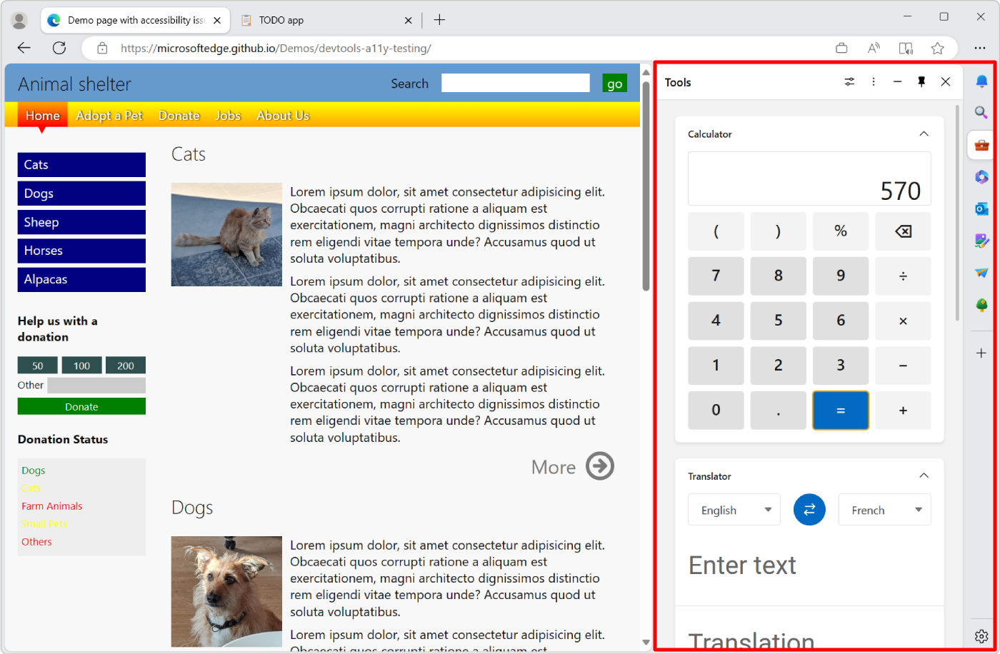

# Develop for the sidebar

The sidebar in Microsoft Edge is a persistent pane located on the side of the browser, which coexists with the primary content of the browser. The sidebar allows users to easily access popular websites and utilities alongside their browser tabs. The content in the sidebar augments the user's primary task by enabling side-by-side browsing and minimizing the need to switch contexts between browser tabs. By using the sidebar in Microsoft Edge, users can access the productivity tools they need while staying in their workflow.

As a developer, you can leverage the sidebar for your own experiences in two ways:

* By adapting your existing Progressive Web App (PWA) to run in the sidebar.
* By making use of the Sidebar API in your Microsoft Edge extension.

<!-- ====================================================================== -->
## Choose the right approach

The two different ways in which you can leverage the sidebar are designed to meet different developer needs. The following are the key differences between sidebar apps and sidebar extensions:

| Aspect | Sidebar app | Sidebar extension |
|---|---|---|
| Term definition | A Progressive Web App (PWA) that runs in the sidebar. | A Microsoft Edge extension that displays content in the sidebar. |
| Distribution | Like a website, the app is hosted on the app's web server. | The extension is distributed through the [Microsoft Edge Add-ons website](https://microsoftedge.microsoft.com/addons/Microsoft-Edge-Extensions-Home). |
| Capabilities | The app can make use of all web APIs and features, as well as PWA capabilities such as offline support, push, or file system access. | The extension can make use of powerful extension APIs, such as reading or modifying the current page. |
| Context | The app runs in its own web context, separate from the main tab. | The extension can access the current webpage and modify the webpage via the extension's content script. |
| Installation | The user installs the app by interacting with the sidebar when visiting the app's website. | The extension is installed by the user from the [Microsoft Edge Add-ons website](https://microsoftedge.microsoft.com/addons/Microsoft-Edge-Extensions-Home). |
| User experience | The app has its own icon in the sidebar. Clicking the icon opens the sidebar if it was closed and displays the app's contents. | The user experience depends on the extension. The extension can open the sidebar depending on the websites the user visits in the browser. |
| Technologies used | Web development and PWA. See [Overview of Progressive Web Apps (PWAs)](../progressive-web-apps-chromium/index.md). | Extension development.  See [Overview of Microsoft Edge extensions](../extensions-chromium/index.md). |

<!-- ====================================================================== -->
## Sidebar apps

Sidebar apps allow you to adapt your existing Progressive Web App (PWA) to securely run alongside other browser tabs for a side-by-side co-browsing experience. This approach is a great choice for web developers who want to offer companion experiences including social, messaging, or media apps that don't require advanced extensions capabilities.

The sidebar app infrastructure helps users discover and install sidebar apps as they browse the web, providing great discoverability for your app just by making a simple change to your web application manifest file. Sidebar apps are a great option if you want to reuse your existing web app for the sidebar in Microsoft Edge and make full use of the web capabilities that are available to PWAs.

To learn more about PWAs and how to create them, see [Overview of Progressive Web Apps (PWAs)](../progressive-web-apps-chromium/index.md). And to learn more about adapting your existing PWA to the sidebar in Microsoft Edge, see [Build PWAs for the sidebar in Microsoft Edge](../progressive-web-apps-chromium/how-to/sidebar.md).

<!-- ====================================================================== -->
## Sidebar extensions

Microsoft Edge extensions can optionally use the sidebar API to show a custom UI in the sidebar in Microsoft Edge. This is in addition to the other places extensions also appear in, such as in the Microsoft Edge toolbar, or as popups.

If your app's experience relies on powerful extensions APIs, for example to read or modify the current page, then a sidebar extension provides these capabilities. Users can find and install these extensions through the [Microsoft Edge Add-ons website](https://microsoftedge.microsoft.com/addons/Microsoft-Edge-Extensions-Home). The Microsoft Edge team continues to evolve these sidebar extensibility models and welcomes your feedback. To leave feedback, [create a new issue](https://github.com/MicrosoftEdge/MSEdgeExplainers/issues/new/) on the repo, or [search for existing issues](https://github.com/MicrosoftEdge/MSEdgeExplainers/issues) and join existing conversations.

To learn more about Microsoft Edge extensions and how to create them, see [Overview of Microsoft Edge extensions](../extensions-chromium/index.md). And to learn more about using the sidebar API in your extension, see [Extensions in the Microsoft Edge sidebar](../extensions-chromium/developer-guide/sidebar.md).
