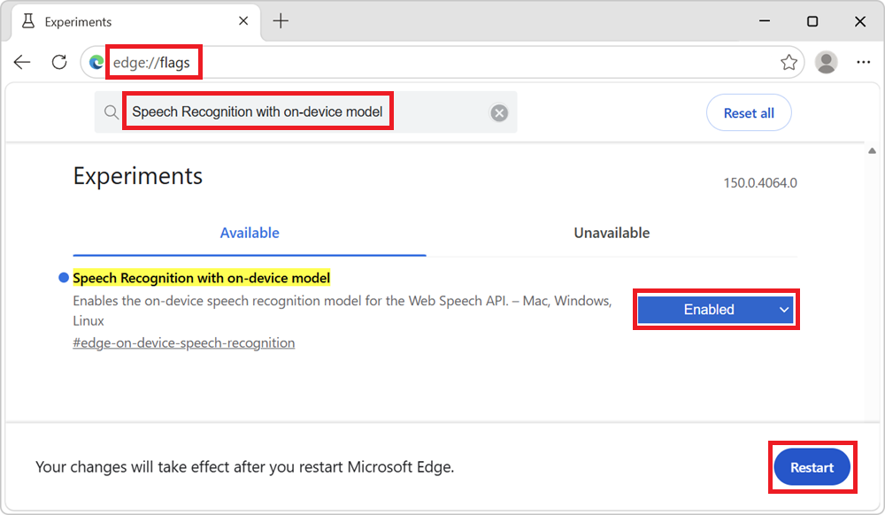
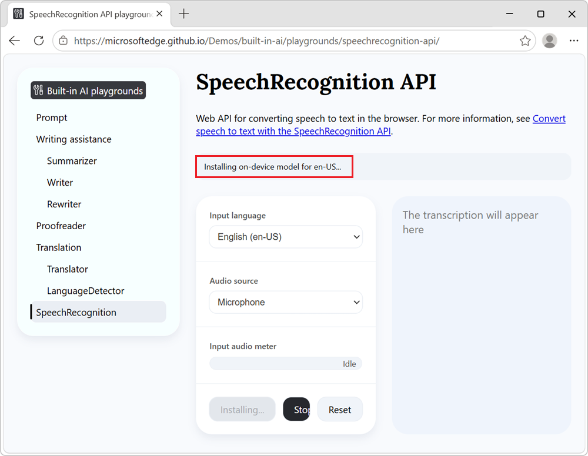
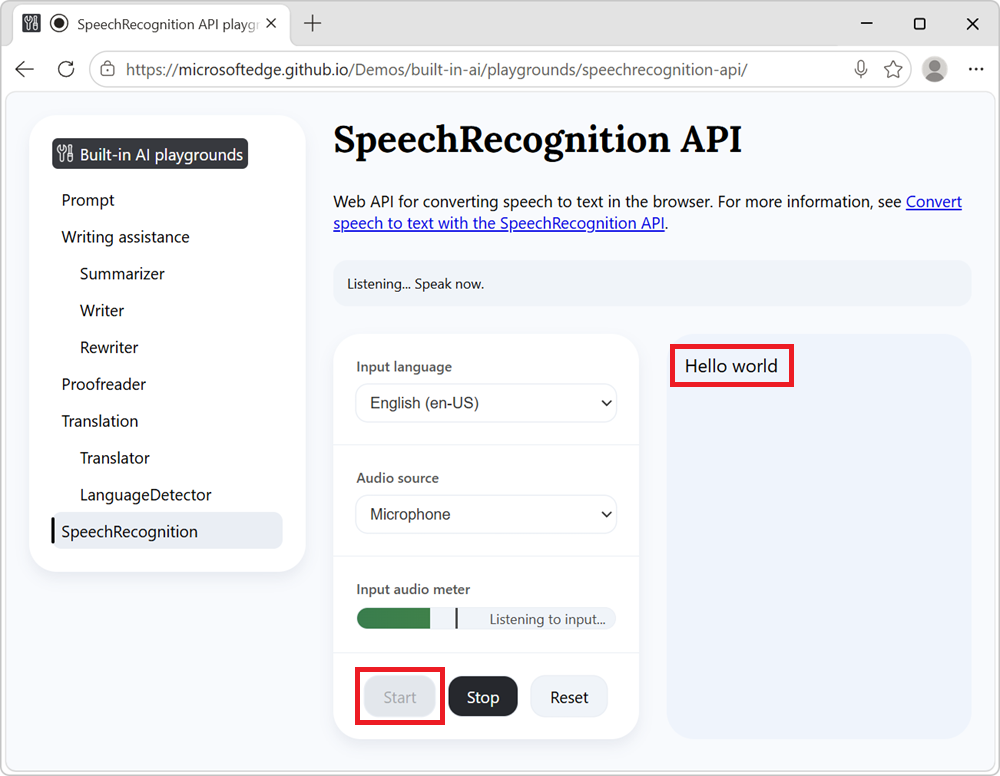

# Convert speech to text with the SpeechRecognition API

The SpeechRecognition API is a standard web API that enables converting speech, from an audio source such as a media file or device microphone, into text, directly from a website's or browser extensions's JavaScript code.  This article focuses on using the SpeechRecognition API with the on‑device (or local) speech recognition model that is built into Microsoft Edge.

For more information about the API, see [Web Speech API](https://developer.mozilla.org/docs/Web/API/Web_Speech_API), at MDN.

**Detailed contents:**
* [Availability of the local speech recognition model](#availability-of-the-local-speech-recognition-model)
* [Benefits of the local speech recognition model](#benefits-of-the-local-speech-recognition-model)
   * [Model availability](#model-availability)
* [Enable local speech recognition in Microsoft Edge](#enable-local-speech-recognition-in-microsoft-edge)
* [See a working example](#see-a-working-example)
* [Use the SpeechRecognition API with local recognition in your website](#use-the-speechrecognition-api-with-local-recognition-in-your-website)
   * [Check if the API is supported and instantiate a SpeechRecognition object](#check-if-the-api-is-supported-and-instantiate-a-speechrecognition-object)
   * [Choose an input language and opt-in to local recognition](#choose-an-input-language-and-opt-in-to-local-recognition)
   * [Check whether the local model is already installed](#check-whether-the-local-model-is-already-installed)
   * [Start speech recognition](#start-speech-recognition)
   * [Stop recognition explicitly and on media end](#stop-recognition-explicitly-and-on-media-end)
* [Send feedback](#send-feedback)
* [See also](#see-also)


<!-- ====================================================================== -->
## Availability of the local speech recognition model

The local speech recognition model is available in Microsoft Edge Canary or Dev (version 150.x.y.z or later).  See [Become a Microsoft Edge Insider](https://www.microsoft.com/edge/download/insider).<!-- todo add correct version and potential flag and hardware requirements -->


<!-- ====================================================================== -->
## Benefits of the local speech recognition model

When using the SpeechRecognition API with the local model in Microsoft Edge, speech recognition happens on the same device where the speech is captured.  This approach has the following benefits compared to cloud-based solutions:

* **Reduced cost:** There's no cost associated with using a cloud recognition service.

* **Network independence:** Beyond the initial model download, there's no network latency when using this API to convert speech, and the API can also be used when the device is offline.

* **Improved privacy:** The speech input into the model never leaves the device, and isn't collected to train AI models.


<!-- ------------------------------ -->
#### Model availability

An initial download of the model is required the first time that a website uses the local speech recognition model with the SpeechRecognition API.

You can monitor the model download by using the promise that's returned by the SpeechRecognition API `install()` method.  See [Check whether the local model is already installed](#check-whether-the-local-model-is-already-installed), below.


<!-- ====================================================================== -->
## Enable local speech recognition in Microsoft Edge

To use the local speech recognition model with the SpeechRecognition API, you need to enable the feature in Microsoft Edge Canary or Dev.  To enable speech recognition using the on-device model:

1. Make sure you're using Microsoft Edge Canary or Dev (version 150.x.y.z or newer)<!-- todo: add correct version -->.  See [Become a Microsoft Edge Insider](https://www.microsoft.com/edge/download/insider).

1. In Microsoft Edge Canary or Dev, open a new tab or window and go to `edge://flags`.

1. In the search box at the top of the page, enter **Speech Recognition with on-device model**.

1. In the **Speech Recognition with on-device model** drop-down list, select **Enabled**, and then click the **Restart** button in the lower right:

   


<!-- ====================================================================== -->
## See a working example

To see the SpeechRecognition API in action and view the demo code:

1. [Enable local speech recognition in Microsoft Edge](#enable-local-speech-recognition-in-microsoft-edge), as described above.

1. In Microsoft Edge Canary or Dev, open a tab or window and go to [SpeechRecognition API playground](https://microsoftedge.github.io/Demos/built-in-ai/playgrounds/speechrecognition-api/).

1. In the information banner at the top, check the status: it initially reads **SpeechRecognition API ready.  Click Start to begin.**

1. In the **Input language** drop-down list, select the language that you want to use for speech recognition.

1. In the **Audio source** drop-down list, select an audio source for speech recognition:

   * Select **Microphone** to use your device microphone as the audio source.
   * Select **File** to use an audio or video file from your device as the audio source.

1. If you selected **File** as the audio source, a **Media file** section is displayed.  Click the **Choose File** button, and then select an audio or video file from your device.

1. Click the **Start** button.

   If you haven't already downloaded the local speech recognition model for the selected language, the download starts and the information banner reads **Installing on-device model for en-US...**:

   

   After the model is installed, the text transcription is displayed in the page:

   

1. To stop converting speech to text, at any time, click the **Stop** button.

   The transcription might also stop automatically after a long period of silence in the input audio.

See also:
* [/built-in-ai/playgrounds/speechrecognition-api/](https://github.com/MicrosoftEdge/Demos/tree/main/built-in-ai/playgrounds/speechrecognition-api) - Source code for the SpeechRecognition API playground demo.


<!-- ====================================================================== -->
## Use the SpeechRecognition API with local recognition in your website

The following sections describe how to use the SpeechRecognition API with local speech recognition in your website's code.  For more details about the API itself, see [Web Speech API](https://developer.mozilla.org/docs/Web/API/Web_Speech_API), at MDN.


<!-- ------------------------------ -->
#### Check if the API is supported and instantiate a SpeechRecognition object

To ensure that the SpeechRecognition API is supported in the browser, test whether the `SpeechRecognition` object is available:

```js
if (!window.SpeechRecognition) {
  console.log("The SpeechRecognition API is not available in this browser.");
} else {
  console.log("The SpeechRecognition API is available.");
}
```

If the API is supported, create a new `SpeechRecognition` instance to start using the API:

```js
const recognition = new SpeechRecognition();
```

See also:
* [SpeechRecognition](https://developer.mozilla.org/docs/Web/API/SpeechRecognition), at MDN.


<!-- ------------------------------ -->
#### Choose an input language and opt-in to local recognition

To configure speech recognition by using a local model, specify an input language and set the `processLocally` option:

```js
recognition.lang = "en-US";
recognition.processLocally = true;
```

As of Microsoft Edge 150.x.y.z TODO, the following input languages are supported for local speech recognition:
* English (en-US)
* German (de-DE)
* Italian (it-IT)
* Portuguese (pt-PT)
* Spanish (es-ES)
* Korean (ko-KR)

Language support is expected to expand in future versions.

Also set the `continuous` and `interimResults` options to `true` to transcribe long audio sessions without stopping and receive interim results:

```js
recognition.continuous = true;
recognition.interimResults = true;
```

See also:
* [SpeechRecognition: lang property](https://developer.mozilla.org/docs/Web/API/SpeechRecognition/lang), at MDN.
* [SpeechRecognition: processLocally property](https://developer.mozilla.org/docs/Web/API/SpeechRecognition/processLocally), at MDN.
* [SpeechRecognition: continuous property](https://developer.mozilla.org/docs/Web/API/SpeechRecognition/continuous), at MDN.
* [SpeechRecognition: interimResults property](https://developer.mozilla.org/docs/Web/API/SpeechRecognition/interimResults), at MDN.


<!-- ------------------------------ -->
#### Check whether the local model is already installed

Before starting recognition, check if the local model is available for your selected language by using the `SpeechRecognition.available()` method.

If the model is not yet installed, trigger the installation by using the `SpeechRecognition.install()` method and wait for the model to complete before starting recognition:

```js
async function ensureModelReady(lang) {
  // Check if the model is already available.
  const availability = await SpeechRecognition.available({
    langs: [lang],
    processLocally: true,
  });

  // If the model is already available, proceed to recognition.
  if (availability === "available") {
    return true;
  }

  // If the model is not available but can be downloaded,
  // trigger the installation and wait for it to complete
  // before proceeding to recognition.
  if (availability === "downloadable" || availability === "downloading") {
    const installed = await SpeechRecognition.install({
      langs: [lang],
      processLocally: true,
    });

    if (!installed) {
      throw new Error(`Failed to install local model for ${lang}.`);
    }

    return true;
  }

   return false;
}
```

The promise returned by `SpeechRecognition.install()` resolves when installation succeeds or fails.

See also:
* [SpeechRecognition: available() static method](https://developer.mozilla.org/docs/Web/API/SpeechRecognition/available_static), at MDN.
* [SpeechRecognition: install() static method](https://developer.mozilla.org/docs/Web/API/SpeechRecognition/install_static), at MDN.


<!-- ------------------------------ -->
#### Start speech recognition

After you've made sure that the API and model are both ready, to start recognition, use the `start()` method.

When called without a parameter, the `start()` method recognizes audio from the user's microphone:

```js
recognition.start();
```

To recognize audio from a media file instead of from the user's microphone, pass a `MediaStreamTrack` instance as an argument to the `start()` method.  For example, you can create a `MediaStreamTrack` instance by creating a `MediaStreamDestinationNode` instance by using the WebAudio API:

```js
const audioContext = new AudioContext();
const mediaStreamDestination = audioContext.createMediaStreamDestination();
recognition.start(mediaStreamDestination.stream.getAudioTracks()[0]);
```

See also:
* [SpeechRecognition: start() method](https://developer.mozilla.org/docs/Web/API/SpeechRecognition/start), at MDN.
* [Web Audio API](https://developer.mozilla.org/docs/Web/API/Web_Audio_API), at MDN.


<!-- ------------------------------ -->
#### Stop recognition explicitly and on media end

To stop recognition, use the `stop()` method:

```js
recognition.stop();
```

You can also choose to stop recognition when the media input ends, by using the `onended` event handler of the media element that you're using as input.  For example, if you're using a `HTMLAudioElement` or `HTMLVideoElement` as the audio source, you can set up the event handler as follows:

```js
mediaElement.onended = () => recognition.stop();
```

See also:
* [SpeechRecognition: stop() method](https://developer.mozilla.org/docs/Web/API/SpeechRecognition/stop), at MDN.


<!-- ====================================================================== -->
## Send feedback

We're interested in hearing your feedback about:
* The local speech recognition model.
* The performance of the local speech recognition model.
* Any other improvements you'd like to see for your use-cases.

Please send feedback, by adding a comment to the [SpeechRecognition API feedback issue](https://github.com/MicrosoftEdge/MSEdgeExplainers/issues/1333).


<!-- ====================================================================== -->
## See also
<!-- all links from article body -->

Microsoft:
* [Become a Microsoft Edge Insider](https://www.microsoft.com/edge/download/insider).

MDN:
* [SpeechRecognition](https://developer.mozilla.org/docs/Web/API/SpeechRecognition)
   * [SpeechRecognition: available() static method](https://developer.mozilla.org/docs/Web/API/SpeechRecognition/available_static)
   * [SpeechRecognition: continuous property](https://developer.mozilla.org/docs/Web/API/SpeechRecognition/continuous)
   * [SpeechRecognition: install() static method](https://developer.mozilla.org/docs/Web/API/SpeechRecognition/install_static)
   * [SpeechRecognition: interimResults property](https://developer.mozilla.org/docs/Web/API/SpeechRecognition/interimResults)
   * [SpeechRecognition: lang property](https://developer.mozilla.org/docs/Web/API/SpeechRecognition/lang)
   * [SpeechRecognition: processLocally property](https://developer.mozilla.org/docs/Web/API/SpeechRecognition/processLocally)
   * [SpeechRecognition: start() method](https://developer.mozilla.org/docs/Web/API/SpeechRecognition/start)
   * [SpeechRecognition: stop() method](https://developer.mozilla.org/docs/Web/API/SpeechRecognition/stop)
* [Web Audio API](https://developer.mozilla.org/docs/Web/API/Web_Audio_API)
* [Web Speech API](https://developer.mozilla.org/docs/Web/API/Web_Speech_API)

GitHub:
* [SpeechRecognition API playground](https://microsoftedge.github.io/Demos/built-in-ai/playgrounds/speechrecognition-api/)
   * [/built-in-ai/playgrounds/speechrecognition-api/](https://github.com/MicrosoftEdge/Demos/tree/main/built-in-ai/playgrounds/speechrecognition-api) - Source code.
* [SpeechRecognition API feedback issue](https://github.com/MicrosoftEdge/MSEdgeExplainers/issues/1333)
