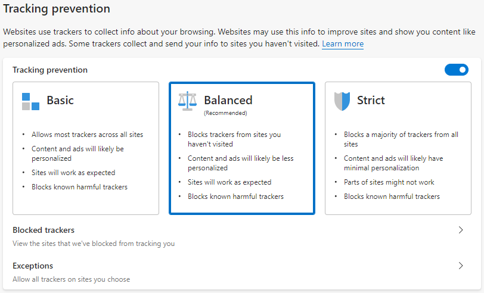
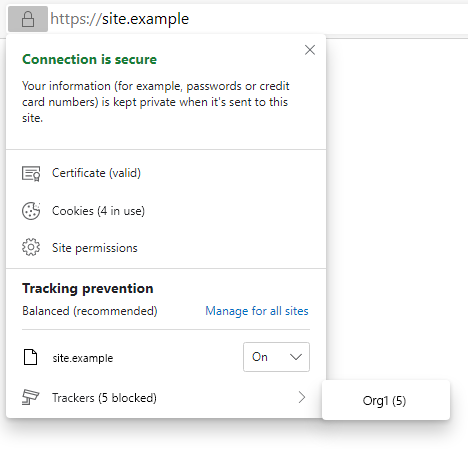

# Tracking Prevention in Microsoft Edge

Microsoft Edge's tracking prevention feature protects users from online tracking by restricting trackers' ability to access browser-based storage as well as the network. It is built to uphold our [browser privacy promise](https://microsoftedgewelcome.microsoft.com/privacy) while also ensuring that there is no impact by default to website compatibility or the economic viability of the web.

We currently offer users three levels of tracking prevention, which can be selected by navigating to `edge://settings/privacy`:

1. **Basic** - The least restrictive level of tracking prevention that is designed for users who enjoy personalized advertisements and who don't mind being tracked on the web. Basic only protects users against malicious trackers.
1. **Balanced (Default)** - The default level of tracking prevention that is designed for users who want to see less creepy advertisements that follow them around the web while they browse. Balanced aims to block trackers from sites that users never engage with while minimizing the risk of compatibility issues on the web.
1. **Strict** - The most restrictive form of tracking prevention that is designed for users who are okay trading website compatibility for maximum privacy.

Our tracking prevention feature is made up of three main components, which work together to determine whether a certain resource from a certain website should be classified as a tracker and blocked. These components are as follows:

1. **Classification** - The way we determine whether a URL belongs to a tracker
1. **Enforcement** - The actions we take to protect our users from URLs classified as trackers
1. **Mitigations** - The mechanisms we provide to ensure users' favorite sites still work, while offering strong default protection

Each of these components will be explored and explained in detail below.

## Classification

The first component of Microsoft Edge's tracking prevention feature is classification. To classify online trackers and group them into categories, Microsoft Edge uses [Disconnect's](https://disconnect.me/) open source [tracking protection lists](https://github.com/disconnectme/disconnect-tracking-protection). These lists are delivered via the "Trust Protection Lists" component, which can be viewed at `edge://components`. Once downloaded, these lists are stored on disk where they can be viewed to determine whether/how a particular URL is classified.

To determine if a URL is considered a tracker by our classification system, we check a series of host names, starting with an exact match and then proceeding to check for partial matches for up to four labels beyond the top-level domain.

**Example**:

URL: `https://a.subdomain.of.a.known.tracker.test/some/path`

Tested host names:

* `a.subdomain.of.a.known.tracker.test`
* `of.a.known.tracker.test`
* `a.known.tracker.test`
* `known.tracker.test`
* `tracker.test`

If any of those host names match with a host name on Disconnect's lists, we proceed with evaluating enforcement actions intended to prevent the user from being tracked.

## Enforcement

To provide protection for our users from tracking actions on the web, we take two enforcement actions against trackers:

* **Restrict storage access** - If a known tracking resource tries to access any web storage where it may try to persist data about the user, we will block that access. This includes restricting the ability for that tracker to get or set cookies as well as access storage APIs such as IndexedDB and localStorage.
* **Block resource loads** - If a known tracking resource is being loaded on a website, we may block that load before the request reaches the network depending on its compatibility impact and the tracking prevention setting a user has set. Blocked loads may include tracking scripts, "pixels", iframes, and more. This prevents any data potentially being sent to the tracking domain and may even improve load times and page performance as a side effect.

Users can find out which trackers were blocked by clicking the page info flyout icon on the left side of the address bar:

How these enforcements are applied depends on what level of tracking prevention a user has selected and the mitigations that may apply. These are both explained in more detail below.

## Mitigations

To ensure that web compatibility is preserved as much as possible, we have introduced three mitigations to help balance our enforcements in certain situations. These are the "Org Relationship Mitigation" and the "Org Engagement Mitigation"

Before diving into the mitigations, it's worth defining the concept of an "Organization" or "Org" for short. Disconnect also maintains a list called [entities.json](https://github.com/disconnectme/disconnect-tracking-protection/blob/master/entities.json) that defines groups of URLs that are owned by the same parent organization/company. Microsoft Edge's tracking prevention feature uses this list in both the "Org Relationship" and "Org Engagement" mitigations to minimize the occurrence of compatibility issues caused by tracking prevention affecting cross-organizational requests.

### Org Relationship Mitigation

Several popular websites maintain websites and Content Delivery Networks (CDNs) to serve static resources and content to those sites. To ensure that these types of scenarios aren't affected by tracking prevention, we will exempt sites from tracking prevention when they are making third-party requests to other sites owned by the same parent organization (as defined by Disconnect's entities.json list). This is best illustrated by an example:

Say that a certain organization, "Org1", owns the domains `org1.test` and `org1-cdn.test` as defined by Disconnect's entities.json list. If a user visits `https://org1.test` and it tries to load a resource from `https://org1-cdn.test`, we won't take any enforcement actions against requests made to `org1-cdn.test` even though it is not a first-party URL. If another URL that's not part of Org1's organization tries to load that same resource, however, then the request would be subject to enforcements because it is not part of the same organization.

It's worth noting that even though this relaxes tracking prevention enforcements for sites that belong to the same organization, it's unlikely that this introduces a high amount of privacy risk since such organizations would likely still be able to track users using their own back-end data. As a result, since there is no privacy mitigation to be had by blocking such trackers, we apply this mitigation in all levels of tracking prevention so that we can try to offer the best browsing experience possible.

### The Compat Exceptions List
Based on recent user feedback we received, we began maintaining a small list of sites (most of which are in Disconnect's Content category) that were breaking due to tracking prevention despite having the above two mitigations in place.

To avoid maintaining this list moving forwards, we are currently working on the [Storage Access API](https://github.com/MicrosoftEdge/MSEdgeExplainers/blob/master/StorageAccessAPI/explainer.md) in the Chromium codebase. This API will give site developers a way to request storage access from users directly, providing users with more transparency into how their privacy settings are affecting their browsing experience and giving them controls to quickly and intuitively unblock themselves.

Once the Storage Access API is implemented, we will deprecate the compat exceptions list and reach out to the affected sites both to make them aware of these issues, and to request that they use the Storage Access API moving forwards.

### Org Engagement Mitigation

The org engagement mitigation was created to minimize compatibility risks introduced by tracking prevention by ensuring that sites owned by organizations that users sufficiently engage with continue to work as expected across the web. It makes use of [site engagement](https://www.chromium.org/developers/design-documents/site-engagement) to relax enforcements whenever a user has established an ongoing relationship (currently defined by a site engagement score of 4.1 or greater) with a given site. This again is best illustrated by an example:

Say that a certain organization, "Social Org" owns the domains `social.example` and `social-videos.example`.

A user will be considered to have a relationship with Social Org if they have established a site engagement score of at least 4.1 with any one of its domains.

If another site, `content-embedder.example`, includes third-party content (say an embedded video from `social-videos.example`) from any of Social Org’s domains that would normally be restricted by tracking prevention enforcements, it will be exempt from them as long as the user’s site engagement score with Social Org’s domains is maintained above the threshold.

If a site does not belong to an organization, a user will need to establish a site engagement score of at least 4.1 with it directly before any storage access/resource load blocks imposed by tracking prevention will be relaxed.

The org engagement mitigation is currently only applied in Balanced mode so that we are still offering the highest possible protections for users who have opted into Strict.

## Current tracking prevention behavior

The following table shows the enforcement actions and mitigations that are applied to each category of classified tracker in Microsoft Edge:

* Along the top are the categories of trackers as defined by [Disconnect’s tracking protection list categories](https://github.com/disconnectme/disconnect-tracking-protection/blob/master/services.json).
* Along the left side are Microsoft Edge's three levels of tracking prevention (Basic, Balanced, and Strict).
* The letter "S" in a cell denotes that storage access is blocked.
* The letter "B" in a cell denotes that both storage access and resource loads (i.e. network requests) are blocked.
* A "-" in a cell denotes that no block will be applied to either storage access or resource loads.

| |Advertizing|Analytics|Content|Cryptomining|Fingerprinting|Social|Other|Same Org Mitigation|Org Engagement Mitigation|
|-|-|-|-|-|-|-|-|-|-|-|
|**Basic**|-|-|-|B|B|-|-|Enabled|N/A|
|**Balanced**|S|-|S|B|B|S|S|Enabled|Enabled|
|**Strict**|B|B|S|B|B|B|B|Enabled|Disabled

> [!NOTE]
> The org engagement mitigation does not apply to the Cryptomining or Fingerprinting categories

> [!TIP]
> Strict mode blocks more resource loads than Balanced. This can result in Strict mode appearing to block less tracking requests than Balanced since the trackers making the requests are never even loaded to begin with.

> [!NOTE]
> The Fingerprinting column above refers to trackers that are solely on the Fingerprinting list. Trackers that appear on the Fingerprinting list as well as another list are blocked according to the other lists they appear on as they are considered non-malicious fingerprinters.

### InPrivate behavior
In Microsoft Edge 79, the default behavior was to apply Strict mode protections in InPrivate. In Microsoft Edge 80, this behavior was replaced by a switch in `edge://settings/privacy` that will allow users to decide whether to apply Strict mode protections or to keep their regular settings while browsing InPrivate.

## Determining whether/how a particular URL is classified

The easiest way to determine whether a certain URL is classified as a known tracker is to perform the following steps:

1. Open DevTools and navigate to the Console tab
1. Reload the page
    1. You may want to clear "Cookies and other site data" first to reset site engagement scores and ensure a completely clean slate
1. Look for any messages that read `Tracking Prevention blocked access to storage for <URL>.`
    1. You can expand these messages to see the individual URLs that were blocked
1. If you need to determine which category a specific blocked site is in, the easiest way to do this is to search for it on [Disconnect's services.json list](https://github.com/disconnectme/disconnect-tracking-protection/blob/master/services.json). The entries are alphabetized, so scrolling to the top of a block of site entries will let you to find the specific category that a particular site is in

> [!TIP]
If you need to access the tracking prevention lists that are stored on disk, they can be found in one of two locations:
>
> **Component-based updates** - These are the lists that are downloaded from the "Trust Protection Lists" component
>
> _Windows_: %LOCALAPPDATA%\Microsoft\Edge \<OptionalChannelName\>\User Data\Trust Protection Lists
>
> _macOS_: ~/Library/Application Support/Microsoft Edge \<OptionalChannelName\>/Trust Protection Lists
>
> **Installation directory** - These are the lists that are bundled with the Microsoft Edge Installer. Please note that if you selected a different installation directory, your exact paths may be different.
>
> _Windows_: %PROGRAMFILES(x86)%\Microsoft\ Edge \<OptionalChannelName\>\Application\<Version\>\Trust Protection Lists
>
> _macOS_: /Applications/Microsoft Edge.app/Contents/Frameworks/Microsoft Edge Framework.framework/Libraries/Trust Protection Lists
