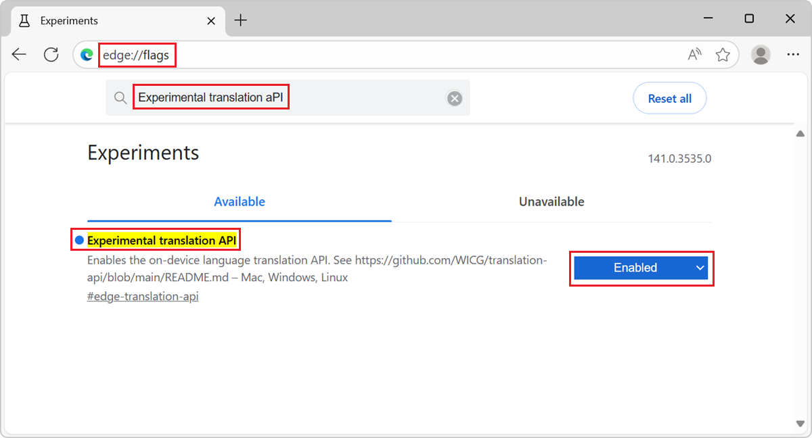
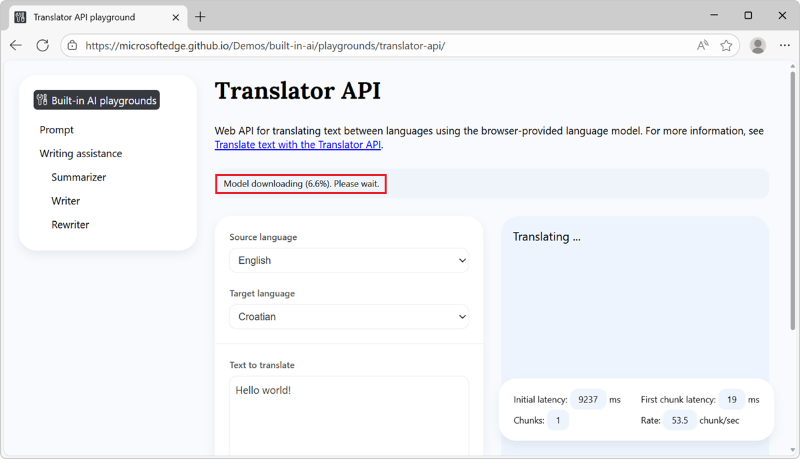
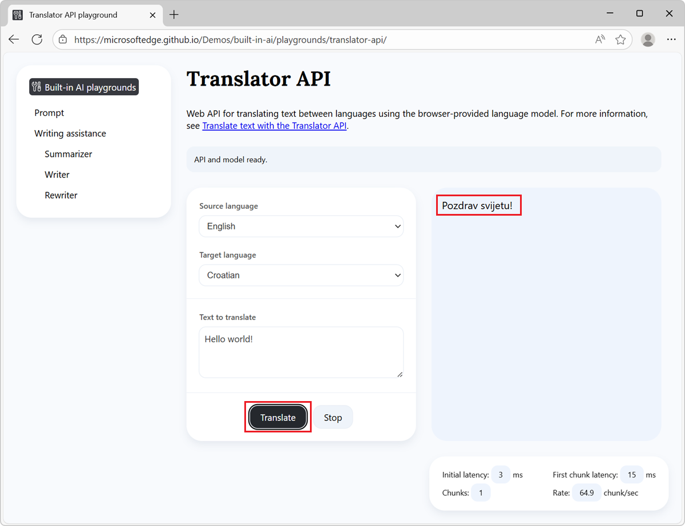

# Translate text with the Translator API
<!-- aka.ms/translatorapi -->

The Translator API is an experimental web API that allows you to translate text between different languages by using an expert model that's built into Microsoft Edge, from JavaScript code in your website or browser extension.

See:
* [Translator and Language Detector APIs](https://webmachinelearning.github.io/translation-api/)
* [Explainer for the Translator and Language Detector APIs](https://github.com/webmachinelearning/translation-api)

**Detailed contents:**
<!-- https://github.com/captainbrosset/WebToc -->

  * [Availability of the Translator API](#availability-of-the-translator-api)
  * [Benefits of the Translator API](#benefits-of-the-translator-api)
  * [Alternatives to the Translator API](#alternatives-to-the-translator-api)
  * [Disclaimer](#disclaimer)
  * [Model availability](#model-availability)
  * [Enable the Translator API](#enable-the-translator-api)
  * [See a working example](#see-a-working-example)
  * [Use the Translator API](#use-the-translator-api)
  * [Check if the Translator API is enabled](#check-if-the-translator-api-is-enabled)
  * [Check if the model can be used (availability())](#check-if-the-model-can-be-used-availability)
  * [Create a new session (create())](#create-a-new-session-create)
  * [Monitor the progress of the model download (monitor:)](#monitor-the-progress-of-the-model-download-monitor)
  * [Run the Translator API (translate())](#run-the-translator-api-translate)
      * [Wait for the text to be translated (translate())](#wait-for-the-text-to-be-translated-translate)
      * [Display tokens as they are generated (translateStreaming())](#display-tokens-as-they-are-generated-translatestreaming)
  * [Stop translating text (abortController.signal)](#stop-translating-text-abortcontrollersignal)
  * [Destroy a session (destroy())](#destroy-a-session-destroy)
      * [Destroy a session by calling destroy()](#destroy-a-session-by-calling-destroy)
      * [Destroy a session by using AbortController](#destroy-a-session-by-using-abortcontroller)
  * [Send feedback](#send-feedback)
  * [See also](#see-also)


<!-- ====================================================================== -->
## Availability of the Translator API

The Translator API is available as a developer preview in the Microsoft Edge Canary or Dev channels, starting with version 143.0.3636.0.  To download a preview channel of Microsoft Edge (Beta, Dev, or Canary), go to [Become a Microsoft Edge Insider](https://www.microsoft.com/edge/download/insider).


<!-- ====================================================================== -->
## Benefits of the Translator API

The Translator API uses an expert model for machine translation that runs on the same device where the inputs to and outputs of the model are used (that is, locally).  This approach has the following benefits compared to cloud-based solutions:

* **Reduced cost:** There's no cost associated with using a cloud translation service.

* **Network independence:** Beyond the initial model download, there's no network latency when using this API to translate text, and the API can also be used when the device is offline.

* **Improved privacy:** The data input into the model never leaves the device, and isn't collected to train AI models.

The translation models for specified language pairs are downloaded the first time the API is used in Microsoft Edge, and are subsequently shared across all websites in the browser.  The models are accessed via a straightforward web API that doesn't require knowledge of third-party frameworks, and doesn't require Artificial Intelligence (AI) or Machine Learning (ML) expertise.


<!-- ====================================================================== -->
## Alternatives to the Translator API

You can send network requests to cloud-based translation services with more sophisticated capabilities, including neural translation; see [Azure AI Translator documentation](/azure/ai-services/translator/).

As an on-device alternative, the Prompt API serves more custom, multi-language prompt-engineering scenarios, with a small language model that's built into Microsoft Edge; see [Prompt a built-in language model with the Prompt API](./prompt-api.md).


<!-- ====================================================================== -->
## Disclaimer

Like other machine translation models, the expert models in Microsft Edge can potentially produce translations that are unfair, unreliable, or offensive.  To learn more about the limitations of these machine translation models, see [Limitations](/azure/ai-foundry/responsible-ai/translator/transparency-note#limitations) in _Azure AI Translator Transparency Note_.


<!-- ====================================================================== -->
## Model availability

An initial download of the model will be required the first time a website calls a built-in AI API.  You can monitor the model download by using the monitor option when creating a new Translator API session; see [Monitor the progress of the model download (monitor:)](#monitor-the-progress-of-the-model-download-monitor), below.


<!-- ====================================================================== -->
## Enable the Translator API

To use the Translator API in Microsoft Edge, set two flags, as follows:

1. In Microsoft Edge, go to `edge://version`, and make sure you're using version 143.0.3636.0 or later of Microsoft Edge, such as the Canary or Dev preview channel of Microsoft Edge.

   To download a preview channel of Microsoft Edge (Beta, Dev, or Canary), go to [Become a Microsoft Edge Insider](https://www.microsoft.com/edge/download/insider).

1. In that version of Microsoft Edge, open a new tab or window and go to `edge://flags`.

1. In the **Search flags** text box at the top, start typing **translation api**:

   

   The following flags are listed:

   * **Experimental translation API** - Enables the on-device language translation API.  See [Explainer for the Translator and Language Detector APIs](https://github.com/webmachinelearning/translation-api/blob/main/README.md).

      This entry shows `#edge-translation-api`, which goes to `edge://flags/#edge-translation-api`.

   * **Translation API streaming split by sentence** - When enabled, the translation API will split text by sentence and stream each translated sentence as it completes, providing better responsiveness for long text translation.

      This entry shows `#edge-translation-api-streaming-by-sentence`, which goes to `edge://flags/#edge-translation-api-streaming-by-sentence`.

1. Under **Experimental translation API**, select **Enabled**.

1. Under **Translation API streaming split by sentence**, select **Enabled**.

   In the lower right, a **Restart** button is displayed.

1. Click the **Restart** button.


<!-- ====================================================================== -->
## See a working example

To see the Translator API in action, and review existing code that uses these APIs:

1. [Enable the Translator API](#enable-the-translator-api), as described above.

1. In Microsoft Edge Canary or Dev, go to the [Translator API playground](https://microsoftedge.github.io/Demos/built-in-ai/playgrounds/translator-api/) in a new window or tab.

1. In the information banner at the top, check the status: it initially reads: **On-device API and model downloadable. The model for a specified language pair will be downloaded the first time the API is used.**

1. In the **Text to translate** text box, enter text to translate, and optionally change the **Source language** and **Target language** values.

1. Click the **Translate** button.

   If the model for the specified language pair hasn't been downloaded before, the download starts.
   
   
   
   If the model download doesn't start, restart Microsoft Edge and try again.

   After the model has downloaded, the model starts generating a translation of the text from the source language into the target language.

   The output is generated in the response section of the page:

   

1. To stop generating the response, at any time, click the **Stop** button.

See also:
* [/built-in-ai/](https://github.com/MicrosoftEdge/Demos/tree/main/built-in-ai/) - Source code and Readme for the Built-in AI playgrounds demo.


<!-- ====================================================================== -->
## Use the Translator API
<!-- leverage high-value h2s below -->

The next sections are about using the Translator API.


<!-- ====================================================================== -->
## Check if the Translator API is enabled

Before using the Translator API in your website's code, check that the API is enabled by testing the presence of the `Translator` object:

```javascript
if (!Translator) {
  // The Translator API is not available.
} else {
  // The Translator API is available.
}
```


<!-- ====================================================================== -->
## Check if the model can be used (`availability()`)

The Translator API has the following requirements:

* Translating from the specified source language to the specified target language must be supported.
* The translation model for the language pair and the model runtime must already have been downloaded by Microsoft Edge.

To check if the API can be used, call `availability()`:

```javascript
const availability = await Translator.availability({
  sourceLanguage: "en",
  targetLanguage: "es"
});

if (availability == "unavailable") {
  // The model is not available.
}

if (availability == "downloadable" || availability == "downloading") {
  // The model can be used, but it needs to be downloaded first.
}

if (availability == "available") {
  // The model is available and can be used.
}
```

For `sourceLanguage` and `targetLanguage`, use the language codes in [Tags for Identifying Languages](https://datatracker.ietf.org/doc/html/rfc5646), as strings.


<!-- ====================================================================== -->
## Create a new session (`create()`)

Creating a session instructs the browser to load the language model in memory, so that it can be used.  Before you can translate text, create a new session by using the `create()` method and specify the source and target languages:

```javascript
// Create a Translator session.
const session = await Translator.create({
  sourceLanguage: "en",
  targetLanguage: "es"
});
```

You can monitor the model download by using the `monitor` option, as follows.


<!-- ====================================================================== -->
## Monitor the progress of the model download (`monitor:`)

You can follow the progress of the model download by using the `monitor` option.  This is useful when the model has not yet been fully downloaded onto the device where it will be used, to inform users of your website that they should wait.

```javascript
// Create a Translator session with the monitor option to monitor the model
// download.
const session = await Translator.create({
  sourceLanguage: "en",
  targetLanguage: "es",
  monitor: m => {
    // Use the monitor object argument to add an listener for the 
    // downloadprogress event.
    m.addEventListener("downloadprogress", event => {
      // The event is an object with the loaded and total properties.
      if (event.loaded == event.total) {
        // The model is fully downloaded.
      } else {
        // The model is still downloading.
        const percentageComplete = (event.loaded / event.total) * 100;
      }
    });
  }
});
```


<!-- ====================================================================== -->
## Run the Translator API (`translate()`)

After you have created a model session, you can translate text.  The Translation API provides two methods to translate text:

<!-- <summary> bubbled up from sections below -->
* `translatorSession.translate()` returns a promise, which resolves after the text has been translated.
* `translatorSession.translateStreaming()` immediately returns a stream object, which you can use to display the translated text, token-by-token, as it is being generated.

Details are below.


<!-- ------------------------------ -->
#### Wait for the text to be translated (`translate()`)

<!-- <summary> -->
Translates text.  Returns a promise, which resolves after the text has been translated.

<!-- <description> -->
To wait for the text to be fully translated before continuing to run code, use the `translate()` asynchronous method.  This method returns a promise that resolves after the API has finished generating text:

```javascript
// Create a Translator session.
const translatorSession = await Translator.create({
  sourceLanguage: "en",
  targetLanguage: "es"
});

// Translate the text and wait for the translation to be done.
const translatedText = await translatorSession.translate(sourceText);

// Use the translation.
console.log(translatedText);
```


<!-- ------------------------------ -->
#### Display tokens as they are generated (`translateStreaming()`)

<!-- <summary> -->
Translates text.  Immediately returns a stream object, which you can use to display the translated text, token-by-token, as it is being generated.

<!-- <description> -->
To display the tokens as they are being generated, use this streaming method.  The `translateStreaming()` method returns a stream object immediately.  Use the returned stream object to display the response tokens as they are being generated:

```javascript
// Create a Translator session.
const translatorSession = await Translator.create({
  sourceLanguage: "en",
  targetLanguage: "es"
});

// Ask the model to translate text.
const stream = translatorSession.translateStreaming(sourceText);

// Use the stream object to display tokens that are generated by the model, as
// they are being generated.
for await (const chunk of stream) {
  console.log(chunk);
}
```


<!-- ====================================================================== -->
## Stop translating text (`abortController.signal`)

To stop translating text before the promise or stream returned by the above methods have resolved or ended, use an `AbortController` signal:

```javascript
// Create a Translator session.
const translatorSession = await Translator.create({
  sourceLanguage: "en",
  targetLanguage: "es"
});

// Create an AbortController object.
const abortController = new AbortController();

// Use the model session to translate some text and pass the AbortController
// object by using the signal option.
const stream = translatorSession.translateStreaming(sourceText, {
    signal: abortController.signal
});

// Later, perhaps when the user presses a "Stop" button, call the abort()
// method on the AbortController object to stop translating text.
abortController.abort();
```


<!-- ====================================================================== -->
## Destroy a session (`destroy()`)

After translating text, destroy the session to let the browser know that you don't need the language model anymore, so that the model can be unloaded from memory.

You can destroy a session in two different ways:
* By using the `destroy()` method.
* By using an `AbortController`.

Details are below.


<!-- ------------------------------ -->
#### Destroy a session by calling `destroy()`

To destroy a session by calling `destroy()` with a `Translator` session:

```javascript
const session = await Translator.create({
  sourceLanguage: "en",
  targetLanguage: "es"
});

// Later, destroy the session by using the destroy method.
session.destroy();
```


<!-- ------------------------------ -->
#### Destroy a session by using `AbortController`

To destroy a session by creating an `AbortController` object, create a `Translator` session, and then call `abort()`:

```javascript
// Create an AbortController object.
const controller = new AbortController();

// Create a Translator session and pass the 
// AbortController object by using the signal option.
const session = await Translator.create({
  sourceLanguage: "en",
  targetLanguage: "es",
  signal: controller.signal
});

// Later, perhaps when the user interacts with the UI, destroy the session by
// calling the abort() function of the AbortController object.
controller.abort();
```


<!-- ====================================================================== -->
## Send feedback

We're very interested in learning about the range of scenarios for which you intend to use the Translator API, any issues with the API or expert model, and whether other task-specific, built-in APIs would be useful.

To send feedback about your scenarios and the tasks you want to achieve, please add a comment to [the Translator API feedback issue](https://github.com/MicrosoftEdge/MSEdgeExplainers/issues/XYZ)<!-- todo: create a new feedback issue url/template -->, or [Report an issue about the Translator API in Microsoft Edge](https://github.com/MicrosoftEdge/MSEdgeExplainers/issues/XYZ)<!-- todo: create a new feedback issue url/template; https://github.com/MicrosoftEdge/MSEdgeExplainers/pull/1158 -->.

If you notice any issues when using the API instead, please [report it on the repo](https://github.com/MicrosoftEdge/MSEdgeExplainers/issues/new?template=translator-api.md).

You can also contribute to the discussion about the design of the Translator API at the W3C Web Machine Learning Working Group repository, [webmachinelearning / translation-api](https://github.com/webmachinelearning/translation-api).


<!-- ====================================================================== -->
## See also
<!-- all links in article -->

<!-- Local: -->
* [Prompt a built-in language model with the Prompt API](./prompt-api.md)
* [Summarize, write, and rewrite text with the Writing Assistance APIs](./writing-assistance-apis.md)

Get Microsoft Edge:
* [Become a Microsoft Edge Insider](https://www.microsoft.com/edge/download/insider) - download a preview channel of Microsoft Edge (Beta, Dev, or Canary).

GitHub:
* [webmachinelearning / translation-api](https://github.com/webmachinelearning/translation-api) repo.
   * [Explainer for the Translator and Language Detector APIs](https://github.com/webmachinelearning/translation-api/blob/main/README.md)
* [Translator and Language Detector APIs](https://webmachinelearning.github.io/translation-api/)
   * [Tags for Identifying Languages](https://datatracker.ietf.org/doc/html/rfc5646) - for `sourceLanguage` and `targetLanguage`.

Azure docs:
* [Azure AI Translator documentation](/azure/ai-services/translator/)
* [Limitations](/azure/ai-foundry/responsible-ai/translator/transparency-note#limitations) in _Azure AI Translator Transparency Note_.

Demos repo:
* [Translator API playground](https://microsoftedge.github.io/Demos/built-in-ai/playgrounds/translator-api/)
* [/built-in-ai/](https://github.com/MicrosoftEdge/Demos/tree/main/built-in-ai/) - Source code and Readme for the Built-in AI playgrounds demo.

Feedback:
* [Report an issue about the Translator API in Microsoft Edge](https://github.com/MicrosoftEdge/MSEdgeExplainers/issues/XYZ)<!-- todo: create a new feedback issue url/template; https://github.com/MicrosoftEdge/MSEdgeExplainers/pull/1158 -->.
* [Report a Translator API issue on the repo](https://github.com/MicrosoftEdge/MSEdgeExplainers/issues/new?template=translator-api.md)<!-- todo: https://github.com/MicrosoftEdge/MSEdgeExplainers/pull/1158/files --> - issues when using the API.
