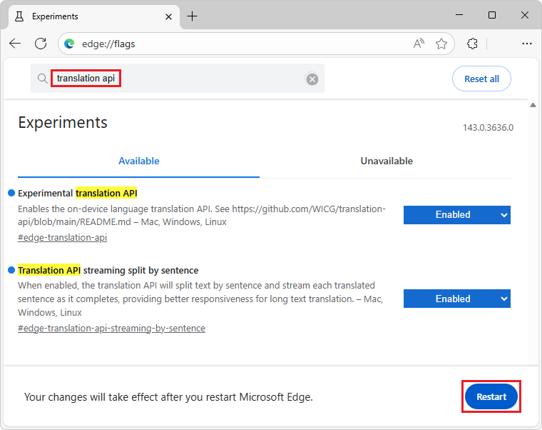

# Translate text with the Translator API
<!-- todo: create a short link like https://aka.ms/edge-translator-api-docs -->

The Translator API is an experimental web API that allows you to translate text between two different languages by using a small language model (SLM) that is built into Microsoft Edge, from JavaScript code in your website or browser extension.

For introductory information, see [Translator and Language Detector APIs](https://webmachinelearning.github.io/translation-api/).


**Detailed contents:**

* [Availability of the Translator API](#availability-of-the-translator-api)
* [Benefits of the Translator API](#benefits-of-the-translator-api)
* [Alternatives to the Translator API](#alternatives-to-the-translator-api)
* [The Phi-4-mini model](#the-phi-4-mini-model)
    * [Disclaimer](#disclaimer)
    * [Hardware requirements](#hardware-requirements)
    * [Model availability](#model-availability)
* [Enable the Translator API](#enable-the-translator-api)
* [See a working example](#see-a-working-example)
* [Use the Translator API](#use-the-translator-api)
    * [Check if the API is enabled](#check-if-the-api-is-enabled)
    * [Check if the model can be used](#check-if-the-model-can-be-used)
    * [Create a new session](#create-a-new-session)
        * [Monitor the progress of the model download](#monitor-the-progress-of-the-model-download)
    * [Run the Translator API](#run-the-translator-api)
        * [Wait for the text to be translated](#wait-for-the-text-to-be-translated)
        * [Display tokens as they are generated](#display-tokens-as-they-are-generated)
    * [Stop translating text](#stop-translating-text)
    * [Destroy a session](#destroy-a-session)
        * [Destroy a session by using the destroy() method](#destroy-a-session-by-using-the-destroy-method)
        * [Destroy a session by using an AbortController](#destroy-a-session-by-using-an-abortcontroller)
* [Send feedback](#send-feedback)
* [See also](#see-also)


<!-- ====================================================================== -->
## Availability of the Translator API

The Translator API is available as a developer preview in the Microsoft Edge Canary or Dev channels, starting with version 1234<!-- todo: fix version # -->.

The Translator API is optimized for translating text content.


<!-- ====================================================================== -->
## Benefits of the Translator API

The Translator API uses a small language model (SLM) that runs on the same device where the inputs to and outputs of the model are used (that is, locally).  This approach has the following benefits compared to cloud-based solutions:

* **Reduced cost:** There's no cost associated with using a cloud AI service.

* **Network independence:** Beyond the initial model download, there's no network latency when prompting the model, and <!-- todo: specify subject word: this API? --> may also be used when the device is offline.

* **Improved privacy:** The data that's input into the model never leaves the device, and isn't collected to train AI models.

The Translator API use a model that's provided by Microsoft Edge and is built into the browser.  This model has some additional benefits over custom local solutions such as WebGPU, WebNN, or WebAssembly:

* **Shared one-time cost:** The browser-provided model is downloaded the very first time the API is called and shared across all websites that run in the browser.  This reduces network costs for the developer and user.

* **Simplified usage for web developers:** The built-in model can be run by using straightforward web APIs, and doesn't require Artificial Intelligence (AI) or Machine Learning (ML) expertise, or using third-party frameworks.


<!-- ====================================================================== -->
## Alternatives to the Translator API

As an alternative, the Prompt API serves more custom prompt-engineering scenarios; see [Prompt a built-in language model with the Prompt API](./prompt-api.md).

To leverage AI capabilities in websites and browser extensions, you can instead use the following methods:

* Send network requests to cloud-based AI services, such as [Azure AI solutions](https://azure.microsoft.com/solutions/ai).

* Run local AI models by using the [Web Neural Network (WebNN) API](https://webmachinelearning.github.io/webnn-intro/) or [ONNX Runtime for Web](https://onnxruntime.ai/docs/tutorials/web/).


<!-- ====================================================================== -->
## The Phi-4-mini model
<!-- todo: is the Translator API also using Phi-4-mini?  is this section relevant? -->

The Prompt API allows you to prompt Phi-4-mini.  Phi-4-mini is a powerful small language model (SLM) that excels at text-based tasks, and is built into Microsoft Edge.

To learn more about Phi-4-mini and its capabilities, see the [Phi-4-mini-instruct](https://huggingface.co/microsoft/Phi-4-mini-instruct) Model Card.


<!-- ------------------------------ -->
#### Disclaimer

Like other language models, the Phi family of models can potentially behave in ways that are unfair, unreliable, or offensive.  To learn more about the model's AI considerations, see [Responsible AI Considerations](https://huggingface.co/microsoft/Phi-4-mini-instruct#responsible-ai-considerations) in the Model Card for Phi-4-mini-instruct.


<!-- ------------------------------ -->
#### Hardware requirements

The Translator API developer preview is intended to work on devices with hardware capabilities that produce SLM outputs with predictable quality and latency.

<!-- todo: any other requirements? -->
The Translator API is currently limited to:

* **Operating system:** Windows 10 or 11 and macOS 13.3 or later.

* **Storage:** At least 20 GB available on the volume that contains your Edge profile.  If the available storage drops below 10 GB, the model will be deleted to ensure that other browser features have sufficient space to function.

* **GPU:** 5.5 GB of VRAM or more.

* **Network:** Unlimited data plan or unmetered connection.  The model is not downloaded if using a metered connection.

To check if your device supports the Translator API developer preview, see [Enable the Translator API](#enable-the-translator-api) below and check your device performance class.

Due to the experimental nature of the Translator API, you might observe issues on specific hardware configurations.  If you see issues on specific hardware configurations, please provide feedback by [opening a new issue](https://github.com/MicrosoftEdge/MSEdgeExplainers/issues/new?template=translator-api.md) at the MSEdgeExplainers repository.


<!-- ------------------------------ -->
#### Model availability

An initial download of the model will be required the first time a website calls a built-in AI API.  You can monitor the model download by using the monitor option when creating a new Translator API session.  To learn more, see [Monitor the progress of the model download](#monitor-the-progress-of-the-model-download), below.


<!-- ====================================================================== -->
## Enable the Translator API

To use any of the Translator API in Microsoft Edge:

1. Make sure you're using the latest version of Microsoft Edge Canary or Dev (version 138.0.3309.2 or newer<!-- todo: add correct version -->).  See [Become a Microsoft Edge Insider](https://www.microsoft.com/edge/download/insider).

1. In Microsoft Edge Canary or Dev, open a new tab or window and go to `edge://flags/`.

1. In the search box, at the top of the page, enter **Experimental translation API**.

   The page is filtered to show the matching flag.

1. Under **Experimental translation API**, select **Enabled**:

   

1. Optionally, to log information locally that may be useful for debugging issues, also enable the **Enable on device AI model debug logs** flag.

1. Restart Microsoft Edge Canary or Dev.

1. To check if your device meets the hardware requirements for the Translator API developer preview, open a new tab, go to `edge://on-device-internals`, and check the **Device performance class** value.

   If your device performance class is **High** or greater, the Translator API should be supported on your device.  If you continue to notice issues, please [file a new issue](https://github.com/MicrosoftEdge/MSEdgeExplainers/issues/new?template=translator-api.md).


<!-- ====================================================================== -->
## See a working example

To see the Translator API in action, and review existing code that uses these APIs:

1. [Enable the Translator API](#enable-the-translator-api), as described above.

1. In Microsoft Edge Canary or Dev, go to the [Translator API playground](https://microsoftedge.github.io/Demos/built-in-ai/playgrounds/translator-api/) in a new window or tab.

1. In the information banner at the top, check the status: it initially reads **On-device API and model downloadable. The model will be downloaded the first time the API is used.**

1. Enter text to translate in the **Text to translate** text box, and optionally change the **Source language** and **Target language** values.

1. Click the **Translate** button.

   If the model hasn't been downloaded before, the download starts.
   
   
   
   If the model download doesn't start, restart Microsoft Edge and try again.

   The Translator API is only supported on devices that meet certain hardware requirements.  See [Hardware requirements](#hardware-requirements), above.

   After the model has downloaded, the model starts generating a translation of the text from the source language into the target language.

   The output is generated in the response section of the page:

   

1. To stop generating the response, at any time, click the **Stop** button.

See also:
* [/built-in-ai/](https://github.com/MicrosoftEdge/Demos/tree/main/built-in-ai/) - Source code and Readme for the Built-in AI playgrounds demo.


<!-- ====================================================================== -->
## Use the Translator API


<!-- ------------------------------ -->
#### Check if the API is enabled

Before using the Translator API in your website's code, check that the API is enabled by testing the presence of the `Translator` object:

```javascript
if (!Translator) {
  // The Translator API is not available.
} else {
  // The Translator API is available.
}
```


<!-- ------------------------------ -->
#### Check if the model can be used

The Translator API has the following requirements:

* The device must support running the model.
* The language model and the model runtime must already have been downloaded by Microsoft Edge.
* Translating from the specified source language to the specified target language must be supported by the model.

To check if the API can be used, call `availability()`:

```javascript
const availability = await Translator.availability({
  sourceLanguage: "en",
  targetLanguage: "zh"
});

if (availability == "unavailable") {
  // The model is not available.
}

if (availability == "downloadable" || availability == "downloading") {
  // The model can be used, but it needs to be downloaded first.
}

if (availability == "available") {
  // The model is available and can be used.
}
```


<!-- ------------------------------ -->
#### Create a new session

Creating a session instructs the browser to load the language model in memory, so that it can be used.  Before you can translate text, create a new session by using the `create()` method and specify the source and target languages:

```javascript
// Create a Translator session.
const session = await Translator.create({
  sourceLanguage: "en",
  targetLanguage: "zh"
});
```

You can also monitor the model download by using the `monitor` option, as follows.


<!-- ---------- -->
###### Monitor the progress of the model download

You can follow the progress of the model download by using the `monitor` option.  This is useful when the model has not yet been fully downloaded onto the device where it will be used, to inform users of your website that they should wait.

```javascript
// Create a Translator session with the monitor option to monitor the model
// download.
const session = await Translator.create({
  sourceLanguage: "en",
  targetLanguage: "zh",
  monitor: m => {
    // Use the monitor object argument to add an listener for the 
    // downloadprogress event.
    m.addEventListener("downloadprogress", event => {
      // The event is an object with the loaded and total properties.
      if (event.loaded == event.total) {
        // The model is fully downloaded.
      } else {
        // The model is still downloading.
        const percentageComplete = (event.loaded / event.total) * 100;
      }
    });
  }
});
```


<!-- ------------------------------ -->
#### Run the Translator API

To translate text, after you have created a model session, call `translatorSession.translate()`.
<!-- todo: alt:
To display the translated text after you have created a model session, after translation is complete, call `translatorSession.translate()`.
-->

Or, to display the text while it's being translated, use the streaming versions of the method: `translatorSession.translateStreaming()`.
<!-- todo: 
make the two paragraphs structurally parallel - reconcile w/ the intro paragraphs on two sections below

design/extract a clearly contrasting pair of <summary> sentences
-->

These two methods are documented below.


<!-- ---------- -->
###### Wait for the text to be translated

To wait for the text to be fully translated before continuing to run code, use the `translate()` asynchronous method.  This method returns a promise that resolves once the API has finished generating text:

```javascript
// Create a Translator session.
const translatorSession = await Translator.create({
  sourceLanguage: "en",
  targetLanguage: "zh"
});

// Translate the text and wait for the translation to be done.
const translatedText = await translatorSession.translate(sourceText);

// Use the translation.
console.log(translatedText);
```


<!-- ---------- -->
###### Display tokens as they are generated

To display the tokens as they are being generated, use the streaming versions of the above method instead.  The `translateStreaming()` method returns a stream object immediately.  Use the returned stream object to display the response tokens as they are being generated:

```javascript
// Create a Translator session.
const translatorSession = await Translator.create({
  sourceLanguage: "en",
  targetLanguage: "zh"
});

// Ask the model to translate text.
const stream = translatorSession.translateStreaming(sourceText);

// Use the stream object to display tokens that are generated by the model, as
// they are being generated.
for await (const chunk of stream) {
  console.log(chunk);
}
```


<!-- ------------------------------ -->
#### Stop translating text

To stop translating text before the promise or stream returned by the above methods have resolved or ended, use an `AbortController` signal:

```javascript
// Create a Translator session.
const translatorSession = await Translator.create({
  sourceLanguage: "en",
  targetLanguage: "zh"
});

// Create an AbortController object.
const abortController = new AbortController();

// Use the model session to translate some text and pass the AbortController
// object by using the signal option.
const stream = translatorSession.translateStreaming(sourceText, {
    signal: abortController.signal
});

// Later, perhaps when the user presses a "Stop" button, call the abort()
// method on the AbortController object to stop translating text.
abortController.abort();
```


<!-- ------------------------------ -->
#### Destroy a session

Destroy the session to let the browser know that you don't need the language model anymore, so that the model can be unloaded from memory.

You can destroy a session in two different ways:
* By using the `destroy()` method.
* By using an `AbortController`.


<!-- ---------- -->
###### Destroy a session by using the destroy() method

You can use the `destroy()` method with a `Translator` session:

```javascript
const session = await Translator.create({
  sourceLanguage: "en",
  targetLanguage: "zh"
});

// Later, destroy the session by using the destroy method.
session.destroy();
```


<!-- ---------- -->
###### Destroy a session by using an AbortController

Alternatively, you can create an `AbortController` object, create a `Translator` session, and then call `abort()`:

```javascript
// Create an AbortController object.
const controller = new AbortController();

// Create a Translator session and pass the 
// AbortController object by using the signal option.
const session = await Translator.create({
  sourceLanguage: "en",
  targetLanguage: "zh",
  signal: controller.signal
});

// Later, perhaps when the user interacts with the UI, destroy the session by
// calling the abort() function of the AbortController object.
controller.abort();
```


<!-- ====================================================================== -->
## Send feedback

We're very interested in learning about the range of scenarios for which you intend to use the Translator API, any issues with the API or language model, and whether other task-specific APIs, such as for proofreading, would be useful.

To send feedback about your scenarios and the tasks you want to achieve, please add a comment to [the Translator API feedback issue](https://github.com/MicrosoftEdge/MSEdgeExplainers/issues/XYZ)<!-- todo: create a new feedback issue -->.

If you notice any issues when using the API instead, please [report it on the repo](https://github.com/MicrosoftEdge/MSEdgeExplainers/issues/new?template=translator-api.md).

You can also contribute to the discussion about the design of the Translator API at the [W3C Web Machine Learning Working Group repository](https://github.com/webmachinelearning/translation-api).


<!-- ====================================================================== -->
## See also

* [Explainer for the Translator and Language Detector APIs](https://github.com/webmachinelearning/translation-api), on the Web Machine Learning GitHub repo.
* [Translator and Language Detector APIs](https://webmachinelearning.github.io/translation-api/), on the Web Machine Learning GitHub repo.
* [Prompt a built-in language model with the Prompt API](./prompt-api.md).
* [Summarize, write, and rewrite text with the Writing Assistance APIs](./writing-assistance-apis.md).
* [/built-in-ai/](https://github.com/MicrosoftEdge/Demos/tree/main/built-in-ai/) - Source code and Readme for the Built-in AI playgrounds demo.
