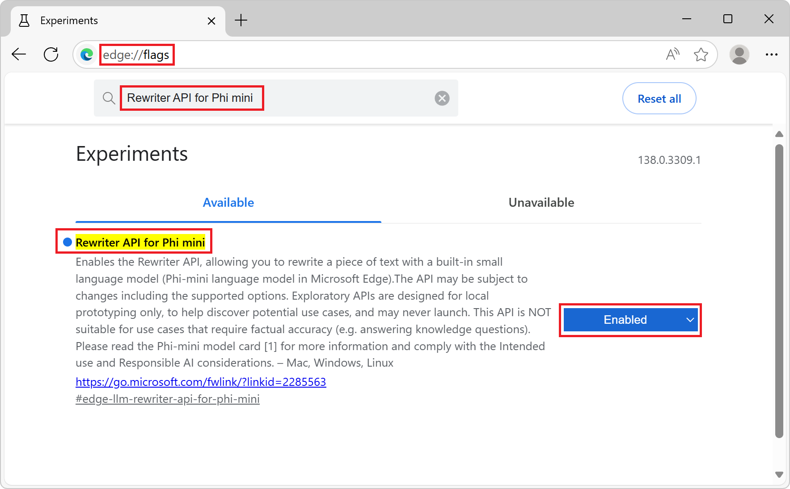
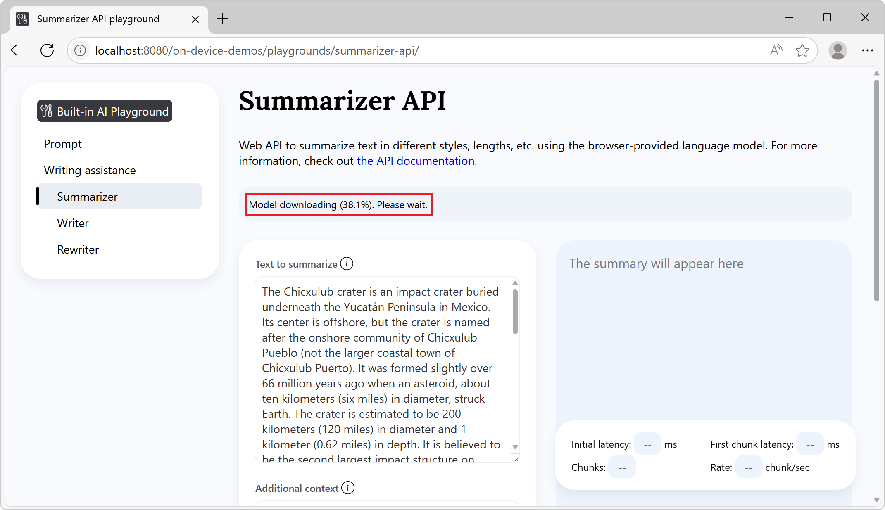
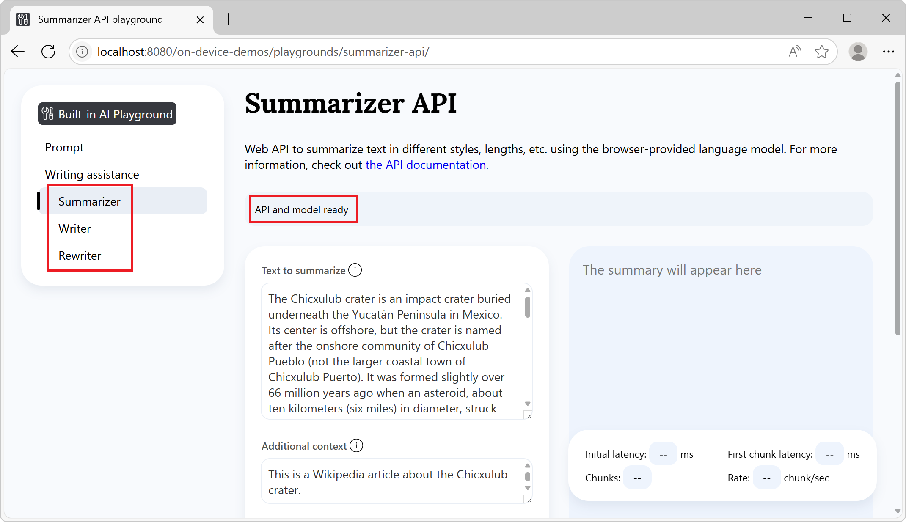
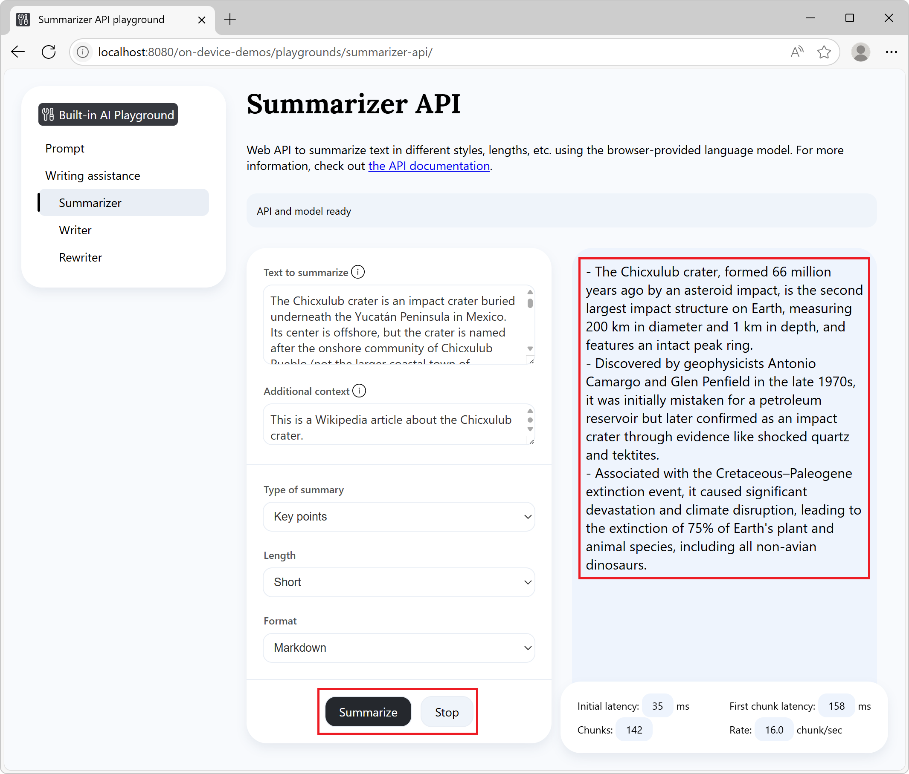

# Summarize, write, and rewrite text with the Writing Assistance APIs
<!-- https://aka.ms/edge-writing-assistance-api-docs -->

The Writing Assistance APIs are experimental web APIs that allow you to summarize, write, and rewrite text by using a small language model (SLM) that is built into Microsoft Edge, from your website's or browser extension's JavaScript code

For introductory information about the Summarizer API, Writer API, and Rewriter API, see [Writing Assistance APIs Explainer](https://github.com/webmachinelearning/writing-assistance-apis).


**Detailed contents:**

* [Availability of the Writing Assistance APIs](#availability-of-the-writing-assistance-apis)
* [Alternatives to and benefits of the Writing Assistance APIs](#alternatives-to-and-benefits-of-the-writing-assistance-apis)
* [The Phi-4-mini model](#the-phi-4-mini-model)
    * [Disclaimer](#disclaimer)
    * [Hardware requirements](#hardware-requirements)
    * [Model availability](#model-availability)
* [Enable the Writing Assistance APIs](#enable-the-writing-assistance-apis)
* [See working examples](#see-working-examples)
* [Use the Writing Assistance APIs](#use-the-writing-assistance-apis)
    * [Check if the APIs are enabled](#check-if-the-apis-are-enabled)
    * [Check if the model can be used](#check-if-the-model-can-be-used)
    * [Create a new session](#create-a-new-session)
        * [Monitor the progress of the model download](#monitor-the-progress-of-the-model-download)
        * [Set the type of summary](#set-the-type-of-summary)
        * [Set the tone of the generated text](#set-the-tone-of-the-generated-text)
        * [Set the length of the generated text](#set-the-length-of-the-generated-text)
        * [Set the format of the generated text](#set-the-format-of-the-generated-text)
    * [Run the Writing Assistance APIs](#run-the-writing-assistance-apis)
        * [Wait for the text to be generated](#wait-for-the-text-to-be-generated)
        * [Display tokens as they are generated](#display-tokens-as-they-are-generated)
    * [Stop generating text](#stop-generating-text)
    * [Destroy a session](#destroy-a-session)
        * [Destroy a session by using the destroy() method](#destroy-a-session-by-using-the-destroy-method)
        * [Destroy a session by using an AbortController](#destroy-a-session-by-using-an-abortcontroller)
* [Send feedback](#send-feedback)
* [See also](#see-also)


<!-- ====================================================================== -->
## Availability of the Writing Assistance APIs

The Summarizer, Writer, and Rewriter APIs are available as a developer preview in Microsoft Edge Canary or Dev channels, starting with version 138.0.3309.2.

The Writing Assistance APIs are optimized for tasks specific to generating, modifying, and summarizing text content.  To learn more about an alternative for more custom prompt engineering scenarios that may not be served by these APIs, see [Prompt a built-in language model with the Prompt API](./prompt-api.md).


<!-- ====================================================================== -->
## Alternatives to and benefits of the Writing Assistance APIs

To leverage AI capabilities in websites and browser extensions, you can also use the following methods:

* Send network requests to cloud-based AI services, such as [Azure AI solutions](https://azure.microsoft.com/solutions/ai).

* Run local AI models using the [Web Neural Network (WebNN) API](https://webmachinelearning.github.io/webnn-intro/) or [ONNX Runtime for Web](https://onnxruntime.ai/docs/tutorials/web/).


The Writing Assistance APIs use a small language model (SLM) that runs on the same device where the inputs to and outputs of the model are used (that is, locally).  This has the following benefits compared to cloud-based solutions:

* **Reduced cost:** There's no cost associated with using a cloud AI service.

* **Network independence:** Beyond the initial model download, there's no network latency when prompting the model, and may also be used when the device is offline.

* **Improved privacy:** The data input to the model never leaves the device and is not collected to train AI models.

The Writing Assistance APIs use a model that's provided by Microsoft Edge and built into the browser, which comes with the additional benefits over custom local solutions such as those based on WebGPU, WebNN, or WebAssembly:

* **Shared one-time cost:** The browser-provided model is downloaded the very first time the API is called and shared across all websites that run in the browser, reducing network costs for the user and developer.

* **Simplified usage for web developers:** The built-in model can be run by using straightforward web APIs and doesn't require AI/ML expertise or using third-party frameworks.


<!-- ====================================================================== -->
## The Phi-4-mini model

The Prompt API allows you to prompt Phi-4-mini — a powerful small language model that excels at text-based tasks — built into Microsoft Edge.  To learn more about Phi-4-mini and its capabilities, see the model card at [microsoft/Phi-4-mini-instruct](https://huggingface.co/microsoft/Phi-4-mini-instruct).


<!-- ------------------------------ -->
#### Disclaimer

Like other language models, the Phi family of models can potentially behave in ways that are unfair, unreliable, or offensive.  To learn more about the model's AI considerations, see [Responsible AI Considerations](https://huggingface.co/microsoft/Phi-4-mini-instruct#responsible-ai-considerations).


<!-- ------------------------------ -->
#### Hardware requirements

The Prompt API developer preview is intended to work on devices with hardware capabilities that produce SLM outputs with predictable quality and latency.

The Prompt API is currently limited to:

* **Operating system:** Windows 10 or 11 and macOS 13.3 or later.

* **Storage:** At least 20 GB available on the volume that contains your Edge profile.  If the available storage drops below 10 GB, the model will be deleted to ensure that other browser features have sufficient space to function.

* **GPU:** 5.5 GB of VRAM or more.

* **Network:** Unlimited data plan or unmetered connection.  The model is not downloaded if using a metered connection.

To check if your device supports the Writing Assistance APIs developer preview, see [Enable the Writing Assistance APIs](#enable-the-writing-assistance-apis) below and check your device performance class.

Due to the experimental nature of the Writing Assistance APIs, you might observe issues on specific hardware configurations.  If you see issues on specific hardware configurations, please provide feedback by [opening a new issue](https://github.com/MicrosoftEdge/MSEdgeExplainers/issues/new?template=writing-assistance-api.md) at the MSEdgeExplainers repository.


<!-- ------------------------------ -->
#### Model availability

An initial download of the model will be required the first time a website calls a built-in AI API.  You can monitor the model download by using the monitor option when creating a new Summarizer, Writer, or Rewriter API session.  To learn more, see [Monitor the progress of the model download](#monitor-the-progress-of-the-model-download), below.


<!-- ====================================================================== -->
## Enable the Writing Assistance APIs

To use any of the Writing Assistance APIs in Microsoft Edge:

1. Make sure you're using the latest version of Microsoft Edge Canary or Dev (version 138.0.3309.2 or newer).  See [Become a Microsoft Edge Insider](https://www.microsoft.com/edge/download/insider).

1. In Microsoft Edge Canary or Dev, open a new tab or window and go to `edge://flags/`.

1. In the search box, at the top of the page:

   * To enable the Summarizer API, enter **Summarization API for Phi mini**.
   * To enable the Writer API, enter **Writer API for Phi mini**.
   * To enable the Rewriter API, enter **Rewriter API for Phi mini**.

   The page is filtered to show the matching flag.

1. Select **Enabled** next to the flag for the API you want to enable:

   

1. Optionally, to log information locally that may be useful for debugging issues, also enable the **Enable on device AI model debug logs** flag.

1. Restart Microsoft Edge Canary or Dev.

1. To check if your device meets the hardware requirements for the Writing Assistance APIs developer preview, open a new tab, go to `edge://on-device-internals`, and check the **Device performance class** value.

   If your device performance class is **High** or greater, the Writing Assistance APIs should be supported on your device.  If you continue to notice issues, please [file a new issue](https://github.com/MicrosoftEdge/MSEdgeExplainers/issues/new?template=writing-assistance-api.md).


<!-- ====================================================================== -->
## See working examples

To see the Writing Assistance APIs in action, and review existing code that uses these APIs:

1. [Enable the Writing Assistance APIs](#enable-the-writing-assistance-apis), as described above.

1. In Microsoft Edge Canary or Dev browser, open a tab or window and go to the [Built-in AI playground](https://microsoftedge.github.io/Demos/built-in-ai/playgrounds/summarizer-api/).

1. Under the left navigation:

   * For the Summarizer API, click **Summarizer**.
   * For the Writer API, click **Writer**.
   * For the Rewriter API, click **Rewriter**.

1. In the information banner at the top, check the status: it initially reads **Model downloading, please wait**:

   

   After the model has downloaded, the information banner reads **API and model ready**, indicating that the API and model can be used:

   

   If the model download doesn't start, restart Microsoft Edge and try again.

   The Writing Assistance APIs are only supported on devices that meet certain hardware requirements.  For more information, see [Hardware requirements](#hardware-requirements), above.

1. To run the APIs, optionally change the settings in the playground pages, such as the text to summarize, write, or rewrite or the length and format of the expected output.

1. Click the **Summarize**, **Write**, or **Rewrite** button, at the bottom of the page.

   The output is generated in the response section of the page.

1. Click the **Stop** button at any time to stop generating text:

   

To view the source code of the Writing Assistance APIs playground, see the [MicrosoftEdge/Demos](https://github.com/MicrosoftEdge/Demos/tree/main/built-in-ai/) repo at GitHub.


<!-- ====================================================================== -->
## Use the Writing Assistance APIs

The three Writing Assistance APIs — Summarizer, Writer, and Rewriter — are used very similarly and are documented together in the sections below.


<!-- ------------------------------ -->
#### Check if the APIs are enabled

Before using any of the Writing Assistance APIs in your website's code, check that the API is enabled by testing the presence of the `Summarizer`, `Writer`, or `Rewriter` objects:

```javascript
if (!Summarizer) {
  // The Summarizer API is not available.
}

if (!Writer) {
  // The Writer API is not available.
}

if (!Rewriter) {
  // The Rewriter API is not available.
}
```


<!-- ------------------------------ -->
#### Check if the model can be used

The Writing Assistance APIs can only be used if the device supports running the model, and once the language model and model runtime have been downloaded by Microsoft Edge.

To check if the API can be used, use the API's `availability()` method.  For example, to check for the availability of the model with the Writer API:

```javascript
const availability = await Writer.availability();

if (availability == "unavailable") {
  // The model is not available.
}

if (availability == "downloadable" || availability == "downloading") {
  // The model can be used, but it needs to be downloaded first.
}

if (availability == "available") {
  // The model is available and can be used.
}
```

To check for the availability of the model with the Rewriter and Summarizer APIs, change `Writer` to `Rewriter` or `Summarizer` in the above code.


<!-- ------------------------------ -->
#### Create a new session

Creating a session instructs the browser to load the language model in memory, so that it can be used.  Before you can use the Writing Assistance APIs to summarize, write, or rewrite text, create a new session by using the `create()` method:

```javascript
// Create a Summarizer session.
const summarizerSession = await Summarizer.create();

// Create a Writer session.
const writerSession = await Writer.create();

// Create a Rewriter session.
const rewriterSession = await Rewriter.create();
```

To customize the model session, you can pass options to the `create()` method:

```javascript
// Create a Writer session with options.
const session = await Writer.create(options);
```

Some options are common to the three Writing Assistance APIs, while other options are different, or take different values.  The available options, per API, are listed below:

| **Option** | **Summarizer API** | **Writer API** | **Rewriter API** |
| --- | --- | --- | --- |
| `monitor` | Monitor object | Monitor object | Monitor object |
| `type` | String: `"tl;dr"`, `"key-points"`, `"teaser"`, `"headline"` | Not supported | Not supported |
| `tone` | Not supported | String: `"formal"`, `"neutral"`, `"casual"` | String: `"as-is"`, `"more-formal"`, `"more-casual"` |
| `length` | String: `"short"`, `"medium"`, `"long"` | String: `"short"`, `"medium"`, `"long"` | String: `"as-is"`, `"shorter"`, `"longer"` |
| `format` | String: `"plain-text"`, `"markdown"` | String: `"plain-text"`, `"markdown"` | String: `"as-is"`, `"plain-text"`, `"markdown"` |

These options are documented below.


<!-- ---------- -->
###### Monitor the progress of the model download

You can follow the progress of the model download by using the `monitor` option.  This is useful when the model has not yet been fully downloaded onto the device where it will be used, to inform users of your website that they should wait.

```javascript
// Create a Summarizer session with the monitor option to monitor the model
// download.
const session = await Summarizer.create({
  monitor: m => {
    // Use the monitor object argument to add an listener for the 
    // downloadprogress event.
    m.addEventListener("downloadprogress", event => {
      // The event is an object with the loaded and total properties.
      if (event.loaded == event.total) {
        // The model is fully downloaded.
      } else {
        // The model is still downloading.
        const percentageComplete = (event.loaded / event.total) * 100;
      }
    });
  }
});
```


<!-- ---------- -->
###### Set the type of summary

The `type` option is only supported by the Summarizer API.  Use the `type` option to ask the language model to generate a summary of one of the following types:

* `tl;dr`
* `key-points`
* `teaser`
* `headline`

Example of creating a `Summarizer` session with summary `type` option of `key-points`:

```javascript
const session = await Summarizer.create({
  type: "key-points"
});
```


<!-- ---------- -->
###### Set the tone of the generated text

The Writer and Rewriter APIs support the `tone` option.

Use the `tone` option to set the tone of the text that will be written or rewritten.

The Writer API supports the following values for the `tone` option:

* `formal`
* `neutral`
* `casual`

The Rewriter API supports the following values for the `tone` option:

* `as-is`
* `more-formal`
* `more-casual`

Example of creating a `Rewriter` session, asking the model to rewrite text to use a `tone` of `more-formal`:

```javascript
const session = await Rewriter.create({
  tone: "more-formal"
});
```


<!-- ---------- -->
###### Set the length of the generated text

The `length` option is supported by the Summarizer, Writer, and Rewriter APIs, and is used to control the length of the generated text.

The Writer and Summarizer APIs support the following values:

* `short`
* `medium`
* `long`

The Rewriter API supports the following values:

* `as-is`
* `shorter`
* `longer`

Example of creating a `Writer` session, asking the model to generate text with `length` of `long`:

```javascript
const session = await Writer.create({
  length: "long"
});
```


<!-- ---------- -->
###### Set the format of the generated text

The `format` option is supported by the Summarizer, Writer, and Rewriter APIs, and is used to ask the model to generate either generate plain text, or text formatted as markdown.

The Writer and Summarizer APIs support the following values:

* `plain-text`
* `markdown`

The Rewriter API supports the following values:

* `as-is`
* `plain-text`
* `markdown`

Example of creating a `Rewriter` session, asking the model to rewrite the provided text to produce the `format` as `markdown`:

```javascript
const session = await Rewriter.create({
  format: "markdown"
});
```


<!-- ------------------------------ -->
#### Run the Writing Assistance APIs

To generate text, by using the Summarizer, Writer, or Rewriter APIs, after you have created the corresponding model session, use the following methods:

* `summarizerSession.summarize()`
* `writerSession.write()`
* `rewriterSession.rewrite()`

Or, to display the generated text as it's getting generated, use the streaming versions of the above methods:

* `summarizerSession.summarizeStreaming()`
* `writerSession.writeStreaming()`
* `rewriterSession.rewriteStreaming()`

The two versions of these methods are documented below.


<!-- ---------- -->
###### Wait for the text to be generated

To wait for the text to be fully generated before continuing to run code, use the `summarize()`, `write()`, and `rewrite()` asynchronous methods.  These methods return a promise that resolves once the corresponding API has finished generating text.

Example of using the `summarize()` async method of the Summarizer API:

```javascript
// Create a Summarizer session.
const summarizerSession = await Summarizer.create();

// Summarize text and wait for the summary to be done.
const summary = await summarizerSession.summarize(textToBeSummarized);

// Use the summary.
console.log(summary);
```


<!-- ---------- -->
###### Display tokens as they are generated

To display the tokens as they are being generated, use the streaming versions of the above methods instead.  The `summarizeStreaming()`, `writeStreaming()`, and `rewriteStreaming()` methods return a stream object right away.  Use the returned stream object to display the response tokens as they are being generated.

Example of using the `summarizeStreaming()` async method of the Summarizer API:

```javascript
// Create a Summarizer session.
const session = await Summarizer.create();

// Ask the model to summarize text.
const stream = session.summarizeStreaming(textToBeSummarized);

// Use the stream object to display tokens that are generated by the model, as
// they are being generated.
for await (const chunk of stream) {
  console.log(chunk);
}
```


<!-- ------------------------------ -->
#### Stop generating text

To stop generating text before the promise or stream returned by the above methods have resolved or ended, use an `AbortController` signal:

Example of a `Rewriter` session using an `AbortController` signal:

```javascript
// Create a Rewriter session.
const session = await Rewriter.create();

// Create an AbortController object.
const abortController = new AbortController();

// Use the model session to generate some text and pass the AbortController
// object by using the signal option.
const stream = session.rewriteStreaming(textToBeRewritten, {
    signal: abortController.signal
});

// Later, perhaps when the user presses a "Stop" button, call the abort()
// method on the AbortController object to stop generating text.
abortController.abort();
```

For a `Summarizer` or `Writer` session, in the above code:
* Change `Rewriter.create()` to `Summarizer.create()` or `Writer.create()`.
* Change from using `session.rewriteStreaming()`.


<!-- ------------------------------ -->
#### Destroy a session

Destroy the session to let the browser know that you don't need the language model anymore, so that the model can be unloaded from memory.

You can destroy a session in two different ways:
* By using the `destroy()` method.
* By using an `AbortController`.


<!-- ---------- -->
###### Destroy a session by using the destroy() method

You can use the `destroy()` method with a `Summarizer`, `Writer`, or `Rewriter` session.

Example using a `Summarizer` session:

```javascript
const session = await Summarizer.create();

// Later, destroy the session by using the destroy method.
session.destroy();
```


<!-- ---------- -->
###### Destroy a session by using an AbortController

Alternatively, you can create an `AbortController` object, create a `Summarizer`, `Writer`, or `Rewriter` session, and then call `abort()`.

Example using a `Writer` session:

```javascript
// Create an AbortController object.
const controller = new AbortController();

// Create a Summarizer, Writer, or Rewriter session and pass the 
// AbortController object by using the signal option.
const session = await Writer.create({ signal: controller.signal });

// Later, perhaps when the user interacts with the UI, destroy the session by
// calling the abort() function of the AbortController object.
controller.abort();
```


<!-- ====================================================================== -->
## Send feedback

We're very interested in learning about the range of scenarios for which you intend to use the Writing Assistance APIs, any issues with the APIs or language models, and whether new task-specific APIs, such as for proofreading or translation, would be useful.

To send feedback about your scenarios and the tasks you want to achieve, please add a comment to [the Writing Assistance APIs feedback issue](https://github.com/MicrosoftEdge/MSEdgeExplainers/issues/1031).

If you notice any issues when using the APIs instead, please [report it on the repo](https://github.com/MicrosoftEdge/MSEdgeExplainers/issues/new?template=writing-assistance-api.md).

You can also contribute to the discussion about the design of the Writing Assistance APIs at the [W3C Web Machine Learning Working Group repository](https://github.com/webmachinelearning/writing-assistance-apis).


<!-- ====================================================================== -->
## See also

* [Writing Assistance APIs Explainer](https://github.com/webmachinelearning/writing-assistance-apis), on the Web Machine Learning GitHub repo.

* [Prompt a built-in language model with the Prompt API](./prompt-api.md).
