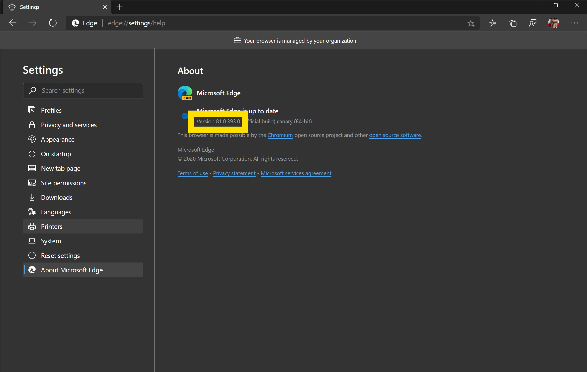
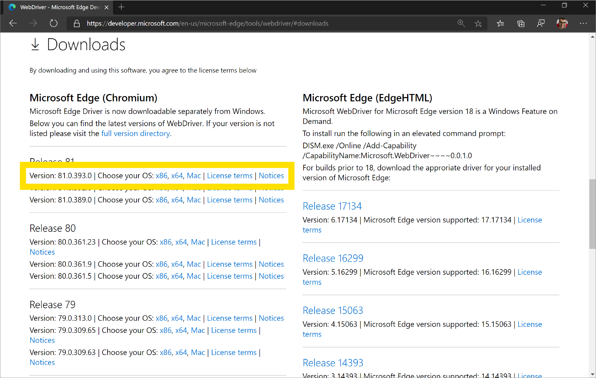

# WebDriver (Chromium)
The W3C [WebDriver](https://www.w3.org/TR/webdriver2/) API is a platform and language-neutral interface and wire protocol allowing programs or scripts to control the behavior of a web browser, like Microsoft Edge (Chromium).

WebDriver enables developers to create automated tests that simulate user interaction. This is different from JavaScript unit tests because WebDriver has access to functionality and information that JavaScript running in the browser doesn't, and it can more accurately simulate user events or OS-level events. WebDriver can also manage testing across multiple windows, tabs and webpages in a single test session.

Here's how to get started with WebDriver for Microsoft Edge (Chromium). 

## Install Microsoft Edge (Chromium)
If you haven't already, install Microsoft Edge (Chromium) from [this page](https://www.microsoftedgeinsider.com/download). If you are using a pre-installed version of Microsoft Edge on your machine, verify that you have Microsoft Edge (Chromium) and not Microsoft Edge (EdgeHTML). A quick way to check is to load `edge://settings/help` in the browser and confirm that the version number is 75 or higher.

## Download Microsoft Edge Driver
WebDriver needs a browser-specific driver to automate each browser. For Microsoft Edge (Chromium), WebDriver needs the appropriate [Microsoft Edge Driver](https://developer.microsoft.com/microsoft-edge/tools/webdriver/) for the build of Microsoft Edge you want to test or automate.

To find your correct build number: Launch Microsoft Edge and navigate to `edge://settings/help` or click `...` > **Settings** >  **About Microsoft Edge**, to view the Chromium version. Having the correct version of WebDriver for your build ensures it runs correctly.

> ##### Figure 1  
> The build number for Microsoft Edge Canary on January 14, 2020
>   

Now, download the matching version of Microsoft Edge Driver from [this page](https://developer.microsoft.com/en-us/microsoft-edge/tools/webdriver/#downloads).

> ##### Figure 2
> The Downloads section of the [Microsoft Edge Driver page](https://developer.microsoft.com/en-us/microsoft-edge/tools/webdriver/#downloads)
>   

> [!NOTE]
> Microsoft Edge (EdgeHTML) does not work with [Microsoft Edge Driver](https://developer.microsoft.com/en-us/microsoft-edge/tools/webdriver/#downloads). To automate Microsoft Edge (EdgeHTML), you will need to download [Microsoft WebDriver for Microsoft Edge (EdgeHTML)](./webdriver.md).

## Download a WebDriver language binding
The last component you need to download is a language-specific client driver. The language binding will translate the code you write in Python, Java, C#, Ruby, and JavaScript into commands that the Microsoft Edge Driver you downloaded in the [previous section](#download-microsoft-edge-driver) can run in Microsoft Edge (Chromium).

[Download the WebDriver language binding of your choice](https://selenium.dev/downloads/). We highly recommend Selenium 4.00-alpha04 or later since this version has built-in support for Microsoft Edge (Chromium). However, you are able to drive Microsoft Edge (Chromium) in all earlier versions of Selenium, including the current stable Selenium 3 release.

### Selenium 4.00-alpha04 and later
You can install the .NET language binding of Selenium 4.00-alpha04 [here](https://www.nuget.org/packages/Selenium.WebDriver/4.0.0-alpha04).

Using this binding, the C# snippet below constructs the `EdgeOptions` object by setting `is_legacy` to `false`, which tells WebDriver to start Microsoft Edge (Chromium) and not Microsoft Edge (EdgeHTML). Then, it sets `BinaryLocation` in `EdgeOptions` to the install location of Microsoft Edge (Chromium). Lastly, it creates an `EdgeDriverService`, again with `is_legacy` set to `false`, before creating a new `EdgeDriver` by passing it the `EdgeDriverService` and `EdgeOptions`.

> [!NOTE]
> When constructing the `EdgeOptions` object, if you don't pass it `false`, by default `is_legacy` is set to `true`. This ensures that all your current Microsoft Edge Driver tests will run without modification against Microsoft Edge (EdgeHTML). You must set `is_legacy` to `false` and use the correct driver for your test to run successfully in Microsoft Edge (Chromium). 

```cs
static void Main(string[] args)
{
    // EdgeOptions() requires using OpenQA.Selenium.Edge
    // Construct EdgeOptions with is_legacy = false
    var edgeOptions = new EdgeOptions(false);
    edgeOptions.BinaryLocation = @"C:\Program Files (x86)\Microsoft\Edge Dev\Application\msedge.exe";
            
    var msedgedriverDir = @"D:\Drivers";
    var msedgedriverExe = @"msedgedriver.exe";
            
    // Construct EdgeDriverService with is_legacy = false too
    var service = EdgeDriverService.CreateDefaultService(msedgedriverDir, msedgedriverExe, false);
    service.EnableVerboseLogging = true;

    var driver = new EdgeDriver(service, edgeOptions);
}
```

> [!CAUTION]
> You must manually create `EdgeDriverService` as shown in the C# snippet above. If you let `EdgeDriver` create a service for you, it will create a Microsoft Edge (EdgeHTML) service and not the Microsoft Edge (Chromium) service that you need to automate or test Microsoft Edge (Chromium).

### Selenium 4.00-alpha03 and earlier
If you have downloaded a Selenium language binding that is v4.00-alpha03 or earlier, follow the steps below to drive Microsoft Edge (Chromium):

1. Create an `EdgeDriverService` that points to **msedgedriver.exe** which you downloaded in the [Download Microsoft Edge Driver](#download-microsoft-edge-driver) section.
2. Start the service manually.
3. Create a `DesiredCapabilites` object to configure the Microsoft Edge Driver session. To launch Microsoft Edge (Chromium), you must create an `ms:edgeOptions` object with a `binary` property that points to the installed location of Microsoft Edge (Chromium).
4. Create a `RemoteWebDriver` that connects to the `EdgeDriverService` using the `DesiredCapabilities` object.
5. When your test or automation is done and you've called `driver.Close()`, shut down the `EdgeDriverService` manually with `service.Dispose()`.

The C# snippet below, by following these steps, launches Microsoft Edge (Chromium), navigates to `https://bing.com`, and then waits 2 seconds for the page to load before closing the `RemoteWebDriver` instance and shutting down the `EdgeDriverService`.

```cs
var service = EdgeDriverService.CreateDefaultService(@"D:\Drivers", @"msedgedriver.exe");
service.UseVerboseLogging = true;
service.UseSpecCompliantProtocol = true;

service.Start();

var caps = new DesiredCapabilities(new Dictionary<string, object>()
{
    { "ms:edgeOptions", new Dictionary<string, object>() {
        {  "binary", @"C:\Program Files (x86)\Microsoft\Edge Dev\Application\msedge.exe" }
    }}
});

var driver = new RemoteWebDriver(service.ServiceUrl, caps);

driver.Navigate().GoToUrl("https://bing.com");
Thread.Sleep(2000);

driver.Close();
service.Dispose();
```

<!-- If time permits, for MGP, document the DesiredCapabilities object with help from: https://sites.google.com/a/chromium.org/chromedriver/capabilities -->
> [!IMPORTANT]
> If you were previously automating or testing Microsoft Edge (Chromium) by using `ChromeDriver` and `ChromeOptions`, your WebDriver code will not run successfully against Microsoft Edge 80 or later. This is a **breaking change** and Microsoft Edge (Chromium) no longer accepts these commands. You must change your tests to use `EdgeOptions` and [Microsoft Edge Driver](https://developer.microsoft.com/en-us/microsoft-edge/tools/webdriver).

## Other ways to set up WebDriver
### Chocolatey
If you are using [Chocolatey](https://chocolatey.org/) as your package manager, you can also get Microsoft Edge Driver by running this command:

```console
choco install selenium-chromium-edge-driver
```

Read more about this package on Chocolatey [here](https://chocolatey.org/packages/selenium-chromium-edge-driver).

### Docker
If you are using [Docker](https://hub.docker.com/), you can get a pre-configured image with Microsoft Edge (Chromium) and [Microsoft Edge Driver](https://developer.microsoft.com/en-us/microsoft-edge/tools/webdriver/) already installed by running this command:

```console
docker run -d -p 9515:9515 stanleyhon348/msedgedriver
```

Check out this container on Docker Hub [here](https://hub.docker.com/r/stanleyhon348/msedgedriver).

## Feedback
We're eager to hear your feedback about using WebDriver, Selenium, and Microsoft Edge! Use the **Feedback** icon in the Microsoft Edge DevTools or tweet [@EdgeDevTools](https://twitter.com/intent/tweet?text=@EdgeDevTools) to let us know what you think.

> ##### Figure 2
> The **Feedback** icon in the Microsoft Edge DevTools
>   