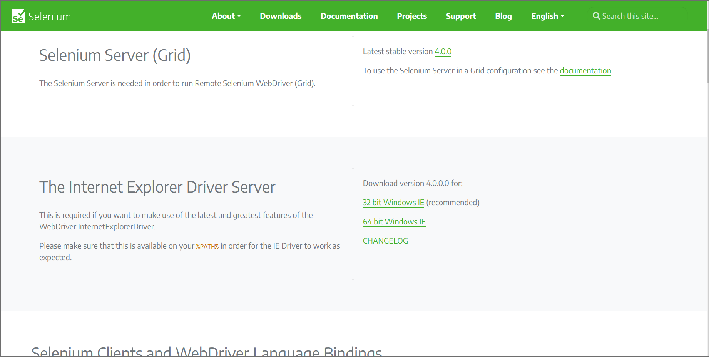

# Use Internet Explorer Driver to automate IE mode in Microsoft Edge

If you have business-critical legacy websites or apps, you may need to test your content in Internet Explorer (IE) mode in Microsoft Edge.  This article describes how to get started with Internet Explorer Driver (IEDriver) to automate IE mode in Microsoft Edge.

IE mode in Microsoft Edge is a feature for organizations that still need Internet Explorer 11 for backward compatibility for legacy websites or apps.  To learn more about IE mode, read [What is Internet Explorer (IE) mode?](/deployedge/edge-ie-mode)

Starting **June 15, 2022**, Internet Explorer 11 will no longer be supported on certain versions of Windows 10. For more information, read [Internet Explorer 11 desktop app retirement FAQ](https://techcommunity.microsoft.com/t5/windows-it-pro-blog/internet-explorer-11-desktop-app-retirement-faq/ba-p/2366549).


<!-- ====================================================================== -->
## Download Internet Explorer Driver (IEDriver)

To begin automating tests in IE mode in Microsoft Edge, [download IEDriver](https://www.selenium.dev/downloads/).  Make sure that the version of IEDriver that you download is `4.0.0.0` or greater.




<!-- ====================================================================== -->
## Required Configuration

To configure IEDriver, Windows, and Microsoft Edge correctly, complete the requirements for [Selenium's required configuration](https://www.selenium.dev/documentation/ie_driver_server/#required-configuration).


### Place the driver executable in the PATH

The driver executable needs to be placed in the PATH; see [IE Driver Server](https://www.selenium.dev/documentation/ie_driver_server/).  The top of that page reads: "The standalone server executable must be downloaded from the Downloads page and placed in your PATH."

If the driver location isn't included in the PATH, you must set the driver location using the Java system property `webdriver.ie.driver` or some other way.


<!-- ====================================================================== -->
## Automate IE mode in Microsoft Edge

The following sections walk you through using Selenium to automate IE mode in Microsoft Edge.

This article provides instructions for using the Selenium framework, but you can use any library, framework, and programming language that supports WebDriver.  To accomplish the same tasks using another framework, consult the documentation for your framework of choice.

To launch Microsoft Edge in IE mode with IEDriver:

1.  Define `InternetExplorerOptions` with additional properties that point to the Microsoft Edge browser.

1.  Start an instance of `InternetExplorerDriver` and pass it `InternetExplorerOptions`.  IEDriver launches Microsoft Edge and then loads your web content in IE mode.

The next section shows the complete sample, and then the subsequent sections focus on each of the main steps that are listed above.


<!-- ====================================================================== -->
## The complete sample

The following sample launches Microsoft Edge in IE mode, navigates to [bing.com](https://www.bing.com/), and then searches for "WebDriver".

### [C#](#tab/c-sharp/)

```csharp
using System;
using OpenQA.Selenium;
using OpenQA.Selenium.IE;

namespace IEDriverSample
{
    class Program
    {
        static void Main(string[] args)
        {
            var ieOptions = new InternetExplorerOptions();
            ieOptions.AttachToEdgeChrome = true;
            //change the path accordingly
            ieOptions.EdgeExecutablePath = "C:/Program Files (x86)/Microsoft/Edge/Application/msedge.exe";

            var driver = new InternetExplorerDriver(ieOptions);
            driver.Url = "https://bing.com";
            driver.FindElement(By.Id("sb_form_q")).SendKeys("WebDriver");
            driver.FindElement(By.Id("sb_form")).Submit();

            driver.Quit();
        }
    }
}
```

### [Python](#tab/python/)

```python
from selenium import webdriver
from selenium.webdriver.common.by import By
from selenium.webdriver.common.keys import Keys

ie_options = webdriver.IeOptions()
ie_options.attach_to_edge_chrome = True
ie_options.edge_executable_path = "C:/Program Files (x86)/Microsoft/Edge/Application/msedge.exe"

driver = webdriver.Ie(options=ie_options)

driver.get("http://www.bing.com")
elem = driver.find_element(By.ID, 'sb_form_q')
elem.send_keys('WebDriver' + Keys.RETURN)

driver.quit()
```

### [Java](#tab/java/)

```java
import org.openqa.selenium.By;
import org.openqa.selenium.Keys;
import org.openqa.selenium.WebDriver;
import org.openqa.selenium.WebElement;
import org.openqa.selenium.ie.InternetExplorerDriver;
import org.openqa.selenium.ie.InternetExplorerOptions;

public class IEDriverSample {
    public static void main(String[] args) {        
        InternetExplorerOptions ieOptions = new InternetExplorerOptions();
        ieOptions.attachToEdgeChrome();
        ieOptions.withEdgeExecutablePath("C:\\Program Files (x86)\\Microsoft\\Edge\\Application\\msedge.exe");
        
        WebDriver driver = new InternetExplorerDriver(ieOptions);

        driver.get("http://www.bing.com");
        WebElement elem = driver.findElement(By.id("sb_form_q"));
        elem.sendKeys("WebDriver", Keys.RETURN);

        driver.close();
    }
}
```

### [JavaScript](#tab/javascript/)

```javascript
const {Builder, By, Key, until} = require('selenium-webdriver');
const {Options} = require('selenium-webdriver/ie');

(async () => {
  let ieOptions = new Options();
  ieOptions.setEdgeChromium(true);
  ieOptions.setEdgePath('C:/Program Files (x86)/Microsoft/Edge/Application/msedge.exe');

  let driver = await new Builder().
                         forBrowser('ie').
                         setIeOptions(ieOptions).
                         build();
  try {
    await driver.get('http://www.bing.com');
    let elem = await driver.findElement(By.id('sb_form_q'));
    await elem.sendKeys('WebDriver', Key.RETURN);
    await driver.wait(until.titleIs('WebDriver - Bing'), 1000);
  } finally {
    await driver.quit();
  }
})();
```

* * *

The following sections explain the steps in this sample in more detail.

<!-- ====================================================================== -->
## Define InternetExplorerOptions with additional properties for Microsoft Edge

Define `InternetExplorerOptions` with additional properties that point to the Microsoft Edge browser.

### [C#](#tab/c-sharp/)

1. Define a new variable, `ieOptions`, by calling `InternetExplorerOptions()`.

1. Set `ieOptions.AttachToEdgeChrome` property to `true`, and `ieOptions.EdgeExecutablePath` to the path of the Microsoft Edge executable.

```csharp
var ieOptions = new InternetExplorerOptions();
ieOptions.AttachToEdgeChrome = true;
//change the path accordingly
ieOptions.EdgeExecutablePath = "C:/Program Files (x86)/Microsoft/Edge/Application/msedge.exe";
```

### [Python](#tab/python/)

1. Define a new variable, `ie_options`, by calling `webdriver.IeOptions()`.

1. Set the `ie_options.attach_to_edge_chrome` property to `True`, and `ie_options.edge_executable_path` to the path of the Microsoft Edge executable.

```python
ie_options = webdriver.IeOptions()
ie_options.attach_to_edge_chrome = True
ie_options.edge_executable_path = "C:/Program Files (x86)/Microsoft/Edge/Application/msedge.exe"
```

### [Java](#tab/java/)

1. Define a new variable `ieOptions` of type `InternetExplorerOptions`, by calling `new InternetExplorerOptions()`.

1. Call `ieOptions.attachToEdgeChrome()` and `ieOptions.withEdgeExecutablePath()` with the path of the Microsoft Edge executable.

```java
InternetExplorerOptions ieOptions = new InternetExplorerOptions();
ieOptions.attachToEdgeChrome();
ieOptions.withEdgeExecutablePath("C:\\Program Files (x86)\\Microsoft\\Edge\\Application\\msedge.exe");
```

### [JavaScript](#tab/javascript/)

1. Define a new variable, `ieOptions`, by calling `Options()`.

1. Call `ieOptions.setEdgeChromium()` with value `true` and `ieOptions.setEdgePath()` with the path of the Microsoft Edge executable.

```javascript
let ieOptions = new Options();
ieOptions.setEdgeChromium(true);
ieOptions.setEdgePath('C:/Program Files (x86)/Microsoft/Edge/Application/msedge.exe');
```

* * *


<!-- ====================================================================== -->
## Start IEDriver

Start IEDriver.  IEDriver launches Microsoft Edge and then loads your web content in IE mode.

### [C#](#tab/c-sharp/)

Start `InternetExplorerDriver` and pass it the previously defined `ieOptions`.  IEDriver launches Microsoft Edge in IE mode.  All page navigation and subsequent interactions occur in IE mode.

```csharp
var driver = new InternetExplorerDriver(ieOptions);
```

### [Python](#tab/python/)

Start IEDriver by calling `webdriver.Ie` and passing it the previously defined `ie_options`.  IEDriver launches Microsoft Edge in IE mode.  All page navigation and subsequent interactions occur in IE mode.

```python
driver = webdriver.Ie(options=ie_options)
```

### [Java](#tab/java/)

Start IEDriver by calling `new InternetExplorerDriver()` and passing it the previously defined `ieOptions`.  IEDriver launches Microsoft Edge in IE mode.  All page navigation and subsequent interactions occur in IE mode.

```java
WebDriver driver = new InternetExplorerDriver(ieOptions);
```

### [JavaScript](#tab/javascript)

Start IEDriver by calling `Builder.forBrowser('ie')` and `setIeoptions(ieOptions)`.  IEDriver launches Microsoft Edge in IE mode.  All page navigation and subsequent interactions occur in IE mode.

```javascript
let driver = await new Builder().
                       forBrowser('ie').
                       setIeOptions(ieOptions).
                       build();
```

* * *


<!-- ====================================================================== -->
## Known limitations

This section covers known scenarios that previously worked with IEDriver and the IE11 desktop application but require workarounds when using IEDriver with Microsoft Edge in IE mode.

### Opening new windows

If your test code creates a new browser window using one of the following methods, you may need to add a short wait operation afterwards to ensure that IEDriver has detected the new window:

- Opening a new window by calling [window.open](https://developer.mozilla.org/docs/Web/API/Window/open) from `<script>` in the page.
- Opening a new window by using the WebDriver [New Window](https://w3c.github.io/webdriver/#new-window) command.

To ensure the new window has been created successfully and IEDriver has detected it, you must continuously check the result of the [Get Window Handles](https://www.w3.org/TR/webdriver2/#get-window-handles) command until it contains a handle to the new window.

The following sample demonstrates a possible way to wait for new window handles to be detected when opening new windows.

### [C#](#tab/c-sharp/)

After the `Click` method is called on a button that opens a new window, the test code must wait until `driver.WindowHandles` contains the new window handle.

```csharp
var initialHandleCount = driver.WindowHandles.Count;
driver.FindElement(By.Id("<Id of the button that will open a new window>")).Click();
var newHandles = driver.WindowHandles;
while (newHandles.Count == initialHandleCount)
{
    newHandles = driver.WindowHandles;
}
```

### [Python](#tab/python/)

After the `click` method is called on a button that opens a new window, the test code must wait until `driver.window_handles` contains the new window handle.

```python
initial_handle_count = len(driver.window_handles)
driver.find_element(By.ID, "<Id of the button that will open a new window>").click()
new_handles = driver.window_handles
while len(new_handles) == initial_handle_count:
    new_handles = driver.window_handles
```

### [Java](#tab/java/)

After the `click` method is called on a button that opens a new window, the test code must wait until `driver.getWindowHandles()` contains the new window handle.

```java
int initialHandleCount = driver.getWindowHandles().size();
driver.findElement(By.id("<Id of the button that will open a new window>")).click();        
Set<String> newHandles = driver.getWindowHandles();
while (newHandles.size() == initialHandleCount) {
    newHandles = driver.getWindowHandles();
}
```

### [JavaScript](#tab/javascript/)

After the `click` method is called on a button that opens a new window, IEDriver must wait with `await driver.getAllWindowHandles()`.

```javascript
const initialHandleCount = (await driver.getAllWindowHandles()).length;
const elem = await driver.findElement(By.id("<Id of the button that will open a new window>"));
await elem.click();
let newHandles = await driver.getAllWindowHandles();
while (newHandles.length == initialHandleCount) {
    newHandles = await driver.getAllWindowHandles();
}
```

* * *

### Creating and switching between tabs

If your test code switches between multiple tabs in the same Microsoft Edge window, tabs that become inactive may not be included in the list of handles returned by [Get Window Handles](https://www.w3.org/TR/webdriver2/#get-window-handles).  In the Internet Explorer 11 desktop application, IEDriver will return handles for all of the tabs in IE, regardless of activation state.

When using Microsoft Edge in IE mode, if your test switches focus away from a certain tab and you would like to be able to switch back to that tab later, you must store a copy of the tab's window handle.


<!-- ====================================================================== -->
## See also

*  [Use WebDriver to automate Microsoft Edge](/microsoft-edge/webdriver-chromium) - An overview of automating Microsoft Edge with the WebDriver protocol.
*  [Selenium documentation](https://www.selenium.dev/documentation) - Information about WebDriver in the context of Selenium, and how to write automated WebDriver tests using Selenium.
*  [Contact the Microsoft Edge DevTools team](../devtools-guide-chromium/contact.md) to send feedback about using WebDriver, WebDriver testing frameworks (such as Selenium), and Microsoft Edge.
