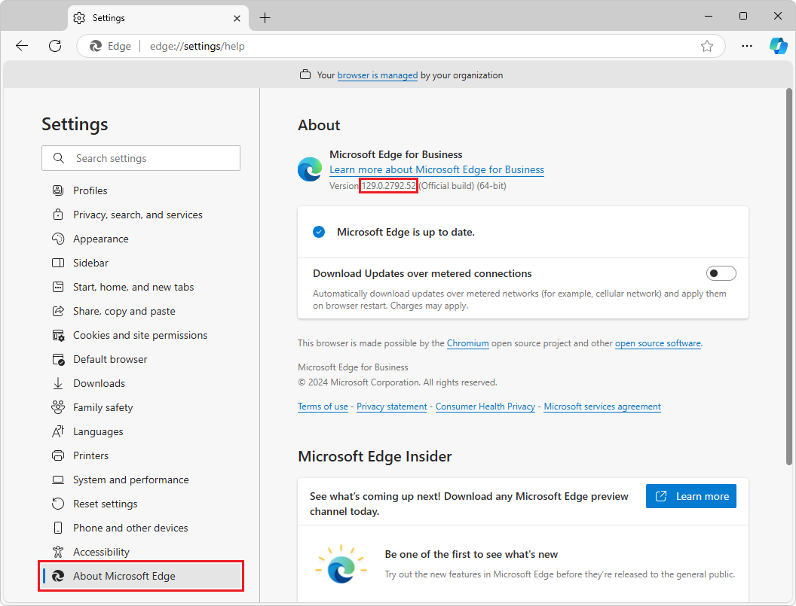

# Use WebDriver to automate Microsoft Edge

WebDriver allows you to automate Microsoft Edge by simulating user interaction.  Tests that use WebDriver have some advantages over JavaScript unit tests that run in the browser:

*   WebDriver accesses functionality and information that's not available to JavaScript running in browsers.

*   WebDriver simulates user events or OS-level events more accurately than JavaScript unit tests.

*   WebDriver manages multiple windows, tabs, and webpages in a single test session.

*   WebDriver runs multiple sessions of Microsoft Edge on a specific machine.

This article provides raw code samples, and not complete tests.  This article doesn't provide a complete how-to for getting started with Selenium WebDriver, but covers only the Microsoft Edge-specific portions of the process.  This includes obtaining Microsoft Edge WebDriver and setting Microsoft Edge-specific options in code.


<!-- ====================================================================== -->
## Relationship between WebDriver and other software

To automate Microsoft Edge with WebDriver to simulate user interaction, you need three components:

*  Microsoft Edge.
*  Microsoft Edge WebDriver.
*  A WebDriver testing framework.

The functional relationship between these components is as follows:

| Technology | Role |
|---|---|
| WebDriver | A W3C standard for a platform- and language-neutral wire protocol.  This protocol allows out-of-process programs to remotely instruct the behavior of web browsers. |
| Microsoft Edge WebDriver | Microsoft's implementation of the WebDriver protocol specifically for Microsoft Edge.  Test authors write tests that use WebDriver commands that Microsoft Edge WebDriver receives.  Microsoft Edge WebDriver is then responsible for communicating that command to the browser. |
| A WebDriver testing framework | Test authors use a testing framework to write end-to-end tests and automate browsers.  Provides a language-specific interface that translates your code into commands that are sent to Microsoft Edge WebDriver.  WebDriver testing frameworks exist for all major platforms and languages.  One such framework is Selenium WebDriver. |
| Internet Explorer Driver | An open-source implementation of the WebDriver protocol specifically for Internet Explorer.  To run legacy end-to-end tests for Internet Explorer Mode, we recommend using Internet Explorer Driver. |
| Microsoft WebDriver (legacy) | The previous, browser-specific driver for Microsoft Edge (EdgeHTML), which is also known as Microsoft Edge Legacy. |

The following sections describe how to get started with WebDriver for Microsoft Edge.


<!-- ====================================================================== -->
## Download Microsoft Edge WebDriver

To begin writing automated tests, make sure the Microsoft Edge WebDriver version you install matches your version of Microsoft Edge.  The first three parts of the four-part version number must match.

Download and install a version of Microsoft Edge WebDriver that matches your browser version, as follows:

1.  Go to `edge://settings/help` and note your version of Microsoft Edge, a four-part number:

    

1.  Go to [Microsoft Edge WebDriver](https://developer.microsoft.com/microsoft-edge/tools/webdriver/).

1.  In the **Downloads** section of the page, click a platform button (such as **x64**) under a version number that matches your version number of Microsoft Edge:

    

    The first three parts of the four-part version number must match, between Microsoft Edge and Microsoft Edge WebDriver.  For example, the following versions of Microsoft Edge and Microsoft Edge WebDriver will work together, because the first three numbers are the same:
    * 128.0.2739.79
    * 128.0.2739.84

    To download older versions, click the **Go to full directory** button below the **Recent versions** section.

1.  After the download completes, extract the `msedgedriver` executable to your preferred location. Add the folder where the executable is located to your `PATH` environment variable.

You must install both a browser driver (Microsoft Edge WebDriver), and a WebDriver testing framework (such as Selenium WebDriver), as described in [Choose a WebDriver testing framework](#choose-a-webdriver-testing-framework) below.  These are separate components.


<!-- ====================================================================== -->
## Choose a WebDriver testing framework

After downloading Microsoft Edge WebDriver, the last component you must download is a WebDriver testing framework.  Test authors use WebDriver testing frameworks to write end-to-end tests and automate browsers.  A WebDriver testing framework provides a language-specific interface that translates your code into commands that Microsoft Edge WebDriver runs in Microsoft Edge.  WebDriver testing frameworks exist for all major platforms and languages, such as Python, Java, C#, Ruby, and JavaScript.

Microsoft Edge WebDriver can be used with any WebDriver framework.  This article provides instructions for using the Selenium WebDriver framework, but you can use any library, framework, and programming language that supports WebDriver.

Selenium WebDriver is one popular implementation of a WebDriver framework.  Selenium is a cross-browser automation library that's language-agnostic and test-framework agnostic.  This article uses Selenium WebDriver only as an illustrative example, and because it fulfills most users' needs.  If you use Selenium to automate Microsoft Edge, you must use Selenium 4; Selenium 3 is no longer supported.

To accomplish the same tasks using a WebDriver testing framework other than Selenium WebDriver, consult the official documentation for your framework of choice.


<!-- ------------------------------ -->
#### Using Selenium WebDriver

One possible WebDriver framework you can use is Selenium WebDriver, which is part of the Selenium suite of tools.  Selenium WebDriver is an open-source testing framework that can be used on any platform, and provides language bindings for Java, Python 3, C#, Ruby, and JavaScript.

If you use Selenium to automate Microsoft Edge, you must use Selenium 4; Selenium 3 is no longer supported.

For detailed instructions on installing Selenium for your preferred language and development environment, see Selenium's documentation about [Installing a Selenium library](https://www.selenium.dev/documentation/webdriver/getting_started/install_library/).


<!-- ====================================================================== -->
## Automate Microsoft Edge with WebDriver

To automate a browser using WebDriver, you must first start a WebDriver session by using a WebDriver testing framework.  A WebDriver _session_ is a single running instance of a browser that's controlled through WebDriver commands.

Start a WebDriver session to launch a new browser instance.  The launched browser instance remains open until you close the WebDriver session.

The following section walks you through using Selenium 4 to start a WebDriver session with Microsoft Edge.

> [!NOTE]
> This article provides instructions for using the Selenium WebDriver framework, but you can use any library, framework, and programming language that supports WebDriver.  To accomplish the same tasks using another framework, consult the documentation for your framework of choice.


<!-- ------------------------------ -->
#### Automate Microsoft Edge

Selenium uses the `EdgeDriver` class to manage a Microsoft Edge session.  The following code:
1. Starts a Microsoft Edge session.
1. Instructs Microsoft Edge to go to Bing.
1. Searches for "WebDriver".
1. Sleeps for a few seconds so you can see the results.

To get started automating Microsoft Edge with WebDriver, copy and paste the code snippet for your preferred language:

##### [C#](#tab/c-sharp)

```csharp
using OpenQA.Selenium;
using OpenQA.Selenium.Edge;
using System.Threading;

namespace EdgeDriverSample
{
    class Program
    {
        static void Main(string[] args)
        {
            var driver = new EdgeDriver();
            try
            {
                driver.Url = "https://bing.com";

                var element = driver.FindElement(By.Id("sb_form_q"));
                element.SendKeys("WebDriver");
                element.Submit();

                Thread.Sleep(5000);
            }
            finally
            {
                driver.Quit();
            }
        }
    }
}
```

##### [Python](#tab/python)

```python
from selenium import webdriver
from selenium.webdriver.common.by import By
import time

driver = webdriver.Edge()

driver.get('https://bing.com')

element = driver.find_element(By.ID, 'sb_form_q')
element.send_keys('WebDriver')
element.submit()

time.sleep(5)
driver.quit()
```

##### [Java](#tab/java)

```java
import org.openqa.selenium.By;
import org.openqa.selenium.WebElement;
import org.openqa.selenium.edge.EdgeDriver;

public class EdgeDriverSample {
    public static void main(String[] args) throws Exception {
        EdgeDriver driver = new EdgeDriver();
        try {
            driver.navigate().to("https://bing.com");

            WebElement element = driver.findElement(By.id("sb_form_q"));
            element.sendKeys("WebDriver");
            element.submit();

            Thread.sleep(5000);
        } finally {
            driver.quit();
        }
    }
}
```

##### [JavaScript](#tab/javascript)

```javascript
const { Builder, By } = require('selenium-webdriver');

(async () => {
    const driver = await new Builder().forBrowser('MicrosoftEdge').build();
    try {
        await driver.get('https://bing.com');

        const element = await driver.findElement(By.id('sb_form_q'));
        await element.sendKeys('WebDriver');
        await element.submit();

        await driver.sleep(5000);
    } finally {
        await driver.quit();
    }
})();
```

---


<!-- ------------------------------ -->
#### Manage and configure the Microsoft Edge WebDriver service

When you create a new `EdgeDriver` object to start a Microsoft Edge session, Selenium launches a new Microsoft Edge WebDriver process that the `EdgeDriver` object communicates with.  The Microsoft Edge WebDriver process is closed when you call the `EdgeDriver` object's `Quit` method.  Letting each `EdgeDriver` object manage its own driver process can be inefficient if you have many tests, because each test must wait for a new driver process to launch.  Instead, you can create a single Microsoft Edge WebDriver process and then reuse it for multiple tests.

Selenium uses the `EdgeDriverService` class to manage an Microsoft Edge WebDriver process.  You can create an `EdgeDriverService` once before running your tests, and then pass this `EdgeDriverService` object to the `EdgeDriver` constructor when creating a new `EdgeDriver` object.  When you pass an `EdgeDriverService` to the `EdgeDriver` constructor, the `EdgeDriver` object will use this `EdgeDriverService`, instead of creating a new one.

You can also use `EdgeDriverService` to configure command-line options for the Microsoft Edge WebDriver process, as shown below.

The following snippet creates a new `EdgeDriverService` and enables verbose log output:

##### [C#](#tab/c-sharp)

```csharp
var service = EdgeDriverService.CreateDefaultService();
service.UseVerboseLogging = true;

var driver = new EdgeDriver(service);
```

##### [Python](#tab/python)

```python
from selenium import webdriver
from selenium.webdriver.edge.service import Service

service = Service(service_args=["--verbose"])

driver = webdriver.Edge(service = service)
```

##### [Java](#tab/java)

```java
System.setProperty("webdriver.edge.verboseLogging", "true");
EdgeDriverService service = EdgeDriverService.createDefaultService();

EdgeDriver driver = new EdgeDriver(service);
```

##### [JavaScript](#tab/javascript)

```javascript
const edge = require('selenium-webdriver/edge');

const service = new edge.ServiceBuilder().enableVerboseLogging().build();

const options = new edge.Options();
const driver = edge.Driver.createSession(options, service);
```

---


<!-- ------------------------------ -->
#### Configure Microsoft Edge Options

You can pass an `EdgeOptions` object to the `EdgeDriver` constructor to configure extra options for the Microsoft Edge browser process.  The following section shows how to use `EdgeOptions` for some common scenarios.  For a full list of options that are supported, see [Capabilities and EdgeOptions](capabilities-edge-options.md).

###### Choose Specific Browser Binaries

You can start a WebDriver session with specific Microsoft Edge binaries.  For example, you can run tests using the preview channels of Microsoft Edge (Beta, Dev, or Canary), as follows:

##### [C#](#tab/c-sharp)

```csharp
var options = new EdgeOptions();
options.BinaryLocation = @"C:\Program Files (x86)\Microsoft\Edge Beta\Application\msedge.exe";

var driver = new EdgeDriver(options);
```

##### [Python](#tab/python)

```python
from selenium import webdriver
from selenium.webdriver.edge.options import Options

options = Options()
options.binary_location = r"C:\Program Files (x86)\Microsoft\Edge Beta\Application\msedge.exe"

driver = webdriver.Edge(options = options)
```

##### [Java](#tab/java)

```java
EdgeOptions options = new EdgeOptions();
options.setBinary("C:\\Program Files (x86)\\Microsoft\\Edge Beta\\Application\\msedge.exe");

EdgeDriver driver = new EdgeDriver(options);
```

##### [JavaScript](#tab/javascript)

```javascript
const edge = require('selenium-webdriver/edge');

let options = new edge.Options();
options.setBinaryPath("C:\\Program Files (x86)\\Microsoft\\Edge Beta\\Application\\msedge.exe");

let driver = edge.Driver.createSession(options);
```

---

To download a preview channel of Microsoft Edge (Beta, Dev, or Canary), go to [Become a Microsoft Edge Insider](https://www.microsoft.com/edge/download/insider).


###### Pass extra command-line arguments

You can use `EdgeOptions` to configure command-line arguments that will be passed to the Microsoft Edge browser process when a session is created.  For example, you can configure the browser to run in headless mode, as follows:

##### [C#](#tab/c-sharp)

```csharp
var options = new EdgeOptions();
options.AddArgument("--headless=new");

var driver = new EdgeDriver(options);
```

##### [Python](#tab/python)

```python
from selenium import webdriver
from selenium.webdriver.edge.options import Options

options = Options()
options.add_argument("--headless=new")

driver = webdriver.Edge(options = options)
```

##### [Java](#tab/java)

```java
EdgeOptions options = new EdgeOptions();
options.addArguments("--headless=new");

EdgeDriver driver = new EdgeDriver(options);
```

##### [JavaScript](#tab/javascript)

```javascript
const edge = require('selenium-webdriver/edge');

let options = new edge.Options();
options.addArguments("--headless=new");

let driver = edge.Driver.createSession(options);
```

---


<!-- ====================================================================== -->
## Other WebDriver installation options


<!-- ------------------------------ -->
#### Docker

If you use [Docker](https://hub.docker.com), run the following command to download a pre-configured image that has Microsoft Edge and Microsoft Edge WebDriver pre-installed.

```console
docker run -d -p 9515:9515 mcr.microsoft.com/msedge/msedgedriver
```

For more information, see the [msedgedriver container on Docker Hub](https://hub.docker.com/_/microsoft-msedge-msedgedriver?tab=description).


<!-- ====================================================================== -->
## Application Guard

Trusted sites that use Microsoft Defender Application Guard can be automated using Microsoft Edge WebDriver.  Microsoft Defender Application Guard is also called _Application Guard_, for short.

Untrusted sites that use Application Guard cannot be automated or manipulated using Microsoft Edge WebDriver.  Application Guard launches untrusted sites in a container, and this container doesn't expose the remote debugging port that Microsoft Edge WebDriver needs to communicate with the site.

Your enterprise administrator defines what are trusted sites, including cloud resources and internal networks.  Sites that aren't in the trusted sites list are considered _untrusted_.  Microsoft Edge WebDriver can automate both InPrivate windows, and sites in the trusted sites list.

For more information about Application Guard, see:

*  [Microsoft Edge support for Microsoft Defender Application Guard](/deployedge/microsoft-edge-security-windows-defender-application-guard).
*  [Microsoft Defender Application Guard overview](/windows/security/threat-protection/microsoft-defender-application-guard/md-app-guard-overview).


<!-- ====================================================================== -->
## Opt out of diagnostic data collection

By default, Microsoft Edge WebDriver sends diagnostic data such as the status of the [New Session](https://www.w3.org/TR/webdriver2/#new-session) WebDriver command to Microsoft.  To turn off diagnostic data collection for Microsoft Edge WebDriver, set the `MSEDGEDRIVER_TELEMETRY_OPTOUT` environment variable to `1`.  For more information about the data that Microsoft Edge WebDriver collects, see [Microsoft Edge WebDriver](/legal/microsoft-edge/privacy#microsoft-edge-webdriver) in _User data and privacy in Microsoft Edge_.


<!-- ====================================================================== -->
## Legacy Microsoft WebDriver for EdgeHTML

Microsoft WebDriver is the legacy WebDriver implementation for EdgeHTML-based Microsoft Edge.  Microsoft WebDriver was distributed as an optional Windows component, because legacy Microsoft Edge (EdgeHTML) was updated with the OS.  Microsoft WebDriver isn't compatible with the latest, Chromium-based versions of Microsoft Edge.  Microsoft WebDriver is still made available for developers who have written WebDriver-based tests for UWP apps, because these rely on EdgeHTML, but Microsoft WebDriver is no longer recommended.

See [WebDriver (EdgeHTML)](/archive/microsoft-edge/legacy/developer/webdriver/).


<!-- ====================================================================== -->
## Troubleshooting

These are troubleshooting considerations when using WebDriver to automate Microsoft Edge.


<!-- ------------------------------ -->
#### Developer Tools Availability policy

If your IT admin has set the [DeveloperToolsAvailability](/deployedge/microsoft-edge-policies#developertoolsavailability) policy to `2`, Microsoft Edge WebDriver is blocked from driving Microsoft Edge, because the driver uses [Microsoft Edge DevTools](../devtools/overview.md).  To automate Microsoft Edge, make sure the [DeveloperToolsAvailability](/deployedge/microsoft-edge-policies#developertoolsavailability) policy is set to `0` or `1`.


<!-- ------------------------------ -->
#### Using the Visual Studio template

If you're using the Microsoft Edge WebDriver template that's provided with Visual Studio, which creates a simple test project, make sure you've done the following:

*  Download Microsoft Edge WebDriver and make sure it's available in the PATH.
*  Add the WebDriver framework (such as the **Selenium.WebDriver** NuGet package) to the project.

After you do these steps, the example test that navigates to Bing should complete successfully.


<!-- ------------------------------ -->
#### Error due to Selenium Tools for Microsoft Edge

If you get the following error when you try to create a new `EdgeDriver` instance: `System.MissingMethodException: 'Method not found: 'OpenQA.Selenium.Remote.DesiredCapabilities OpenQA.Selenium.DriverOptions.GenerateDesiredCapabilities(Boolean)'`, see [Upgrading from Selenium 3 to Selenium 4](#upgrading-from-selenium-3-to-selenium-4) below.


<!-- ====================================================================== -->
## Upgrading from Selenium 3 to Selenium 4

If you used [Selenium Tools for Microsoft Edge](https://github.com/microsoft/edge-selenium-tools) to add Microsoft Edge support to Selenium 3 browser tests, update your tests to Selenium 4, as follows:

1. Remove Selenium Tools for Microsoft Edge from your project.

1. Update your tests to use the built-in `EdgeDriver` and related classes that Selenium 4 provides instead.  You must upgrade any existing Selenium 3 tests to Selenium 4.  To learn more about upgrading to Selenium 4, see [Upgrade to Selenium 4](https://www.selenium.dev/documentation/webdriver/getting_started/upgrade_to_selenium_4/).

1. Remove all usages of the `EdgeOptions.UseChromium` property.  This property no longer exists in Selenium 4, because Selenium 4 supports only Microsoft Edge (Chromium browser engine).


<!-- ------------------------------ -->
#### Selenium 3 is not supported

To use WebDriver to automate Microsoft Edge, if you use Selenium, make sure you are using Selenium 4.  Selenium 3 is not supported.

All new projects that use Selenium must use Selenium 4.  To use WebDriver to automate Microsoft Edge, if you use Selenium, make sure you are using Selenium 4.  Selenium 3 is no longer supported.


<!-- ------------------------------ -->
#### Selenium Tools for Microsoft Edge no longer used

Selenium 4 doesn't require Selenium Tools for Microsoft Edge.  Selenium Tools for Microsoft Edge was for Selenium 3 only.

Don't use Selenium 4 with Selenium Tools for Microsoft Edge, because Selenium 4 already has built-in support for Microsoft Edge.  If you try to use Selenium Tools for Microsoft Edge, when you try to create a new `EdgeDriver` instance, you get the following error: `System.MissingMethodException: 'Method not found: 'OpenQA.Selenium.Remote.DesiredCapabilities OpenQA.Selenium.DriverOptions.GenerateDesiredCapabilities(Boolean)'`.  If you're using Selenium 4 and get this error, remove `Microsoft.Edge.SeleniumTools` from your project, and make sure you're using the official `EdgeOptions` and `EdgeDriver` classes from the `OpenQA.Selenium.Edge` namespace.


<!-- ====================================================================== -->
## See also

* [The Selenium Browser Automation Project](https://www.selenium.dev/documentation) - Information about WebDriver in the context of Selenium, and how to write automated WebDriver tests using Selenium.
* [Selenium.WebDriver](https://www.nuget.org/packages/Selenium.WebDriver) NuGet package.
* [Contact the Microsoft Edge WebDriver team](contact.md) to send feedback about using WebDriver, WebDriver testing frameworks (such as Selenium), and Microsoft Edge.

Archived:
* [WebDriver (EdgeHTML)](/archive/microsoft-edge/legacy/developer/webdriver/)
