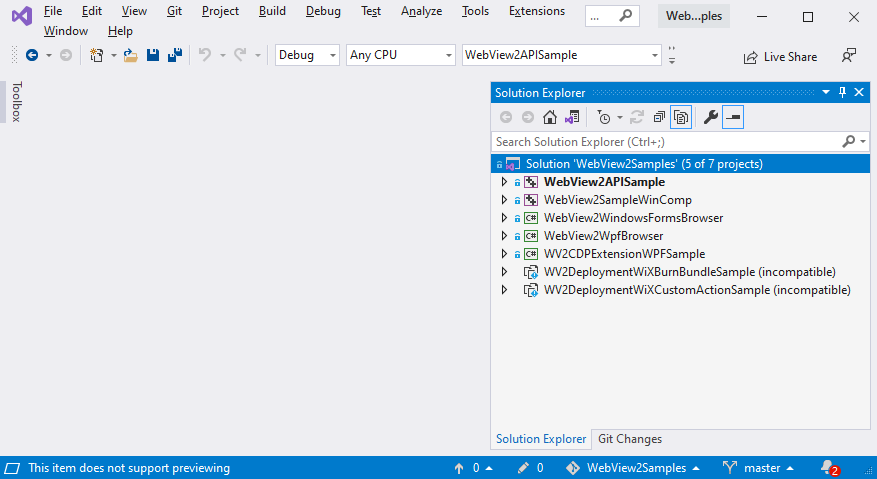

# Sample Code for WebView2

<!--
standard order:
1. platform-specific Get Started `.sln` files
2. multi-platform, comprehensive-API `.sln` file
3. platform-specific comprehensive-API `.sln` files
-->

This article is about understanding what samples, `.sln` files, and `README.md` files are in the [WebView2Samples repo](https://github.com/MicrosoftEdge/WebView2Samples).

<!-- ====================================================================== -->
## Sample code for Get Started guides

The WebView2 Get Started guides help you create the same completed, working projects as are in the `WebView2Samples` repo, which you can download or clone.  These are not comprehensive API examples, but only demonstrate a few API items.

| Platform | Article | Code |
|---|---|---|
| Win32 | [Get started with WebView2 in Win32 apps](get-started/win32.md) | Starter code at [WebView2Samples > Win32_GettingStarted](https://github.com/MicrosoftEdge/WebView2Samples/tree/master/GettingStartedGuides/Win32_GettingStarted) |
| WinForms | [Get started with WebView2 in WinForms apps](get-started/winforms.md) | .NET starter code at [WebView2Samples > WinForms_GettingStarted](https://github.com/MicrosoftEdge/WebView2Samples/tree/master/GettingStartedGuides/WinForms_GettingStarted) |
| WinUI 2 | [Get started with WebView2 in WinUI 2 (UWP) apps (public preview)](get-started/winui2.md) | Uses the WinUI 2 NuGet package.  Has no sample code. |
| WinUI 3 | [Get started with WebView2 in WinUI 3 (Windows App SDK) apps](get-started/winui.md) | Starter code at [WebView2Samples > WinUI3_GettingStarted](https://github.com/MicrosoftEdge/WebView2Samples/tree/master/GettingStartedGuides/WinUI3_GettingStarted) |
| WPF | [Get started with WebView2 in WPF apps](get-started/wpf.md) | .NET starter code at [WebView2Samples > WPF_GettingStarted](https://github.com/MicrosoftEdge/WebView2Samples/tree/master/GettingStartedGuides/WPF_GettingStarted) |

<!-- ====================================================================== -->
## Apps in the WebView2Samples.sln file

The `WebView2Samples` repo includes comprehensive-API, platform-specific sample projects, for Win32, WPF, WinForms, and WinUI.  These samples are hybrid applications that use the Microsoft Edge WebView2 control.

1. In a separate window or tab, see [WebView2Samples repo (README page)](https://github.com/MicrosoftEdge/WebView2Samples).

1. Download or clone the `WebView2Samples` repo, as described in [Download or clone the WebView2 samples repo](how-to/machine-setup.md#download-or-clone-the-webview2samples-repo).

1. In your resulting, local copy of the repo directory structure, find all `*.sln` files.

1. Open one of the `.sln` files.  For example, open your local copy of the multi-platform solution file [WebView2Samples/SampleApps/WebView2Samples.sln](https://github.com/MicrosoftEdge/WebView2Samples/blob/master/SampleApps/WebView2Samples.sln) (downloaded as path `WebView2Samples-master/SampleApps/WebView2Samples.sln`) in Microsoft Visual Studio.  When you open that solution file in Visual Studio, **Solution Explorer** contains the following WebView2 samples, as projects:

   

This particular `.sln` file doesn't include the Get Started projects, which are separate `.sln` files, one per platform.

The `WebView2Samples` repo contains the following projects.  These projects are included in the `WebView2Samples.sln` file, and each platform also has a dedicated `.sln` file.

| Type of sample | Sample Project | Description |
|---|---|---|
| Win32 C++ | [WebView2APISample](https://github.com/MicrosoftEdge/WebView2Samples/tree/master/SampleApps/WebView2APISample#readme) | Embeds a WebView2 within a Win32 native application.  Illustrates a selection of WebView2 event handlers and API methods that allow a native Win32 application to directly interact with a WebView and vice versa.    Built as a Win32 project in [Visual Studio 2019](https://visualstudio.microsoft.com/vs/).  Uses C++ and HTML/CSS/JavaScript in the WebView2 environment.  The `.sln` file is in the parent, [SampleApps](https://github.com/MicrosoftEdge/WebView2Samples/tree/master/SampleApps) directory. |
| Win32 C++ with Visual Composition | [WebView2SampleWinComp](https://github.com/MicrosoftEdge/WebView2Samples/tree/master/SampleApps/WebView2SampleWinComp) | Embeds a WebView2 within a Win32 native application.  Uses [Windows Runtime Composition APIs](/uwp/api/windows.ui.composition), also called the Visual layer, to take advantage of the latest Windows 10 or later UI features and create better look, feel, and functionality in C++ Win32 applications.    Built as a Win32 project in Visual Studio 2019.  Uses C++ and HTML/CSS/JavaScript in the WebView2 environment. |
| WinForms | [WebView2WindowsFormsBrowser](https://github.com/MicrosoftEdge/WebView2Samples/tree/master/SampleApps/WebView2WindowsFormsBrowser) | Embeds a WebView2 within a Windows Forms application.    Built as a Windows Forms project in Visual Studio 2019.  Uses C# and HTML/CSS/JavaScript in the WebView2 environment. |
| Windows Presentation Foundation (WPF) .NET | [WebView2WpfBrowser](https://github.com/MicrosoftEdge/WebView2Samples/tree/master/SampleApps/WebView2WpfBrowser) | Embeds a WebView2 within a WPF application.    Built as a WPF project in Visual Studio 2019.  Uses C# and HTML/CSS/JavaScript in the WebView2 environment. |
| Chrome DevTools Protocol (CDP) in WPF | [WV2CDPExtensionWPFSample](https://github.com/MicrosoftEdge/WebView2Samples/tree/master/SampleApps/WV2CDPExtensionWPFSample) | Uses Chrome [DevTools Protocol](../devtools-protocol-chromium/index.md) functions using a `DevToolsProtocolHelper` object in WebView2.  Demonstrates the usage patterns of the WebView2 CDP extension in WPF.  This application is built with the [WebView2 CDP Extension](https://aka.ms/webviewcdp) that defines all CDP methods, events, and types.    Built as a WPF project in Visual Studio 2019.  Uses C# in the WebView2 environment. |
| WiX Burn Bundle to deploy Runtime | [WV2DeploymentWiXBurnBundleSample](https://github.com/MicrosoftEdge/WebView2Samples/blob/master/SampleApps/WV2DeploymentWiXBurnBundleSample/README.md) | Creates a [WiX](https://wixtoolset.org/) installer for the [WebView2APISample](https://github.com/MicrosoftEdge/WebView2Samples/blob/master/SampleApps/WebView2APISample/README.md) and uses [WiX Burn Bundle](https://wixtoolset.org/documentation/manual/v3/bundle/) to chain-install the Evergreen WebView2 Runtime.    Used when deploying the [Evergreen WebView2 Runtime](concepts/distribution.md) with your app. |
| WiX Custom Action to deploy Runtime | [WV2DeploymentWiXCustomActionSample](https://github.com/MicrosoftEdge/WebView2Samples/blob/master/SampleApps/WV2DeploymentWiXCustomActionSample/README.md) | Creates a WiX installer for the `WebView2APISample` and uses [WiX Custom Action](https://wixtoolset.org/documentation/manual/v3/wixdev/extensions/authoring_custom_actions.html) to chain-install the Evergreen WebView2 Runtime.    Used when deploying the Evergreen WebView2 Runtime with your app. |

<!-- ====================================================================== -->
## UWP/WinUI samples

A comprehensive API sample for UWP/WinUI is available from the [WinUI Controls Gallery](https://github.com/microsoft/Xaml-Controls-Gallery/tree/winui3preview).

This WinUI Controls Gallery sample shows all of the XAML controls in an interactive format.  This app is the interactive companion to the [Fluent Design Guidelines](/windows/uwp/design/basics/) and shows the usage of both UWP XAML APIs and [Windows UI Toolkit](/uwp/toolkits/winui/) APIs.

<!-- ====================================================================== -->
## Deploy the Evergreen WebView2 Runtime

The [WV2DeploymentVSInstallerSample](https://github.com/MicrosoftEdge/WebView2Samples/blob/master/SampleApps/WV2DeploymentVSInstallerSample/README.md) uses the [Microsoft Visual Studio Installer Projects](https://marketplace.visualstudio.com/items?itemName=visualstudioclient.MicrosoftVisualStudio2017InstallerProjects) extension for Visual Studio, to create an installer for [WebView2APISample](https://github.com/MicrosoftEdge/WebView2Samples/blob/master/SampleApps/WebView2APISample/README.md) and chain-install the Evergreen WebView2 Runtime.

This sample is a separate installer. It's not part of the `WebView2Samples` repo.

<!-- ====================================================================== -->
## Directory structure of the WebView2Samples repo

For general initial Dev environment setup, you can open any of the `.sln` files from the `WebView2Samples` repo:

*  One of the four platform-specific `.sln` files in the [GettingStartedGuides directory](https://github.com/MicrosoftEdge/WebView2Samples/tree/master/GettingStartedGuides).

*  The multi-platform, comprehensive-API `.sln` file in the [SampleApps directory](https://github.com/MicrosoftEdge/WebView2Samples/tree/master/SampleApps).  Has a long [WebView2 API Sample README file](https://github.com/MicrosoftEdge/WebView2Samples/tree/master/SampleApps/WebView2APISample#readme).

*  One of the five platform-specific, comprehensive-API `.sln` files in the [SampleApps directory](https://github.com/MicrosoftEdge/WebView2Samples/tree/master/SampleApps).

The `WebView2Samples` repo has two main parts:

*  A set of Get Started solutions (`.sln` files and their various project files).  There is a `README.md` file for each `.sln` file; most of them are very short.  Most documentation is in the present set of articles.

*  A set of comprehensive-API, platform-specific samples (each with its own directory and `.sln` file), including a multi-platform, comprehensive-API `.sln` file.

To download or clone this repo, see [Set up your Dev environment for WebView2](how-to/machine-setup.md).

*  If you clone the repo, you can update your local copy using git commands or features of various Dev apps.

*  If you download the repo as a `.zip` file, you get a snapshot copy of the repo.  You can then download another, updated copy of the repo later.

<!-- ====================================================================== -->
## Local paths for all .sln and README.md files

This section shows the path to every `.sln` and `README.md` file, resulting from downloading or cloning the repo to your local drive.

The `WebView2Samples` repo contains multiple `README.md` files and `.sln` files, all listed below.  When you download or clone the repo, you can then view any of these `README.md` files in Visual Studio.  Or, view them online at the GitHub repo.

In the downloaded `.zip` file, the root directory is named `WebView2Samples-master` rather than `WebView2Samples`, representing the `master` branch of the repo.

In the links below, the local directory path to the .sln or README.md is shown.  The link goes to the GitHub repo's directory level where you can see the `.sln` or `README.md` file in a directory listing.  At GitHub, the README is automatically appended to the webpage of the directory that contains the README file.
<!--
pattern for link construction below: 
for the .sln line, link text = local path to .sln
URL for .sln = dir that visibly contains the .sln file
URL for README = dir that visibly contains the README.md file (visible if you scroll up); that URL is appended with #readme
-->

**Top-level README for the overall repo:**

*  [WebView2Samples/README.md](https://github.com/MicrosoftEdge/WebView2Samples#readme) - 2 pages.  A recommended overview similar to the present article.

**`GettingStartedGuides` directory: solution and readme files, for the per-platform tutorials:**

There are four platform-specific solution files for the Get Started guides:

* Getting started for Win32: [WebView2Samples/GettingStartedGuides/Win32_GettingStarted/WebView2GettingStarted.sln](https://github.com/MicrosoftEdge/WebView2Samples/tree/master/GettingStartedGuides/Win32_GettingStarted)
   *  [WebView2Samples/GettingStartedGuides/Win32_GettingStarted/README.md](https://github.com/MicrosoftEdge/WebView2Samples/tree/master/GettingStartedGuides/Win32_GettingStarted#readme)

* Getting started for WinUI 3: [WebView2Samples/GettingStartedGuides/WinUI3_GettingStarted/WinUI_Sample/WinUI_Sample.sln](https://github.com/MicrosoftEdge/WebView2Samples/tree/master/GettingStartedGuides/WinUI3_GettingStarted/WinUI_Sample)
   *  [WebView2Samples/GettingStartedGuides/WinUI3_GettingStarted/README.md](https://github.com/MicrosoftEdge/WebView2Samples/tree/master/GettingStartedGuides/WinUI3_GettingStarted#readme)

* Getting started for WinForms: [WebView2Samples/GettingStartedGuides/WinForms_GettingStarted/WinForms_GettingStarted.sln](https://github.com/MicrosoftEdge/WebView2Samples/tree/master/GettingStartedGuides/WinForms_GettingStarted)
   *  No README file.

* Getting started for WPF: [WebView2Samples/GettingStartedGuides/WPF_GettingStarted/WPFSample.sln](https://github.com/MicrosoftEdge/WebView2Samples/tree/master/GettingStartedGuides/WPF_GettingStarted)
   * [WebView2Samples/GettingStartedGuides/WPF_GettingStarted/README.md](https://github.com/MicrosoftEdge/WebView2Samples/tree/master/GettingStartedGuides/WPF_GettingStarted#readme)

**`SampleApps` directory: solution and readme files:**

There is one multi-platform solution file:

*  WebView2Samples: [WebView2Samples/SampleApps/WebView2Samples.sln](https://github.com/MicrosoftEdge/WebView2Samples/tree/master/SampleApps) - comprehensive.
   *  [WebView2Samples/SampleApps/WebView2APISample/README.md](https://github.com/MicrosoftEdge/WebView2Samples/tree/master/SampleApps/WebView2APISample#readme) - A recommended long Readme file for the "WebView2 API Sample".  This sample is an example of an application that embeds a WebView within a Win32 native application.  It is built as a Win32 Visual Studio 2019 project and makes use of both C++ and HTML/CSS/JavaScript in the WebView2 environment.

There are five platform-specific solution files:

*  webview2_sample_uwp: [WebView2Samples/SampleApps/webview2_sample_uwp/webview2_sample_uwp.sln](https://github.com/MicrosoftEdge/WebView2Samples/tree/master/SampleApps/webview2_sample_uwp)
   *  [WebView2Samples/SampleApps/webview2_sample_uwp/readme.md](https://github.com/MicrosoftEdge/WebView2Samples/blob/master/SampleApps/webview2_sample_uwp#readme)

*  WebView2WpfBrowser: [WebView2Samples/SampleApps/WebView2WpfBrowser/WebView2WpfBrowser.sln](https://github.com/MicrosoftEdge/WebView2Samples/tree/master/SampleApps/WebView2WpfBrowser)
   *  [WebView2Samples/SampleApps/WebView2WpfBrowser/README.md](https://github.com/MicrosoftEdge/WebView2Samples/tree/master/SampleApps/WebView2WpfBrowser#readme)

*  WebView2WindowsFormsBrowser: [WebView2Samples/SampleApps/WebView2WindowsFormsBrowser/WebView2WindowsFormsBrowser.sln](https://github.com/MicrosoftEdge/WebView2Samples/tree/master/SampleApps/WebView2WindowsFormsBrowser)
   *  [WebView2Samples/SampleApps/WebView2WindowsFormsBrowser/README.md](https://github.com/MicrosoftEdge/WebView2Samples/tree/master/SampleApps/WebView2WindowsFormsBrowser#readme)

*  WebView2SampleWinComp: [WebView2Samples/SampleApps/WebView2SampleWinComp/WebView2SampleWinComp.sln](https://github.com/MicrosoftEdge/WebView2Samples/tree/master/SampleApps/WebView2SampleWinComp)
   *  [WebView2Samples/SampleApps/WebView2SampleWinComp/README.md](https://github.com/MicrosoftEdge/WebView2Samples/tree/master/SampleApps/WebView2SampleWinComp#readme)

*  WV2CDPExtensionWPFSample: [WebView2Samples/SampleApps/WV2CDPExtensionWPFSample/WV2CDPExtensionWPFSample.sln](https://github.com/MicrosoftEdge/WebView2Samples/tree/master/SampleApps/WV2CDPExtensionWPFSample)
   *  [WebView2Samples/SampleApps/WV2CDPExtensionWPFSample/README.md](https://github.com/MicrosoftEdge/WebView2Samples/tree/master/SampleApps/WV2CDPExtensionWPFSample#readme)

**Readme files for WIX and Deployment Installer:**

These don't use `.sln` files.

*  [WebView2Samples/SampleApps/WV2DeploymentWiXCustomActionSample/README.md](https://github.com/MicrosoftEdge/WebView2Samples/tree/master/SampleApps/WV2DeploymentWiXCustomActionSample#readme)
*  [WebView2Samples/SampleApps/WV2DeploymentWiXBurnBundleSample/README.md](https://github.com/MicrosoftEdge/WebView2Samples/tree/master/SampleApps/WV2DeploymentWiXBurnBundleSample#readme)
*  [WebView2Samples/SampleApps/WV2DeploymentVSInstallerSample/README.md](https://github.com/MicrosoftEdge/WebView2Samples/tree/master/SampleApps/WV2DeploymentVSInstallerSample#readme)
