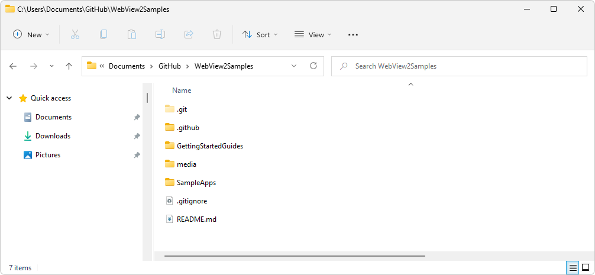

# Sample Code for WebView2

The following WebView2 samples are available in the Get Started guides for WebView2 and in the [WebView2Samples repo](https://github.com/MicrosoftEdge/WebView2Samples).  You can download the repo or clone it.

*  If you clone the repo, you can update your local copy using git commands or features of various Dev apps.

*  If you download the repo as a `.zip` file, you get a snapshot copy of the repo.  You can then download another, updated copy of the repo later.


<!-- ====================================================================== -->
## Sample code for Get Started guides

The WebView2 Get Started guides use starter code for Win32, Windows Presentation Foundation (WPF), WinForms, and WinUI.

| Platform | Article | Code |
|---|---|---|
| Win32 | [Get started with WebView2 in Win32 apps](get-started/win32.md) | Starter code at [WebView2Samples > Win32_GettingStarted](https://github.com/MicrosoftEdge/WebView2Samples/tree/master/GettingStartedGuides/Win32_GettingStarted) |
| WinForms | [Get started with WebView2 in WinForms apps](get-started/winforms.md) | .NET starter code at [WebView2Samples > WinForms_GettingStarted](https://github.com/MicrosoftEdge/WebView2Samples/tree/master/GettingStartedGuides/WinForms_GettingStarted) |
| WinUI 2 | [Get started with WebView2 in WinUI 2 (UWP) apps (public preview)](get-started/winui2.md) | Uses the WinUI 2 NuGet package.  Has no sample code. |
| WinUI 3 | [Get started with WebView2 in WinUI 3 (Windows App SDK) apps](get-started/winui.md) | Starter code at [WebView2Samples > WinUI3_GettingStarted](https://github.com/MicrosoftEdge/WebView2Samples/tree/master/GettingStartedGuides/WinUI3_GettingStarted) |
| WPF | [Get started with WebView2 in WPF apps](get-started/wpf.md) | .NET starter code at [WebView2Samples > WPF_GettingStarted](https://github.com/MicrosoftEdge/WebView2Samples/tree/master/GettingStartedGuides/WPF_GettingStarted) |


<!-- ====================================================================== -->
## Visual Studio .sln files and README.md files in the WebView2Samples repo

The `WebView2Samples` repo contains multiple `README.md` files and `.sln` files.  When you clone the repo, you can then view any of these `README.md` files in Visual Studio.

Top-level README for the overall repo:
*  [WebView2Samples\README.md](https://github.com/MicrosoftEdge/WebView2Samples#readme)


**`GettingStartedGuides` directory: solution and readme files, for the per-platform tutorials:**

* Getting started for Win32: `WebView2Samples/GettingStartedGuides/Win32_GettingStarted/WebView2GettingStarted.sln`
   *  [WebView2Samples\GettingStartedGuides\Win32_GettingStarted\README.md](https://github.com/MicrosoftEdge/WebView2Samples/tree/master/GettingStartedGuides/Win32_GettingStarted#readme)

* Getting started for WinUI 3: `WebView2Samples/GettingStartedGuides/WinUI3_GettingStarted/WinUI_Sample/WinUI_Sample.sln`
   *  [WebView2Samples\GettingStartedGuides\WinUI3_GettingStarted\README.md](https://github.com/MicrosoftEdge/WebView2Samples/tree/master/GettingStartedGuides/WinUI3_GettingStarted#readme)

* Getting started for WinForms: `WebView2Samples/GettingStartedGuides/WinForms_GettingStarted/WinForms_GettingStarted.sln`
   *  No README file.

* Getting started for WPF: `WebView2Samples/GettingStartedGuides/WPF_GettingStarted/WPFSample.sln`
   *  `WebView2Samples\GettingStartedGuides\WPF_GettingStarted\README.md`


**`SampleApps` directory: solution and readme files:**

*  WebView2Samples: `WebView2Samples/SampleApps/WebView2Samples.sln` - comprehensive.
   *  [WebView2Samples\SampleApps\WebView2APISample\README.md](https://github.com/MicrosoftEdge/WebView2Samples/tree/master/SampleApps/WebView2APISample#readme) - Long Readme for "WebView2 API Sample".

*  webview2_sample_uwp: `WebView2Samples/SampleApps/webview2_sample_uwp/webview2_sample_uwp.sln`
   *  [WebView2Samples\SampleApps\webview2_sample_uwp\readme.md](https://github.com/MicrosoftEdge/WebView2Samples/blob/master/SampleApps/webview2_sample_uwp#readme.md)

*  WebView2WpfBrowser: `WebView2Samples/SampleApps/WebView2WpfBrowser/WebView2WpfBrowser.sln`
   *  `WebView2Samples\SampleApps\WebView2WpfBrowser\README.md`

*  WebView2WindowsFormsBrowser: `WebView2Samples/SampleApps/WebView2WindowsFormsBrowser/WebView2WindowsFormsBrowser.sln`
   *  `WebView2Samples\SampleApps\WebView2WindowsFormsBrowser\README.md`

*  WebView2SampleWinComp: `WebView2Samples/SampleApps/WebView2SampleWinComp/WebView2SampleWinComp.sln`
   *  `WebView2Samples\SampleApps\WebView2SampleWinComp\README.md`

*  WV2CDPExtensionWPFSample: `WebView2Samples/SampleApps/WV2CDPExtensionWPFSample/WV2CDPExtensionWPFSample.sln`
   *  `WebView2Samples\SampleApps\WV2CDPExtensionWPFSample\README.md`

**Readme files for WIX and Deployment Installer:**

*  `WebView2Samples\SampleApps\WV2DeploymentWiXCustomActionSample\README.md`
*  `WebView2Samples\SampleApps\WV2DeploymentWiXBurnBundleSample\README.md`
*  `WebView2Samples\SampleApps\WV2DeploymentVSInstallerSample\README.md`


<!-- ====================================================================== -->
## Apps in the WebView2Samples.sln file

The `WebView2Samples` repo includes sample projects for Win32, WPF, WinForms, and WinUI.  These samples are hybrid applications that use the Microsoft Edge WebView2 control.

1. In a separate window or tab, see [WebView2Samples repo (README page)](https://github.com/MicrosoftEdge/WebView2Samples).

1. Clone the `WebView2Samples` repo, as described in [Clone or download the WebView2 samples repo](#clone-or-download-the-webview2samples-repo) below.

1. In your resulting, local copy of the repo directory structure, find all `*.sln` files.

1. Open one of the `.sln` files.  For example, open your local copy of the solution file [WebView2Samples.sln](https://github.com/MicrosoftEdge/WebView2Samples/blob/master/SampleApps/WebView2Samples.sln) in Microsoft Visual Studio.  When you open that solution file in Visual Studio, **Solution Explorer** contains the following WebView2 samples, as projects:

   

The `WebView2Samples` repo contains the following projects, in `WebView2Samples.sln`:

| Type of sample | Sample Project | Description |
|---|---|---|
| Win32 C++ | [WebView2APISample](https://github.com/MicrosoftEdge/WebView2Samples/tree/master/SampleApps/WebView2APISample) | Embeds a WebView2 within a Win32 native application.  Illustrates a selection of WebView2 event handlers and API methods that allow a native Win32 application to directly interact with a WebView and vice versa.<br/><br/>  Built as a Win32 project in [Visual Studio 2019](https://visualstudio.microsoft.com/vs/).  Uses C++ and HTML/CSS/JavaScript in the WebView2 environment. |
| Win32 C++ with Visual Composition | [WebView2SampleWinComp](https://github.com/MicrosoftEdge/WebView2Samples/tree/master/SampleApps/WebView2SampleWinComp) | Embeds a WebView2 within a Win32 native application.  Uses [Windows Runtime Composition APIs](/uwp/api/windows.ui.composition), also called the Visual layer, to take advantage of the latest Windows 10 or later UI features and create better look, feel, and functionality in C++ Win32 applications.<br/><br/>  Built as a Win32 project in Visual Studio 2019.  Uses C++ and HTML/CSS/JavaScript in the WebView2 environment. |
| WinForms | [WebView2WindowsFormsBrowser](https://github.com/MicrosoftEdge/WebView2Samples/tree/master/SampleApps/WebView2WindowsFormsBrowser) | Embeds a WebView2 within a Windows Forms application.<br/><br/>  Built as a Windows Forms project in Visual Studio 2019.  Uses C# and HTML/CSS/JavaScript in the WebView2 environment. |
| Windows Presentation Foundation (WPF) .NET | [WebView2WpfBrowser](https://github.com/MicrosoftEdge/WebView2Samples/tree/master/SampleApps/WebView2WpfBrowser) | Embeds a WebView2 within a WPF application.<br/><br/>  Built as a WPF project in Visual Studio 2019.  Uses C# and HTML/CSS/JavaScript in the WebView2 environment. |
| Chrome DevTools Protocol (CDP) in WPF | [WV2CDPExtensionWPFSample](https://github.com/MicrosoftEdge/WebView2Samples/tree/master/SampleApps/WV2CDPExtensionWPFSample) | Uses Chrome [DevTools Protocol](../devtools-protocol-chromium\index.md) functions using a `DevToolsProtocolHelper` object in WebView2.  Demonstrates the usage patterns of the WebView2 CDP extension in WPF.  This application is built with the [WebView2 CDP Extension](https://aka.ms/webviewcdp) that defines all CDP methods, events, and types.<br/><br/>  Built as a WPF project in Visual Studio 2019.  Uses C# in the WebView2 environment. |
| WiX Burn Bundle to deploy Runtime | [WV2DeploymentWiXBurnBundleSample](https://github.com/MicrosoftEdge/WebView2Samples/blob/master/SampleApps/WV2DeploymentWiXBurnBundleSample/README.md) | Creates a [WiX](https://wixtoolset.org/) installer for the [WebView2APISample](https://github.com/MicrosoftEdge/WebView2Samples/blob/master/SampleApps/WebView2APISample/README.md) and uses [WiX Burn Bundle](https://wixtoolset.org/documentation/manual/v3/bundle/) to chain-install the Evergreen WebView2 Runtime.<br/><br/>  Used when deploying the [Evergreen WebView2 Runtime](concepts/distribution.md) with your app. |
| WiX Custom Action to deploy Runtime | [WV2DeploymentWiXCustomActionSample](https://github.com/MicrosoftEdge/WebView2Samples/blob/master/SampleApps/WV2DeploymentWiXCustomActionSample/README.md) | Creates a WiX installer for the `WebView2APISample` and uses [WiX Custom Action](https://wixtoolset.org/documentation/manual/v3/wixdev/extensions/authoring_custom_actions.html) to chain-install the Evergreen WebView2 Runtime.<br/><br/>  Used when deploying the Evergreen WebView2 Runtime with your app. |


<!-- ====================================================================== -->
## UWP/WinUI samples

A comprehensive API sample for UWP/WinUI is available from the [WinUI Controls Gallery](https://github.com/microsoft/Xaml-Controls-Gallery/tree/winui3preview).

This WinUI Controls Gallery sample shows all of the XAML controls in an interactive format.  This app is the interactive companion to the [Fluent Design Guidelines](/windows/uwp/design/basics/) and shows the usage of both UWP XAML APIs and [Windows UI Toolkit](/uwp/toolkits/winui/) APIs.


<!-- ====================================================================== -->
## Deploy the Evergreen WebView2 Runtime

The [WV2DeploymentVSInstallerSample](https://github.com/MicrosoftEdge/WebView2Samples/blob/master/SampleApps/WV2DeploymentVSInstallerSample/README.md) uses the [Microsoft Visual Studio Installer Projects](https://marketplace.visualstudio.com/items?itemName=visualstudioclient.MicrosoftVisualStudio2017InstallerProjects) extension for Visual Studio, to create an installer for [WebView2APISample](https://github.com/MicrosoftEdge/WebView2Samples/blob/master/SampleApps/WebView2APISample/README.md) and chain-install the Evergreen WebView2 Runtime.

This sample is a separate installer. It's not part of the `WebView2Samples` repo.


<!-- ====================================================================== -->
## Install git, Visual Studio, and a preview channel of Microsoft Edge

The platform-specific Get Started guides contain some platform-specific setup steps to set up your dev environment.  The present section is general-purpose.

To open the WebView2 samples and run them in debug mode, install the following development software.

### Install git

1. If you want to clone the `WebView2Samples` repo, and if git isn't not already installed, [Download git](https://git-scm.com/downloads) and install it.  git will be used during cloning the `WebView2Samples` repo from GitHub, below.


### Install Visual Studio

1. Install [Visual Studio](https://visualstudio.microsoft.com) 2015 or later (such as Visual Studio Professional 2022).

   The WebView2 samples are designed for Microsoft **Visual Studio**, not Microsoft **Visual Studio Code**.

   If you are installing Visual Studio 2022, you can accept the defaults for now; you can click **Install**, and decline installing the Workloads at this time.

   Initial setup of Visual Studio is done.  It's likely that additional Visual Studio setup dialogs will open later in this tutorial.

Platform-specific Get Started guides contain more information about dev machine setup; for example, the Win32 tutorial tells how to install workloads if prompted to, upon opening a partiular sample.  For example, see [Install the "Desktop development with C++" workload](get-started/win32.md#install-the-desktop-development-with-c-workload) in _Get started with WebView2 in Win32 apps_.


### Install a preview channel of Microsoft Edge

1. Install any [Microsoft Edge Insider (preview) Channel](https://www.microsoftedgeinsider.com/download) (Beta, Dev, or Canary) on a supported operating system (OS):
   *  Windows 7
   *  Windows 8.1
   *  Windows 10
   *  Windows 11

   We recommend using the Canary channel.  The minimum required version is 82.0.488.0.


### Install the WebView2 Runtime (optional)

1. Optionally, install the [WebView2 Runtime](https://developer.microsoft.com/microsoft-edge/webview2).

   If unsure, skip this step; you can use the Microsoft Edge preview channel from the previous step instead.

   If you want more information about this decision now, in a new window or tab, see [Understand WebView2 SDK versions](../concepts/versioning.md).


<!-- The h3 section [Clone or download the WebView2Samples repo](get-started/win32.md#clone-or-download-the-webview2samples-repo) in _Get started with WebView2 in Win32 apps_ links to here -->
<!-- ====================================================================== -->
## Clone or download the WebView2Samples repo

To clone the repo, you must first install git, per the previous section.  You can download the repo as a `.zip` file instead of cloning the repo.

*  If you clone the repo, you can update your local copy using git commands or features of various Dev apps.

*  If you download the repo as a `.zip` file, you get a snapshot copy of the repo.  You can then download another, updated copy of the repo later.


### Learn about the WebView2Samples repo

1. In a new browser window or tab, briefly explore the repo's directory layout online at GitHub: [https://github.com/MicrosoftEdge/WebView2Samples/tree/master/SampleApps](https://github.com/MicrosoftEdge/WebView2Samples/tree/master/SampleApps).

1. Briefly go into the `SampleApps` folder.

1. Briefly go into `GettingStartedGuides`.  For example, go into `Win32_GettingStarted` and notice `WebView2GettingStarted.sln`, and look in `HelloWebView.cpp`.

Then return here and continue with the steps below.


### Downloading the WebView2Samples repo

If you want to download the repo (as a `.zip` file):

1. Open the [WebView2Samples repo](https://github.com/MicrosoftEdge/WebView2Samples) in a new window or tab.

1. Click the green **Code** button in the upper right of the GitHub repo, and then click **Download ZIP**.

   

   The **Download** pop-up appears in Microsoft Edge:

   

   In Microsoft Edge, if the **Download** pop-up isn't visible, click **Settings and more** (...) and then click **Downloads**.

1. In the **Downloads** pop-up window, hover to the right of `WebView2Samples-master.zip` and then click the **Show in folder** (folder) icon.

   It is recommended that you don't click the **Open file** link, because that immediately unzips the file in your Downloads area, which could make it harder (and slower) to move to your desired location.

1. Copy or cut the `WebView2Samples-master.zip` file from your Downloads directory to a regular directory, such as `Documents`.

1. Unzip the .`WebView2Samples-master.zip` file and note the location of the unzipped files.

   

1. Study the breakout of main directories.  `-master` is the name of the repo branch that this downloaded directory snapshot represents.


### Obtain the URL for cloning the WebView2Samples repo

If you are cloning instead of downloading the repo:

1. Open the [WebView2Samples repo](https://github.com/MicrosoftEdge/WebView2Samples) in a new window or tab.

1. Click the green **Code** button in the upper right of the GitHub repo, select **Clone**, and then click the **Copy** icon (or, select the HTTPS URL string in the text box and copy it).

   

1. Decide which tool you want to use to locally clone the repo:
   *  Visual Studio
   *  GitHub Desktop
   *  Git Bash shell or command prompt


Next, clone the GitHub repo to your local drive.  To do that, follow the appropriate steps below, for the tool you want to use.


### Cloning the repo by using Visual Studio

If you want to use Visual Studio to clone the GitHub repo to your local drive:

1. In Visual Studio, select **File** > **Clone repository**.

1. Enter the URL that you copied from the GitHub repo.

1. From within the same dialog box, or in a file explorer utility, you can create a general-purpose root `git` or `GitHub` folder in a writeable location, then select that directory, so that the repo will be cloned there, as a new directory.

   For example, you could create the repo in the parent folder: `C:\Users\myUserName\Documents\GitHub\`, so that the cloning operation will create the new directory `C:\Users\myUserName\Documents\GitHub\WebView2Samples`.

You've cloned the repo to your local drive.  Skip to the next major section below.


### Cloning the repo by using GitHub Desktop

If you want to use GitHub Desktop to clone the GitHub repo to your local drive:

1. Install [GitHub Desktop](https://desktop.github.com).

1. In GitHub Desktop, select **File** > **Clone repository**.

1. In Visual Studio or GitHub Desktop, enter the URL that you copied from the GitHub repo.

1. From within the same dialog box, or in a file explorer utility, you can create a general-purpose root `git` or `GitHub` folder in a writeable location, then select that directory, so that the repo will be cloned there, as a new directory.

   For example, you could create the repo in the parent folder: `C:\Users\myUserName\Documents\GitHub\`, so that the cloning operation will create the new directory `C:\Users\myUserName\Documents\GitHub\WebView2Samples`.

You've cloned the repo to your local drive.  Skip to the next major section below.


### Cloning the repo by using Git Bash shell or a command prompt

If you instead want to clone the repo by using a Git Bash shell or command prompt:

1. Clone the repo to your local drive, entering the URL string that you copied from the GitHub repo:

   ```Shell
   # example location where the repo directory will be added:
   cd c:/users/myusername/documents/github/
   git clone https://github.com/MicrosoftEdge/WebView2Samples.git
   ```

   

   The directory is created on your local drive, in the path you specified, such as in the following figure:

   

   You've cloned the repo to your local drive.

1. In your resulting, local copy of the repo directory structure, find all `*.sln` files.

1. Open a `.sln` file in Visual Studio.  For example, open your local copy of [WebView2Samples.sln](https://github.com/MicrosoftEdge/WebView2Samples/blob/master/SampleApps/WebView2Samples.sln).  This repo's solution files require Visual Studio, not Visual Studio Code.

See also [Install Visual Studio](get-started/win32.md#install-visual-studio) in _Get started with WebView2 in Win32 apps_.


<!-- ====================================================================== -->
See also
* [WebView2 API Sample > README.md](https://github.com/MicrosoftEdge/WebView2Samples/tree/master/SampleApps/WebView2APISample#webview2-api-sample)
