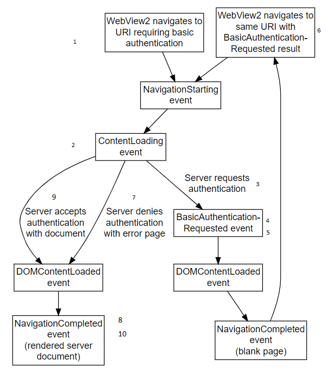

# Basic authentication for WebView2 apps

_Basic authentication_ is an authentication approach that's part of the HTTP protocol.


<!-- ====================================================================== -->
## The order of navigation events

The order of navigation events: The _basic authentication_ event happens in the middle of the events sequence, which is:

1. `NavigationStarting` - navigation event
1. `ContentLoading` - navigation event
1. `BasicAuthenticationRequested`
1. `DOMContentLoaded`
1. `NavigationCompleted` - navigation event


<!-- ====================================================================== -->
## Communication between the HTTP server, WebView2 control, and host app

*  The **HTTP server** checks authentication and conditionally returns an error document or the requested webpage/document.

*  The **WebView2 control** instance raises the events.  The WebView2 control sits between the HTTP server and the host app.  The WebView2 control communicates with the HTTP server and with the app, as an intermediary.

*  You write the **host app**.  The host app sets the user name and password on the event's arguments (`EventArgs`) response objects (in this case, `BasicAuthenticationRequestedEventArgs`).


<!-- ====================================================================== -->
## Sequence of navigation events

The following diagram shows the flow of navigation events for basic authenication for WebView2 apps:


<!-- see "Image maintenance notes" below -->

<!-- protect the numbering of steps to match the diagram -->

1. The host app tells the WebView2 control to navigate to a URL.
   <!-- next to box or label "__" -->

2. The WebView2 control talks to the HTTP server requesting to get the document at a specified URL.
   <!-- next to box or label "__" -->

3. The HTTP server replies to the WebView2 control, saying "You can't get that URL/document without authentication."
   <!-- next to box or label "__" -->

4. The WebView2 control tells the host app "Authentication is needed" (which is the `BasicAuthnRequeested` event).
   <!-- next to box or label "__" -->

5. The host app responds to that event by providing the username and password to the WebView2 control.
   <!-- next to box or label "__" -->

6. The WebView2 control again requests the URL from the HTTP server, but this time with the authentication (username and password).
   <!-- next to box or label "__" -->

7. The HTTP server might reject the username and password; it might tell the WebView2 control "You're not permitted to get that URL/document".
   <!-- next to box or label "__" -->

8. The WebView2 control renders the error page that's returned by the HTTP server (this rendering occurs between the `ContentLoading` event and `DOMContentLoaded` event).
   <!-- next to box or label "__" -->
   
9. The HTTP server accepts the authentication credentials and returns the requested document.  Or, the HTTP server denies the authentication and returns an error page document.
   <!-- next to box or label "__" -->

10. The WebView2 control renders the returned document (this rendering occurs between the `ContentLoading` event and `DOMContentLoaded` event).
   <!-- next to box or label "__" -->


<!-- ====================================================================== -->
## How navigations work


### Navigations in general

See [Navigation events for WebView2 apps](navigation-events.md).

This is optional background information about how navigations work.

A _navigation_ corresponds to multiple navigation events.  By _navigation_, we here mean each retry, starting with the `NavigationStarting` box of the diagram, through the `NavigationCompleted` box.  

When a new navigation begins, a new navigation ID is assigned.  For the new navgation, the HTTP server gave the WebView2 control a document.  This is the "have document" navigation.

As a part of navigation, the WebView2 control renders the corresponding page (the requested page or an error page, whichever is returned by the HTTP server), and a "success" or "failure" outcome raises a successful or failed `NavigationCompleted` event.


### Navigations specifically for basic authentication

There are two kinds of navigations in the flow:
*  A "server requested authentication" navigation.
*  A "server gave the WebView2 control a document" navigation.

After the first type of navigation, the server has asked for authentication and the app needs to try that kind of navigation again (with a new navigation ID).  The new navigation will use whatever the host app gets from the events arguments response objects.

An HTTP server may require HTTP authentication.  In this case, there is a _first navigation_, which has the navigation events that are listed above.  The HTTP server returns a 401 or 407 HTTP response, and so the `NavigationCompleted` event has a corresponding failure.  The WebView2 then renders a blank page, and raise the `BasicAuthenticationRequested` event, which will potentially prompt the user for credentials.

If the `BasicAuthenticationRequested` event is cancelled, then there is no subsequent navigation and the WebView2 will remain displaying the blank page.

If the `BasicAuthenticationRequested` event isn't cancelled, the WebView2 will perform the initial navigation again, but this time using any provided credentials and you will again see all the same navigation events as before.

If the credentials are not accepted by the HTTP server, and navigation fails again with 401 or 407.  In that case, the `CoreWebView2` class instance again raises the `BasicAuthenticationRequested` event, and navigation continues as above.

If the credentials are accepted by the HTTP server, or if the HTTP server denies authentication with an error page, the navigation may succeed or fail.

The navigations before and after the `BasicAuthenticationRequested` event are distinct navigations and have distinct navigation IDs.

Navigation event args has a property: the `NavigationId`.  This ID ties together navigation events that corresponds to a single navigation.  The navigation ID remains the same during each navigation, such as a retry.  During the next run through the event flow, a different navigation ID is used.

<!-- maybe add term'y table at top incl "event args" -->

<!-- ====================================================================== -->
## Example code: App providing credentials that are known ahead of time

This example shows the host app providing credentials (user name and password) that are known ahead of time.

The following sample was created by expanding the sample [WebView2APISample repo > ScenarioAuthentication.cpp](https://github.com/MicrosoftEdge/WebView2Samples/blob/d78d86f1646b6c652908f1e4bc2b64950f05ca0a/SampleApps/WebView2APISample/ScenarioAuthentication.cpp), from the WebView2Samples repo.

That sample includes the following relevant code:

<!-- ------------------------------ -->
# [C++](#tab/cpp)

```cpp
if (auto webView10 = m_webView.try_query<ICoreWebView2_10>())
{
   CHECK_FAILURE(webView10->add_BasicAuthenticationRequested(
      Callback<ICoreWebView2BasicAuthenticationRequestedEventHandler>(
            [this](
               ICoreWebView2* sender,
               ICoreWebView2BasicAuthenticationRequestedEventArgs* args)
            {
               wil::com_ptr<ICoreWebView2BasicAuthenticationResponse> basicAuthenticationResponse;
               CHECK_FAILURE(args->get_Response(&basicAuthenticationResponse));
               CHECK_FAILURE(basicAuthenticationResponse->put_UserName(L"user"));
               CHECK_FAILURE(basicAuthenticationResponse->put_Password(L"pass"));

               return S_OK;
            })
            .Get(),
      &m_basicAuthenticationRequestedToken));
}
else
{
   FeatureNotAvailable();
}
```

**APIs:**

* [ICoreWebView2BasicAuthenticationRequestedEventHandler](https://docs.microsoft.com/microsoft-edge/webview2/reference/win32/icorewebview2basicauthenticationrequestedeventhandler) - The caller implements this interface to handle the `BasicAuthenticationRequested` event.
* [ICoreWebView2BasicAuthenticationRequestedEventArgs](https://docs.microsoft.com/microsoft-edge/webview2/reference/win32/icorewebview2basicauthenticationrequestedeventargs)
   * `get_Cancel` - Cancel the authentication request.
   * `put_Cancel` - Set the `Cancel` property.
   * `get_Challenge` - The authentication challenge string.
   * `get_Response` - Response to the authentication request with credentials.
   * `get_Uri` - The URI that led to the authentication challenge.
   * `GetDeferral` - Returns an `ICoreWebView2Deferral` object.


<!-- ------------------------------ -->
# [C#](#tab/csharp)

```csharp
    webView.CoreWebView2.BasicAuthenticationRequested += delegate (
       object sender, 
       CoreWebView2BasicAuthenticationRequestedEventArgs args)
    {
        args.Response.UserName = "user";
        args.Response.Password = "pass";
    };
```

**APIs:**

* [CoreWebView2.BasicAuthenticationRequested Event](https://docs.microsoft.com/dotnet/api/microsoft.web.webview2.core.corewebview2.basicauthenticationrequested)
* [CoreWebView2BasicAuthenticationRequestedEventArgs Class](https://docs.microsoft.com/dotnet/api/microsoft.web.webview2.core.corewebview2basicauthenticationrequestedeventargs)

---
<!-- end of tab-set -->

The above code isn't realistic, because:

*  In practice, you'd prompt the user for the username and password rather than hardcoding them like `"user"` and `"pass"` in the listing above.
*  The above code is synchronous, but you'd probably use asynchronous code instead, as shown below.


<!-- ====================================================================== -->
## Example code: Prompting user for credentials

This example shows the host app prompting the user for credentials (user name and password), and uses async code.

The following code adds to the above sample, by adding the following features, using the `BasicAuthenticationRequested` event.
*  Prompt the user for UI to enter their username and password.
*  Call the `GetDeferral` method on the `event` argument.

<!-- ------------------------------ -->
# [C++](#tab/cpp)

```cpp
if (auto webView10 = m_webView.try_query<ICoreWebView2_10>())
{
    CHECK_FAILURE(webView10->add_BasicAuthenticationRequested(
        Callback<ICoreWebView2BasicAuthenticationRequestedEventHandler>(
            [this](
                ICoreWebView2* sender,
                ICoreWebView2BasicAuthenticationRequestedEventArgs* argsRaw)
            {
                // Make a smart pointer copy of the event args so we can take it
                // into our lambda below.
                wil::com_ptr<ICoreWebView2BasicAuthenticationRequestedEventArgs>
                    args = argsRaw;

                // We need to show UI asynchronously so we obtain a deferral.
                // A deferral will delay the CoreWebView2 from
                // examining the properties we set on the event args until
                // after we call the Complete method asynchronously later.
                // This gives us time to asynchronously show UI.
                wil::com_ptr<ICoreWebView2Deferral> deferral;
                CHECK_FAILURE(args->GetDeferral(&deferral));

                HWND mainWindowHwnd = m_appWindow->GetMainWindow();

                m_appWindow->RunAsync([args, deferral, mainWindowHwnd]()
                    {
                        wil::com_ptr<ICoreWebView2BasicAuthenticationResponse>
                            basicAuthenticationResponse;
                        CHECK_FAILURE(args->get_Response(&basicAuthenticationResponse));

                        wil::unique_cotaskmem_string uri;
                        CHECK_FAILURE(args->get_Uri(&uri));

                        wil::unique_cotaskmem_string challenge;
                        CHECK_FAILURE(args->get_Challenge(&challenge));

                        // When prompting the end user for authentication its important
                        // to show them the URI or origin of the URI that is requesting
                        // authentication so the end user will know who they are giving
                        // their username and password to.
                        std::wstring prompt = L"Authentication request from ";
                        prompt += uri.get();
                        // Its also important to display the challenge to the end user
                        // as it may have important site specific information for the
                        // end user to provide the correct username and password.
                        prompt += L"\r\nChallenge: ";
                        prompt += challenge.get(); 

                        // Use an app or UI framework method to get input from the end user.
                        TextInputDialog dialog(
                            mainWindowHwnd, 
                            L"Authentication Request",
                            L"User name and password",
                            prompt.c_str(),
                            L"username\r\npassword");
                        bool userNameAndPasswordSet = false;

                        if (dialog.confirmed)
                        {
                            const std::wstring& userNameAndPassword = dialog.input;
                            std::size_t separatorIdx = userNameAndPassword.find(L"\r\n");
                            if (separatorIdx != std::wstring::npos)
                            {
                                std::wstring userName =
                                    userNameAndPassword.substr(0, separatorIdx);
                                std::wstring password =
                                    userNameAndPassword.substr(separatorIdx + 2);

                                basicAuthenticationResponse->put_UserName(userName.c_str());
                                basicAuthenticationResponse->put_Password(password.c_str());

                                userNameAndPasswordSet = true;
                            }
                        }

                        // If we didn't get a username and password from the end user then
                        // we cancel the authentication request and don't provide any
                        // authentication.
                        if (!userNameAndPasswordSet)
                        {
                            args->put_Cancel(TRUE);
                        }

                        // We've finished our asynchronous work and so we complete the
                        // deferral to let the CoreWebView2 know that we're done changing
                        // values on the event args.
                        deferral->Complete();
                    });

                return S_OK;
            })
            .Get(),
        &m_basicAuthenticationRequestedToken));
}
else
{
    FeatureNotAvailable();
}
```

**APIs:**

* [ICoreWebView2BasicAuthenticationRequestedEventArgs](https://docs.microsoft.com/microsoft-edge/webview2/reference/win32/icorewebview2basicauthenticationrequestedeventargs)
   * `get_Cancel` - Cancel the authentication request.
   * `put_Cancel` - Set the `Cancel` property.
   * `get_Challenge` - The authentication challenge string.
   * `get_Response` - Response to the authentication request with credentials.
   * `get_Uri` - The URI that led to the authentication challenge.
   * `GetDeferral` - Returns an `ICoreWebView2Deferral` object.


<!-- ------------------------------ -->
# [C#](#tab/csharp)


```csharp
webView.CoreWebView2.BasicAuthenticationRequested += delegate (
    object sender, 
    CoreWebView2BasicAuthenticationRequestedEventArgs args)
{
    // We need to show UI asynchronously so we obtain a deferral.
    // A deferral will delay the CoreWebView2 from
    // examining the properties we set on the event args until
    // after we call the Complete method asynchronously later.
    // This gives us time to asynchronously show UI.
    CoreWebView2Deferral deferral = args.GetDeferral();

    // We avoid potential reentrancy from running a message loop in the
    // event handler by showing our download dialog later when we
    // complete the deferral asynchronously.
    System.Threading.SynchronizationContext.Current.Post((_) =>
    {
        using (deferral)
        {
            // When prompting the end user for authentication its important
            // to show them the URI or origin of the URI that is requesting
            // authentication so the end user will know who they are giving
            // their username and password to.

            // Its also important to display the challenge to the end user
            // as it may have important site specific information for the
            // end user to provide the correct username and password.

            // Use an app or UI framework method to get input from the end user.
            TextInputDialog dialog = new TextInputDialog(
                title: "Authentication Request",
                description: "Authentication request from " + args.Uri + "\r\n" +
                    "Challenge: " + args.Challenge,
                defaultInput: "username\r\npassword");
            bool userNameAndPasswordSet = false;

            if (dialog.ShowDialog().GetValueOrDefault(false))
            {
                string[] userNameAndPassword = dialog.Input.Text.Split(
                    new char[] { '\r', '\n' }, StringSplitOptions.RemoveEmptyEntries);
                if (userNameAndPassword.Length > 1)
                {
                    args.Response.UserName = userNameAndPassword[0];
                    args.Response.Password = userNameAndPassword[1];
                    userNameAndPasswordSet = true;
                }
            }

            // If we didn't get a username and password from the end user then
            // we cancel the authentication request and don't provide any
            // authentication.
            if (!userNameAndPasswordSet)
            {
                args.Cancel = true;
            }
        }
    }, null);
};
```

**APIs:**

* [CoreWebView2BasicAuthenticationRequestedEventArgs Class](https://docs.microsoft.com/dotnet/api/microsoft.web.webview2.core.corewebview2basicauthenticationrequestedeventargs)
   * Properties:
       * `Cancel` - Indicates whether to cancel the authentication request.
       * `Challenge` - The authentication challenge string.
       * `Response` - Response to the authentication request with credentials.
       * `Uri` - The URI that led to the authentication challenge.
   * Methods:
      * `GetDeferral()` - Gets a `CoreWebView2Deferral` object.

---
<!-- end of tab-set -->


<!-- ====================================================================== -->
<!-- Image maintenance notes (keep)
todo: Add callouts (numbers) to each arrow to help communicate the sequence.
todo in a later PR: re-create the below image in Visio, and store the .vsd file in Teams > Files, and describe the .vsd location here.

Source location for the image:
reliable approach: paste the following code listing into https://edotor.net:

Paste this code into site, see if the resulting diagram matches the diagram in this article:

```edotor
# https://edotor.net/
digraph g {
    fontname="Helvetica";
    labeljust=l;
    node [shape="box", fontname="Sans-Serif"]
    edge [fontname="Arial"]
    {
        rank = same;
        Start [label="WebView2 navigates to\nURI requiring basic\nauthentication"]
        Retry [label="WebView2 navigates to\nsame URI with\nBasicAuthentication-\nRequested result"]
    }
    NavigationStarting0 [label="NavigationStarting\nevent"];
    ContentLoading0 [label="ContentLoading\nevent"];
    BasicAuthenticationRequested0 [label="BasicAuthentication-\nRequested event"];
    {
        rank = same;
        DOMContentLoaded0 [label="DOMContentLoaded\nevent"];
        DOMContentLoaded1 [label="DOMContentLoaded\nevent"];
    }
    NavigationCompleted0 [label="NavigationCompleted\nevent\n(blank page)"];
    NavigationCompleted1 [label="NavigationCompleted\nevent\n(rendered server\ndocument)"];
    NavigationStarting0 -> ContentLoading0;
    ContentLoading0 -> BasicAuthenticationRequested0 [label="Server requests\nauthentication"];
    ContentLoading0 -> DOMContentLoaded1 [label="Server accepts\nauthentication\nwith document"];
    ContentLoading0 -> DOMContentLoaded1 [label="Server denies\nauthentication\nwith error page"];
    DOMContentLoaded1 -> NavigationCompleted1;
    BasicAuthenticationRequested0 -> DOMContentLoaded0 -> NavigationCompleted0;
    BasicAuthenticationRequested0;
    Start -> NavigationStarting0;
    NavigationStarting0 -> Retry [style=invis];
    NavigationCompleted0 -> Retry;
    Retry -> NavigationStarting0;
}
```

Beware of clicking this link: it might become too long and be invalid.
Try this URL, compare to the .png diagram:
If possible, it's the URL that attempts to express the above code listing; it's the resulting URL from the above image-definition code:
https://edotor.net/?
https://edotor.net/?engine=dot#digraph%20g%20%7B%0A%20%20%20%20fontname%3D%22Helvetica%22%3B%0A%20%20%20%20labeljust%3Dl%3B%0A%20%20%20%20node%20%5Bshape%3D%22box%22%2C%20fontname%3D%22Sans-Serif%22%5D%0A%20%20%20%20edge%20%5Bfontname%3D%22Arial%22%5D%0A%20%20%20%20%7B%0A%20%20%20%20%20%20%20%20rank%20%3D%20same%3B%0A%20%20%20%20%20%20%20%20Start%20%5Blabel%3D%22WebView2%20navigates%20to%5CnURI%20requiring%20basic%5Cnauthentication%22%5D%0A%20%20%20%20%20%20%20%20Retry%20%5Blabel%3D%22WebView2%20navigates%20to%5Cnsame%20URI%20with%5CnBasicAuthentication-%5CnRequested%20result%22%5D%0A%20%20%20%20%7D%0A%20%20%20%20NavigationStarting0%20%5Blabel%3D%22NavigationStarting%5Cnevent%22%5D%3B%0A%20%20%20%20ContentLoading0%20%5Blabel%3D%22ContentLoading%5Cnevent%22%5D%3B%0A%20%20%20%20BasicAuthenticationRequested0%20%5Blabel%3D%22BasicAuthentication-%5CnRequested%20event%22%5D%3B%0A%20%20%20%20%7B%0A%20%20%20%20%20%20%20%20rank%20%3D%20same%3B%0A%20%20%20%20%20%20%20%20DOMContentLoaded0%20%5Blabel%3D%22DOMContentLoaded%5Cnevent%22%5D%3B%0A%20%20%20%20%20%20%20%20DOMContentLoaded1%20%5Blabel%3D%22DOMContentLoaded%5Cnevent%22%5D%3B%0A%20%20%20%20%7D%0A%20%20%20%20NavigationCompleted0%20%5Blabel%3D%22NavigationCompleted%5Cnevent%5Cn(blank%20page)%22%5D%3B%0A%20%20%20%20NavigationCompleted1%20%5Blabel%3D%22NavigationCompleted%5Cnevent%5Cn(rendered%20server%5Cndocument)%22%5D%3B%0A%20%20%20%20NavigationStarting0%20-%3E%20ContentLoading0%3B%0A%20%20%20%20ContentLoading0%20-%3E%20BasicAuthenticationRequested0%20%5Blabel%3D%22Server%20requests%5Cnauthentication%22%5D%3B%0A%20%20%20%20ContentLoading0%20-%3E%20DOMContentLoaded1%20%5Blabel%3D%22Server%20accepts%5Cnauthentication%5Cnwith%20document%22%5D%3B%0A%20%20%20%20ContentLoading0%20-%3E%20DOMContentLoaded1%20%5Blabel%3D%22Server%20denies%5Cnauthentication%5Cnwith%20error%20page%22%5D%3B%0A%20%20%20%20DOMContentLoaded1%20-%3E%20NavigationCompleted1%3B%0A%20%20%20%20BasicAuthenticationRequested0%20-%3E%20DOMContentLoaded0%20-%3E%20NavigationCompleted0%3B%0A%20%20%20%20BasicAuthenticationRequested0%3B%0A%20%20%20%20Start%20-%3E%20NavigationStarting0%3B%0A%20%20%20%20NavigationStarting0%20-%3E%20Retry%20%5Bstyle%3Dinvis%5D%3B%0A%20%20%20%20NavigationCompleted0%20-%3E%20Retry%3B%0A%20%20%20%20Retry%20-%3E%20NavigationStarting0%3B%0A%7D%0A
-->


<!-- ====================================================================== -->
## API Reference overview

<!-- ------------------------------ -->
# [C++](#tab/cpp)

* [ICoreWebView2BasicAuthenticationRequestedEventArgs interface](https://docs.microsoft.com/microsoft-edge/webview2/reference/win32/icorewebview2basicauthenticationrequestedeventargs) - Event args for the `BasicAuthenticationRequested` event.
* [add_BasicAuthenticationRequested method](https://docs.microsoft.com/microsoft-edge/webview2/reference/win32/icorewebview2_10#add_basicauthenticationrequested) - Add an event handler for the `BasicAuthenticationRequested` event.<!-- ~= C++'s BasicAuthenticationRequested event -->
* [ICoreWebView2Deferral interface](https://docs.microsoft.com/microsoft-edge/webview2/reference/win32/icorewebview2deferral)
* [ICoreWebView2BasicAuthenticationRequestedEventHandler](https://docs.microsoft.com/microsoft-edge/webview2/reference/win32/icorewebview2basicauthenticationrequestedeventhandler) - The caller implements this interface to handle the `BasicAuthenticationRequested` event.


<!-- ------------------------------ -->
# [C#](#tab/csharp)

* [CoreWebView2BasicAuthenticationRequestedEventArgs Class](https://docs.microsoft.com/dotnet/api/microsoft.web.webview2.core.corewebview2basicauthenticationrequestedeventargs) - Event args for the `BasicAuthenticationRequested` event.  Will contain the request that led to the HTTP authorization challenge, the challenge and allows the host to provide authentication response or cancel the request.
* [CoreWebView2.BasicAuthenticationRequested Event](https://docs.microsoft.com/dotnet/api/microsoft.web.webview2.core.corewebview2.basicauthenticationrequested) - `BasicAuthenticationRequested` event is raised when WebView encounters a Basic HTTP Authentication request as described in [MDN > HTTP authentication](https://developer.mozilla.org/docs/Web/HTTP/Authentication) or an NTLM authentication request.
* [CoreWebView2Deferral Class](https://docs.microsoft.com/dotnet/api/microsoft.web.webview2.core.corewebview2deferral) - Used to complete deferrals on event args that support getting deferrals using the `GetDeferral` method. Implements `IDisposable`.

---
<!-- end of tab-set -->


<!-- ====================================================================== -->
## See also

*  [HTTP authentication](https://developer.mozilla.org/docs/Web/HTTP/Authentication) at MDN.
