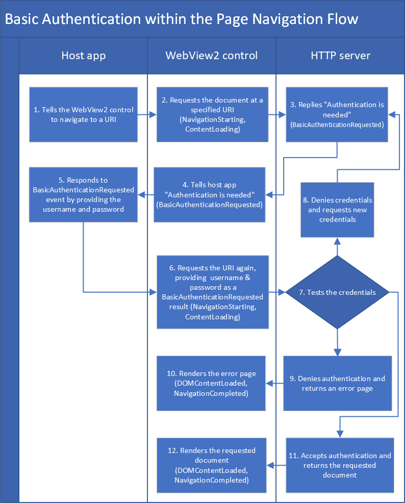

# Basic authentication for WebView2 apps

_Basic authentication_ is an [authentication](https://developer.mozilla.org/docs/Web/HTTP/Authentication) approach that's part of the HTTP protocol.

Basic authentication for WebView2 apps includes a sequence of authentication and navigation steps to retrieve a webpage from an HTTP server.  The WebView2 control acts as an intermediary for communication between the host app and the HTTP server.


<!-- ====================================================================== -->
## Use HTTPS for sending credentials

Warning: You must use HTTPS when using Basic Authentication.  Otherwise the username and password are not encrypted. You may want to consider other forms of authentication.

The HTTP standard for basic authentication includes the authentication credentials (username and password) unencrypted. Therefore, you must use `https`, to ensure that the credentials are encrypted.


<!-- ====================================================================== -->
## The order of navigation events

The basic authentication event happens in the middle of the sequence of events:

1. `NavigationStarting` - navigation event
1. `ContentLoading` - navigation event
1. `BasicAuthenticationRequested`
1. `DOMContentLoaded`
1. `NavigationCompleted` - navigation event

For more information, see [Navigation events for WebView2 apps](navigation-events.md).


<!-- ====================================================================== -->
## Communication between the HTTP server, WebView2 control, and host app

*  The **HTTP server** checks authentication (username and password credentials) and returns either an error document or the requested webpage.

*  The **WebView2 control** instance raises the events.  The WebView2 control sits between the HTTP server and the host app.  The WebView2 control serves as an intermediary for communication between the host app and the HTTP server.

*  You write the **host app**.  The host app sets the user name and password on the event's arguments (`EventArgs`) response objects.

`BasicAuthenticationRequestedEventArgs` has a `Response` property.  The `Response` property is an object that contains the username and password properties.


<!-- ====================================================================== -->
## Sequence of navigation events

The following diagram shows the flow of navigation events for basic authentication for WebView2 apps:


<!-- initial Visio file name: https://microsoft-my.sharepoint.com/ ... "Basic Auth in Page Nav Flow.vsd"
later, check:  Teams > Team > channel > Files > dir > file name -->

<!-- diagram labels in comments: -->

1. The host app tells the WebView2 control to navigate to a URI.
   <!-- "1. Tells the WebView2 control to navigate to a URI" -->

1. The WebView2 control talks to the HTTP server requesting to get the document at a specified URI.
   <!-- "2. Requests the document at a specified URI (NavigationStarting, ContentLoading)" -->

1. The HTTP server replies to the WebView2 control, saying "You can't get that URI (document) without authentication."
   <!-- "3. Replies "Authentication is needed" (BasicAuthenticationRequested)" -->

1. The WebView2 control tells the host app "Authentication is needed" (which is the `BasicAuthenticationRequested` event).
   <!-- "4. Tells host app "Authentication is needed" (BasicAuthenticationRequested)" -->

1. The host app responds to that event by providing the username and password to the WebView2 control.
   <!-- "5. Responds to BasicAuthenticationRequested event by providing the username and password" -->

1. The WebView2 control again requests the URI from the HTTP server, but this time with the authentication (username and password).
   <!-- "6. Requests the URI again, providing username & password as a BasicAuthenticationRequested result (NavigationStarting, ContentLoading)" -->

1. The HTTP server evaluates the credentials (username and password).
   <!-- "7. Tests the credentials" -->

1. The HTTP server might deny the credentials and request new credentials.
   <!-- "8. Denies credentials and requests new credentials" -->

1. The HTTP server might reject the username and password; it might tell the WebView2 control "You're not permitted to get that URI/document".
   <!-- "9. Denies authentication and returns an error page" -->

1. The WebView2 control renders the error page that's returned by the HTTP server.  The rendering occurs between the `ContentLoading` event and `DOMContentLoaded` event.
   <!-- "10. Renders the error page (DOMContentLoaded, NavigationCompleted)" -->
   
1. The HTTP server might accept the authentication credentials and return the requested document.
   <!-- "11. Accepts authentication and returns the requested document" -->

1. The WebView2 control renders the returned document.  The rendering occurs between the `ContentLoading` event and `DOMContentLoaded` event.
   <!-- "12. Renders the requested document (DOMContentLoaded, NavigationCompleted)" -->


<!-- ====================================================================== -->
## Example code: App providing credentials that are known ahead of time

The following simplified example shows the host app providing credentials (user name and password) that are known ahead of time.  This example is a slightly modified version of the code that's in [WebView2Samples repo > WebView2APISample > ScenarioAuthentication.cpp](https://github.com/MicrosoftEdge/WebView2Samples/blob/d78d86f1646b6c652908f1e4bc2b64950f05ca0a/SampleApps/WebView2APISample/ScenarioAuthentication.cpp).

This example isn't realistic, because:

*  In practice, you'd prompt the user for the username and password rather than hardcoding them like `"user"` and `"pass"`.
*  This code is synchronous, but you'd probably use asynchronous code instead.

For more realistic code, see the subsequent section.

<!-- ------------------------------ -->

# [C#](#tab/csharp)

```csharp
// Prerequisite: Before using this code, make sure you read the section "Use HTTPS 
// for sending credentials" in this article.
    webView.CoreWebView2.BasicAuthenticationRequested += delegate (
       object sender, 
       CoreWebView2BasicAuthenticationRequestedEventArgs args)
    {
        args.Response.UserName = "user";
        args.Response.Password = "pass";
    };
```

**APIs:**

* [CoreWebView2.BasicAuthenticationRequested Event](/dotnet/api/microsoft.web.webview2.core.corewebview2.basicauthenticationrequested)
* [CoreWebView2BasicAuthenticationRequestedEventArgs Class](/dotnet/api/microsoft.web.webview2.core.corewebview2basicauthenticationrequestedeventargs)

<!-- ------------------------------ -->

# [C++](#tab/cpp)

```cpp
// Prerequisite: Before using this code, make sure you read the section "Use HTTPS 
// for sending credentials" in this article.
if (auto webView10 = m_webView.try_query<ICoreWebView2_10>())
{
   CHECK_FAILURE(webView10->add_BasicAuthenticationRequested(
      Callback<ICoreWebView2BasicAuthenticationRequestedEventHandler>(
            [this](
               ICoreWebView2* sender,
               ICoreWebView2BasicAuthenticationRequestedEventArgs* args)
            {
               wil::com_ptr<ICoreWebView2BasicAuthenticationResponse> basicAuthenticationResponse;
               CHECK_FAILURE(args->get_Response(&basicAuthenticationResponse));
               CHECK_FAILURE(basicAuthenticationResponse->put_UserName(L"user"));
               CHECK_FAILURE(basicAuthenticationResponse->put_Password(L"pass"));

               return S_OK;
            })
            .Get(),
      &m_basicAuthenticationRequestedToken));
}
else
{
   FeatureNotAvailable();
}
```

**APIs:**

* [ICoreWebView2BasicAuthenticationRequestedEventHandler](/microsoft-edge/webview2/reference/win32/icorewebview2basicauthenticationrequestedeventhandler)
* [ICoreWebView2BasicAuthenticationRequestedEventArgs](/microsoft-edge/webview2/reference/win32/icorewebview2basicauthenticationrequestedeventargs)
   * `get_Cancel`
   * `put_Cancel`
   * `get_Challenge`
   * `get_Response`
   * `get_Uri`
   * `GetDeferral`

---


<!-- ====================================================================== -->
## Example code: Prompting user for credentials

This example demonstrates a host app prompting the user for credentials (user name and password), and uses async code.

This example builds upon the above sample, by adding the following features:
*  Displays a dialog to prompt the user for their username and password.
*  Calls the `GetDeferral` method on the `event` argument.

<!-- ------------------------------ -->

# [C#](#tab/csharp)

```csharp
// Prerequisite: Before using this code, make sure you read the section "Use HTTPS 
// for sending credentials" in this article.
webView.CoreWebView2.BasicAuthenticationRequested += delegate (
    object sender, 
    CoreWebView2BasicAuthenticationRequestedEventArgs args)
{
    // We need to show UI asynchronously so we obtain a deferral.
    // A deferral will delay the CoreWebView2 from
    // examining the properties we set on the event args until
    // after we call the Complete method asynchronously later.
    // This gives us time to asynchronously show UI.
    CoreWebView2Deferral deferral = args.GetDeferral();

    // We avoid potential reentrancy from running a message loop in the
    // event handler by showing our download dialog later when we
    // complete the deferral asynchronously.
    System.Threading.SynchronizationContext.Current.Post((_) =>
    {
        using (deferral)
        {
            // When prompting the end user for authentication its important
            // to show them the URI or origin of the URI that is requesting
            // authentication so the end user will know who they are giving
            // their username and password to.

            // Its also important to display the challenge to the end user
            // as it may have important site specific information for the
            // end user to provide the correct username and password.

            // Use an app or UI framework method to get input from the end user.
            TextInputDialog dialog = new TextInputDialog(
                title: "Authentication Request",
                description: "Authentication request from " + args.Uri + "\r\n" +
                    "Challenge: " + args.Challenge,
                defaultInput: "username\r\npassword");
            bool userNameAndPasswordSet = false;

            if (dialog.ShowDialog().GetValueOrDefault(false))
            {
                string[] userNameAndPassword = dialog.Input.Text.Split(
                    new char[] { '\r', '\n' }, StringSplitOptions.RemoveEmptyEntries);
                if (userNameAndPassword.Length > 1)
                {
                    args.Response.UserName = userNameAndPassword[0];
                    args.Response.Password = userNameAndPassword[1];
                    userNameAndPasswordSet = true;
                }
            }

            // If we didn't get a username and password from the end user then
            // we cancel the authentication request and don't provide any
            // authentication.
            if (!userNameAndPasswordSet)
            {
                args.Cancel = true;
            }
        }
    }, null);
};
```

**APIs:**

* [CoreWebView2BasicAuthenticationRequestedEventArgs Class](/dotnet/api/microsoft.web.webview2.core.corewebview2basicauthenticationrequestedeventargs)
   * Properties:
       * `Cancel`
       * `Challenge`
       * `Response`
       * `Uri`
   * Methods:
      * `GetDeferral()`

<!-- ------------------------------ -->

# [C++](#tab/cpp)

```cpp
// Prerequisite: Before using this code, make sure you read the section "Use HTTPS 
// for sending credentials" in this article.
if (auto webView10 = m_webView.try_query<ICoreWebView2_10>())
{
    CHECK_FAILURE(webView10->add_BasicAuthenticationRequested(
        Callback<ICoreWebView2BasicAuthenticationRequestedEventHandler>(
            [this](
                ICoreWebView2* sender,
                ICoreWebView2BasicAuthenticationRequestedEventArgs* argsRaw)
            {
                // Make a smart pointer copy of the event args so we can take it
                // into our lambda below.
                wil::com_ptr<ICoreWebView2BasicAuthenticationRequestedEventArgs>
                    args = argsRaw;

                // We need to show UI asynchronously so we obtain a deferral.
                // A deferral will delay the CoreWebView2 from
                // examining the properties we set on the event args until
                // after we call the Complete method asynchronously later.
                // This gives us time to asynchronously show UI.
                wil::com_ptr<ICoreWebView2Deferral> deferral;
                CHECK_FAILURE(args->GetDeferral(&deferral));

                HWND mainWindowHwnd = m_appWindow->GetMainWindow();

                m_appWindow->RunAsync([args, deferral, mainWindowHwnd]()
                    {
                        wil::com_ptr<ICoreWebView2BasicAuthenticationResponse>
                            basicAuthenticationResponse;
                        CHECK_FAILURE(args->get_Response(&basicAuthenticationResponse));

                        wil::unique_cotaskmem_string uri;
                        CHECK_FAILURE(args->get_Uri(&uri));

                        wil::unique_cotaskmem_string challenge;
                        CHECK_FAILURE(args->get_Challenge(&challenge));

                        // When prompting the end user for authentication its important
                        // to show them the URI or origin of the URI that is requesting
                        // authentication so the end user will know who they are giving
                        // their username and password to.
                        std::wstring prompt = L"Authentication request from ";
                        prompt += uri.get();
                        // Its also important to display the challenge to the end user
                        // as it may have important site specific information for the
                        // end user to provide the correct username and password.
                        prompt += L"\r\nChallenge: ";
                        prompt += challenge.get(); 

                        // Use an app or UI framework method to get input from the end user.
                        TextInputDialog dialog(
                            mainWindowHwnd, 
                            L"Authentication Request",
                            L"User name and password",
                            prompt.c_str(),
                            L"username\r\npassword");
                        bool userNameAndPasswordSet = false;

                        if (dialog.confirmed)
                        {
                            const std::wstring& userNameAndPassword = dialog.input;
                            std::size_t separatorIdx = userNameAndPassword.find(L"\r\n");
                            if (separatorIdx != std::wstring::npos)
                            {
                                std::wstring userName =
                                    userNameAndPassword.substr(0, separatorIdx);
                                std::wstring password =
                                    userNameAndPassword.substr(separatorIdx + 2);

                                basicAuthenticationResponse->put_UserName(userName.c_str());
                                basicAuthenticationResponse->put_Password(password.c_str());

                                userNameAndPasswordSet = true;
                            }
                        }

                        // If we didn't get a username and password from the end user then
                        // we cancel the authentication request and don't provide any
                        // authentication.
                        if (!userNameAndPasswordSet)
                        {
                            args->put_Cancel(TRUE);
                        }

                        // We've finished our asynchronous work and so we complete the
                        // deferral to let the CoreWebView2 know that we're done changing
                        // values on the event args.
                        deferral->Complete();
                    });

                return S_OK;
            })
            .Get(),
        &m_basicAuthenticationRequestedToken));
}
else
{
    FeatureNotAvailable();
}
```

**APIs:**

* [ICoreWebView2BasicAuthenticationRequestedEventArgs](/microsoft-edge/webview2/reference/win32/icorewebview2basicauthenticationrequestedeventargs)
   * `get_Cancel`
   * `put_Cancel`
   * `get_Challenge`
   * `get_Response`
   * `get_Uri`
   * `GetDeferral`

---


<!-- ====================================================================== -->
## How navigations work

This section provides optional background information about how navigations work.

A _navigation_ corresponds to multiple navigation events.  By _navigation_, we here mean each retry, starting with the `NavigationStarting` box of the above diagram, through the `NavigationCompleted` box.

When a new navigation begins, a new navigation ID is assigned.  For the new navigation, the HTTP server gave the WebView2 control a document.  This is the "have document" navigation.

As a part of navigation, the WebView2 control renders the corresponding page (the requested page or an error page, whichever is returned by the HTTP server), and a "success" or "failure" outcome raises a successful or failed `NavigationCompleted` event.

For more information, see [Navigation events for WebView2 apps](navigation-events.md).


### Navigations for basic authentication

There are two kinds of navigations in the flow:
*  A "server requested authentication" navigation.
*  A "server gave the WebView2 control a document" navigation.

After the first type of navigation, the server has asked for authentication and the app needs to try that kind of navigation again (with a new navigation ID).  The new navigation will use whatever the host app gets from the events arguments response objects.

An HTTP server may require HTTP authentication.  In this case, there's a _first navigation_, which has the navigation events that are listed above.  The HTTP server returns a 401 or 407 HTTP response, and so the `NavigationCompleted` event has a corresponding failure.  The WebView2 then renders a blank page, and raise the `BasicAuthenticationRequested` event, which will potentially prompt the user for credentials.

If the `BasicAuthenticationRequested` event is canceled, then there's no subsequent navigation and the WebView2 will remain to display the blank page.

If the `BasicAuthenticationRequested` event isn't canceled, the WebView2 will perform the initial navigation again, but this time, using any provided credentials.  You'll again see all the same navigation events as before.

If the credentials aren't accepted by the HTTP server, navigation fails again with 401 or 407.  In that case, the `CoreWebView2` class instance again raises the `BasicAuthenticationRequested` event, and navigation continues as above.

The navigation succeeds if the credentials are accepted by the HTTP server.  The navigation fails if the HTTP server denies authentication (the server typically returns an error page).

The navigations before and after the `BasicAuthenticationRequested` event are distinct navigations and have distinct navigation IDs.

Navigation `event args` has a property: the `NavigationId`.  The `NavigationId` ties together navigation events that correspond to a single navigation.  The `NavigationId` remains the same during each navigation, such as a retry.  During the next pass through the event flow, a different `NavigationId` is used.


<!-- ====================================================================== -->
## API Reference overview

<!-- ------------------------------ -->

# [C#](#tab/csharp)

* [CoreWebView2BasicAuthenticationRequestedEventArgs Class](/dotnet/api/microsoft.web.webview2.core.corewebview2basicauthenticationrequestedeventargs)
* [CoreWebView2.BasicAuthenticationRequested Event](/dotnet/api/microsoft.web.webview2.core.corewebview2.basicauthenticationrequested)
* [CoreWebView2Deferral Class](/dotnet/api/microsoft.web.webview2.core.corewebview2deferral)

<!-- ------------------------------ -->

# [C++](#tab/cpp)

* [ICoreWebView2BasicAuthenticationRequestedEventArgs interface](/microsoft-edge/webview2/reference/win32/icorewebview2basicauthenticationrequestedeventargs)
* [add_BasicAuthenticationRequested method](/microsoft-edge/webview2/reference/win32/icorewebview2_10#add_basicauthenticationrequested)
* [ICoreWebView2Deferral interface](/microsoft-edge/webview2/reference/win32/icorewebview2deferral)
* [ICoreWebView2BasicAuthenticationRequestedEventHandler](/microsoft-edge/webview2/reference/win32/icorewebview2basicauthenticationrequestedeventhandler)

---


<!-- ====================================================================== -->
## See also

*  [HTTP authentication](https://developer.mozilla.org/docs/Web/HTTP/Authentication) at MDN.

<!--
Terminology:
| Term | Definition |
|---|---|
| _navigation event args_ | |
| _navigations_, a _navigation_ | |
| _basic authentication_ | A specific technical phrase.  See [HTTP authentication](https://developer.mozilla.org/docs/Web/HTTP/Authentication) at MDN. |
-->
