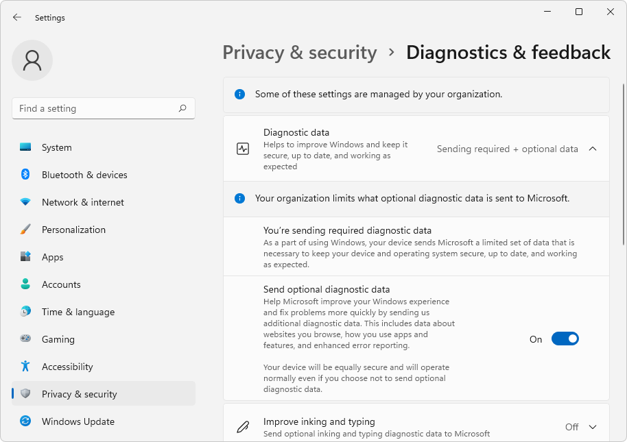

# Data and privacy in WebView2

WebView2 collects a set of optional and required diagnostic data to keep WebView2 secure and up to date, diagnose issues, and improve WebView2. By agreeing to the WebView2 Runtime Terms and Conditions License, WebView2 developers acknowledge that WebView2 will collect the data that's described in this article. To view the license, go to [Download the WebView2 Runtime](https://developer.microsoft.com/microsoft-edge/webview2/#download-section), where clicking any of the download buttons, such as **Get the Link**, **Download**, or **x64**, shows the license in a dialog.

Additionally, WebView2 follows the standards that are outlined in [Microsoft Edge Privacy Whitepaper](../../privacy-whitepaper/index.md). WebView2 has mechanisms to ensure privacy. WebView2 data collection follows the same strict standards as Microsoft Edge. For more information, see [Microsoft Privacy Statement – Microsoft privacy](https://privacy.microsoft.com/privacystatement).

The main diagnostic data sources are:
*  Chromium and Microsoft Edge telemetry infrastructure.
*  Windows data reporting.
*  Watson (Microsoft Internal) infrastructure to collect crash dumps.

This article is for WebView2 developers.

<!-- ====================================================================== -->
## Optional diagnostic data

WebView2 is a Windows component and thus follows the Windows diagnostic data collection practices. For more information, see [Windows diagnostic data](/windows/privacy/configure-windows-diagnostic-data-in-your-organization). The data collection consent for WebView2 is governed by the **Settings > Privacy & security > Diagnostics & feedback > Diagnostic data** setting on Windows 10 and Windows 11 as a centralized switch.

Users can control WebView2 data collection through the Windows **Diagnostic data** setting on Windows 10 and Windows 11, as shown below.  As a developer, consider conveying this to your WebView2 app users and inviting them to use the Windows **Diagnostic data** setting to fit their preference.
<!-- todo: give a specific example of how/where to convey and what to say, eg:
During installing and initially running the app, your app can present a dialog box and an instruction page about the app, saying:
"You can control WebView2 data collection through the Windows **Diagnostic data** setting on Windows 10 and Windows 11.  You can use the Windows **Diagnostic data** setting to fit your preference."
-->

Here's an example of diagnostic data settings, for a Windows 11 machine that has some settings managed by an organization:

When the Windows **Diagnostic data** setting is on:
*  WebView2-related data is collected, including API usage, SDK usage, and creation failure.
*  Browser diagnostic data is collected.  Only browser events that are relevant to WebView2 are collected.

Regardless of the Windows **Diagnostic data** setting, WebView2 collects required data that's necessary to maintain performance and reliability; see [Diagnostics, feedback, and privacy in Windows](https://support.microsoft.com/windows/diagnostics-feedback-and-privacy-in-windows-28808a2b-a31b-dd73-dcd3-4559a5199319).

Although you don't have control of overall diagnostic data collection, WebView2 offers APIs to control the behavior of the following features that generate data:
*  SmartScreen.
*  Custom crash reporting.

These features are described below.

<!-- ====================================================================== -->
## SmartScreen

Microsoft Defender SmartScreen ("SmartScreen") is a security feature that is enabled by default to help users safely browse the web.  The `IsReputationCheckingRequired` property controls whether SmartScreen is enabled.  Generally, all other services in `edge://settings/privacy` are turned off, for WebView2.

If you don't disable SmartScreen, you must provide notice to all users that your software includes Microsoft Defender SmartScreen, and collects and sends the user's information to Microsoft as disclosed in [Microsoft Privacy Statement](https://aka.ms/privacy) and in [SmartScreen](../../privacy-whitepaper/index.md#smartscreen) in _Microsoft Edge Privacy Whitepaper_.

##### [.NET/C#](#tab/dotnetcsharp)

* `CoreWebView2Settings` Class:
   * [CoreWebView2Settings.IsReputationCheckingRequired Property](/dotnet/api/microsoft.web.webview2.core.corewebview2settings.isreputationcheckingrequired)

##### [WinRT/C#](#tab/winrtcsharp)

* `CoreWebView2Settings` Class:
   * [CoreWebView2Settings.IsReputationCheckingRequired Property](/microsoft-edge/webview2/reference/winrt/microsoft_web_webview2_core/corewebview2settings#isreputationcheckingrequired)

##### [Win32/C++](#tab/win32cpp)

* `ICoreWebView2Settings` interface:
   * [ICoreWebView2Settings::get_IsReputationCheckingRequired](/microsoft-edge/webview2/reference/win32/icorewebview2settings8#get_isreputationcheckingrequired)
   * [ICoreWebView2Settings::put_IsReputationCheckingRequired](/microsoft-edge/webview2/reference/win32/icorewebview2settings8#put_isreputationcheckingrequired)

---

See also:
* [SmartScreen](../concepts/overview-features-apis.md#smartscreen) in _Overview of WebView2 features and APIs_.
* [Spec: Disable SmartScreen](https://github.com/MicrosoftEdge/WebView2Feedback/blob/main/specs/IsSmartScreenRequired.md)

<!-- ====================================================================== -->
## Custom crash reporting

If any WebView2 process crashes, one or more minidump files are created and sent to Microsoft for diagnosis.  Use this API to customize crash reporting when running diagnostics and doing analysis.
*  To prevent crash dumps from being sent to Microsoft, set the `IsCustomCrashReportingEnabled` property to `false`.
*  To locate crash dumps and do customization with them, use the `CrashDumpFolderPath` property.

##### [.NET/C#](#tab/dotnetcsharp)

* `CoreWebView2EnvironmentOptions` Class:
   * [CoreWebView2EnvironmentOptions.IsCustomCrashReportingEnabled Property](/dotnet/api/microsoft.web.webview2.core.corewebview2environmentoptions.iscustomcrashreportingenabled)
* `CoreWebView2Environment` Class:
   * [CoreWebView2Environment.FailureReportFolderPath Property](/dotnet/api/microsoft.web.webview2.core.corewebview2environment.failurereportfolderpath)

##### [WinRT/C#](#tab/winrtcsharp)

* `CoreWebView2EnvironmentOptions` Class:
   * [CoreWebView2EnvironmentOptions.IsCustomCrashReportingEnabled Property](/microsoft-edge/webview2/reference/winrt/microsoft_web_webview2_core/corewebview2environmentoptions#iscustomcrashreportingenabled)
* `CoreWebView2Environment` Class:
   * [CoreWebView2Environment.FailureReportFolderPath Property](/microsoft-edge/webview2/reference/winrt/microsoft_web_webview2_core/corewebview2environment#failurereportfolderpath)

##### [Win32/C++](#tab/win32cpp)

* `ICoreWebView2EnvironmentOptions3` interface:
   * [ICoreWebView2EnvironmentOptions3::get_IsCustomCrashReportingEnabled](/microsoft-edge/webview2/reference/win32/icorewebview2environmentoptions3#get_iscustomcrashreportingenabled)
* `ICoreWebView2Environment11` interface:
   * [ICoreWebView2Environment11::get_FailureReportFolderPath](/microsoft-edge/webview2/reference/win32/icorewebview2environment11#get_failurereportfolderpath)

---

See also:
* [Custom crash reporting](../concepts/overview-features-apis.md#custom-crash-reporting) in _Overview of WebView2 features and APIs_.
* [Spec: Custom Crash Reports](https://github.com/MicrosoftEdge/WebView2Feedback/blob/main/specs/DisableCrashReporting.md)
* [Minidump Files](/windows/win32/debug/minidump-files)

<!-- ====================================================================== -->
## See also

* [Security and privacy](../concepts/overview-features-apis.md#security-and-privacy) in _Overview of WebView2 features and APIs_.
