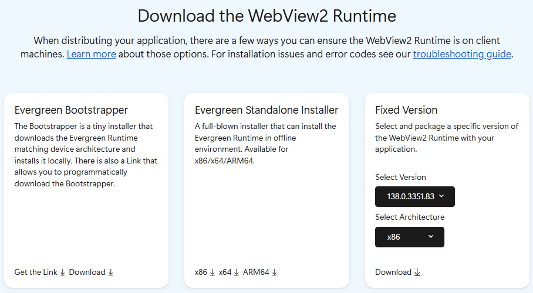

# Distribute your app and the WebView2 Runtime

When releasing an app that uses Microsoft Edge WebView2, you need distribute the WebView2 Runtime, either by distributing the automatically updated _Evergreen_ Runtime, or by distributing a _Fixed Version_ of the Runtime.

A WebView2 app depends on the WebView2 Runtime on client machines.  When you distribute your WebView2 app, you need to take into account how the WebView2 Runtime is distributed to and updated on client machines.


<!-- ====================================================================== -->
## The WebView2 Runtime

The WebView2 Runtime is a redistributable runtime and serves as the underlying (or _backing_) web platform for WebView2 apps.  The concept is similar to Visual C++ or the .NET Runtime for C++/.NET apps.  The WebView2 Runtime contains modified Microsoft Edge binaries that are fine-tuned and tested for WebView2 apps.  After the WebView2 Runtime is installed, it doesn't appear as a user-visible browser app.  For example, a user doesn't have a browser desktop shortcut or an entry in the **Start** menu.

There are two different ways of distributing and updating the WebView2 Runtime to client machines: the Evergreen distribution mode, and the Fixed Version distribution mode.


<!-- ====================================================================== -->
## The Evergreen Runtime distribution mode

In the _Evergreen_ distribution mode, the WebView2 Runtime isn't packaged with your app, but is initially installed onto clients using an online bootstrapper or an offline installer.  Afterwards, the WebView2 Runtime is automatically updated on client machines.  You can then distribute updates of your WebView2 app that use the latest WebView2 APIs, from the latest WebView2 SDK.  The Evergreen distribution mode is recommended for most developers.

Pros:

*  The underlying web platform (WebView2 Runtime) updates automatically without more effort from you.

*  Less disk space is required for the WebView2 Runtime on client systems, because the WebView2 Runtime is shared by all WebView2 apps that are on the client.

*  On eligible systems, binaries for Microsoft Edge and the Evergreen WebView2 Runtime are hard-linked together when they are on the same version.  This linking provides benefits for disk footprint, memory, and performance.

Cons:

*  Your WebView2 app cannot specify that a particular version of the WebView2 Runtime is required.


<!-- ------------------------------ -->
#### Windows 11 devices and Windows 10 devices
<!-- #### Which devices already have WebView2 Runtime installed and how to distribute for edge cases -->

The Evergreen Runtime is preinstalled onto all Windows 11 devices as a part of the Windows 11 operating system.  Microsoft installed the WebView2 Runtime to all eligible Windows 10 devices, as described in [Delivering Microsoft Edge WebView2 Runtime to managed Windows 10 devices](https://blogs.windows.com/msedgedev/2022/12/14/delivering-microsoft-edge-webview2-runtime-to-managed-windows-10-devices/).  Even if your app uses the Evergreen distribution mode, we recommend that you distribute the WebView2 Runtime, to cover edge cases where the Runtime wasn't already installed.  See [Details about the Evergreen Runtime distribution mode](#details-about-the-evergreen-runtime-distribution-mode) below.


<!-- ====================================================================== -->
## The Fixed Version runtime distribution mode

In the _Fixed Version_ distribution mode, you download a specific version of the WebView2 Runtime and package it together with your WebView2 app in your app package.  The WebView2 Runtime that you package with your app is used only by your WebView2 app, not by any other apps on the client's machine.

Pros:
*  You have more control over versioning of the WebView2 Runtime.  You know which WebView2 APIs are available to your app, because you control which version of the WebView2 Runtime is available to your app.  Your app doesn't need to test whether the latest APIs are present.

Cons:

*  You need to manage the WebView2 Runtime yourself.  The WebView2 Runtime isn't automatically updated on clients, so to use the latest WebView2 APIs, you must periodically update your app together with the updated WebView2 Runtime.

*  More disk space is required on the client, if there are multiple WebView2 apps installed.

*  The Fixed Version runtime can't be installed by using an installer.


<!-- ====================================================================== -->
## Understanding the options at the Runtime download page

The [Download the WebView2 Runtime](https://developer.microsoft.com/microsoft-edge/webview2#download-section) section of the **Microsoft Edge WebView2** page provides several options for distributing the WebView2 Runtime onto client machines.  Understanding the options at this page provides a good introduction, to help decide which approach you want to use.



The Evergreen distribution mode is recommended for most apps.

*  The **Evergreen Bootstrapper** section of the page provides a small Evergreen Runtime bootstrapper that runs on the client machine, for online users.  The bootstrapper downloads and installs the appropriate Evergreen WebView2 Runtime onto the client.  You can use the bootstrapper a couple different ways:

   *  Link to the bootstrapper, using a link that you obtain from the **Get the Link** button.  Your app uses this link to programmatically download the bootstrapper onto the client and invoke the bootstrapper.  This approach avoids the need to package the bootstrapper with your app.  This approach has a dependency on Microsoft's Content Delivery Network (CDN), to get the bootstrapper.

   *  Download the bootstrapper (using the **Download** button in the **Bootstrapper** section) and then distribute the bootstrapper with your app.  In this approach, you package the bootstrapper with your app installer/updater or with your app itself, and invoke the bootstrapper that you included with your app.  This approach avoids dependency on Microsoft's CDN, to get the bootstrapper.

*  The **Evergreen Standalone Installer** section of the page provides a large, standalone Evergreen installer, primarily for offline users.  In this approach, you package the standalone installer with your app installer/updater or app itself, and invoke the Evergreen Standalone installer.  This approach avoids dependency on Microsoft's CDN, to get the Runtime.

*  The **Fixed Version** section of the page provides a Fixed Version runtime, which is a specific version of the WebView2 Runtime that you distribute along with your app.


<!-- ====================================================================== -->
## Details about the WebView2 Runtime

When distributing your WebView2 app, make sure that the WebView2 Runtime is present on the client machine.  This requirement applies to both the Evergreen and Fixed Version distribution modes.

If you want to use the Fixed Version distribution mode, you can skip the next couple of sections and jump ahead to [Details about the Fixed Version runtime distribution mode](#details-about-the-fixed-version-runtime-distribution-mode).


<!-- ------------------------------ -->
#### Servicing the WebView2 Runtime through Windows Server Update Services (WSUS)

See [Windows Server Update Services (WSUS)](enterprise.md#windows-server-update-services-wsus) in _Enterprise management of WebView2 Runtimes_.


<!-- ------------------------------ -->
#### Runtime or browser support during development or production

During development and testing, a WebView2 app can use either option as the backing web platform:

*  The WebView2 Runtime.  The Runtime generally provides the same web platform capabilities and update cadence as the Stable channel of the Microsoft Edge browser.  Use the WebView2 Runtime in a production environment or to develop and test against the web platform that your users have today.

*  A preview (Insider) Microsoft Edge browser channel.  These Microsoft Edge preview channels are Beta, Dev, and Canary.  Use this approach to test your app for forward-compatibility, so that you know if a breaking change is coming that will require updating your app.  See [Test upcoming APIs and features](../how-to/set-preview-channel.md).

A production release of a WebView2 app can only use the WebView2 Runtime as the backing web platform, not Microsoft Edge.


<!-- ---------- -->
###### Microsoft Edge Stable channel isn't supported for WebView2

WebView2 apps aren't permitted to use the Stable channel of Microsoft Edge as the backing web platform.  This restriction prevents a production release of a WebView2 app from taking a dependency on the browser.  A WebView2 app cannot take a dependency on the browser during production, for the following reasons:

*  Microsoft Edge isn't guaranteed to be present on all user devices.  Many devices in enterprises and in education are disconnected from Windows Update or aren't managed by Microsoft directly.  Such devices might not have Microsoft Edge installed.  Requiring the production version of WebView2 apps to use the WebView2 Runtime rather than Microsoft Edge avoids making Microsoft Edge a prerequisite for running a WebView2 app.

*  Browsers and apps have different use cases.  If a WebView2 app required the presence of Microsoft Edge on the client, that would potentially have unintended side-effects on the WebView2 app.  For example, an IT admin can prevent the browser from being updated from a specific version, to keep the browser compatible with an internal website.  Requiring the production version of a WebView2 app to use the WebView2 Runtime rather than the browser allows the WebView2 app to stay evergreen even if browser updates are prevented by the clients' admin.

*  As opposed to the browser, the WebView2 Runtime is developed and tested for app scenarios, and in some cases the WebView2 Runtime might include bug fixes that aren't yet available in the browser.

The Evergreen WebView2 Runtime will be included as part of the Windows 11 operating system.  Various WebView2 apps have installed the Evergreen Runtime on devices with an operating system prior to Windows 11. However, some devices might not have the Runtime pre-installed, so it's a good practice to check whether the Runtime is present on the client.

Before your app creates a WebView2, the app should check whether the WebView2 Runtime is present (either by checking a registry key or by calling an API) and install the Runtime if it is missing.  The app can do this check when installing or updating your app (recommended), or at app runtime.  To check whether the Runtime is present, see [Deploying the Evergreen WebView2 Runtime](#deploying-the-evergreen-webview2-runtime), below.


<!-- ====================================================================== -->
## Details about the Evergreen Runtime distribution mode

The Evergreen distribution mode ensures that your WebView2 app is taking advantage of the latest WebView2 features and security updates.  The Evergreen distribution mode has the following characteristics:

*  The WebView2 Runtime updates automatically without requiring any action from you. It receives the same Microsoft Edge updates that are described in [Release notes for Microsoft Edge Stable Channel](/deployedge/microsoft-edge-relnote-stable-channel) and [Release notes for Microsoft Edge Security Updates](/deployedge/microsoft-edge-relnotes-security).

*  All WebView2 apps that use the Evergreen distribution mode use a shared copy of the Evergreen WebView2 Runtime, which saves disk space.

*  On eligible systems, binaries for Microsoft Edge and the Evergreen WebView2 Runtime are hard-linked together when they are on the same version.  This linking provides benefits for disk footprint, memory, and performance.

When you use the Evergreen distribution mode of the WebView2 Runtime, your WebView2 app assumes that clients have the latest Runtime.  Your app cannot require a particular version of the WebView2 Runtime for all apps on the client.  By the time a new WebView2 SDK package is released, a compatible version of the WebView2 Runtime has already been distributed to clients.  Therefore it's OK for your WebView2 app to use the APIs that are in the latest version of the WebView2 SDK.


<!-- ------------------------------ -->
#### Windows 11 devices and Windows 10 devices (details)

The vast majority of Windows 10 devices have the WebView2 Runtime installed already, as described in [Delivering Microsoft Edge WebView2 Runtime to managed Windows 10 devices](https://blogs.windows.com/msedgedev/2022/12/14/delivering-microsoft-edge-webview2-runtime-to-managed-windows-10-devices/).  A small number of Windows 10 devices don't have the WebView2 Runtime installed.  We recommend that you handle this edge case, by using either of the following approaches:

*  Programmatically deploy the Evergreen Runtime with your app.  See [Deploying the Evergreen WebView2 Runtime](#deploying-the-evergreen-webview2-runtime) below.

*  Redirect your end users to the Microsoft site: [Download Microsoft Edge WebView2](https://developer.microsoft.com/microsoft-edge/webview2/consumer/), and have end users download the Evergreen WebView2 Runtime installer from the site and install the Runtime themselves.

See also:
* [Prerelease and Release SDKs for WebView2](versioning.md) - Use a Prerelease version of the SDK along with a preview channel of Microsoft Edge; or use a Release version of the SDK along with the Evergreen WebView2 Runtime.
* [Delivering Microsoft Edge WebView2 Runtime to managed Windows 10 devices](https://blogs.windows.com/msedgedev/2022/12/14/delivering-microsoft-edge-webview2-runtime-to-managed-windows-10-devices/).


<!-- ------------------------------ -->
#### Deploying the Evergreen WebView2 Runtime

Only one installation of the Evergreen WebView2 Runtime is needed for all Evergreen apps on the device.  Several tools are available at [Download the WebView2 Runtime](https://developer.microsoft.com/microsoft-edge/webview2#download-section) to help you deploy the Evergreen Runtime.

*  For online clients: _WebView2 Runtime Bootstrapper_ is a tiny (approximately 2 MB) installer.  The WebView2 Runtime Bootstrapper downloads and installs the Evergreen Runtime from Microsoft servers that matches the user's device architecture.

   *  In the setup part of your WebView2 app, link to the bootstrapper.  Use a link to programmatically download the bootstrapper; select the **Get the Link** button at the above download page.

   *  Or, download the bootstrapper and package it with your WebView2 app.

*  For offline clients: _WebView2 Runtime Standalone Installer_ is a full installer that installs the Evergreen WebView2 Runtime in offline environments.

*  If you're using App Installer to deploy MSIX applications, you can specify the WebView2 Runtime as a dependency, to have it be installed with the application.<!-- (instead of using the Evergreen Bootstrapper, Evergreen Standalone Installer, or Fixed Version (Self-Contained) distribution).-->  For details about how to do this, see [win32dependencies:ExternalDependency (Windows 10, Windows 11)](/uwp/schemas/appxpackage/uapmanifestschema/element-win32dependencies-externaldependency) in the App package manifest docs.  See also [Install Windows 10 apps with App Installer](/windows/msix/app-installer/app-installer-root).


<!-- ------------------------------ -->
#### Installing the Runtime as per-machine or per-user

The latest bootstrapper and standalone installer support both _per-machine_ and _per-user_ installs of the WebView2 Runtime.

<!-- keep the 3 instances or variants of this passage in sync: instance 1: -->
If you run the installer from an elevated process or command prompt, the Runtime is installed as _per-machine_.  If you don't run the installer from an elevated process or command prompt, the Runtime will be installed as _per-user_.  However, a _per-user_ install is automatically replaced by a _per-machine_ install, if a _per-machine_ Microsoft Edge Updater is in place.  A _per-machine_ Microsoft Edge Updater is included as part of Microsoft Edge, except for the Canary preview channel of Microsoft Edge.

Use the following online deployment workflow or offline deployment workflow to ensure that the Runtime is already installed before your app launches.  You can adjust your workflow depending on your scenario.  Sample code is available in the [Samples repo](https://github.com/MicrosoftEdge/WebView2Samples#webview2-deployment).


<!-- ---------- -->
###### Detect if a WebView2 Runtime is already installed

To verify that a WebView2 Runtime is installed, use one of the following approaches:

   *  Approach 1: Inspect the `pv (REG_SZ)` regkey for the WebView2 Runtime at both of the following registry locations.  The `HKEY_LOCAL_MACHINE` regkey is used for _per-machine_ install.  The `HKEY_CURRENT_USER` regkey is used for _per-user_ install.

      For WebView2 applications, at least one of these regkeys must be present and defined with a version greater than 0.0.0.0.  If neither regkey exists, or if only one of these regkeys exists but its value is `null`, an empty string, or 0.0.0.0, this means that the WebView2 Runtime isn't installed on the client.  Inspect these regkeys to detect whether the WebView2 Runtime is installed, and to get the version of the WebView2 Runtime.  Find `pv (REG_SZ)` at the following two locations.

      The two registry locations to inspect on 64-bit Windows:

      ```
      HKEY_LOCAL_MACHINE\SOFTWARE\WOW6432Node\Microsoft\EdgeUpdate\Clients\{F3017226-FE2A-4295-8BDF-00C3A9A7E4C5}

      HKEY_CURRENT_USER\Software\Microsoft\EdgeUpdate\Clients\{F3017226-FE2A-4295-8BDF-00C3A9A7E4C5}
      ```

      The two registry locations to inspect on 32-bit Windows:

      ```
      HKEY_LOCAL_MACHINE\SOFTWARE\Microsoft\EdgeUpdate\Clients\{F3017226-FE2A-4295-8BDF-00C3A9A7E4C5}

      HKEY_CURRENT_USER\Software\Microsoft\EdgeUpdate\Clients\{F3017226-FE2A-4295-8BDF-00C3A9A7E4C5}
      ```

   *  Approach 2: Run [GetAvailableCoreWebView2BrowserVersionString](/microsoft-edge/webview2/reference/win32/webview2-idl#getavailablecorewebview2browserversionstring) and evaluate whether the `versionInfo` is `nullptr`.  `nullptr` indicates that the WebView2 Runtime isn't installed.  This API returns version information for the WebView2 Runtime or for any installed preview channels of Microsoft Edge (Beta, Dev, or Canary).


<!-- ---------- -->
###### Online-only deployment

If you have an online-only deployment scenario where users are assumed to have internet access, use the following workflow.

1. During your app setup, run a test to make sure that the WebView2 Runtime is already installed. See [Detect if a WebView2 Runtime is already installed](#detect-if-a-webview2-runtime-is-already-installed), above.

1. If the Runtime isn't installed, in your app setup process, use the link (from the **Get the Link** button on the download page) to programmatically download the WebView2 Runtime Bootstrapper.

1. Invoke the WebView2 Runtime Bootstrapper by issuing the following command.

   <!-- keep the 3 instances or variants of this passage in sync: instance 2: -->

   If you run the following command from an elevated process or command prompt, it triggers a _per-machine_ install.  If you don't run the command from an elevated process or command prompt, a _per-user_ install will take place.  However, a _per-user_ install is automatically replaced by a _per-machine_ install, if a _per-machine_ Microsoft Edge Updater is in place.  A _per-machine_ Microsoft Edge Updater is provided as part of Microsoft Edge, except for the Canary preview channel of Microsoft Edge.  For more information, see [Installing the Runtime as per-machine or per-user](#installing-the-runtime-as-per-machine-or-per-user).<!-- since this link is provided, the present paragraph could be shortened -->

   ```Shell
   MicrosoftEdgeWebview2Setup.exe /silent /install
   ```

The above workflow has several benefits:

* The Runtime is installed only when needed.

* You aren't required to package a Runtime installer with your WebView2 app.

* The WebView2 Runtime Bootstrapper automatically detects the device's architecture (platform) and then installs the matching WebView2 Runtime.

* The Runtime is installed silently.

Alternatively, instead of programmatically downloading the bootstrapper on-demand by getting a link, as shown above, you can package the Evergreen Bootstrapper for the WebView2 Runtime with your app.


<!-- ---------- -->
###### Offline deployment

If you have an offline deployment scenario, where app deployment has to work entirely offline, use the following workflow.

1. Download the Evergreen Standalone Installer from [Download the WebView2 Runtime](https://developer.microsoft.com/microsoft-edge/webview2#download-section) to your development machine.  The Evergreen Standalone Installer installs the Evergreen WebView2 Runtime on the client.

1. Include the Evergreen Standalone Installer in your app installer or updater.

1. During your app setup, run a test to make sure that the WebView2 Runtime is already installed. See [Detect if a WebView2 Runtime is already installed](#detect-if-a-webview2-runtime-is-already-installed), above.

1. If the WebView2 Runtime isn't installed, run the Evergreen Standalone Installer.  If you want to run a silent installation, you can run the following command.

   <!-- keep the 3 instances or variants of this passage in sync: instance 3 -->

   If you run the following command from an elevated process or command prompt, it triggers a _per-machine_ install.  If you don't run the command from an elevated process or command prompt, a _per-user_ install will take place.  However, a _per-user_ install is automatically replaced by a _per-machine_ install, if a _per-machine_ Microsoft Edge Updater is in place.  A _per-machine_ Microsoft Edge Updater is provided as part of Microsoft Edge, except for the Canary preview channel of Microsoft Edge.  For more information, see [Installing the Runtime as per-machine or per-user](#installing-the-runtime-as-per-machine-or-per-user).<!-- since this link is provided, the present paragraph could be shortened -->

   ```Shell
   MicrosoftEdgeWebView2RuntimeInstaller{X64/X86/ARM64}.exe /silent /install
   ```


<!-- ------------------------------ -->
#### Handle Evergreen WebView2 Runtime updates

New versions of the Evergreen WebView2 Runtime are automatically downloaded to the client.  The client uses the new version of the WebView2 Runtime when your WebView2 app is restarted.  However, if your app runs continuously, your app will continue to use the previous version of the WebView2 Runtime.  This has security implications, because the previous version of the WebView2 Runtime might have security vulnerabilities that are fixed in the new version.  You should consider whether it is important for your app to adopt the latest version of the WebView2 Runtime as soon as possible, based on your app's threat model.  For example, if your WebView2 app accesses third-party content, that content should be considered untrusted, so your app would need to use the latest version of the WebView2 Runtime.

To use the new version of the WebView2 Runtime, you need to either release all references to the previous WebView2 environment objects, or restart your app.  The next time your app creates a new WebView2 environment, the app will use the new version of the WebView2 Runtime.  To accomplish this, you can have an event handler for the `NewBrowserVersionAvailable` event, to have your app automatically notify the user to restart the app.  If your app handles restarting the app, consider saving the user state before the WebView2 app exits. 

##### [.NET/C#](#tab/dotnetcsharp)

* `CoreWebView2Environment` Class:
    * [NewBrowserVersionAvailable Event](/dotnet/api/microsoft.web.webview2.core.corewebview2environment.newbrowserversionavailable)

##### [WinRT/C#](#tab/winrtcsharp)

* `CoreWebView2Environment` Class:
    * [NewBrowserVersionAvailable Event](/microsoft-edge/webview2/reference/winrt/microsoft_web_webview2_core/corewebview2environment#newbrowserversionavailable)

##### [Win32/C++](#tab/win32cpp)

* [ICoreWebView2Environment](/microsoft-edge/webview2/reference/win32/icorewebview2environment)
    * [add_NewBrowserVersionAvailable](/microsoft-edge/webview2/reference/win32/icorewebview2environment#add_newbrowserversionavailable)
    * [remove_NewBrowserVersionAvailable](/microsoft-edge/webview2/reference/win32/icorewebview2environment#remove_newbrowserversionavailable)
---


<!-- ------------------------------ -->
#### Test your app for forward-compatibility

In the Evergreen distribution mode, the WebView2 Runtime is automatically kept up to date on the client to provide the latest features and security fixes.  If you use Evergreen distribution, to ensure that your WebView2 app stays compatible with the web, you should set up testing infrastructure.

For best practices about how to test your app for forward-compatibility, see [Prerelease testing using preview channels](../how-to/prerelease-testing.md) and [Self-host by deploying preview channels](../how-to/self-hosting.md).


<!-- ------------------------------ -->
#### Feature-detect when using recent APIs

When using Evergreen mode in WebView2 apps, it's crucial to check for the presence of new APIs on the client's machine, by using methods like `QueryInterface` or `try-catch`, because the client machine might not have the latest WebView2 Runtime, containing the new APIs.  Updates to the WebView2 Runtime might not occur if an IT Admin disables updating, or if the client is offline.

For details, see [Feature-detecting to test whether the installed Runtime supports recently added APIs](../concepts/versioning.md#feature-detecting-to-test-whether-the-installed-runtime-supports-recently-added-apis) in _Prerelease and Release SDKs for WebView2_.

There are separate update policies for Microsoft Edge and the WebView2 Runtime.  Disabling updates for Microsoft Edge doesn't impact the availability of the latest WebView2 APIs, because the WebView2 Runtime can still update automatically (unless updating the WebView2 Runtime is disabled by an Admin).


<!-- ====================================================================== -->
## Details about the Fixed Version runtime distribution mode

For constrained environments that have strict compatibility requirements, consider using the Fixed Version distribution mode.  (The Fixed Version distribution mode was previously called _bring-your-own_.)

In the Fixed Version distribution mode, you control the timing of updates to the WebView2 Runtime for your app.  You download a specific version of the WebView2 Runtime and then package it with your WebView2 app.  The WebView2 Runtime on the client isn't automatically updated.  Instead, you periodically update the WebView2 Runtime that's packaged and distributed together with your updated app.  The Fixed Version approach doesn't use a registry key for the WebView2 Runtime.

The Fixed Version binaries are over 250 MB and will make your app package larger by that amount.

To use the Fixed Version distribution mode:

1. Download the Fixed Version of the WebView2 Runtime from [Download the WebView2 Runtime](https://developer.microsoft.com/microsoft-edge/webview2#download-section), as a package.

   The most-patched version of the latest and second-latest major releases are available for download at this site.  Keep an archived copy of any versions you need.

1. Decompress the WebView2 Runtime package using the command-line command `expand {path to the package} -F:* {path to the destination folder}` or by using a decompression tool such as WinRAR.  Avoid decompressing through File Explorer, because that approach might not generate the correct folder structure.

1. Include all of the decompressed Fixed Version binaries in your app package, to be deployed on the target machine during your app's installation.

1. Indicate the path to the Fixed Version binaries when creating the WebView2 environment.

   *  For Win32 C/C++, you can create the environment using the [CreateCoreWebView2EnvironmentWithOptions](/microsoft-edge/webview2/reference/win32/webview2-idl#createcorewebview2environmentwithoptions) function.  Use the `browserExecutableFolder` parameter to indicate the path to the folder that contains `msedgewebview2.exe`.

   *  For .NET, you must specify the environment before the WebView2 `Source` property takes effect.  For .NET, you can use either of the following approaches to specify the environment:

      *  Set the `CreationProperties` ([WPF](/dotnet/api/microsoft.web.webview2.wpf.webview2.creationproperties)/[WinForms](/dotnet/api/microsoft.web.webview2.winforms.webview2)) property on the `WebView2` element.  Use the `BrowserExecutableFolder` member in the `CoreWebView2CreationProperties` ([WPF](/dotnet/api/microsoft.web.webview2.wpf.corewebview2creationproperties)/[WinForms](/dotnet/api/microsoft.web.webview2.winforms)) class to indicate the path to the Fixed Version binaries.

      *  Alternatively, use `EnsureCoreWebView2Async` ([WPF](/dotnet/api/microsoft.web.webview2.wpf.webview2.ensurecorewebview2async)/[WinForms](/dotnet/api/microsoft.web.webview2.winforms.webview2.ensurecorewebview2async)) to specify the environment.  Use the `browserExecutableFolder` parameter in [CoreWebView2Environment.CreateAsync](/dotnet/api/microsoft.web.webview2.core.corewebview2environment.createasync) to indicate the path to the Fixed Version binaries.

   *  For WinUI, make sure the app has access to the folder by specifying the installed location and setting the environment variable for runtime path.  One way to do this is by adding the following C# code to your app:
        
      ```csharp
      StorageFolder localFolder = Windows.ApplicationModel.Package.Current.InstalledLocation;
      String fixedPath = Path.Combine(localFolder.Path, "FixedRuntime\\(version number)");
      Debug.WriteLine($"Launch path [{localFolder.Path}]");
      Debug.WriteLine($"FixedRuntime path [{fixedPath}]");
      Environment.SetEnvironmentVariable("WEBVIEW2_BROWSER_EXECUTABLE_FOLDER", fixedPath);
      ```
   
1. Package and ship the Fixed Version binaries with your app.  Update the binaries as appropriate.

   *  For WinUI, this might include opening the project file (`.csproj`) in a code editor, and then add the following code within the project tags:

      ```xml
      <ItemGroup>
         <Content Include="FixedRuntime\(version number)\\**\*.*">
         <CopyToOutputDirectory>PreserveNewest</CopyToOutputDirectory>
         </Content>
      </ItemGroup>
      ```

      Verify that the `bin\**designated architecture**\Release` folder has a matching FixedRuntime\\(version number) folder with the runtime files in it.

1. On Windows 10 devices, starting with Fixed Version 120, developers of unpackaged Win32 applications using Fixed Version are required to run the following commands, for Fixed Version to continue to work.  This is due to a security improvement in v120 to run the Renderer process inside the App Container.  This change doesn't affect Windows 11 devices, the older runtime, or packaged apps.

   1. Locate the path where you deploy the Fixed Version package on the user's device, such as the following location:

      ```text
      D:\myapp\Microsoft.WebView2.FixedVersionRuntime.87.0.664.8.x64
      ```

   1. Run the following commands on the user's device:

      ```shell
      icacls {Fixed Version path} /grant *S-1-15-2-2:(OI)(CI)(RX)
      icacls {Fixed Version path} /grant *S-1-15-2-1:(OI)(CI)(RX)
      ```

   1. Confirm that permissions are granted for `ALL APPLICATION PACKAGES` and `ALL RESTRICTED APPLICATION PACKAGES` in the **Security** tab of the **Fixed Version** folder, as shown below:

      


<!-- ------------------------------ -->
#### Known issues for Fixed Version

*  Currently, Fixed Version cannot be run from a network location or UNC path.


<!-- ====================================================================== -->
## Files to ship with the app

The `WebView2Loader` code needs to be shipped with the app.  This can be done by [statically linking](../how-to/static.md) `WebView2Loader.lib` into the app binaries, or by including the `WebView2Loader.dll` that matches the app's architecture. Usually this is handled automatically for you by Visual Studio when using the `.targets` file in the WebView2 SDK, but there might be cases when you need to manually specify what files to publish with your app.

`WebView2Loader.dll` is a native and architecture-specific binary, so you need to include all flavors of this binary that you expect your app to run in.  For example:

*  For x86, you would include the x86 version of `WebView2Loader.dll`.

*  For a managed app using AnyCPU, you would include the x86, x64, and arm64 versions of `WebView2Loader.dll`. The correct version of `WebView2Loader.dll` is loaded from the appropriate architecture-specific folder.

Example native app folder structure:

```
\<myApp>
    \WebView2Loader.dll
```

For .NET managed apps, you also need to include the WebView2 .NET assemblies for the core WebView2 functionality (`Microsoft.Web.WebView2.Core.dll`) and for the WPF/WinForms-specific functionality (`Microsoft.Web.WebView2.Winforms.dll` or `Microsoft.Web.WebView2.WPF.dll`).

Example managed app folder structure:

```
\<myApp>
    \Microsoft.Web.WebView2.Core.dll
    \Microsoft.Web.WebView2.Winforms.dll
    \Microsoft.Web.WebView2.WPF.dll
    \runtimes
        \win-arm64\native\WebView2Loader.dll (arm64)
        \win-x64\native\WebView2Loader.dll (x64)
        \win-x86\native\WebView2Loader.dll (x86)
```
