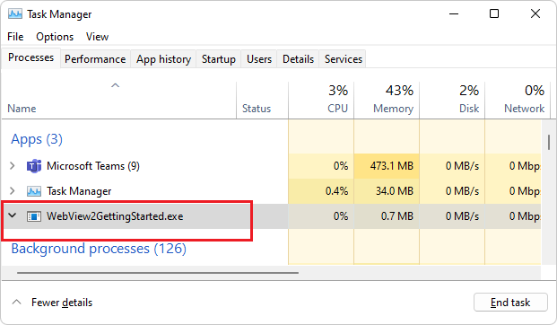
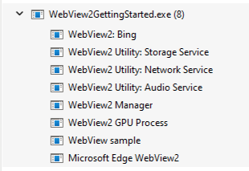
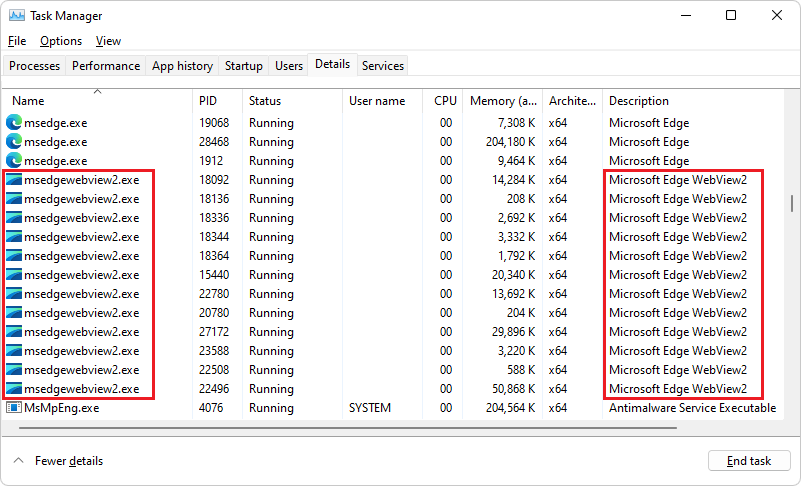

# WebView2 end-user FAQ

This Frequently Asked Questions (FAQ) page is for end users, to explain the **WebView2** or **msedgewebview2.exe** processes that are listed in Task Manager.  See also [Contact the WebView2 Team](../contact.md).

<!-- ====================================================================== -->
## What is WebView2?

WebView2 is a way for app developers to embed web content (such as HTML, JavaScript, and CSS) in Windows applications. By including the WebView2 control in an app, a developer can write code for a website or web app, and then reuse that web code in their Windows application, saving time and effort.  See [Introduction to Microsoft Edge WebView2](../index.md).

<!-- ====================================================================== -->
## What's the purpose of the WebView2 executable?

WebView2 (`msedgewebview2.exe`) is a Microsoft product that is updated automatically (by using the _Evergreen_ distribution method) to ensure that your applications have the latest feature support and security fixes.

Most people will see WebView2 used by Widgets, Teams, Office, Outlook, Weather, and many more applications. Any application can use WebView2.

<!-- ====================================================================== -->
## What are the WebView2 processes that are running?

WebView2 follows the process model that's used in the Chromium browser engine of Microsoft Edge, described in [Process Model and Site Isolation](https://chromium.googlesource.com/chromium/src/+/main/docs/process_model_and_site_isolation.md).  Having functionality broken up into multiple processes help reliability, security, and performance.  Each process performs a certain responsibility, and can do that work uninterrupted, even if one of the other processes hits a problem.

There are normally a few processes:
*  The WebView2 manager.
*  A GPU process.
*  Utility processes, such as network or audio, depending on the content.
*  Renderer processes.

Your machine will have one set of processes for each app that uses WebView2, and typically one renderer process for each WebView2 control that's in the app, similar to how you have one renderer process per tab in a browser.  For details, see [Process model for WebView2 apps](/microsoft-edge/webview2/concepts/process-model).

<!-- ====================================================================== -->
## What memory and CPU resources does WebView2 use?

In most cases, any extra memory or CPU usage is due to how WebView2 is being used, not WebView2 itself. If the application is rendering non-optimized web content, then the WebView2 control might consume more resources. Task Manager will normally show the processes grouped by parent, but that view is sometimes incorrect if you sort by a column other than **Name**.

WebView2 processes are displayed in Task Manager's **Processes** tab as **WebView2**, grouped by parent app.  For example, the WebView2 app from [Get started with WebView2 in Win32 apps](https://github.com/MicrosoftEdge/WebView2Samples/tree/main/GettingStartedGuides/Win32_GettingStarted) is listed in Task Manager's **Processes** tab as follows.

In Windows 10 and early versions of Windows 11, the **Processes** tab only lists the name of the app that uses WebView2:

In the latest Windows 11 versions, the **Processes** tab lists each WebView2 process:

In the **Details** tab, the WebView2 processes are listed as **msedgewebview2.exe**, and are grouped together rather than grouped by parent app:

You can also use Microsoft's [Process Explorer](/sysinternals/downloads/process-explorer) tool. If you find that an app is consistently causing heavy resource usage, contact the support for that app to report the resource usage.

<!-- ====================================================================== -->
## Will uninstalling Microsoft Edge make WebView2 stop working?

No. Microsoft Edge can be uninstalled without causing a problem for WebView2.  When both Microsoft Edge and WebView2 are installed, the Microsoft Edge installer links the applications together, to avoid using extra disk space.

<!-- ====================================================================== -->
## Why was WebView2 re-installed after I uninstalled it?

WebView2 is pre-installed on Windows 11 and is installed on most Windows 10 devices.  See [Delivering the Microsoft Edge WebView2 Runtime to Windows 10 Consumers](https://blogs.windows.com/msedgedev/2022/06/27/delivering-the-microsoft-edge-webview2-runtime-to-windows-10-consumers/).

Many apps that are built on WebView2 perform checks to re-install WebView2 when the app is installed or launched. Enterprises can also push WebView2 to devices that they manage.

<!-- ====================================================================== -->
## See also

* [Introduction to Microsoft Edge WebView2](../index.md)
* [Contact the WebView2 Team](../contact.md)
