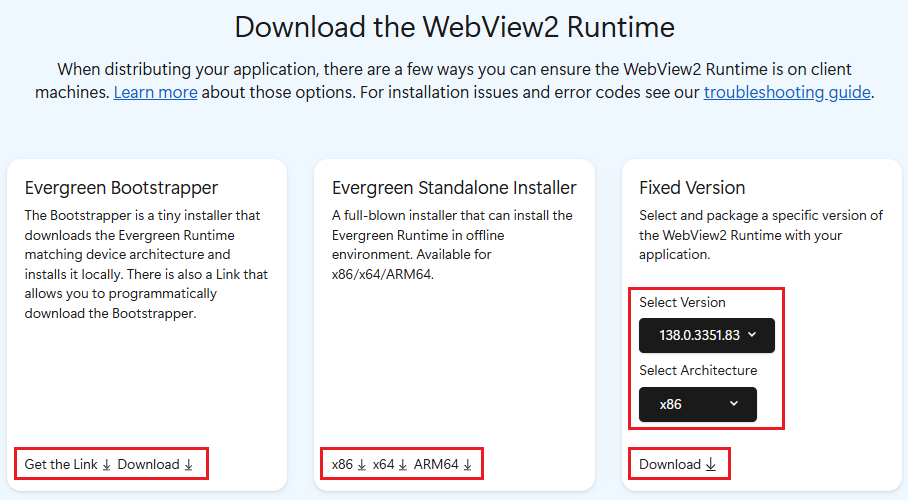

# Evergreen vs. fixed version of the WebView2 Runtime

When releasing an app that uses Microsoft Edge WebView2, you need to distribute the WebView2 Runtime, either by distributing the automatically updated _Evergreen_ Runtime, or by distributing a _Fixed Version_ of the Runtime.

A WebView2 app depends on the WebView2 Runtime on client machines.  When you distribute your WebView2 app, you need to take into account how the WebView2 Runtime is distributed to and updated on client machines.

For details about how to distribute the Runtime, see [Distribute your app and the WebView2 Runtime](./distribution.md).

<!-- ====================================================================== -->
## The WebView2 Runtime

The WebView2 Runtime is a redistributable runtime and serves as the underlying (or _backing_) web platform for WebView2 apps.  The concept is similar to Visual C++ or the .NET Runtime for C++/.NET apps.  The WebView2 Runtime contains modified Microsoft Edge binaries that are fine-tuned and tested for WebView2 apps.  After the WebView2 Runtime is installed, it doesn't appear as a user-visible browser app.  For example, a user doesn't have a browser desktop shortcut or an entry in the **Start** menu.

There are two different ways of distributing and updating the WebView2 Runtime to client machines: the Evergreen distribution mode, and the Fixed Version distribution mode.

<!-- ====================================================================== -->
## The Evergreen Runtime distribution mode

In the _Evergreen_ distribution mode, the WebView2 Runtime isn't packaged with your app, but is initially installed onto clients using an online bootstrapper or an offline installer.  Afterwards, the WebView2 Runtime is automatically updated on client machines.  You can then distribute updates of your WebView2 app that use the latest WebView2 APIs, from the latest WebView2 SDK.  The Evergreen distribution mode is recommended for most developers.

Pros:

*  The underlying web platform (WebView2 Runtime) updates automatically without more effort from you.

*  Less disk space is required for the WebView2 Runtime on client systems, because the WebView2 Runtime is shared by all WebView2 apps that are on the client.

*  On eligible systems, binaries for Microsoft Edge and the Evergreen WebView2 Runtime are hard-linked together when they are on the same version.  This linking provides benefits for disk footprint, memory, and performance.

Cons:

*  Your WebView2 app cannot specify that a particular version of the WebView2 Runtime is required.

See also:
* [The Evergreen Runtime distribution mode](./distribution.md#the-evergreen-runtime-distribution-mode) in _Distribute your app and the WebView2 Runtime_.

<!-- ------------------------------ -->
#### Windows 11 devices and Windows 10 devices
<!--
#### Which devices already have WebView2 Runtime installed and how to distribute for edge cases
-->

The Evergreen Runtime is preinstalled onto all Windows 11 devices as a part of the Windows 11 operating system.  Microsoft installed the WebView2 Runtime to all eligible Windows 10 devices, as described in [Delivering Microsoft Edge WebView2 Runtime to managed Windows 10 devices](https://blogs.windows.com/msedgedev/2022/12/14/delivering-microsoft-edge-webview2-runtime-to-managed-windows-10-devices/).

Even if your app uses the Evergreen distribution mode, we recommend that you distribute the WebView2 Runtime, to cover edge cases where the Runtime wasn't already installed.

See:
* [Windows 11 devices and Windows 10 devices (details)](./distribution.md#windows-11-devices-and-windows-10-devices-details) in _Distribute your app and the WebView2 Runtime_.

<!-- ====================================================================== -->
## The Fixed Version runtime distribution mode

In the _Fixed Version_ distribution mode, you download a specific version of the WebView2 Runtime and package it together with your WebView2 app in your app package.  The WebView2 Runtime that you package with your app is used only by your WebView2 app, not by any other apps on the client's machine.

Pros:
*  You have more control over versioning of the WebView2 Runtime.  You know which WebView2 APIs are available to your app, because you control which version of the WebView2 Runtime is available to your app.  Your app doesn't need to test whether the latest APIs are present.

Cons:

*  You need to manage the WebView2 Runtime yourself.  The WebView2 Runtime isn't automatically updated on clients, so to use the latest WebView2 APIs, you must periodically update your app together with the updated WebView2 Runtime.

*  More disk space is required on the client, if there are multiple WebView2 apps installed.

*  The Fixed Version runtime can't be installed by using an installer.

See also:
* [The Fixed Version runtime distribution mode](./distribution.md#the-fixed-version-runtime-distribution-mode) in _Distribute your app and the WebView2 Runtime_.

<!-- ====================================================================== -->
## Understanding the options at the Runtime download page

The [Download the WebView2 Runtime](https://developer.microsoft.com/microsoft-edge/webview2#download-the-webview2-runtime) section of the **Microsoft Edge WebView2** page provides several options for distributing the WebView2 Runtime onto client machines.  Understanding the options at this page provides a good introduction, to help decide which approach you want to use.

The Evergreen distribution mode is recommended for most apps.

*  The **Evergreen Bootstrapper** section of the page provides a small Evergreen Runtime bootstrapper that runs on the client machine, for online users.  The bootstrapper downloads and installs the appropriate Evergreen WebView2 Runtime onto the client.  You can use the bootstrapper a couple different ways:

   *  Link to the bootstrapper, using a link that you obtain from the **Get the Link** button.  Your app uses this link to programmatically download the bootstrapper onto the client and invoke the bootstrapper.  This approach avoids the need to package the bootstrapper with your app.  This approach has a dependency on Microsoft's Content Delivery Network (CDN), to get the bootstrapper.

   *  Download the bootstrapper (using the **Download** button in the **Bootstrapper** section) and then distribute the bootstrapper with your app.  In this approach, you package the bootstrapper with your app installer/updater or with your app itself, and invoke the bootstrapper that you included with your app.  This approach avoids dependency on Microsoft's CDN, to get the bootstrapper.

*  The **Evergreen Standalone Installer** section of the page provides a large, standalone Evergreen installer, primarily for offline users.  In this approach, you package the standalone installer with your app installer/updater or app itself, and invoke the Evergreen Standalone installer.  This approach avoids dependency on Microsoft's CDN, to get the Runtime.

*  The **Fixed Version** section of the page provides a Fixed Version runtime, which is a specific version of the WebView2 Runtime that you distribute along with your app.

<!-- ====================================================================== -->
## See also
<!-- all links in the article -->

* [Distribute your app and the WebView2 Runtime](./distribution.md)
   * [The Evergreen Runtime distribution mode](./distribution.md#the-evergreen-runtime-distribution-mode) in _Distribute your app and the WebView2 Runtime_.
   * [The Fixed Version runtime distribution mode](./distribution.md#the-fixed-version-runtime-distribution-mode) in _Distribute your app and the WebView2 Runtime_.

External:
* [Delivering Microsoft Edge WebView2 Runtime to managed Windows 10 devices](https://blogs.windows.com/msedgedev/2022/12/14/delivering-microsoft-edge-webview2-runtime-to-managed-windows-10-devices/)
* [Download the WebView2 Runtime](https://developer.microsoft.com/microsoft-edge/webview2#download-the-webview2-runtime) section of the **Microsoft Edge WebView2** page 
* [Microsoft Edge release schedule](/deployedge/microsoft-edge-release-schedule)<!-- link not in article body -->
