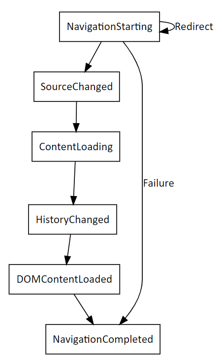

# Navigation events for WebView2 apps
<!-- old title: # Navigation events for WebView2 -->

<!--
maintenance links (keep)
This, main page:
* [Navigation events for WebView2 apps](../concepts/navigation-events.md) - main copy; update it and then propagate/copy to these h2 sections:
Derivative copies of this page's content, or links to this page:
* [Get started with WebView2 in Win32 apps](../get-started/win32.md#step-12---navigation-events)
* [Get started with WebView2 in WinForms apps](../get-started/winforms.md#step-7---navigation-events)
* [Get started with WebView2 in WinUI 2 (UWP) apps](../get-started/winui2.md#step-7---navigation-events)
* [Get started with WebView2 in WinUI 3 (Windows App SDK) apps](../get-started/winui.md#step-7---navigation-events)
* [Get started with WebView2 in WPF apps](../get-started/wpf.md#step-6---navigation-events)
-->

Supported platforms: Win32, Windows Forms, WinUi, WPF.

This article covers navigation events for WebView2 apps.  Navigation events run when specific asynchronous actions occur to the content that's displayed in a WebView2 instance.  For example, when a WebView2 user navigates to a new website, the native content listens for the change by listening for the `NavigationStarting` event.  When the navigation action completes, `NavigationCompleted` runs.

For an example of navigation events, see [Get started with WebView2](../get-started/get-started.md).

The normal sequence of navigation events is:
1. `NavigationStarting`
1. `SourceChanged`
1. `ContentLoading`
1. `HistoryChanged`
1. `BasicAuthenticationRequested`
1. `DOMContentLoaded`
1. `NavigationCompleted`

The following events describe the state of WebView2 during each navigation action:

| Sequence | Event name | Details |
| --- | --- | --- |
| 1 | `NavigationStarting` |  WebView2 starts to navigate and the navigation results in a network request.  The host may disallow the request during the event. |
| 2 | `SourceChanged` |  The source of WebView2 changes to a new URL.  The event may result from a navigation action that doesn't cause a network request such as a fragment navigation. |
| 3 | `ContentLoading` |  WebView2 starts loading content for the new page. |
| 4 | `HistoryChanged` |  The navigation causes the history of WebView2 to update. |
| 5 | `DOMContentLoaded` |  WebView2 finishes parsing the DOM content but hasn't finished loading all images, script, and other content on the page. |
| 6 | `NavigationCompleted` |  WebView2 completes loading content on the new page. |

The above figure shows navigation events that have the same `NavigationId` property on the respective event argument.

Track navigation events to each new document by using the navigation ID (which is provided in the `NavigationId` event).  The `NavigationId` event of WebView2 changes every time a successful navigation to a new document completes.

Navigation events with different instances of `NavigationId` event may overlap.  For instance, when you start a navigation event, you must wait for the related `NavigationStarting` event.  If you then start another navigation, you'll see the following sequence:
1. The `NavigationStarting` event for the first navigation.
1. The `NavigationStarting` event for the second navigation.
1. The `NavigationCompleted` event for the first navigation.
1. All the rest of the appropriate navigation events for the second navigation.

In error cases, there may or may not be a `ContentLoading` event, depending on whether the navigation is continued to an error page.

If an HTTP redirect occurs, there are multiple `NavigationStarting` events in a row, where later event arguments have the `IsRedirect` property set; however, the `NavigationId` event remains the same.

Same-document navigation events, such as navigating to a fragment in the same document, don't cause a `NavigationStarting` event, and don't increment the `NavigationId` event.

To monitor or cancel navigation events inside subframes in a WebView2 instance, use the `FrameNavigationStarting` and `FrameNavigationCompleted` events.  Those events act like the equivalent non-frame, counterpart events.

<!-- ====================================================================== -->
## See also

* [Get started with WebView2](../get-started/get-started.md)
* [WebView2Samples repo](https://github.com/MicrosoftEdge/WebView2Samples) - a comprehensive example of WebView2 capabilities.
* [WebView2 API reference](/dotnet/api/microsoft.web.webview2.wpf.webview2)
* [See also](../index.md#see-also) in _Introduction to Microsoft Edge WebView2_.
