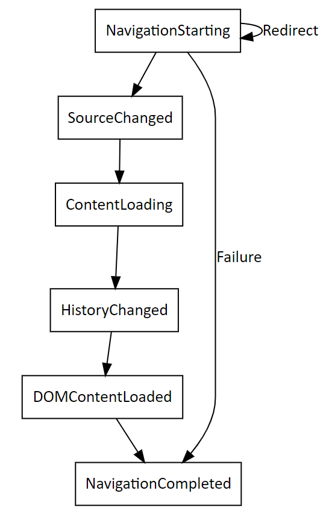

# Navigation events for WebView2 apps

When the user of your WebView2 app goes to a different webpage, URL, or file path, this is a _navigation_.  Each navigation fires a sequence of navigation-related events.  The native portion of your WebView2 app listens for these navigation events and handles them.

Navigation events run when specific asynchronous actions occur to the content that's displayed in a WebView2 instance.  For example, when a WebView2 user navigates to a new website, the native content listens for the change by listening for the `NavigationStarting` event.  When the navigation action completes, `NavigationCompleted` runs.

<!--
maintenance links (keep, to keep sections' content sync'd)
This, main page:
* [Navigation events for WebView2 apps](../concepts/navigation-events.md) - main copy; update it and then propagate/copy to these h2 sections:
Derivative copies of this page's content, or links to this page:
* [Get started with WebView2 in Win32 apps](../get-started/win32.md#step-12---navigation-events)
* [Get started with WebView2 in WinForms apps](../get-started/winforms.md#step-7---navigation-events)
* [Get started with WebView2 in WinUI 2 (UWP) apps](../get-started/winui2.md#step-7---navigation-events)
* [Get started with WebView2 in WinUI 3 (Windows App SDK) apps](../get-started/winui.md#step-7---navigation-events)
* [Get started with WebView2 in WPF apps](../get-started/wpf.md#step-6---navigation-events)
-->

Supported platforms: Win32, Windows Forms, WinUI, WPF.

<!-- ====================================================================== -->
## Standard sequence of events

The following is the normal sequence of events that are fired during each step of a navigation:

| Sequence | Event | Description | API Reference overview |
|---|---|---|---|
| 1 | `NavigationStarting` |  WebView2 starts to navigate and the navigation results in a network request.  The host may disallow the request during the event. | [Block unwanted navigating](./overview-features-apis.md#block-unwanted-navigating) |
| 2 | `SourceChanged` |  The source of WebView2 changes to a new URL.<!--todo: clarify-->  The event may result from a navigation action that doesn't cause a network request, such as a fragment<!--todo: anchor?--> navigation. | [Navigation history](./overview-features-apis.md#navigation-history) |
| 3 | `ContentLoading` |  WebView2 starts loading content for the new page. | [Navigation events](./overview-features-apis.md#navigation-events) |
| 4 | `HistoryChanged` |  The navigation causes the history of WebView2 to update. | [Navigation history](./overview-features-apis.md#navigation-history) |
| 5 | `BasicAuthenticationRequested` |  Raised when WebView encounters a Basic HTTP Authentication request.  See [Basic authentication for WebView2 apps](./basic-authentication.md). | [Authentication](./overview-features-apis.md#authentication) |
| 6 | `DOMContentLoaded` |  WebView2 finishes parsing the DOM content but hasn't finished loading all images, script, and other content on the page. | [Navigation events](./overview-features-apis.md#navigation-events) |
| 7 | `NavigationCompleted` |  WebView2 completes loading content on the new page. | [Navigation events](./overview-features-apis.md#navigation-events) |

<!-- ====================================================================== -->
## Navigation IDs

The diagram above shows navigation events that have the same `NavigationId` property on the respective `eventArgs` object.

Track navigation events to each new document by using the `NavigationId` property of each navigation event's `eventArgs` object.  Each navigation involves a sequence of navigation events.  The `NavigationId` value changes every time a successful navigation to a new document is completed.

Navigation events that have different Navigation IDs may overlap.  For instance, when you start a navigation event, you must wait for the related `NavigationStarting` event.  The `NavigationStarting` event is identified by the `NavigationId` property on the `NavigationStartingEventArgs` object.  If you then start another navigation, you'll see the following sequence:
1. The `NavigationStarting` event for the first navigation.
1. The `NavigationStarting` event for the second navigation.
1. The `NavigationCompleted` event for the first navigation.
1. All the rest of the appropriate navigation events for the second navigation.

In error cases, there may or may not be a `ContentLoading` event, depending on whether the navigation is continued to an error page.

If an HTTP redirect occurs, there are multiple `NavigationStarting` events in a row, where later event arguments have the `IsRedirect` property set; however, the Navigation ID remains the same.

Same-document navigation events, such as navigating to a fragment in the same document, don't cause a `NavigationStarting` event to be fired, and don't cause the Navigation ID to change.

<!-- ====================================================================== -->
## Navigation in frames

To monitor or cancel navigation events inside frames in a WebView2 instance, use the equivalent frame-related APIs and events.  See [Using frames in WebView2 apps](./frames.md).

<!-- ====================================================================== -->
## Navigation example code

For example code showing how to handle navigation events, see:
* [Learn about navigation events](../get-started/winui2.md#learn-about-navigation-events) in _Get started with WebView2 in WinUI 2 (UWP) apps_ - no example code in the article; see other frameworks' articles.
* [Step 5 - Navigation events](../get-started/winui.md#step-5---navigation-events) in _Get started with WebView2 in WinUI 3 (Windows App SDK) apps_.
* [Step 7 - Navigation events](../get-started/wpf.md#step-7---navigation-events) in _Get started with WebView2 in WPF apps_.
* [Step 8 - Navigation events](../get-started/winforms.md#step-8---navigation-events) in _Get started with WebView2 in WinForms apps_.
* [Step 13 - Navigation events](../get-started/win32.md#step-13---navigation-events) in _Get started with WebView2 in Win32 apps_.

The WebView2 [Sample apps](../code-samples-links.md) also demonstrate handling navigation events.

<!-- ====================================================================== -->
## See also

* [Navigate to pages and manage loaded content](./overview-features-apis.md#navigate-to-pages-and-manage-loaded-content) in _Overview of WebView2 features and APIs_
* [Basic authentication for WebView2 apps](./basic-authentication.md)
* [Get started with WebView2](../get-started/get-started.md)
* [WebView2Samples repo](https://github.com/MicrosoftEdge/WebView2Samples) - a comprehensive example of WebView2 capabilities.
* [WebView2 API reference](/dotnet/api/microsoft.web.webview2.wpf.webview2)
