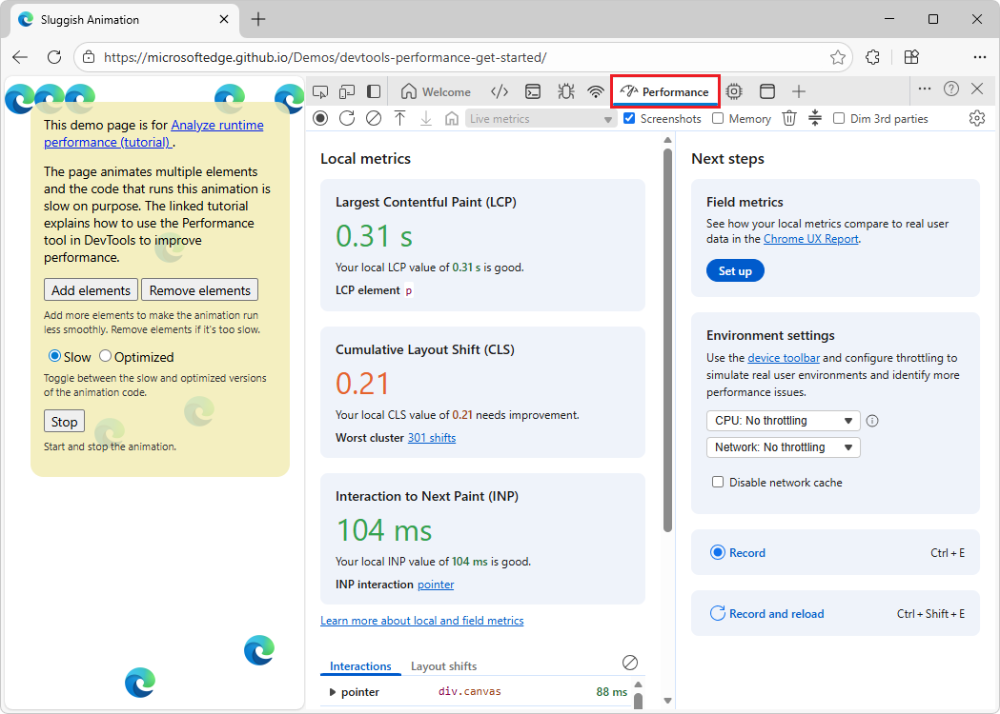
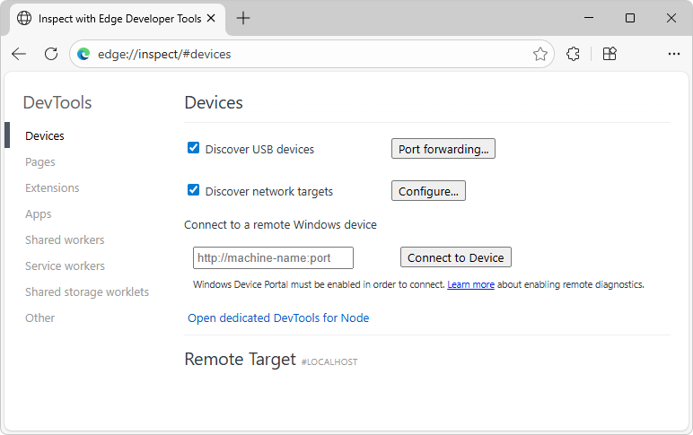

# Performance best practices for WebView2 apps

Use the following practices to optimize WebView2's startup time, memory, CPU, and network use.  Use these tools and workflows for troubleshooting performance.

Embedding Microsoft Edge WebView2 in Windows apps enables modern web features.  WebView2 uses Edge's multi-process architecture, so each control launches multiple browser engine processes that add memory and startup overhead.

**Detailed contents:**

* [Identify the type of performance bottleneck](#identify-the-type-of-performance-bottleneck)
* [Use the Evergreen Runtime](#use-the-evergreen-runtime)
   * [Launch performance](#launch-performance)
* [Optimize startup performance](#optimize-startup-performance)
   * [Cold start (cold launch)](#cold-start-cold-launch)
   * [Don't use WebView2 for initial UI](#dont-use-webview2-for-initial-ui)
   * [Optimize the User Data Folder (UDF) location](#optimize-the-user-data-folder-udf-location)
   * [Avoid redundant WebView2 instances](#avoid-redundant-webview2-instances)
* [Memory usage and process management](#memory-usage-and-process-management)
   * [Share WebView2 environments](#share-webview2-environments)
   * [App-level process sharing](#app-level-process-sharing)
   * [Avoid large-scope host objects](#avoid-large-scope-host-objects)
   * [Prevent memory leaks](#prevent-memory-leaks)
   * [Use memory management APIs](#use-memory-management-apis)
   * [Optimize web content](#optimize-web-content)
   * [Periodically refresh the WebView2](#periodically-refresh-the-webview2)
* [CPU and rendering performance](#cpu-and-rendering-performance)
   * [Enable hardware acceleration](#enable-hardware-acceleration)
   * [Streamline web content](#streamline-web-content)
   * [Reduce unnecessary communication](#reduce-unnecessary-communication)
   * [Manage process priority](#manage-process-priority)
   * [Test real scenarios](#test-real-scenarios)
* [Network and loading performance](#network-and-loading-performance)
   * [Utilize caching and service workers](#utilize-caching-and-service-workers)
   * [Check network bottlenecks](#check-network-bottlenecks)
   * [Reduce initial payloads](#reduce-initial-payloads)
* [Communication between the WebView2 control and the host app](#communication-between-the-webview2-control-and-the-host-app)
   * [Choose the right communication channel](#choose-the-right-communication-channel)
   * [Optimize communication](#optimize-communication)
* [Telemetry and profiling tools](#telemetry-and-profiling-tools)
   * [WebView2 ETW tracing](#webview2-etw-tracing)
   * [Microsoft Edge DevTools](#microsoft-edge-devtools)
   * [Inspect with Edge Developer Tools](#inspect-with-edge-developer-tools)
   * [Browser Task Manager](#browser-task-manager)
* [Troubleshooting workflows for performance issues](#troubleshooting-workflows-for-performance-issues)
   * [Test with simple content](#test-with-simple-content)
   * [Verify the WebView2 Runtime version](#verify-the-webview2-runtime-version)
   * [Monitor memory usage](#monitor-memory-usage)
   * [Compare WebView2 with Microsoft Edge](#compare-webview2-with-microsoft-edge)
* [See also](#see-also)

<!-- ====================================================================== -->
## Identify the type of performance bottleneck

Observe the symptoms of the slow performance, to determine whether the issue is:
* Startup lag.
* Slow page load.
* High memory use.
* Sustained CPU load.

<!--
todo:
See also:
* 
-->

<!-- ====================================================================== -->
## Use the Evergreen Runtime

Many past performance issues, like memory leaks and high CPU usage, have been addressed in newer versions of the WebView2 Runtime.

Whenever possible, deploy your app with the Evergreen WebView2 Runtime, which updates automatically with the latest performance improvements and security fixes.  Keep the WebView2 Runtime evergreen (that is, updated), to future-proof your app.

Using a fixed version risks missing out on recent optimizations.  If you must use a fixed runtime for offline or compatibility reasons, update it regularly after testing new builds.

Test your app using the latest WebView2 preview channels (Beta, Dev, or Canary), to prepare for upcoming changes.

See also:
* [The Evergreen Runtime distribution mode](./distribution.md#the-evergreen-runtime-distribution-mode) in _Distribute your app and the WebView2 Runtime_.

<!-- ------------------------------ -->
#### Launch performance

If Microsoft Edge and WebView2 versions match and Edge is running, the required WebView2 binaries are already in memory, improving launch performance.

<!--
todo:
See also:
* 
-->

<!-- ====================================================================== -->
## Optimize startup performance

<!-- ------------------------------ -->
#### Cold start (cold launch)

A common performance bottleneck is the time to create a WebView2 and navigate it the first time.  On a cold launch, WebView2 must spin up its processes and disk caches, which can introduce a noticeable delay (which can vary by hardware and content complexity).

To optimize startup, use the following best practices.

<!-- ------------------------------ -->
#### Don't use WebView2 for initial UI

Avoid rendering splash screens or simple dialogs with WebView2, due to startup costs and resource contention.  Use lightweight XAML or Win32 screens instead, initializing WebView2 only when displaying actual web content.

<!--
todo:
See also:
* 
-->

<!-- ------------------------------ -->
#### Optimize the User Data Folder (UDF) location

* Keep the UDF in the default local app data folder, for performance.  See [Manage user data folders](./user-data-folder.md).

* Avoid slow drives or network shares; put the data on a faster, physical disk.

<!-- ------------------------------ -->
#### Avoid redundant WebView2 instances

Plan your UI so that you don't create more WebView2 controls than necessary.

For example, if navigating between multiple web pages, it might be faster to reuse a single WebView2 and simply navigate it to a new URL, rather than destroying and re-creating a WebView2 control.

<!--
todo:
See also:
* 
-->

<!-- ====================================================================== -->
## Memory usage and process management

Each WebView2 control creates its own set of processes, such as browser, renderer, and GPU.  Resource usage generally grows as more WebView2 instances are created, with each instance running its own set of browser processes.

A WebView2 instance uses memory based on the complexity of the web content and the browser processes it creates.  Running many instances of the WebView2 control can strain system memory.

Below are best practices to manage and reduce the memory footprint.

<!-- ------------------------------ -->
#### Share WebView2 environments

* To save memory, use one `CoreWebView2Environment` across all WebView2 controls in an app, ensuring consistent parameters for sharing.

* Reuse the same environment in tabbed interfaces, rather than creating multiple environments.

See also:
* [Main classes for WebView2: Environment, Controller, and Core](./environment-controller-core.md)

##### [.NET/C#](#tab/dotnetcsharp)

* [CoreWebView2Environment Class](/dotnet/api/microsoft.web.webview2.core.corewebview2environment)

##### [WinRT/C#](#tab/winrtcsharp)

* [CoreWebView2Environment Class](/microsoft-edge/webview2/reference/winrt/microsoft_web_webview2_core/corewebview2environment)

##### [Win32/C++](#tab/win32cpp)

* [ICoreWebView2Environment](/microsoft-edge/webview2/reference/win32/icorewebview2environment)

---

<!-- ------------------------------ -->
#### App-level process sharing

Multiple apps can share a browser process by using the identical user data folder and `CoreWebView2EnvironmentOptions`.

This reduces memory usage, but requires careful management of profiles and thorough testing, due to possible cross-app interference.

Keep in mind that with sharing a User Data Folder (UDF), underlying data (such as cookies, caches, and databases) is being shared between different applications.

See also:
* [Manage user data folders](./user-data-folder.md)

<!-- no envOptions section; use tabset: -->

##### [.NET/C#](#tab/dotnetcsharp)

* [CoreWebView2EnvironmentOptions Class](/dotnet/api/microsoft.web.webview2.core.corewebview2environmentoptions)

##### [WinRT/C#](#tab/winrtcsharp)

* [CoreWebView2EnvironmentOptions Class](/microsoft-edge/webview2/reference/winrt/microsoft_web_webview2_core/corewebview2environmentoptions)

##### [Win32/C++](#tab/win32cpp)

* [ICoreWebView2EnvironmentOptions](/microsoft-edge/webview2/reference/win32/icorewebview2environmentoptions)

---

<!-- ------------------------------ -->
#### Avoid large-scope host objects

If you use `AddHostObjectToScript` to expose .NET objects to the web, be mindful of what those objects hold in memory.  The entire object is effectively referenced as long as the script context continues to live, which could prevent garbage collection of that object on the .NET side.

Don't expose a very large object graph, if only a small part is needed for scripting.  Prefer creating narrow, purpose‑specific host objects, instead of passing full application models.  For example:

* Expose only the operations and data the page actually needs.  For example, expose a `FileService` object, instead of your entire `AppContext`.

* Wrap complex objects behind small façades to avoid unintentionally exposing deep object hierarchies.

* For collections, provide filtered or paged results rather than exposing the full data structure.

When the page that needed the object is gone, call `CoreWebView2.RemoveHostObjectFromScript` to release the object graph.  For example, if you navigate away from a page that was using a host object, remove that object, to avoid keeping it alive behind the scenes.

See also:
* [Host/web object sharing](./overview-features-apis.md#hostweb-object-sharing) in _Overview of WebView2 APIs_.

<!-- ------------------------------ -->
#### Prevent memory leaks

Remove event handlers before disposing WebView2 objects, to avoid reference cycles and leaks.

Avoid closures that strongly reference WebView2; use weak references when necessary.

Call `webView.Dispose()` to dispose of WebView2 objects when they're no longer needed.

<!--
todo:
See also:
* 
-->

<!-- ------------------------------ -->
#### Use memory management APIs

Set `MemoryUsageTargetLevel = CoreWebView2MemoryUsageTargetLevel.Low` on inactive WebViews to reduce memory usage—this may prompt the browser engine to drop cached data or swap memory to disk.  When the WebView2 instance is again active, restore the target level to `Normal`, for full performance.

If the WebView2 instance won't be used for a while, call `CoreWebView2.TrySuspendAsync()` to suspend the renderer process, which pauses scripts and further decreases resource use.  Resume with `Resume()` when needed.  These `Try` operations are best-effort.

See also:
* [Memory usage target](./overview-features-apis.md#memory-usage-target) in _Overview of WebView2 APIs_.

<!-- ------------------------------ -->
#### Optimize web content

Optimize the rendered content if you observe excessive memory is being utilized in the JS heap, use Microsoft Edge DevTools to monitor usage of resources by web content.

See [Microsoft Edge DevTools documentation](../../devtools/landing/index.yml).

<!--
todo:
See also:
* 
-->

<!-- ------------------------------ -->
#### Periodically refresh the WebView2

Some long-running pages might retain resources over time, depending on the web content and application design.  If memory usage grows unexpectedly, review JavaScript heap usage, event listeners, and DOM retention using DevTools.

In scenarios where the page lifecycle naturally accumulates state, a periodic refresh of the WebView2 instance can help return the process to a clean baseline.

See also:
* [todo] - to check heap usage.
* [todo]() - to check event listeners.
* [todo]() - to check DOM retention.

<!-- ====================================================================== -->
## CPU and rendering performance

WebView2 offloads web content rendering to the browser engine that Edge uses, so performance characteristics are like running a site in Edge.

The following practices ensure efficient CPU usage and smooth rendering.

<!--
todo:
See also:
* 
-->

<!-- ------------------------------ -->
#### Enable hardware acceleration

By default, WebView2 uses the GPU for rendering.  Avoid disabling this use of the GPU, unless troubleshooting, because it's critical for performance.

GPU drivers and additional buffers must be allocated, which requires additional memory.

See also
* [WebView2 browser flags](./webview-features-flags.md) - `disable-gpu`

<!-- ------------------------------ -->
#### Streamline web content

Optimize pages by using the following techniques:

* Limit heavy JavaScript.

* Debounce or throttle tasks.

* Use CSS (rather than JavaScript) for animations.

* Split long scripts to keep the UI responsive.

* Use Microsoft Edge DevTools to identify bottlenecks.

* Use typical web optimization: avoid excessive layout thrashing, where a script alternates between reading and writing DOM properties, causing multiple reflows.

See also:
* [Performance tool: Analyze your website's performance](../../devtools/performance/overview.md)
* [Analyze runtime performance (tutorial)](../../devtools/performance/index.md)
* [Troubleshooting common performance issues](../../devtools/rendering-tools/index.md)
* [Optimize website speed using Lighthouse](../../devtools/speed/get-started.md)

<!-- ------------------------------ -->
#### Reduce unnecessary communication

* Reduce unnecessary communication between native code and web code running in WebView2<!-- todo: orig: between the host and WebView2 -->.

* Batch messages wherever possible, because frequent message passing can increase CPU usage.

<!--
todo:
See also:
* 
-->

<!-- ------------------------------ -->
#### Manage process priority

WebView2 creates separate renderer processes.  In apps with heavy native workloads, assign thread priorities carefully to avoid starving WebView2 threads.

See also:
* [Process model for WebView2 apps](./process-model.md)

<!-- ------------------------------ -->
#### Test real scenarios

Always test your actual content on target hardware, using Microsoft Edge DevTools to find and optimize performance issues.

<!--
todo:
See also:
* 
-->

<!-- ====================================================================== -->
## Network and loading performance

Network latency and limited bandwidth can cause user-perceived performance problems, especially when loading web content in a WebView2 control.

The following best practices overlap with general web development.

<!-- ------------------------------ -->
#### Utilize caching and service workers

WebView2 supports browser caching; serve proper cache headers, so that repeated resource requests use cached versions.

See also:
* [HTTP caching](https://developer.mozilla.org/docs/Web/HTTP/Guides/Caching) at MDN.

Consider pre-caching static files by using a service worker, for offline access; but monitor the cache size.

See also:
* [View Cache data](../../devtools/storage/cache.md)
* [Using Service Workers](https://developer.mozilla.org/docs/Web/API/Service_Worker_API/Using_Service_Workers) at MDN.

<!-- ------------------------------ -->
#### Check network bottlenecks

Use the DevTools **Network** tool to identify slow resources in WebView2; see [Inspect network activity](../../devtools/network/index.md).

Optimize or asynchronously load slow third-party scripts or APIs, as needed.

<!-- ------------------------------ -->
#### Reduce initial payloads

To improve perceived speed:

* Keep HTML light.  With modern single-page-app frameworks, the initial HTML payload is very small.  HTML usually loads, parses, and renders much faster than the equivalent UI written with a single-page-app JavaScript framework.

* Defer heavy components.

* Lazy-load images or scripts after the initial UI appears.

<!--
todo:
See also:
* 
-->

<!-- ====================================================================== -->
## Communication between the WebView2 control and the host app

<!-- ------------------------------ -->
#### Choose the right communication channel

WebView2 provides various web-to-host and host-to-web communication options.  Typically, Web Messages are best, due to their simplicity and reliability.

Use Host Objects only when you need capabilities that Web Messages can't easily express, such as:

* Rich, object‑like APIs (methods, properties, events) you want to expose directly to JavaScript.

* Stateful interactions where maintaining host-side context is simpler than passing structured messages back and forth.

* Large or binary data flows where repeatedly string‑serializing payloads into Web Messages becomes inefficient.

However, Host Objects have the following tradeoffs:

* Host Objects require COM marshalling, which can introduce instability if the object graph changes or isn’t marshalled correctly.

* Host Objects are generally slower for chatty, frequent calls compared to a single batched WebMessage because each method/property access crosses the boundary individually.

* Host Objects create a tighter coupling between web and host code, reducing portability.

Web Messages tend to be more efficient than Host Objects, unless your API surface truly needs the richer semantics of Host Objects.<!-- todo: delete? -->

See also:
* [Interop of native and web code](../how-to/communicate-btwn-web-native.md)

<!-- ------------------------------ -->
#### Optimize communication

Implement asynchronous, batched communication, to minimize IPC communication and reduce data copying.

See also:
* [Web/native interop](./overview-features-apis.md#webnative-interop) in _Overview of WebView2 APIs_.
* [Interop of native and web code](../how-to/communicate-btwn-web-native.md)

<!-- ====================================================================== -->
## Telemetry and profiling tools

Gathering data is key to identifying and fixing performance problems.

The following are tools and telemetry techniques for WebView2.

<!-- ------------------------------ -->
#### WebView2 ETW tracing

Use Microsoft's `WebView2.wprp` ([Gathering an ETW Trace](https://aka.ms/wv2etw)) profile with Windows Performance Recorder to capture and analyze detailed WebView2 events, such as process launches and navigation timings.

You can record **Edge/WebView2** provider events, by using Event Tracing for Windows (ETW); see [Gathering an ETW Trace](https://aka.ms/wv2etw).

Analyze traces in Windows Performance Analyzer for CPU, disk, and memory data.

<!-- ------------------------------ -->
#### Microsoft Edge DevTools

Use Microsoft Edge DevTools to monitor WebView2 content and processes, to identify issues such as high CPU or memory leaks.

Right-click a WebView2 control in a WebView2 app, and then select **Inspect**.  For example, right-click the main, [Win32 sample app](../samples/webview2apissample.md), and then click **Inspect**.  DevTools opens in an undocked, dedicated browser window.

In DevTools, you can use tools such as the **Memory** tool and **Performance** tool:

See also:
* [Debug WebView2 apps with Microsoft Edge DevTools](../how-to/debug-devtools.md)
* [Performance tool: Analyze your website's performance](../../devtools/performance/overview.md)
* [Fix memory problems](../../devtools/memory-problems/index.md) - the **Memory** tool.

<!-- ------------------------------ -->
#### Inspect with Edge Developer Tools

Use `edge://inspect`, which opens the **Inspect with Edge Developer Tools** tab, to monitor WebView2 content and processes, to identify issues such as high CPU or memory leaks.

See also:
* [Remote debugging desktop WebView2 WinUI 2 (UWP) apps](../how-to/remote-debugging-desktop.md)

<!-- ------------------------------ -->
#### Browser Task Manager<!-- todo: is this tool what's meant? -->

Use Browser Task Manager to monitor WebView2 content and processes, to identify issues such as high CPU or memory leaks.

In Microsoft Edge, select **Settings and more** (...) > **More tools** > **Browser Task Manager**.  Or, press **Shift+Esc**.

See also:
* [Monitor memory use in realtime (Microsoft Edge Browser Task Manager)](../../devtools/memory-problems/microsoft-edge-browser-task-manager.md)

<!-- ====================================================================== -->
## Troubleshooting workflows for performance issues

When performance issues arise in a WebView2 app, use a structured approach to troubleshoot, per the following strategies.

<!-- ------------------------------ -->
#### Test with simple content

Load a minimal HTML page.

* If performance is still slow with simple content, investigate runtime initialization or host app factors.

* If performance is faster with simple content, focus on optimizing your web content.

<!--
todo:
See also:
* 
-->

<!-- ------------------------------ -->
#### Verify the WebView2 Runtime version

Make sure you're running the latest WebView2 Runtime, not an outdated version or fallback Edge install.  Update the WebView2 Runtime as needed.

<!--
todo:
See also:
* 
-->

<!-- ------------------------------ -->
#### Monitor memory usage

Use Windows Task Manager to check WebView2 process memory.

<!-- todo: Browser Task Manager?  In Microsoft Edge, select **Settings and more** (...) > **More tools** > **Browser Task Manager**. -->

Unusual growth may indicate a leak—use WPR recordings to debug this further.

<!--
todo:
See also:
* 
-->

<!-- ------------------------------ -->
#### Compare WebView2 with Microsoft Edge

WebView2 uses the same core browser engine as Microsoft Edge.  Validate the case with Microsoft Edge, as well as with WebView2, to isolate the issue.

<!-- ====================================================================== -->
## See also

* [Development best practices for WebView2 apps](./developer-guide.md)
