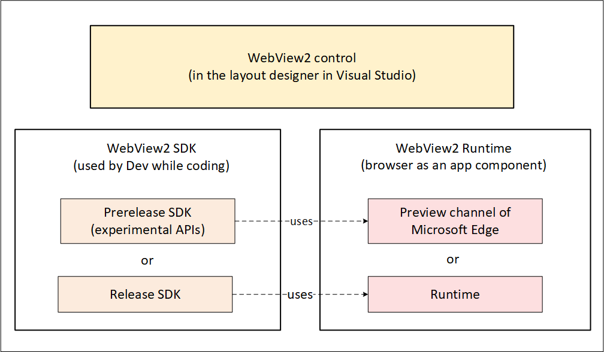
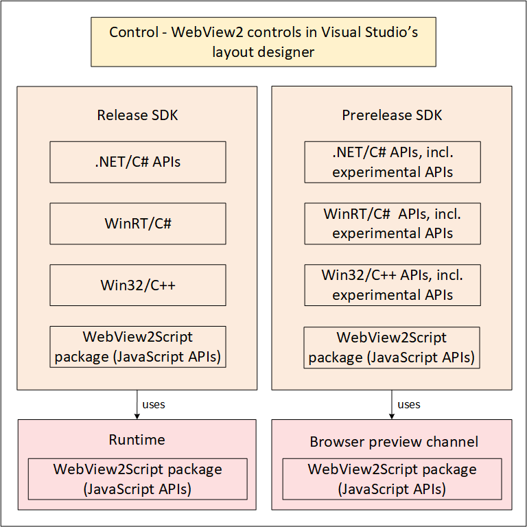
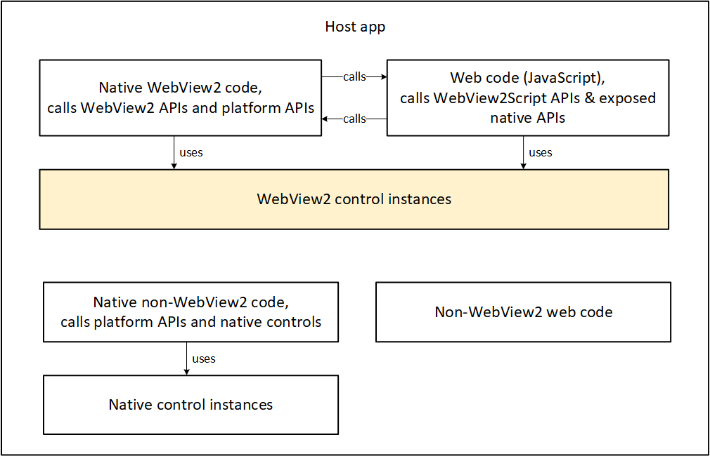
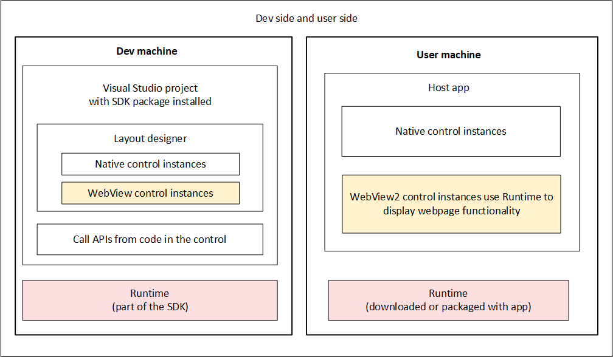
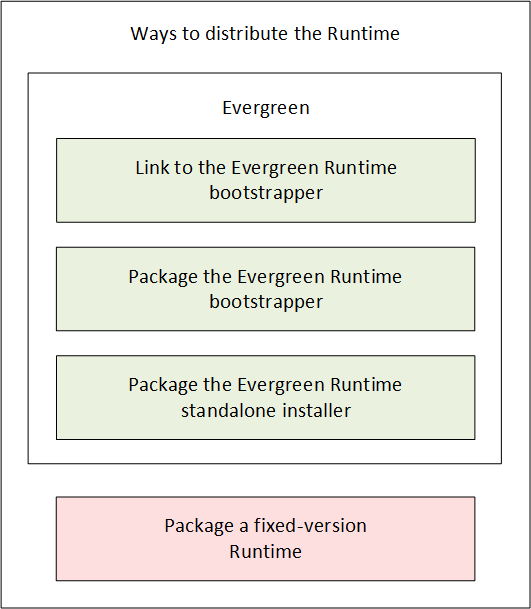
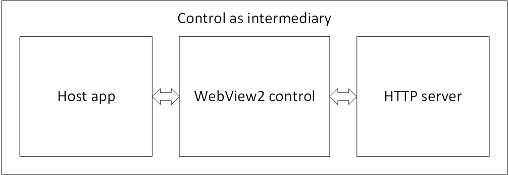
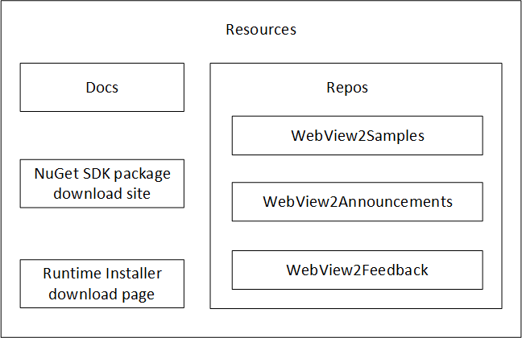

# Overview of the components of the WebView2 platform

To add WebView2 to your app, you use the WebView2 SDK on your development machine, and distribute the WebView2 Runtime to user machines.  The following diagram shows the high-level WebView2 components on your development machine and user machines.

Developing a WebView2 app involves software residing in the following places:

| Location | Description |
|---|---|
| Dev machine | You use a Visual Studio project that includes the WebView2 SDK.  The SDK includes the WebView2 Runtime, which is an embedded web browser component used for the WebView2 control instances in your host app. |
| Distributing the app and Runtime | There are several ways to deliver the always up-to-date Evergreen version of the WebView2 Runtime to user machines, with several levels of Internet connectivity supported.  Some scenarios benefit from distributing a specific, fixed-version WebView2 Runtime. |
| User machine | Your host app on user machines includes instances of the WebView2 control, which uses the WebView2 Runtime. |
| Resources | The present documentation; the WebView2Samples repo including basic Getting Started WebView2 projects and more full-featured Sample projects; the WebView2Announcements repo; and the WebView2Feedback repo. |

<!-- todo: like the above table, talk through each box of the full diagram: -->

Details of the Dev machine:
*  Visual Studio project -- Use a Visual Studio project template to create a standard platform app, and then add the WebView2 SDK to the project as a NuGet package.
   *  Layout designer -- lay out your controls in Visual Studio.
      *  WebView2 control instances -- web content areas of your app.  The app's web-side code runs in this control.
      *  Native control instances -- native controls and panes of your app.
   *  WebView2 SDK
      *  Per-platform WebView2 APIs <!-- todo: add to diagram --> including CoreWebView2, CoreWebView2Controller, CoreWebView2Environment.  Primarily called by native-side code.
      *  `AddHostObjectToScript` -- enables exposing platform APIs and WebView2 APIs to JavaScript code.
      *  [JavaScript APIs](/microsoft-edge/webview2/webview2-api-reference#javascript) (WebView2Script package) -- called by web-side code to communicate with the host application.
   *  Platform APIs -- non-WebView2 APIs provided by the platform; can be exposed to web-side code. <!-- todo: add to diagram -->
*  Runtime -- browser component that contains WebView2 APIs.

There are three ways to distribute the Evergreen Runtime to user machines, as well as a fixed-version Runtime option:
*  Evergreen Runtime -- The WebView2 Evergreen Runtime is automatically updated to the latest version, on user machines, any of several ways with different degrees of relying on an Internet connection:
   *  Link to the Evergreen Runtime bootstrapper from your app installer.  Maximally relies on an internet connection.
   *  Package the Evergreen Runtime bootstrapper into your app installer.  Moderately relies on an internet connection.
   *  Package the Evergreen Runtime standalone installer.  Minimally relies on an internet connection.
*  Package a fixed-version Runtime.  Gives fully determinate control of which version of which APIs are present.

For more information, see [Approaches for distributing the WebView2 Runtime](#approaches-for-distributing-the-webview2-runtime) below.

Details of the User machine:
*  Host app
   *  WebView2 native code
   *  WebView2 web code -- the WebView2 APIs are mostly called by native-side code|web-side code.
   *  WebView2 control instances -- your app's web-side code runs in a WebView2 control.
   *  Non-WebView2 native code
   *  Non-WebView2 web code
   *  Native control instances
*  Runtime

Resources include:
*  Docs
*  Samples repo
*  Announcements repo
*  Feedback repo

See [Resources](#resources) below.

<!-- ====================================================================== -->
## Top-level WebView2 components

| Shorthand term | Complete term |
|---|---|
|  _App_ | Any app, for any framework or platform, that includes an instance of the WebView2 control.  An app can have areas that use a WebView2 control instance, and other areas that don't use the control. |
|  _SDK_ | The WebView2 SDK.  When part of your app uses WebView2, that code can call these APIs in conjunction with instances of the WebView2 control.  The Release SDK ships to users, and contains only stable APIs.  The Prerelease SDK is only used by Devs, and contains some experimental APIs. |
|  _Control_ | An instance of the WebView2 control.  In an app, typically appears as a rectangular area than contains web content. |
|  _Runtime_ | The WebView2 Runtime, which is a browser engine.  Installed on user machines, as well as Dev and test machines. |
|  _Preview channel_ | A preview channel of Microsoft Edge, either Beta (near-stable), Dev, or Canary (the very latest build; daily).  For Dev and test machines only, not user machines. |

<!-- ====================================================================== -->
## The WebView2 control, SDK, and Runtime

The WebView2 control, WebView2 SDK, and WebView2 Runtime have the following roles:

| Component | Role |
|:---|:---|
| WebView2 SDK | Provides APIs for developers to use in an app's code.  Used by Dev locally while coding the app.  Two versions: Prerelease SDK for local Dev testing, and Release SDK for developing shippable code for users. |
| WebView2 control | You embed the WebView2 control in the app.  Hosts the Runtime; serves as a visible area to display web content. |
| WebView2 Runtime | On Dev's test machine and on user machines.  Or, instead of using the Runtime, Dev can use a preview channel of Microsoft Edge for local testing, when using the Prerelease SDK. |

<!-- ------------------------------ -->
#### Diagram: Relationship between the WebView2 control, SDK, and Runtime

Control:
*  WebView2 control - in the app layout; hosts the Runtime.

SDK:
*  WebView2 SDK - used by Dev while coding.  Either:
   *  Prerelease SDK (Dev only; includes experimental APIs for Dev testing).
   *  Release SDK.

Runtime:
*  WebView2 Runtime - a browser for use as a component of an app; on user machines.  Either:
   *  Preview channel of Microsoft Edge (Dev only)
   *  Runtime

<!-- ------------------------------ -->
#### Diagram: WebView2 control, Runtime, and SDK

This diagram shows the following outline:

Release SDK:
* .NET/C# APIs
* WinRT/C#
* Win32/C++
* WebView2Script package (JavaScript APIs)

Prerelease SDK:
* .NET/C# APIs, including experimental APIs
* WinRT/C#  APIs, including experimental APIs
* Win32/C++ APIs, including experimental APIs
* WebView2Script package (JavaScript APIs)

Runtime (for release) or Browser (for Prerelease)
* WebView2Script package (JavaScript APIs)

Runtime (for Release SDK) - WebView2Script package (JavaScript APIs)
Browser (for Prerelease SDK) - WebView2Script package (JavaScript APIs)

You periodically download the latest SDK from NuGet.  NuGet links are in [Release Notes for the WebView2 SDK](../release-notes.md).

The SDK includes the JavaScript API, which is in the `WebView2Script` package.

See also:
* [WebView2 API Reference](../webview2-api-reference.md)

<!-- ====================================================================== -->
## Design architecture of a WebView2 app

A host app contains the following categories of code and components:
*  Native code calls platform APIs and WebView2 APIs.
*  WebView2 control instance.
*  Native code calls platform APIs and WebView2 APIs.
*  Web (JavaScript) code calls WebView2Script APIs & exposed native APIs.

<!-- ------------------------------ -->
#### Diagram: Design architecture of a WebView2 app

Categories of code:
*  Native WebView2 code, calls WebView2 APIs and platform APIs.
*  Web code (JavaScript), calls WebView2Script APIs & exposed native APIs.
*  Native non-WebView2 code, calls platform APIs and native controls.
*  Non-WebView2 web code (JavaScript).

Two-way code:
*  Call web code (JavaScript) from native code.
*  Call native code from web code (JavaScript).

<!-- ====================================================================== -->
## Development machine vs. user machine

Here are the differences between the Dev machine and User machine, for which components are used.

<!-- ------------------------------ -->
#### Diagram: App on the Development machine and user machine

| Component | Dev machine | User machine |
|---|---|---|
| Runtime | A Preview channel of Microsoft Edge, or the Runtime that's part of the SDK. | Runtime (downloaded via bootstrapper, or packaged with app); Microsoft Edge isn't used. |
| Working environment | Visual Studio project that has the SDK package installed.  Layout designer includes WebView control areas & native, non-WebView control areas. | The App (including WebView control areas, and native, non-WebView control areas). |
| Activity | Dev works with the APIs in code (experimental APIs or stable APIs). | User machine runs app.  The WebView2 parts of the app (instances of the WebView2 control) use the Runtime to display webpage functionality. |
| User interface environment | Visual Studio (layout designer includes WebView control areas & native, non-WebView control areas). | The App (including WebView control areas, and native, non-WebView control areas). |
| SDK | Prerelease SDK (experimental APIs) or Release SDK (stable APIs). | No SDK; just the Runtime containing the executable stable APIs. |
| Control | Placed on layout designer in Visual Studio. | Areas (regions) of the app containing web content. |

<!-- ====================================================================== -->
## Ways to distribute, install, and update the Runtime on the user's machine

There are several ways to distribute the WebView2 Runtime with your app:

<!-- ------------------------------ -->
#### Approaches for distributing the WebView2 Runtime

| Name of distribution approach | Description | Notes |
|---|---|---|
| Link to the Evergreen Runtime bootstrapper | In your app's installer, link to the Evergreen Runtime bootstrapper.  Have your app's installer use this link to programmatically download and install the Evergreen bootstrapper onto the user's machine.  Then invoke the bootstrapper to install the appropriate Runtime for the user's device. | For users who have an online connection.  The Evergreen bootstrapper is a tiny installer that installs the correct Runtime for the user's CPU, using an internet connection. |
| Package the Evergreen Runtime bootstrapper | Download the Evergreen bootstrapper to your Dev machine.  Package and distribute the Evergreen bootstrapper with your app installer.  Then your app installer invokes the bootstrapper to install the Runtime on the user's machine. | For users who don't have a reliable connection to the bootstrapper CDN site. |
| Package the Evergreen Runtime standalone installer | Download the Evergreen standalone installer to your Dev machine, and package it with your app.  Package the Evergreen standalone installer with your app's installer.  Your app's installer then invokes the Evergreen standalone installer to install the Runtime on the user's device. | For offline users.  A large, standalone Evergreen Runtime installer for offline users, that includes the Evergreen Runtime. |
| Package a fixed-version Runtime | Download a version-specific, CPU-specific Runtime to your Dev machine.  Package and distribute the fixed-version Runtime with your app's installer.  Your app's installer installs the specific fixed-version Runtime on the user's machine. | Specialty case, for when you need specific version of the APIs; avoids testing whether latest APIs are available. |

The above approaches are listed in the same sequence as in the [Download the WebView2 Runtime](https://developer.microsoft.com/microsoft-edge/webview2#download) section of the **Microsoft Edge WebView2** page, from lightweight to heavyweight approaches.  Favor the lightweight approaches; use a heavyweight approach if required by a specialized scenario.

_Your app's installer_ means your app's installer/updater, which can be separate from your app, or a part of your app.

See also:
* [Understanding the options at the Runtime download page](../concepts/evergreen-vs-fixed-version.md#understanding-the-options-at-the-runtime-download-page) in _Evergreen vs. fixed version of the WebView2 Runtime_.

<!-- ====================================================================== -->
## Host app, WebView2 control, and HTTP server

The WebView2 control acts as an intermediary for communication between the host app and the HTTP server.

<!-- ------------------------------ -->
#### Diagram: Host app, WebView2 control, and HTTP server

<!-- ====================================================================== -->
## Prerelease SDK with preview browser channel, or Release SDK with Runtime

| Version | Renderer platform | Description |
|:---|:---|:---|
| Prerelease SDK | A preview channel of Microsoft Edge (Beta, Dev, or Canary) | For experimenting and testing your app against upcoming changes, on your Dev machines. |
| Release SDK | The WebView2 Runtime | For shipping your app to end users. |

* A Prerelease version of the WebView2 SDK uses a preview channel of Microsoft Edge (Beta, Dev, or Canary).
* A Release version of the WebView2 SDK uses the WebView2 Runtime.

See also:
* [Understanding the options at the Runtime download page](../concepts/evergreen-vs-fixed-version.md#understanding-the-options-at-the-runtime-download-page) in _Evergreen vs. fixed version of the WebView2 Runtime_.
* [Prerelease and release SDKs for WebView2](./versioning.md)
* [Distribute your app and the WebView2 Runtime](./distribution.md)

<!-- ====================================================================== -->
## Using a Prerelease SDK and experimental APIs with a Preview channel of Microsoft Edge

To develop the prerelease version of your app using experimental APIs, or to test your app against upcoming SDK changes:

* On your Dev machine, in the Visual Studio project, install a **Prerelease** version of the `Microsoft.Web.WebView2` SDK NuGet package.  Write code that uses the **experimental** APIs (and stable APIs).
* On your Dev machine, install and use a preview channel of Microsoft Edge.

To distribute your prerelease app to your test machine:
* On your test machine, install a preview channel of Microsoft Edge.

See also:
* [Understand the different WebView2 SDK versions](./versioning.md) - Either use a prerelease SDK with a preview channel of Microsoft Edge, or use a release SDK with the WebView2 Runtime.

<!-- ====================================================================== -->
## Using a Release SDK and stable APIs with the Runtime

To develop the release version of your app:
* On your Dev machine, in the Visual Studio project, install a **Release** version of the `Microsoft.Web.WebView2` SDK NuGet package.  Write code that uses only the **stable** APIs.
* On your Dev machine, use the WebView2 Runtime (part of the SDK package).

The WebView2 Runtime is like a browser engine for use as a component in your app.

There are several ways to distribute your app and the Runtime to users.  See [Ways to distribute, install, and update the Runtime on the user's machine](#ways-to-distribute-install-and-update-the-runtime-on-the-users-machine) above.

See also:
* [Understand the different WebView2 SDK versions](./versioning.md) - Either use a prerelease SDK with a preview channel of Microsoft Edge, or use a release SDK with the WebView2 Runtime.

<!-- ====================================================================== -->
## How the WebView2 SDK is laid out in relation to how the WebView2 Runtime is laid out

todo: what's the intention here?

<!-- ====================================================================== -->
## Differences in the Runtime and the SDK across the frameworks

todo

<!-- ====================================================================== -->
## Resources

*  Docs - the present article is the main page for WebView2 docs. <!--[Introduction to Microsoft Edge WebView2](./index.md)-->
*  Runtime installer download page - see the [Download the WebView2 Runtime](https://developer.microsoft.com/microsoft-edge/webview2#download) section of the **Microsoft Edge WebView2** page.
*  NuGet SDK package download site - see [Microsoft.Web.WebView2](https://www.nuget.org/packages/Microsoft.Web.WebView2) at NuGet.org.
*  GitHub Repos and support - see [Contact the WebView2 Team](../contact.md).  Direct links:
   *  [WebView2Samples repo](https://github.com/MicrosoftEdge/WebView2Samples) - contains completed Getting Started article projects (minimal code) and code-rich Samples.
   *  [WebView2Announcements repo](https://github.com/MicrosoftEdge/WebView2Announcements)
   *  [WebView2Feedback repo](https://github.com/MicrosoftEdge/WebView2Feedback)

<!-- ------------------------------ -->
#### Diagram: Resources

<!-- ====================================================================== -->
## See also

* [Overview of WebView2 features and APIs](./overview-features-apis.md)
* [Getting Started tutorials](../get-started/get-started.md)
* [Distribute your app and the WebView2 Runtime](./distribution.md)

developer.microsoft.com:
* [Microsoft Edge WebView2](https://developer.microsoft.com/microsoft-edge/webview2) - initial introduction to WebView2 features at developer.microsoft.com.
