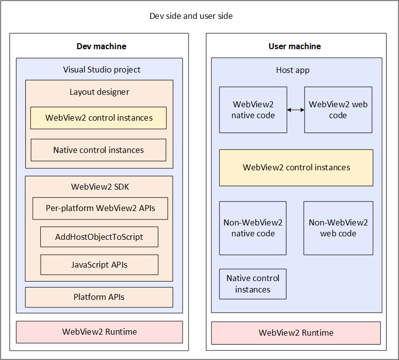
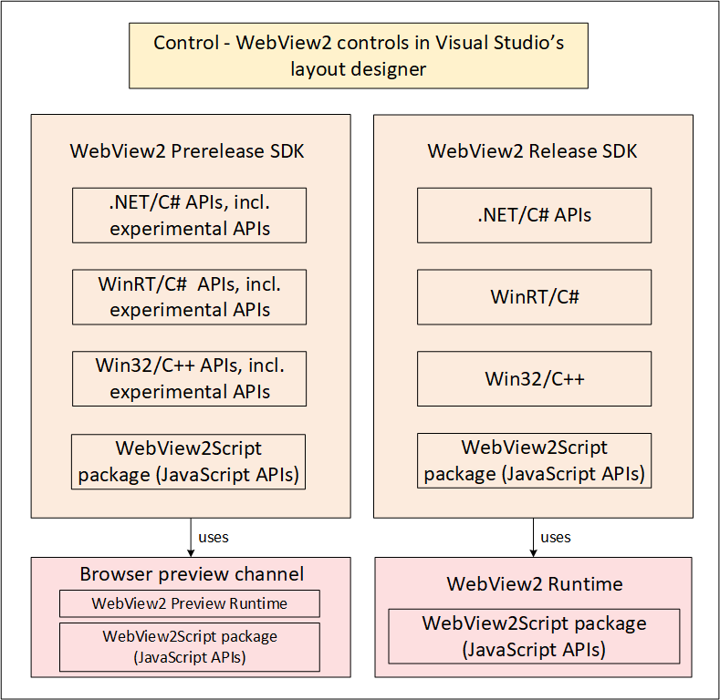
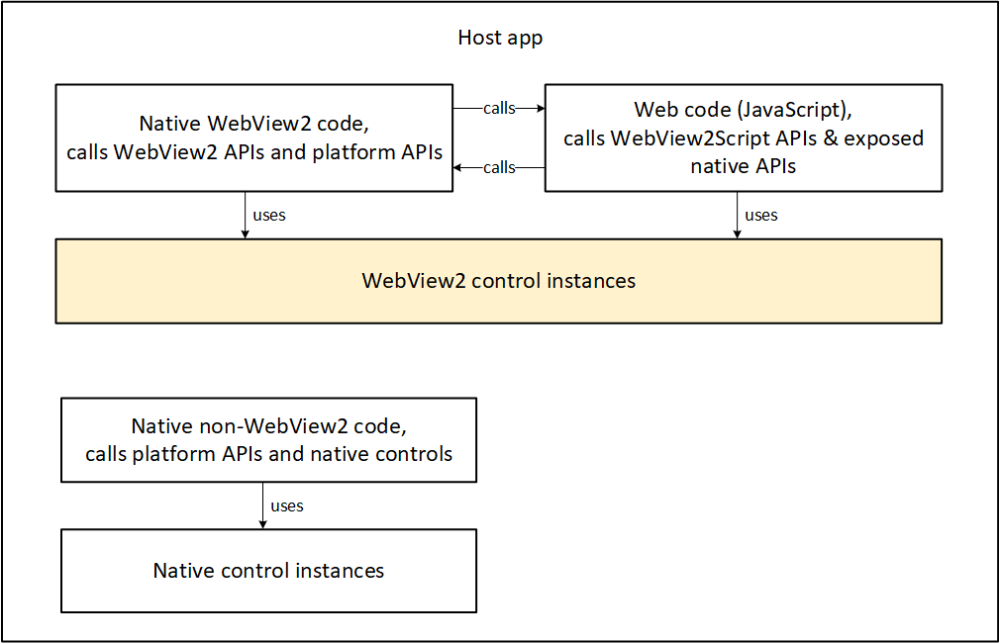
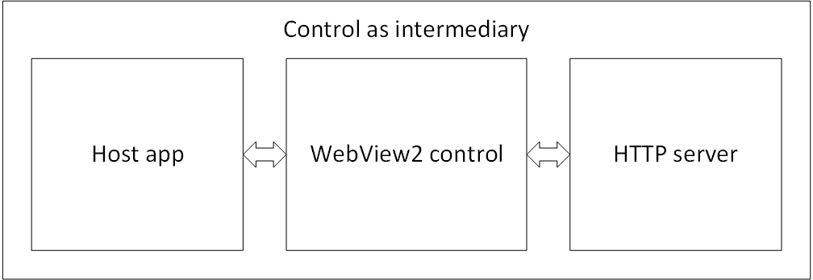

# Components of the WebView2 platform

To add WebView2 to your app, you use the WebView2 SDK on your development machine, and distribute the WebView2 Runtime to user machines.

**Detailed contents:**
* [Components on the Dev machine and user machines](#components-on-the-dev-machine-and-user-machines)
   * [Top-level WebView2 components](#top-level-webview2-components)
   * [The WebView2 control, SDK, and Runtime](#the-webview2-control-sdk-and-runtime)
   * [Diagram of high-level WebView2 components](#diagram-of-high-level-webview2-components)
   * [Dev machine](#dev-machine)
   * [User machine](#user-machine)
* [Prerelease SDK with Preview Runtime, or Release SDK with Stable Runtime](#prerelease-sdk-with-preview-runtime-or-release-sdk-with-stable-runtime)
   * [Using a Prerelease SDK and experimental APIs with a Preview channel of Microsoft Edge](#using-a-prerelease-sdk-and-experimental-apis-with-a-preview-channel-of-microsoft-edge)
   * [Using a Release SDK and stable APIs with the Runtime](#using-a-release-sdk-and-stable-apis-with-the-runtime)
* [Design architecture of a WebView2 app](#design-architecture-of-a-webview2-app)
* [Ways to distribute, install, and update the Runtime on the user's machine](#ways-to-distribute-install-and-update-the-runtime-on-the-users-machine)
   * [Approaches for distributing the WebView2 Runtime](#approaches-for-distributing-the-webview2-runtime)
* [Communication with an HTTP server](#communication-with-an-http-server)
* [See also](#see-also)

<!-- ====================================================================== -->
## Components on the Dev machine and user machines

To add WebView2 to your app, you use the WebView2 SDK on your development machine, and distribute the WebView2 Runtime to user machines.

<!-- ------------------------------ -->
#### Top-level WebView2 components

| Shorthand term | Description |
|---|---|
|  _App_ | Any app, for any framework or platform, that includes an instance of the WebView2 control.  An app can have areas that use a WebView2 control instance, and other areas that don't use the control. |
|  _SDK_ | The WebView2 SDK.  When a part of your app uses WebView2, that code can call these APIs in conjunction with instances of the WebView2 control.  The Release SDK ships to users, and contains only stable APIs.  The Prerelease SDK is only used by Devs, and contains some experimental APIs. |
|  _Control_ | An instance of the WebView2 control.  In an app, typically appears as a rectangular area than contains web content. |
|  _Runtime_ | The WebView2 Runtime, which is a browser engine.  Installed on user machines, as well as Dev and test machines. |
|  _Preview channel_ | A preview channel of Microsoft Edge, either Beta (near-stable), Dev, or Canary (the very latest build; daily).  For Dev and test machines only, not user machines. |

<!-- ------------------------------ -->
#### The WebView2 control, SDK, and Runtime

The WebView2 control, WebView2 SDK, and WebView2 Runtime have the following roles:

| Component | Role |
|:---|:---|
| WebView2 SDK | Provides APIs for developers to use in an app's code.  Used by Dev locally while coding the app.  Two versions: Prerelease SDK for local Dev testing, and Release SDK for developing shippable code for users. |
| WebView2 control | You embed the WebView2 control in the app.  Hosts the Runtime; serves as a visible area to display web content. |
| WebView2 Runtime | On Dev's test machine and on user machines.  Or, instead of using the Runtime, Dev can use a preview channel of Microsoft Edge for local testing, when using the Prerelease SDK. |

<!-- ------------------------------ -->
#### Diagram of high-level WebView2 components

The following diagram shows the high-level WebView2 components on your development machine and user machines:

<!-- the next 2 sections are a text version of diagram: -->

<!-- ------------------------------ -->
#### Dev machine

This section explains the left column of the above diagram.

Your Dev machine, for developing a WebView2 app, consists of the following components:

* Visual Studio project - Use a Visual Studio project template to create a standard platform app, and then add the WebView2 SDK to the project as a NuGet package.

   * Layout designer - Lay out your controls in Visual Studio.

      * WebView2 control instances - Web content areas of your app.  The app's web-side code runs in this control.

      * Native control instances - Native controls and panes of your app.

   * The WebView2 SDK.

      * Per-platform WebView2 APIs, including `CoreWebView2`, `CoreWebView2Controller`, and `CoreWebView2Environment`.  Primarily called by native-side code.

      * `AddHostObjectToScript` - Enables exposing platform APIs and WebView2 APIs to JavaScript code.  See [Interop of native and web code](../how-to/communicate-btwn-web-native.md)

      * [JavaScript APIs](../webview2-api-reference.md#javascript) (WebView2Script package) - Called by web-side code to communicate with the host application.

   * Platform APIs - Non-WebView2 APIs provided by the web platform; used by your web-side code.

* WebView2 Runtime - Microsoft Edge browser component that contains WebView2 APIs and runs your web-side code.

<!-- ------------------------------ -->
#### User machine

This section explains the right-hand column of the above diagram.

On the end-user machine are the following components that are involved in running a WebView2 app:

* The host app, which the user has installed and is using.

   * WebView2 native code: your native code that uses WebView2 APIs.

   * Web code: your web-side code which runs in a WebView2 control instance.

   * WebView2 control instances: the WebView2 app's web-side code runs in a WebView2 control.

   * Non-WebView2 native code.

   * Non-WebView2 web code.

   * Native control instances.

* The WebView2 Runtime.

<!-- ====================================================================== -->
## Prerelease SDK with Preview Runtime, or Release SDK with Stable Runtime

You use either combination:
* A WebView2 Prerelease SDK together with a preview channel of Microsoft Edge (Beta, Dev, or Canary), which includes the WebView2 Preview Runtime.  
* A WebView2 Release SDK together with the WebView2 Runtime.

| Type of WebView2 SDK | Renderer platform | Scenario |
|:---|:---|:---|
| Prerelease SDK | A WebView2 Preview Runtime, which is included in a preview channel of Microsoft Edge (Beta, Dev, or Canary) | For experimenting and testing your app against upcoming changes, on your Dev machines. |
| Release SDK | A WebView2 Stable Runtime | For shipping your app to end users. |

This diagram shows the following outline:

WebView2 Prerelease SDK:
* .NET/C# APIs, including experimental APIs.
* WinRT/C#  APIs, including experimental APIs.
* Win32/C++ APIs, including experimental APIs.
* WebView2Script package (JavaScript APIs).

The Prerelease SDK uses a preview channel of Microsoft Edge, which includes:
* The WebView2 Preview Runtime.
* The WebView2Script package (JavaScript APIs).

WebView2 Release SDK:
* .NET/C# APIs.
* WinRT/C#.
* Win32/C++.
* WebView2Script package (JavaScript APIs).

The Release SDK uses the WebView2 Runtime (WebView2 Stable Runtime).
* The Runtime includes the WebView2Script package (JavaScript APIs).

You periodically download the latest SDK from NuGet.  NuGet links are in [Release Notes for the WebView2 SDK](../release-notes.md).

The SDK includes the JavaScript API, which is in the `WebView2Script` package.

See also:
* [Understanding the options at the Runtime download page](../concepts/evergreen-vs-fixed-version.md#understanding-the-options-at-the-runtime-download-page) in _Evergreen vs. fixed version of the WebView2 Runtime_.
* [Prerelease and release SDKs for WebView2](./versioning.md)
* [Distribute your app and the WebView2 Runtime](./distribution.md)
* [WebView2 API Reference](../webview2-api-reference.md)

<!-- ------------------------------ -->
#### Using a Prerelease SDK and experimental APIs with a Preview channel of Microsoft Edge

To develop the prerelease version of your app using experimental APIs, or to test your app against upcoming SDK changes:

* On your Dev machine, in the Visual Studio project, install a **Prerelease** version of the `Microsoft.Web.WebView2` SDK NuGet package.  Write code that uses the **experimental** APIs (and stable APIs).
* On your Dev machine, install and use a preview channel of Microsoft Edge.

To distribute your prerelease app to your test machine:
* On your test machine, install a preview channel of Microsoft Edge.

See also:
* [Prerelease and Release SDKs for WebView2](./versioning.md) - Either use a prerelease SDK with a preview channel of Microsoft Edge, or use a release SDK with the WebView2 Runtime.

<!-- ------------------------------ -->
#### Using a Release SDK and stable APIs with the Runtime

To develop the release version of your app:
* On your Dev machine, in the Visual Studio project, install a **Release** version of the `Microsoft.Web.WebView2` SDK NuGet package.  Write code that uses only the **stable** APIs.
* On your Dev machine, use the WebView2 Runtime (part of the SDK package).

The WebView2 Runtime is like a browser engine for use as a component in your app.

There are several ways to distribute your app and the Runtime to users.  See [Ways to distribute, install, and update the Runtime on the user's machine](#ways-to-distribute-install-and-update-the-runtime-on-the-users-machine) above.

See also:
* [Prerelease and Release SDKs for WebView2](./versioning.md) - Either use a prerelease SDK with a preview channel of Microsoft Edge, or use a release SDK with the WebView2 Runtime.

<!-- ====================================================================== -->
## Design architecture of a WebView2 app

A host app contains the following categories of components:
* Native control instances.
* WebView2 control instances.

A host app also contains the following categories of code:
* Native code, which calls native platform APIs.
* Native code, which calls WebView2 APIs.
* Web code (JavaScript), which calls WebView2Script APIs, exposed native APIs, and web platform APIs.

<!-- ====================================================================== -->
## Ways to distribute, install, and update the Runtime on the user's machine

There are several ways to distribute the WebView2 Runtime with your app:

<!-- ------------------------------ -->
#### Approaches for distributing the WebView2 Runtime

| Name of distribution approach | Description | Notes |
|---|---|---|
| Link to the Evergreen Runtime bootstrapper | In your app's installer, link to the Evergreen Runtime bootstrapper.  Have your app's installer use this link to programmatically download and install the Evergreen bootstrapper onto the user's machine.  Then invoke the bootstrapper to install the appropriate Runtime for the user's device. | For users who have an online connection.  The Evergreen bootstrapper is a tiny installer that installs the correct Runtime for the user's CPU, using an internet connection. |
| Package the Evergreen Runtime bootstrapper | Download the Evergreen bootstrapper to your Dev machine.  Package and distribute the Evergreen bootstrapper with your app installer.  Then your app installer invokes the bootstrapper to install the Runtime on the user's machine. | For users who don't have a reliable connection to the bootstrapper CDN site. |
| Package the Evergreen Runtime standalone installer | Download the Evergreen standalone installer to your Dev machine, and package it with your app.  Package the Evergreen standalone installer with your app's installer.  Your app's installer then invokes the Evergreen standalone installer to install the Runtime on the user's device. | For offline users.  A large, standalone Evergreen Runtime installer for offline users, that includes the Evergreen Runtime. |
| Package a fixed-version Runtime | Download a version-specific, CPU-specific Runtime to your Dev machine.  Package and distribute the fixed-version Runtime with your app's installer.  Your app's installer installs the specific fixed-version Runtime on the user's machine. | Specialty case, for when you need specific version of the APIs; avoids testing whether latest APIs are available. |

The above approaches are listed in the same sequence as in the [Download the WebView2 Runtime](https://developer.microsoft.com/microsoft-edge/webview2#download) section of the **Microsoft Edge WebView2** page, from lightweight to heavyweight approaches.  Favor the lightweight approaches; use a heavyweight approach if required by a specialized scenario.

_Your app's installer_ means your app's installer/updater, which can be separate from your app, or a part of your app.

See also:
* [Understanding the options at the Runtime download page](../concepts/evergreen-vs-fixed-version.md#understanding-the-options-at-the-runtime-download-page) in _Evergreen vs. fixed version of the WebView2 Runtime_.

<!-- ====================================================================== -->
## Communication with an HTTP server

The WebView2 control acts as an intermediary for communication between the host app and the HTTP server.

<!-- ====================================================================== -->
## See also

* [Overview of WebView2 features and APIs](./overview-features-apis.md)
* [Getting Started tutorials](../get-started/get-started.md)
* [Distribute your app and the WebView2 Runtime](./distribution.md)

developer.microsoft.com:
* [Microsoft Edge WebView2](https://developer.microsoft.com/microsoft-edge/webview2) - initial introduction to WebView2 features at developer.microsoft.com.

**Resources for WebView2 app development:**

* Documentation, such as [Introduction to Microsoft Edge WebView2](../index.md).

* Runtime installer download page - see the [Download the WebView2 Runtime](https://developer.microsoft.com/microsoft-edge/webview2#download) section of the **Microsoft Edge WebView2** page.

* NuGet SDK package download site - see [Microsoft.Web.WebView2](https://www.nuget.org/packages/Microsoft.Web.WebView2) at NuGet.org.

* GitHub repos and support:

   * [WebView2Samples repo](https://github.com/MicrosoftEdge/WebView2Samples) - contains completed Getting Started article projects (minimal code) and code-rich Samples.

   * [WebView2Announcements repo](https://github.com/MicrosoftEdge/WebView2Announcements)

   * [WebView2Feedback repo](https://github.com/MicrosoftEdge/WebView2Feedback)

   * [Contact the WebView2 Team](../contact.md).
