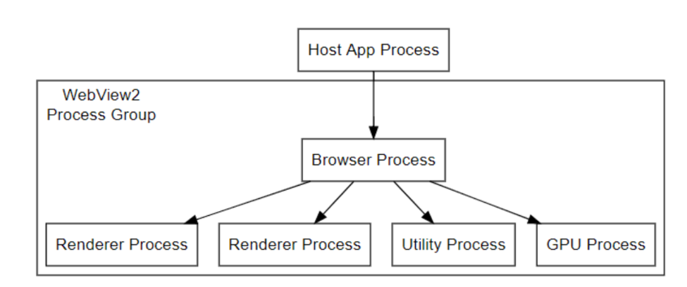
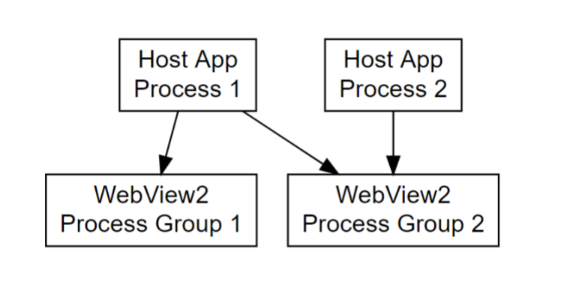

# Process model  

WebView2 uses the same process model as the Microsoft Edge browser. See [Inside look at modern web browser – Browser Architecture](https://developers.google.com/web/updates/2018/09/inside-browser-part1#browser-architecture) for more information on the browser process model.

There is a browser process with associated renderer processes and other utility processes as described in that article. Additionally, in the case of WebView2, there are host app calling processes using the WebView2.

There is one browser process per specified user data folder in a user session that will serve any WebView2 calling process that specifies that user data folder. This means one browser process may be serving multiple calling processes and one calling process may be using multiple browser processes.

A browser process will have some number of associated renderer processes. These are created as necessary to service potentially multiple frames in different WebView2s. The number of renderer processes varies based on the site isolation browser feature and the number of distinct disconnected origins rendered in associated WebView2s. The site isolation browser feature is described in the above article.

The `CoreWebView2Environment` represents a user data folder and browser process. The `CoreWebView2` doesn’t directly correspond to any one set of processes since various renderer processes will be used by a WebView2 depending on site isolation as described above.

You can react to crashes and hangs in these browser and renderer processes using the `CoreWebView2` `ProcessFailed` event.

You can safely shutdown associated browser and renderer processes using the CoreWebView2Controller Close method.

From the `DevTools` window of a WebView2 you can press `Shift+Escape` or right click the DevTools window title bar and select `Browser task manager` to open the Browser Task Manager window. This will display all processes associated with your WebView2’s browser process including their purpose.

# Threading model  

## Thread safety

The WebView2 must be created on a UI thread. Specifically a thread with a message pump. All callbacks will occur on that thread and calls into the WebView2 must be done on that thread. It is not safe to use the WebView2 from another thread.

The only exception is for the `CoreWebView2WebResourceRequest`’s `Content` property. The Content property stream will be read from a background thread. The stream should be agile or be created from a background STA to prevent performance impact to the UI thread.

## Reentrancy

Callbacks including event handlers and completion handlers execute serially. That is, if you have an event handler running and begin a message loop no other event handlers or completion callbacks will begin executing in a reentrant manner.

## Deferrals

Some WebView2 events will read values set on their event args or perform some action after the event handler completes. If you need to execute an asynchronous operation during such an event handler, you can use the `GetDeferral` method on the event args of such events. The returned Deferral object ensures the event handler is not considered complete until the Deferral’s Complete method is called.

For instance, via the `NewWindowRequested` event you may provide a `CoreWebView2` to be hooked up as a child window when the event handler completes. But if you need to asynchronously create the `CoreWebView2` you can first call `GetDeferral` on the `NewWindowRequestedEventArgs`. Once you have asynchronously created the `CoreWebView2` and set the `NewWindow` property on the `NewWindowRequestedEventArgs` you can call Complete on the Deferral object returned by `GetDeferral`.

<!-- links -->  
