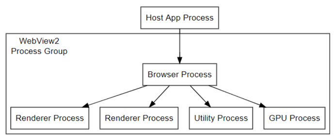
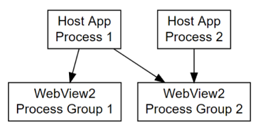

# Process model for WebView2 apps
<!-- old title: # The WebView2 process model -->

Supported platforms: Win32, Windows Forms, WinUI, WPF.

The WebView2 Runtime uses the same process model as the Microsoft Edge browser.  This browser process model is described at [Browser Architecture](https://developer.chrome.com/blog/inside-browser-part1/#browser-architecture) in _Inside look at modern web browser (part 1)_.

<!-- ====================================================================== -->
## Processes in the WebView2 Runtime

A _WebView2 process group_ is a collection of WebView2 Runtime processes.  A WebView2 process group includes the following:
*  A single browser process.
*  One or more renderer processes.
*  Other helper processes, such as the GPU process and the Audio service process.

The number and presence of processes in a WebView2 process group can change as a WebView2 application makes use of WebView2 features.  (However, there's only a single, specific browser process in a WebView2 process group.)  For example, creating a new WebView2 instance from the same `CoreWebView2Environment`, but with a different domain in the `Source` property, will usually start a new renderer process.

The number of renderer processes can vary based on the following conditions:

*  Use of the _Site Isolation_ feature in the WebView2 Runtime.  See [Per-frame renderer processes - Site Isolation](https://developer.chrome.com/blog/inside-browser-part1/#site-isolation).

*  The number of distinct disconnected origins that are rendered in instances of WebView2 that use the same user data folder.

The logic that controls when these extra processes are created depends on the Chromium architecture, and is beyond the scope of the WebView2 Runtime.

<!-- ====================================================================== -->
## WebView2 Runtime processes and the user data folder

All processes in a WebView2 Runtime processes collection are tied to the browser process, which in turn is associated with a single user data folder.  If an application makes use of multiple user data folders, a collection of WebView2 Runtime processes will be created for each of these user data folders.

A user data folder can be shared by multiple applications, but be sure to consider the implications on performance and management, as described in [Manage user data folders](user-data-folder.md).

To make use of multiple user data folders, a WebView2 application needs to create different `CoreWebView2Environment` objects.  A `WebView2` instance is created for a given user data folder through the configured `CoreWebView2Environment` object.  Each `CoreWebView2Environment` object needs to be configured with a different user data folder value.

When the first `WebView2` instance is created for a given user data folder, the browser process for the WebView2 Runtime processes collection that is associated with that user data folder will be started.  All additional processes will be managed by the lifetime of that browser process.

<!-- TODO: update with profile info -->
The `CoreWebView2Environment` represents a user data folder and the collection of processes associated with it.  A given renderer process is not associated with a single `CoreWebView2` instance, because the renderer process can serve frames in multiple `CoreWebView2` instances that use the same user data folder, depending on website isolation.  See [Per-frame renderer processes - Site Isolation](https://developers.google.com/web/updates/2018/09/inside-browser-part1#site-isolation).

#### Multiple environment objects

If you create multiple `CoreWebView2Environment` objects that are configured the same way (including sharing the same user data folder), they will represent the same user data folder and the same associated collection of processes. Use any of these `CoreWebView2Environment` objects to create a `CoreWebView2` with the one shared user data folder and associated collection of processes.

If you try to create a `CoreWebView2Environment` using a user data folder which another `CoreWebView2Environment` is already using, and you don't configure the two `CoreWebView2Environment` objects the same, for example if they were created with different `CoreWebView2EnvironmentOptions.Language` values, then the second `CoreWebView2Environment` will fail to create `WebView2` objects. This is true for `CoreWebView2Environment` objects that are in the same process or in different processes.

<!-- ====================================================================== -->
## Handling process events and lifetime

To react to crashes and hangs in the browser and renderer processes, use the `ProcessFailed` event of `CoreWebView2`.

<!-- todo: add info about the new APIs BrowserProcessExited and ProcessInfo -->

To safely shut down associated browser and renderer processes, use the `Close` method of `CoreWebView2Controller`.

To open the **Browser Task Manager**, call the `OpenTaskManagerWindow` method.

<!-- ------------------------------ -->

# [C#](#tab/csharp)

[OpenTaskManagerWindow](/dotnet/api/microsoft.web.webview2.core.corewebview2.opentaskmanagerwindow#microsoft-web-webview2-core-corewebview2-opentaskmanagerwindow)

<!-- ------------------------------ -->

# [C++](#tab/cpp)

[OpenTaskManagerWindow](/microsoft-edge/webview2/reference/win32/icorewebview2_6#opentaskmanagerwindow)

---

<!-- end of tab-set -->

All processes that are associated with the browser process of your WebView2 are displayed, including their associated purposes.

<!-- ====================================================================== -->
## See also

* [Inside look at modern web browser (part 1)](https://developer.chrome.com/blog/inside-browser-part1/#browser-architecture) - the browser process model that's used by the WebView2 Runtime and the Microsoft Edge browser.
* [Get started with WebView2](../get-started/get-started.md)
* [WebView2Samples repo](https://github.com/MicrosoftEdge/WebView2Samples) - a comprehensive example of WebView2 capabilities.
* [WebView2 API reference](/dotnet/api/microsoft.web.webview2.wpf.webview2)
