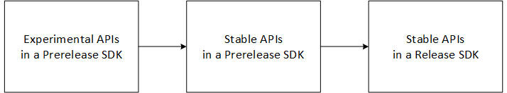

# Prerelease and Release SDKs for WebView2

The WebView2 SDK is provided as a Prerelease or Release version of the **Microsoft.Web.WebView2** NuGet package.  Either use a Prerelease SDK with a preview channel of Microsoft Edge, or use a Release SDK with the WebView2 Runtime.

_Prerelease_ SDK packages are for use during development if you want to test the latest WebView2 APIs, including the Experimental APIs, before support for those APIs is added to the Runtime.  The Canary channel is recommended, because it has the implementations of the latest APIs.  When you want to test and use Experimental WebView2 APIs, use the following combination:
*  A _Prerelease_ version of the WebView2 SDK.
*  A _preview channel_ of Microsoft Edge on your development client.

_Release_ SDK packages only contain Stable APIs, not Experimental APIs.  When you're working on a production release of your WebView2 app, use the following combination:
*  A _Release_ version of the WebView2 SDK.
*  The WebView2 _Runtime_ on your development client.

More details about the Prerelease and Release SDK packages are provided below.

<!-- ------------------------------ -->
#### Phases of introducing APIs

New APIs are introduced in phases as follows:

| API status | Description |
|---|---|
| _Experimental_ | 1. First an API is Experimental in a Prerelease SDK.  You can test these APIs and provide feedback.  The API isn't in a Release SDK yet. |
| _Stable in a Prerelease SDK_ | 2. Then the API is promoted to Stable in the Prerelease SDK.  The API isn't in a Release SDK yet. |
| _Stable in a Release SDK_ | 3. Then the Stable API is promoted to be included in the Release SDK.  This typically happens 1 month after the API is promoted to Stable in a Prerelease SDK.  The API also remains in the Prerelease SDK. |

<!-- .png is used by webview2/release-notes/about.md and webview2/concepts/versioning.md -->

<!-- terminology:
APIs are Experimental or Stable
SDKs/packages are Prerelease or Release
-->

<!-- ------------------------------ -->
#### Selecting which type of SDK to use

To select which version of WebView2 SDK NuGet package a Visual Studio project uses, in Visual Studio, right-click a project, select **Manage NuGet Packages**, select or clear the **Include prerelease** checkbox, select the **Microsoft.Web.WebView2** package, and then in the **Version** dropdown list, select a version of the **Microsoft.Web.WebView2** NuGet package.

For details, see [Install or update the WebView2 SDK](../how-to/machine-setup.md#install-or-update-the-webview2-sdk) in _Set up your Dev environment for WebView2_.  You can also view the list of [Microsoft.Web.WebView2](https://www.nuget.org/packages/Microsoft.Web.WebView2) SDK packages at the NuGet site.

<!-- ====================================================================== -->
## Use a Prerelease version of the SDK along with a preview channel of Microsoft Edge

When developing an Evergreen WebView2 app, regularly test the app against the latest Microsoft Edge preview channel, in addition to testing against the WebView2 Runtime.  Because the web platform is constantly evolving, regular testing is the best way to ensure your app will continue to work as intended.

When you use a WebView2 _Prerelease_ SDK package, use a Microsoft Edge preview channel on your development client.  Preview channels are also called _Insiders_ channels.  The Canary preview channel is recommended rather than Beta or Dev, because Canary is most recent and has implementations of the latest Experimental APIs.

The Prerelease SDK package is a superset of the Release SDK package.  A Prerelease SDK contains method signatures for:
*  [Experimental APIs](#experimental-apis).
*  Stable APIs that are no longer Experimental, but haven't been included in a Release SDK yet.
*  Stable APIs that have been added to Release SDKs.

Preview channels of Microsoft Edge provide the implementations of Experimental WebView2 APIs and of Stable APIs.  The Experimental APIs are subject to change based on feedback.  Avoid using a Prerelease SDK package to build production apps.

For information about temporarily pointing your app to a preview channel instead of defaulting to the WebView2 Runtime, see [Test upcoming APIs and features](../how-to/set-preview-channel.md).

See also:
* [Prerelease testing using preview channels](../how-to/prerelease-testing.md)
* [Self-host by deploying preview channels](../how-to/self-hosting.md)

<!-- ====================================================================== -->
## Use a release version of the SDK along with the Runtime

When you use a WebView2 Release SDK package, use the Evergreen WebView2 _Runtime_ on your development client, rather than a Microsoft Edge preview channel.  By default, a WebView2 app targets the Runtime rather than Microsoft Edge.  By design, the Microsoft Edge Stable channel doesn't support WebView2.

The Release SDK package contains all of the Stable Win32 C/C++ and .NET APIs that are in production release, and doesn't include method signatures for Experimental APIs.  All of the APIs that are in a Release SDK package are fully supported, in an equal or higher build number of the WebView2 Runtime.

The Release SDK package contains the following components:
*  [Win32 C/C++ APIs](/microsoft-edge/webview2/reference/win32).
*  .NET APIs:  [WPF](/dotnet/api/microsoft.web.webview2.wpf), [WinForms](/dotnet/api/microsoft.web.webview2.winforms), and [Core](/dotnet/api/microsoft.web.webview2.core).

For more information about automatic updating of the Evergreen Runtime, see [Distribute your app and the WebView2 Runtime](distribution.md).

<!-- ====================================================================== -->
## Release cadence

New versions of the WebView2 SDK are shipped at the same general cadence as the Microsoft Edge browser, which is approximately every four weeks.

<!-- ====================================================================== -->
## Minimum version and build number to instantiate WebView2

For the client to be able to create a WebView2 instance and use the set of APIs in the WebView2 General Availability release (SDK build 616), the client must have WebView2 Runtime version 86.0.616.0 or higher.  Runtime 86.0.616.0 is a special release, because it is the General Availability release.

On a development machine, the client must have either the Microsoft Edge preview channel version 86.0.616.0 or higher, or the WebView2 Runtime version 86.0.616.0 or higher.

<!-- ====================================================================== -->
## Forward compatibility of APIs

The WebView2 _release_ SDK has been forward-compatible ever since version 1 (Release SDK [1.0.622.22](../release-notes/archive.md#1062222) in _Archived Release Notes for the WebView2 SDK_).  You can update your WebView2 app to use the latest APIs from the most recent Release version of the SDK.  Your app will continue to work on clients because clients automatically have the latest Evergreen WebView2 Runtime.

The WebView2 APIs in a Release SDK package are stable and forward-compatible.  A WebView2 API works when using a WebView2 Runtime that has an equal or higher build number as the SDK build number in which the API was introduced.  The build number is the third part of the four-part version number for the Webview2 SDK, and of the four-part version number for Microsoft Edge and the WebView2 Runtime.

*  When you use a WebView2 SDK that has a build number _equal to or less than_ the WebView2 Runtime, every API that you have access to in that SDK works with that version of the Runtime.

*  When you use a WebView2 SDK that has a build number _greater than_ the WebView2 Runtime, the newer APIs' implementations aren't available in the Runtime.

<!-- create diagram showing 3 SDK releases on a timeline, which ones would work w/ a given runtime -->
For example, if an API is introduced in SDK 1.0.**900**.0, that API would work with Runtime 94.0.**900+**.0, but not with Runtime 90.0.**700**.0.

<!-- dup statements, delete? -->
You must coordinate the WebView2 SDK version that you use for development, and the WebView2 Runtime version that's installed on client machines.
The client should have a version of the Runtime that supports all of the latest APIs that are in the SDK version you use to develop the app.
For full support for the latest APIs in a release version of the SDK, the Runtime on the client must have a build number that's greater than or equal to the SDK build number.

<!-- ====================================================================== -->
## Experimental APIs

To try out new forthcoming features that are in development, use _Experimental_ APIs.  Experimental APIs are contained in Prerelease SDKs, but not in Release SDKs.

<!-- ------------------------------ -->
#### Developing with Experimental APIs and providing feedback

The Experimental APIs in a WebView2 Prerelease SDK package aren't guaranteed to be forward-compatible, and might be removed in future Runtime updates.

For full support of Experimental APIs, use a Microsoft Edge preview channel, not the Evergreen WebView2 Runtime.  When a Prerelease version of the WebView2 SDK is initially made available, that SDK only works with Microsoft Edge Canary.  Soon after that, the Prerelease SDK also works with the Beta and Dev channels.

Use a Prerelease SDK to try out new, Experimental APIs early and provide feedback before the Experimental APIs are promoted to become Stable, forward-compatible APIs.

*  The Experimental APIs (in a Prerelease SDK) aren't guaranteed to be forward-compatible.
*  The Stable APIs that are in a Prerelease SDK are forward-compatible, even if they aren't included in a Release SDK yet.
*  The Stable APIs that are in a Release SDK are forward-compatible.

For more information, see [Forward compatibility of APIs](#forward-compatibility-of-apis), above.

The WebView2 team is seeking feedback on Experimental WebView2 APIs that might be promoted to Stable in future releases.  The Experimental APIs are indicated as "experimental" in the WebView2 SDK Reference documentation, such as: "Note: This an experimental API that is shipped with our prerelease SDK."

To help you evaluate the Experimental APIs and share your feedback, use the [WebView2Feedback](https://github.com/MicrosoftEdge/WebViewFeedback) repo.

<!-- ------------------------------ -->
#### Moving from Experimental APIs to Stable APIs

Once an API has been moved from Experimental to Stable status, you need to move your app's code to the Stable API.  Using Experimental APIs or a Prerelease SDK is not recommended for production apps.  Follow these practices when moving your app from using Experimental APIs to using Stable APIs:

*  In your project in Visual Studio, update your WebView2 SDK package version to a newer Prerelease SDK or Release SDK.  See [Install or update the WebView2 SDK](../how-to/machine-setup.md#install-or-update-the-webview2-sdk) in _Set up your Dev environment for WebView2_.

*  Update your app's code to use Stable APIs instead of Experimental APIs (for COM).  The Stable API will be supported with bug fixes, but the Experimental API will be deprecated, and not available in the newer (Prerelease or Release) SDK.  After an API is promoted to Stable, the Experimental version of that API is supported for two releases of the Prerelease SDK, in a deprecated state.  In subsequent versions of the Prerelease SDK, Experimental APIs might be modified, removed, or added.

*  Always use feature detection, to ensure that the Stable API is implemented in the user's version of the WebView2 Runtime.  See [Feature-detecting to test whether the installed Runtime supports recently added APIs](#feature-detecting-to-test-whether-the-installed-runtime-supports-recently-added-apis), below.

*  Note for .NET only: In a Prerelease WebView2 SDK, the .NET Stable APIs will fallback to the corresponding Experimental APIs, if the user's WebView2 Runtime has only the Experimental API implementation and doesn't have the Stable API implementation.

<!-- ====================================================================== -->
## Matching the Runtime version with the SDK version

In the Evergreen distribution approach, the client's WebView2 Runtime automatically updates to the latest version available.  However, a user or IT admin might choose to prevent automatic updating of the WebView2 Runtime.  The resulting outdated Runtime on the client might cause compatibility issues with your updated WebView2 app that uses new APIs from a recent SDK.

In case updating the WebView2 Runtime is prevented on the client, make sure that you know the minimum build number of the WebView2 Runtime that is required by your app.  To view or get the latest WebView2 Runtime versions, see [Download the WebView2 Runtime](https://developer.microsoft.com/microsoft-edge/webview2/#download-section) in the _Microsoft Edge WebView2_ page at developer.microsoft.com.  The minimum required Runtime version to support the General Availability release of the SDK (build 616) is older than for the latest Runtime.  The latest Runtime supports all APIs that are in the latest Release SDK.

To check the compatibility between specific build numbers of the SDK and the Runtime or Microsoft Edge preview channel, see [Release Notes for the WebView2 SDK](../release-notes/index.md).

<!-- ====================================================================== -->
## Feature-detecting to test whether the installed Runtime supports recently added APIs

If your app uses the Evergreen Runtime rather than Fixed Version, you should wrap any calls to relatively new WebView2 APIs by using `QueryInterface` or `try-catch`.  There are edge cases where a client's Evergreen Runtime isn't the latest build and therefore falls behind the SDK build number, because the Admin might have turned off updating of the WebView2 Runtime, or the client might be offline.

When you develop a WebView2 app using a recent version of the WebView2 SDK, if you use a recently added API, you should test or "feature-detect" whether that API is present in the client's installed WebView2 Runtime.  How your app programmatically tests for API support depends on the coding platform.

*  **Win32 C/C++**.  When requesting the DLL export `CreateCoreWebView2Environment` and when running `QueryInterface` on any `CoreWebView2` object, test for a return value of `E_NOINTERFACE`.  That return value likely indicates that the client's WebView2 Runtime is an older version that doesn't support that interface.

   For an example of checking for the existence of specific WebView2 APIs in the Runtime, find `try_query` in [AppWindow.cpp](https://github.com/MicrosoftEdge/WebView2Samples/blob/8ec7de9d3e80a942bc7025cffad98eee75e11e64/SampleApps/WebView2APISample/AppWindow.cpp#L622).  This file wraps WebView2 API calls in the `CHECK_FAILURE` macro function, defined in `CheckFailure.h`.

*  **.NET and WinUI**.  Use `try/catch` and check for a `No such interface supported` exception when using methods, properties, and events that were added to more recent versions of the WebView2 SDK.  This exception likely indicates that the client's WebView2 Runtime is an older version that doesn't support that API.

If your code determines that an API is unavailable in the client's installed WebView2 Runtime, you should provide graceful fallback for the associated feature, or inform the user that they must update the WebView2 Runtime to use the feature.
