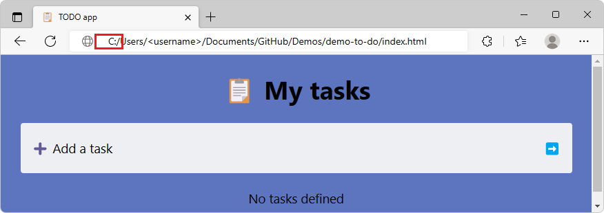
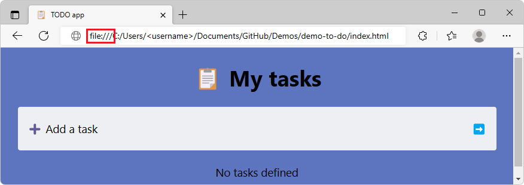
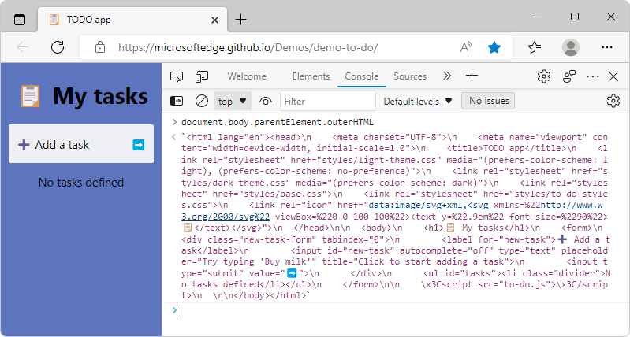

# Working with local content in WebView2 apps

In addition to loading remote content, content can also be loaded locally into WebView2.  There are several approaches that can be used to load local content into a WebView2 control, including: 
* Navigating to a file URL.
* Navigating to an HTML string.
* Virtual host name mapping.
* Handling the `WebResourceRequested` event.

These approaches are described below.


<!-- ====================================================================== -->
## Selecting an approach

The various ways of loading local content into a WebView2 control support the following scenarios:

| Scenario | By navigating to a file URL | By navigating to an HTML string | By using virtual host name mapping | By using `WebResourceRequested` |
| --- |:---:|:---:|:---:|:---:|
| Origin-based DOM APIs | ✔️ | ❌ | ✔️ | ✔️ |
| DOM APIs requiring secure context | ❌ | ❌ | ✔️ | ✔️ |
| Dynamic content | ❌ | ✔️ | ❌ | ✔️ |
| Additional web resources | ✔️ | ❌ | ✔️  | ✔️ |
| Additional web resources resolved in WebView2 process | ✔️ | ❌ | ✔️ | ❌ |


These scenarios are described in more detail below.


<!-- ====================================================================== -->
## Loading local content by navigating to a file URL

WebView2 allows navigations to file URLs, to load basic HTML or a PDF.  This is the simplest and most efficient approach to loading local content.  However, it is less flexible than the other approaches.  Like in a web browser, file URLs are limited in some capabilities:

*  The document has an origin that is unique to its file path. This means that web APIs that require an origin such as `localStorage` or `indexedDB` will work, but the stored data will not be available to other local documents loaded from other file paths.

*  Some web APIs are limited to secure HTTPS URLs only and are not available to documents loaded by file URLs. This includes APIs such as `navigator.mediaDevices.getUserMedia()` to acquire video or sound, `navigator.geolocation.getCurrentPosition()` to access the device's location, or `Notification.requestPermission()` to request the user's permission to display notifications.

*  For each resource, the full path must be specified.

*  To allow references to other local files from file URIs, or to display XML files with XSL transformations applied, you can set the `--allow-file-access-from-files` browser argument.  See [CoreWebView2EnvironmentOptions.AdditionalBrowserArguments Property](/dotnet/api/microsoft.web.webview2.core.corewebview2environmentoptions.additionalbrowserarguments).


<!-- ------------------------------ -->
#### Considerations for loading local content by navigating to a file URL

File URLs behave like they do in the browser.  For example, you can't make an `XMLHttpRequest` (XHR) in a file URL, because you're not working in the context of a webpage.

You must specify the full path of the file, for every resource.  For example:

```
file:///C:/Users/username/Documents/GitHub/Demos/demo-to-do/index.html
```


###### Cross-origin resources

When specifying a file URL, the app navigates to a file on disk, not to a domain on the network. As a result, it's not possible to use cross-origin resources in the resulting document.


###### Origin-based DOM APIs

A document loaded via a file URL has an origin that is unique to its file path, just like in the browser. Web APIs that require an origin such as `localStorage` or `indexedDB` will work. However, different documents loaded from different file URLs are not considered to be from the same origin, and will not have access to the same stored data.


###### DOM APIs requiring secure context

Some web APIs are limited to secure HTTPS URLs only and are not available to documents loaded by file URLs. This includes APIs such as `navigator.mediaDevices.getUserMedia()` to acquire video or sound, `navigator.geolocation.getCurrentPosition()` to access the device's location, or `Notification.requestPermission()` to request the user's permission to display notifications. See [Secure contexts](https://developer.mozilla.org/docs/Web/Security/Secure_Contexts) on MDN for more information.


###### Dynamic content

When loading a document via a file URL, the document's content comes from a static files on disk. This means that it's not possible to dynamically modify this local content. This is different from loading documents from a web server, where each response can be dynamically generated.


###### Additional web resources

Relative URL resolution also work for documents loaded via a file URL. This means that the loaded document can have references to additional web resources such as CSS, script, or image files which are also served via file URLs.


###### Additional web resources resolved in WebView2 process

File URLs are resolved in WebView2 processes. This is a faster option than `WebResourceRequested`, which resolves in the host app process UI thread.


<!-- ------------------------------ -->
#### APIs for loading local content by navigating to a file URL

##### [.NET/C#](#tab/dotnetcsharp)

* [CoreWebView2.Navigate Method](/dotnet/api/microsoft.web.webview2.core.corewebview2.navigate)

##### [WinRT/C#](#tab/winrtcsharp)

* [CoreWebView2.Navigate Method](/microsoft-edge/webview2/reference/winrt/microsoft_web_webview2_core/corewebview2#navigate)

##### [Win32/C++](#tab/win32cpp)

* [ICoreWebView2::Navigate method](/microsoft-edge/webview2/reference/win32/icorewebview2#navigate)

---


<!-- ------------------------------ -->
#### Example of a file URL

This section shows what a file URL looks like for a local content file path in a platform-independent way.

A WebView2 app needs to code local file URLs using a `file:///` prefix and forward slashes.  For example, for the Demo To Do example, the path would be:

```
file:///C:/Users/username/Documents/GitHub/Demos/demo-to-do/index.html
```

To copy the full path with "file" prefix for a local file:

1. Optionally, clone the Demos repo so you have a local copy.  See [Step 5: Clone the Demos repo](../../visual-studio-code/microsoft-edge-devtools-extension/install.md#step-5-clone-the-demos-repo) in _Installing the DevTools extension for Visual Studio Code_.

1. In Microsoft Edge, press **Ctrl+O** to open a file.  Open a local `.html` file, such as the locally cloned file `Demos/demo-to-do/index.html`:

   `C:\Users\username\Documents\GitHub\Demos\demo-to-do\index.html`

   The Address bar doesn't initially show the `file:///` prefix, but starts with the drive letter:

   ```
   C:/Users/username/Documents/GitHub/Demos/demo-to-do/index.html
   ```

   

1. Click the Address bar and then press the **Home** key, or press **Ctrl+A** to select the entire path.

   

   The entire file path including `file:///` is copied into the clipboard buffer, so you can paste the full path including the `file:///` prefix:

   ```
   file:///C:/Users/username/Documents/GitHub/Demos/demo-to-do/index.html
   ```

See also:
* [Demo To Do - rendered page](https://microsoftedge.github.io/Demos/demo-to-do/)
* [Demo To Do - source code](https://github.com/MicrosoftEdge/Demos/tree/main/demo-to-do)
* [Step 5: Clone the Demos repo](../../visual-studio-code/microsoft-edge-devtools-extension/install.md#step-5-clone-the-demos-repo) in _Installing the DevTools extension for Visual Studio Code_.


<!-- ------------------------------ -->
#### Example of navigating to a file URL

##### [.NET/C#](#tab/dotnetcsharp)

```csharp
webView.CoreWebView2.Navigate(
          "file:///C:/Users/username/Documents/GitHub/Demos/demo-to-do/index.html");
```

##### [WinRT/C#](#tab/winrtcsharp)

```csharp
webView.CoreWebView2.Navigate(
          "file:///C:/Users/username/Documents/GitHub/Demos/demo-to-do/index.html");
```

##### [Win32/C++](#tab/win32cpp)

```cpp
webView->Navigate(
         L"file:///C:/Users/username/Documents/GitHub/Demos/demo-to-do/index.html");
```

---


<!-- ====================================================================== -->
## Loading local content by navigating to an HTML string

Another method to load local content is the `NavigateToString` method.  This approach loads the content into WebView2 directly from a string.  This can be useful if you will be packaging the content via the app code, or if you'd like to dynamically create the content.

Another scenario where navigating to a string might be useful is if you want to load content that is not accessible via a URL. For example, if you have an in-memory representation of an HTML document, you could use the `NavigateToString` method to load that content into the WebView2 control.  This can be useful if you want to avoid the need to write the content to a file or server before loading it into the control.


<!-- ------------------------------ -->
#### Considerations for loading local content by navigating to an HTML string

The HTML content string that's passed into the `NavigateToString` method has a size limit of 2MB.  This size limit may be easy to exceed, when the string includes inlined additional resources.  If this size limit is exceeded, an error is returned: "Value does not fall within the expected range".


###### Origin-based DOM APIs

A document loaded by using the `NavigateToString` method has its location set to `about:blank` and its origin set to `null`. This means that web APIs that depend on an origin being defined, such as `localStorage` or `indexedDB`, can't be used.


###### DOM APIs requiring secure context

Some web APIs are limited to secure HTTPS URLs only and are not available to documents loaded via the `NavigateToString` method because their location is set to `about:blank`. This includes APIs such as `navigator.mediaDevices.getUserMedia()` to acquire video or sound, `navigator.geolocation.getCurrentPosition()` to access the device's location, or `Notification.requestPermission()` to request the user's permission to display notifications. See [Secure contexts](https://developer.mozilla.org/docs/Web/Security/Secure_Contexts) on MDN for more information.


###### Dynamic content

When loading local content via the `NavigateToString` method, you're directly providing the content as a parameter to the method. This means you are in control of the content at runtime, and you can dynamically generate it if needed.


###### Additional web resources

Loading local content by using the `NavigateToString` method doesn't make it possible for the resulting document to reference additional web resources such as CSS, image, or script files. The method only lets you specify the string content of the HTML document. To reference additional web resources from your HTML document, use one of the other approaches described in this article, or represent those additional web resources inline in the HTML document.


###### Additional web resources resolved in WebView2 process

`NavigateToString` does not support additional web resources, as mentioned above.


<!-- ------------------------------ -->
#### APIs for loading local content by navigating to an HTML string

##### [.NET/C#](#tab/dotnetcsharp)

* [CoreWebView2.NavigateToString Method](/dotnet/api/microsoft.web.webview2.core.corewebview2.navigatetostring)

##### [WinRT/C#](#tab/winrtcsharp)

* [CoreWebView2.NavigateToString Method](/microsoft-edge/webview2/reference/winrt/microsoft_web_webview2_core/corewebview2#navigatetostring)

##### [Win32/C++](#tab/win32cpp)

* [ICoreWebView2::NavigateToString method](/microsoft-edge/webview2/reference/win32/icorewebview2#navigatetostring)

---


<!-- ------------------------------ -->
#### Example string representation of a webpage

The following is the string representation of the **Demo To Do** webpage.  The listing below has added line wrapping for readability.  In practice, these lines are concatenated into a single long line:

```html
`<html lang="en"><head>\n    
<meta charset="UTF-8">\n    
<meta name="viewport" content="width=device-width, initial-scale=1.0">\n    
<title>TODO app</title>\n    
<link rel="stylesheet" href="styles/light-theme.css" media="(prefers-color-scheme: light), (prefers-color-scheme: no-preference)">\n    
<link rel="stylesheet" href="styles/dark-theme.css" media="(prefers-color-scheme: dark)">\n    
<link rel="stylesheet" href="styles/base.css">\n    
<link rel="stylesheet" href="styles/to-do-styles.css">\n    
<link rel="icon" href="data:image/svg+xml,<svg xmlns=%22http://www.w3.org/2000/svg%22 viewBox=%220 0 100 100%22><text y=%22.9em%22 font-size=%2290%22>📋
</text></svg>">\n  
</head>\n\n  
<body>\n    
<h1>📋 My tasks</h1>\n    
<form>\n      
<div class="new-task-form" tabindex="0">\n        
<label for="new-task">➕ Add a task</label>\n        
<input id="new-task" autocomplete="off" type="text" placeholder="Try typing 'Buy milk'" title="Click to start adding a task">\n        
<input type="submit" value="➡️">\n      
</div>\n      
<ul id="tasks"><li class="divider">No tasks defined</li></ul>\n    
</form>\n\n    \x3Cscript src="to-do.js">\x3C/script>\n  \n\n
</body>
</html>`
```

To obtain the above string:

1. Go to [Demo To Do](https://microsoftedge.github.io/Demos/demo-to-do/).

1. Right-click the webpage and then select **Inspect** to open DevTools.

1. In the **Console** of DevTools, enter: `document.body.parentElement.outerHTML`.  The **Console** outputs a string representation of the webpage:

   


<!-- ------------------------------ -->
#### Example of navigating to an HTML string


##### [.NET/C#](#tab/dotnetcsharp)

```csharp
// Define htmlString with the string representation of HTML as above.
webView.CoreWebView2.NavigateToString(htmlString);
```

##### [WinRT/C#](#tab/winrtcsharp)

```csharp
// Define htmlString with the string representation of HTML as above.
webView.CoreWebView2.NavigateToString(htmlString);
```

##### [Win32/C++](#tab/win32cpp)

```cpp
// Define htmlString with the string representation of HTML as above.
webView->NavigateToString(htmlString);
```

---


<!-- ====================================================================== -->
## Loading local content by using virtual host name mapping

Another way to load local content in a WebView2 control is to use virtual host name mapping.  This involves mapping a local domain name to a local folder, so that when the WebView2 control attempts to load a resource for that domain, it will load the content from the specified local folder location instead. The origin of the document will also be the virtual host name. 

This approach lets you specify the cross-origin access, by using the `CoreWebView2HostResourceAccessKind` enum.

Due to a current limitation, media files that are accessed using a virtual host name can be slow to load.<!-- when limitation is fixed, remove sentence -->


<!-- ------------------------------ -->
#### Considerations for loading local content by using virtual host name mapping


###### Origin-based DOM APIs

Local content loaded via virtual host name mapping results in a document that has an HTTP or HTTPS URL and a corresponding origin. This means that web APIs that require an origin such as `localStorage` or `indexedDB` will work, and other documents that belong to the same origin will be able to use the stored data. For more information, see [Same-origin policy](https://developer.mozilla.org/docs/Web/Security/Same-origin_policy) on MDN.


###### DOM APIs requiring secure context

Some web APIs are limited to secure HTTPS URLs only. Using virtual host name mapping provides an HTTPS URL for your local content. This means that APIs such as `navigator.mediaDevices.getUserMedia()` to acquire video or sound, `navigator.geolocation.getCurrentPosition()` to access the device's location, or `Notification.requestPermission()` to request the user's permission to display notifications are available. See [Secure contexts](https://developer.mozilla.org/docs/Web/Security/Secure_Contexts) on MDN for more information.


###### Dynamic content

When loading local content via a virtual host name mapping, you are mapping a virtual host name to a local folder that contains static files on disk. This means that it's not possible to dynamically modify this local content. This is different from loading documents from a web server, where each response can be dynamically generated.


###### Additional web resources

Local content that's loaded via virtual host name mapping has an HTTP or HTTPS URL which supports relative URL resolution. This means that the loaded document can have references to additional web resources such as CSS, script, or image files which are also served via virtual host name mapping.


###### Additional web resources resolved in WebView2 process

Virtual host name URLs are resolved in WebView2 processes. This is a faster option than `WebResourceRequested`, which resolves in the host app process UI thread.


<!-- ------------------------------ -->
#### APIs for loading local content by using virtual host name mapping


##### [.NET/C#](#tab/dotnetcsharp)

* [CoreWebView2.SetVirtualHostNameToFolderMapping Method](/dotnet/api/microsoft.web.webview2.core.corewebview2.setvirtualhostnametofoldermapping)
* [CoreWebView2.ClearVirtualHostNameToFolderMapping Method](/dotnet/api/microsoft.web.webview2.core.corewebview2.clearvirtualhostnametofoldermapping)
* [CoreWebView2HostResourceAccessKind Enum](/dotnet/api/microsoft.web.webview2.core.corewebview2hostresourceaccesskind)

##### [WinRT/C#](#tab/winrtcsharp)

* [CoreWebView2.SetVirtualHostNameToFolderMapping Method](/microsoft-edge/webview2/reference/winrt/microsoft_web_webview2_core/corewebview2#setvirtualhostnametofoldermapping)
* [CoreWebView2.ClearVirtualHostNameToFolderMapping Method](/microsoft-edge/webview2/reference/winrt/microsoft_web_webview2_core/corewebview2#clearvirtualhostnametofoldermapping)
* [CoreWebView2HostResourceAccessKind Enum](/microsoft-edge/webview2/reference/winrt/microsoft_web_webview2_core/corewebview2hostresourceaccesskind)

##### [Win32/C++](#tab/win32cpp)

* [ICoreWebView2_3::SetVirtualHostNameToFolderMapping method](/microsoft-edge/webview2/reference/win32/icorewebview2_3#setvirtualhostnametofoldermapping)
* [ICoreWebView2_3::ClearVirtualHostNameToFolderMapping method](/microsoft-edge/webview2/reference/win32/icorewebview2_3#clearvirtualhostnametofoldermapping)
* [COREWEBVIEW2_HOST_RESOURCE_ACCESS_KIND enum](/microsoft-edge/webview2/reference/win32/icorewebview2#corewebview2_host_resource_access_kind)

---


<!-- ------------------------------ -->
#### Example of virtual host name mapping


##### [.NET/C#](#tab/dotnetcsharp)

```csharp
webView.CoreWebView2.SetVirtualHostNameToFolderMapping("demo", 
         "C:\Github\Demos\demo-to-do", CoreWebView2HostResourceAccessKind.DenyCors);
webView.CoreWebView2.Navigate("https://demo/index.html");
```

##### [WinRT/C#](#tab/winrtcsharp)

```csharp
Windows.Storage.StorageFolder storageFolder = 
                              Windows.Storage.ApplicationData.Current.LocalFolder;
Windows.Storage.StorageFolder demo = await storageFolder.GetFolderAsync("Demo");
webView.CoreWebView2.SetVirtualHostNameToFolderMapping("demo", demo.Path, 
                                     CoreWebView2HostResourceAccessKind.DenyCors);
webView.CoreWebView2.Navigate("https://demo/index.html");
```

##### [Win32/C++](#tab/win32cpp)

```cpp
webView->SetVirtualHostNameToFolderMapping(L"demo", L"C:\\Github\\Demos\\demo-to-do", 
                                  COREWEBVIEW2_HOST_RESOURCE_ACCESS_KIND_DENY_CORS);
webView->Navigate(L"https://demo/index.html");
```

---


<!-- ====================================================================== -->
## Loading local content by handling the WebResourceRequested event

Another way you can host local content in a WebView2 control is by relying on the `WebResourceRequested` event.  This event is triggered when the control attempts to load a resource.  You can use this event to intercept the request and provide the local content, as described in [Custom management of network requests](../how-to/webresourcerequested.md).

`WebResourceRequested` allows you to customize the behavior of local content on a per-request basis. This means you can decide which requests to intercept and provide your own content for, and which requests to let the WebView2 control handle normally.  However, customizing the behavior requires more code, such as virtual host mapping, and requires knowledge of HTTP, to be able to construct a proper response. 

From WebView2's perspective, the resource will have come via the network, and WebView2 will adhere to the headers that are set by the app as part of the response. Using the `WebResourceRequested` event is also slower than other approaches, due to the cross-process communication and processing that's needed for each request.


<!-- ------------------------------ -->
#### Custom scheme registration

If you want to use a custom scheme to make the Web Resource Request that generates the `WebResourceRequested` event, see [Custom scheme registration](./overview-features-apis.md#custom-scheme-registration) in _Overview of WebView2 features and APIs_.


<!-- ------------------------------ -->
#### Considerations for loading local content by handling the WebResourceRequested event


###### Origin-based DOM APIs

Local content loaded via `WebResourceRequested` results in a document that has an HTTP or HTTPS URL and a corresponding origin. This means that web APIs that require an origin such as `localStorage` or `indexedDB` will work, and other documents that belong to the same origin will be able to use the stored data. For more information, see [Same-origin policy](https://developer.mozilla.org/docs/Web/Security/Same-origin_policy) on MDN.


###### DOM APIs requiring secure context

Some web APIs are limited to secure HTTPS URLs only. Using `WebResourceRequested` allows you to replace HTTPS URL web resource requests with your own local content. This means that APIs such as `navigator.mediaDevices.getUserMedia()` to acquire video or sound, `navigator.geolocation.getCurrentPosition()` to access the device's location, or `Notification.requestPermission()` to request the user's permission to display notifications are available. See [Secure contexts](https://developer.mozilla.org/docs/Web/Security/Secure_Contexts) on MDN for more information.


###### Dynamic content

When loading local content via `WebResourceRequested`, you specify the local content to load in your event handler. This means you are in control of the content at runtime, and you can dynamically generate it if needed.


###### Additional web resources

`WebResourceRequested` modifies the content that's loaded via HTTP or HTTPS URLs, which support relative URL resolution. This means that the resulting document can have references to additional web resources such as CSS, script, or image files that are also served via `WebResourceRequested`.


###### Additional web resources resolved in WebView2 process

When loading content via a file URL or a virtual host name mapping, the resolution happens in the WebView2 processes. However, the `WebResourceRequested` event is raised on the WebView2 UI thread of your host app process, which may lead to slower loading of the resulting document.

1. WebView2 first pauses loading the web page in order to wait for the event to be sent to your host app process.
1. WebView2 then waits for your UI thread to be available.
1. WebView2 then waits for your app code to handle the event.

This can take some time. Make sure to limit calls to `AddWebResourceRequestedFilter` to only the web resources that must raise the `WebResourceRequested` event.


<!-- ------------------------------ -->
#### APIs for loading local content by handling the WebResourceRequested event


##### [.NET/C#](#tab/dotnetcsharp)

* [CoreWebView2.NavigateWithWebResourceRequest Method](/dotnet/api/microsoft.web.webview2.core.corewebview2.navigatewithwebresourcerequest)
* [CoreWebView2.WebResourceRequested Event](/dotnet/api/microsoft.web.webview2.core.corewebview2.webresourcerequested)

##### [WinRT/C#](#tab/winrtcsharp)

* [CoreWebView2.NavigateWithWebResourceRequest Method](/microsoft-edge/webview2/reference/winrt/microsoft_web_webview2_core/corewebview2#navigatewithwebresourcerequest)
* [CoreWebView2.WebResourceRequested Event](/microsoft-edge/webview2/reference/winrt/microsoft_web_webview2_core/corewebview2#webresourcerequested)

##### [Win32/C++](#tab/win32cpp)

* [ICoreWebView2_2::NavigateWithWebResourceRequest method](/microsoft-edge/webview2/reference/win32/icorewebview2_2#navigatewithwebresourcerequest)
* [ICoreWebView2::WebResourceRequested event (add](/microsoft-edge/webview2/reference/win32/icorewebview2#add_webresourcerequested), [remove)](/microsoft-edge/webview2/reference/win32/icorewebview2#remove_webresourcerequested)

---


<!-- ------------------------------ -->
#### Example of handling the WebResourceRequested event


##### [.NET/C#](#tab/dotnetcsharp)

```csharp
// Reading of response content stream happens asynchronously, and WebView2 does not 
// directly dispose the stream once it read.  Therefore, use the following stream
// class, which properly disposes when WebView2 has read all data.  For details, see
// [CoreWebView2 does not close stream content](https://github.com/MicrosoftEdge/WebView2Feedback/issues/2513).
class ManagedStream : Stream {
    public ManagedStream(Stream s)
    {
        s_ = s;
    }

    public override bool CanRead => s_.CanRead;

    public override bool CanSeek => s_.CanSeek;

    public override bool CanWrite => s_.CanWrite;

    public override long Length => s_.Length;

    public override long Position { get => s_.Position; set => s_.Position = value; }

    public override void Flush()
    {
        throw new NotImplementedException();
    }

    public override long Seek(long offset, SeekOrigin origin)
    {
        return s_.Seek(offset, origin);
    }

    public override void SetLength(long value)
    {
        throw new NotImplementedException();
    }

    public override int Read(byte[] buffer, int offset, int count)
    {
        int read = 0;
        try
        {
            read = s_.Read(buffer, offset, count);
            if (read == 0)
            {
                s_.Dispose();
            }
        } 
        catch
        {
            s_.Dispose();
            throw;
        }
        return read;
    }

    public override void Write(byte[] buffer, int offset, int count)
    {
        throw new NotImplementedException();
    }

   private Stream s_;
}
webView.CoreWebView2.AddWebResourceRequestedFilter("https://demo/*", 
                                                CoreWebView2WebResourceContext.All);
webView.CoreWebView2.WebResourceRequested += delegate (object sender, 
                                     CoreWebView2WebResourceRequestedEventArgs args)
{
    string assetsFilePath = "C:\\Demo\\" + 
                            args.Request.Uri.Substring("https://demo/*".Length - 1);
    try
    {
        FileStream fs = File.OpenRead(assetsFilePath);
        ManagedStream ms = new ManagedStream(fs);
        string headers = "";
        if (assetsFilePath.EndsWith(".html"))
        {
            headers = "Content-Type: text/html";
        }
        else if (assetsFilePath.EndsWith(".jpg"))
        {
            headers = "Content-Type: image/jpeg";
        } else if (assetsFilePath.EndsWith(".png"))
        {
            headers = "Content-Type: image/png";
        }
        else if (assetsFilePath.EndsWith(".css"))
        {
            headers = "Content-Type: text/css";
        }
        else if (assetsFilePath.EndsWith(".js"))
        {
            headers = "Content-Type: application/javascript";
        }

        args.Response = webView.CoreWebView2.Environment.CreateWebResourceResponse(
                                                            ms, 200, "OK", headers);
    }
    catch (Exception)
    {
        args.Response = webView.CoreWebView2.Environment.CreateWebResourceResponse(
                                                        null, 404, "Not found", "");
    }
};
```

##### [WinRT/C#](#tab/winrtcsharp)

```csharp
class ManagedStream : IRandomAccessStream
{
    public ManagedStream(IRandomAccessStream s)
    {
        s_ = s;
    }

    public override bool CanRead => s_.CanRead;

    public override bool CanSeek => s_.CanSeek;

    public override bool CanWrite => s_.CanWrite;

    ulong IRandomAccessStream.Position => 
                                 { get => s_.Position; set => s_.Position = value; }

    public ulong Size => s_.Size;

    public IInputStream GetInputStreamAt(ulong position)
    {
        throw new NotImplementedException();
    }

    public IOutputStream GetOutputStreamAt(ulong position)
    {
        throw new NotImplementedException();
    }

    public void Seek(ulong position)
    {
        return s_.Seek(position);
    }

    public IRandomAccessStream CloneStream()
    {
        throw new NotImplementedException();
    }

    public IAsyncOperationWithProgress<IBuffer, uint> ReadAsync(IBuffer buffer, 
                                             uint count, InputStreamOptions options)
    {
        IAsyncOperationWithProgress<IBuffer, uint> result;
        try
        {
            result = s_.ReadAsync(buffer, count, options);
            // Once read is complete if no data was read, dispose the underlying
            // stream.
            result.Completed += new AsyncOperationWithProgressCompletedHandler<IBuffer, uint>(
                     delegate (IAsyncOperationWithProgress<IBuffer, uint> asyncInfo, 
                               AsyncStatus asyncStatus)
            {
                if (asyncInfo.GetResults().Length == 0)
                {
                    s_.Dispose();
                }
            });
        }
        catch
        {
            s_.Dispose();
            throw;
        }
        return result;
    }

    public IAsyncOperationWithProgress<uint, uint> WriteAsync(IBuffer buffer)
    {
        throw new NotImplementedException();
    }

    public IAsyncOperation<bool> FlushAsync()
    {
        throw new NotImplementedException();
    }

    public void Dispose()
    {
        throw new NotImplementedException();
    }

    private IRandomAccessStream s_;
}

WebView2.CoreWebView2.AddWebResourceRequestedFilter("https://demo/*", 
                                                CoreWebView2WebResourceContext.All);
WebView2.CoreWebView2.WebResourceRequested += async delegate (CoreWebView2 sender, 
                                     CoreWebView2WebResourceRequestedEventArgs args)
{
    string filename = args.Request.Uri.Substring("https://demo/*".Length - 1);
    try
    {
        Windows.Storage.StorageFolder storageFolder = 
                                Windows.Storage.ApplicationData.Current.LocalFolder;
        Windows.Storage.StorageFolder demo = await storageFolder.GetFolderAsync("Demo");
        Windows.Storage.StorageFile asset = await demo.GetFileAsync(filename);
        
        ManagedStream ms = new ManagedStream(await asset.OpenReadAsync());
        string headers = "";
        if (filename.EndsWith(".html"))
        {
            headers = "Content-Type: text/html";
        }
        else if (filename.EndsWith(".jpg"))
        {
            headers = "Content-Type: image/jpeg";
        }
        else if (filename.EndsWith(".png"))
        {
            headers = "Content-Type: image/png";
        }
        else if (filename.EndsWith(".css"))
        {
            headers = "Content-Type: text/css";
        }
        else if (filename.EndsWith(".js"))
        {
            headers = "Content-Type: application/javascript";
        }

        args.Response = WebView2.CoreWebView2.Environment.CreateWebResourceResponse(ms, 
                                                                200, "OK", headers);
    }
    catch (Exception)
    {
        args.Response = WebView2.CoreWebView2.Environment.CreateWebResourceResponse(null, 
                                                              404, "Not found", "");
    }
};
```

##### [Win32/C++](#tab/win32cpp)

```cpp
CHECK_FAILURE(m_webView->AddWebResourceRequestedFilter(
                L"https://demo/*", COREWEBVIEW2_WEB_RESOURCE_CONTEXT_ALL));
CHECK_FAILURE(m_webView->add_WebResourceRequested(
               Callback<ICoreWebView2WebResourceRequestedEventHandler>(
                    this, &AppWindow::WebResourceRequestedEventHandler)
                    .Get(),
                &m_webResourceRequestedToken));

HRESULT AppWindow::WebResourceRequestedEventHandler(
    ICoreWebView2* webview, ICoreWebView2WebResourceRequestedEventArgs* args)
{
    wil::com_ptr<ICoreWebView2WebResourceRequest> request;
    wil::com_ptr<ICoreWebView2WebResourceResponse> response;
    wil::com_ptr<IStream> stream;
    
    CHECK_FAILURE(args->get_Request(&request));
    wil::unique_cotaskmem_string uri;
    CHECK_FAILURE(request->get_Uri(&uri));
    std::wstring assetsFilePath = L"C:\\Demo";
    assetsFilePath += (uri.get() + ARRAYSIZE(L"https://demo"));
    SHCreateStreamOnFileEx(
        assetsFilePath.c_str(), STGM_READ, FILE_ATTRIBUTE_NORMAL, FALSE,
        nullptr, &stream);
    if (stream)
    {
        std::wstring headers;
        if (assetsFilePath.substr(assetsFilePath.find_last_of(L".") + 1) ==
            L"html")
        {
            headers = L"Content-Type: text/html";
        }
        else if (
            assetsFilePath.substr(assetsFilePath.find_last_of(L".") + 1) ==
            L"jpg")
        {
            headers = L"Content-Type: image/jpeg";
        }
        else if (
            assetsFilePath.substr(assetsFilePath.find_last_of(L".") + 1) ==
            L"png")
        {
            headers = L"Content-Type: image/png";
        }
        else if (
            assetsFilePath.substr(assetsFilePath.find_last_of(L".") + 1) ==
            L"css")
        {
            headers = L"Content-Type: text/css";
        }
        else if (
            assetsFilePath.substr(assetsFilePath.find_last_of(L".") + 1) ==
            L"js")
        {
            headers = L"Content-Type: application/javascript";
        }

        CHECK_FAILURE(
            webViewEnvironment->CreateWebResourceResponse(
                stream.get(), 200, L"OK", headers.c_str(), &response));
        CHECK_FAILURE(args->put_Response(response.get()));
    }
    else
    {
        CHECK_FAILURE(
            webViewEnvironment->CreateWebResourceResponse(
                nullptr, 404, L"Not Found", L"", &response));
        CHECK_FAILURE(args->put_Response(response.get()));
    }
}
```

---


<!-- ====================================================================== -->
## See also

* [Manage content loaded into WebView2](./overview-features-apis.md#manage-content-loaded-into-webview2) in _Overview of WebView2 features and APIs_
* [Demo To Do rendered page](https://microsoftedge.github.io/Demos/demo-to-do/)
   * [Demo To Do source code](https://github.com/MicrosoftEdge/Demos/tree/main/demo-to-do)
