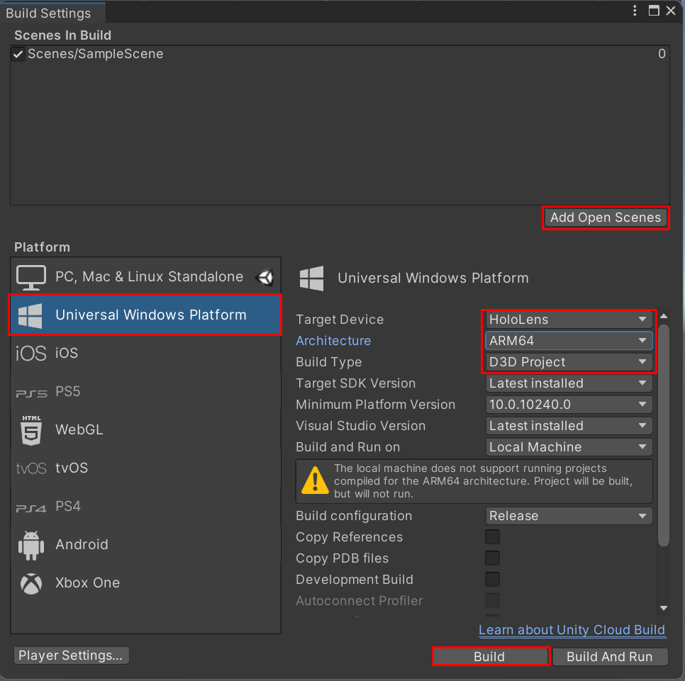
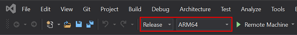
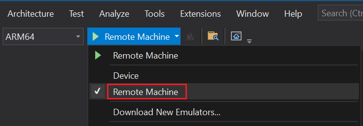
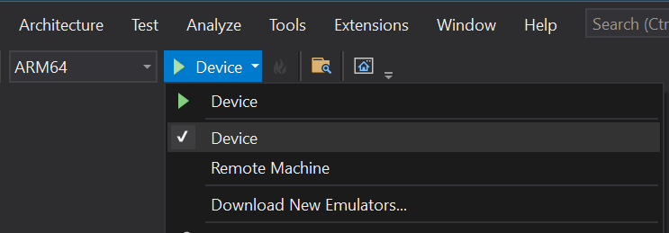
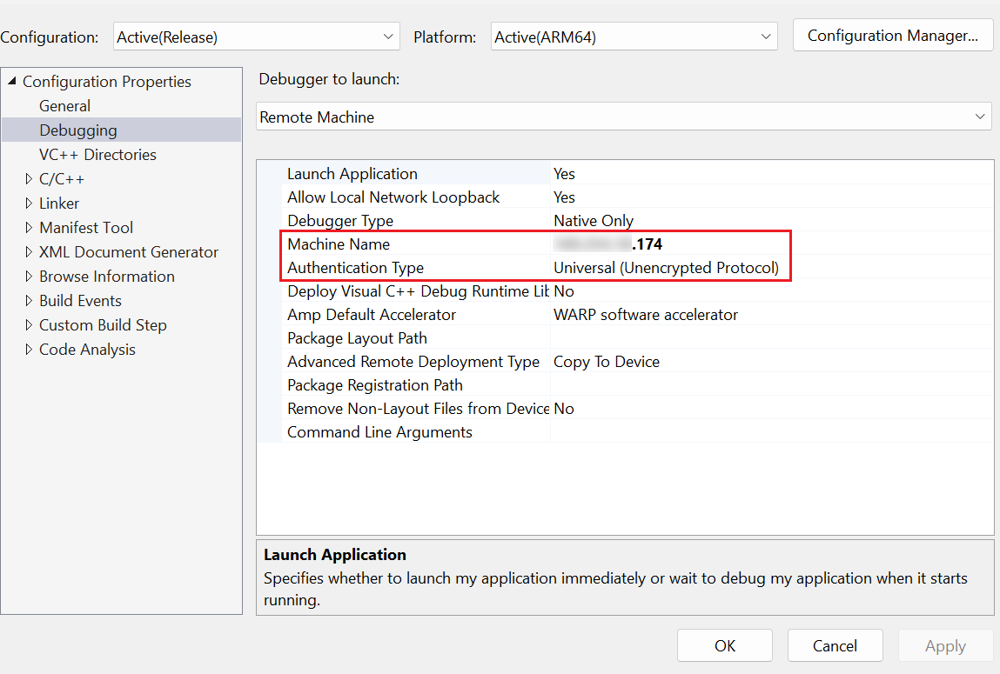

# Get started with WebView2 in HoloLens 2 Unity apps (Preview)

This tutorial is for developers using WebView2 in immersive HoloLens 2 Unity applications.  WebView2 on HoloLens 2 and the WebView Unity plugin are both in Preview and are subject to change before general availability.

WebView2 is only supported on HoloLens 2 devices running the Windows 11 update. For more information, see [Update HoloLens 2](/hololens/hololens-update-hololens).

For WebView2-enabled 2D applications on HoloLens 2, see [Get started with WebView2 in WinUI 2 (UWP) apps](./winui2.md).


In this tutorial, you:

* Set up your development tools for creating HoloLens 2 Unity apps that use WebView2 to display web content.
* Install the Mixed Reality Toolkit (MRTK) using the Mixed Reality Feature Tool.
* Create an initial Unity project for HoloLens 2 development.
* Add the Microsoft Mixed Reality WebView plugin.
* Configure a WebView2 prefab that displays webpage content in your HoloLens 2 app.
* Learn about WebView2 concepts and interactions in Unity.


<!-- ------------------------------ -->
#### Completed project

A completed version of this Getting Started project is available in the **WebView2Samples** repo. You can use the completed project (from the repo or from following the steps below) as a baseline to add more WebView2 functionality and other features to your HoloLens 2 Unity app.

A completed version of this tutorial project is available in the **WebView2Samples** repo:

* Sample name: **HoloLens2_GettingStarted**
* Repo directory: [HoloLens2_GettingStarted](https://github.com/MicrosoftEdge/WebView2Samples/tree/main/GettingStartedGuides/HoloLens2_GettingStarted)
* Unity project folder: **HoloLens2GetStartedApp**

Follow the major Step sections in sequence, below.


<!-- ------------------------------ -->
#### About HoloLens 2, Unity, MRTK, and WebView2

**HoloLens 2** is a groundbreaking, untethered holographic device, offering a hands-free and immersive mixed reality experience. It seamlessly overlays digital information onto the real world, rendering high-definition holograms that stay in place and respond naturally to interaction.

You use the Unity game engine and Visual Studio to create your HoloLens 2 project. The Mixed Reality Toolkit (MRTK) provides essential components and features for developing mixed reality experiences, while the Microsoft Mixed Reality WebView plugin enables the integration of WebView2 functionality into your HoloLens 2 app.

The MRTK is a Microsoft-driven open source project that accelerates the development of mixed reality applications in Unity. This toolkit provides a collection of scripts, components, and prefabs designed to help you create performant and intuitive mixed reality experiences for HoloLens 2 devices.

**Unity**, a versatile game engine, is a popular choice for creating 3D applications, including mixed reality experiences for HoloLens 2 devices, due to its extensive features and robust capabilities for AR/VR/MR.

The **Mixed Reality Toolkit (MRTK)** is a Microsoft-driven open source project designed to accelerate the development of mixed reality applications in Unity. MRTK provides a collection of scripts, components, and prefabs specifically designed for building performant and intuitive mixed reality experiences on HoloLens 2 devices.

In Unity, the **Microsoft Mixed Reality WebView** plugin can be installed via the **Mixed Reality Feature Tool**. The WebView plugin for Unity simplifies the integration of WebView2 functionality into your HoloLens 2 app by wrapping the WebView2 control and automatically handling rendering and directing input to the WebView2 control. The plugin also manages interop between Unity and WebView2, enabling communication between JavaScript and Unity via messages and events.

By combining HoloLens 2, Unity, MRTK, and WebView2, you can create immersive mixed reality experiences that seamlessly integrate web content.


<!-- ====================================================================== -->
## Step 1 - Install Unity and Visual Studio

This tutorial assumes you have Unity 2020.3 LTS or later and Visual Studio 2019 version 16.9 or later installed. Visual Studio 2017 isn't supported.

Follow the [Mixed Reality tools installation guide](/windows/mixed-reality/develop/install-the-tools?tabs=unity) to set up your Unity and Visual Studio environment for HoloLens 2 development. These resources will guide you through the process of installing and configuring the necessary tools, including Visual Studio and the Universal Windows Platform development workload.

Also set up your development environment for WebView2, by following the steps in [Set up your Dev environment for WebView2](../how-to/machine-setup.md).

Once you have completed the setup, return to this page and continue with the next steps.


<!-- ====================================================================== -->
## Step 2 - Set up Unity project for HoloLens 2 development

Before you can start developing a HoloLens 2 app with WebView2, you'll need to set up your Unity project for HoloLens 2 development. To prepare your project for mixed reality development, follow the steps in [Unity development for HoloLens 2](/windows/mixed-reality/develop/unity/unity-development-overview?tabs=arr,D365,hl2) in the Mixed Reality documentation.

Once you have your Unity project ready for HoloLens 2 development, you'll need to configure MRTK in your project.  To set up the Mixed Reality Toolkit in your Unity project, see [Welcome to the Mixed Reality Feature Tool](/windows/mixed-reality/develop/unity/welcome-to-mr-feature-tool).

After you've installed the MRTK and Mixed Reality Feature Tool, the MRTK assets and prefabs appear in your Unity project, ready for use.


<!-- ====================================================================== -->
## Step 3 - Install MRTK and Mixed Reality Feature Tool

1. To install the Mixed Reality Toolkit (MRTK) and the Mixed Reality Feature Tool, first [Download the Mixed Reality Feature Tool](https://www.microsoft.com/download/details.aspx?id=102778) from the Microsoft Download Center.

   The Mixed Reality Feature Tool<!--todo: and MRTK? --> simplifies the process of discovering, installing, and managing Mixed Reality features and packages for your Unity project. For more guidance on installing the Mixed Reality Feature Tool, see [Welcome to the Mixed Reality Feature Tool](/windows/mixed-reality/develop/unity/welcome-to-mr-feature-tool).

1. Run the downloaded Mixed Reality Feature Tool executable and follow the prompts to install the MRTK and any additional required packages for HoloLens 2 development.

   The Mixed Reality Feature Tool allows you to select and install the appropriate versions of MRTK, along with other Mixed Reality features, directly into your Unity project.

Proceed to the next step to set up your Unity project for HoloLens 2 development.


<!-- ====================================================================== -->
## Step 4 - Install Unity WebView plugin via Mixed Reality Feature Tool

In this step, you'll use the Mixed Reality Feature Tool to install the "Microsoft Mixed Reality WebView" plugin that contains a specific version of the WebView2 NuGet package, which is compatible with HoloLens 2.

1. Launch the Mixed Reality Feature Tool (which you installed above). The start page of the Mixed Reality Feature Tool opens, containing options to configure settings, and view documentation:

   

2. Click the gear button.  The **Settings** pane opens.

3. Click the **Feature** tab, and then make sure the **Show preview releases** checkbox is selected:

   

4. Click the **Ok** button to return to the starting page.

5. Click the **Start** button to begin discovering feature packages.

6. Point the Mixed Reality Feature Tool to your Unity project.  To do this, click the **Browse for the project folder** (**...**) button to the right of the **Project Path** field:

   

7. In the file selection dialog, select your Unity project folder, and then click the **Open** button.

8. In the **Select project** dialog, click the **Discover Features** button.

9. In the **Discover Features** page, expand the **Other features** section, and then select the **Microsoft Mixed Reality WebView** checkbox:

   

   This marks this plugin for installation. In the version dropdown, by default, the latest version of the plugin is selected.

10. Click the **Get Features** button.  This downloads the required packages.

11. Once the packages are downloaded, click the **Import** button:

   

12. On the **Review and Approve** page, inspect the modifications that will be made to your project `manifest.json` file, and inspect the list of files (such as `.tgz` packages) that will be copied into your project:

   

13. Click the **Approve** button to finalize the changes.

14. In your Unity project, in your project's **Assets** folder, inspect the WebView2 prefab.

The Microsoft Mixed Reality WebView plugin is now installed and imported.  Continue with the next Step below.

For more information, see [Welcome to the Mixed Reality Feature Tool](/windows/mixed-reality/develop/unity/welcome-to-mr-feature-tool).


<!-- ====================================================================== -->
## Step 5 - Set up the WebView2 prefab in Unity scene

Now that the Microsoft Mixed Reality WebView plugin is installed and imported, set up the WebView2 prefab in your Unity scene, as follows:

1. In the Unity Editor, navigate to the **Project** window and find the WebView2 prefab by going to `Packages > Microsoft Mixed Reality WebView > Runtime > Prefab`.

1. Drag and drop the WebView2 prefab into your scene.

1. With the WebView2 prefab selected in the **Hierarchy** window, move it to a suitable starting location within the scene, ensuring it is in view of the default camera.

1. In the **Inspector** window, you can change the initial URL loaded by the WebView2 prefab. To do this, locate the "Current URL" property and enter the desired URL. By default, the prefab loads `https://www.microsoft.com`.


<!-- ====================================================================== -->
## Step 6 - Configure WebView2 settings and properties

While the prefab exposes just a single property, there is more functionality exposed on the `WebView` script. Let's take a look are exposing some of this functionality in our project. First, we recommend reviewing the `WebView` script to get an idea of what's available. There is further functionality available in the underlying WebView2, but this will give you a good idea of the basics.

To view the `WebView` script you can double-click on it in the Inspector window. This should open it in your default code editor.

Now that you've reviewed the `WebView` code, let's extend the functionality of our sample. To do that, we'll create a new script that derives from `WebView`.

1. In the Inspector window for WebView, click **Add Component**, select **New script**, and type `WebViewBrowser`, click **Create and add**. You new component will be added to the Inspector window.

1. Double-click on the `WebViewBrowser` script in the Inspect window to edit the script.

1. Replace the contents of that file with the code below.

```C#
using Microsoft.MixedReality.WebView;
using UnityEngine.UI;
using UnityEngine;
using TMPro;
using System;

public class WebViewBrowser: MonoBehaviour
{
    // Declare UI elements: back button, go button, and URL input field
    public Button BackButton;
    public Button GoButton;
    public TMP_InputField URLField;

    private void Start()
    {
        // Get the WebView component attached to the game object
        var webViewComponent = gameObject.GetComponent<WebView>();
        webViewComponent.GetWebViewWhenReady((IWebView webView) =>
        {
            // If the WebView supports browser history, enable the back button
            if (webView is IWithBrowserHistory history)
            {
                // Add an event listener for the back button to navigate back in history
                BackButton.onClick.AddListener(() => history.GoBack());

                // Update the back button's enabled state based on whether there's any history to go back to
                history.CanGoBackUpdated += CanGoBack;
            }

            // Add an event listener for the go button to load the URL entered in the input field
            GoButton.onClick.AddListener(() => webView.Load(new Uri(URLField.text)));

            // Subscribe to the Navigated event to update the URL input field whenever a navigation occurs
            webView.Navigated += OnNavigated;

            // Set the initial value of the URL input field to the current URL of the WebView
            if (webView.Page != null)
            {
                URLField.text = webView.Page.AbsoluteUri;
            }
        });
    }

    // Update the URL input field with the new path after navigation
    private void OnNavigated(string path)
    {
        URLField.text = path;
    }

    // Enable or disable the back button based on whether there's any history to go back to
    private void CanGoBack(bool value)
    {
        BackButton.enabled = value;
    }
}
```

1. Modify the scene hierarchy as follows:
   1. Under MixedRealitySceneContent, add a new input component (right-click menu > UI > Input Field - TextMeshPro). This will automatically add a parent Canvas for the component.
   1. Under the new Canvas, add **two** new Button components (right-click menu > UI > Button - TextMeshPro).
   1. Reorder the WebView component so that it is a child of the Canvas component.

   

1. Update the Canvas properties by selecting it in the Hierarchy pane, then making the following changes in the Inspector pane:
   1. Change **Width** & **Height** to 600, 400 respectively.
   1. Change **Scale** for X, Y, Z to 0.001, 0.001, 0.001.

   

1. Update the input field's properties by selecting it in the Hierarchy pane, then making the following changes in the Inspector pane:
   1. Change **Name** to "AddressWell (TMP)"
   1. Change **PosX**, **PosY**, **PosZ** to -2, 178, -5, respectively.
   1. Change **Width** & **Height** to 390, 300 respectively.

   

1. Update the first button's properties by selecting it in the Hierarchy pane, then making the following changes in the Inspector pane:
   1. Change **Name** to "Back Button"
   1. Change **PosX**, **PosY**, **PosZ** to -248, 178, -5, respectively.
   1. Change **Width** & **Height** to 75, 30 respectively.

   

1. Update the second button's properties by selecting it in the Hierarchy pane, then making the following changes in the Inspector pane:
   1. Change **Name** to "Go Button"
   1. Change **PosX**, **PosY**, **PosZ** to 242, 178, -5, respectively.
   1. Change **Width** & **Height** to 75, 30 respectively.

   

1. Update the WebView's properties by selecting it in the Hierarchy pane, then making the following changes in the Inspector pane:
   1. Change **PosX**, **PosY**, **PosZ** to 0, -16, -5, respectively.
   1. Change **Scale** for X, Y, Z to 570, 340, 1 respectively.

   

1. Add background image to Canvas.
   1. Select the Canvas in the Hierarchy pane.
   1. Click the 'Add Component' button at the bottom of the Inspector pane.
   1. Type 'Image' and select the top result in the list.
   1. Click on the **Color** well for the image and choose a background color. In our example, we chose a gray color. (This is simply to show some contrast between the different controls in the canvas.)

   

1. Select **Text (TMP)** under **Back Button** in the Hierarchy pane and change the **Text Input** to *Back* in the Inspector pane.

   

1. Repeat the above process for **Go Button**, substituting *Go* as the text.

   You should now have a scene which looks similar to the follow:

   

1. Connect WebViewBrowser prefabs.
   1. Select the WebViewBrowser.
   1. Drag **Back Button** from the Hierarchy pane into the **Back Button** variable field for the WebView Browser in the Inspector.
   1. Drag **Go Button** from the Hierarchy pane into the **Go Button** variable field for the WebView Browser in the Inspector.

   

1. Test is out in the Editor. Now that everything is wired up in your scene, you should be able to play the scene inside Unity. Try testing out the scene by entering a new URL into the field (must be a complete URL), then pressing the **Go** button. The **Back** button should work, as well.

Input within the WebView itself will not work without additional changes, as discussed below.


<!-- ====================================================================== -->
## Step 7 - Build and deploy the HoloLens 2 app with WebView2

Now that we have a basic web browser working in Unity, we can build and deploy it to a HoloLens 2 device.

1. In Unity, open the **Build Settings** dialog (**File > Build Settings**).

1. Make sure that the selected platform is **Universal Windows Platform**.

1. Click **Add Open Scene** to add our sample scene to the list of scenes in the build.

1. Under Universal Windows Platform, configure the build settings:
    * **Architecture**: Intel 64-bit
    * **Build Type**: D3D Project
    * **Target SDK Version**: Latest installed
    * **Visual Studio Version**: Latest version
    * **Build and Run on**: Local Machine
    * **Build configuration**: Release

   

1. Click **Build** to generate the IL2CPP build. This will open a file dialog to select the folder for the build files. We recommend you create a new folder (e.g., 'Build') under your project directory for this purpose. Once you select your build folder in the file dialog, Unity will begin generating the build. This will take several minutes.

1. When this operation completes, Unity should launch a new File Explorer with the output folder selected. If not, you can navigate to it manually.

1. Under your build folder, you will find a Visual Studio solution file (.sln). Double-click this file to open it in Visual Studio.

1. In Visual Studio, select the Solution Configuration (e.g., **Release**). Then set the Platform to **ARM64**.



1. Make sure **Developer Mode** is enabled on your PC and on your HoloLens 2 device. See [Enabling Developer Mode](/windows/mixed-reality/develop/advanced-concepts/using-visual-studio?tabs=hl2#enabling-developer-mode) in _Using Visual Studio to deploy and debug_ in the Mixed Reality documentation.

1. Click the deployment target drop-down and then do one of the following:

    * If you're building and deploying via Wi-Fi, select **Remote Machine**.

      

    * If you're building and deploying via USB, select **Device**.

      


<!-- ------------------------------ -->
#### Remote Connection

To set up your remote connection:

1. On the menu bar, select **Project > Properties > Configuration Properties > Debugging**.

1. Click the **Debugger to launch** drop-down and then select **Remote Machine**.

1. In the **Machine Name** field, enter the IP address of your device.
    * You can find the IP address on your HoloLens 2 under **Settings > Network & Internet > Advanced Options**.
    * We recommend that you manually enter your IP address rather than depend on the "Auto Detected" feature.

    

2. Set the **Authentication Mode** to **Universal (Unencrypted protocol)**.

3. Build, deploy, and debug your app based on your needs:
    * To build, deploy, and start debugging, select **Debug > Start debugging**.
    * To build and deploy without debugging, select **Build > Deploy Solution**.

4. The first time you deploy an app to your HoloLens 2 from your PC, you'll be prompted for a PIN. Follow the Pairing your device instructions below.

## Learn about WebView2 events and interactions in Unity

The Microsoft Mixed Reality WebView plugin provides events for working with the webview. One important event is `IWithPostMessage.MessageReceived`, which is raised when a message is sent from the webview to the Unity app. The `MessageReceived` event is defined in the `Microsoft.MixedReality.WebView.IWithPostMessage` interface. The interface also defines the `PostMessage()` method, which can be used to send a message from the Unity app to the webview.

Here is an example of how to use these methods:

```C#
using Microsoft.MixedReality.WebView;

public class WebViewExample : MonoBehaviour, IWithPostMessage
{
    private void Start()
    {
        var webViewComponent = gameObject.GetComponent<WebView>();

        if (Url != string.Empty)
        {
            Debug.Log("Loading URL: " + Url);
            webViewComponent.Load(new Uri(Url));
        }

        webViewComponent.GetWebViewWhenReady((IWebView webView) =>
        {
            // Add event listeners for WebView2 events
            ((IWithPostMessage)webView).MessageReceived += OnMessageReceived;
        });
    }

    // Handler for WebView2 OnPostMessage event
    void OnMessageReceived(string message)
    {
        Debug.Log("WebView2 message received: " + message);
    }
}
```

<!-- ====================================================================== -->
## Additional considerations for WebView2 on HoloLens 2
<!-- 
if move this section to a separate .md (new article), can promote h4s to h2s to make appear in In This Article nav
it might be possible to flatten outline of this section by promoting h6s to h4s, or h4s to h2s
-->

<!-- ------------------------------ -->
#### Limitations and known issues

When developing a HoloLens 2 Unity app with WebView2, be aware of some limitations and known issues:

* **Pop-ups**: Pop-ups don't work well within WebView2 inside Unity apps on HoloLens 2, but they work fine in 2D XAML apps on the device. Avoid pop-ups and use alternative techniques or UI designs, such as custom pop-up-like elements within the WebView using HTML, CSS, and JavaScript.

* **New windows**: WebView2 instances on HoloLens 2 navigate within the same window by default, unlike on Desktop. Follow this default behavior for a better user experience.

* **Enterprise authentication**: Automatic Single Sign-On (SSO) leveraging OS-level tokens is currently not supported in WebView2 on HoloLens 2. Users can still sign in by providing credentials, except for cases requiring device-level authentication. Cookie storage works as expected.

* **User interactions**: Unlike native HoloLens 2 slates, WebView2 is best interacted with using far-interaction hand rays. Touch-to-swipe and scroll interactions might not be supported.

* **Performance**: Complex websites with heavy use of JavaScript or advanced rendering may impact system performance or the host application's framerate. For general performance-related limitations and recommendations, see [Understanding performance for mixed reality](/windows/mixed-reality/develop/advanced-concepts/understanding-performance-for-mixed-reality) in the Mixed Reality documentation. Also see [Performance optimization](#performance-optimization), below.


<!-- ------------------------------ -->
#### Navigation

In step 6, we touched on some navigation methods. In this section, we'll expand on what we learned.

**`IWebView` Interface**
The `IWebView` interface exposes a few methods, events, and properties related to page navigation. The main functionality exposed here is the ability for developers to navigate to a given URL, by using `Load(Uri url)`:

```C#
public interface IWebView
{
    // Non-navigation methods are removed for clarity.

    event WebView_OnNavigated Navigated;

    Uri Page { get; }

    void Load(Uri url);

    void Reload(bool ignoreCache);
}
```

**`IWithBrowserHistory` Interface**
The `IWithBrowserHistory` interface exposes a few methods and events related to page navigation. This mainly allows developers to navigate forward and backward, as you would expect with a typical web-browsing experience:

```C#
public interface IWithBrowserHistory : IWebView
{
    // Non-navigation methods are removed for clarity.

    event WebView_OnCanGoForwardUpdated CanGoForwardUpdated;

    event WebView_OnCanGoBackUpdated CanGoBackUpdated;

    void GoBack();

    void GoForward();
}
```

The `SetVirtualHostNameToFolderMapping` method in WebView2 enables mapping between a virtual host name and a folder path, making it accessible to websites using that host name. This method maps a local domain name to a local folder so that the WebView2 control loads content from the specified local folder when attempting to access a resource for that domain.

The WebView plugin exposes this functionality through the `IWithVirtualHost` interface, which has a single method, `SetVirtualHostMapping(string hostName, string folderPath)`:

```C#
public interface IWithVirtualHost: IWebView
{
    void SetVirtualHostMapping(string hostName, string folderPath);
}
```

To use this method, set `hostName` to any valid URL conforming string, such as `webview2.sample`. `folderPath` can be an absolute path or a path relative to the application's working directory, like `Assets\Html`.

Assuming we have an HTML file called `demo.html` under `Assets\Html`, the following code snippet demonstrates loading `demo.html` with the WebView plugin:

```C#
using Microsoft.MixedReality.WebView;

public class WebViewExample : MonoBehaviour
{
    private void Start()
    {
        var webViewComponent = gameObject.GetComponent<WebView>();

        webViewComponent.GetWebViewWhenReady((IWebView webView) =>
        {
            ((IWithVirtualHost)webView).SetVirtualHostMapping("webview2.sample", "Assets\\Html");

            // Navigate to our local content.
            webViewComponent.Load(new Uri("http://webview2.sample/demo.html"));
        });
    }
}
```


<!-- ------------------------------ -->
#### Input

There are various ways to handle input in Unity for Mixed Reality applications.

* [Input overview — MRTK2](/windows/mixed-reality/mrtk-unity/mrtk2/features/input/overview) - recommended for MRTK 2.8 applications.
* [Input — MRTK3](/windows/mixed-reality/mrtk-unity/mrtk3-input/packages/input/overview) - recommended for MRTK 3 applications.
* [Unity Input System](https://docs.unity3d.com/Packages/com.unity.inputsystem@1.5/manual/index.html)

Regardless of the input system used within your Unity application, interop code between the various application input events and the WebView plugin is required. This means translating those events (such as Pointer events) into a `WebViewMouseEventData` object and then forwarding those events to the plugin via the `IWithMouseEvent` interface:

```C#
public interface IWithMouseEvents : IWithInputEvents
{
    void MouseEvent(WebViewMouseEventData mouseEvent);
}
```

WebView2 is unaware of Unity's input system and likely has a different coordinate system than your Unity scene. As a result, when there is a pointer-down event, its coordinates must be translated into the coordinate system of the WebView2 control. Additionally, the pointer-down event needs to be converted into an appropriate `WebViewMouseEventData` event type.

Simple example:

```C#
using Microsoft.MixedReality.WebView;

public class WebViewExample : MonoBehaviour, IPointerDownHandler
{
    // WebView setup steps skipped for brevity

    public void OnPointerDown(PointerEventData eventData)
    {
        IWithMouseEvents mouseEventsWebView = webView as IWithMouseEvents;

        // Call hypothetical function which converts the event's x, y into the WebView2's coordinate space.
        var hitCoord = ConvertToWebViewSpace(eventData.position.x, eventData.position.y);

        WebViewMouseEventData mouseEvent = new WebViewMouseEventData
        {
            X = hitCoord.x,
            Y = hitCoord.y,
            Type = PointerEvent.PointerDown,
            Button = PointerButton.Left,
            TertiaryAxisDeviceType = WebViewMouseEventData.TertiaryAxisDevice.PointingDevice
        };

        // Propagate the event to the WebView plugin.
        mouseEventsWebView.MouseEvent(mouseEvent);
    }
}
```

In the above example, pointer-down events are converted into `WebViewMouseEventData` objects and forwarded to the WebView plugin. It is essentially converted into a mouse-down event. In order to effect mouse click events, the pointer-up would need to be handled in a similar fashion.

In the example above, `ConvertToWebViewSpace` is intentionally not implemented.


<!-- ------------------------------ -->
#### Performance optimization

Optimizing the performance of WebView2 in your HoloLens 2 Unity app is crucial for a smooth user experience. Here are some recommendations:

* **Limit the number of WebView2 instances**: We suggest using only one instance of WebView2 within a Unity app. Reuse the same instance or tear down and create a new one as needed. Keep in mind that removing the WebView prefab from the scene may not destroy the underlying WebView2 instance. You must call the `Destroy()` method on the game object to destroy it properly.

* **Use TrySuspendAsync API**: When the WebView2 is not being presented to the user, use the `TrySuspendAsync` API to reduce memory usage. You will need to get the native WebView2 instance, to call this API (⚠️ this is TBD, and we will update this section<!--todo--> accordingly ⚠️).

* **Apply general Unity optimization techniques**: Utilize standard Unity optimization methods, such as occlusion culling or limiting the update rate, to improve WebView2 performance. For more information, see [Performance recommendations for Unity](/windows/mixed-reality/develop/unity/performance-recommendations-for-unity?tabs=openxr) in the Mixed Reality documentation.

* **Profile and monitor WebView2 performance**: There are several ways to profile the performance of a HoloLens 2 Unity application:

  * **Unity Profiler**: A built-in tool in Unity that allows you to measure and optimize the performance of your application on various platforms, including HoloLens 2.

  * **Visual Profiler**: A feature of the Mixed Reality Toolkit (MRTK) that provides an in-application view of your application's performance.

  * **PIX**: A performance tuning and debugging tool for Windows and Xbox that can also be used to profile Unity applications on HoloLens 2.


<!-- ====================================================================== -->
## See also

* [Get started with WebView2 in WinUI 2 (UWP) apps](./winui2.md)
