# Get started with WebView2 in Win32 apps

<!-- TODO: Rewrite to start from a project template? -->

This article is to learn to write your own WebView2 code.  If you want to run a sample first, see [Win32 sample app](../samples/webview2apissample.md) or another sample app article.

In this article, you set up your development tools (if not done already), learn how to add WebView2 code to a Win32 app project, and learn about WebView2 concepts along the way.

This tutorial starts by opening an existing Win32 app project that has WebView2 code added.  The project uses the [Win32_GettingStarted (WebView2GettingStarted.sln)](https://github.com/MicrosoftEdge/WebView2Samples/tree/main/GettingStartedGuides/Win32_GettingStarted) directory that's part of the `WebView2Samples` repo.  To use this article, you do the following:
1. Clone or download the `WebView2Samples` repo to your local drive.
1. Run the completed project.
1. Optionally delete the WebView2 code from `HelloWebView.cpp` to restore the Win32 baseline app.
1. Follow the remaining steps in this article about adding and understanding the WebView2 code.

<!-- A completed version of this tutorial project is available in the WebView2Samples repo: [Win32_GettingStarted](https://github.com/MicrosoftEdge/WebView2Samples/tree/main/GettingStartedGuides/Win32_GettingStarted#readme). -->

This tutorial starts with the completed project that's in the repo, which already has WebView2 code added.  (This tutorial doesn't have you create a new project; you don't use a project template in Visual Studio to create a new project, and then add WebView2 code.)


<!-- ------------------------------ -->
#### Completed project

The completed tutorial project is available in the **WebView2Samples** repo:

*  Sample name: **Win32_GettingStarted**
*  Repo directory: [Win32_GettingStarted](https://github.com/MicrosoftEdge/WebView2Samples/tree/main/GettingStartedGuides/Win32_GettingStarted)
*  Solution file: **WebView2GettingStarted.sln**


<!-- ====================================================================== -->
## Step 1 - Install Visual Studio

This tutorial requires Microsoft Visual Studio, not Microsoft Visual Studio Code.

1. If Microsoft Visual Studio isn't installed already, in a new window or tab, see [Install Visual Studio](../how-to/machine-setup.md#install-visual-studio) in _Set up your Dev environment for WebView2_.  Follow the steps there to do a basic default installation of Visual Studio.

Then return to this page and continue below.


<!-- ====================================================================== -->
## Step 2 - Clone or download the WebView2Samples repo

The code that you add in this tutorial's steps, has already been added to the sample repo, for you.  An optional step below allows you to delete the WebView2 code from `HelloWebView.cpp`, so that you can add it yourself, if you want.

To keep this tutorial focused on WebView2-specific coding, we start from an existing Microsoft Visual Studio project (`WebView2GettingStarted`) that's stored in the `WebView2Samples` GitHub repo.  We'll add WebView2 features - actually, the features have already been added, but follow along in the setup and explanation steps.

The existing Visual Studio project we'll start with is part of the sample code from a standard C++ Win32 desktop application.  For information about the underlying, standard Win32 app sample, in a new window or tab, see [Walkthrough: Create a traditional Windows Desktop application (C++)](/cpp/windows/walkthrough-creating-windows-desktop-applications-cpp).

---

Clone or download the WebView2Samples repo, as follows:

1. If you haven't already, clone (or download) the `WebView2Samples` repo.  To do this, in a separate window or tab, follow the steps in [Clone the WebView2Samples repo](../how-to/machine-setup.md#clone-the-webview2samples-repo) (or in [Download the WebView2Samples repo](../how-to/machine-setup.md#download-the-webview2samples-repo)), in in _Set up your Dev environment for WebView2_.

Then continue with the steps below.


<!-- ====================================================================== -->
## Step 3 - Open the finished solution (WebView2GettingStarted.sln)

You start with a basic desktop project that contains a single main window.  We'll start with an existing app project from the **WebView2Samples** repo, which you cloned or downloaded from GitHub in the previous step.

1. Open Visual Studio (not Visual Studio Code).

1. Open `WebView2GettingStarted.sln`, which is located at the path: `<your repo directory>/WebView2Samples/GettingStartedGuides/Win32_GettingStarted/WebView2GettingStarted.sln`.


<!-- ====================================================================== -->
## Step 4 - Install workloads if prompted

Visual Studio Installer might open and prompt you to install a Workload:

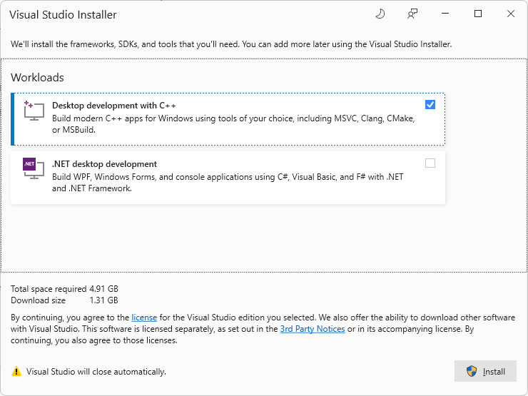

If Visual Studio Installer prompts you to install a Workload:

1. Select the **Desktop development with C++** card so that a checkmark appears.

1. If you want, also select the **.NET desktop development** card (not needed for this tutorial), so that a checkmark appears on this card as well.

1. Click the **Install** button.

The Installer closes.


<!-- ------------------------------ -->
#### Retarget Projects

The Visual Studio **Review Solution Actions** dialog might appear, prompting you whether you want to **Retarget Projects**:

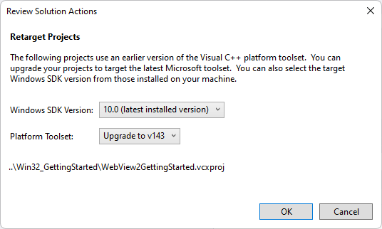

1. If that dialog appears, you can click **OK**.

The **WebView2GettingStarted** solution opens in Visual Studio.  The solution contains a single project: **WebView2GettingStarted**, which contains a single .cpp file: **HelloWebView.cpp**.


<!-- ====================================================================== -->
## Step 5 - View the opened project in Visual Studio

If the **WebView2GettingStarted** project isn't open in Visual Studio, open it in Visual Studio:

1. Open `WebView2GettingStarted.sln`, which is located at the path: `<your repo directory>/WebView2Samples/GettingStartedGuides/Win32_GettingStarted/WebView2GettingStarted.sln`.

1. In Solution Explorer, expand the **Source Files** node, and then select **HelloWebView.cpp**.

   `HelloWebView.cpp` opens in the code editor of Visual Studio.

   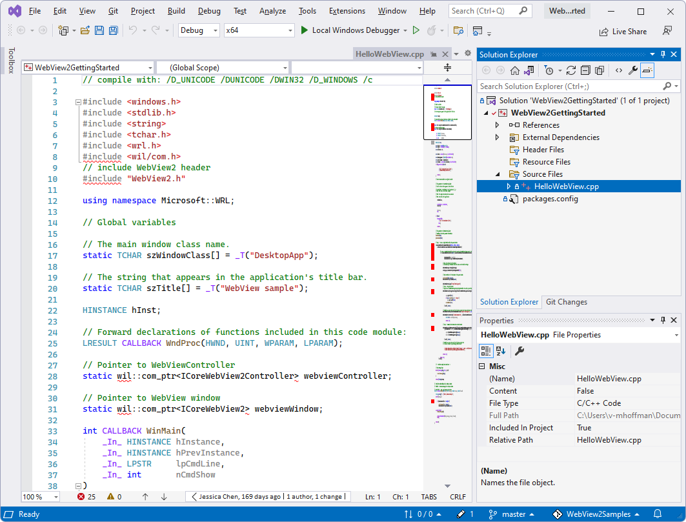

The above screenshot shows some WebView2 code (`#include "WebView2.h"`), that's already present in the file immediately after cloning (downloading) the repo.

<!-- To confirm that the header lines are already already present in the repo: in a different window or tab, see [WebView2Samples/GettingStartedGuides/Win32_GettingStarted/HelloWebView.cpp](https://github.com/MicrosoftEdge/WebView2Samples/blob/main/GettingStartedGuides/Win32_GettingStarted/HelloWebView.cpp). -->


<!-- ------------------------------ -->
#### Set the solution to use the Win10 SDK and Visual Studio toolset

This step is only needed for older versions of Visual Studio, so it's likely you can skip it.  But you can take a look at this UI in any case:

1. In Visual Studio's **Solution Explorer**, right-click the **WebView2GettingStarted** _project_ (not the solution with the same name), and then select **Properties**.

1. Select **Configuration Properties** > **General**, and then (if it's not the correct setting already):

   1. Modify **Windows SDK Version** to use the Win10 SDK.

   1. Modify **Platform Toolset** to use a Visual Studio toolset.

   These modifications are only necessary for older<!--define--> versions of Visual Studio.

   Here's a Visual Studio 2017 screenshot showing some valid settings:

   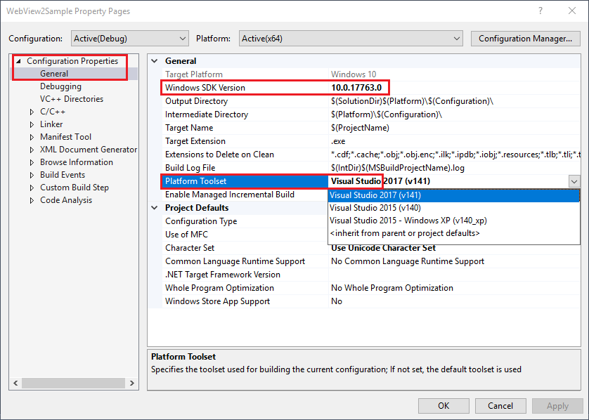

   The following is a Visual Studio 2022 screenshot; the values were already correct, so no change was required:

   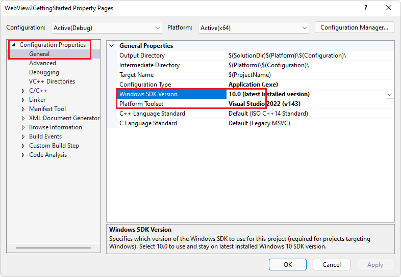

Continue with the steps below.


<!-- ====================================================================== -->
## Step 6 - Build and run the repo's finished project

At this point, your Dev environment is set up to run Win32 WebView2 apps in debug mode in Visual Studio and add WebView2 features.

---

To confirm that your system is set up for WebView2 coding, run the project in Debug mode, as follows:

1. Select **Debug** > **Start debugging** (**F5**) to build and run the project.

   The sample app first opens a pop-up window, which displays the URL that will be loaded, along with an **OK** button:

   

1. Click the **OK** button to dismiss the pop-window and continue to the URL:

   The WebView2 window now displays webpage content: the Bing website, `http://www.bing.com`.

   <!-- instance 3 of bing-window.png -->
   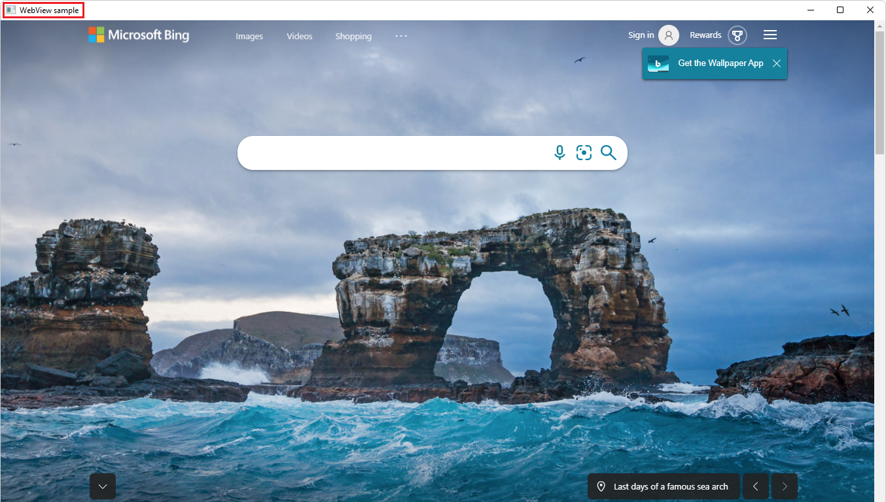

1. Close the **WebView sample** window.


<!-- ====================================================================== -->
## Step 7 - Update or install the Windows Implementation Libraries (WIL)

WIL is already installed into the project at the repo, but walk through these steps to learn about setup and to check the project's setup.

In a moment, you'll install the **Windows Implementation Libraries (WIL)** - A header-only C++ library to make life easier for developers on Windows through readable, type-safe C++ interfaces for Windows COM coding patterns.  You install this **Microsoft.Windows.ImplementationLibrary** package through Solution Explorer in Visual Studio, for the project.

This tutorial also uses **Windows Runtime C++ Template Library (WRL)** - A template library that provides a low-level way to author and use Windows Runtime components.

---

Install the Windows Implementation Libraries (WIL) from within Visual Studio, as follows:

1. In Visual Studio, make sure that the **WebView2GettingStarted** solution is still open.

1. In **Solution Explorer**, right-click the **WebView2GettingStarted** project node (not the solution node) and then select **Manage NuGet Packages**.

   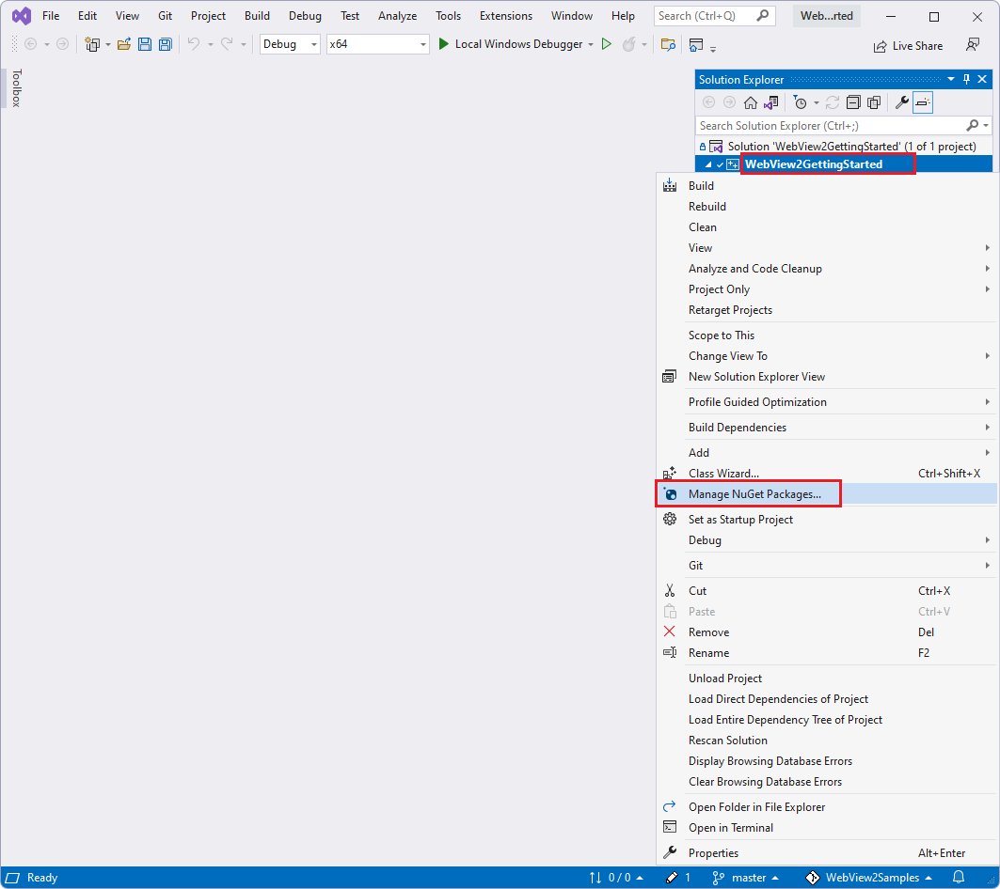

1. In the **NuGet** window, click the **Browse** tab.

1. In the search bar in the upper left, type `Microsoft.Windows.ImplementationLibrary`.  Or, copy and paste the single-line code block below.  Then select **Microsoft.Windows.ImplementationLibrary**.

   ```
   Microsoft.Windows.ImplementationLibrary
   ```

   Selecting the **Microsoft.Windows.ImplementationLibrary** package in NuGet Package Manager in Visual Studio:

   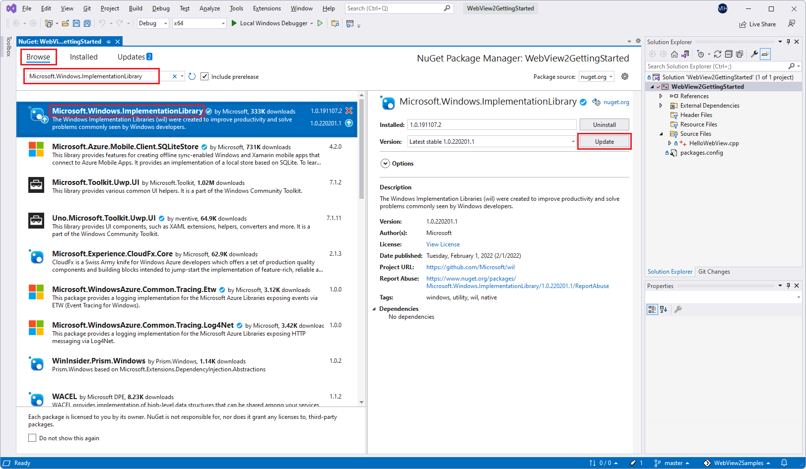

   _To zoom, right-click > **Open image in new tab**._

   If you don't see **Microsoft.Windows.ImplementationLibrary** listed, check the NuGet source location, as follows:

   1. Select **Tools** > **Options** > **NuGet Package Manager** > **Package Sources**.

   1. Make sure that in **Package sources** there is a **nuget.com** source pointing to `https://api.nuget.org/v3/index.json`.

   1. If **Package sources** doesn't contain that source, enter `nuget.com` in the **Name** text box and `https://api.nuget.org/v3/index.json` in the **Source** text box. Then click **Update** and **OK**.

1. Toward the upper right, click the **Install** button (or the **Update** button).  NuGet downloads the Windows Implementation Library (WIL) to your machine.

Windows Implementation Libraries (WIL) is now installed, along with Windows Runtime C++ Template Library (WRL).

Continue with the steps below.


<!-- maintenance link; keep: main copy:
[Install or update the WebView2 SDK](../how-to/machine-setup.md#install-or-update-the-webview2-sdk) in _Set up your Dev environment for WebView2_
-->
<!-- ====================================================================== -->
## Step 8 - Update or install the WebView2 SDK

The finished project in the repo already has a version of the WebView2 SDK installed for the project.  If you were creating a project from scratch by starting by using a Win32 project template, you'd need to install the WebView SDK package for the project, as described here.

Next, update (or install) the WebView2 SDK.  The WebView2 SDK includes the WebView2 control, which is powered by Microsoft Edge, and enables you to embed web technologies (HTML, CSS, and JavaScript) in your native applications.

---

Update (or install) the WebView2 SDK, as follows:

1. In Visual Studio, make sure that the **WebView2GettingStarted** solution is open, as described above.

1. In **Solution Explorer**, right-click the **WebView2GettingStarted** project node (not the **WebView2GettingStarted** solution node) and then select **Manage NuGet Packages**.

   The **NuGet Package Manager** tab and panel opens in Visual Studio.

   

1. If the WebView2 SDK is already installed for the project, as is the case with the repo project, in the **NuGet** window, click the **Installed** tab or the **Update** tab.

1. Or, if you're installing the WebView2 SDK in a new project, click the **Browse** tab.

1. On the right of the search bar, clear the **Include prerelease** checkbox (unless you know that you want a prerelease version of the SDK).

1. In the search bar in the upper left, type `Microsoft.Web.WebView2`.  Or, copy and paste the single-line code block below.  Then select **Microsoft.Web.WebView2**.

   ```
   Microsoft.Web.WebView2
   ```

1. In the right-hand side window, click **Update** (or **Install**).  NuGet downloads the WebView2 SDK to your machine.

   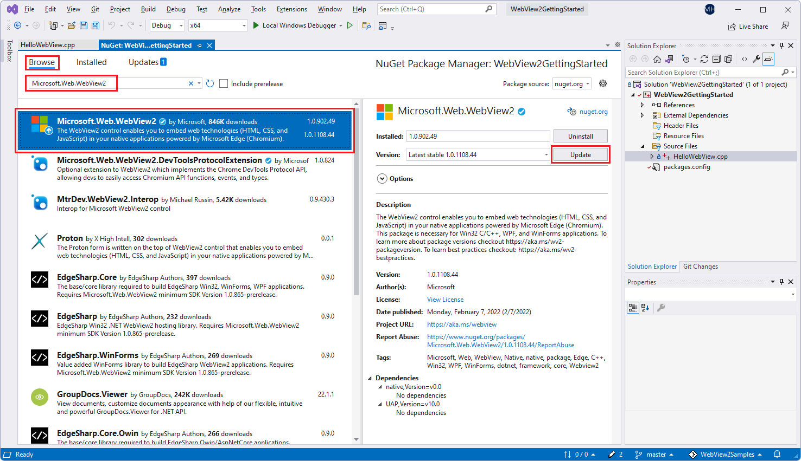

1. Close the **NuGet Package Manager** tab.

The WebView2 SDK is now updated or installed, so your development environment is now set up to add WebView2 features to your Win32 app.

Continue with the steps below.


<!-- ====================================================================== -->
## Step 9 - Optionally delete the WebView2 code from HelloWebView.cpp

If you want to follow the steps below to add the WebView2 code to `HelloWebView.cpp` yourself, delete the two blocks of WebView2 code, as follows:

1. In `HelloWebView.cpp`, delete the following code:

    :::code language="cpp" source="../code/sample/GettingStartedGuides/Win32_GettingStarted/HelloWebView.cpp" id="IncludeHeader":::

1. In `HelloWebView.cpp`, delete the lines of code that are in between these two comment lines, but keep these two comment lines:

   ```cpp
   // <-- WebView2 sample code starts here -->
   ...
   // <-- WebView2 sample code ends here -->
   ```

<!-- ====================================================================== -->
## Step 10 - Include the WebView2.h header in HelloWebView.cpp

Above, we did the following:
*  Cloned or downloaded the samples repo including an existing project that contains a standard C++ Windows desktop application.
*  Updated or installed the Windows Implementation Library (WIL).
*  Updated or installed the WebView2 SDK, to add WebView2 features.
*  Optionally deleted the WebView2 code from `HelloWebView.cpp`.

---

Next, add WebView2 features to the app, as follows:

1. In Visual Studio, make sure the **WebView2GettingStarted** solution is open.

1. In Solution Explorer, expand **Source Files** and then click `HelloWebView.cpp`.

1. If the following code isn't already present, paste the following code in `HelloWebView.cpp`, after the last `#include` line:

    :::code language="cpp" source="../code/sample/GettingStartedGuides/Win32_GettingStarted/HelloWebView.cpp" id="IncludeHeader":::

   Make sure that the `include` section looks like the following:

   ```cpp
   ...
   #include <wrl.h>
   #include <wil/com.h>
   // include WebView2 header
   #include "WebView2.h"
   ```

1. Note the headers used:

   *  `wrl.h` -  Windows Runtime C++ Template Library (WRL) - A template library that provides a low-level way to author and use Windows Runtime components.

   * `wil/com.h` - Windows Implementation Libraries (WIL) - A header-only C++ library to make life easier for developers on Windows through readable, type-safe C++ interfaces for common Windows coding patterns.

   *  `WebView2.h` - The WebView2 control is powered by Microsoft Edge, and enables you to embed web technologies (HTML, CSS, and JavaScript) in your native applications.

1. Select **File** > **Save All** (**Ctrl+Shift+S**) to save the project.

The source code file and project is ready to use and build against the WebView2 API.

Continue with the steps below.


<!-- ====================================================================== -->
## Step 11 - Build your empty sample app

1. Select **Debug** > **Start debugging** (**F5**) to build and run the project.

   The sample app opens and displays an empty window:

   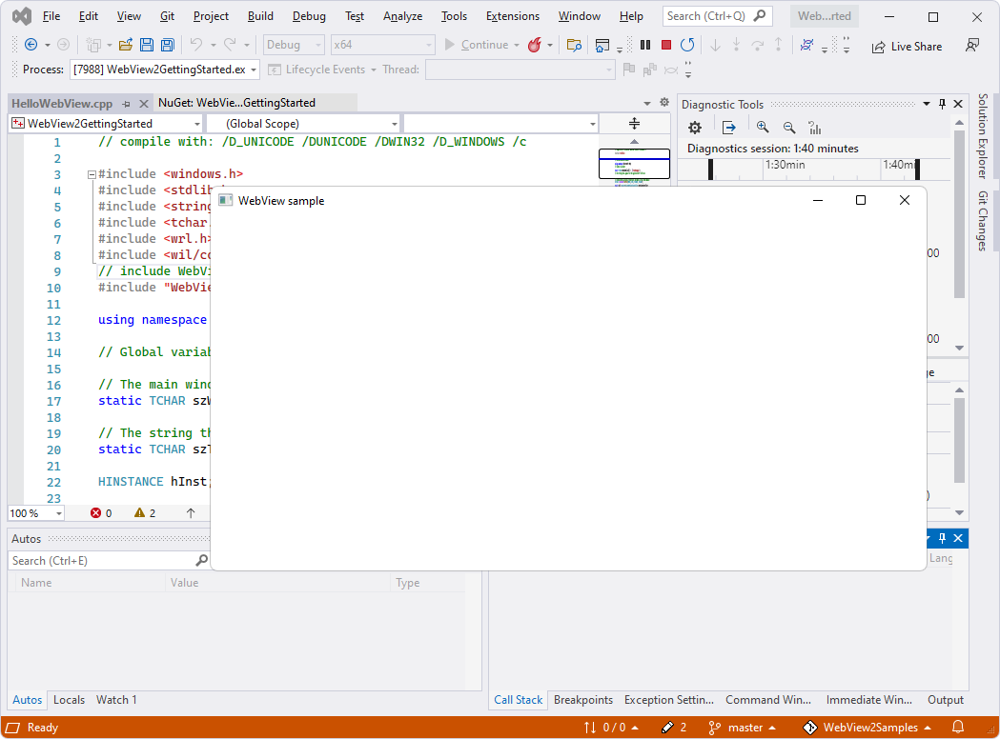

   You now have a running, empty Win32 desktop app with potential WebView2 capabilities.

1. Close the **WebView sample** app window.

Continue with the steps below.


<!-- ====================================================================== -->
## Step 12 - Add a WebView2 control in the parent window

Next, add a WebView2 control to the main window.

You'll use the `CreateCoreWebView2Environment` method to set up the environment and locate the Microsoft Edge browser powering the control.

Note that if you want to override the following defaults, you can instead use the "with options" version of that method, `CreateCoreWebView2EnvironmentWithOptions`:
*  Browser location
*  User data folder
*  Browser flags

Upon completion of the `CreateCoreWebView2Environment` method, you'll:

*  Run the `ICoreWebView2Environment::CreateCoreWebView2Controller` method inside the `ICoreWebView2CreateCoreWebView2EnvironmentCompletedHandler` callback.

*  Run the `ICoreWebView2Controller::get_CoreWebView2` method to get the associated WebView2 control.

Now to do the above, in the callback, you'll:
*  Set a few more settings.
*  Resize the WebView2 control to fill 100% of the parent window.
*  Then display the Bing.com website in the WebView2 control in your Win32 app.

---

1. In `HelloWebView.cpp`, locate the following code:

   ```cpp
      UpdateWindow(hWnd);
   
      // <-- WebView2 sample code starts here -->
   ```
   
1. If the following code isn't already present, paste the following code into `HelloWebView.cpp`.  Paste the code in between the lines `// <-- WebView2 sample code starts here -->` and `// <-- WebView2 sample code ends here -->`:

   ```cpp
   // Step 3 - Create a single WebView within the parent window
   // Locate the browser and set up the environment for WebView
   CreateCoreWebView2EnvironmentWithOptions(nullptr, nullptr, nullptr,
      Callback<ICoreWebView2CreateCoreWebView2EnvironmentCompletedHandler>(
         [hWnd](HRESULT result, ICoreWebView2Environment* env) -> HRESULT {

            // Create a CoreWebView2Controller and get the associated CoreWebView2 whose parent is the main window hWnd
            env->CreateCoreWebView2Controller(hWnd, Callback<ICoreWebView2CreateCoreWebView2ControllerCompletedHandler>(
               [hWnd](HRESULT result, ICoreWebView2Controller* controller) -> HRESULT {
                  if (controller != nullptr) {
                     webviewController = controller;
                     webviewController->get_CoreWebView2(&webview);
                  }

                  // Add a few settings for the webview
                  // The demo step is redundant since the values are the default settings
                  wil::com_ptr<ICoreWebView2Settings> settings;
                  webview->get_Settings(&settings);
                  settings->put_IsScriptEnabled(TRUE);
                  settings->put_AreDefaultScriptDialogsEnabled(TRUE);
                  settings->put_IsWebMessageEnabled(TRUE);

                  // Resize WebView to fit the bounds of the parent window
                  RECT bounds;
                  GetClientRect(hWnd, &bounds);
                  webviewController->put_Bounds(bounds);

                  // Schedule an async task to navigate to Bing
                  webview->Navigate(L"https://www.bing.com/");

                  // Step 4 - Navigation events

                  // Step 5 - Scripting

                  // Step 6 - Communication between host and web content

                  return S_OK;
               }).Get());
            return S_OK;
         }).Get());
   ```

1. Select **File** > **Save All** (**Ctrl+Shift+S**) to save the project.


<!-- ------------------------------ -->
#### Build your Bing sample app

1. Press **F5** to build and run the project.

   If you started by deleting all of the WebView2 code, at this point, you now have a Win32 window that's filled with a WebView2 control that's filled with webpage content:

   

1. Close the **WebView sample** app window.

   Or, if you kept all of the WebView2 code, at this point, a pop-up WebView2 window with an alert dialog from Bing opens, over an empty WebView2 window.  Click the **OK** button to close the Bing dialog.  Now the WebView2 control is filled by Bing page content:

   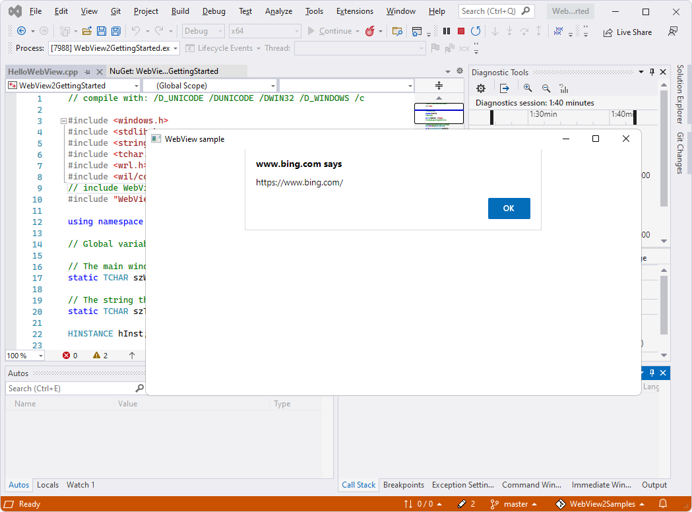

1. If the **WebView sample** app window is open, close it.

Continue with the steps below.


<!--
maintenance link (keep)
* [Navigation events for WebView2 apps](../concepts/navigation-events.md) - main copy; update it and then propagate/copy to these h2 sections:
-->
<!-- ====================================================================== -->
## Step 13 - Navigation events

In the previous step, we discussed navigating to URL by using the `ICoreWebView2::Navigate` method.  During navigation, WebView2 fires a sequence of events, which the host can listen for:

1. `NavigationStarting`
1. `SourceChanged`
1. `ContentLoading`
1. `HistoryChanged`
1. `NavigationCompleted`

   If you want more information now, in a new window or tab, see [Navigation events for WebView2 apps](../concepts/navigation-events.md).


In error cases, one or more of the following events may occur, depending on whether the navigation continued to an error webpage:

*  `SourceChanged`
*  `ContentLoading`
*  `HistoryChanged`

If an HTTP redirect occurs, there are multiple `NavigationStarting` events in a row.

---

As an example of using navigation events, register a handler for the `NavigationStarting` event, to cancel any non-https (non-secure) requests, as follows.

1. If it's not already present, paste the following code into `HelloWebView.cpp`, below the Step 3 code:

    :::code language="cpp" source="../code/sample/GettingStartedGuides/Win32_GettingStarted/HelloWebView.cpp" id="NavigationEvents":::

Now the app doesn't open any non-https sites.  You can use a similar mechanism to accomplish other tasks, such as restricting navigation to within your own domain.

<!-- 1. Try opening http vs https urls. -->

Continue with the steps below.


<!-- ====================================================================== -->
## Step 14 - Scripting

Use host apps to inject JavaScript code into WebView2 controls at runtime.  You can task WebView2 to run arbitrary JavaScript or add initialization scripts.  The injected JavaScript applies to all new top-level documents and any child frames until the JavaScript is removed.

The injected JavaScript is run with specific timing:

*  Run it after the creation of the global object.
*  Run it before any other script included in the HTML document is run.

---

1. If the following code isn't present already, paste the following code into `HelloWebView.cpp`:

    :::code language="cpp" source="../code/sample/GettingStartedGuides/Win32_GettingStarted/HelloWebView.cpp" id="Scripting":::

1. Select **File** > **Save All** (**Ctrl+Shift+S**) to save the project.

   Now, WebView2 freezes the `Object` and returns the page document once.

<!-- This accomplishes & demonstrates X.  This is interesting and relevant because X. -->


<!-- ------------------------------ -->
#### If code must be run in order, use callbacks

The script injection APIs (and some other WebView2 APIs) are asynchronous.  So, if code must be run in a specific order, you should use callbacks.

<!-- You now have X.  The app now X. -->

Continue with the steps below.


<!-- ====================================================================== -->
## Step 15 - Communication between host and web content

The host and the web content can also communicate with each other through the `postMessage` method.  The web content running within a WebView2 control can post to the host through the `window.chrome.webview.postMessage` method, and the message is handled by any registered `ICoreWebView2WebMessageReceivedEventHandler` event handler on the host.

Similarly, the host can message the web content through the `ICoreWebView2::PostWebMessageAsString` or `ICoreWebView2::PostWebMessageAsJSON` method, and the message is caught by handlers that are added from the `window.chrome.webview.addEventListener` listener.  This communication mechanism allows the web content to use native capabilities by passing messages to ask the host to run native APIs.

As an example to understand the mechanism, the following steps occur when you try to output the document URL in WebView2:

1. The host registers a handler to return received message back to the web content.

1. The host injects a script to the web content that registers a handler to print message from the host.

1. The host injects a script to the web content that posts the URL to the host.

1. The handler of the host is triggered and returns the message (the URL) to the web content.

1. The handler of the web content is triggered and prints message from the host (the URL).

---

Have the host app and web content communicate through `postMessage`, as follows:

1. If it's not already present, paste the following code into `HelloWebView.cpp`:

    :::code language="cpp" source="../code/sample/GettingStartedGuides/Win32_GettingStarted/HelloWebView.cpp" id="CommunicationHostWeb":::

1. Select **File** > **Save All** (**Ctrl+Shift+S**) to save the project.

1. Press **F5** to build and run the project.

   The sample app first opens a pop-up window, which displays the URL that will be loaded, along with an **OK** button:

   

1. Click the **OK** button to dismiss the pop-window and continue to the URL:

   The WebView2 window now displays webpage content: the Bing website, `http://www.bing.com`.

   <!-- instance 2 of bing-window.png -->
   

1. When you are ready, close the **WebView sample** window.


Congratulations, you've built a Win32 app that hosts and uses the WebView2 control!  Your development environment is now set up for WebView2 app development, to include the WebView2 control in your Win32 apps.  You've also had an introduction to WebView2 programming concepts.


<!-- ====================================================================== -->
## API Reference

* [API Reference for WebView2 Win32 C++](/microsoft-edge/webview2/reference/win32)
* [WebView2 API reference](/microsoft-edge/webview2/reference/win32) - API Reference for each platform.


<!-- ====================================================================== -->
## See also

* [WebView2 sample apps](../samples/index.md)
* [Windows Runtime C++ Template Library (WRL)](/cpp/cppcx/wrl/windows-runtime-cpp-template-library-wrl)
* [Windows Implementation Libraries (WIL)](https://github.com/Microsoft/wil) GitHub repo.
