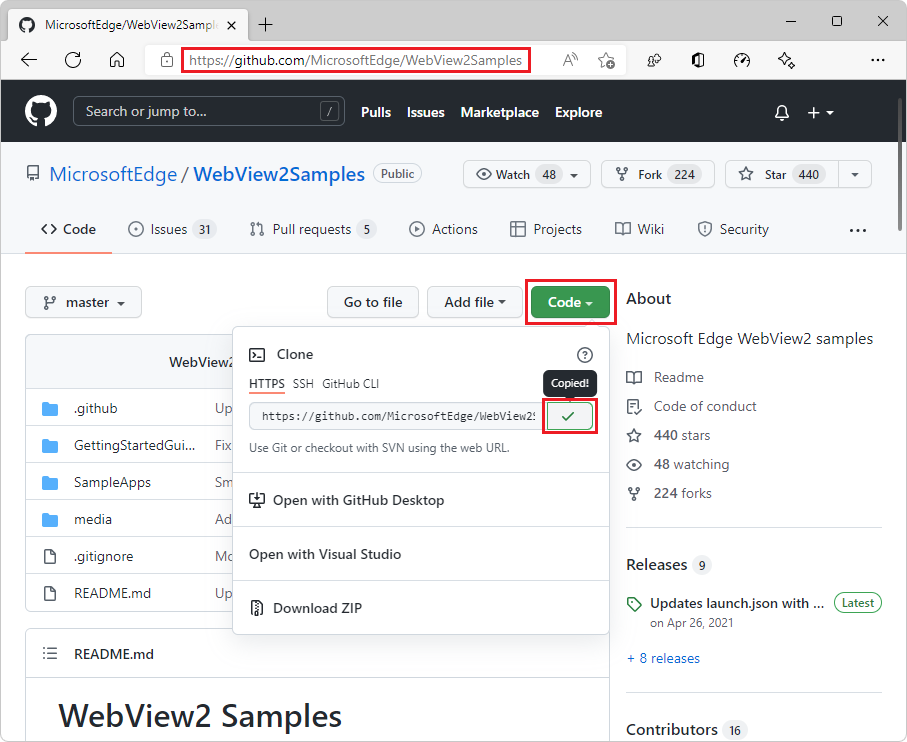
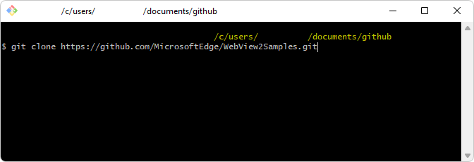
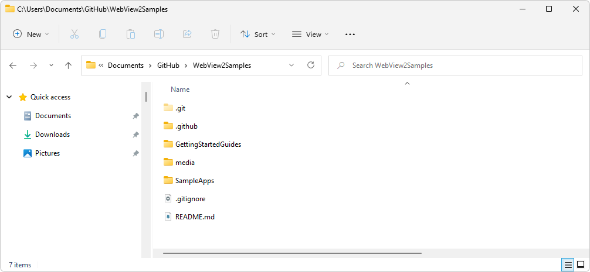
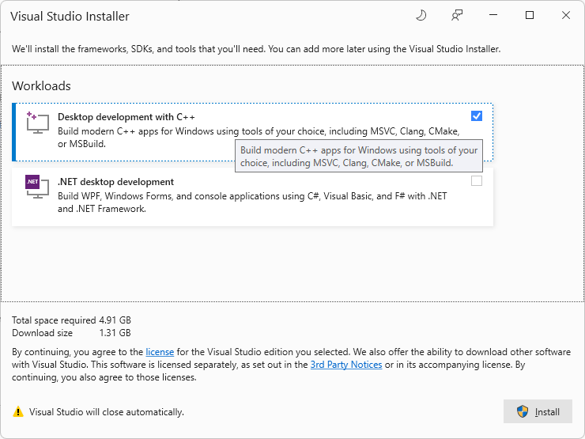
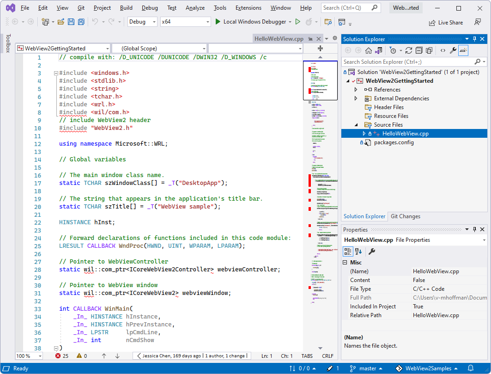

# Get started with WebView2 in Win32 apps

This article covers how to set up your development tools and create an initial WebView2 app for Win32, and learn about WebView2 concepts along the way.


**Leverages sample code from a standard C++ Win32 app:**

To keep this tutorial focused on WebView-specific coding, we start from an existing Microsoft Visual Studio project (`WebView2GettingStarted`) that's stored in the `WebView2Samples` GitHub repo.  We'll add WebView2 features - actually, the features have already been added, but follow along in the setup and explanation steps.

The existing Visual Studio project we'll start with is part of the sample code from a standard C++ Win32 desktop application.  For information about the underlying, standard Win32 app sample, in a new window or tab, see [Walkthrough: Create a traditional Windows Desktop application (C++)](/cpp/windows/walkthrough-creating-windows-desktop-applications-cpp).


**The WebView2 code has already been added:**

The code that you add in this tutorial's steps, has already been added to the sample repo, by this Pull Request in the `WebView2Samples` repo: [Make Win32 Getting Started Guide a ready-to-build project](https://github.com/MicrosoftEdge/WebView2Samples/pull/101).  This situation is clearly explained above each code block, so this tutorial should be smooth reading.

This means that you now skip figuring out where to paste the code blocks, and skip pasting them.  You now can speed through this article, focus on setting up your WebView2 app development environment, focus on understanding, and run the code right away.  The sample code is already completed per this tutorial and ready to run.


**Rewritten and clarified:**

This article has been greatly rewritten for clarity.  All action steps are now spelled out explicitly, alternating with conceptual explanations, with clear links to overview information - off to the side - about the several development tools and frameworks used.


**Visual Studio 2022 screenshots:**

Screenshots show the Visual Studio 2022 UI in Windows 11, with rounded corners.


<!-- ====================================================================== -->
## Step 1 - Install git, Visual Studio, and a preview channel of Microsoft Edge

First, install the following development software.

### Install git

1. If it's not already installed, [Download git](https://git-scm.com/downloads) and install it.  git will be used during cloning the `WebView2Samples` repo from GitHub, below.


### Install Visual Studio

1. Install [Visual Studio](https://visualstudio.microsoft.com) 2015 or later (such as Visual Studio Professional 2022), with **C++ support** installed.

   **Important:** This tutorial doesn't work with Microsoft **Visual Studio Code**; this tutorial is designed to use Microsoft **Visual Studio**.

   If you are installing Visual Studio 2022, you can accept the defaults for now; you can click **Install**, and decline installing the Workloads at this time.

   Initial setup of Visual Studio is done.  It's likely that additional Visual Studio setup dialogs will open later in this tutorial.


### Install a preview channel of Microsoft Edge

1. Install any [Microsoft Edge Insider (preview) Channel](https://www.microsoftedgeinsider.com/download) (Beta, Dev, or Canary) on a supported operating system (OS):
   *  Windows 7
   *  Windows 8.1
   *  Windows 10
   *  Windows 11

   We recommend using the Canary channel.  The minimum required version is 82.0.488.0.


### Install the WebView2 Runtime (optional)

1. Optionally, install the [WebView2 Runtime](https://developer.microsoft.com/microsoft-edge/webview2).

   If unsure, skip this step; you can use the Microsoft Edge preview channel from the previous step instead.

   If you want more information about this decision now, in a new window or tab, see [Understand WebView2 SDK versions](../concepts/versioning.md).

Continue with the steps below.


<!-- ====================================================================== -->
## Step 2 - Clone the WebView2Samples repo

Now, we'll clone an existing project that contains a standard C++ Windows desktop application.  First, learn a little about this repo.


### Learn about the WebView2Samples repo

1. In a new browser window or tab, briefly skim this top-level overview of the **WebView2Samples** repo: [Sample Code for WebView2](../code-samples-links.md).

1. In a new browser window or tab, briefly explore the repo's directory layout online at GitHub: [https://github.com/MicrosoftEdge/WebView2Samples/tree/master/SampleApps](https://github.com/MicrosoftEdge/WebView2Samples/tree/master/SampleApps).

   Next, at that repo, click the directories to learn how to go to the directory for this tutorial, and look at the listing for `HelloWebView.cpp`, as follows:

1. For the present setup process and tutorial, don't go into the `SampleApps` folder; instead, go into `GettingStartedGuides` > `Win32_GettingStarted`.  Notice `WebView2GettingStarted.sln`, and look in `HelloWebView.cpp`.

Then return here and continue with the steps below.


### Obtain the URL for cloning the WebView2Samples repo


1. Open the [WebView2Samples repo](https://github.com/MicrosoftEdge/WebView2Samples) in a new window or tab.

1. Click the green **Code** button in the upper right of the GitHub repo, select **Clone**, and then click the **Copy** icon (or, select the HTTPS URL string in the text box and copy it).

   

1. Decide which tool you want to use to locally clone (download) the repo:
   *  Visual Studio
   *  GitHub Desktop
   *  Git Bash shell or command prompt


Next, clone the GitHub repo to your local drive.  To do that, follow the appropriate steps below, for the tool you want to use.


### Cloning the repo by using Visual Studio

If you want to use Visual Studio to clone the GitHub repo to your local drive:

1. In Visual Studio, select **File** > **Clone repository**.

1. Enter the URL that you copied from the GitHub repo.

1. From within the same dialog box, or in a file explorer utility, you can create a general-purpose root `git` or `GitHub` folder in a writeable location, then select that directory, so that the repo will be cloned there, as a new directory.

   For example, you could create the repo in the parent folder: `C:\Users\myUserName\Documents\GitHub\`, so that the cloning operation will create the new directory `C:\Users\myUserName\Documents\GitHub\WebView2Samples`.

You've cloned the repo to your local drive.  Skip to the next major section below.


### Cloning the repo by using GitHub Desktop

If you want to use GitHub Desktop to clone the GitHub repo to your local drive:

1. Install [GitHub Desktop](https://desktop.github.com).

1. In GitHub Desktop, select **File** > **Clone repository**.

1. In Visual Studio or GitHub Desktop, enter the URL that you copied from the GitHub repo.

1. From within the same dialog box, or in a file explorer utility, you can create a general-purpose root `git` or `GitHub` folder in a writeable location, then select that directory, so that the repo will be cloned there, as a new directory.

   For example, you could create the repo in the parent folder: `C:\Users\myUserName\Documents\GitHub\`, so that the cloning operation will create the new directory `C:\Users\myUserName\Documents\GitHub\WebView2Samples`.

You've cloned the repo to your local drive.  Skip to the next major section below.


### Cloning the repo by using Git Bash shell or a command prompt

If you instead want to clone the repo by using a Git Bash shell or command prompt:

1. Clone the repo to your local drive, entering the URL string that you copied from the GitHub repo:

   ```Shell
   # example location where the repo directory will be added:
   cd c:/users/myusername/documents/github/
   git clone https://github.com/MicrosoftEdge/WebView2Samples.git
   ```

   

   The directory is created on your local drive, in the path you specified, such as in the following figure:

   

You've cloned the repo to your local drive.  Continue with the steps below.


<!-- ====================================================================== -->
## Step 3 - Open the existing Win32 single-window app (WebView2GettingStarted.sln)

You start with a basic desktop project that contains a single main window.  We'll start with an existing app project from the **WebView2Samples** repo, which you cloned from GitHub in the previous step.

1. Open Visual Studio (not Visual Studio Code).

1. Open `WebView2GettingStarted.sln`, which is located at the path: `<your repo directory>/WebView2Samples/GettingStartedGuides/Win32_GettingStarted/WebView2GettingStarted.sln`.


### Install the "Desktop development for C++" workload

Visual Studio Installer might open and prompt you to install a Workload:



If Visual Studio Installer prompts you to install a Workload:

1. Select the **Desktop development for C++** card so that a checkmark appears.

1. If you want, also select the **.NET desktop development** card (not needed for this tutorial), so that a checkmark appears on this card as well.

1. Click the **Install** button.

The Installer closes.


### Retarget Projects

The Visual Studio **Review Solution Actions** dialog might appear, prompting you whether you want to **Retarget Projects**:


1. If that dialog appears, you can click **OK**.


### Open HelloWebView.cpp from the WebView2GettingStarted project

The **WebView2GettingStarted** solution opens in Visual Studio.  The solution contains a single project: **WebView2GettingStarted**, which contains a single .cpp file: **HelloWebView.cpp**.

1. In Solution Explorer, expand the **Source Files** node, and then select **HelloWebView.cpp**.

   `HelloWebView.cpp` opens in the code editor of Visual Studio.

   

   This screenshot shows some WebView2 code (headers), that's already present in the file immediately after cloning (downloading) the repo.  Previously, that code was not added in the repo yet.  But now, all of the code for the present tutorial is already present in the repo.  This means that you don't actually need to do the copy/paste operations later in this tutorial.

   To confirm that the header lines are already already present in the repo: in a different window or tab, see [WebView2Samples/ ... /GettingStartedGuides/Win32_GettingStarted/HelloWebView.cpp](https://github.com/MicrosoftEdge/WebView2Samples/blob/master/GettingStartedGuides/Win32_GettingStarted/HelloWebView.cpp).

1. If it's not already present, paste the following code into `HelloWebView.cpp`:


### Set the solution to use the Win10 SDK and Visual Studio toolset

This step is only needed for older versions of Visual Studio, so it's likely you can skip it.  But you can take a look at this UI in any case:

1. In Visual Studio's **Solution Explorer**, right-click the **WebView2GettingStarted** _project_ (not the solution with the same name), and then select **Properties**.

1. Select **Configuration Properties** > **General**, and then (if it's not the correct setting already):

   1. Modify **Windows SDK Version** to use the Win10 SDK.

   1. Modify **Platform Toolset** to use a Visual Studio toolset.

   These modifications are only necessary for older<!--define--> versions of Visual Studio.

   Here's a Visual Studio 2017 screenshot showing some valid settings:

   :::image type="content" source="../media/tool-version.png" alt-text="Tool version." lightbox="../media/tool-version.png":::

   The following is a Visual Studio 2022 screenshot; the values were already correct, so no change was required:

   :::image type="content" source="../media/tool-version.png" alt-text="Tool version." lightbox="../media/tool-version-2022.png":::

Visual Studio might display errors, because your project is missing the WebView2 header file.  The errors resolve after completing the next section, "Install the WebView2 SDK".

Continue with the steps below.


<!-- ====================================================================== -->
## Step 4 - Install the Windows Implementation Library (WIL)


### Learn about Windows Implementation Libraries (WIL)

In a moment, below you'll install the following two tools, which make working with COM easier for this tutorial:

*  **Windows Implementation Libraries (WIL)** - A header-only C++ library to make life easier for developers on Windows through readable, type-safe C++ interfaces for common Windows coding patterns.

*  **Windows Runtime C++ Template Library (WRL)** - A template library that provides a low-level way to author and use Windows Runtime components.

We didn't do this tooling setup step before cloning the solution, because this setup step requires that the cloned solution be opened in Visual Studio.  With this approach, we install the **Microsoft.Windows.ImplementationLibrary** NuGet package through Solution Explorer in Visual Studio, through the **WebView2GettingStarted** _project_ (not the solution with the same name).

First, learn a little about these tools, but don't download or install them yet:

1. In a separate window or tab, briefly check out the [Windows Implementation Libraries (WIL)](https://github.com/Microsoft/wil) GitHub repo - but don't clone, download, or install it from there.

1. In a separate window or tab, briefly check out the the [Windows Runtime C++ Template Library (WRL)](/cpp/cppcx/wrl/windows-runtime-cpp-template-library-wrl?view=vs-2019&preserve-view=true) - but don't clone, download, or install it from there.
<!--clickable full link:
https://docs.microsoft.com/en-us/cpp/cppcx/wrl/windows-runtime-cpp-template-library-wrl?view=msvc-170&preserve-view=true&viewFallbackFrom=vs-2019
-->

Now install the above tools from within Visual Studio, by following the steps below.


### Install Windows Implementation Libraries (WIL)

1. In Visual Studio, make sure that the **WebView2GettingStarted** solution is still open.

1. In **Solution Explorer**, right-click the **WebView2GettingStarted** project node (not the **WebView2GettingStarted** solution node) and then select **Manage NuGet Packages**.

   :::image type="content" source="../media/manage-nuget-packages.png" alt-text="Manage NuGet packages." lightbox="../media/manage-nuget-packages.png":::

1. In the **NuGet** window, click the **Browse** tab.

1. Paste or type the following into the search bar in the upper left, and then select **Microsoft.Windows.ImplementationLibrary**.

   ```
   Microsoft.Windows.ImplementationLibrary
   ```

   :::image type="content" source="../media/wil.png" alt-text="Selecting Microsoft.Windows.ImplementationLibrary in the Visual Studio NuGet installer page." lightbox="../media/wil.png":::

   If you don't see **Microsoft.Windows.ImplementationLibrary** listed, check the NuGet source location, as follows:

   1. Select **Tools** > **Options** > **NuGet Package Manager** > **Package Sources**.

   1. Make sure that in **Package sources** there is a **nuget.com** source pointing to `https://api.nuget.org/v3/index.json`.

   1. If **Package sources** doesn't contain that source, enter `nuget.com` in the **Name** text box and `https://api.nuget.org/v3/index.json` in the **Source** text box. Then click **Update** and **OK**.

1. Toward the upper right, click the **Install** button (or the **Update** button).  NuGet downloads the Windows Implementation Library (WIL) to your machine.

Windows Implementation Libraries (WIL) is now installed, along with Windows Runtime C++ Template Library (WRL).

Continue with the steps below.


<!-- ====================================================================== -->
## Step 5 - Install the WebView2 SDK

Next, you'll install the WebView2 SDK.  The WebView2 SDK includes the WebView2 control, which enables you to embed web technologies (HTML, CSS, and JavaScript) in your native applications powered by Microsoft Edge.

We won't download the `Microsoft.Web.WebView2` SDK NuGet package from nuget.org.<!--https://www.nuget.org/packages/Microsoft.Web.WebView2-->  We didn't do this tooling setup step before cloning the Windows desktop sample app solution (which is part of the `WebView2Samples` repo).  Instead, we'll install the WebView2 SDK NuGet package through the **NuGet Package Manager** panel in Visual Studio.

Install the WebView2 SDK, as follows:

1. Make sure that in Visual Studio, you're in the **NuGet Package Manager** tab, which you opened in the above section.

1. In the **NuGet** window, click the **Browse** tab.

1. On the right of the search bar, clear the **Include prerelease** checkbox.  We won't install a pre-release SDK version at this time.

1. Paste or type the following into the search bar in the upper left, and then select **Microsoft.Web.WebView2**.

   ```
   Microsoft.Web.WebView2
   ```

1. In the right-hand side window, click **Install** (or **Update**).  NuGet downloads the WebView2 SDK to your machine.

   :::image type="content" source="../media/nuget.png" alt-text="NuGet Package Manager." lightbox="../media/nuget.png":::

1. Close the **NuGet Package Manager** tab.

The WebView2 SDK is now installed, so your development environment is now set up to add WebView2 features to your Win32 app.

Continue with the steps below.


<!-- ====================================================================== -->
## Step 6 - Add a WebView2 header to your project

Above, we did the following:

*  Cloned an existing project that contains a standard C++ Windows desktop application.

*  Installed the Windows Implementation Library (WIL).  WIL is a header-only C++ library with readable, type-safe C++ interfaces for common Windows coding patterns.

*  Installed the WebView2 SDK, to add WebView2 features.

Now we can add WebView2 features to the app.

1. In Visual Studio, make sure the **WebView2GettingStarted** solution is open.

   Or, check whether the below code is already present in the repo: in a new window or tab, see [WebView2Samples/ ... /GettingStartedGuides/Win32_GettingStarted/HelloWebView.cpp](https://github.com/MicrosoftEdge/WebView2Samples/blob/master/GettingStartedGuides/Win32_GettingStarted/HelloWebView.cpp).

1. Inspect `HelloWebView.cpp`, to see if these two lines are already present in the downloaded file.  If these lines aren't already present, paste the following code in `HelloWebView.cpp`, after the last `#include` line:

   ```cpp
   // include WebView2 header
   #include "WebView2.h"
   ```
   
   The `include` section should look like this:

   ```cpp
   ...
   #include <wrl.h>
   #include <wil/com.h>
   // include WebView2 header
   #include "WebView2.h"
   ```

The source code file and project is ready to use and build against the WebView2 API.

Continue with the steps below.


<!-- ====================================================================== -->
## Step 7 - Build your empty sample app

1. Select **File** > **Save All** (`Ctrl`+`Shift`+`S`) to save the project.

1. Select **Debug** > **Start debugging** (`F5`) to build and run the project.

   The sample app opens and displays an empty window:

   :::image type="content" source="../media/empty-app.png" alt-text="The sample app displays an empty window." lightbox="../media/empty-app.png":::

You now have a running, empty Win32 desktop app with potential WebView2 capabilities.

Continue with the steps below.


<!-- ====================================================================== -->
## Step 8 - Add a WebView2 control in the parent window

Next, add a WebView2 control to the main window.

You'll use the `CreateCoreWebView2Environment` method to set up the environment and locate the Microsoft Edge browser powering the control.

Note that if you want to override the following defaults, you can instead use the "with options" version of that method, `CreateCoreWebView2EnvironmentWithOptions`:
*  Browser location
*  User data folder
*  Browser flags

Upon completion of the `CreateCoreWebView2Environment` method, you'll:

*  Run the `ICoreWebView2Environment::CreateCoreWebView2Controller` method inside the `ICoreWebView2CreateCoreWebView2EnvironmentCompletedHandler` callback.

*  Run the `ICoreWebView2Controller::get_CoreWebView2` method to get the associated WebView.

Now to do the above, in the callback, you'll:
*  Set a few more settings.
*  Resize the WebView2 control to fill 100% of the parent window.
*  Then display the Bing.com website in the WebView2 control in your Win32 app.

1. In `HelloWebView.cpp`, use `Ctrl`+`F` to try to find some of the following code.

   Or, check whether the below code is already present in the repo: in a new window or tab, see [WebView2Samples/ ... /GettingStartedGuides/Win32_GettingStarted/HelloWebView.cpp](https://github.com/MicrosoftEdge/WebView2Samples/blob/master/GettingStartedGuides/Win32_GettingStarted/HelloWebView.cpp).

1. If the following code isn't present already, paste the following code into `HelloWebView.cpp`.  Paste the code in between the lines `// <-- WebView2 sample code starts here -->` and `// <-- WebView2 sample code ends here -->`:

   ```cpp
   // Step 3 - Create a single WebView within the parent window
   // Locate the browser and set up the environment for WebView
   CreateCoreWebView2EnvironmentWithOptions(nullptr, nullptr, nullptr,
      Callback<ICoreWebView2CreateCoreWebView2EnvironmentCompletedHandler>(
         [hWnd](HRESULT result, ICoreWebView2Environment* env) -> HRESULT {
   
               // Create a CoreWebView2Controller and get the associated CoreWebView2 whose parent is the main window hWnd
               env->CreateCoreWebView2Controller(hWnd, Callback<ICoreWebView2CreateCoreWebView2ControllerCompletedHandler>(
                  [hWnd](HRESULT result, ICoreWebView2Controller* controller) -> HRESULT {
                  if (controller != nullptr) {
                     webviewController = controller;
                     webviewController->get_CoreWebView2(&webviewWindow);
                  }
   
                  // Add a few settings for the webview
                  // The demo step is redundant since the values are the default settings
                  ICoreWebView2Settings* Settings;
                  webviewWindow->get_Settings(&Settings);
                  Settings->put_IsScriptEnabled(TRUE);
                  Settings->put_AreDefaultScriptDialogsEnabled(TRUE);
                  Settings->put_IsWebMessageEnabled(TRUE);
   
                  // Resize the WebView2 control to fit the bounds of the parent window
                  RECT bounds;
                  GetClientRect(hWnd, &bounds);
                  webviewController->put_Bounds(bounds);
   
                  // Schedule an async task to navigate to Bing
                  webviewWindow->Navigate(L"https://www.bing.com/");
   
                  // 4 - Navigation events
   
                  // 5 - Scripting
   
                  // 6 - Communication between host and web content
   
                  return S_OK;
               }).Get());
         return S_OK;
      }).Get());
   ```

### Build your Bing sample app

1. Select **File** > **Save All (Ctrl+Shift+S)** to save the project.

1. Press **F5** to build and run the project.

   Note: The code to open a Bing dialog wasn't present yet, in a past version of the repo and tutorial, but now it is.

   An alert dialog from Bing opens, against a blank background window:

   :::image type="content" source="../media/empty-app-with-bing-dialog.png" alt-text="The sample app displays an initially empty window with a Bing dialog box." lightbox="../media/empty-app.png":::

1. Click the **OK** button to close the Bing dialog box.

   Now the WebView2 control is filled by the Bing page content:

   :::image type="content" source="../media/bing-window.png" alt-text="Bing window." lightbox="../media/bing-window.png":::

You now have an app with WebView content.

Continue with the steps below.


<!-- ====================================================================== -->
## Step 9 - Navigation events

In the previous step, we discussed navigating to URL by using the `ICoreWebView2::Navigate` method.  During navigation, WebView2 fires a sequence of events, which the host can listen for:

1. `NavigationStarting`
1. `SourceChanged`
1. `ContentLoading`
1. `HistoryChanged`
1. `NavigationCompleted`

   If you want more information now, in a new window or tab, see [Navigation events for WebView2 apps](../concepts/navigation-events.md).

:::image type="content" source="../media/navigation-events.png" alt-text="Navigation events." lightbox="../media/navigation-events.png":::

In error cases, one or more of the following events may occur, depending on whether the navigation continued to an error webpage:

*  `SourceChanged`
*  `ContentLoading`
*  `HistoryChanged`

If an HTTP redirect occurs, there are multiple `NavigationStarting` events in a row.


### Use navigation events to prevent going to HTTP (non-secure) URLs

As an example of using navigation events, register a handler for the `NavigationStarting` event, to cancel any non-https (non-secure) requests, as follows.

1. In `HelloWebView.cpp`, use `Ctrl`+`F` to try to find some of the code from the listing below.

   Or, check whether the below code is already present in the repo: in a new window or tab, see [WebView2Samples/ ... /GettingStartedGuides/Win32_GettingStarted/HelloWebView.cpp](https://github.com/MicrosoftEdge/WebView2Samples/blob/master/GettingStartedGuides/Win32_GettingStarted/HelloWebView.cpp).

1. If it's not already present, paste the following code into `HelloWebView.cpp`:

   ```cpp
   // Step 4 - Navigation events
   // register an ICoreWebView2NavigationStartingEventHandler to cancel any non-https navigation
   EventRegistrationToken token;
   webviewWindow->add_NavigationStarting(Callback<ICoreWebView2NavigationStartingEventHandler>(
      [](ICoreWebView2* webview, ICoreWebView2NavigationStartingEventArgs * args) -> HRESULT {
         PWSTR uri;
         args->get_Uri(&uri);
         std::wstring source(uri);
         if (source.substr(0, 5) != L"https") {
               args->put_Cancel(true);
         }
         CoTaskMemFree(uri);
         return S_OK;
      }).Get(), &token);
   ```

Now the app doesn't open any non-https sites.  You can use a similar mechanism to accomplish other tasks, such as restricting navigation to within your own domain.

<!-- 1. Try opening http vs https urls. -->

Continue with the steps below.


<!-- ====================================================================== -->
## Step 10 - Scripting

Use host apps to inject JavaScript code into WebView2 controls at runtime.  You can task WebView2 to run arbitrary JavaScript or add initialization scripts.  The injected JavaScript applies to all new top-level documents and any child frames until the JavaScript is removed.

The injected JavaScript is run with specific timing:

*  Run it after the creation of the global object.
*  Run it before any other script included in the HTML document is run.

1. In `HelloWebView.cpp`, use `Ctrl`+`F` to try to find some of the code from the listing below.

   Or, check whether the below code is already present in the repo: in a new window or tab, see [WebView2Samples/ ... /GettingStartedGuides/Win32_GettingStarted/HelloWebView.cpp](https://github.com/MicrosoftEdge/WebView2Samples/blob/master/GettingStartedGuides/Win32_GettingStarted/HelloWebView.cpp).

1. If it's not already present, paste the following code into `HelloWebView.cpp`:

   ```cpp
   // Step 5 - Scripting
   // Schedule an async task to add initialization script that freezes the Object object
   webviewWindow->AddScriptToExecuteOnDocumentCreated(L"Object.freeze(Object);", nullptr);
   // Schedule an async task to get the document URL
   webviewWindow->ExecuteScript(L"window.document.URL;", Callback<ICoreWebView2ExecuteScriptCompletedHandler>(
      [](HRESULT errorCode, LPCWSTR resultObjectAsJson) -> HRESULT {
         LPCWSTR URL = resultObjectAsJson;
         //doSomethingWithURL(URL);
         return S_OK;
      }).Get());
   ```

   Now, WebView2 freezes the `Object` and returns the page document once.

<!-- This accomplishes & demonstrates X.  This is interesting and relevant because X. -->


### If code must be run in order, use callbacks

The script injection APIs (and some other WebView2 APIs) are asynchronous.  So, if code must be run in a specific order, you should use callbacks.

<!-- You now have X.  The app now X. -->

Continue with the steps below.


<!-- ====================================================================== -->
## Step 11 - Communication between host and web content

The host and the web content can also communicate with each other through the `postMessage` method.  The web content running within a WebView2 control can post to the host through the `window.chrome.webview.postMessage` method, and the message is handled by any registered `ICoreWebView2WebMessageReceivedEventHandler` event handler on the host.

Similarly, the host can message the web content through the `ICoreWebView2::PostWebMessageAsString` or `ICoreWebView2::PostWebMessageAsJSON` method, and the message is caught by handlers that are added from the `window.chrome.webview.addEventListener` listener.  This communication mechanism allows the web content to use native capabilities by passing messages to ask the host to run native APIs.

As an example to understand the mechanism, the following steps occur when you try to output the document URL in WebView:

1. The host registers a handler to return received message back to the web content.

1. The host injects a script to the web content that registers a handler to print message from the host.

1. The host injects a script to the web content that posts the URL to the host.

1. The handler of the host is triggered and returns the message (the URL) to the web content.

1. The handler of the web content is triggered and prints message from the host (the URL).


### Example

1. In `HelloWebView.cpp`, use `Ctrl`+`F` to try to find some of the code from the listing below.

   Or, check whether the below code is already present in the repo: in a new window or tab, see [WebView2Samples/ ... /GettingStartedGuides/Win32_GettingStarted/HelloWebView.cpp](https://github.com/MicrosoftEdge/WebView2Samples/blob/master/GettingStartedGuides/Win32_GettingStarted/HelloWebView.cpp).

1. If it's not already present, paste the following code into `HelloWebView.cpp`:

   ```cpp
   // Step 6 - Communication between host and web content
   // Set an event handler for the host to return received message back to the web content
   webviewWindow->add_WebMessageReceived(Callback<ICoreWebView2WebMessageReceivedEventHandler>(
      [](ICoreWebView2* webview, ICoreWebView2WebMessageReceivedEventArgs * args) -> HRESULT {
         PWSTR message;
         args->TryGetWebMessageAsString(&message);
         // processMessage(&message);
         webview->PostWebMessageAsString(message);
         CoTaskMemFree(message);
         return S_OK;
      }).Get(), &token);
   
   // Schedule an async task to add initialization script that
   // 1) Add an listener to print message from the host
   // 2) Post document URL to the host
   webviewWindow->AddScriptToExecuteOnDocumentCreated(
      L"window.chrome.webview.addEventListener(\'message\', event => alert(event.data));" \
      L"window.chrome.webview.postMessage(window.document.URL);",
   nullptr);
   ```

1. Select **File** > **Save All (Ctrl+Shift+S)** to save the project.

1. Press **F5** to build and run the project.

   The URL appears in a pop-up window before navigating to a webpage.  The sample app with a Webview2 control displays the Bing website, `http://www.bing.com`.  The sample app also displays an **OK** button.  Users click **OK** to continue to the URL.

   :::image type="content" source="../media/show-url.png" alt-text="The sample app displays the Bing website." lightbox="../media/show-url.png":::
<!-- copy content of png from new png __ -->
Congratulations, you built your first WebView2 app!


<!-- ====================================================================== -->
## See also

* [Microsoft Edge WebView2](https://developer.microsoft.com/microsoft-edge/webview2) - initial introduction to WebView2 features at developer.microsoft.com.
* [Manage user data folders](../concepts/user-data-folder.md)
* [WebView2 Samples](https://github.com/MicrosoftEdge/WebView2Samples)
* [API Reference for WebView2 Win32 C++](/microsoft-edge/webview2/reference/win32)
* [WebView2 API reference](/microsoft-edge/webview2/reference/win32) - API Reference for each platform.


<!-- ====================================================================== -->
## Next steps

To learn more about WebView2 functions not covered in this article, see the following resources.

* [Sample Code for WebView2](../code-samples-links.md) - a guide to the samples in the **WebView2Samples** repo.
   * [WebView2Samples repo](https://github.com/MicrosoftEdge/WebView2Samples) - a comprehensive example of WebView2 capabilities.
   * [Win32 Sample Code](https://github.com/MicrosoftEdge/WebView2Samples/tree/master/GettingStartedGuides/Win32_GettingStarted) - the code used in this tutorial.
* [Development best practices for WebView2 apps](../concepts/developer-guide.md)
* [WebView2 API Sample](https://github.com/MicrosoftEdge/WebView2Samples/blob/master/SampleApps/WebView2APISample/README.md) - a comprehensive example of WebView2 capabilities.
* [WebView2Browser](https://github.com/MicrosoftEdge/WebView2Browser) - a WebView2 sample app.
