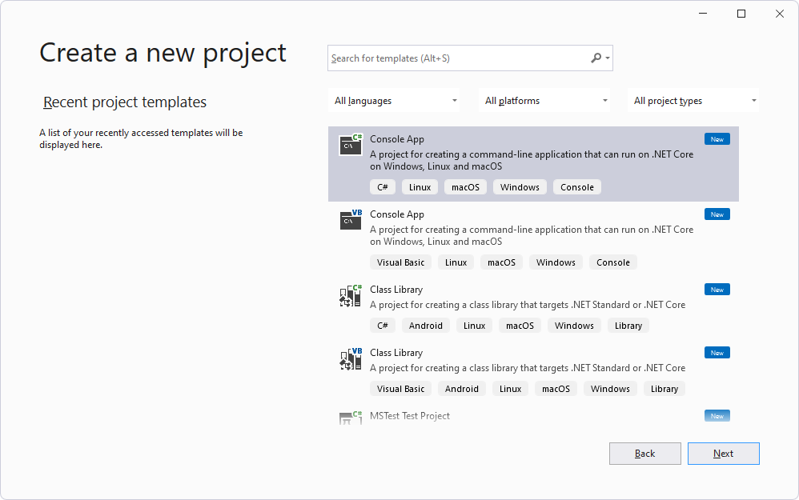

# Get started with WebView2 in WinForms apps

<!-- errors experienced with vs2022 by following these instructions:
1. The addressbar text box & Go button shift to the right when alt+tab to the Form1 window. 
2. The previus screenshots showed a gray bar above the Microsoft.com white nav bar.  Where did that gray bar come, that pushed the Microsoft.com white nav bar down to make space for our added UI?
Even if we add a gray bar (reserved UI space) at top of window, the alert might overlay our added UI - or it might be pushed down out of the way by the gray bar if a gray backgroun bar (reserved UI space) is somehow added at top.
-->

This article covers how to set up your development tools and create an initial WebView2 app for the WinForms platform, and learn about WebView2 concepts along the way.

To use this article, do either of the following:

*  Create a new project in Visual Studio, using the steps below.  If you want to see the completed project, you can see the [WinForms_GettingStarted](https://github.com/MicrosoftEdge/WebView2Samples/tree/master/GettingStartedGuides/WinForms_GettingStarted) directory in the `WebView2Samples` repo.

*  Download or clone the `WebView2Samples` repo, open the completed project in Visual Studio, and follow the steps in this article to understand creating the WinForms project and understand the added WebView2 code.


<!-- ====================================================================== -->
## Step 1 - Install Visual Studio and a Microsoft Edge preview channel

### Install Visual Studio

1. If Visual Studio isn't installed already, open the page [Microsoft Visual Studio](https://visualstudio.microsoft.com) in a new window or tab, and install Visual Studio 2017 or later, such as Visual Studio 2022 Professional.

   Then return here and continue below.


### Install a preview channel of Microsoft Edge

1. Install any [Microsoft Edge Insider (preview) Channel](https://www.microsoftedgeinsider.com/download) (Beta, Dev, or Canary) on a supported operating system (OS):
   *  Windows 7
   *  Windows 8.1
   *  Windows 10
   *  Windows 11

   We recommend using the Canary channel.  The minimum required version is 82.0.488.0.


### Install the WebView2 Runtime (optional)

1. Optionally, install the [WebView2 Runtime](https://developer.microsoft.com/microsoft-edge/webview2).

   If unsure, skip this step; you can use the Microsoft Edge preview channel from the previous step instead.
  
   If you want more information now, see [Understand the different WebView2 SDK versions](../concepts/versioning.md).

In a later step, you'll install the WebView2 SDK on your machine, if it's not installed already.

Continue with the steps below.


<!-- ====================================================================== -->
## Step 2 - Create a single-window app

Start with a basic desktop project that contains a single main window.

1. Open Visual Studio.

1. Select **File** > **New** > **Project**.

   The Visual Studio **Open recent** window appears:

   

1. Click **Create a new project**.

   The Visual Studio **Create a new project** window appears:

   

1. In the **Search** text box, paste or start typing the following:

   ```
   C# Windows Forms App (.NET Framework)
   ```

   Search results appear, listing project types.

1. Select the **C# Windows Forms App (.NET Framework)** card, and then click the **Next** button:

   

1. In the **Project name** text box, enter a project name.  This tutorial article uses the name **WinForms_GettingStarted**, like the [repo's directory name](https://github.com/MicrosoftEdge/WebView2Samples/tree/master/GettingStartedGuides/WinForms_GettingStarted) for the completed project.

1. In the **Location** text box, enter a path, such as "C:\Users\username\Documents\MyWebView2Projects\".

1. In the **Framework** dropdown list, select **.NET Framework 4.7.2** or later, such as **.NET Framework 4.8**:

   

1. Click the **Create** button.

   The Visual Studio window opens, showing the baseline WinForms project in the Solution Explorer, and showing a Form Designer window:

   

1. Select **File** > **Save All** (`Ctrl`+`Shift`+`S`).

1. Select **Debug** > **Start Debugging** (`F5`).

   An empty **Form1** window opens, from the fresh WinForms project:
   
   <!-- used at end of 2 sections: -->
   

1. Close the **Form1** window.

You now have an empty WinForms project that runs.  Next, set up the project to add WebView2 content.


<!-- ====================================================================== -->
## Step 3 - Install the WebView2 SDK

For every WebView2 project, you use the NuGet package manager within Visual Studio to add the WebView2 SDK to the project.  You install the Microsoft.Web.WebView2 SDK NuGet package for use by the current project.

Use NuGet to add the WebView2 SDK to the project, as follows:

1. In **Solution Explorer**, right-click the project name (not the solution name above it), and then select **Manage NuGet Packages**:

   

   The NuGet Package Manager opens in Visual Studio.

1. Click the **Browse** tab in the upper left.

1. Clear the **Include prerelease** checkbox.

1. In the search bar, type **WebView2**, and then below the search bar, click **Microsoft.Web.WebView2** to select it:

   

   _To zoom, right-click > **Open image in new tab**._

1. Click the **Install** (or **Update**) button.  The **Preview Changes** dialog box opens:

   

1. Click the **OK** button.

1. Select **File** > **Save All** (`Ctrl`+`Shift`+`S`) to save the project.

1. Close the NuGet Package Manager window.

1. Select **Debug** > **Start Debugging** (`F5`) to build and run the project.

   The running project displays the same empty window as before:

   <!-- used at end of 2 sections: -->
   

   <!-- what's the toolbar?
    -->

1. Close the **Form1** window.

You've added the WebView2 SDK to the project, but haven't added any WebView code to the project yet.


<!-- ====================================================================== -->
## Step 4 - Create a single WebView

Now that the WebView2 SDK is installed for the WinForms project, add a WebView2 control to the app, as follows:

The starter project has a `Form1.cs` form already, but we'll add another, as `Form2.cs`, to see how to do that.

1. Select **Project** > **Add Form (Windows Forms)**.

1. In the **Add New Item** window, on the left, select **Visual C# Items** > **Windows Forms**.

1. On the right, select **Form (Windows Forms)**, and then click the **Add** button:

   

   The project now has an additional form, with filename `Form2.cs`, shown in the Form Designer and in Solution Explorer:

   

1. Click the **Form1** canvas.  We won't use **Form2**.

1. Select **View** > **Toolbox**.

   Here's where you add WebView-specific content to the app:

1. In the **Toolbox**, click **WebView2 Windows Forms Control** to expand the options.

   In Visual Studio 2017, by default, **WebView2** isn't displayed in the **Toolbox**.  To enable **WebView2** to be displayed in the **Toolbox**, select **Tools** > **Options** > **General** > and set the **Automatically Populate Toolbox** setting to **True**.

1. In the **Toolbox**, click or drag the **WebView2** control onto the Forms Designer canvas of the control you added, such as `Form2.cs`:

   

1. Drag the sides of the WebView2 control to make it fill almost all of the canvas.

1. Make sure the new **WebView2** control on the form is selected.  In the **Properties** panel, in the **Design** section, set the **(Name)** property to **webView** (lowercase 'w', capital 'V', no numeric suffix).  The control might initially be named something else, such as **webView21**.  Use the **Categorized** and **Alphabetical** sort option buttons as needed to find properties:

   

1. In the **Properties** panel, in the **Misc** section, set the **Source** property to `https://www.microsoft.com`.  The **Source** property sets the initial URL that will be displayed in the WebView2 control.  

1. Select **File** > **Save All** (`Ctrl`+`Shift`+`S`) to save the project.

1. Press **F5** to build and run the project.

   The WebView2 control displays content from https://www.microsoft.com, in a WebView2 control in the Windows Forms form, with a **Skip to main content** link:

   

1. Click the **Skip to main content** link.

   The WebView2 control displays content from https://www.microsoft.com, in a WebView2 control in the Windows Forms form:

   

1. Close the **Form1** window.

If you're working on a high-resolution monitor, you may need to [configure your Windows Forms app for high DPI support](/dotnet/framework/winforms/high-dpi-support-in-windows-forms#configuring-your-windows-forms-app-for-high-dpi-support).


<!-- ====================================================================== -->
## Step 5 - Add controls and process window resize events

Add more controls to your Windows Forms form from the toolbox, and then process window resize events, as follows.

1. Select **View** > **Toolbox**, or click the **Toolbox** tab on the left.

1. In the **Toolbox**, click **Common Controls**.


   Add a text box, as follows:

1. Drag the **TextBox** control onto the **Form1.cs** Form Designer canvas.

1. Make sure the **TextBox** control has focus.

1. In the **Properties** panel, in the **Design** section, change the **(Name)** (probably from **textBox1**) to **addressBar**.


   Add a text box, as follows:

1. Drag a **Button** control onto the **Form1.cs** Form Designer canvas.

1. Make sure the button control has focus.

1. In the **Properties** panel, in the **Design** section, change the **(Name)** (probably from **button1**) to **goButton**.

1. In the **Properties** panel, in the bolded **Appearance** section (about 15 properties down), change the **Text** property (probably from **button1**) to **Go!**


   Align the text box and button, as follows:

1. Arrange the text box to the left of the button, aligned next to the text box, as shown below:

   

1. Resize the text box as shown:

   


1. Click **View** > **Code** to open `Form1.cs`.

   Define `Form_Resize` to keep the controls in place when the app window is resized, as follows.

1. Delete the following code:

   ```csharp
      public Form1()
   {
      InitializeComponent();
   }
   ```
    
1. Paste this code in the same location:

   ```csharp
   public Form1()
   {
      InitializeComponent();
      this.Resize += new System.EventHandler(this.Form_Resize);
   }

   private void Form_Resize(object sender, EventArgs e)
   {
      webView.Size = this.ClientSize - new System.Drawing.Size(webView.Location);
      goButton.Left = this.ClientSize.Width - goButton.Width;
      addressBar.Width = goButton.Left - addressBar.Left;
   }
   ```

   

1. Select **File** > **Save All** (`Ctrl`+`Shift`+`S`) to save the project.

1. Press **F5** to build and run the project.

   A **Form1** window appears, displaying webpage content from https://www.microsoft.com:

   

   If you press `Alt`+`Tab` to switch to the **Form1** window, you may need to click the **Skip to main content** link that's added.

1. Scroll the window up and down with the mouse wheel.  The input controls remain in place.

1. Drag the corner of the window to resize it.  The text box changes width.

1. Close the **Form1** window.


<!-- ====================================================================== -->
## Step 6 - Navigation

Enable users to change the URL that the WebView2 control displays, by reading the text entered in the text box, to serve as an address bar.

1. Select **View** > **Code** so that `Form1.cs` is open in the code editor.

1. In `Form1.cs`, add the `CoreWebView2` namespace by inserting the following code at the top of the file as line 1:

   ```csharp
   using Microsoft.Web.WebView2.Core;
   ```

1. Select the **Form1.cs [Design]** tab, then double-click the `Go!` button.  The `goButton_Click` method is added in the `Form1.cs` file.

1. Paste the following code into the file to replace the empty `goButton_Click` method, so that the method body is as follows:

   ```csharp
   private void goButton_Click(object sender, EventArgs e)
   {
      if (webView != null && webView.CoreWebView2 != null)
      {
         webView.CoreWebView2.Navigate(addressBar.Text);
      }
   }
   ```

   Now the `goButton_Click` function will navigate the WebView2 control to the URL that's entered in the address bar text box.

1. Select **File** > **Save All** (`Ctrl`+`Shift`+`S`) to save the project.

1. Press **F5** to build and run the project.

1. In the address bar, enter a URL that starts with `https`, such as `https://www.bing.com`, and then click the **Go!** button:

   

   The WebView2 control shows the webpage content for the URL.

1. In the address bar, enter a string that doesn't start with `http`, such as `www.bing.com`, and then click the **Go!** button.

   

   An `ArgumentException` is thrown if the URL doesn't start with `http://` or `https://`.

1. Select **Debug** > **Stop Debugging**, or click **Continue**.  The **Form1** window closes.


<!-- ====================================================================== -->
## Step 7 - Navigation events

<!--
maintenance links (keep)
* [Navigation events for WebView2 apps](../concepts/navigation-events.md) - main copy; update it and then propagate/copy to these h2 sections:

* [Get started with WebView2 in Win32 apps](../get-started/win32.md#step-11---navigation-events)
* [Get started with WebView2 in WinForms apps](../get-started/winforms.md#step-7---navigation-events)
* [Get started with WebView2 in WinUI 2 (UWP) apps (public preview)](../get-started/winui2.md)
* [Get started with WebView2 in WPF apps](../get-started/winui.md#step-5---navigation-events)
* [Get started with WebView2 in WPF apps](../get-started/wpf.md#step-6---navigation-events)
-->


During webpage navigation, the WebView2 control raises events. The app that hosts WebView2 controls listens for the following events:

*  `NavigationStarting`
*  `SourceChanged`
*  `ContentLoading`
*  `HistoryChanged`
*  `NavigationCompleted`

For more information, see [Navigation events for WebView2 apps](../concepts/navigation-events.md).


When an error occurs, the following events are raised and may depend on navigation to an error webpage:

*  `SourceChanged`
*  `ContentLoading`
*  `HistoryChanged`

> [!NOTE]
> If an HTTP redirect occurs, there are multiple `NavigationStarting` events in a row.


To demonstrate how to use the events, start by registering a handler for `NavigationStarting` that cancels any requests not using HTTPS.

1. In `Form1.cs`, update the `Form1()` constructor to match the following code, and also add the `EnsureHttps(sender, args)` function below the constructor, as follows:

   ```csharp
   public Form1()
   {
      InitializeComponent();
      this.Resize += new System.EventHandler(this.Form_Resize);
   
      webView.NavigationStarting += EnsureHttps;
   }
   
   void EnsureHttps(object sender, CoreWebView2NavigationStartingEventArgs args)
   {
      String uri = args.Uri;
      if (!uri.StartsWith("https://"))
      {
         args.Cancel = true;
      }
   }
   ```

   In the constructor, `EnsureHttps` is registered as the event handler on the `NavigationStarting` event on the WebView2 control.

1. Select **File** > **Save All** (`Ctrl`+`Shift`+`S`) to save the project.

1. Press **F5** to build and run the project.

1. In the address bar, enter a URL that starts with `https`, such as `https://www.bing.com`, and then click the **Go!** button.

   The https URL loads; the web content changes from the default, Microsoft.com, to Bing.com.

1. In the address bar, enter a URL that starts with `http`, such as `http://www.microsoft.com`, and then click the **Go!** button.

   The http URL doesn't load; the Bing.com webpage remains displayed.  In contrast, entering `http://www.microsoft.com` into Microsoft Edge works; it redirects to the https site for Microsoft.com.

1. In the address bar, enter a URL that starts with `https`, such as `https://www.microsoft.com`, and then click the **Go!** button.

   The https URL loads; the Microsoft.com webpage now appears, since you added the 's' after 'http'.


<!-- ====================================================================== -->
## Step 8 - Scripting

You can use host apps to inject JavaScript code into WebView2 controls at runtime. You can task WebView2 to run arbitrary JavaScript or add initialization scripts. The injected JavaScript applies to all new top-level documents and any child frames until the JavaScript is removed. The injected JavaScript runs with specific timing.

*  Run the injected JavaScript after the creation of the global object.

*  Run the injected JavaScript before any other script included in the HTML document is run.

For example, add a script that sends an alert when a user navigates to a non-HTTPS site, as follows:

1. Modify the `EnsureHttps` function to add the following line that contains `ExecuteScriptAsync`:

   ```csharp
   void EnsureHttps(object sender, CoreWebView2NavigationStartingEventArgs args)
   {
      String uri = args.Uri;
      if (!uri.StartsWith("https://"))
      {
         webView.CoreWebView2.ExecuteScriptAsync($"alert('{uri} is not safe, try an https link')");
         args.Cancel = true;
      }
   }
   ```

   The added line injects a script into the web content that uses the [ExecuteScriptAsync](/dotnet/api/microsoft.web.webview2.winforms.webview2.executescriptasync) method.  The added script is:

   ```javascript
   alert('{uri} is not safe, try an https link')
   ```
   
1. Select **File** > **Save All (Ctrl+Shift+S)** to save the project.

1. Press **F5** to build and run the project.

   The app displays an alert when you go to a website that doesn't use HTTPS:

   


<!-- ====================================================================== -->
## Step 9 - Communication between host and web content

The host and web content can use `postMessage` to communicate with each other as follows:

*  Web content in a WebView2 control can use `window.chrome.webview.postMessage` to post a message to the host.  The host handles the message using any registered `WebMessageReceived` on the host.

*  Hosts post messages to web content in a WebView2 control using `CoreWebView2.PostWebMessageAsString` or `CoreWebView2.PostWebMessageAsJSON`.  These messages are caught by handlers added to `window.chrome.webview.addEventListener`.

The communication mechanism passes messages from web content to the host using native capabilities.

In your project, when the WebView2 control navigates to a URL, it displays the URL in the address bar and alerts the user of the URL displayed in the WebView2 control.

1. In `Form1.cs`, update the `Form1()` constructor and create an `InitializeAsync()` function below it, matching the following code:

   ```csharp
   public Form1()
   {
      InitializeComponent();
      this.Resize += new System.EventHandler(this.Form_Resize);
      webView.NavigationStarting += EnsureHttps;
      InitializeAsync();
   }

   async void InitializeAsync()
   {
      await webView.EnsureCoreWebView2Async(null);
   }
   ```

   The `InitializeAsync` function awaits [EnsureCoreWebView2Async](/dotnet/api/microsoft.web.webview2.winforms.webview2.ensurecorewebview2async), because the initialization of `CoreWebView2` is asynchronous.

   Next, register an event handler to respond to `WebMessageReceived`.  This event handler will be registered after `CoreWebView2` is initialized.

1. In `Form1.cs`, update `InitializeAsync`, and add `UpdateAddressBar` below it, as follows:

   ```csharp
   async void InitializeAsync()
   {
      await webView.EnsureCoreWebView2Async(null);
      webView.CoreWebView2.WebMessageReceived += UpdateAddressBar;
   }

   void UpdateAddressBar(object sender, CoreWebView2WebMessageReceivedEventArgs args)
   {
      String uri = args.TryGetWebMessageAsString();
      addressBar.Text = uri;
      webView.CoreWebView2.PostWebMessageAsString(uri);
   }
   ```

   Next, for WebView2 to send and respond to the web message, after `CoreWebView2` is initialized, the host will inject a script in the web content to:
   *  Send the URL to the host using `postMessage`.
   *  Register an event handler to print a message sent from the host.

1. In `Form1.cs`, update `InitializeAsync` to match the following code:

   ```csharp
   async void InitializeAsync()
   {
      await webView.EnsureCoreWebView2Async(null);
      webView.CoreWebView2.WebMessageReceived += UpdateAddressBar;

      await webView.CoreWebView2.AddScriptToExecuteOnDocumentCreatedAsync("window.chrome.webview.postMessage(window.document.URL);");
      await webView.CoreWebView2.AddScriptToExecuteOnDocumentCreatedAsync("window.chrome.webview.addEventListener(\'message\', event => alert(event.data));");
   }
   ```

1. Select **File** > **Save All** (`Ctrl`+`Shift`+`S`) to save changes.

1. Press **F5** to build and run the project.

1. Enter a new URL other than the default (`https://www.microsoft.com`), such as `https://docs.microsoft.com`.  When you open a new URL, the WebView2 control displays the new URL in the address bar, and webpage content from the URL is displayed in the WebView2 control in the WinForms window.

   

   * When the app starts, the default URL is `https://www.microsoft.com`, and the resulting displayed address shows the locale, such as `https://www.microsoft.com/en-us/`.

   * If you enter `https://docs.microsoft.com`, the resulting address has a locale suffix, which is displayed in the address bar, such as `https://docs.microsoft.com/en-us/`.

Congratulations, you built your first WebView2 app!


<!-- ====================================================================== -->
## See also

* [Microsoft Edge WebView2](https://developer.microsoft.com/microsoft-edge/webview2) - initial introduction to WebView2 features at developer.microsoft.com.
* [Manage user data folders](../concepts/user-data-folder.md)
* [API Reference: Microsoft.Web.WebView2.WinForms Namespace](/dotnet/api/microsoft.web.webview2.winforms)
* [Microsoft.Web.WebView2 SDK at nuget.org](https://www.nuget.org/packages/Microsoft.Web.WebView2)


<!-- ====================================================================== -->
## Next steps

* [Sample Code for WebView2](../code-samples-links.md) - a guide to the `WebView2Samples` repo.
   * [WebView2Samples repo](https://github.com/MicrosoftEdge/WebView2Samples) - a comprehensive example of WebView2 capabilities.
* [Development best practices for WebView2 apps](../concepts/developer-guide.md)
* [See also](../index.md#see-also) in _Introduction to Microsoft Edge WebView2_ - Conceptual and how-to articles about building and deploying WebView2 apps.
* [WebView2 API reference](/dotnet/api/microsoft.web.webview2.winforms.webview2)
