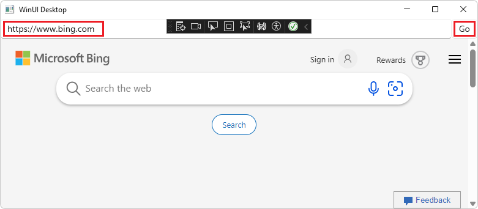

# Get started with WebView2 in WinUI 3 (Windows App SDK) apps

This article covers how to set up your development tools and create an initial WebView2 app for WinUI 3 (Windows App SDK), and learn about WebView2 concepts along the way.

In this tutorial, you use the **Blank App, Packaged (WinUI in Desktop)** Visual Studio project template to create a blank WinUI 3 project.  That project template uses the WindowsAppSDK, which includes the WebView2 SDK.  You add a WebView2 control.  You then add an address bar and logic to display a warning dialog when the user tries to navigate to a URL with an `http://` prefix.




#### Completed project

A completed version of this tutorial project (as of 2020) is available in the **WebView2Samples** repo:

*  Sample name: **WinUI3_GettingStarted**
*  Repo directory: [WinUI3_GettingStarted](https://github.com/MicrosoftEdge/WebView2Samples/tree/main/GettingStartedGuides/WinUI3_GettingStarted)
*  Solution file: **WinUI_Sample.sln**

The present tutorial is updated and only creates a single project, not a second, "(Package)" project like in 2020.


<!-- ====================================================================== -->
## Step 1 - Install Visual Studio and the Windows App SDK

Even if you have Visual Studio installed, read the following page and possibly update your software and install project templates.

1.  In a new window or tab, open the page [Install tools for the Windows App SDK](/windows/apps/windows-app-sdk/set-up-your-development-environment) and then follow the steps on that page, to install Microsoft Visual Studio, such as Visual Studio 2022.
<!-- clickable: https://learn.microsoft.com/windows/apps/windows-app-sdk/set-up-your-development-environment -->

1.  If needed, in a new window or tab, see [Install Visual Studio](../how-to/machine-setup.md#install-visual-studio) in _Set up your Dev environment for WebView2_.

Return from that page and continue the steps below.

For this sample, you don't need to separately install the WebView2 SDK.  Below, you'll select the project template **Blank App, Packaged (WinUI in Desktop)**, which uses the WindowsAppSDK, which includes the WebView2 SDK.


<!-- ====================================================================== -->
## Step 2 - Install a preview channel of Microsoft Edge

1.  Install the [WebView2 Runtime](https://developer.microsoft.com/microsoft-edge/webview2) or any [Microsoft Edge preview channel](https://www.microsoft.com/edge/download/insider) (Beta, Dev, or Canary) installed on Windows 10 version 1803 (build 17134) or later.

Return from that page and continue the steps below.

<!--
Or, install the WebView2 Runtime, as follows:

1. In a new window or tab, see [Install the WebView2 Runtime](../how-to/machine-setup.md#install-the-webview2-runtime) in _Set up your Dev environment for WebView2_.

Return here and continue with the steps below.
-->


<!-- ====================================================================== -->
## Step 3 - Create a blank WinUI 3 project

To create a WebView2 app, start by creating a basic desktop project, to create a desktop app that contains a single main window:

1.  If Visual Studio is not running, start Visual Studio (not Visual Studio Code).  In the Visual Studio startup window, click the **Create a new project** card.  The **Create a new project** window opens.

    Or, if Visual Studio is running, select **File** > **New** > **Project**.  The **Create a new project** dialog opens.

    **Turning on Developer Mode:**  When Visual Studio opens at some point during the present article's steps, you might be prompted to turn on Developer Mode for your computer.  For more information, if needed, see [Enable your device for development](/windows/apps/get-started/enable-your-device-for-development), at _Build desktop apps for Windows_.

1.  In the **Create a new project** dialog, in the **Search for templates** field, enter **WinUI 3 in Desktop**:

    

1.  Click the **Blank App, Packaged (WinUI in Desktop)** card to select it, and then click the **Next** button.

    If **WinUI** templates aren't listed, you need to install project templates as mentioned above, from [Install tools for the Windows App SDK](/windows/apps/windows-app-sdk/set-up-your-development-environment).  Additional tips to get the template to appear:

    After installing "default" options for Visual Studio 2022 Community edition, in Visual Studio Installer, click the **.NET** card, then on the right, select the checkbox **Windows App SDK C# Templates**.

    If the correct project template still doesn't appear: in the Visual Studio Installer, click the **UWP** card to select it, select the **v143 C++ tools** checkbox on the right, and then click the **Modify** button.

    The **Configure your new project** dialog appears.

1.  In the **Project name** text box, enter a project name, such as **MyWebView2WinUI3**:

    

1.  In the **Location** text box, enter or navigate to a location, such as `C:\Users\username\Documents\WebView2`.

1.  Click the **Create** button.

    The new WinUI 3 project opens in Solution Explorer in Visual Studio:

    

    *  The `App.xaml.cs` file defines an `Application` class that represents your app instance.

    *  The `MainWindow.xaml.cs` file defines a `MainWindow` class that represents the main window displayed by your app instance.  The classes derive from types in the `Microsoft.UI.Xaml` namespace of WinUI.

1.  In the **Solution Configurations** dropdown list (in the middle of the top of the window), select **Debug**.

1.  In the **Solution Platforms** dropdown list, select a platform, such as **x64**.

1.  Select **File** > **Save All** (**Ctrl+Shift+S**) to save the project.

1.  Press **F5** to build and run the project.  The blank WinUI Desktop app opens, with no WebView2 control added yet:

    

1.  Close the app.


#### Updating target version numbers

For the build step above:  If you're updating a previous project, you might need to update the version numbers for **Target version** and **Minimum version**.  To do this, in Solution right-click the project and then select **Edit Project File**.  Your `.csproj` file opens.  Make sure the values are updated as follows, and then save any changes and build the project.

```xml
    <TargetFramework>net6.0-windows10.0.19041.0</TargetFramework>
    <TargetPlatformMinVersion>10.0.17763.0</TargetPlatformMinVersion>
```

The above values represent:
*  **Target version**: **Windows 10, version 2004 (build 19041)** or later.
*  **Minimum version**: **Windows 10, version 1809 (build 17763)**.


<!-- ====================================================================== -->
## Step 4 - Add a WebView2 control

This tutorial project is based on the project template **Blank App, Packaged (WinUI in Desktop)**.  This project template uses the WindowsAppSDK, which includes the WebView2 SDK.

Edit the `MainWindow.xaml` and `MainWindow.xaml.cs` files to add a WebView2 control to the blank WinUI 3 app project, as follows:

1.  In Visual Studio, in Solution Explorer, double-click `MainWindow.xaml` to open it in the code editor.

1.  Add the WebView2 XAML namespace by inserting the following attribute inside the `<Window>` start tag:

    ```xml
    xmlns:controls="using:Microsoft.UI.Xaml.Controls"
    ```
    
    Make sure your code in `MainWindow.xaml` is similar to the following:

    ```xml
    <Window
        x:Class="MyWebView2WinUI3.MainWindow"
        xmlns="http://schemas.microsoft.com/winfx/2006/xaml/presentation"
        xmlns:x="http://schemas.microsoft.com/winfx/2006/xaml"
        xmlns:local="using:MyWebView2WinUI3"
        xmlns:d="http://schemas.microsoft.com/expression/blend/2008"
        xmlns:mc="http://schemas.openxmlformats.org/markup-compatibility/2006"
        mc:Ignorable="d"
        xmlns:controls="using:Microsoft.UI.Xaml.Controls">
    
        <StackPanel Orientation="Horizontal" HorizontalAlignment="Center" VerticalAlignment="Center">
            <Button x:Name="myButton" Click="myButton_Click">Click Me</Button>
        </StackPanel>
    </Window>
    ```
    
1.  To add the WebView2 control, replace the entire `<StackPanel>` element with the following `<Grid>` code.  The `Source` property, near the bottom, sets the initial URI that's displayed in the WebView2 control (`https://www.microsoft.com`):

    ```xml
    <Grid>
    
        <Grid.RowDefinitions>
            <RowDefinition Height="Auto"/>
            <RowDefinition Height="*"/>
        </Grid.RowDefinitions>
        <Grid.ColumnDefinitions>
            <ColumnDefinition Width="*"/>
            <ColumnDefinition Width="Auto"/>
        </Grid.ColumnDefinitions>
    
        <controls:WebView2 x:Name="MyWebView"  Grid.Row="1" Grid.ColumnSpan="2"
            Source="https://www.microsoft.com" HorizontalAlignment="Stretch" VerticalAlignment="Stretch"/>
    
    </Grid>
    ```
    
1.  In Solution Explorer, expand `MainWindow.xaml` and then open `MainWindow.xaml.cs`.

1.  In `MainWindow.xaml.cs`, comment out the following line, as shown:

    ```csharp
        // myButton.Content = "Clicked";
    ```
    
1.  Select **File** > **Save All** (**Ctrl+Shift+S**) to save the project.

1.  Press **F5**, to build and run the project.

1.  The app is a WebView2 host app that includes the WebView2 control.  The WebView2 control displays the website `https://www.microsoft.com`:

    

1.  Close the app.


<!-- ====================================================================== -->
## Step 5 - Add navigation controls

To allow users to control which webpage is displayed in the WebView2 control, add an address bar to the app, as follows:

1.  In `MainWindow.xaml`, paste the following code inside the `<Grid>` element that contains the `<controls:WebView2>` element:

    ```xml
       <TextBox Name="addressBar" Grid.Column="0"/>
       <Button x:Name="myButton" Grid.Column="1" Click="myButton_Click">Go</Button>
    ```

    Make sure the resulting `<Grid>` element in the `MainWindow.xaml` file matches the following:

    ```xml
    <Grid>
    
        <Grid.RowDefinitions>
            <RowDefinition Height="Auto"/>
            <RowDefinition Height="*"/>
        </Grid.RowDefinitions>
        <Grid.ColumnDefinitions>
            <ColumnDefinition Width="*"/>
            <ColumnDefinition Width="Auto"/>
        </Grid.ColumnDefinitions>
    
        <TextBox Name="addressBar" Grid.Column="0"/>
        <Button x:Name="myButton" Grid.Column="1" Click="myButton_Click">Go</Button>
    
        <controls:WebView2 x:Name="MyWebView"  Grid.Row="1" Grid.ColumnSpan="2"
        Source="https://www.microsoft.com" HorizontalAlignment="Stretch" VerticalAlignment="Stretch"/>
    
    </Grid>
    ```
    
1.  In `MainWindow.xaml.cs`, paste the following code into `myButton_Click`, overwriting the existing `myButton_Click` method (which is nearly empty).  This code navigates the WebView2 control to the URL entered in the address bar.

    ```csharp
    private void myButton_Click(object sender, RoutedEventArgs e)
    {
        try
        {
            Uri targetUri = new Uri(addressBar.Text);
            MyWebView.Source = targetUri;
        }
        catch (FormatException ex)
        {
            // Incorrect address entered.
        }
    }
    ```
    
1.  Select **File** > **Save All** (**Ctrl+Shift+S**) to save the project.

1.  Press **F5** to build and run the project.

1.  Enter a new complete URL in the address bar, such as **https://www.bing.com**, and then click the **Go** button.

    The WebView2 control in the app displays the Bing website.  The address bar displays the URL, such as `https://www.bing.com`:

    

1.  Enter an incomplete URL in the address bar, such as `bing.com`, and then click the **Go** button.

    An `ArgumentException` exception is thrown, and appears after you close the app, because the URL doesn't start with `http://` or `https://`.

1.  Close the app.  The following Visual Studio dialogs might appear:

    

1.  These debugger dialogs are a known bug.  Click the **OK** button, and then click the **Cancel** button to close the dialogs.

<!--
maintenance link (keep)
* [Navigation events for WebView2 apps](../concepts/navigation-events.md) - main copy; update it and then propagate/copy to these h2 sections:
-->
<!-- ====================================================================== -->
## Step 6 - Navigation events

In this section, you add code to import the WebView2 Core library.

1.  In `MainWindow.xaml.cs`, add the following line at the top, above the other `using` statements:

    ```csharp
    using Microsoft.Web.WebView2.Core;
    ```

    Apps that host WebView2 controls listen for the following events that are raised by WebView2 controls during webpage navigation:

    * `NavigationStarting`
    * `SourceChanged`
    * `ContentLoading`
    * `HistoryChanged`
    * `NavigationCompleted`
    
    If an HTTP redirect occurs, there are multiple `NavigationStarting` events in a row.
    
    For more information, see [Navigation events for WebView2 apps](../concepts/navigation-events.md).

    
    When errors occur, the following events are raised, and an error webpage might be displayed:

    * `SourceChanged`
    * `ContentLoading`
    * `HistoryChanged`

    As an example of how to use the events, register a handler for `NavigationStarting` that cancels any non-HTTPS requests, as follows:

1.  In `MainWindow.xaml.cs`, in the constructor, add the following `NavigationStarting` line, to register the `EnsureHttps` method:

    ```csharp
    public MainWindow()
    {
        this.InitializeComponent();
        MyWebView.NavigationStarting += EnsureHttps;
    }
    ```

1.  In `MainWindow.xaml.cs`, below the constructor, add the following `EnsureHttps` method:

    ```csharp
    private void EnsureHttps(WebView2 sender, CoreWebView2NavigationStartingEventArgs args)
    {
        String uri = args.Uri;
        if (!uri.StartsWith("https://"))
        {
            args.Cancel = true;
        }
        else
        {
            addressBar.Text = uri;
        }
    }
    ```

1.  Select **File** > **Save All** (**Ctrl+Shift+S**) to save the project.

1.  Press **F5** to build and run the project.

1.  In the app, in the Address bar, enter an HTTP URL, such as `http://bing.com`, and then click the **Go** button.

    Nothing happens, because navigation is blocked to HTTP sites, and we haven't yet added a dialog to provide feedback.

1.  Enter an HTTPS URL, such as `https://bing.com`, and then click the **Go** button.

    The app navigates to the specified page, because navigation is allowed for HTTPS sites.

1.  Close the app.  The following Visual Studio dialogs might appear:

    

1.  These debugger dialogs are a known bug.  Click the **OK** button, and then click the **Cancel** button to close the dialogs.


#### WinRT CoreWebView2 object availability

The WinRT `CoreWebView2` object might not be available with the release of the WebView2 API.  For a list of available APIs, see:
* WinUI 3 API Reference (Windows App SDK) - [Microsoft.UI.Xaml.Controls.WebView2 Class](/windows/windows-app-sdk/api/winrt/microsoft.ui.xaml.controls.webview2) - in API reference for Windows desktop apps > WinRT APIs.
* The [WebView2 Spec](https://github.com/microsoft/microsoft-ui-xaml-specs/blob/master/active/WebView2/WebView2_spec.md)<!-- changing master to main doesn't work 5/19/2022 -->


<!-- ====================================================================== -->
## Step 7 - Scripting

You can use host apps to inject JavaScript code into WebView2 controls at runtime. You can task WebView2 to run arbitrary JavaScript or add initialization scripts. The injected JavaScript applies to all new top-level documents and any child frames until the JavaScript is removed. The injected JavaScript is run with specific timing, to either:

*  Run the injected JavaScript after the creation of the global object.

*  Run the injected JavaScript before running any other script that's included in the HTML document.

As an example, next, you add scripts that send an alert when a user tries to open non-HTTPS sites.  To do this, you inject a script into the web content that uses
[ExecuteScriptAsync](/windows/windows-app-sdk/api/winrt/microsoft.ui.xaml.controls.webview2.executescriptasync).
<!-- todo: correct link? -->
<!-- [ExecuteScriptAsync](/dotnet/api/microsoft.web.webview2.wpf.webview2.executescriptasync). -->

1.  In the `EnsureHttps` method, add the following `ExecuteScriptAsync` line:

    ```csharp
    private void EnsureHttps(WebView2 sender, CoreWebView2NavigationStartingEventArgs args)
    {
        String uri = args.Uri;
        if (!uri.StartsWith("https://"))
        {
            MyWebView.ExecuteScriptAsync($"alert('{uri} is not safe, try an https link')");
            args.Cancel = true;
        }
        else
        {
            addressBar.Text = uri;
        }
    }
    ```
    
1.  Select **File** > **Save All** (**Ctrl+Shift+S**) to save the project.

1.  Press **F5** to build and run the project.

1.  In the app's Address bar, enter a non-HTTPS URL, such as `http://www.bing.com`, and then click the **Go** button.

    The app's WebView2 control displays an alert dialog for non-HTTPS websites, saying that the non-HTTPS `uri` is not safe:

    

1.  Close the app.  The following Visual Studio dialog boxes might appear:

    

1.  These debugger dialog boxes are a known bug.  Click the **OK** button, and then click the **Cancel** button to close the dialog boxes.

Congratulations, you built your first WebView2 app!


<!-- ====================================================================== -->
## WinUI 3 WebView2 special considerations

#### SmartScreen

WebView2 sends URLs that are navigated to in your application to the [SmartScreen](/windows/security/threat-protection/microsoft-defender-smartscreen/microsoft-defender-smartscreen-overview) service, to ensure that your customers stay secure. If you want to disable this navigation, you can do so via an environment variable:

* `Environment.SetEnvironmentVariable("WEBVIEW2_ADDITIONAL_BROWSER_ARGUMENTS", "--disable-features=msSmartScreenProtection");`

This environment variable must be set prior to `CoreWebView2` creation, which occurs when the [WebView2.Source property](/windows/windows-app-sdk/api/winrt/microsoft.ui.xaml.controls.webview2.source#microsoft-ui-xaml-controls-webview2-source) is initially set or the [WebView2.EnsureCoreWebView2Async method](/windows/windows-app-sdk/api/winrt/microsoft.ui.xaml.controls.webview2.ensurecorewebview2async#microsoft-ui-xaml-controls-webview2-ensurecorewebview2async) is initially called.


<!-- ------------------------------ -->
#### Setting DefaultBackgroundColor

In WebView2 for WinUI 3, the `DefaultBackgroundColor` setting exists on the WebView2 XAML object.  For example:

```csharp
public MainWindow()
{
    this.InitializeComponent();
    MyWebView.DefaultBackgroundColor = Colors.LightBlue;
}
```


<!-- ------------------------------ -->
#### Transparency

WinUI 3 doesn't support transparent backgrounds.  See [Transparent background support for WebView2? · Issue #2992](https://github.com/microsoft/microsoft-ui-xaml/issues/2992).


<!-- ------------------------------ -->
#### API limitations

The following classes aren't accessible in WinUI 3:

* `CoreWebView2EnvironmentOptions`
* `CoreWebView2ControllerOptions`


<!-- ====================================================================== -->
## See also

* [WebView2 API Reference](../webview2-api-reference.md)
* [Introduction to Microsoft Edge WebView2](../index.md) - overview of features.
* [Manage user data folders](../concepts/user-data-folder.md)
* [Sample Code for WebView2](../code-samples-links.md) - a guide to the `WebView2Samples` repo.
* [Development best practices for WebView2 appsDevelopment best practices](../concepts/developer-guide.md)

developer.microsoft.com:
* [Microsoft Edge WebView2](https://developer.microsoft.com/microsoft-edge/webview2) - initial introduction to WebView2 features at developer.microsoft.com.

GitHub:
* [Getting Started with WebView2 in WinUI3](https://github.com/MicrosoftEdge/WebView2Samples/tree/main/GettingStartedGuides/WinUI3_GettingStarted#readme)
* [Spec: The WebView2 Xaml control](https://github.com/microsoft/microsoft-ui-xaml-specs/blob/master/active/WebView2/WebView2_spec.md) - the WinUI 3.0 version of the WebView2 control.
* [microsoft-ui-xaml repo > Issues](https://github.com/microsoft/microsoft-ui-xaml/issues) - to enter WinUI-specific feature requests or bugs.
