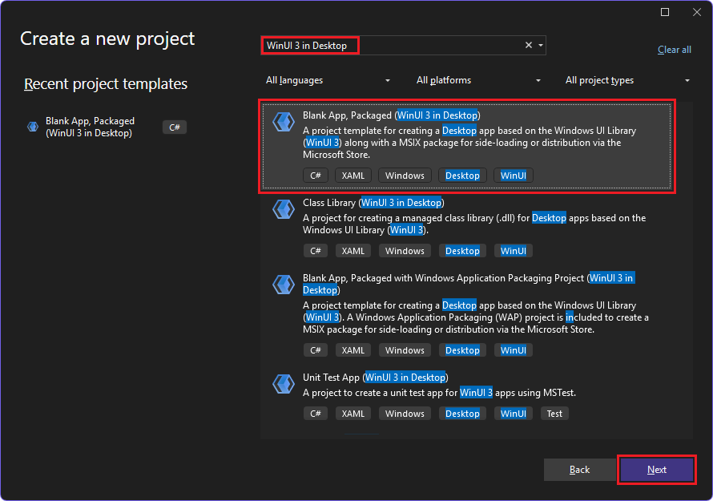
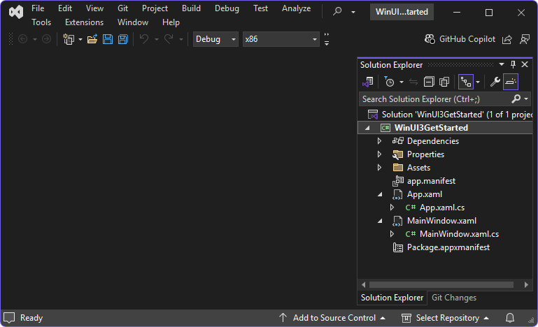
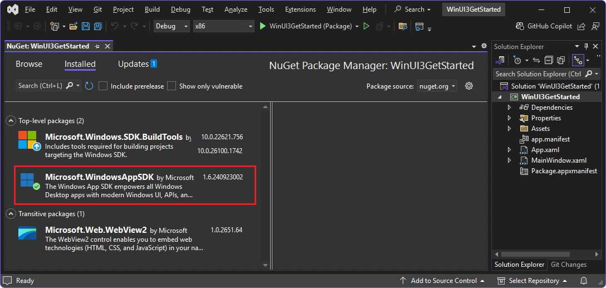

# Get started with WebView2 in WinUI 3 (Windows App SDK) apps

This article is to learn to write your own WebView2 code.  If you want to run a sample first, see [Win32 sample app](../samples/webview2apissample.md) or another sample app article, such as [WinUI 3 (Windows App SDK) sample app](../samples/webview2-winui3-sample.md).

This article covers how to set up your development tools and create an initial WebView2 app for WinUI 3 (Windows App SDK), and learn about WebView2 concepts along the way.  You first use the **Blank App, Packaged (WinUI 3 in Desktop)** Visual Studio project template, which uses the WindowsAppSDK, which includes the WebView2 SDK.  You then add a WebView2 control, an Address bar and **Go** button, and URL logic to only allow navigating to HTTPS URLs.


In this tutorial, you do the following:

1. Set up the development environment.

1. Use the **Blank App, Packaged (WinUI 3 in Desktop)** Visual Studio project template to create a blank WinUI 3 project, which defines an app that contains a button.

1. Add a WebView2 control instead of the button, and initially navigate to the Microsoft homepage.   WebView2 is supported because the project template uses the **Microsoft.WindowsAppSDK** NuGet package, which includes the WebView2 SDK.

1. Add an Address bar as a text box control, and then use the entered HTTPS string to navigate to a new webpage:

   

1. Insert JavaScript into the WebView2 control, to display a warning alert (dialog) when the user tries to navigate to a URL that has only an `http://` prefix instead of `https://`:

   


<!-- ------------------------------ -->
#### Completed project

A completed version of this tutorial project is available in the **WebView2Samples** repo:

*  Sample name: **WinUI3GetStarted**
*  Repo directory: [WinUI3_GettingStarted](https://github.com/MicrosoftEdge/WebView2Samples/tree/main/GettingStartedGuides/WinUI3_GettingStarted)
*  Solution file: **WinUI3GetStarted.sln**


<!-- ====================================================================== -->
## Step 1: Install the latest Visual Studio 2022

Make sure that Visual Studio 2022 is installed and up-to-date.

To install the latest Visual Studio 2022:

1. Go to [Visual Studio: IDE and Code Editor for Software Developers and Teams](https://visualstudio.microsoft.com), and then in the **Visual Studio 2022** section, click the **Download** button, and then select **Community 2022** or another version.

1. In the **Downloads** popup in the upper right of Microsoft Edge, `VisualStudioSetup.exe` is listed.  Click **Open file**.

   Visual Studio Installer opens.

1. Follow the prompts, and accept the defaults.  You'll install or update a workload and a component of a workload in the next step.


<!-- ====================================================================== -->
## Step 2: Install the latest Windows App SDK

Make sure that the latest Windows App SDK is installed in Visual Studio 2022.  The Windows App SDK includes Visual Studio project templates, and includes the WebView2 SDK.  These project templates include the **Blank App, Packaged (WinUI 3 in Desktop)** project template, which uses the WindowsAppSDK, including the WebView2 SDK.

The Windows App SDK is installed as the **Windows App SDK C# Templates** component of the **.NET Desktop Development** workload for Visual Studio.  Before Visual Studio 2022 version 17.1, the Windows App SDK was instead installed as a Visual Studio extension, as explained in [Install tools for the Windows App SDK](/windows/apps/windows-app-sdk/set-up-your-development-environment).


To install the latest Visual Studio 2022 the latest Windows App SDK:

1. In Windows, press the **Start** key, and then type **Visual Studio 2022**.

   The Visual Studio 2022 app is listed.

1. Click **Open**.

   The **Visual Studio 2022** dialog opens, with sections including **Open recent** and **Get started**.

1. Click **Continue without code**.

   Visual Studio opens.

1. In the **Tools** menu, select **Get Tools and Features**.

   The **Visual Studio Installer** window opens.

1. Make sure the **Workloads** tab is selected.

1. In the **Desktop & Mobile** section, select the card for the **.NET desktop development** workload, so that a checkmark appears:

   

1. In the **Installation details** tree on the right, in **.NET desktop development** > **Optional**, select the checkbox for the **Windows App SDK C# Templates** component, near the bottom of the tree.

1. Click the **Modify** button.

   The **User Account Control** dialog opens.

1. Click the **Yes** button.

   You're prompted to close Visual Studio.

1. Click the **Continue** button (assuming you have no unsaved work).

   Visual Studio downloads and installs the latest **Windows App SDK C# Templates** component.  In the **Visual Studio Installer** window, a message says **All installations are up to date**, and Visual Studio 2022 opens.


<!-- ====================================================================== -->
## Step 3: Create a blank WinUI 3 project

Next, create a project that's a basic WebView2 app for WinUI 3 (Windows App SDK).  This desktop app will contain a single main window.  The project won't contain any WebView2 code yet.

To create a WebView2 app for WinUI 3 (Windows App SDK):

1.  If Visual Studio is running, select **File** > **New** > **Project**.  The **Create a new project** dialog opens.

1.  If Visual Studio 2022 is not running:

    1.  In Windows, press the **Start** key, and then type **Visual Studio 2022**.

        The Visual Studio 2022 app is listed.

    1.  Click **Open**.

        The **Visual Studio 2022** startup dialog opens, with sections including **Open recent** and **Get started**.

    1.  In the **Get started** section, click the **Create a new project** card.  The **Create a new project** window opens.

1.  In the **Create a new project** window, in the **Search for templates** field, enter **WinUI 3 in Desktop**:

    

    The project templates that were installed in the previous major step are listed.

1.  Click the **Blank App, Packaged (WinUI 3 in Desktop)** card to select it, and then click the **Next** button.  

    The **Configure your new project** dialog appears.

1.  In the **Project name** text box, enter a project name, such as **WinUI3GetStarted**:

    

1.  In the **Location** text box, enter or navigate to a directory, such as `C:\Users\myUsername\source\`.

1.  Click the **Create** button.

    The project is created:

   

1.  If a dialog appears, saying "Failed to install the Microsoft.WindowsAppSDK package", click the **OK** button.


<!-- ====================================================================== -->
## Step 4: Update or install the Windows App SDK

When you create a new project in Visual Studio, check the status of the solution's NuGet packages.  Make sure the needed NuGet packages were installed by the project template, and make sure the packages have been updated, so that the project has the latest features and fixes.

To update or install the latest Windows App SDK NuGet package for your project:

1. In Visual Studio, in Solution Explorer, right-click the **WinUI3GetStarted** project, and then select **Manage NuGet Packages**.

   In Visual Studio, the **NuGet: WinUI3GetStarted** tab opens.  If the **Microsoft.WindowsAppSDK** package has been installed during project creation using the project template, the **Installed** tab is selected, and that package is listed:

   

   If the **Microsoft.WindowsAppSDK** package is not listed in the **Installed** tab:

1. Click the **Browse** tab, and then in the **Search** text box, enter **Microsoft.WindowsAppSDK**.

1. Select the **Microsoft.WindowsAppSDK** card:

   

1. Click the **Install** button, to the right.

   The **Preview Changes** dialog opens.

1. Click the **Apply** button, and then accept the license terms.

   The **Microsoft.WindowsAppSDK** NuGet package is installed.

1. In the **NuGet - Solution** tab, click the **Updates** tab, and then optionally update any packages that are listed there.

1. Close the **NuGet - Solution** tab.


<!-- ====================================================================== -->
## Step 5: Build and run the project

The new WinUI 3 project remains opens in Solution Explorer in Visual Studio:


* The `App.xaml.cs` file defines an `Application` class that represents your app instance.

* The `MainWindow.xaml.cs` file defines a `MainWindow` class that represents the main window that's displayed by your app instance.  The classes derive from types in the `Microsoft.UI.Xaml` namespace of WinUI.


To build and run the project:

1. Select **File** > **Save All** (**Ctrl+Shift+S**).

1. Select **Debug** > **Start** (**F5**).

   The **Enable Developer Mode for Windows** dialog might open:

   

1. If that dialog appears, click **settings for developers**, turn on the **Developer Mode** toggle, click the **Yes** button, and then click the **Close** button of the Visual Studio dialog.  For more information about Developer Mode, see [Enable your device for development](/windows/apps/get-started/enable-your-device-for-development), at _Build desktop apps for Windows_.

   The project builds.  The blank WinUI Desktop app opens, with no WebView2 control added yet:

   

1. Click the **Click Me** button.

   The button label changes to **Clicked**.

1. Close the app.


<!-- ====================================================================== -->
## Step 6: Add a WebView2 control

The project is based on the project template **Blank App, Packaged (WinUI 3 in Desktop)**, which uses the **Microsoft.WindowsAppSDK** NuGet package, which includes the WebView2 SDK.  So we can add WebView2 code.  You'll edit the `MainWindow.xaml` and `MainWindow.xaml.cs` files to add a WebView2 control to the blank WinUI 3 app project, initially loading the Microsoft home page.  In the XAML file, the WebView control will be tagged like:

`<controls:WebView2 x:Name="MyWebView" Source="https://www.microsoft.com">`


To add a WebView2 control that initially navigates to the Microsoft home page:

1.  In Visual Studio, in Solution Explorer, double-click `MainWindow.xaml`.

    The file opens in the code editor.

1.  Copy and paste the following attribute inside the `<Window>` start tag, at the end of the list of XML namespaces:

    ```xml
    xmlns:controls="using:Microsoft.UI.Xaml.Controls"
    ```

    That code adds the WebView2 XAML namespace.  Make sure your code in `MainWindow.xaml` is similar to the following:

    ```xml
    <?xml version="1.0" encoding="utf-8"?>
    <Window
        x:Class="MyWebView2WinUI3.MainWindow"
        xmlns="http://schemas.microsoft.com/winfx/2006/xaml/presentation"
        xmlns:x="http://schemas.microsoft.com/winfx/2006/xaml"
        xmlns:local="using:MyWebView2WinUI3"
        xmlns:d="http://schemas.microsoft.com/expression/blend/2008"
        xmlns:mc="http://schemas.openxmlformats.org/markup-compatibility/2006"
        xmlns:controls="using:Microsoft.UI.Xaml.Controls"
        mc:Ignorable="d">

        <StackPanel Orientation="Horizontal" HorizontalAlignment="Center" VerticalAlignment="Center">
            <Button x:Name="myButton" Click="myButton_Click">Click Me</Button>
        </StackPanel>
    </Window>
    ```

1.  Delete the `<StackPanel>` element (three lines).

1.  Above the `</Window>` end tag, paste the following `<Grid>` element:

    ```xml
    <Grid>
        <Grid.RowDefinitions>
            <RowDefinition Height="Auto"/>
            <RowDefinition Height="*"/>
        </Grid.RowDefinitions>
        <Grid.ColumnDefinitions>
            <ColumnDefinition Width="*"/>
            <ColumnDefinition Width="Auto"/>
        </Grid.ColumnDefinitions>

        <controls:WebView2 x:Name="MyWebView"  Grid.Row="1" Grid.ColumnSpan="2"
            Source="https://www.microsoft.com" HorizontalAlignment="Stretch" 
            VerticalAlignment="Stretch"/>
    </Grid>
    ```

    This `<Grid>` element contains a `<controls:WebView2>` element named `MyWebView`, which has a `Source` attribute that sets the initial URI that's displayed in the WebView2 control (`https://www.microsoft.com`).  When the app opens, it will initially display the Microsoft.com home page, in the WebView2 control.

1.  In Solution Explorer, expand `MainWindow.xaml` and then double-click `MainWindow.xaml.cs`.

1.  In `MainWindow.xaml.cs`, delete the following line of C# code in the `myButton_Click` method:

    ```csharp
    myButton.Content = "Clicked";
    ```

    The method is empty for now.  We'll use it for the Address bar's **Go** button later.

1.  Select **File** > **Save All** (**Ctrl+Shift+S**).

1.  Press **F5**.

    The project builds, and the app opens:

    

    The app is a WebView2 host app that includes the WebView2 control.  The WebView2 control initially displays the website `https://www.microsoft.com`.  There's no Address bar text box or **Go** button yet.

1.  Close the app.


<!-- ====================================================================== -->
## Step 7: Add navigation controls

To allow users to control which webpage is displayed in the WebView2 control, add an Address bar to the app, as follows:

1.  In `MainWindow.xaml`, paste the following code inside the `<Grid>` element, above the `<controls:WebView2>` element:

    ```xml
       <TextBox Name="addressBar" Grid.Column="0"/>
       <Button x:Name="myButton" Grid.Column="1" Click="myButton_Click">Go</Button>
    ```

    Make sure the resulting `<Grid>` element in the `MainWindow.xaml` file matches the following:

    ```xml
    <Grid>
        <Grid.RowDefinitions>
            <RowDefinition Height="Auto"/>
            <RowDefinition Height="*"/>
        </Grid.RowDefinitions>
        <Grid.ColumnDefinitions>
            <ColumnDefinition Width="*"/>
            <ColumnDefinition Width="Auto"/>
        </Grid.ColumnDefinitions>

        <TextBox Name="addressBar" Grid.Column="0"/>
        <Button x:Name="myButton" Grid.Column="1" Click="myButton_Click">Go</Button>

        <controls:WebView2 x:Name="MyWebView"  Grid.Row="1" Grid.ColumnSpan="2"
            Source="https://www.microsoft.com" HorizontalAlignment="Stretch" 
            VerticalAlignment="Stretch"/>
    </Grid>
    ```
    
1.  In `MainWindow.xaml.cs`, paste the following `try/catch` block into the body of the `myButton_Click` method:

    ```csharp
    private void myButton_Click(object sender, RoutedEventArgs e)
    {
        try
        {
            Uri targetUri = new Uri(addressBar.Text);
            MyWebView.Source = targetUri;
        }
        catch (FormatException ex)
        {
            // Incorrect address entered.
        }
    }
    ```

    This code navigates the WebView2 control to the URL that the user enters in the Address bar, when the user clicks the **Go** button, by re-setting the value of the `MyWebView.Source` property, which is equivalent to the `Source` attribute of the `<controls:WebView2 x:Name="MyWebView">` element.
    
1.  Select **File** > **Save All** (**Ctrl+Shift+S**).

1.  Press **F5**.

    The project builds, and the app opens, initially showing the Microsoft home page.  There's now an Address bar and a **Go** button.

1.  Enter a new complete HTTPS URL in the Address bar, such as **https://www.bing.com**, and then click the **Go** button:

    

    The WebView2 control in the app displays the Bing website.  The Address bar displays the URL, such as `https://www.bing.com`.

1.  Enter an incomplete URL in the Address bar, such as `bing.com`, and then click the **Go** button.

    The WebView2 control doesn't attempt to navigate to that URL.  An exception is thrown, because the URL doesn't start with `http://` or `https://`.  In the `try` section, the `addressBar.Text` string doesn't start with `http://` or `https://`, yet the non-URI string is passed to the `Uri` constructor, which throws a `System.UriFormatException` exception.  In Visual Studio, the **Output** pane displays "Exception thrown: 'System.UriFormatException' in System.Private.Uri.dll".  The app continues running.

1.  Close the app.


<!--
maintenance link (keep)
* [Navigation events for WebView2 apps](../concepts/navigation-events.md) - main copy; update it and then propagate/copy to these h2 sections:
-->
<!-- ====================================================================== -->
## Step 8: Handle navigation events

An app that hosts a WebView2 control listens for the following events:

* `NavigationStarting`
* `SourceChanged`
* `ContentLoading`
* `HistoryChanged`
* `NavigationCompleted`

These events are raised by a WebView2 control during webpage navigation.  If an HTTP redirect occurs, there are multiple `NavigationStarting` events in a row.  For more information, see [Navigation events for WebView2 apps](../concepts/navigation-events.md).

When an error occurs, the following events are raised, and an error webpage might be displayed:

* `SourceChanged`
* `ContentLoading`
* `HistoryChanged`

In this section, you add code to import the WebView2 Core library, which handles navigation events to go to various types of URLs.


To handle navigation events:

1.  In `MainWindow.xaml.cs`, add the following line at the top, above the other `using` statements:

    ```csharp
    using Microsoft.Web.WebView2.Core;
    ```

    Register a handler for `NavigationStarting` that cancels any non-HTTPS requests:

1.  In `MainWindow.xaml.cs`, in the constructor, add the following `NavigationStarting` line:

    ```csharp
    public MainWindow()
    {
        this.InitializeComponent();
        MyWebView.NavigationStarting += EnsureHttps;
    }
    ```

    That line registers the `EnsureHttps` method (added below) as a listener of the `NavigationStarting` event.

1.  Below the constructor, add the following `EnsureHttps` method:

    ```csharp
    private void EnsureHttps(WebView2 sender, CoreWebView2NavigationStartingEventArgs args)
    {
        String uri = args.Uri;
        if (!uri.StartsWith("https://"))
        {
            args.Cancel = true;
        }
        else
        {
            addressBar.Text = uri;
        }
    }
    ```

1.  Select **File** > **Save All** (**Ctrl+Shift+S**).

1.  Press **F5**.

    The project builds, and the app opens.

1.  In the app, in the Address bar, enter an HTTP URL, such as `http://bing.com`, and then click the **Go** button.

    The app doesn't navigate to that page, because navigation is blocked to HTTP sites.  We haven't yet added a dialog to tell the user why the displayed site didn't change.

1.  Enter an HTTPS URL, such as `https://bing.com`, and then click the **Go** button.

    The app navigates to the specified page, because navigation is allowed for HTTPS sites.

1.  In the app, in the Address bar, enter a string without a prefix, such as `bing.com`, and then click the **Go** button.

    The app doesn't navigate to that page.  A `UriFormatException` exception is thrown, as before, and appears in the **Output** pane in Visual Studio.

1.  Close the app.


<!-- ====================================================================== -->
## Step 9: Insert JavaScript to alert the user about a non-HTTPS address

You can use the host app to inject JavaScript code into the WebView2 control at runtime.  You can task WebView2 to run arbitrary JavaScript, or add initialization scripts.  The injected JavaScript applies to all new top-level documents and any child frames, until the JavaScript is removed.  The injected JavaScript is run with specific timing, to either:

*  Run the injected JavaScript after the creation of the global object.

*  Run the injected JavaScript before running any other script that's included in the HTML document.

Below, you add JavaScript that displays an alert when a user tries to open a non-HTTPS site.  To do this, you inject a script into the web content that uses
[ExecuteScriptAsync](/windows/windows-app-sdk/api/winrt/microsoft.ui.xaml.controls.webview2.executescriptasync).


To display an alert when the user tries to navigate to a non-HTTPS site:

1.  In `MainWindow.xaml.cs`, in the `EnsureHttps` method, add the following `ExecuteScriptAsync` line:

    ```csharp
    private void EnsureHttps(WebView2 sender, CoreWebView2NavigationStartingEventArgs args)
    {
        String uri = args.Uri;
        if (!uri.StartsWith("https://"))
        {
            MyWebView.ExecuteScriptAsync($"alert('{uri} is not safe, try an https link')");
            args.Cancel = true;
        }
        else
        {
            addressBar.Text = uri;
        }
    }
    ```
    
1.  Select **File** > **Save All** (**Ctrl+Shift+S**).

1.  Press **F5**.

    The project builds, and the app opens.

1.  In the app's Address bar, enter a non-HTTPS URL, such as `http://www.bing.com`, and then click the **Go** button.

    The app's WebView2 control displays an alert dialog for non-HTTPS websites, saying that the non-HTTPS `uri` is not safe:

    

1.  Close the app.

Congratulations, you've built a WebView2 WinUI 3 (Windows App SDK) app!


<!-- ====================================================================== -->
## See also
<!-- all links in article -->

* [WebView2 API Reference](../webview2-api-reference.md)
* [Introduction to Microsoft Edge WebView2](../index.md) - overview of features.
* [Manage user data folders](../concepts/user-data-folder.md)
* [WebView2 sample apps](../samples/index.md) - a guide to the `WebView2Samples` repo.
* [Development best practices for WebView2 appsDevelopment best practices](../concepts/developer-guide.md)

developer.microsoft.com:
* [Microsoft Edge WebView2](https://developer.microsoft.com/microsoft-edge/webview2) - initial introduction to WebView2 features.

GitHub:
* [Getting Started with WebView2 in WinUI3](https://github.com/MicrosoftEdge/WebView2Samples/tree/main/GettingStartedGuides/WinUI3_GettingStarted#readme)
* [Spec: The WebView2 Xaml control](https://github.com/microsoft/microsoft-ui-xaml-specs/blob/master/active/WebView2/WebView2_spec.md) - the WinUI 3.0 version of the WebView2 control.
* [microsoft-ui-xaml repo > Issues](https://github.com/microsoft/microsoft-ui-xaml/issues) - to enter WinUI-specific feature requests or bugs.
