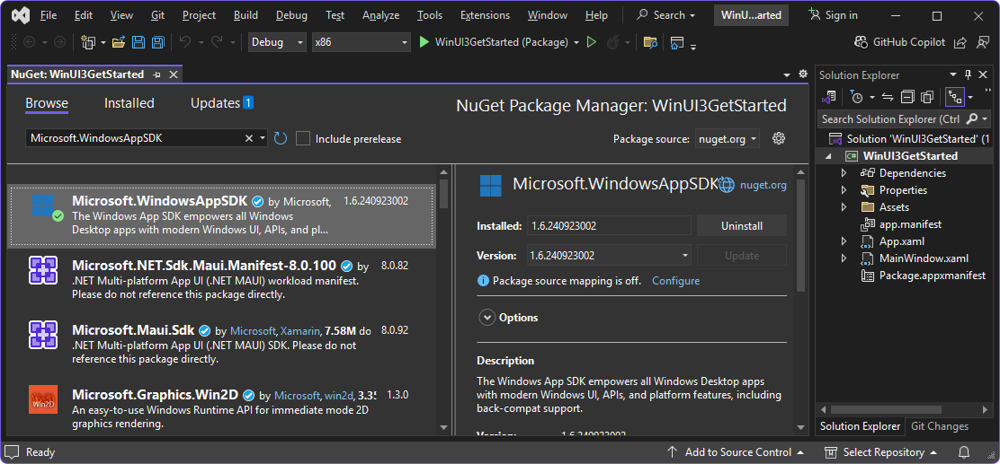

# Get started with WebView2 in WinUI 3 (Windows App SDK) apps

This article covers how to set up your development tools and create an initial WebView2 app for WinUI 3 (Windows App SDK), and learn about WebView2 concepts along the way.

In this tutorial, you use the **Blank App, Packaged (WinUI 3 in Desktop)** Visual Studio project template to create a blank WinUI 3 project.  That project template uses the WindowsAppSDK, which includes the WebView2 SDK.  You add a WebView2 control.  You then add an address bar and logic to display a warning dialog when the user tries to navigate to a URL with an `http://` prefix.


<!-- ------------------------------ -->
#### Completed project

A completed version of this tutorial project (as of 2020) is available in the **WebView2Samples** repo:

*  Sample name: **WinUI3_GettingStarted**
*  Repo directory: [WinUI3_GettingStarted](https://github.com/MicrosoftEdge/WebView2Samples/tree/main/GettingStartedGuides/WinUI3_GettingStarted)
*  Solution file: **WinUI_Sample.sln**

The present tutorial has been updated and only creates a single project, not a second, "WinUI_Sample (Package)" project like in the WebView2Samples repo's WinUI_Sample from 2020.


<!-- ====================================================================== -->
## Step 1 - Install the latest Visual Studio 2022

Make sure that Visual Studio 2022 is installed and up-to-date.

To install the latest Visual Studio 2022:

1. Go to [Visual Studio: IDE and Code Editor for Software Developers and Teams](https://visualstudio.microsoft.com), and then in the **Visual Studio 2022** section, click the **Download** button, and then select **Community 2022** or another version.

1. In the **Downloads** popup in the upper right of Microsoft Edge, `VisualStudioSetup.exe` is listed.  Click **Open file**.

   Visual Studio Installer opens.

1. Follow the prompts, and accept the defaults.  You'll install or update a workload and a component of a workload in the next step.


<!-- ====================================================================== -->
## Step 2 - Install the latest Windows App SDK

<!-- describe/explain what we're doing/accomplishing here, and why  -->
Make sure that the latest Windows App SDK is installed in Visual Studio 2022.  The Windows App SDK includes Visual Studio project templates, and includes the WebView2 SDK.  These project templates include the **Blank App, Packaged (WinUI 3 in Desktop)** project template, which uses the WindowsAppSDK, including the WebView2 SDK.

The Windows App SDK is installed as the **Windows App SDK C# Templates** component of the **.NET Desktop Development** workload for Visual Studio.  Before Visual Studio 2022 version 17.1, the Windows App SDK was instead installed as a Visual Studio extension, as explained in [Install tools for the Windows App SDK](/windows/apps/windows-app-sdk/set-up-your-development-environment).


To install the latest Visual Studio 2022 the latest Windows App SDK:

1. In Windows, press the **Start** key, and then type **Visual Studio 2022**.

   The Visual Studio 2022 app is listed.

1. Click **Open**.

   The **Visual Studio 2022** dialog opens, with sections including **Open recent** and **Get started**.

1. Click **Continue without code**.

   Visual Studio opens.

1. In the **Tools** menu, select **Get Tools and Features**.

   The **Visual Studio Installer** window opens.

1. Make sure the **Workloads** tab is selected.

1. In the **Desktop & Mobile** section, select the card for the **.NET desktop development** workload, so that a checkmark appears:

   

1. In the **Installation details** tree on the right, in **.NET desktop development** > **Optional**, select the checkbox for the **Windows App SDK C# Templates** component, near the bottom of the tree.

1. Click the **Modify** button.

   The **User Account Control** dialog opens.

1. Click the **Yes** button.

   You're prompted to close Visual Studio.

1. Click the **Continue** button (assuming you have no unsaved work).

   Visual Studio downloads and installs the latest **Windows App SDK C# Templates** component.  In the **Visual Studio Installer** window, a message says **All installations are up to date**, and Visual Studio 2022 opens.


<!-- ====================================================================== -->
## Step 3 - Create a blank WinUI 3 project

Next, create a project that's a basic WebView2 app for WinUI 3 (Windows App SDK).  This desktop app will contain a single main window.  The project won't contain any WebView2 code yet.

To create a WebView2 app for WinUI 3 (Windows App SDK):

1. If Visual Studio is running, select **File** > **New** > **Project**.  The **Create a new project** dialog opens.

1.  If Visual Studio 2022 is not running, in Windows, press the **Start** key, and then type **Visual Studio 2022**.

   The Visual Studio 2022 app is listed.

1. Click **Open**.

   The **Visual Studio 2022** startup dialog opens, with sections including **Open recent** and **Get started**.

1. In the **Get started** section, click the **Create a new project** card.  The **Create a new project** window opens.

1.  In the **Create a new project** window, in the **Search for templates** field, enter **WinUI 3 in Desktop**:

    

    The project templates that were installed in the previous major step are listed.

1.  Click the **Blank App, Packaged (WinUI 3 in Desktop)** card to select it, and then click the **Next** button.  

    The **Configure your new project** dialog appears.

1.  In the **Project name** text box, enter a project name, such as **MyWebView2WinUI3**:

    

1.  In the **Location** text box, enter or navigate to a location, such as `C:\Users\username\Documents\WebView2`.

1.  Click the **Create** button.

    Visual Studio might display an error message: **Failed to install the Microsoft.WindowsAppSDK package**:

   


<!-- ====================================================================== -->
## Step 4 - Add the latest WinUI/Windows App SDK NuGet package to the solution

<!-- copied/modified from https://learn.microsoft.com/en-us/windows/apps/get-started/start-here?tabs=vs-2022-17-10#4-update-to-the-latest-winuiwindows-app-sdk
[4. Update to the latest WinUI/Windows App SDK](/windows/apps/get-started/start-here#4-update-to-the-latest-winuiwindows-app-sdk) in _Start developing Windows apps_. -->

When you create a new project in Visual Studio, update the project's NuGet packages, to ensure the project has the latest features and fixes.  This step ensures that the **Microsoft.WindowsAppSDK** NuGet package is installed and up-to-date.  The Windows App SDK (including WinUI) is distributed as a NuGet package; see [An introduction to NuGet](/nuget/what-is-nuget).  This means updates can be released out-of-sync with Windows and Visual Studio.  As a result, the Visual Studio project template that you used to create your project might not reference the latest Windows App SDK NuGet package.

To install the latest Windows App SDK NuGet package for your project:

1. In Visual Studio, select **Tools** > **NuGet Package Manager** > **Manage NuGet Packages for Solution**.

   In Visual Studio, the **NuGet - Solution** tab opens.

1. Click the **Browse** tab, and then in the **Search** text box, enter **Microsoft.WindowsAppSDK**.

1. Select the **Microsoft.WindowsAppSDK** card.

1. In the **Versions** section, select the **Project** checkbox:

   

1. Click the **Install** button (or the **Update** button).

   The **Preview Changes** dialog opens.

1. Click the **Apply** button, and then accept the license terms.

1. Click the **Updates** tab, and update or install any packages listed there, such as **Microsoft.Windows.SDK.BuildTools**.

1. Click the **Installed** tab, and make sure **Microsoft.WindowsAppSDK** is listed.

1. Close the **NuGet - Solution** tab.


<!-- ====================================================================== -->
## Step 5 - Build and run the project

The new WinUI 3 project remains opens in Solution Explorer in Visual Studio:


* The `App.xaml.cs` file defines an `Application` class that represents your app instance.

* The `MainWindow.xaml.cs` file defines a `MainWindow` class that represents the main window displayed by your app instance.  The classes derive from types in the `Microsoft.UI.Xaml` namespace of WinUI.


To build and run the project:

1. In the **Solution Configurations** dropdown list (in the middle of the top of the window), select **Debug**.

1. In the **Solution Platforms** dropdown list, select a platform, such as **x64**.

1. Select **File** > **Save All** (**Ctrl+Shift+S**) to save the project.

1. Select **Debug** > **Start** (**F5**).

   The **Enable Developer Mode for Windows** dialog might open:

   

1. If that dialog opens, click **settings for developers**, and then turn on the **Developer Mode** toggle, click the **Yes** button, and then click the **Close** button of the Visual Studio dialog.

   For more information, if needed, see [Enable your device for development](/windows/apps/get-started/enable-your-device-for-development), at _Build desktop apps for Windows_.

   The project builds.  The blank WinUI Desktop app opens, with no WebView2 control added yet:

   

1. Close the app.


<!-- section still needed?  wasn't needed on semi-fresh machine Nov 1, 2024 -->
<!-- ------------------------------ -->
#### Updating target version numbers

For the build step above:  If you're updating a previous project, you might need to update the version numbers for **Target version** and **Minimum version**.  To do this, in Solution right-click the project and then select **Edit Project File**.  Your `.csproj` file opens.  Make sure the values are updated as follows, and then save any changes and build the project.

```xml
    <TargetFramework>net6.0-windows10.0.19041.0</TargetFramework>
    <TargetPlatformMinVersion>10.0.17763.0</TargetPlatformMinVersion>
```

The above values represent:
*  **Target version**: **Windows 10, version 2004 (build 19041)** or later.
*  **Minimum version**: **Windows 10, version 1809 (build 17763)**.


<!-- ====================================================================== -->
## Step 6 - Add a WebView2 control

This tutorial project is based on the project template **Blank App, Packaged (WinUI 3 in Desktop)**.  This project template uses the WindowsAppSDK, which includes the WebView2 SDK.

Edit the `MainWindow.xaml` and `MainWindow.xaml.cs` files to add a WebView2 control to the blank WinUI 3 app project, as follows:

1.  In Visual Studio, in Solution Explorer, double-click `MainWindow.xaml` to open it in the code editor.

1.  Copy and paste the following attribute inside the `<Window>` start tag, to add the WebView2 XAML namespace:

    ```xml
    xmlns:controls="using:Microsoft.UI.Xaml.Controls"
    ```
    
    Make sure your code in `MainWindow.xaml` is similar to the following:

    ```xml
    <?xml version="1.0" encoding="utf-8"?>
    <Window
        x:Class="MyWebView2WinUI3.MainWindow"
        xmlns="http://schemas.microsoft.com/winfx/2006/xaml/presentation"
        xmlns:x="http://schemas.microsoft.com/winfx/2006/xaml"
        xmlns:local="using:MyWebView2WinUI3"
        xmlns:d="http://schemas.microsoft.com/expression/blend/2008"
        xmlns:mc="http://schemas.openxmlformats.org/markup-compatibility/2006"
        xmlns:controls="using:Microsoft.UI.Xaml.Controls"
        mc:Ignorable="d">

        <StackPanel Orientation="Horizontal" HorizontalAlignment="Center" VerticalAlignment="Center">
            <Button x:Name="myButton" Click="myButton_Click">Click Me</Button>
        </StackPanel>
    </Window>
    ```

1.  Delete the `<StackPanel>` element (three lines).

1.  Above the `</Window>` end tag, paste the following `<Grid>` code:

    ```xml
    <Grid>
        <Grid.RowDefinitions>
            <RowDefinition Height="Auto"/>
            <RowDefinition Height="*"/>
        </Grid.RowDefinitions>
        <Grid.ColumnDefinitions>
            <ColumnDefinition Width="*"/>
            <ColumnDefinition Width="Auto"/>
        </Grid.ColumnDefinitions>
    
        <controls:WebView2 x:Name="MyWebView"  Grid.Row="1" Grid.ColumnSpan="2"
            Source="https://www.microsoft.com" HorizontalAlignment="Stretch" VerticalAlignment="Stretch"/>
    </Grid>
    ```

    This `<Grid>` element contains a `<controls:WebView2>` element, which has a `Source` property that sets the initial URI that's displayed in the WebView2 control (`https://www.microsoft.com`).
    
1.  In Solution Explorer, expand `MainWindow.xaml` and then double-click `MainWindow.xaml.cs`.

1.  In `MainWindow.xaml.cs`, delete the following lines, because the `<Button>` named "myButton" was removed:

    ```csharp
    private void myButton_Click(object sender, RoutedEventArgs e)
    {
        myButton.Content = "Clicked";
    }
    ```

1.  Select **File** > **Save All** (**Ctrl+Shift+S**) to save the project.

1.  Press **F5**, to build and run the project.

1.  The app is a WebView2 host app that includes the WebView2 control.  The WebView2 control displays the website `https://www.microsoft.com`:

    

1.  Close the app.


<!-- ------------------------------ -->
#### WinAppSDK supports custom WebView2 environments

WinAppSDK supports custom WebView2 environments, starting with WinAppSDK 1.5 ([1.5.0-experimental2](/windows/apps/windows-app-sdk/experimental-channel#version-15-experimental-150-experimental2)).  For more information, see [WinUI3 WebView2 with a custom CoreWebView2Environment](https://github.com/microsoft/microsoft-ui-xaml/issues/6150).

To instantiate a custom WebView2 environment, initialize WebView2 with one of the overrides of `WebView2.EnsureCoreWebView2Async` (listed below), and pass in your custom `CoreWebView2Environment` (and, optionally, custom `CoreWebView2ControllerOptions`):

```csharp
public IAsyncAction EnsureCoreWebView2Async (CoreWebView2Environment environment)
public IAsyncAction EnsureCoreWebView2Async (CoreWebView2Environment environment, CoreWebView2ControllerOptions controllerOptions)
```

Also see the example code in [Disabling SmartScreen navigation](#disabling-smartscreen-navigation), below.

API Reference:
* [WebView2.EnsureCoreWebView2Async](/windows/windows-app-sdk/api/winrt/microsoft.ui.xaml.controls.webview2.ensurecorewebview2async)
* [CoreWebView2ControllerOptions](/microsoft-edge/webview2/reference/winrt/microsoft_web_webview2_core/corewebview2controlleroptions)
* [CoreWebView2Environment](/microsoft-edge/webview2/reference/winrt/microsoft_web_webview2_core/corewebview2environment)
* [CoreWebView2EnvironmentOptions](/microsoft-edge/webview2/reference/winrt/microsoft_web_webview2_core/corewebview2environmentoptions)


<!-- ====================================================================== -->
## Step 7 - Add navigation controls

To allow users to control which webpage is displayed in the WebView2 control, add an address bar to the app, as follows:

1.  In `MainWindow.xaml`, paste the following code inside the `<Grid>` element that contains the `<controls:WebView2>` element:

    ```xml
       <TextBox Name="addressBar" Grid.Column="0"/>
       <Button x:Name="myButton" Grid.Column="1" Click="myButton_Click">Go</Button>
    ```

    Make sure the resulting `<Grid>` element in the `MainWindow.xaml` file matches the following:

    ```xml
    <Grid>
    
        <Grid.RowDefinitions>
            <RowDefinition Height="Auto"/>
            <RowDefinition Height="*"/>
        </Grid.RowDefinitions>
        <Grid.ColumnDefinitions>
            <ColumnDefinition Width="*"/>
            <ColumnDefinition Width="Auto"/>
        </Grid.ColumnDefinitions>
    
        <TextBox Name="addressBar" Grid.Column="0"/>
        <Button x:Name="myButton" Grid.Column="1" Click="myButton_Click">Go</Button>
    
        <controls:WebView2 x:Name="MyWebView"  Grid.Row="1" Grid.ColumnSpan="2"
        Source="https://www.microsoft.com" HorizontalAlignment="Stretch" VerticalAlignment="Stretch"/>
    
    </Grid>
    ```
    
1.  In `MainWindow.xaml.cs`, paste the following code into `myButton_Click`, overwriting the existing `myButton_Click` method (which is nearly empty).  This code navigates the WebView2 control to the URL entered in the address bar.

    ```csharp
    private void myButton_Click(object sender, RoutedEventArgs e)
    {
        try
        {
            Uri targetUri = new Uri(addressBar.Text);
            MyWebView.Source = targetUri;
        }
        catch (FormatException ex)
        {
            // Incorrect address entered.
        }
    }
    ```
    
1.  Select **File** > **Save All** (**Ctrl+Shift+S**) to save the project.

1.  Press **F5** to build and run the project.

1.  Enter a new complete URL in the address bar, such as **https://www.bing.com**, and then click the **Go** button.

    The WebView2 control in the app displays the Bing website.  The address bar displays the URL, such as `https://www.bing.com`:

    

1.  Enter an incomplete URL in the address bar, such as `bing.com`, and then click the **Go** button.

    An `ArgumentException` exception is thrown, and appears after you close the app, because the URL doesn't start with `http://` or `https://`.

1.  Close the app.


<!--
maintenance link (keep)
* [Navigation events for WebView2 apps](../concepts/navigation-events.md) - main copy; update it and then propagate/copy to these h2 sections:
-->
<!-- ====================================================================== -->
## Step 8 - Handle navigation events

In this section, you add code to import the WebView2 Core library.

1.  In `MainWindow.xaml.cs`, add the following line at the top, above the other `using` statements:

    ```csharp
    using Microsoft.Web.WebView2.Core;
    ```

    Apps that host WebView2 controls listen for the following events that are raised by WebView2 controls during webpage navigation:

    * `NavigationStarting`
    * `SourceChanged`
    * `ContentLoading`
    * `HistoryChanged`
    * `NavigationCompleted`
    
    If an HTTP redirect occurs, there are multiple `NavigationStarting` events in a row.
    
    For more information, see [Navigation events for WebView2 apps](../concepts/navigation-events.md).

    
    When errors occur, the following events are raised, and an error webpage might be displayed:

    * `SourceChanged`
    * `ContentLoading`
    * `HistoryChanged`

    As an example of how to use the events, register a handler for `NavigationStarting` that cancels any non-HTTPS requests, as follows:

1.  In `MainWindow.xaml.cs`, in the constructor, add the following `NavigationStarting` line, to register the `EnsureHttps` method:

    ```csharp
    public MainWindow()
    {
        this.InitializeComponent();
        MyWebView.NavigationStarting += EnsureHttps;
    }
    ```

1.  In `MainWindow.xaml.cs`, below the constructor, add the following `EnsureHttps` method:

    ```csharp
    private void EnsureHttps(WebView2 sender, CoreWebView2NavigationStartingEventArgs args)
    {
        String uri = args.Uri;
        if (!uri.StartsWith("https://"))
        {
            args.Cancel = true;
        }
        else
        {
            addressBar.Text = uri;
        }
    }
    ```

1.  Select **File** > **Save All** (**Ctrl+Shift+S**) to save the project.

1.  Press **F5** to build and run the project.

1.  In the app, in the Address bar, enter an HTTP URL, such as `http://bing.com`, and then click the **Go** button.

    Nothing happens, because navigation is blocked to HTTP sites, and we haven't yet added a dialog to provide feedback.

1.  Enter an HTTPS URL, such as `https://bing.com`, and then click the **Go** button.

    The app navigates to the specified page, because navigation is allowed for HTTPS sites.

1.  Close the app.


<!-- ====================================================================== -->
## Step 9 - Inject JavaScript into the WebView2, to alert user about non-HTTPS sites

You can use host apps to inject JavaScript code into WebView2 controls at runtime. You can task WebView2 to run arbitrary JavaScript or add initialization scripts. The injected JavaScript applies to all new top-level documents and any child frames until the JavaScript is removed. The injected JavaScript is run with specific timing, to either:

*  Run the injected JavaScript after the creation of the global object.

*  Run the injected JavaScript before running any other script that's included in the HTML document.

As an example, next, you add scripts that send an alert when a user tries to open non-HTTPS sites.  To do this, you inject a script into the web content that uses
[ExecuteScriptAsync](/windows/windows-app-sdk/api/winrt/microsoft.ui.xaml.controls.webview2.executescriptasync).

1.  In the `EnsureHttps` method, add the following `ExecuteScriptAsync` line:

    ```csharp
    private void EnsureHttps(WebView2 sender, CoreWebView2NavigationStartingEventArgs args)
    {
        String uri = args.Uri;
        if (!uri.StartsWith("https://"))
        {
            MyWebView.ExecuteScriptAsync($"alert('{uri} is not safe, try an https link')");
            args.Cancel = true;
        }
        else
        {
            addressBar.Text = uri;
        }
    }
    ```
    
1.  Select **File** > **Save All** (**Ctrl+Shift+S**) to save the project.

1.  Press **F5** to build and run the project.

1.  In the app's Address bar, enter a non-HTTPS URL, such as `http://www.bing.com`, and then click the **Go** button.

    The app's WebView2 control displays an alert dialog for non-HTTPS websites, saying that the non-HTTPS `uri` is not safe:

    

1.  Close the app.

Congratulations, you built your first WebView2 app!


<!-- ====================================================================== -->
## WinUI 3 WebView2 special considerations


<!-- ------------------------------ -->
#### Disabling SmartScreen navigation

WebView2 sends URLs that are navigated to in your application to the [SmartScreen](/windows/security/threat-protection/microsoft-defender-smartscreen/microsoft-defender-smartscreen-overview) service, to ensure that your customers stay secure.  If you want to disable this navigation, use a custom `CoreWebView2Environment`, as follows:

```csharp
CoreWebView2EnvironmentOptions environmentOptions = new CoreWebView2EnvironmentOptions();
environmentOptions.AdditionalBrowserArguments = "--disable-features=msSmartScreenProtection";

string browserFolder = null; // Use null to get default browser folder
string userDataFolder = null; // Use null to get default user data folder
CoreWebView2Environment environment = await CoreWebView2Environment.CreateWithOptionsAsync(
    browserFolder, userDataFolder, environmentOptions);

// ...

this.WebView2.EnsureCoreWebView2Async(environment);
```


<!-- ---------- -->
###### Disabling SmartScreen by using an environment variable

We no longer recommend using an environment variable.  Use the above API code-based approach instead.

* `Environment.SetEnvironmentVariable("WEBVIEW2_ADDITIONAL_BROWSER_ARGUMENTS", "--disable-features=msSmartScreenProtection");`

This environment variable must be set prior to `CoreWebView2` creation, which occurs when the [WebView2.Source property](/windows/windows-app-sdk/api/winrt/microsoft.ui.xaml.controls.webview2.source#microsoft-ui-xaml-controls-webview2-source) is initially set or the [WebView2.EnsureCoreWebView2Async method](/windows/windows-app-sdk/api/winrt/microsoft.ui.xaml.controls.webview2.ensurecorewebview2async#microsoft-ui-xaml-controls-webview2-ensurecorewebview2async) is initially called.


<!-- ------------------------------ -->
#### Setting DefaultBackgroundColor

In WebView2 for WinUI 3, the `DefaultBackgroundColor` setting exists on the WebView2 XAML object.  For example:

```csharp
public MainWindow()
{
    this.InitializeComponent();
    MyWebView.DefaultBackgroundColor = Colors.LightBlue;
}
```


<!-- ------------------------------ -->
#### Transparency

WinUI 3 doesn't support transparent backgrounds.  See [Transparent background support for WebView2? · Issue #2992](https://github.com/microsoft/microsoft-ui-xaml/issues/2992).


<!-- ------------------------------ -->
#### WinAppSDK support for custom WebView2 environments

See [WinAppSDK supports custom WebView2 environments](#winappsdk-supports-custom-webview2-environments), above.


<!-- ====================================================================== -->
## See also

* [WebView2 API Reference](../webview2-api-reference.md)
* [Introduction to Microsoft Edge WebView2](../index.md) - overview of features.
* [Manage user data folders](../concepts/user-data-folder.md)
* [Sample Code for WebView2](../code-samples-links.md) - a guide to the `WebView2Samples` repo.
* [Development best practices for WebView2 appsDevelopment best practices](../concepts/developer-guide.md)

developer.microsoft.com:
* [Microsoft Edge WebView2](https://developer.microsoft.com/microsoft-edge/webview2) - initial introduction to WebView2 features at developer.microsoft.com.

GitHub:
* [Getting Started with WebView2 in WinUI3](https://github.com/MicrosoftEdge/WebView2Samples/tree/main/GettingStartedGuides/WinUI3_GettingStarted#readme)
* [Spec: The WebView2 Xaml control](https://github.com/microsoft/microsoft-ui-xaml-specs/blob/master/active/WebView2/WebView2_spec.md) - the WinUI 3.0 version of the WebView2 control.
* [microsoft-ui-xaml repo > Issues](https://github.com/microsoft/microsoft-ui-xaml/issues) - to enter WinUI-specific feature requests or bugs.
