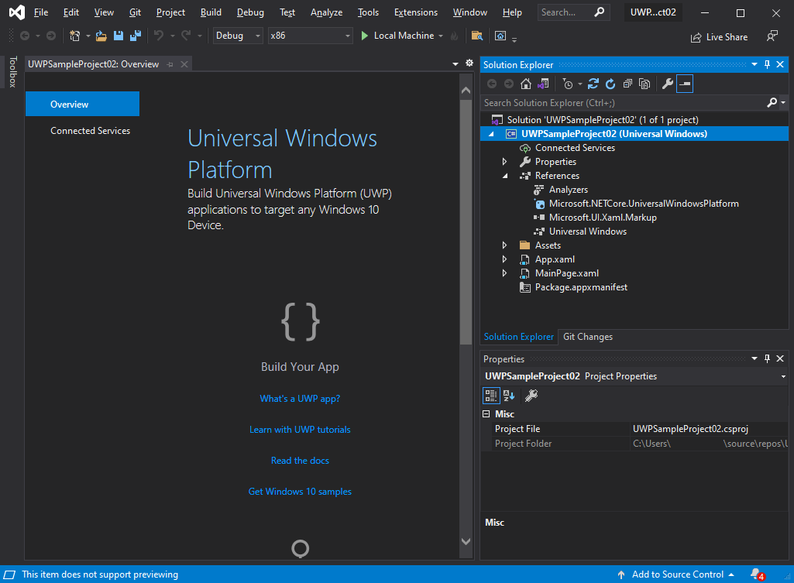

# Get started with WebView2 in WinUI 2 (UWP) apps (public preview)

This article covers how to set up your development tools and create an initial WebView2 app for WinUI 2 (UWP), and learn about WebView2 concepts along the way.

<!-- todo:
Reformat article as a flat series of h2 Step sections starting at 1, each containing flat list of action steps.
Use strictly controlled linking - only provide a hyperlink if it's in an instruction-step that says what to do with the link.
-->
<!--todo: move any lengthy, solution-independent Dev environment setup steps out of each Get Started guide into machine-setup.md -->

WinUI 2 only supports UWP.


**WebView2 features which have limited functionality on WinUI 2 (UWP)**

The WebView2 WinUI 2 control is in development.  The following features haven't been implemented, or have issues:

*  Download UI.
   *  Although the Download UI feature currently doesn't work, this feature might show up automatically in your app's UI after the issue is fixed.  To maintain compatibility, you should manually disable the Download UI feature by intercepting the [download starting event](/microsoft-edge/webview2/reference/winrt/microsoft_web_webview2_core/corewebview2downloadstartingeventargs).
*  Autofill UI.
*  File Picker Dialog.
*  Background Audio.
*  Print to PDF.
*  Print Preview.
*  Adding COM Objects (WinRT `AddHostObject`).
*  Playready DRM.
*  Service Workers on Windows devices before 20H2.


Follow the major Step sections in sequence, below.


<!-- ====================================================================== -->
## Step 1 - Download a preview channel of Microsoft Edge

1. Take a quick look at the NuGet page for the [WinUI 2 package](https://www.nuget.org/packages/Microsoft.UI.Xaml/2.8.0-prerelease.210927001), but you don't need to install it yet.<!--confirm-->  This package has a dependency on a _prerelease_ WebView2 SDK NuGet package.

   For full API compatibility of the NuGet package and WebView2 Runtime, use a preview browser channel as your runtime, such as the Beta, Dev, or Canary channel of Microsoft Edge, as follows.

1. Download the [WebView2 Runtime](https://developer.microsoft.com/microsoft-edge/webview2/#download-section), or download any [Microsoft Edge Insider (preview) Channel](https://www.microsoftedgeinsider.com/download) (Beta, Dev, or Canary).
   <!-- applicable?
   on a supported operating system (OS):
   *  Windows 7
   *  Windows 8.1
   *  Windows 10
   *  Windows 11 -->

   We recommend using the Canary channel of Microsoft Edge.
  <!-- applicable? The minimum required version is 82.0.488.0. -->


<!-- ====================================================================== -->
## Step 2 - Install Visual Studio

1. Install [Microsoft Visual Studio 2019 version 16.9](/visualstudio/releases/2019/release-notes-v16.9) or later.  Accept the defaults.

1. If Visual Studio doesn't show line numbers in the code editor, turn on line numbers.  To do this, select **Tools** > **Options** > **Text Editor** > **All Languages** > **Line numbers**.  Then click **OK**.


<!-- ====================================================================== -->
## Step 3 - Install UWP tools

1. Open Microsoft Visual Studio.
 
1. Click **Tools** > **Get Tools and Features**.  The **Visual Studio Installer** window opens.

1. On the **Workloads** tab, click **.NET Desktop Development**.

1. Click **Desktop development with C++**.

1. Click **Universal Windows Platform development**.

1. On the right, expand **Installation Details** > **Universal Windows Platform development**, and then click **C++ (v142) Universal Windows Platform tools**.

   The **Modifying Visual Studio 2019** dialog displays cards and installation details.  Installation details for Universal Windows Platform development shows included and optional items:

   

1. Click **Modify**.  Visual Studio installs the selected features.


<!-- ====================================================================== -->
## Step 4 - Create a UWP app

1. In Visual Studio, select **File** > **New** > **Project**.  Or use the startup screen of Visual Studio, then select **Create a new project**.  The **Create a new project** dialog box opens.

1. On the **All languages** dropdown list, click **C#**.

1. On the **All platforms** dropdown list, click **Windows**.

1. On the **All project types** dropdown list, click **UWP**.  As a result of your filter selections, several types of app templates are listed.

1. In the list of app templates, click **Blank App (Universal Windows)**.

   The **Create a new project** dialog box appears.  The filter criteria are highlighted in red.  The blank app (Universal Windows) card is highlighted in red:

   

1. Click **Next**.

   The **Configure your new project** dialog appears, for a **Blank App (Universal Windows)**:

   

   <!-- Text boxes displayed are **Project name**, **Location**, **Solution**, and **Solution name**. -->

1. In the **Project name** text box, enter a project name such as `UWPSampleProject`.

1. Click **Create**.  The **New Universal Windows Platform Project** dialog box appears.

1. In the **Developer Mode** section, click **On**.  The **Use developer features** dialog box opens, to confirm turning on developer mode.

1. Click **Yes**, then close the **Settings** window.

   Visual Studio displays the solution and project:

   


<!-- ====================================================================== -->
## Step 5 - Install WinUI 2

1. Right-click the project in Solution Explorer, and then select **Manage NuGet Packages**.

1. Select the **Browse** tab.

1. Select the **Include prerelease** check box.

1. In the **Search** box, enter **Microsoft.UI.Xaml**, and then select **Microsoft.UI.Xaml**.  Make sure that the **Version** is the latest prerelease, and then click the  **Install** (or **Update**) button:

   

   **Microsoft.UI.Xaml** here is equivalent to WinUI 2.  The **Preview Changes** dialog box appears.

1. Click **OK**.

1. The **License Acceptance** dialog box appears.  Click **I Accept**.  The `readme.txt` file is displayed.

<!-- note: install halted after only WinUI 2 component, it didn't seem to install WebView2 even though that was the 2nd item listed.  assume that's ok now on test machine. -->


<!-- maintenance link; keep: main copy:
[Install the WebView2 SDK](../how-to/machine-setup.md#install-the-webview2-sdk) in _Set up your Dev environment for WebView2_
-->
<!-- ====================================================================== -->
## Step 6 - Install the WebView2 SDK

The WebView2 SDK is automatically installed in the above step, because it's as a dependency for the WinUI package that you installed.  Confirm that the WebView2 SDK is installed for the project, as follows:

1. In the **NuGet Package Manager**, which you opened in the previous step, make sure the **Include prerelease** checkbox is selected.  Search for **Microsoft.Web.WebView2** (prerelease) and then click its card below the search box.  If needed, on the right, click the  **Install** (or **Update**) button.

If needed, in a new window or tab, see [Install the WebView2 SDK](../how-to/machine-setup.md#install-the-webview2-sdk) in _Set up your Dev environment for WebView2_, and follow the steps.  Return from that page and continue the steps below.


<!-- ====================================================================== -->
## Step 7 - Instantiate the WebView2 control in XAML code

### Add the project reference for the WebView2 control

1. In the `MainPage.xaml` file, in the `<Page>` element, add the following attribute below the other `xmlns:` attributes.

   ```xml
   xmlns:control="using:Microsoft.UI.Xaml.Controls"
   ```

### Add the WebView2 control to the grid

1. In the `MainPage.xaml` file, in the `<Grid>` element, add the following element:

   ```xml
   <control:WebView2 x:Name="wv2" Source="https://bing.com"/>
   ```

1. Save the file. Above the `MainPage.xaml` file in the code editor, a preview of the WebView2 content is displayed:

   

### Build and test the WebView2 project

1. Click **Debug** > **Start Debugging**.  The app window opens, briefly showing the WebView2 WebUI grid:

   

1. After a moment, the app window shows the Bing website in the WebView2 control for WebUI 2.

   The sample app with WebView2 control displays the Bing website:

   

1. In Visual Studio, click **Debug** > **Stop Debugging** to close the app window.

Now you can change the content of the WebView2 control to add your own content.


<!--
maintenance link (keep)
* [Navigation events for WebView2 apps](../concepts/navigation-events.md) - main copy; update it and then propagate/copy to these h2 sections:
-->
<!-- ====================================================================== -->
## Step 8 - Navigation events

Next, learn about navigation events, which are essential for WebView2 apps.

In a new window or tab, read one of the following sections, and then return to this page:

*  [Navigation events for WebView2 apps](../concepts/navigation-events.md)

Congratulations, you built your first WebView2 app!


<!-- ====================================================================== -->
## See also

* [Microsoft Edge WebView2](https://developer.microsoft.com/microsoft-edge/webview2) - initial introduction to WebView2 features at developer.microsoft.com.
* [Manage user data folders](../concepts/user-data-folder.md)
* WinRT API Reference for WinUI 2/UWP
   * [Core](/microsoft-edge/webview2/reference/winrt/microsoft_web_webview2_core/index)
   * [COM Interop](/microsoft-edge/webview2/reference/winrt/interop/index)
* [WebView2 API Reference](../webview2-api-reference.md) - each platform's API Reference


* [WinRT API Reference: Core](/microsoft-edge/webview2/reference/winrt/microsoft_web_webview2_core/index)
* [WinRT API Reference: COM Interop](/microsoft-edge/webview2/reference/winrt/interop/index)


<!-- ====================================================================== -->
## Next steps

* [Sample Code for WebView2](../code-samples-links.md) - a guide to the `WebView2Samples` repo.
   * [WebView2Samples repo](https://github.com/MicrosoftEdge/WebView2Samples)
   * [WebView2 UWP Sample App](https://github.com/MicrosoftEdge/WebView2Samples/tree/master/SampleApps/webview2_sample_uwp) - a comprehensive example of WebView2 capabilities.
* [Development best practices for WebView2 apps](../concepts/developer-guide.md)
* [See also](../index.md#see-also) in _Introduction to Microsoft Edge WebView2_ - Conceptual and how-to articles about building and deploying WebView2 apps.
* [Issues - microsoft-ui-xaml repo](https://github.com/microsoft/microsoft-ui-xaml/issues) - to enter WinUI-specific feature requests or bugs.
