# Get started with WebView2 in WinUI 2 (UWP) apps

This article is to learn to write your own WebView2 code.  If you want to run a sample first, see [Win32 sample app](../samples/webview2apissample.md) or another sample app article, such as [WinUI 2 (UWP) sample app](../samples/webview2_sample_uwp.md).

In this tutorial, you:
*  Set up your development tools for creating UWP apps that use WebView2 to display web content.
*  Create an initial WinUI 2 (UWP) app.
*  Install the **Microsoft.UI.Xaml** package (WinUI 2) for the project.
*  Add a WebView2 control that displays webpage content.
*  Learn about WebView2 concepts along the way.

You use the **C# Blank App (Universal Windows)** project template, then install the **Microsoft.UI.Xaml** package (WinUI 2) for this project.  Installing that package installs the **Microsoft.Web.WebView2** package (the WebView2 SDK) as a dependency.

The **Microsoft.UI.Xaml** (WinUI 2) package is part of the Windows UI Library.  This package provides Windows UI features, including:
*  UWP XAML controls.
*  Dense control styles.
*  Fluent styles and materials.


<!-- ------------------------------ -->
#### Platforms

This article applies to Windows and Xbox.

WinUI 2 supports UWP only.  These controls are backward-compatible.

See also:
* [Media App Samples for Xbox](https://github.com/microsoft/Media-App-Samples-for-Xbox)


<!-- ------------------------------ -->
#### Completed project

A completed version of this Getting Started project (solution) is in the WebView2Samples repo.  You can use the completed solution (from the repo or from doing the below steps) as a baseline to add more WebView2 code and other features.

A completed version of this tutorial project is available in the **WebView2Samples** repo:
*  Sample name: **WinUI2_Sample**
*  Repo directory: [WinUI2_GettingStarted](https://github.com/MicrosoftEdge/WebView2Samples/tree/main/GettingStartedGuides/WinUI2_GettingStarted)
*  Solution file: **MyUWPGetStartApp.sln**


Follow the major Step sections in sequence, below.


<!-- ------------------------------ -->
#### About WinUI and WebView2

In WinUI 2 (UWP) apps, WebView2 is exposed as a XAML control.  After you embed the XAML control in your app as a named control, you can then refer to that XAML control within C# files.

Only a subset of WebView2 interfaces/functions are exposed in WinUI:

* The `WebView2` XAML object exposes the `CoreWebView2` interface, along with the most important functionality.

* Interfaces such as `CoreWebView2Controller` are hidden, because WinUI takes care of the environment and window creation behind the scenes.

See also:
* [XAML limitation](../platforms/winui2-uwp.md#xaml-limitation) in _WebView2 in WinUI 2 (UWP) apps_.


<!-- ====================================================================== -->
## Step 1 - Install Visual Studio

This article shows steps and screenshots for Visual Studio 2022 Community Edition.  Microsoft Visual Studio 2019 version 16.9 or later is required.  Visual Studio 2017 isn't supported.
<!-- https://learn.microsoft.com/visualstudio/releases/2019/release-notes-v16.9 -->

1. If a suitable version of Microsoft Visual Studio isn't installed already, in a new window or tab, see [Install Visual Studio](../how-to/machine-setup.md#install-visual-studio) in _Set up your Dev environment for WebView2_.  Follow the steps in that page to do a basic default installation of Visual Studio, such as Visual Studio 2022 Community Edition.

   Then return to this page and continue below.

1. If Visual Studio doesn't show line numbers in the code editor, you may want to turn on line numbers.  To do this, select **Tools** > **Options** > **Text Editor** > **All Languages** > **Line numbers**.  Then click **OK**.


<!-- ====================================================================== -->
## Step 2 - Install workloads for .NET desktop, C++ desktop, and UWP development tools

1. Open Microsoft Visual Studio.  The opening option window appears:

   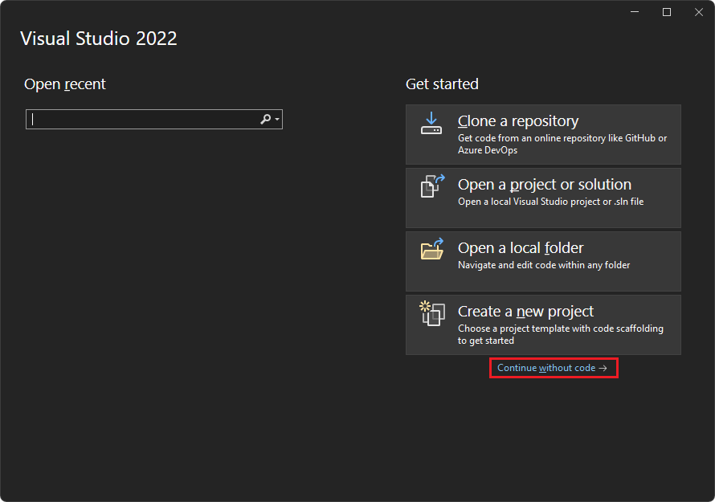

1. In the lower right, click **Continue without code**.  Visual Studio opens, empty:

   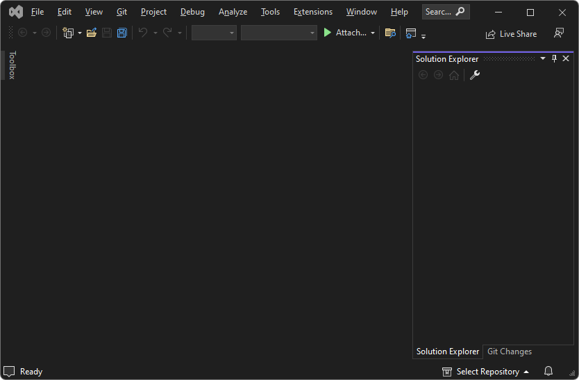

1. Select **Tools** > **Get Tools and Features**.  The **Visual Studio Installer** window opens, and then the **Modifying - Visual Studio** window opens over it:

   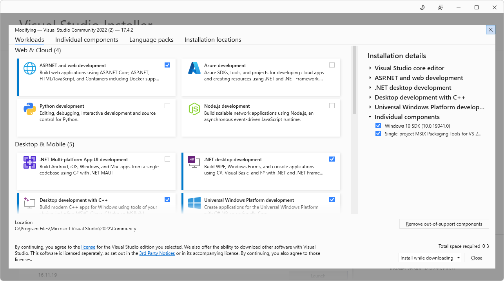

  If the **Modifying Visual Studio** window isn't open, in the **Visual Studio Installer** window, click the **Modify** button.

1. On the **Workloads** tab, scroll to and click the following cards, to select them; make sure a checkmark is on each of these cards:
   * **.NET desktop development**
   * **Desktop development with C++**
   * **Universal Windows Platform development**

1. On the right, in the **Installation details** section, expand **Universal Windows Platform development**, and then select **C++ (v143) Universal Windows Platform tools**:

   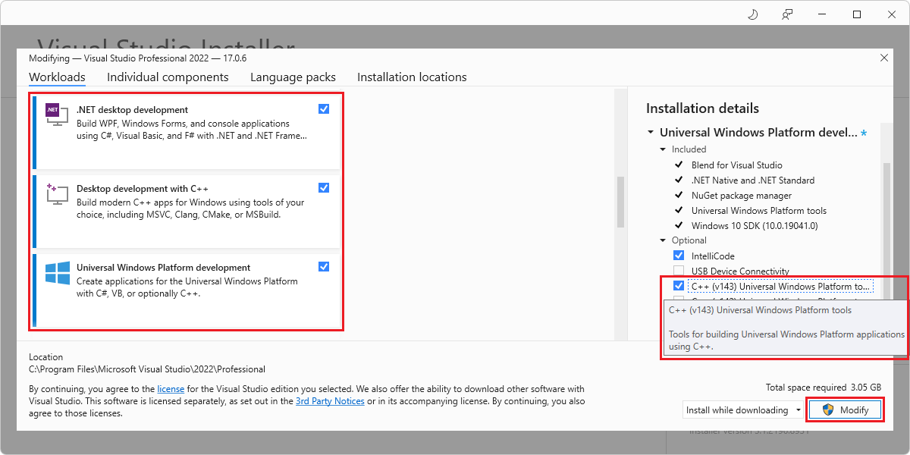
   <!-- old screenshot of VS Pro edition, not feasible to update in this pass -->

   <!-- or, you can select **C++ (v142) Universal Windows Platform tools** -->

   If all of these components have already been installed, click the **Close** button, close the **Visual Studio Installer** window, and skip to the next major section of steps below.

1. Click the **Modify** button.

   A **User Account Control** window appears, asking "Do you want to allow this app to make changes to your device?  Visual Studio Installer.  Verified publisher: Microsoft Corporation.  File origin: Hard drive on this computer.  Show more details (button)".

1. Click the **Yes** button.

1. A dialog appears, "Before we get started, close Visual Studio":

   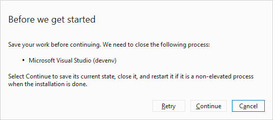

1. Click the **Continue** button.

   Visual Studio downloads, verifies, and installs the selected packages:

   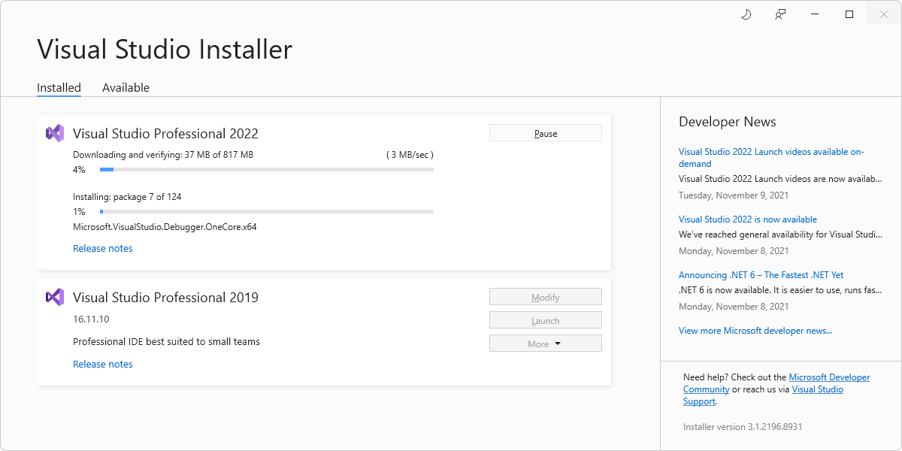

   This screenshot shows Visual Studio Professional 2022, though this article was actually updated using Visual Studio Community 2022.

   Installation can take several minutes.  Visual Studio appears, with an empty **Solution Explorer**.

1. Press **Alt+Tab** to switch to the **Visual Studio Installer** window, and then close the **Visual Studio Installer** window.


<!-- ====================================================================== -->
## Step 3 - Create a UWP app

1. If Visual Studio is open, select **File** > **New** > **Project**.  The **Create a new project** dialog opens.

   Or, if Visual Studio is closed, open it, and then in the startup screen of Visual Studio, click the **Create a new project** card:

   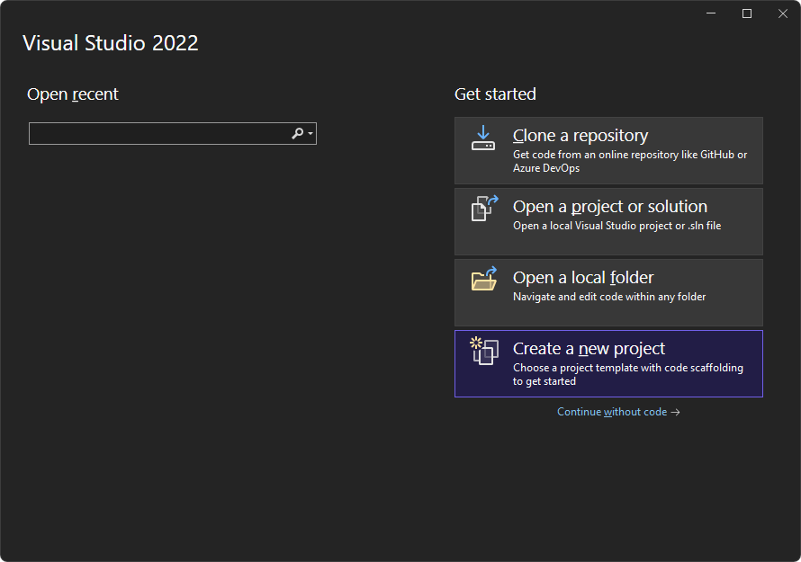

1. In the **Search for templates** text box at the top, enter **C# Blank App (Universal Windows)**, and then select the **C# Blank App (Universal Windows)** card:

   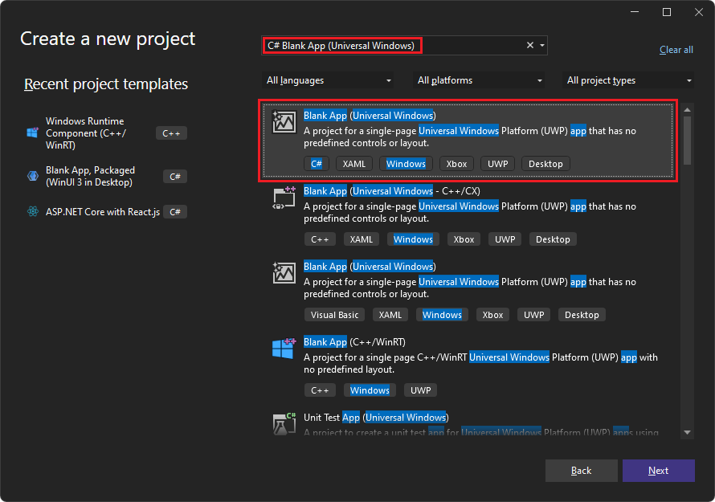

1. Click the **Next** button.

   The **Configure your new project** dialog appears, for a **Blank App (Universal Windows)**:

   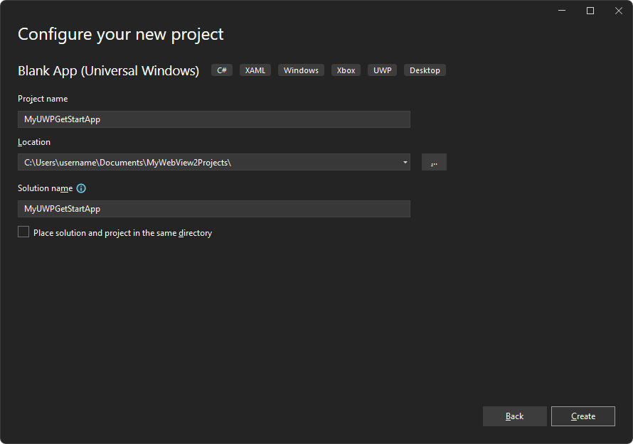

1. In the **Project name** text box, enter a project name, such as `MyUWPGetStartApp`.

1. In the **Location** text box, enter a path, such as `C:\Users\myusername\Documents\MyWebView2Projects`.

1. Click the **Create** button.

   The **New Windows Project** dialog appears:

   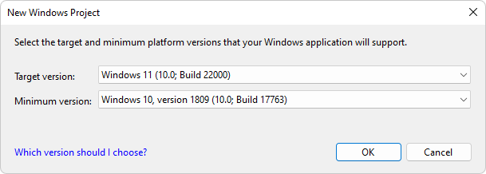

1. Accept the defaults, and click the **OK** button.

1. If the **Developer Mode** window section appears, in that section, click **On**.  If you haven't already set your machine to Developer Mode, the **Use developer features** dialog opens, to confirm turning on developer mode.
   *  Click **Yes** to turn on Developer Mode for your machine, and then close the **Settings** window.

   Visual Studio displays the newly created solution and project:

   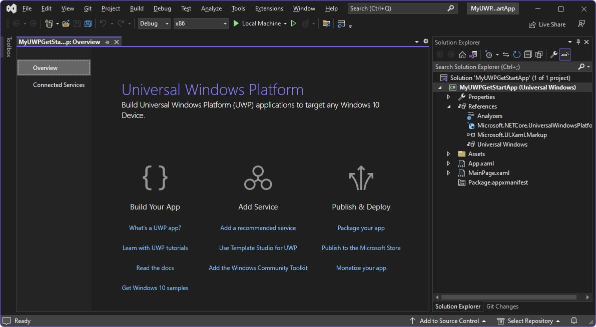


<!-- ====================================================================== -->
## Step 4 - Build and run the empty project

Before adding WebView2 code, confirm that the project works and see what the empty app looks like, as follows:

1. Build and run the empty project.  To do this, select **Debug** > **Start Debugging** (**F5**).  The app's window opens, temporarily displays a grid, and then displays the app's content:

   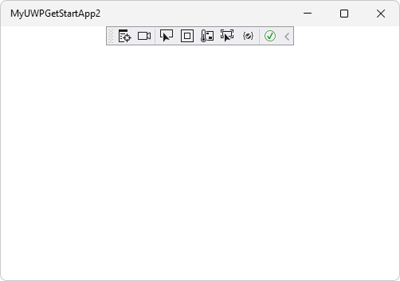

   This is a baseline WinUI 2 (UWP) app, without WebView2 yet.

1. Close the app.

Next, you set up this new WinUI 2 (UWP) project to host the WebView2 control and use the WebView2 API.


<!-- ====================================================================== -->
## Step 5 - Install the WinUI 2 SDK (Microsoft.UI.Xaml)

Next, you install the **Microsoft.UI.Xaml** package for this project.  Microsoft.UI.Xaml is WinUI 2.

1. In Solution Explorer, right-click the project (not the solution node above it), and then select **Manage NuGet Packages**.

   The **NuGet Package Manager** panel opens in Visual Studio.

1. In the **NuGet Package Manager**, click the **Browse** tab.

1. Clear the **Include prerelease** check box.

1. In the **Search** box, enter **Microsoft.UI.Xaml**, and then select the **Microsoft.UI.Xaml** card below the search box:

   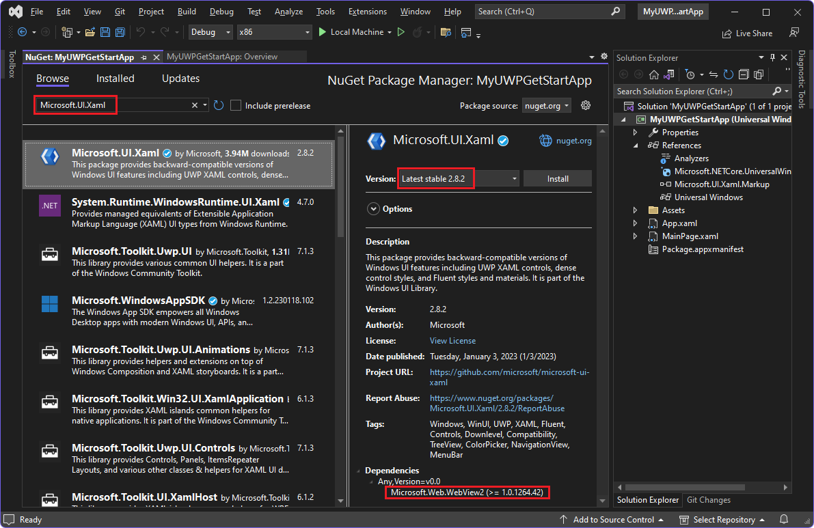

   For version 2.8.0 or later, in the **Dependencies** section at the bottom, **Microsoft.Web.WebView2** is listed.

   For HoloLens 2 development, the **Microsoft.Web.WebView2** package must be version 1.0.1722.45 or higher, which may be higher than the default.  WebView2 on HoloLens 2 is in Preview and is subject to change before general availability. WebView2 is only supported on HoloLens 2 devices running the Windows 11 update. For more information, see [Update HoloLens 2](/hololens/hololens-update-hololens).

1. In the middle panel, in the **Version** dropdown list, make sure **Latest stable** is selected, version 2.8.0 or later.

1. Click the  **Install** button.

   The **Preview Changes** dialog appears:

   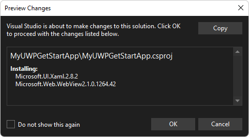

1. Click the **OK** button.

1. The **License Acceptance** dialog appears:

   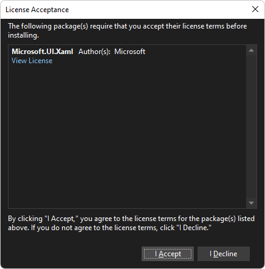

1. Click the **I Accept** button.  In Visual Studio, the `readme.txt` file is displayed, saying that you've installed the WinUI package:

   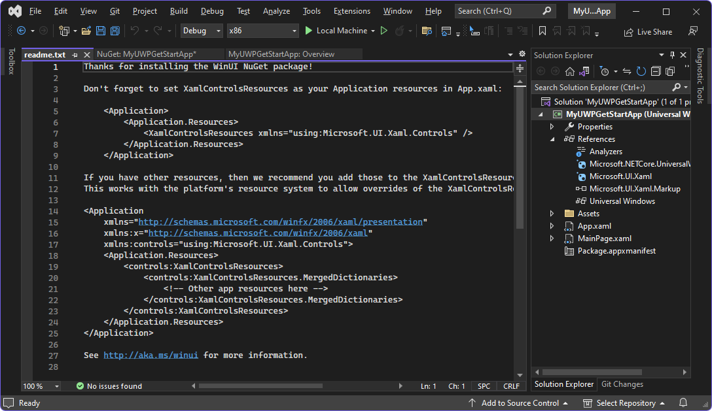

   The readme lists some lines of code that are similar to what we'll add.

1. Select **File** > **Save All** (**Ctrl+Shift+S**).

You've now installed the Microsoft.UI.Xaml package, which is WinUI 2, for your project.  The WinUI 2 SDK (Microsoft.UI.Xaml) includes the WebView2 SDK, so you don't need to separately install the NuGet package for WebView2 SDK.


<!-- ====================================================================== -->
## Step 6 - Instantiate the WebView2 control in XAML code

Now you are ready to add WebView2 code to the project.  First, add a namespace reference for the WebView2 control, as follows:

1.  In Solution Explorer, expand your project, and then double-click **MainPage.xaml**.

    `MainPage.xaml` opens in a designer with a code editor below it:

    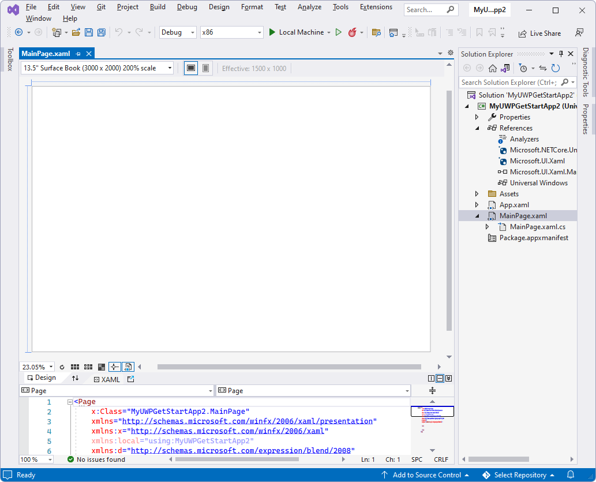

1. In the code editor, inside the `<Page>` element's start tag `<Page`, add the following attribute, below the other `xmlns:` attributes:

    ```xml
    xmlns:controls="using:Microsoft.UI.Xaml.Controls"
    ```

    Add a WebView2 control to the XAML grid, as follows:

1.  In the `MainPage.xaml` file, in the `<Grid>` element (which contains no other elements yet), add a WebView2 control, by adding the following element:

    ```xml
    <controls:WebView2 x:Name="WebView2" Source="https://bing.com"/>
    ```

1.  Press **Ctrl+S** to save the file.

    Above the `MainPage.xaml` file in the code editor, a preview of the WebView2 control's content might be displayed, or it might remain blank (white) until you first build the app:

    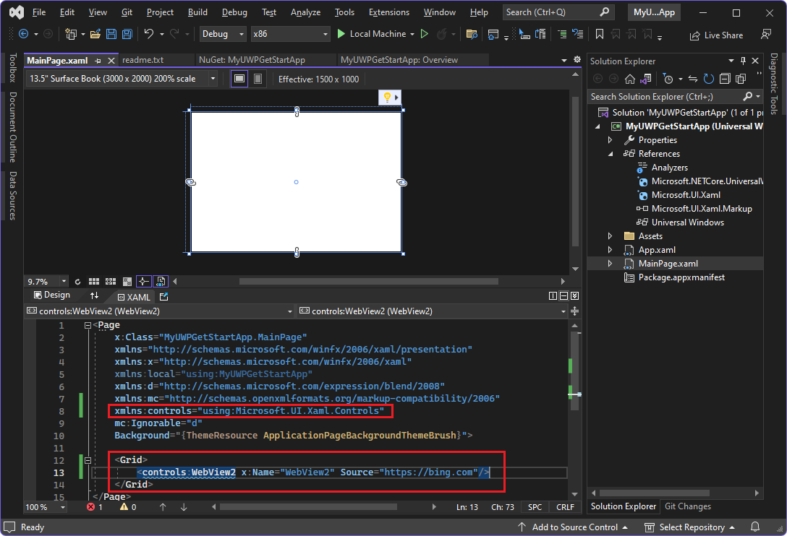

    The wavy underlining goes away after building and running the app, in the next step.


<!-- ====================================================================== -->
## Step 7 - Build and run the project containing the WebView2 control

1. Click **Debug** > **Start Debugging** (**F5**).  (If building for HoloLens 2, see [Using Visual Studio to deploy and debug](/windows/mixed-reality/develop/advanced-concepts/using-visual-studio?tabs=hl2)). The app window opens, briefly showing the WebView2 WinUI grid:

   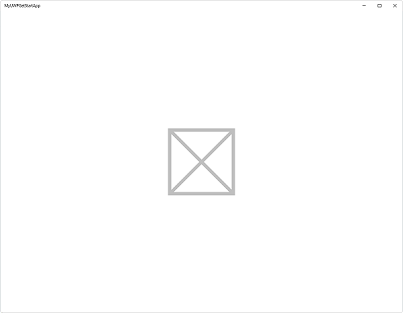

1. After a moment, the app window shows the Bing website in the WebView2 control for WinUI 2:

   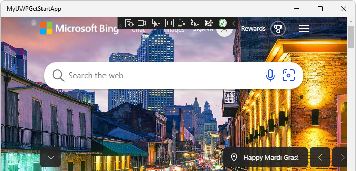

1. In Visual Studio, select **Debug** > **Stop Debugging** to close the app window.

Congratulations, you built your first WebView2 app!

Now you can change the content of the WebView2 control to add your own content.


<!--
maintenance link (keep)
* [Navigation events for WebView2 apps](../concepts/navigation-events.md) - main copy; update it and then propagate/copy to these h2 sections:
-->
<!-- ====================================================================== -->
## Learn about navigation events

Next, learn about navigation events, which are essential for WebView2 apps.  The app initially navigates to `https://bing.com`.

* In a new window or tab, read [Navigation events for WebView2 apps](../concepts/navigation-events.md), and then return to this page.


<!-- ====================================================================== -->
## See also

* [WebView2 in WinUI 2 (UWP) apps](../platforms/winui2-uwp.md)
* [WebView2 API Reference](../webview2-api-reference.md)
* [Development best practices for WebView2 apps](../concepts/developer-guide.md)
   * [Manage user data folders](../concepts/user-data-folder.md)
* [WebView2 sample apps](../samples/index.md) - a guide to the `WebView2Samples` repo.
   * [WinUI 2 (UWP) sample app](../samples/webview2_sample_uwp.md) - steps to download, update, build, and run the WinUI 2 WebView2 sample.
* Get Started tutorial finished project: Unlike some of the other tutorials, there isn't a completed version of this Getting Started tutorial in the WebView2Samples repo.

GitHub:
* [WebView2Samples repo](https://github.com/MicrosoftEdge/WebView2Samples)
* [WebView2 UWP Sample App](https://github.com/MicrosoftEdge/WebView2Samples/tree/main/SampleApps/webview2_sample_uwp) - the WinUI 2 (UWP) WebView2 sample.
* [Issues - microsoft-ui-xaml repo](https://github.com/microsoft/microsoft-ui-xaml/issues) - to enter WinUI-specific feature requests or bugs.
* [Media App Samples for Xbox](https://github.com/microsoft/Media-App-Samples-for-Xbox)

NuGet:
* [Microsoft.UI.Xaml NuGet package](https://www.nuget.org/packages/Microsoft.UI.Xaml/)
