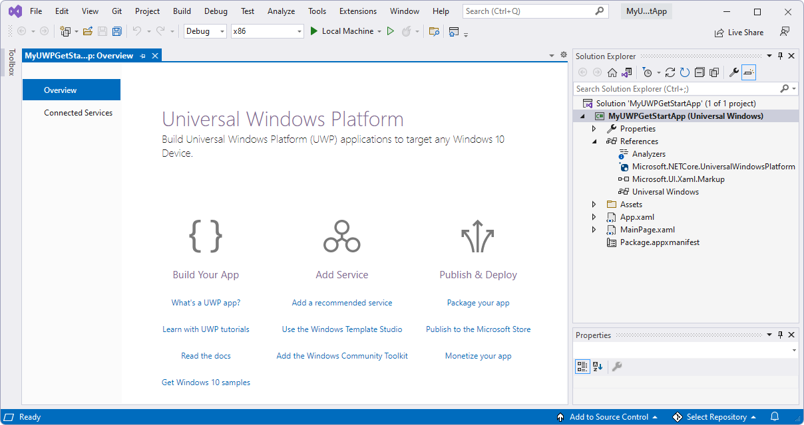
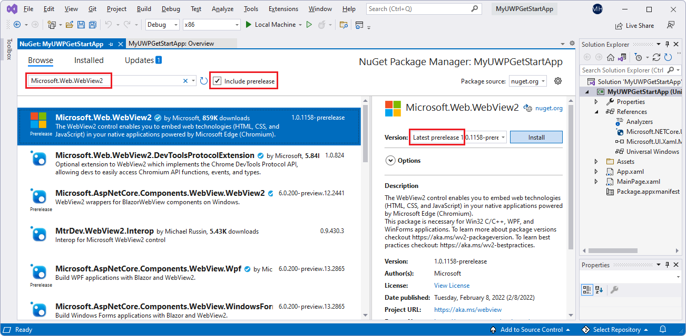
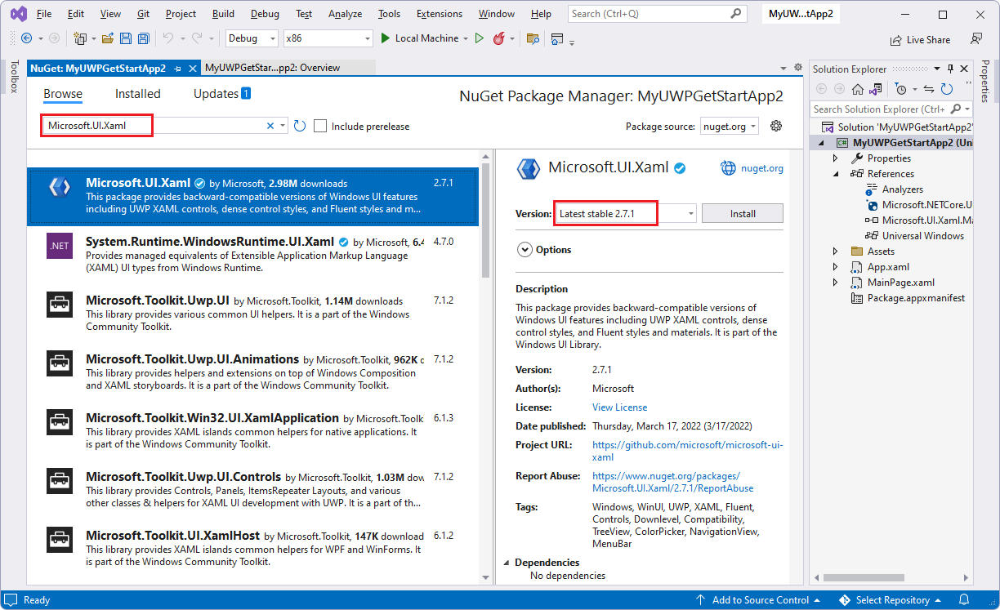
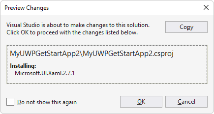
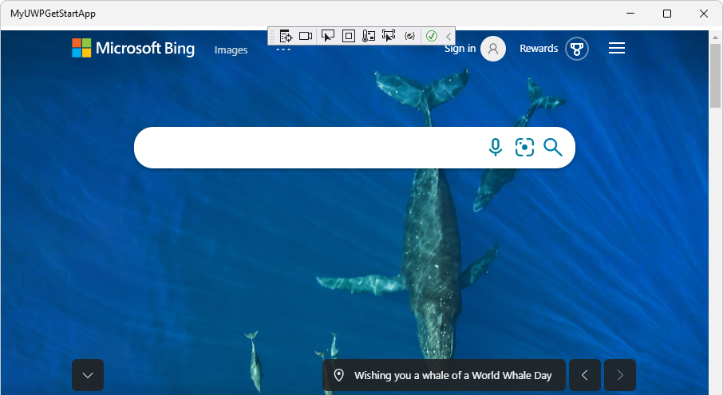

# Get started with WebView2 in WinUI 2 (UWP) apps

In this tutorial, you:
*  Set up your development tools for creating UWP apps that use WebView2 to display web content.
*  Create an initial WinUI 2 (UWP) app.
*  Add a WebView2 control that displays webpage content.
*  Learn about WebView2 concepts along the way.

The **Microsoft.UI.Xaml** (WinUI 2) package is part of the Windows UI Library.  This package provides Windows UI features, including:
*  UWP XAML controls
*  Dense control styles
*  Fluent styles and materials.

WinUI 2 supports UWP only.  These controls are backward-compatible.

Follow the major Step sections in sequence, below.


<!-- ====================================================================== -->
## Step 1 - Download a preview channel of Microsoft Edge

For full API compatibility of the **Microsoft.UI.Xaml** (WinUI 2) package and WebView2, this tutorial uses a _prerelease_<!-- todo: update re "prerelease"? --> version of WebView2 SDK, together with a preview channel of Microsoft Edge.  (This tutorial doesn't use the other supported combination, which is a _release_ version of WebView2 SDK + the WebView2 Runtime.)

1. If you haven't already, download any [Microsoft Edge Insider (preview) Channel](https://www.microsoftedgeinsider.com/download) (Beta, Dev, or Canary) on a supported operating system (OS):
   *  Windows 7
   *  Windows 8.1
   *  Windows 10
   *  Windows 11

   We recommend using the Canary channel of Microsoft Edge.  The minimum required version is 82.0.488.0.


<!-- ====================================================================== -->
## Step 2 - Install Visual Studio

Visual Studio 2019 version 16.9 or later is required, for this tutorial.  Visual Studio 2017 isn't supported.  If you need information about Visual Studio 2019 version 16.9, in a new window or tab, see [Microsoft Visual Studio 2019 version 16.9](/visualstudio/releases/2019/release-notes-v16.9).

1. If a suitable version of Microsoft Visual Studio isn't installed already, in a new window or tab, see [Install Visual Studio](../how-to/machine-setup.md#install-visual-studio) in _Set up your Dev environment for WebView2_.  Follow the steps in that page to do a basic default installation of Visual Studio.

   Then return to this page and continue below.

1. Relevant for Visual Studio 2019: If Visual Studio doesn't show line numbers in the code editor, turn on line numbers.  To do this, select **Tools** > **Options** > **Text Editor** > **All Languages** > **Line numbers**.  Then click **OK**.


<!-- ====================================================================== -->
## Step 3 - Install .NET desktop, C++ desktop, and UWP development tools

1. Open Microsoft Visual Studio.  The opening option window appears:

   
 
1. In the lower right, click **Continue without code**.  Visual Studio opens, empty:

   

1. Select **Tools** > **Get Tools and Features**.  The **Visual Studio Installer** window opens, and then the **Modifying Visual Studio** window opens over it:

   

  If the **Modifying Visual Studio** window isn't open, in the **Visual Studio Installer** window, click the **Modify** button.

1. On the **Workloads** tab, scroll to and click the following cards, to select them; make sure a checkmark is on each of these cards:
   * **.NET desktop development**
   * **Desktop development with C++**
   * **Universal Windows Platform development**

1. On the right, in the **Installation details** section, expand **Universal Windows Platform development**, and then select **C++ (v142) Universal Windows Platform tools** or v143:

   

   _To zoom, right-click > **Open image in new tab**._

1. Click the **Modify** button.

   A **User Account Control** window appears, asking "Do you want to allow this app to make changes to your device?  Visual Studio Installer.  Verified publisher: Microsoft Corporation.  File origin: Hard drive on this computer.  Show more details (button)".

1. Click the **Yes** button.

1. A dialog box appears, "Before we get started, close Visual Studio":

   
   
1. Click the **Continue** button.

   Visual Studio downloads, verified, and installs the selected packages:

   

   This can take several minutes.  In a new window or tab, you can check out a top-level overview at [Microsoft Edge WebView2](https://developer.microsoft.com/microsoft-edge/webview2) - an initial introduction to WebView2 features at developer.microsoft.com.

   When Visual Studio Installer is finished, return to this page and continue with the steps below.

1. Close the **Visual Studio Installer** window.

   The Visual Studio window remains empty.


<!-- ====================================================================== -->
## Step 4 - Create a UWP app

1. If Visual Studio is open, select **File** > **New** > **Project**.

   Or, if Visual Studio is closed, open it, and then in the startup screen of Visual Studio, click the **Create a new project** card:

   

   The **Create a new project** dialog box opens.   

1. In the **Search for templates** text box at the top, enter **C# Blank App (Universal Windows)**, and then select the **C# Blank App (Universal Windows)** card:

   

1. Click the **Next** button.

   The **Configure your new project** dialog appears, for a **Blank App (Universal Windows)**:

   

1. In the **Project name** text box, enter a project name, such as `MyUWPGetStartApp`.

1. In the **Location** text box, enter a path, such as `C:\Users\myusername\Documents\MyWebView2Projects`.

1. Click the **Create** button.

   The **New Universal Windows Platform Project** dialog box appears:

   

1. Accept the defaults, and click the **OK** button.

1. If the **Developer Mode** section appears, in that section, click **On**.  If you haven't already set your machine to Developer Mode, the **Use developer features** dialog box opens, to confirm turning on developer mode.

1. Click **Yes** to turn on Developer Mode for your machine, and then close the **Settings** window.

   Visual Studio displays the newly created solution and project:

   

Next, you set up this new WinUI 2 (UWP) project to host the WebView2 control and use the WebView2 API.


<!-- maintenance link; keep: main copy:
[Install the WebView2 SDK](../how-to/machine-setup.md#install-the-webview2-sdk) in _Set up your Dev environment for WebView2_
-->
<!-- ====================================================================== -->
## Step 5 - Install the WebView2 SDK

1. In Solution Explorer, right-click the project (not the solution node above it), and then select **Manage NuGet Packages**.

   The **NuGet Package Manager** panel opens in Visual Studio.

1. In the **NuGet Package Manager**, click the **Browse** tab.

1. To the right of the search text box, clear the **Include prerelease** check box.

1. In the search text box, enter **Microsoft.Web.WebView2**.

   The **Microsoft.Web.WebView2** card appears in the search results.

1. Click the **Microsoft.Web.WebView2** card below the search box.

1. On the right, in the **Version** dropdown list, make sure **Latest prerelease** is selected:<!-- todo: update re "prerelease" -->

   <!-- todo: update re "prerelease" -->

   _To zoom, right-click > **Open image in new tab**._

1. Click the **Install** (or **Update**) button.

   <!-- If needed, in a new window or tab, see [Install the WebView2 SDK](../how-to/machine-setup.md#install-the-webview2-sdk) in _Set up your Dev environment for WebView2_.  Return from that page and continue the steps below. -->

   The **Preview Changes** dialog box appears:

   <!-- todo: update re "prerelease" -->

1. Click the **OK** button.

The WebView2 SDK is now installed for this project.


<!-- ====================================================================== -->
## Step 6 - Install the prerelease WinUI 2 SDK (Microsoft.UI.Xaml)<!-- todo: update re "prerelease"? -->

Next, you install the _prerelease_<!-- todo: update re "prerelease"? --> **Microsoft.UI.Xaml** package.  Microsoft.UI.Xaml is WinUI 2.

1. If the **NuGet Package Manager** panel isn't open: in Solution Explorer, right-click the project (not the solution node above it), and then select **Manage NuGet Packages**.

   The **NuGet Package Manager** panel opens in Visual Studio.

1. In the **NuGet Package Manager**, click the **Browse** tab.

1. Clear the **Include prerelease** check box.<!-- todo: updated to Clear re "prerelease"? -->

1. In the **Search** box, enter **Microsoft.UI.Xaml**, and then select the **Microsoft.UI.Xaml** card below the search box.

1. On the right, make sure that the **Version** is **Latest prerelease**.<!-- todo: update re "prerelease"? -->

1. Click the  **Install** (or **Update**) button:

   

   _To zoom, right-click > **Open image in new tab**._

   The **Preview Changes** dialog box appears:

   

1. Click the **OK** button.

1. The **License Acceptance** dialog box appears:

   

1. Click the **I Accept** button.  In Visual Studio, the `readme.txt` file is displayed, saying that you've installed the WinUI package:

   

   The readme lists some lines of code that are similar to what we'll add.

1. Select **File** > **Save All**.

You've now installed the Microsoft.UI.Xaml package, which is WinUI (WinUI 2), for your project.


<!-- ====================================================================== -->
## Step 7 - Instantiate the WebView2 control in XAML code

Now you are ready to add WebView2 code to the project.  First, add a namespace reference for the WebView2 control, as follows:

1. In Solution Explorer, expand your project, and then click **MainPage.xaml**.

   `MainPage.xaml` opens in a designer with a code editor below it.

1. In the code editor, in the `<Page>` element's open tag `<Page`, add the following attribute, below the other `xmlns:` attributes:

   ```xml
   xmlns:control="using:Microsoft.UI.Xaml.Controls"
   ```

Now, add a WebView2 control to the XAML grid, as follows:

1. In the `MainPage.xaml` file, in the `<Grid>` element (which contains no other elements yet), add the following element:

   ```xml
   <control:WebView2 x:Name="wv2" Source="https://bing.com"/>
   ```

1. Press `Ctrl`+`S` to save the file.

   Above the `MainPage.xaml` file in the code editor, a preview of the WebView2 content might be displayed, or it might remain blank (white) until you first run the app:

   

   _To zoom, right-click > **Open image in new tab**._

<!-- 1. Resize the preview grid to make it bigger. -->


### Build and test the WebView2 project

1. Click **Debug** > **Start Debugging**.  The app window opens, briefly showing the WebView2 WebUI grid:

   

1. After a moment, the app window shows the Bing website in the WebView2 control for WebUI 2.

   The sample app with WebView2 control displays the Bing website:

   

1. In Visual Studio, click **Debug** > **Stop Debugging** to close the app window.

Now you can change the content of the WebView2 control to add your own content.


<!--
maintenance link (keep)
* [Navigation events for WebView2 apps](../concepts/navigation-events.md) - main copy; update it and then propagate/copy to these h2 sections:
-->
<!-- ====================================================================== -->
## Step 8 - Navigation events

Next, learn about navigation events, which are essential for WebView2 apps.

The app initially navigates to `https://bing.com`.

1. In a new window or tab, read [Navigation events for WebView2 apps](../concepts/navigation-events.md), and then return to this page.

Congratulations, you built your first WebView2 app!


<!-- ====================================================================== -->
## Status of WebView2 functionality on WinUI 2 (UWP)

The WebView2 WinUI 2 (UWP) control is in development.  The following features haven't been implemented, or are disabled due to pending work:

*  Downloads.
   *  Downloading files is only available in preview via the Edge Dev channel until Edge 104; moreover, it is disabled by default. To enable, please use the command line switch `edge-webview-optional-enable-uwp-regular-downloads`. There are a couple of known limitations to the current downloads behavior for WebView2 in UWP:
        * The downloads hub is currently disabled.
        * Depending on the user's OS, downloaded files will be downloaded to different folders. For Windows 11, the downloaded files will appear in a subfolder with the app package's name in the Downloads folder. For OS's below Windows 11, the downloaded files will appear in a subfolder named WebView2Downloads within this app package's subfolder in the Downloads folder.
        * Additionally, saving files via Save As is functional and enabled for UWP WebView2. The files will be saved in the respective folder the user selects.
*  Autofill UI.
*  Print to PDF.
*  Default printing is disabled, however developers may work around this by using CapturePreviewAsync (though this only captures the current viewport).

Package summary:
* [Overview of the NuGet package for Microsoft.UI.Xaml](https://www.nuget.org/packages/Microsoft.UI.Xaml/)


<!-- ====================================================================== -->
## WinUI 2 WebView2 special considerations


### SmartScreen

WebView2 sends URLs that are navigated to in your application to the [SmartScreen](/windows/security/threat-protection/microsoft-defender-smartscreen/microsoft-defender-smartscreen-overview) service, to ensure that your customers stay secure. If you want to disable this navigation, you can do so via an environment variable:

* `Environment.SetEnvironmentVariable("WEBVIEW2_ADDITIONAL_BROWSER_ARGUMENTS", "--disable-features=msSmartScreenProtection");`

This environment variable must be set prior to `CoreWebView2` creation, which occurs when the [WebView2.Source property](https://docs.microsoft.com/windows/winui/api/microsoft.ui.xaml.controls.webview2.source) is set or the [WebView2.EnsureCoreWebView2Async method](https://docs.microsoft.com/windows/winui/api/microsoft.ui.xaml.controls.webview2.ensurecorewebview2async) is called.


### API limitations

The following interfaces aren't accessible in WinUI 2:

* `ICoreWebView2Environment`
* `ICoreWebView2EnvironmentOptions` and `ICoreWebView2EnvironmentOptions2`
* `ICoreWebView2ControllerOptions`


<!-- ====================================================================== -->
## See also

Local pages:
* [WebView2 sample: WinUI 2 (UWP) browser app](../samples/webview2_sample_uwp.md)
* [Manage user data folders](../concepts/user-data-folder.md)
* [Sample Code for WebView2](../code-samples-links.md) - a guide to the `WebView2Samples` repo.
* [Development best practices for WebView2 apps](../concepts/developer-guide.md)
* [See also](../index.md#see-also) in _Introduction to Microsoft Edge WebView2_ - Conceptual and how-to articles about building and deploying WebView2 apps.

GitHub:
* [WebView2Samples repo](https://github.com/MicrosoftEdge/WebView2Samples)
* [WebView2 UWP Sample App](https://github.com/MicrosoftEdge/WebView2Samples/tree/main/SampleApps/webview2_sample_uwp) - a comprehensive example of WebView2 capabilities.
* [Issues - microsoft-ui-xaml repo](https://github.com/microsoft/microsoft-ui-xaml/issues) - to enter WinUI-specific feature requests or bugs.

WinRT API Reference for WinUI 2 (UWP):
* [Core](/microsoft-edge/webview2/reference/winrt/microsoft_web_webview2_core/index)
* [COM Interop](/microsoft-edge/webview2/reference/winrt/interop/index)
* [WebView2 API Reference](../webview2-api-reference.md) - each platform's API Reference
* [WinRT API Reference: Core](/microsoft-edge/webview2/reference/winrt/microsoft_web_webview2_core/index)
* [WinRT API Reference: COM Interop](/microsoft-edge/webview2/reference/winrt/interop/index)
