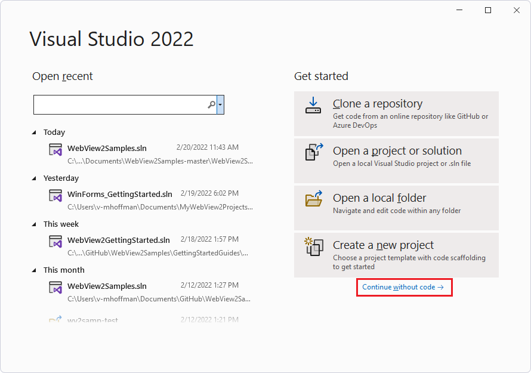
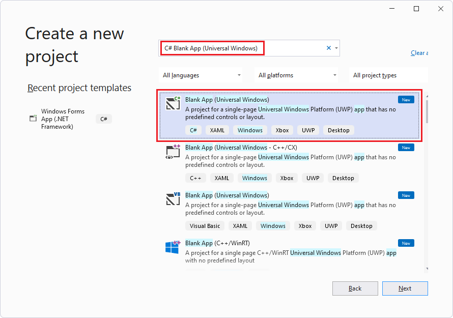
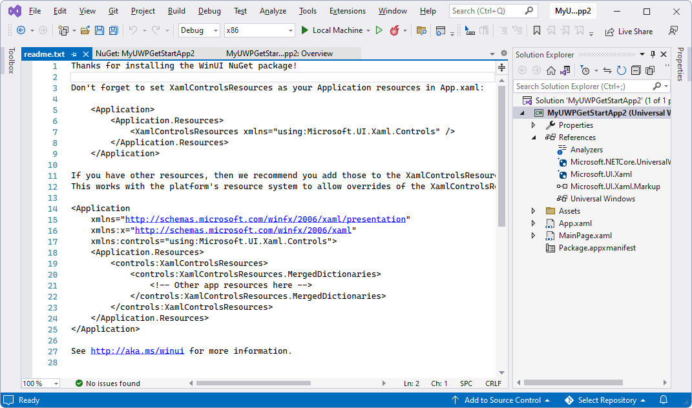
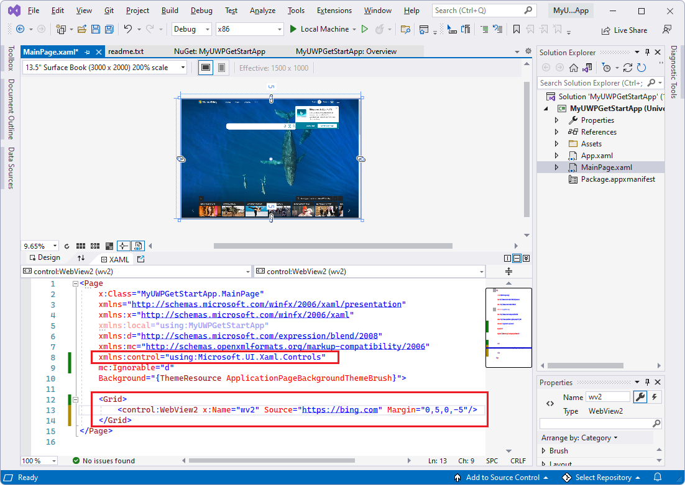

# Get started with WebView2 in WinUI 2 (UWP) apps

In this tutorial, you:
*  Set up your development tools for creating UWP apps that use WebView2 to display web content.
*  Create an initial WinUI 2 (UWP) app.
*  Install the **Microsoft.UI.Xaml** package (WinUI 2) for the project.
*  Add a WebView2 control that displays webpage content.
*  Learn about WebView2 concepts along the way.

You use the **C# Blank App (Universal Windows)** project template, then install the **Microsoft.UI.Xaml** package (WinUI 2) for this project.  Installing that package installs the **Microsoft.Web.WebView2** package (the WebView2 SDK) as a dependency.

The **Microsoft.UI.Xaml** (WinUI 2) package is part of the Windows UI Library.  This package provides Windows UI features, including:
*  UWP XAML controls.
*  Dense control styles.
*  Fluent styles and materials.

WinUI 2 supports UWP only.  These controls are backward-compatible.


#### Completed project

Unlike some of the other tutorials, there isn't a completed version of this Getting Started tutorial in the WebView2Samples repo.
<!-- A completed version of this tutorial project is available in the **WebView2Samples** repo:
*  Sample name: **__**
*  Repo directory: [__](__)
*  Solution file: **__.sln**
-->

Follow the major Step sections in sequence, below.


<!-- ====================================================================== -->
## Step 1 - Install Visual Studio

Visual Studio 2019 version 16.9 or later is required, for this tutorial.  Visual Studio 2022 is supported.  Visual Studio 2017 isn't supported.
<!-- https://learn.microsoft.com/visualstudio/releases/2019/release-notes-v16.9 -->

1. If a suitable version of Microsoft Visual Studio isn't installed already, in a new window or tab, see [Install Visual Studio](../how-to/machine-setup.md#install-visual-studio) in _Set up your Dev environment for WebView2_.  Follow the steps in that page to do a basic default installation of Visual Studio.

   Then return to this page and continue below.

1. Relevant for Visual Studio 2019: If Visual Studio doesn't show line numbers in the code editor, turn on line numbers.  To do this, select **Tools** > **Options** > **Text Editor** > **All Languages** > **Line numbers**.  Then click **OK**.


<!-- ====================================================================== -->
## Step 2 - Install workloads for .NET desktop, C++ desktop, and UWP development tools

1. Open Microsoft Visual Studio.  The opening option window appears:

   

1. In the lower right, click **Continue without code**.  Visual Studio opens, empty:

   

1. Select **Tools** > **Get Tools and Features**.  The **Visual Studio Installer** window opens, and then the **Modifying - Visual Studio** window opens over it:

   

  If the **Modifying Visual Studio** window isn't open, in the **Visual Studio Installer** window, click the **Modify** button.

1. On the **Workloads** tab, scroll to and click the following cards, to select them; make sure a checkmark is on each of these cards:
   * **.NET desktop development**
   * **Desktop development with C++**
   * **Universal Windows Platform development**

1. On the right, in the **Installation details** section, expand **Universal Windows Platform development**, and then select **C++ (v143) Universal Windows Platform tools** or **C++ (v142) Universal Windows Platform tools**:

   

   If all of these components have already been installed, you can click the **Close** button, close the **Visual Studio Installer** window, and skip to the next major section of steps below.

1. Click the **Modify** button.

   A **User Account Control** window appears, asking "Do you want to allow this app to make changes to your device?  Visual Studio Installer.  Verified publisher: Microsoft Corporation.  File origin: Hard drive on this computer.  Show more details (button)".

1. Click the **Yes** button.

1. A dialog box appears, "Before we get started, close Visual Studio":

   

1. Click the **Continue** button.

   Visual Studio downloads, verifies, and installs the selected packages:

   

   This can take several minutes.  In a new window or tab, you can check out a top-level overview at [Microsoft Edge WebView2](https://developer.microsoft.com/microsoft-edge/webview2) - an initial introduction to WebView2 features at developer.microsoft.com.

   When Visual Studio Installer is finished, return to this page and continue with the steps below.  Visual Studio appears, with an empty **Solution Explorer**.

1. Press `Alt`+`Tab` to switch to the **Visual Studio Installer** window, and then close the **Visual Studio Installer** window.


<!-- ====================================================================== -->
## Step 3 - Create a UWP app

1. If Visual Studio is open, select **File** > **New** > **Project**.  The **Create a new project** dialog box opens.

   Or, if Visual Studio is closed, open it, and then in the startup screen of Visual Studio, click the **Create a new project** card:

   

1. In the **Search for templates** text box at the top, enter **C# Blank App (Universal Windows)**, and then select the **C# Blank App (Universal Windows)** card:

   

1. Click the **Next** button.

   The **Configure your new project** dialog appears, for a **Blank App (Universal Windows)**:

   

1. In the **Project name** text box, enter a project name, such as `MyUWPGetStartApp`.

1. In the **Location** text box, enter a path, such as `C:\Users\myusername\Documents\MyWebView2Projects`.

1. Click the **Create** button.

<!-- apparently old ui, doesn't appear in latest vs2022 july 11 2022, apparently got simplified later:
   The **New Universal Windows Platform Project** dialog box appears:

   
 -->

   The **New Windows Project** dialog box appears:

   

1. Accept the defaults, and click the **OK** button.

1. If the **Developer Mode** window section appears, in that section, click **On**.  If you haven't already set your machine to Developer Mode, the **Use developer features** dialog box opens, to confirm turning on developer mode.  
   *  Click **Yes** to turn on Developer Mode for your machine, and then close the **Settings** window.

   Visual Studio displays the newly created solution and project:

   


<!-- ====================================================================== -->
## Step 4 - Build and run the empty project

Before adding WebView2 code, confirm that the project works and see what the empty app looks like, as follows:

1. Build and run the empty project.  To do this, select **Debug** > **Start Debugging** (`F5`).

   

1. Close the app.

Next, you set up this new WinUI 2 (UWP) project to host the WebView2 control and use the WebView2 API.


<!-- ====================================================================== -->
## Step 5 - Install the WinUI 2 SDK (Microsoft.UI.Xaml)

Next, you install the **Microsoft.UI.Xaml** package for this project.  Microsoft.UI.Xaml is WinUI 2.

1. In Solution Explorer, right-click the project (not the solution node above it), and then select **Manage NuGet Packages**.

   The **NuGet Package Manager** panel opens in Visual Studio.

1. In the **NuGet Package Manager**, click the **Browse** tab.

1. Clear the **Include prerelease** check box.

1. In the **Search** box, enter **Microsoft.UI.Xaml**, and then select the **Microsoft.UI.Xaml** card below the search box:

   
   <!-- TODO: update capture after 2.8 GA, show Microsoft.Web.WebView2 in Dependencies -->

   The above image shows 2.7.1, but these instructions are actually written for 2.8 or later, for General Availability of WebView2 in the Microsoft.UI.Xaml NuGet package.
   <!-- TODO: remove note after update image -->

   For version 2.8.0 or later, in the **Dependencies** section, **Microsoft.Web.WebView2** might be<!-- TODO: confirm after GA, change to "is" --> listed.

1. On the right, make sure that the **Version** is **Latest stable**, 2.8.0 or later.

1. Click the  **Install** button.

   The **Preview Changes** dialog box appears:

   
   <!-- TODO: update capture after 2.8 GA, show 2.8.0 or later -->

   The above image shows 2.7.1, but these instructions are actually written for 2.8.0 or later, for General Availability of WebView2 in the Microsoft.UI.Xaml NuGet package.
   <!-- TODO: remove note after update image -->

1. Click the **OK** button.

1. The **License Acceptance** dialog box appears:

   

1. Click the **I Accept** button.  In Visual Studio, the `readme.txt` file is displayed, saying that you've installed the WinUI package:

   

   The readme lists some lines of code that are similar to what we'll add.

1. Select **File** > **Save All** (`Ctrl`+`Shift`+`S`).

You've now installed the Microsoft.UI.Xaml package, which is WinUI 2, for your project.  The WinUI 2 SDK (Microsoft.UI.Xaml) includes the WebView2 SDK, so you don't need to separately install the NuGet package for WebView2 SDK.


<!-- ====================================================================== -->
## Step 6 - Instantiate the WebView2 control in XAML code

Now you are ready to add WebView2 code to the project.  First, add a namespace reference for the WebView2 control, as follows:

1.  In Solution Explorer, expand your project, and then double-click **MainPage.xaml**.

    `MainPage.xaml` opens in a designer with a code editor below it:

    

1. In the code editor, in the `<Page>` element's open tag `<Page`, add the following attribute, below the other `xmlns:` attributes:

    ```xml
    xmlns:controls="using:Microsoft.UI.Xaml.Controls"
    ```

    Add a WebView2 control to the XAML grid, as follows:

1.  In the `MainPage.xaml` file, in the `<Grid>` element (which contains no other elements yet), add the following element:

    ```xml
    <controls:WebView2 x:Name="WebView2" Source="https://bing.com"/>
    ```

1.  Press `Ctrl`+`S` to save the file.

    Above the `MainPage.xaml` file in the code editor, a preview of the WebView2 content might be displayed, or it might remain blank (white) until you first build the app:

    

    The above image shows "control" on two lines; we recommend using the word "controls" on those lines instead.
    <!-- TODO: update capture after GA -->

<!--
1. Resize the preview grid to make it bigger.
-->


<!-- ====================================================================== -->
## Step 7 - Build and run the project containing the WebView2 control

1. Click **Debug** > **Start Debugging**.  The app window opens, briefly showing the WebView2 WebUI grid:

   

1. After a moment, the app window shows the Bing website in the WebView2 control for WebUI 2:

   

1. In Visual Studio, click **Debug** > **Stop Debugging** to close the app window.

Congratulations, you built your first WebView2 app!

Now you can change the content of the WebView2 control to add your own content.


<!--
maintenance link (keep)
* [Navigation events for WebView2 apps](../concepts/navigation-events.md) - main copy; update it and then propagate/copy to these h2 sections:
-->
<!-- ====================================================================== -->
## Learn about navigation events

Next, learn about navigation events, which are essential for WebView2 apps.  The app initially navigates to `https://bing.com`.

* In a new window or tab, read [Navigation events for WebView2 apps](../concepts/navigation-events.md), and then return to this page.


<!-- ====================================================================== -->
## Status of WebView2 functionality on WinUI 2 (UWP)

The WebView2 WinUI 2 (UWP) control is in development.  The following features haven't been implemented, or are disabled due to pending work:

*  Downloads.
   *  Downloading files is only available in preview via the Edge Dev channel until Edge 104; moreover, it is disabled by default. To enable, please use the command line switch `edge-webview-optional-enable-uwp-regular-downloads`. There are a couple of known limitations to the current downloads behavior for WebView2 in UWP:
        * The downloads hub is currently disabled.
        * Depending on the user's OS, downloaded files will be downloaded to different folders. For Windows 11, the downloaded files will appear in a subfolder with the app package's name in the Downloads folder. For OS's below Windows 11, the downloaded files will appear in a subfolder named WebView2Downloads within this app package's subfolder in the Downloads folder.
        * Additionally, saving files via Save As is functional and enabled for UWP WebView2. The files will be saved in the respective folder the user selects.
*  Autofill UI.
*  Print to PDF.
*  Default printing is disabled, however developers may work around this by using CapturePreviewAsync (though this only captures the current viewport).
* `Edge Developer Tools` cannot be launched inside a store signed WebView2 WinUI 2 (UWP) app, however developers may work around this by using [Remote Debugging](../how-to/remote-debugging.md).

Package summary:
* [Overview of the NuGet package for Microsoft.UI.Xaml](https://www.nuget.org/packages/Microsoft.UI.Xaml/)


<!-- ====================================================================== -->
## WinUI 2 WebView2 special considerations


#### SmartScreen

WebView2 sends URLs that are navigated to in your application to the [SmartScreen](/windows/security/threat-protection/microsoft-defender-smartscreen/microsoft-defender-smartscreoverview) service, to ensure that your customers stay secure. If you want to disable this navigation, you can do so via an environment variable:

* `Environment.SetEnvironmentVariable("WEBVIEW2_ADDITIONAL_BROWSER_ARGUMENTS", "--disable-features=msSmartScreenProtection");`

This environment variable must be set prior to `CoreWebView2` creation, which occurs when the [WebView2.Source property](/windows/winui/api/microsoft.ui.xaml.controls.webview2.source) is initially set or the [WebView2.EnsureCoreWebView2Async method](/windows/winui/api/microsoft.ui.xaml.controls.webview2.ensurecorewebview2async) is initially called.

#### Xbox, HoloLens, and XAML limitations

This version of WebView 2 will only work on PC-class devices, offering the full range of capability found in the WinUI 3 variant. Xbox, HoloLens, and XAML Island support requires additional work, and these devices and scenarios may be considered at a future point in time.

#### API limitations

The following interfaces aren't accessible in WinUI 2:

* `ICoreWebView2Environment`
* `ICoreWebView2EnvironmentOptions` and `ICoreWebView2EnvironmentOptions2`
* `ICoreWebView2ControllerOptions`


<!-- ====================================================================== -->
## API Reference

* [WinRT API Reference: Core (C#)](/microsoft-edge/webview2/reference/winrt/microsoft_web_webview2_core/index)
* [WinRT API Reference: COM Interop (C++)](/microsoft-edge/webview2/reference/winrt/interop/index)

All platforms/languages:
* [WebView2 API Reference](../webview2-api-reference.md) - API Reference for each platform


<!-- ====================================================================== -->
## See also

Local pages:
* [WinUI 2 (UWP) sample app](../samples/webview2_sample_uwp.md) - steps to download, update, build, and run the WinUI 2 WebView2 sample.
* [Manage user data folders](../concepts/user-data-folder.md)
* [Sample Code for WebView2](../code-samples-links.md) - a guide to the `WebView2Samples` repo.
* [Development best practices for WebView2 apps](../concepts/developer-guide.md)
* [See also](../index.md#see-also) in _Introduction to Microsoft Edge WebView2_ - articles about building and deploying WebView2 apps.

GitHub:
* [WebView2Samples repo](https://github.com/MicrosoftEdge/WebView2Samples)
* [WebView2 UWP Sample App](https://github.com/MicrosoftEdge/WebView2Samples/tree/main/SampleApps/webview2_sample_uwp) - the WinUI 2 (UWP) WebView2 sample.
* [Issues - microsoft-ui-xaml repo](https://github.com/microsoft/microsoft-ui-xaml/issues) - to enter WinUI-specific feature requests or bugs.
*  Unlike some of the other tutorials, there isn't a completed version of this Getting Started tutorial in the WebView2Samples repo.
