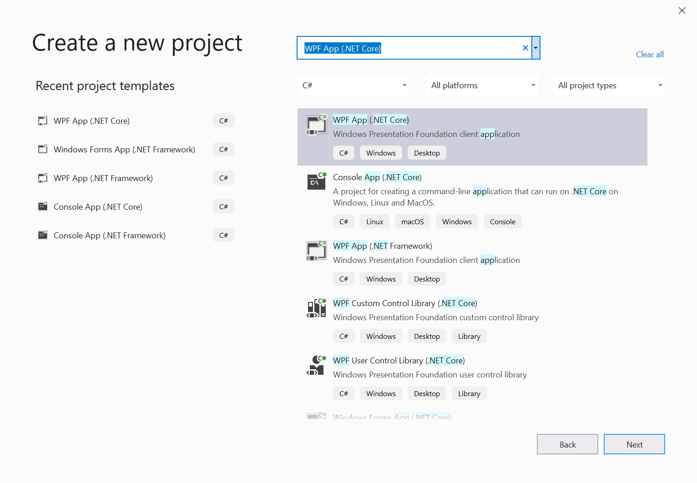
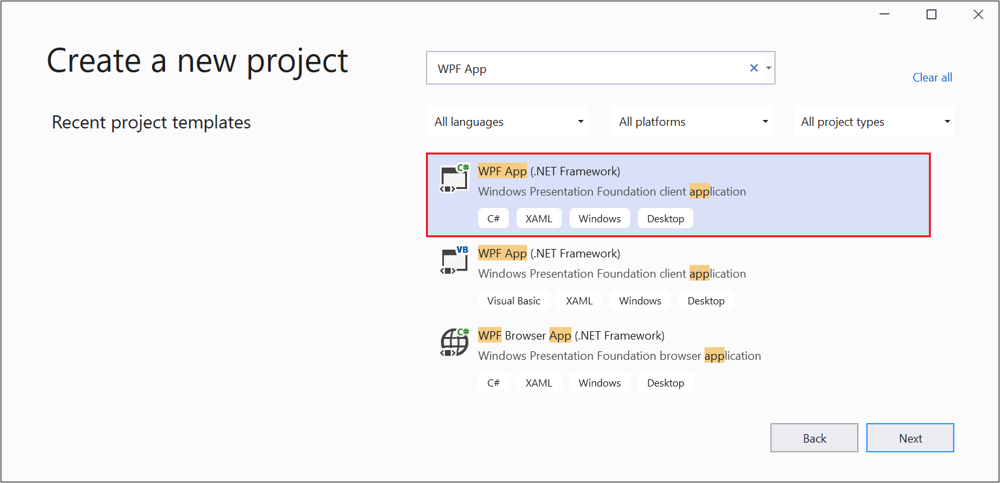
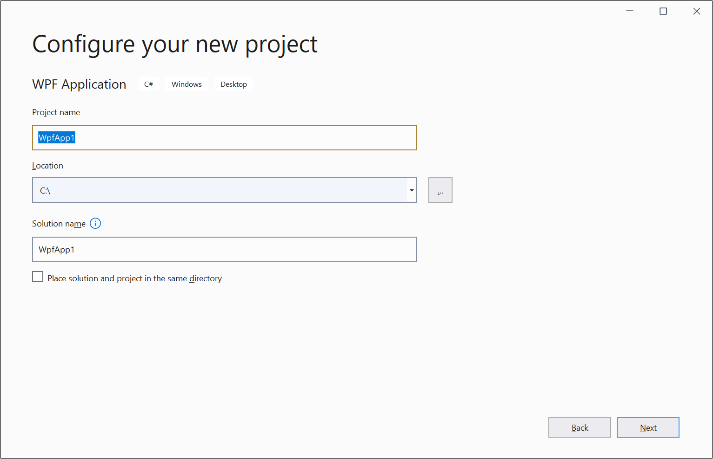
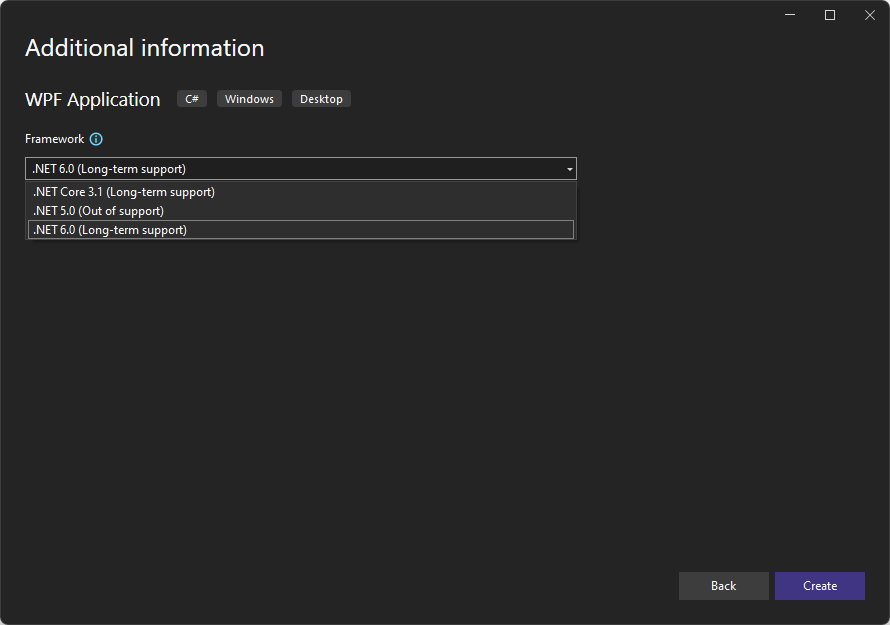
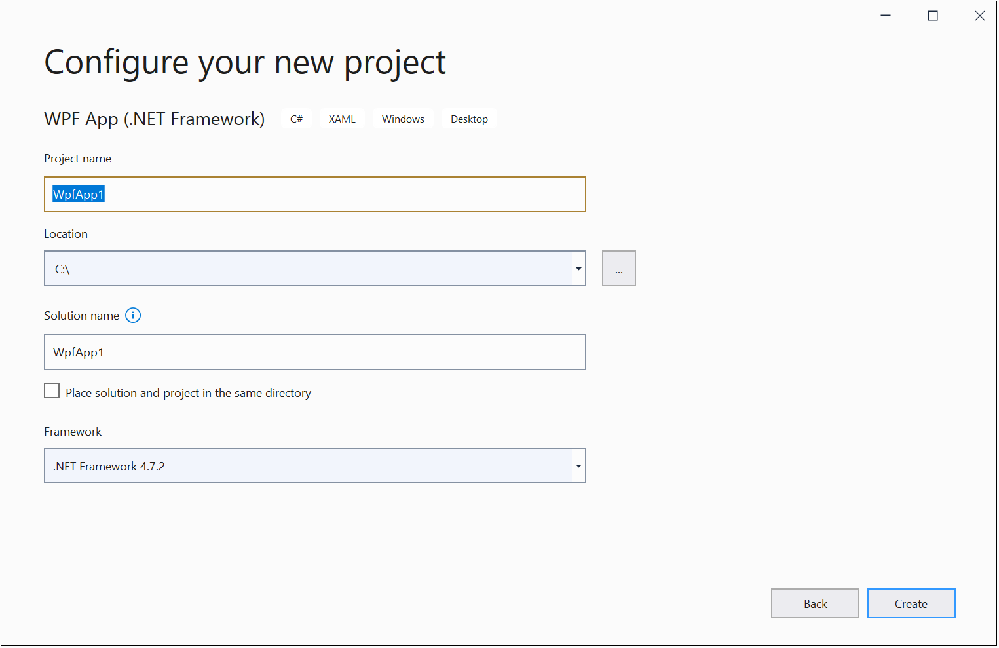

# Get started with WebView2 in WPF apps

In this article, get started creating your first WebView2 app in Windows Presentation Foundation (WPF) apps, and learn about the main features of [WebView2](https://developer.microsoft.com/microsoft-edge/webview2). For more information on individual APIs, see [API reference](/dotnet/api/microsoft.web.webview2.wpf).


<!-- ====================================================================== -->
## Step 0 - Prerequisites

Install the following list of prerequisites before proceeding.

1. [Visual Studio](https://visualstudio.microsoft.com) 2017 or later.

1. [WebView2 Runtime](https://developer.microsoft.com/microsoft-edge/webview2), or any [Microsoft Edge Insider (preview) Channel](https://www.microsoftedgeinsider.com/download) (Beta, Dev, or Canary) installed on a supported operating system (OS). The currently supported OS list is Windows 11, Windows 10, Windows 8.1, and Windows 7.

   The WebView2 team recommends using the Canary channel of Microsoft Edge.  The minimum required version is 82.0.488.0.


<!-- ====================================================================== -->
## Step 1 - Create a single-window app

Start with a basic desktop project that contains a single main window.

1. Open Microsoft Visual Studio. 

1. In the opening panel click **Create new project**.  Or, in the main Visual Studio window, select **File** > **New** > **Project**.

1. Search for `WPF App`.
 
   The **Create a new project** panel shows filtered results for `WPF App` search results.

1. Click either the **WPF App (.NET Core)** card (shown first below) or the **WPF App (.NET Framework)** card (shown second below), and then click **Next**:

   The highlighted card in the following image is **WPF Application: .NET Core WPF Application**:
    
   

   Alternatively, the highlighted card in the following image is **WPF App (.NET Framework): Windows Presentation Foundation client application**:

   

   The **Configure your new project** WPF application dialog box appears.

   

1.  Enter values for **Project name** and **Location**, and then click **Next**.

   The **Additional information** dialog box appears, with a **Target Framework** dropdown list.  Choices are **.NET Core 3.0**, **3.1**, and **5.0**:

   

1. Select **.NET Core 3.1**, or later (not **3.0**).  Then click **Next**.

   The **Configure your new project** dialog box appears, for **WPF App (.NET framework)**:

   

1. Enter values for **Project name** and **Location**.

1. In the Framework dropdown list, select **.NET Framework 4.6.2** or later.

1. Click the **Create** button.

   Visual Studio creates the project.


<!-- ====================================================================== -->
## Step 2 - Install WebView2 SDK

Use NuGet to add the WebView2 SDK to the project.

1. In **Solution Explorer**, right-click the project name, and then select **Manage NuGet Packages**:

   :::image type="content" source="./media/wpf-getting-started-mng-nuget-reduced.png" alt-text="The 'Manage NuGet packages' command on the right-click menu.":::

1. In the upper left, click the **Browse** tab.  In the search bar, type `Microsoft.Web.WebView2`, then click the **Microsoft.Web.WebView2** card.

   The NuGet package manager dialog box displays search results, including a **Microsoft.Web.WebView2** card.  The dialog box has a version number and **Install** button.
   
   :::image type="content" source="./media/install-nuget.png" alt-text="NuGet package manager dialog box displays the Microsoft.Web.WebView2 card." lightbox="./media/install-nuget.png":::

1. Accept the default version, and then click the **Install** button.

1. In the **Preview Changes** dialog box, click **OK**.

1. Select **File** > **Save All** to save the project.

1. Press **F5** to build and run the project.

   The project runs, and displays an empty window.  This verifies that WebView2 is installed and working, although WebView2 has no content to display yet:

   :::image type="content" source="./media/winforms-empty-app.png" alt-text="Empty app window." lightbox="./media/winforms-empty-app.png":::


<!-- ====================================================================== -->
## Step 3 - Create a single WebView

Add a WebView2 control to your app.

1. In the `MainWindow.xaml` file, to add the WebView2 XAML namespace, insert the following line inside the `<Window/>` tag:

   ```xml
   xmlns:wv2="clr-namespace:Microsoft.Web.WebView2.Wpf;assembly=Microsoft.Web.WebView2.Wpf"
   ```

1. Make sure the code in `MainWindow.xaml` looks like the following code:

   ```xml
   <Window x:Class="WPF_Getting_Started.MainWindow"
         xmlns="http://schemas.microsoft.com/winfx/2006/xaml/presentation"
         xmlns:x="http://schemas.microsoft.com/winfx/2006/xaml"
         xmlns:d="http://schemas.microsoft.com/expression/blend/2008"
         xmlns:mc="http://schemas.openxmlformats.org/markup-compatibility/2006"
         xmlns:local="clr-namespace:{YOUR PROJECT NAME}"
         xmlns:wv2="clr-namespace:Microsoft.Web.WebView2.Wpf;assembly=Microsoft.Web.WebView2.Wpf"
         mc:Ignorable="d"
         Title="MainWindow"
         Height="450"
         Width="800"
   >
      <Grid>

      </Grid>
   </Window>
   ```

1. To add the WebView2 control, replace the `<Grid>` tags with the following code.  The `Source` property sets the initial URI displayed in the WebView2 control.

   ```xml
   <DockPanel>
      <wv2:WebView2 Name="webView"
                     Source="https://www.microsoft.com"
      />
   </DockPanel>
   ```

1. Select **File** > **Save All** to save the project.

1. Press **F5** to build and run the project.

1. Make sure your WebView2 control displays [https://www.microsoft.com](https://www.microsoft.com):

   :::image type="content" source="./media/wpf-getting-started-microsoft.png" alt-text="The WebView2 control, displaying Microsoft.com.":::


<!-- ====================================================================== -->
## Step 4 - Navigation

Enable users to change the URL that the WebView2 control displays, by adding an address bar to the app.

1. In the `MainWindow.xaml` file, add an address bar by copying and pasting the following code inside the `<DockPanel>` that contains the WebView.  Keep the existing code below the new snippet.

   ```xml
   <DockPanel DockPanel.Dock="Top">
       <Button x:Name="ButtonGo"
                 DockPanel.Dock="Right"
                 Click="ButtonGo_Click"
                 Content="Go"
       />
       <TextBox Name="addressBar"/>
   </DockPanel>
   ```

1. Make sure the `<DockPanel>` section of the `MainWindow.xaml` file matches the following code:

   ```xml
   <DockPanel>
       <DockPanel DockPanel.Dock="Top">
           <Button x:Name="ButtonGo" DockPanel.Dock="Right" Click="ButtonGo_Click" Content="Go"/>
           <TextBox Name = "addressBar"/>
       </DockPanel>
       <wv2:WebView2 Name = "webView"
                     Source = "https://www.microsoft.com"
       />
   </DockPanel>
   ```

1. In `MainWindow.xaml.cs`, to add the `CoreWebView2` namespace, insert the following code at the top of the file:

   ```csharp
   using Microsoft.Web.WebView2.Core;
   ```

1. In the `MainWindow.xaml.cs`file, copy the following code to create the `ButtonGo_Click` method.  This code navigates the WebView2 control to the URL entered in the address bar.

   ```csharp
   private void ButtonGo_Click(object sender, RoutedEventArgs e)
   {
       if (webView != null && webView.CoreWebView2 != null)
       {
           webView.CoreWebView2.Navigate(addressBar.Text);
       }
   }
   ```

1. Paste the code directly after the `Public MainWIndow` declaration, as shown in the following code:
    
   ```csharp
   namespace WpfApp1
   {
      /// <summary>
      /// Interaction logic for MainWindow.xaml
      /// </summary>
      public partial class MainWindow : Window
      {
         public MainWindow()
         {
               InitializeComponent();
         }
         void ButtonGo_Click(object sender, RoutedEventArgs e)
         {
               if (webView != null && webView.CoreWebView2 != null)
               {
                  webView.CoreWebView2.Navigate(addressBar.Text);
               }
         }
      }
   }
   ```

1. Select **File** > **Save All** to save the project.

1. Press **F5** to build and run the project.

1. Type a new URL in the address bar and choose **Go**.  For example, type `https://www.bing.com`.

1. Make sure the WebView2 control opens the URL you entered.

   Make sure you enter a complete URL in the address bar.  The app generates an `ArgumentException` if the URL doesn't start with `http://` or `https://`.

   The sample app displays the Bing website with the URL `https://www.bing.com` in the address bar:

   :::image type="content" source="./media/wpf-getting-started-bing.png" alt-text="The app displays the Bing website.":::


<!-- ====================================================================== -->
## Step 5 - Navigation events

During webpage navigation, the WebView2 control raises events. The app that hosts WebView2 controls listens for the following events:

*  `NavigationStarting`
*  `SourceChanged`
*  `ContentLoading`
*  `HistoryChanged`
*  `NavigationCompleted`


The above diagram shows the event sequence.  Navigation events start with a new document.

### Success path

A successful path includes the full sequence of events:
1. Navigation starting.
1. Source changed, with possible input from the same document.
1. Content loading.
1. History changes.
1. Navigation completed.

For more information, see [Navigation events for WebView2](../concepts/navigation-events.md).


### Failure path

If theres a failure, the failure path proceeds directly from navigation starting, to navigation completed, skipping the intervening events.

When an error occurs, the following events are raised, and may depend on navigation to an error webpage:

* `SourceChanged`
* `ContentLoading`
* `HistoryChanged`


### Redirection

If an HTTP redirect occurs, there are multiple `NavigationStarting` events in a row.


### Example demonstrating navigation events

To demonstrate how to use the events, register a handler for `NavigationStarting` that cancels any non-HTTPS requests, as follows.

1. In the `MainWindow.xaml.cs` file, modify the constructor to match the top part of the following code.  Below the constructor, add the `EnsureHttps` function:

    ```csharp
    public MainWindow()
    {
        InitializeComponent();
        webView.NavigationStarting += EnsureHttps;
    }
    
    void EnsureHttps(object sender, CoreWebView2NavigationStartingEventArgs args)
    {
        String uri = args.Uri;
        if (!uri.StartsWith("https://"))
        {
            args.Cancel = true;
        }
    }
    ```
    
   In the constructor, `EnsureHttps` is registered as the event handler on the `NavigationStarting` event on the WebView2 control.

1. Select **File** > **Save All** to save the project.

1. Press **F5** to build and run the project.

1. Attempt to open an HTTP site.  Make sure the WebView2 control remains unchanged.<!--clarify, blocks site?  what happens in UI?-->

1. Attempt to open an HTTPS site.  The WebView2 control allows you to open HTTPS sites.


<!-- ====================================================================== -->
## Step 6 - Scripting

You can use host apps to inject JavaScript code into WebView2 controls at runtime.  You can task WebView2 to run arbitrary JavaScript or add initialization scripts.  The injected JavaScript applies to all new top-level documents and any child frames until the JavaScript is removed.

The injected JavaScript is run with specific timing:

*   Run it after the creation of the global object.
*   Run it before any other script included in the HTML document is run.

For example, add scripts that send an alert when a user navigates to non-HTTPS sites, as follows:

1. Modify the `EnsureHttps` function to inject a script into the web content that uses [ExecuteScriptAsync](/dotnet/api/microsoft.web.webview2.wpf.webview2.executescriptasync) method.

   ```csharp
   void EnsureHttps(object sender, CoreWebView2NavigationStartingEventArgs args)
   {
      String uri = args.Uri;
      if (!uri.StartsWith("https://"))
      {
         webView.CoreWebView2.ExecuteScriptAsync($"alert('{uri} is not safe, try an https link')");
         args.Cancel = true;
      }
   }
   ```

1. Select **File** > **Save All** to save the project.

1. Press **F5** to build and run the project.

1. Make sure the app displays an alert when you navigate to a website that doesn't use HTTPS.

:::image type="content" source="./media/wpf-getting-started-https.png" alt-text="Message showing that an http: URL is not safe, and recommending trying an https: URL instead.":::


<!-- ====================================================================== -->
## Step 7 - Communication between host and web content

The host and web content can communicate in the following ways using `postMessage`:

*  Web content in a WebView2 control can post a message to the host using `window.chrome.webview.postMessage`.  The host handles the message using any registered `WebMessageReceived` on the host.

*  Hosts post messages to web content in a WebView2 control using `CoreWebView2.PostWebMessageAsString` or `CoreWebView2.PostWebMessageAsJSON`. The messages are caught by handlers added to `window.chrome.webview.addEventListener`.

The communication mechanism passes messages from web content to the host using native capabilities.

In your project, when the WebView2 control navigates to a URL, it displays the URL in the address bar and alerts the user of the URL displayed in the WebView2 control.

1. In `MainWindow.xaml.cs`, update your constructor and create an `InitializeAsync` function to match the following code.  The `InitializeAsync` function awaits [EnsureCoreWebView2Async](/dotnet/api/microsoft.web.webview2.wpf.webview2.ensurecorewebview2async), because the initialization of `CoreWebView2` is asynchronous.

   ```csharp
   public MainWindow()
   {
      InitializeComponent();
      webView.NavigationStarting += EnsureHttps;
      InitializeAsync();
   }

   async void InitializeAsync()
   {
      await webView.EnsureCoreWebView2Async(null);
   }
   ```

1. After **CoreWebView2** is initialized, register an event handler to respond to `WebMessageReceived`.  In `MainWindow.xaml.cs`, update `InitializeAsync` and add `UpdateAddressBar` using the following code:

   ```csharp
   async void InitializeAsync()
   {
      await webView.EnsureCoreWebView2Async(null);
      webView.CoreWebView2.WebMessageReceived += UpdateAddressBar;
   }

   void UpdateAddressBar(object sender, CoreWebView2WebMessageReceivedEventArgs args)
   {
      String uri = args.TryGetWebMessageAsString();
      addressBar.Text = uri;
      webView.CoreWebView2.PostWebMessageAsString(uri);
   }
   ```

1. For the WebView2 control to send and respond to the web message, after `CoreWebView2` is initialized, the host does the following:
    1. Injects a script to the web content that registers a handler to print message from the host.
    1. Injects a script to the web content that posts the URL to the host.

1. In `MainWindow.xaml.cs`, update `InitializeAsync` to match the following code:

   ```csharp
   async void InitializeAsync()
   {
      await webView.EnsureCoreWebView2Async(null);
      webView.CoreWebView2.WebMessageReceived += UpdateAddressBar;

      await webView.CoreWebView2.AddScriptToExecuteOnDocumentCreatedAsync("window.chrome.webview.postMessage(window.document.URL);");
      await webView.CoreWebView2.AddScriptToExecuteOnDocumentCreatedAsync("window.chrome.webview.addEventListener(\'message\', event => alert(event.data));");
   }
   ```

1. Select **File** > **Save All** to save the project.

1. Press **F5** to build and run the project.

1. When you open a new URI, the WebView2 control displays the URI in the address bar.

   The sample app displays the URI in the address bar and the Microsoft website, https://www.microsoft.com:

   :::image type="content" source="./media/wpf-getting-started-searchbar.png" alt-text="The sample app displays the URI in the address bar and the Microsoft website.":::

Congratulations, you built your first WebView2 app!


<!-- ====================================================================== -->
## See also

* [Manage the user data folder](../concepts/user-data-folder.md)


<!-- ====================================================================== -->
## Next steps

* [WebView2 development best practices](../concepts/developer-guide.md)
* [WebView2Samples repo](https://github.com/MicrosoftEdge/WebView2Samples) - a comprehensive example of WebView2 capabilities.
* [WebView2 API reference](/dotnet/api/microsoft.web.webview2.wpf.webview2)
* [See also](../index.md#see-also) in _Introduction to Microsoft Edge WebView2_.
