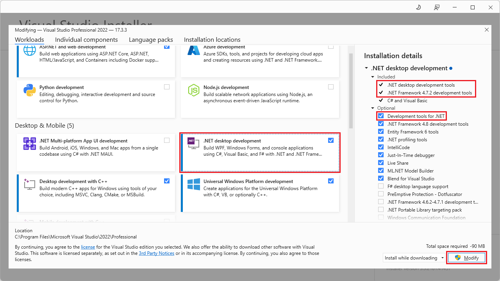
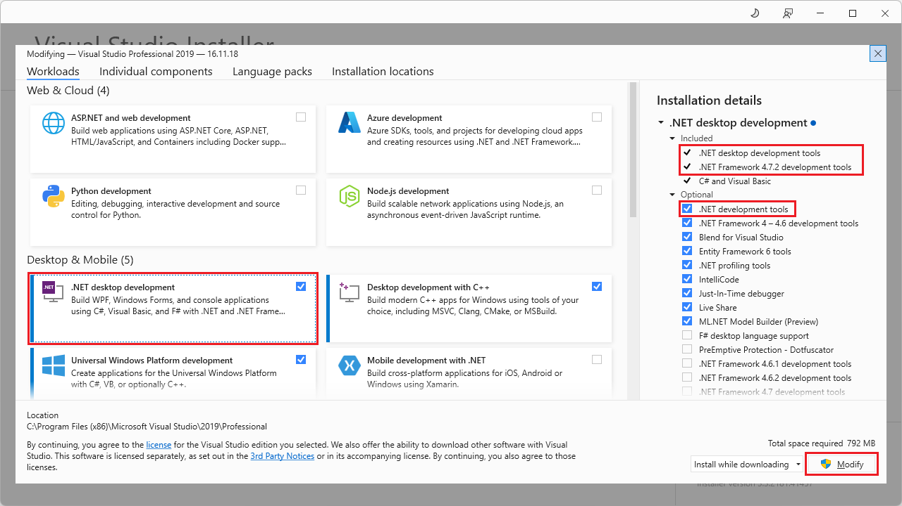
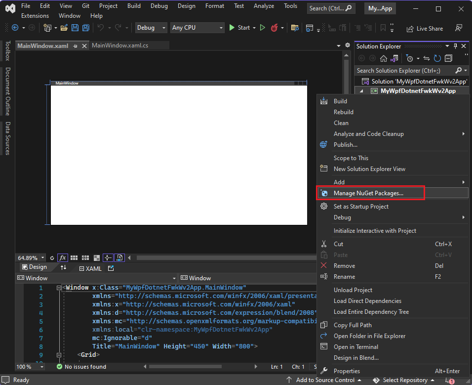

# Get started with WebView2 in WPF apps

This article covers how to set up your development tools and create an initial WebView2 app for Windows Presentation Foundation (WPF), and learn about WebView2 concepts along the way.

In this tutorial, you use the **WPF Application** or **WPF App (.NET Framework)** project template to create a WPF app, and then install the WebView2 SDK for the project to add WebView2.


#### Completed project

A completed version<!--TODO: what date?--> of this tutorial project is available in the **WebView2Samples** repo:
*  Sample name: **WPF_GettingStarted**
*  Repo directory: [WPF_GettingStarted](https://github.com/MicrosoftEdge/WebView2Samples/tree/main/GettingStartedGuides/WPF_GettingStarted#readme)
*  Solution file: **WPFSample.sln**


<!-- ====================================================================== -->
## Step 1 - Install Visual Studio with .NET support

This tutorial requires Microsoft Visual Studio, not Microsoft Visual Studio Code.  This article mainly describes using Visual Studio 2022.

1. Install [Visual Studio](https://visualstudio.microsoft.com).<!--strong default is 2022-->  Install **.NET desktop development** support, to get the needed project templates, as follows.

1. If you're at the Visual Studio startup screen, scroll to the bottom of the **Create a new project** dialog and click the link **Open without code**.  Visual Studio opens.

1. In Visual Studio, select **Tools** > **Get Tools and Features**.  The **Visual Studio Installer window** opens, and the **Modifying** dialog opens over it.

1. Select the **.NET desktop development** workload so there's a checkmark on it.

1. In the section **Installation details** > **.NET desktop development** > **Included** on the right, make sure **.NET desktop development tools** and **.NET Framework 4.7.2 development tools** are listed, with a checkmark next to them.

1. In the section **Installation details** > **.NET desktop development** > **Optional** on the right:

   * If you're using Visual Studio 2022, make sure **Development tools for .NET** is selected:

   

   * If you're using Visual Studio 2019, make sure **.NET development tools** is selected:

   

1. Click the **Modify** button.

This tutorial also works with Visual Studio 2017.  See [Visual Studio older downloads](https://visualstudio.microsoft.com/vs/older-downloads/).  Install .NET support, to get the needed project templates, similar to the above steps.


<!-- ====================================================================== -->
## Step 2 - Install a preview channel of Microsoft Edge

1. Download any [Microsoft Edge Insider (preview) Channel](https://www.microsoft.com/edge/download/insider) (Beta, Dev, or Canary) on a supported operating system (OS):
   *  Windows 10
   *  Windows 11

   We recommend using the Canary channel of Microsoft Edge.  The minimum required version is 82.0.488.0.


<!-- ====================================================================== -->
## Step 3 - Create a single-window WebView2 app

Start by creating a basic desktop project that contains a single main window.

1. Decide whether to create a **.NET Core/5/6** project (newer), or a **WPF App (.NET Framework)** project (older).  For more information, see:
   * [.NET history](/dotnet/core/introduction#net-history) in _What is .NET? Introduction and overview_.
   * [.NET](https://wikipedia.org/wiki/.NET) at Wikipedia.

1. Follow the applicable section below.


#### Creating a .NET Core/5/6 project

If you are creating a .NET Core/5/6 project, do the following steps.  Otherwise, skip to [Creating a WPF App (.NET Framework) project](#creating-a-wpf-app-net-framework-project).

1. Open Microsoft Visual Studio, such as Visual Studio 2022.

1. In the opening panel, click **Create new project**.  Or, in the main Visual Studio window, select **File** > **New** > **Project**.  The **Create a new project** dialog opens.

1. In the **Search for templates** text box, type `WPF Application`.  The **Create a new project** panel shows the installed project templates that match your entered text.  This article shows the C# rather than VB dialogs; both languages are supported for WebView2.

1. If you're using Visual Studio 2022, click a project template that has the title **WPF Application** and the description text **A project for creating a .NET WPF Application**:

   

   If you're using Visual Studio 2019, click a project template that has the title **WPF Application** and the description text **A project for creating a .NET Core WPF Application**:

   
   <!--todo: after move png to article's dedicated images dir, change filename like for vs2022 above -->

   If the above project template isn't listed, see [Step 1 - Install Visual Studio with .NET support](#step-1---install-visual-studio-with-net-support) above, to install **.NET desktop development tools**.

1. Click the **Next** button.

   The **Configure your new project: WPF Application** dialog opens:

   
   <!-- ok to delete png media/wpf-getting-started-create-core.png -->

1. In the **Project name** text box, enter a project name, such as **MyWpfDotnetCoreWv2App**.

1. In the **Location** text box, select a path on your local drive, such as `C:\Users\myusername\Documents\MyProjects`, and then click the **Next** button.

   The **Additional information** dialog appears, with a **Target Framework** dropdown list:

   

1. Select **.NET Core 3.1** or later, such as **.NET 6.0**.  (Don't select **.NET Core 3.0**.)  Then click the **Create** button.

   The initial .NET Core WPF Application project opens in Visual Studio:

   

Skip to [Step 4 - Build and run the initial project without WebView2](#step-4---build-and-run-the-initial-project-without-webview2) below.


<!-- project template title: WPF App (.NET Framework) -->
#### Creating a WPF App (.NET Framework) project

If you are creating a WPF App (.NET Framework) project, do the following steps.  Otherwise, skip to [Step 4 - Build and run the initial project without WebView2](#step-4---build-and-run-the-initial-project-without-webview2).

1. Open Microsoft Visual Studio, such as Visual Studio 2022.

1. In the opening panel, click **Create new project**.  Or, in the main Visual Studio window, select **File** > **New** > **Project**.  The **Create a new project** dialog opens.
   <!-- resume here, using 2022 ~ -->

1. In the **Search for templates** text box, type `WPF App`.  The **Create a new project** panel shows the installed project templates that match your entered text.  This article shows the C# rather than VB dialogs; both languages are supported for WebView2.

1. Click a project template that has the title **WPF App (.NET Framework)** and the description text **Windows Presentation Foundation client application**:

   

   If the above project template isn't listed, see [Step 1 - Install Visual Studio with .NET support](#step-1---install-visual-studio-with-net-support) above, to install **.NET desktop development tools**.

1. Click the **Next** button.

   The **Configure your new project: WPF App (.NET Framework)** dialog opens:

   

1. In the **Project name** text box, enter a project name, such as **MyWpfDotnetFwkWv2App**.

1. In the **Location** text box, select a path on your local drive, such as `C:\Users\myusername\Documents\MyProjects`.

1. In the **Framework** dropdown list, select **.NET Framework 4.6.2** or later.

1. Click the **Create** button.

   The initial WPF App (.NET Framework) project opens in Visual Studio:

   


<!-- ====================================================================== -->
## Step 4 - Build and run the initial project without WebView2

1. Select **File** > **Save All** to save the project.

1. Press **F5** to build and run the project.

   The project runs, and displays an empty window:

   

   You might need to install the selected .NET Framework version, as follows.

1. If the app doesn't open, select **Debug** > **Start Without Debugging**.

   If you haven't installed the selected version of .NET Framework, you might get the following dialog: "This application could not be started.  The application requires one of the following versions of the .NET Framework: .NETFramework,Version=v4.8.1 - Do you want to install this .NET Framework version now?"

1. If you get such a dialog, go to [Download .NET Framework](https://dotnet.microsoft.com/download/dotnet-framework) and download and then install the needed version of the **Developer Pack** (not the **Runtime**).  For example, download `ndp481-devpack-enu.exe` to `C:\Users\username\Downloads`, and then double-click the file to install it.

1. If prompted, restart your computer:

   

1. Go to the downloaded file, such as `ndp481-devpack-enu.exe` in `C:\Users\username\Downloads`, and again double-click the downloaded file to install the .NET Framework Developer Pack.  A **Success** dialog appears:

   

1. If prompted, restart the computer again.

1. Open Visual Studio, and open the solution you created.

1. Press **F5** to run the initial app (shown above), not yet including the WebView2 SDK.

1. Close the initial app.


<!-- maintenance link; keep: main copy:
[Install or update the WebView2 SDK](../how-to/machine-setup.md#install-or-update-the-webview2-sdk) in _Set up your Dev environment for WebView2_
-->
<!-- ====================================================================== -->
## Step 5 - Install the WebView2 SDK

In Visual Studio, use NuGet Package Manager to add the WebView2 SDK to the project, as follows:

1. In **Solution Explorer**, right-click the project name (based on either the .NET (Core) or .NET Framework project template), and then select **Manage NuGet Packages**:

   

1. In the upper left, click the **Browse** tab.  In the search bar, type `Microsoft.Web.WebView2`, then click the **Microsoft.Web.WebView2** package.

   The NuGet package manager dialog displays search results, including a **Microsoft.Web.WebView2** package.  The dialog has a version number and **Install** button.
   
   

1. Accept the default version, and then click the **Install** button.

1. In the **Preview Changes** dialog, click the **OK** button.

1. Select **File** > **Save All** to save the project.

1. Press **F5** to build and run the project.

   The project runs, and displays an empty window.  This verifies that WebView2 is installed and working, although WebView2 has no content to display yet:

   

1. Close the app.


<!-- ====================================================================== -->
## Step 6 - Create a single WebView2 control

Add a WebView2 control to your app.

1. In the `MainWindow.xaml` file, to add the WebView2 XAML namespace, insert the following line inside the `<Window/>` tag:

   ```xml
   xmlns:wv2="clr-namespace:Microsoft.Web.WebView2.Wpf;assembly=Microsoft.Web.WebView2.Wpf"
   ```

1. Make sure the code in `MainWindow.xaml` looks like the following code:

   ```xml
   <Window x:Class="WPF_Getting_Started.MainWindow"
         xmlns="http://schemas.microsoft.com/winfx/2006/xaml/presentation"
         xmlns:x="http://schemas.microsoft.com/winfx/2006/xaml"
         xmlns:d="http://schemas.microsoft.com/expression/blend/2008"
         xmlns:mc="http://schemas.openxmlformats.org/markup-compatibility/2006"
         xmlns:local="clr-namespace:{YOUR PROJECT NAME}"
         xmlns:wv2="clr-namespace:Microsoft.Web.WebView2.Wpf;assembly=Microsoft.Web.WebView2.Wpf"
         mc:Ignorable="d"
         Title="MainWindow"
         Height="450"
         Width="800"
   >
      <Grid>

      </Grid>
   </Window>
   ```

1. To add the WebView2 control, replace the `<Grid>` tags with the following code.  The `Source` property sets the initial URI displayed in the WebView2 control.

   ```xml
   <DockPanel>
      <wv2:WebView2 Name="webView"
                     Source="https://www.microsoft.com"
      />
   </DockPanel>
   ```

1. Select **File** > **Save All** to save the project.

1. Press **F5** to build and run the project.

1. Make sure your WebView2 control displays [https://www.microsoft.com](https://www.microsoft.com):

   


<!-- ====================================================================== -->
## Step 7 - Navigation

Enable users to change the URL that the WebView2 control displays, by adding an address bar to the app.

1. In the `MainWindow.xaml` file, add an address bar by copying and pasting the following code inside the `<DockPanel>` that contains the WebView2 control.  Keep the existing code below the new snippet.

   ```xml
   <DockPanel DockPanel.Dock="Top">
       <Button x:Name="ButtonGo"
                 DockPanel.Dock="Right"
                 Click="ButtonGo_Click"
                 Content="Go"
       />
       <TextBox Name="addressBar"/>
   </DockPanel>
   ```

1. Make sure the `<DockPanel>` section of the `MainWindow.xaml` file matches the following code:

   ```xml
   <DockPanel>
       <DockPanel DockPanel.Dock="Top">
           <Button x:Name="ButtonGo" DockPanel.Dock="Right" Click="ButtonGo_Click" Content="Go"/>
           <TextBox Name = "addressBar"/>
       </DockPanel>
       <wv2:WebView2 Name = "webView"
                     Source = "https://www.microsoft.com"
       />
   </DockPanel>
   ```

1. In `MainWindow.xaml.cs`, to add the `CoreWebView2` namespace, insert the following code at the top of the file:

   ```csharp
   using Microsoft.Web.WebView2.Core;
   ```

1. In the `MainWindow.xaml.cs`file, copy the following code to create the `ButtonGo_Click` method.  This code navigates the WebView2 control to the URL entered in the address bar.

   ```csharp
   private void ButtonGo_Click(object sender, RoutedEventArgs e)
   {
       if (webView != null && webView.CoreWebView2 != null)
       {
           webView.CoreWebView2.Navigate(addressBar.Text);
       }
   }
   ```

1. Paste the code directly after the `Public MainWIndow` declaration, as shown in the following code:
    
   ```csharp
   namespace WpfApp1
   {
      /// <summary>
      /// Interaction logic for MainWindow.xaml
      /// </summary>
      public partial class MainWindow : Window
      {
         public MainWindow()
         {
               InitializeComponent();
         }
         void ButtonGo_Click(object sender, RoutedEventArgs e)
         {
               if (webView != null && webView.CoreWebView2 != null)
               {
                  webView.CoreWebView2.Navigate(addressBar.Text);
               }
         }
      }
   }
   ```

1. Select **File** > **Save All** to save the project.

1. Press **F5** to build and run the project.

1. Type a new URL in the address bar and choose **Go**.  For example, type `https://www.bing.com`.

1. Make sure the WebView2 control opens the URL you entered.

   Make sure you enter a complete URL in the address bar.  The app generates an `ArgumentException` if the URL doesn't start with `http://` or `https://`.

   The sample app displays the Bing website with the URL `https://www.bing.com` in the address bar:

   


<!--
maintenance link (keep)
* [Navigation events for WebView2 apps](../concepts/navigation-events.md) - main copy; update it and then propagate/copy to these h2 sections:
-->
<!-- ====================================================================== -->
## Step 8 - Navigation events

During webpage navigation, the WebView2 control raises events. The app that hosts WebView2 controls listens for the following events:

*  `NavigationStarting`
*  `SourceChanged`
*  `ContentLoading`
*  `HistoryChanged`
*  `NavigationCompleted`


The above diagram shows the event sequence.  Navigation events start with a new document.

### Success path

A successful path includes the full sequence of events:
1. Navigation starting.
1. Source changed, with possible input from the same document.
1. Content loading.
1. History changes.
1. Navigation completed.

For more information, see [Navigation events for WebView2 apps](../concepts/navigation-events.md).


### Failure path

If theres a failure, the failure path proceeds directly from navigation starting, to navigation completed, skipping the intervening events.

When an error occurs, the following events are raised, and may depend on navigation to an error webpage:

* `SourceChanged`
* `ContentLoading`
* `HistoryChanged`


### Redirection

If an HTTP redirect occurs, there are multiple `NavigationStarting` events in a row.


### Example demonstrating navigation events

To demonstrate how to use the events, register a handler for `NavigationStarting` that cancels any non-HTTPS requests, as follows.

1. In the `MainWindow.xaml.cs` file, modify the constructor to match the top part of the following code.  Below the constructor, add the `EnsureHttps` function:

    ```csharp
    public MainWindow()
    {
        InitializeComponent();
        webView.NavigationStarting += EnsureHttps;
    }
    
    void EnsureHttps(object sender, CoreWebView2NavigationStartingEventArgs args)
    {
        String uri = args.Uri;
        if (!uri.StartsWith("https://"))
        {
            args.Cancel = true;
        }
    }
    ```
    
   In the constructor, `EnsureHttps` is registered as the event handler on the `NavigationStarting` event on the WebView2 control.

1. Select **File** > **Save All** to save the project.

1. Press **F5** to build and run the project.

1. Attempt to open an HTTP site.  Make sure the WebView2 control remains unchanged.<!--clarify, blocks site?  what happens in UI?-->

1. Attempt to open an HTTPS site.  The WebView2 control allows you to open HTTPS sites.


<!-- ====================================================================== -->
## Step 9 - Scripting

You can use host apps to inject JavaScript code into WebView2 controls at runtime.  You can task WebView2 to run arbitrary JavaScript or add initialization scripts.  The injected JavaScript applies to all new top-level documents and any child frames until the JavaScript is removed.

The injected JavaScript is run with specific timing:

*   Run it after the creation of the global object.
*   Run it before any other script included in the HTML document is run.

For example, add scripts that send an alert when a user navigates to non-HTTPS sites, as follows:

1. Modify the `EnsureHttps` function to inject a script into the web content that uses [ExecuteScriptAsync](/dotnet/api/microsoft.web.webview2.wpf.webview2.executescriptasync) method.

   ```csharp
   void EnsureHttps(object sender, CoreWebView2NavigationStartingEventArgs args)
   {
      String uri = args.Uri;
      if (!uri.StartsWith("https://"))
      {
         webView.CoreWebView2.ExecuteScriptAsync($"alert('{uri} is not safe, try an https link')");
         args.Cancel = true;
      }
   }
   ```

1. Select **File** > **Save All** to save the project.

1. Press **F5** to build and run the project.

1. Make sure the app displays an alert when you navigate to a website that doesn't use HTTPS.

   


<!-- ====================================================================== -->
## Step 10 - Communication between host and web content

The host and web content can communicate in the following ways using `postMessage`:

*  Web content in a WebView2 control can post a message to the host using `window.chrome.webview.postMessage`.  The host handles the message using any registered `WebMessageReceived` on the host.

*  Hosts post messages to web content in a WebView2 control using `CoreWebView2.PostWebMessageAsString` or `CoreWebView2.PostWebMessageAsJSON`. The messages are caught by handlers added to `window.chrome.webview.addEventListener`.

The communication mechanism passes messages from web content to the host using native capabilities.

In your project, when the WebView2 control navigates to a URL, it displays the URL in the address bar and alerts the user of the URL displayed in the WebView2 control.

1. In `MainWindow.xaml.cs`, update your constructor and create an `InitializeAsync` function to match the following code.  The `InitializeAsync` function awaits [EnsureCoreWebView2Async](/dotnet/api/microsoft.web.webview2.wpf.webview2.ensurecorewebview2async), because the initialization of `CoreWebView2` is asynchronous.

   ```csharp
   public MainWindow()
   {
      InitializeComponent();
      webView.NavigationStarting += EnsureHttps;
      InitializeAsync();
   }

   async void InitializeAsync()
   {
      await webView.EnsureCoreWebView2Async(null);
   }
   ```

1. After **CoreWebView2** is initialized, register an event handler to respond to `WebMessageReceived`.  In `MainWindow.xaml.cs`, update `InitializeAsync` and add `UpdateAddressBar` using the following code:

   ```csharp
   async void InitializeAsync()
   {
      await webView.EnsureCoreWebView2Async(null);
      webView.CoreWebView2.WebMessageReceived += UpdateAddressBar;
   }

   void UpdateAddressBar(object sender, CoreWebView2WebMessageReceivedEventArgs args)
   {
      String uri = args.TryGetWebMessageAsString();
      addressBar.Text = uri;
      webView.CoreWebView2.PostWebMessageAsString(uri);
   }
   ```

1. For the WebView2 control to send and respond to the web message, after `CoreWebView2` is initialized, the host does the following:
    1. Injects a script to the web content that registers a handler to print message from the host.
    1. Injects a script to the web content that posts the URL to the host.

1. In `MainWindow.xaml.cs`, update `InitializeAsync` to match the following code:

   ```csharp
   async void InitializeAsync()
   {
      await webView.EnsureCoreWebView2Async(null);
      webView.CoreWebView2.WebMessageReceived += UpdateAddressBar;

      await webView.CoreWebView2.AddScriptToExecuteOnDocumentCreatedAsync("window.chrome.webview.postMessage(window.document.URL);");
      await webView.CoreWebView2.AddScriptToExecuteOnDocumentCreatedAsync("window.chrome.webview.addEventListener(\'message\', event => alert(event.data));");
   }
   ```

1. Select **File** > **Save All** to save the project.

1. Press **F5** to build and run the project.

1. When you open a new URI, the WebView2 control displays the URI in the address bar.

   The sample app displays the URI in the address bar and the Microsoft website, https://www.microsoft.com:

   

Congratulations, you built your first WebView2 app!


<!-- ====================================================================== -->
## See also

* [WebView2 API Reference](../webview2-api-reference.md)
   * [WPF](/dotnet/api/microsoft.web.webview2.wpf)

developer.microsoft.com:
* [Microsoft Edge WebView2](https://developer.microsoft.com/microsoft-edge/webview2) - initial introduction to WebView2 features at developer.microsoft.com.

Local pages:
* [WPF sample app](../samples/webview2wpfbrowser.md)
* [Manage user data folders](../concepts/user-data-folder.md)
* [Sample Code for WebView2](../code-samples-links.md) - a guide to the `WebView2Samples` repo.
* [Development best practices for WebView2 apps](../concepts/developer-guide.md)

GitHub:
* [WebView2Samples repo > WebView2WpfBrowser](https://github.com/MicrosoftEdge/WebView2Samples/tree/main/SampleApps/WebView2WpfBrowser)
