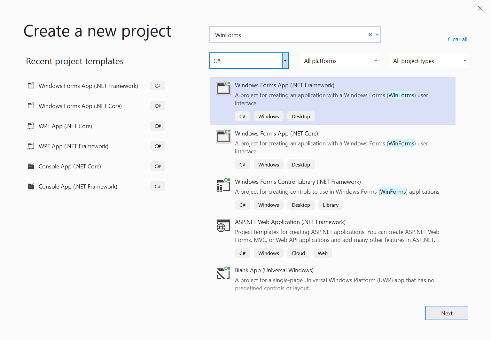
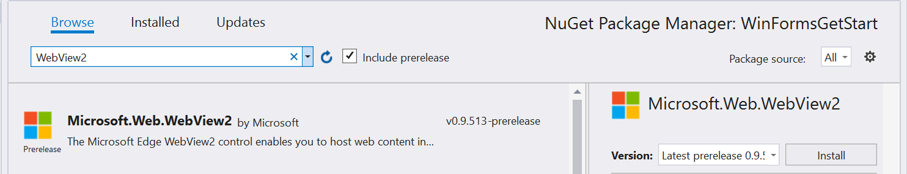
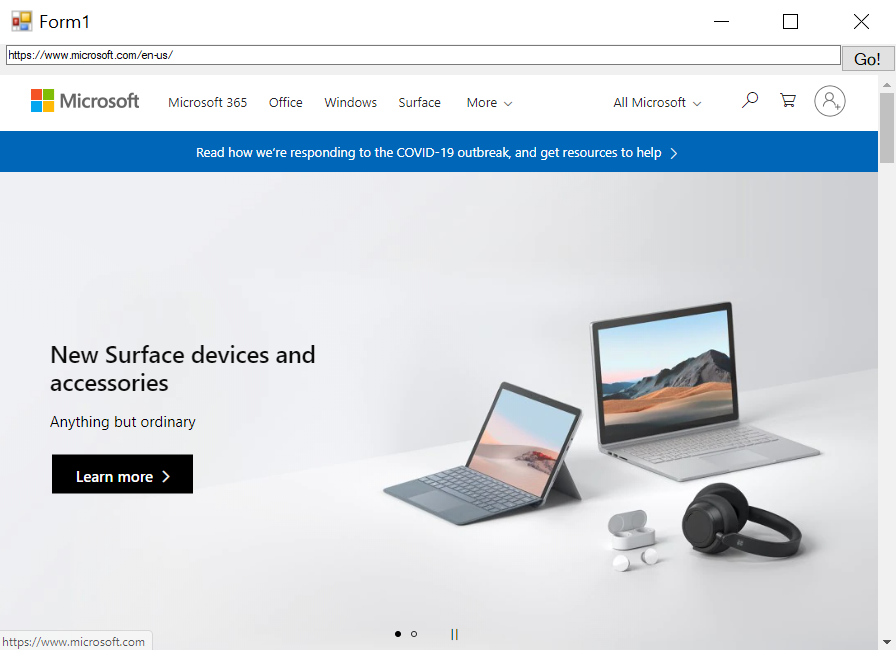

# Getting started with WebView2 in Windows Forms apps (Preview)  

In this article, get started creating your first WebView2 app and learn about the main features of [WebView2 (preview)](/microsoft-edge/webview2/index).  For more information on individual APIs, see [API reference](/dotnet/api/microsoft.web.webview2.winforms).  

## Prerequisites  

Ensure you installed the following list of pre-requisites before proceeding:  

* [Microsoft Edge (Chromium) Canary channel](https://www.microsoftedgeinsider.com/download) installed on Windows 10, Windows 8.1, or Windows 7. 
* [Visual Studio](https://visualstudio.microsoft.com) 2017 or later.

> [!NOTE]
> WebView2 does not currently support the .NET Core 3.0's [designer (preview)](https://visualstudio.microsoft.com/vs/preview).

## Step 1 - Create a single window application

Start with a basic desktop project containing a single main window.  

1. Open **Visual Studio.**

1. Choose **Windows Forms .NET Framework App** and then choose **Next**.

    

1. Enter values for **Project name** and **Location**.  Select **.NET Framework 4.6.2** or later.  

    

1. Choose **Create** to create your project.

## Step 2 - Install WebView2 SDK

Next add the WebView2 SDK to the project.  For the preview, install the WebView2 SDK using Nuget.  

1. Open the context menu on the project \(right-click\), and choose **Manage NuGet Packages...**.  

    :::image type="complex" source="./media/wpf-gettingstarted-mngnuget.png" alt-text="Nuget":::
       Nuget
    :::image-end:::

1. Enter `Microsoft.Web.WebView2` in the search bar.  Choose **Microsoft.Web.WebView2** from the search results.  

    > [!IMPORTANT]
    > Ensure you check **Include prerelease**, select a prerelease package in **Version**, and then choose **Install**.  

    

You are all set to start developing applications using the WebView2 API.  Select `F5` to build and run the project.  The running project displays an empty window.  


## Step 3 - Create a single WebView  

Next add a WebView to your application.  

1. Open the **Windows Forms Designer**.  
1. Search for **WebView2** in the **Toolbox**. Drag and drop the **WebView2** control into the Windows Forms App

    

1. Change the `Name` property to `webView`.

    

1. The `Source` property sets the initial URI displayed in the WebView2 control. Set the Source property to <https://www.microsoft.com>

    

Select `F5` to build and run your project.  Confirm that your WebView2 control displays [https://www.microsoft.com](https://www.microsoft.com).


> [!NOTE]
> If you are working on a high DPI monitor, you may have to [configure your Windows Forms app for high DPI support](/dotnet/framework/winforms/high-dpi-support-in-windows-forms#configuring-your-windows-forms-app-for-high-dpi-support).

## Step 4 - Handle Window Resize Events

Add a few more controls to your Windows Forms from the toolbox, and then handle window resize events appropriately.

1. In the **Windows Forms Designer** open the **Toolbox**
1. Drag and Drop a **TextBox** into the Windows Forms App. Name the **TextBox** `addressBar` in the **Properties Tab**.
1. Drag and Drop a **Button** into the Windows Forms App. Change the text in the **Button** to `Go!` and name the **Button** `goButton` in the **Properties Tab**.

    The app should look like the following in the designer:
    
    

1. In **Form1.cs** define `Form_Resize` to keep the controls in place when the App Window is resized.

```csharp
public Form1()
{
    InitializeComponent();
    this.Resize += new System.EventHandler(this.Form_Resize);
}

private void Form_Resize(object sender, EventArgs e)
{
    webView.Size = this.ClientSize - new System.Drawing.Size(webView.Location);
    goButton.Left = this.ClientSize.Width - goButton.Width;
    addressBar.Width = goButton.Left - addressBar.Left;
}
```

Select `F5` to build and run your project.  Confirm that the app displays similar to the following screenshot.


## Step 5 - Navigation

Add the ability to allow users to change the URL that the WebView2 control displays by adding an address bar to the app.

1. In `Form1.cs` add the `CoreWebView2` namespace by inserting the following code snippet at the top of `Form1.cs`.  

    ```csharp
    using Microsoft.Web.WebView2.Core;
    ```

1. In the **Windows Forms Designer**, double-click on the `Go!` button to create the `goButton_Click` method in `Form1.cs`. Copy and paste the following snippet inside the function. Now, the `goButton_Click` function navigates the WebView to the URL entered in the address bar.

    ```csharp
    private void goButton_Click(object sender, EventArgs e)
    {
        if (webView != null && webView.CoreWebView2 != null)
        {
            webView.CoreWebView2.Navigate(addressBar.Text);
        }
    }
    ```  

Select `F5` to build and run your project.  Enter a new URL in the address bar, and click **Go**.  For example, enter `https://www.bing.com`.  Confirm that the WebView2 control navigates to the URL.  

> [!NOTE]
> Ensure a complete URL is entered in the address bar. An `ArgumentException` is thrown if the URL does not start with `http://` or `https://`


## Step 6 - Navigation events  

The application that hosts WebView2 controls listens to the following events that are raised by the WebView2 control during navigation to web pages.  

* `NavigationStarting`  
* `SourceChanged`  
* `ContentLoading`  
* `HistoryChanged`  
* `NavigationCompleted`  

For more information, see [Navigation Events](../concepts/navigation-events.md).  

:::image type="complex" source="../media/navigation-events.png" alt-text="Navigation events":::
   Navigation events
:::image-end:::

When an error occurs, the following events are raised and may depend on navigation to an error page.  

* `SourceChanged`  
* `ContentLoading`  
* `HistoryChanged`  

When there is an HTTP redirect, there are multiple `NavigationStarting` events.  

To demonstrate how to use these events, start by registering a handler for `NavigationStarting` that cancels any requests that do not use HTTPS.  

In `Form1.cs`, modify the constructor as shown below and add the `EnsureHttps` function.  

```csharp
public Form1()
{
    InitializeComponent();
    this.Resize += new System.EventHandler(this.Form_Resize);

    webView.NavigationStarting += EnsureHttps;
}

void EnsureHttps(object sender, CoreWebView2NavigationStartingEventArgs args)
{
    String uri = args.Uri;
    if (!uri.StartsWith("https://"))
    {
        args.Cancel = true;
    }
}
```

In the constructor, EnsureHttps is registered as the event handler on the `NavigationStarting` event on the WebView2 control.  

Select `F5` to build and run your project. Confirm that when navigating to an HTTP site, the WebView remains unchanged. However, the WebView will navigate to HTTPS sites.

## Step 7 - Scripting  

You may use host applications to inject JavaScript code into WebView2 controls at runtime.  The injected JavaScript applies to all new top level documents and any child frames until the JavaScript is removed.  The injected JavaScript is run after creation of the global object, and before any other script included in the HTML document is run.  

You can use scripting to alert the user when navigating to a non-HTTPS site.  Modify the `EnsureHttps` function so that it injects script into the web content using the [ExecuteScriptAsync]() method.  

```csharp
void EnsureHttps(object sender, CoreWebView2NavigationStartingEventArgs args)
{
    String uri = args.Uri;
    if (!uri.StartsWith("https://"))
    {
        webView.CoreWebView2.ExecuteScriptAsync($"alert('{uri} is not safe, try an https link')");
        args.Cancel = true;
    }
}
```  

Select `F5` to build and run your project.  Confirm that the application displays an alert when you navigate to a site that does not use HTTPS.  


## Step 8 - Communication between host and web content  

The host and web content may communicate with each other using `postMessage` as follows:  

* Web content in a WebView2 control may post a message to the host using `window.chrome.webview.postMessage`.  The host handles the message using any registered `WebMessageReceived` on the host.  
* Hosts post messages to web content in a WebView2 control using `CoreWebView2.PostWebMessageAsString` or `CoreWebView2.PostWebMessageAsJSON`.  These messages are caught by handlers added to `window.chrome.webview.addEventListener`.  

This communication mechanism allows web content to pass messages to the host using native capabilities.  

In your project, when the WebView2 control navigates to a URL, it displays the URL in the address bar and alerts the user of the URL displayed in the WebView2 control.  

1. In **Form1.cs**, update your constructor and create an `InitializeAsync` function as shown in the following code snippet.  The `InitializeAsync` function awaits [EnsureCoreWebView2Async]() because the initialization of `CoreWebView2` is asynchronous.  

    ```csharp
    public Form1()
    {
        InitializeComponent();
        this.Resize += new System.EventHandler(this.Form_Resize);
        webView.NavigationStarting += EnsureHttps;
        InitializeAsync();
    }

    async void InitializeAsync()
    {
        await webView.EnsureCoreWebView2Async(null);
    }
    ```  

1. After **CoreWebView2** is initialized, register an event handler to respond to `WebMessageReceived`.  In `Form1.cs` update `InitializeAsync` and add `UpdateAddressBar` using the following code snippet.  

    ```csharp
    async void InitializeAsync()
    {
        await webView.EnsureCoreWebView2Async(null);
        webView.CoreWebView2.WebMessageReceived += UpdateAddressBar;
    }

    void UpdateAddressBar(object sender, CoreWebView2WebMessageReceivedEventArgs args)
    {
        String uri = args.TryGetWebMessageAsString();
        addressBar.Text = uri;
        webView.CoreWebView2.PostWebMessageAsString(uri);
    }
    ```  

1. In order for the WebView to send and respond to the web message, after `CoreWebView2` is initialized, the host injects a script in the web content to:  

    1. Send the URL to the host using `postMessage`.
    1. Register an event handler to print a message sent from the host.  

In `Form1.cs`, update `InitializeAsync` as shown in the following code snippet.  

```csharp
async void InitializeAsync()
{
    await webView.EnsureCoreWebView2Async(null);
    webView.CoreWebView2.WebMessageReceived += UpdateAddressBar;

    await webView.CoreWebView2.AddScriptToExecuteOnDocumentCreatedAsync("window.chrome.webview.postMessage(window.document.URL);");
    await webView.CoreWebView2.AddScriptToExecuteOnDocumentCreatedAsync("window.chrome.webview.addEventListener(\'message\', event => alert(event.data));");
}
```  

Select `F5` to build and run the app.  Confirm that the address bar displays the URL of the site displayed in the WebView. Also, when you successfully navigate to a new URL, the WebView alerts the user of the URL displayed in the WebView.  



Congratulations, you built your first WebView2 app!  

## Next steps 

* Checkout the [WebView2Samples repo](https://github.com/MicrosoftEdge/WebView2Samples) for a comprehensive example of WebView2's capabilities
* Checkout [API reference](/dotnet/api/microsoft.web.webview2.winformswebview2) for more detailed information about our APIs
* Checkout a list of [WebView2 Resources](../index.md#next-steps) to learn more about WebView2


## Getting in touch with the Microsoft Edge WebView team  

[!INCLUDE [contact WebView team note](../includes/contact-webview-team-note.md)]  
