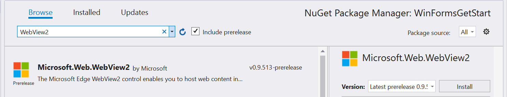

# Getting started with WebView2 in WPF (Preview)

In this article, get started creating your first WebView2 app and learn about the main features of [WebView2 (preview)](../index.md).  For more information on individual APIs, see [API reference](/dotnet/api/microsoft.web.webview2.wpf).  

## Prerequisites  

Ensure you installed the following list of pre-requisites before proceeding:  

* [Microsoft Edge (Chromium) Canary channel](https://www.microsoftedgeinsider.com/download) installed on Windows 10, Windows 8.1, or Windows 7.  
* [Visual Studio](https://visualstudio.microsoft.com) 2017 or later.  

## Step 1 - Create a single window application  

Start with a basic desktop project containing a single main window.  

1.  Open **Visual Studio**.  
1.  Select **WPF .NET Core App** or **WPF .NET Framework App**, and then select **Next**.  
    
    :::row:::
       :::column span="1":::
          :::image type="complex" source="./media/wpf-gettingstarted-wpfcore.png" alt-text="WPF core":::
             WPF core
          :::image-end:::
       :::column-end:::
       :::column span="1":::
          :::image type="complex" source="./media/wpf-gettingstarted-wpffw.png" alt-text="WPF Framework":::
             WPF Framework
          :::image-end:::
       :::column-end:::
    :::row-end:::
    
1.  Enter values for **Project name** and **Location**.  Select .NET Framework 4.6.2 or later, or .NET Core 3.0 or later.  
    
    :::row:::
           :::column span="1":::
              :::image type="complex" source="./media/wpf-gettingstarted-createcore.png" alt-text="Create core":::
                 Create core
              :::image-end:::
           :::column-end:::
           :::column span="1":::
              :::image type="complex" source="./media/wpf-gettingstarted-createfw.png" alt-text="Create Framework":::
                 Create Framework
              :::image-end:::
           :::column-end:::
        :::row-end:::
    
1.  Select **Create** to create your project.  
    
## Step 2 - Install WebView2 SDK  

Next add the WebView2 SDK to the project.  For the preview, install the WebView2 SDK using Nuget.  

1.  Open the context menu on the project \(right-click\), and select **Manage NuGet Packages...**.  
    
    :::image type="complex" source="./media/wpf-gettingstarted-mngnuget.png" alt-text="Nuget":::
       Nuget
    :::image-end:::
    
1.  Enter `Microsoft.Web.WebView2` in the search bar.  Select **Microsoft.Web.WebView2** from the search results.  

    > [!IMPORTANT]
    > Ensure you check **Include prerelease**, select a prerelease package in **Version**, and then choose **Install**.  
  
     
    
    You are all set to start developing applications using the WebView2 API.  Select `F5` to build and run the project.  The running project displays an empty window.  
    
    :::image type="complex" source="./media/wpf-gettingstarted-blank.png" alt-text="Empty app":::
       Empty app
    :::image-end:::  
    
## Step 3 - Create a single WebView in MainWindow.xaml  

Next add a WebView to your application.  

1.  Open `MainWindow.xaml`.  Add the WebView2 XAML namespace by inserting the following line inside the `<Window/>` tag.  
    
    ```xml
    xmlns:wv2="clr-namespace:Microsoft.Web.WebView2.Wpf;assembly=Microsoft.Web.WebView2.Wpf"
    ```  
    
    Confirm that the code in `MainWindow.xaml` looks like the following code snippet.  
    
    ```xml
    <Window x:Class="WPF_Getting_Started.MainWindow"
            xmlns="http://schemas.microsoft.com/winfx/2006/xaml/presentation"
            xmlns:x="http://schemas.microsoft.com/winfx/2006/xaml"
            xmlns:d="http://schemas.microsoft.com/expression/blend/2008"
            xmlns:mc="http://schemas.openxmlformats.org/markup-compatibility/2006"
            xmlns:local="clr-namespace:{YOUR PROJECT NAME}"
            xmlns:wv2="clr-namespace:Microsoft.Web.WebView2.Wpf;assembly=Microsoft.Web.WebView2.Wpf"
            mc:Ignorable="d"
            Title="MainWindow"
            Height="450"
            Width="800"
    >
        <Grid>
        
        </Grid>
    </Window>
    ```  
    
1.  Add the WebView2 control by replacing the `<Grid>` tags, with the following code snippet.  The `Source` property sets the initial URI displayed in the WebView2 control.  
    
    ```xml  
    <DockPanel>
        <wv2:WebView2 Name="webView"
                      Source="https://www.microsoft.com"
        />
    </DockPanel>
    ```  
    
1.  Press `F5` to build and run your project.  Confirm that your WebView2 control displays [https://www.microsoft.com](https://www.microsoft.com).  
    
    :::image type="complex" source="./media/wpf-gettingstarted-microsoft.png" alt-text="Microsoft.com":::
       Microsoft.com
    :::image-end:::  
    
## Step 4 - Navigation  

Add the ability to allow users to change the URL that the WebView2 control displays by adding an address bar to the app.

1.  In **MainWindow.xaml**, add an address bar by copying and pasting the following code snippet inside the DockPanel that contains the WebView.  
    
    ```xml
    <DockPanel DockPanel.Dock="Top">
        <Button x:Name="ButtonGo"
                DockPanel.Dock="Right"
                Click="ButtonGo_Click"
                Content="Go"
        />
        <TextBox Name="addressBar"/>
    </DockPanel>
    ```  
    
    Confirm that the `DockPanel` section of `MainWindow.xaml` looks like the following code snippet.  
    
    ```xml
    <DockPanel>
        <DockPanel DockPanel.Dock="Top">
            <Button x:Name="ButtonGo" DockPanel.Dock="Right" Click="ButtonGo_Click" Content="Go"/>
            <TextBox Name = "addressBar"/>
        </DockPanel>
        <wv2:WebView2 Name = "webView"
                      Source = "https://www.microsoft.com"
        />
    </DockPanel>
    ```  
    
1.  Open `MainWindow.xaml.cs` in Visual Studio.  Add the `CoreWebView2` namespace by inserting the following code snippet at the top of `MainWindow.xaml.cs`.  
    
    ```csharp
    using Microsoft.Web.WebView2.Core;
    ```
    
1.  In **MainWindow.xaml.cs**, copy the following code snippet to create the `ButtonGo_Click` method, which navigates the WebView to the URL entered in the address bar.  
    
    ```csharp
    private void ButtonGo_Click(object sender, RoutedEventArgs e)
    {
        if (webView != null && webView.CoreWebView2 != null)
        {
            webView.CoreWebView2.Navigate(addressBar.Text);
        }
    }
    ```  
    
    Press `F5` to build and run your project.  Enter a new URL in the address bar, and select **Go**.  For example, enter `https://www.bing.com`.  Confirm that the WebView2 control navigates to the URL.  
    
    > [!NOTE]
    > Make sure a complete URL is entered in the address bar.  An `ArgumentException` is thrown if the URL does not start with `http://` or `https://`.  
    
    :::image type="complex" source="./media/wpf-gettingstarted-bing.png" alt-text="Bing":::
       Bing
    :::image-end:::
    
## Step 5 - Navigation events  

The application that hosts WebView2 controls listens to the following events that are raised by the WebView2 control during navigation to web pages.  

*   `NavigationStarting`  
*   `SourceChanged`  
*   `ContentLoading`  
*   `HistoryChanged`  
*   `NavigationCompleted`  

For more information, see [Navigation Events](../concepts/navigation-events.md).  

:::image type="complex" source="../media/navigation-events.png" alt-text="Navigation events":::
   Navigation events
:::image-end:::  

When an error occurs, the following events are raised and may depend on navigation to an error page.  

*   `SourceChanged`  
*   `ContentLoading`  
*   `HistoryChanged`  

When there is an HTTP redirect, there are multiple `NavigationStarting` events.  

To demonstrate how to use these events, start by registering a handler for `NavigationStarting` that cancels any requests that do not use HTTPS.  

In `MainWindow.xaml.cs`, modify the constructor as shown below and add the `EnsureHttps` function.  

```csharp
public MainWindow()
{
    InitializeComponent();
    webView.NavigationStarting += EnsureHttps;
}

void EnsureHttps(object sender, CoreWebView2NavigationStartingEventArgs args)
{
    String uri = args.Uri;
    if (!uri.StartsWith("https://"))
    {
        args.Cancel = true;
    }
}
```  

In the constructor, EnsureHttps is registered as the event handler on the `NavigationStarting` event on the WebView2 control.  

Press `F5` to build and run your project.  Confirm that when navigating to an HTTP site, the WebView **remains unchanged**.  However, the WebView navigates to HTTPS sites.  

## Step 6 - Scripting  

You may use host applications to inject JavaScript code into WebView2 controls at runtime.  The injected JavaScript applies to all new top level documents and any child frames until the JavaScript is removed.  The injected JavaScript is run after creation of the global object, and before any other script included in the HTML document is run.  

You can use scripting to alert the user when navigating to a non-HTTPS site.  Modify the `EnsureHttps` function so that it injects script into the web content using the [ExecuteScriptAsync](/dotnet/api/microsoft.web.webview2.wpf.webview2.executescriptasync) method.  

```csharp
void EnsureHttps(object sender, CoreWebView2NavigationStartingEventArgs args)
{
    String uri = args.Uri;
    if (!uri.StartsWith("https://"))
    {
        webView.CoreWebView2.ExecuteScriptAsync($"alert('{uri} is not safe, try an https link')");
        args.Cancel = true;
    }
}
```  

Press `F5` to build and run your project.  Confirm that the application displays an alert when you navigate to a site that does not use HTTPS.  

:::image type="complex" source="./media/wpf-gettingstarted-https.png" alt-text="HTTPS":::
   HTTPS
:::image-end:::  

## Step 7 - Communication between host and web content  

The host and web content may communicate with each other using `postMessage` as follows:  

*   Web content in a WebView2 control may post a message to the host using `window.chrome.webview.postMessage`.  The host handles the message using any registered `WebMessageReceived` on the host.  
*   Hosts post messages to web content in a WebView2 control using `CoreWebView2.PostWebMessageAsString` or `CoreWebView2.PostWebMessageAsJSON`.  These messages are caught by handlers added to `window.chrome.webview.addEventListener`.  

This communication mechanism allows web content to pass messages to the host using native capabilities.  

In your project, when the WebView2 control navigates to a URL, it displays the URL in the address bar and alerts the user of the URL displayed in the WebView2 control.  

1.  In **MainWindow.xaml.cs**, update your constructor and create an `InitializeAsync` function as shown in the following code snippet.  The `InitializeAsync` function awaits [EnsureCoreWebView2Async](/dotnet/api/microsoft.web.webview2.wpf.webview2.ensurecorewebview2async) because the initialization of `CoreWebView2` is asynchronous.  
    
    ```csharp
    public MainWindow()
    {
        InitializeComponent();
        webView.NavigationStarting += EnsureHttps;
        InitializeAsync();
    }
    
    async void InitializeAsync()
    {
        await webView.EnsureCoreWebView2Async(null);
    }
    ```  
    
1.  After **CoreWebView2** is initialized, register an event handler to respond to `WebMessageReceived`.  In **MainWindow.xaml.cs** update `InitializeAsync` and add `UpdateAddressBar` using the following code snippet.  
    
    ```csharp
    async void InitializeAsync()
    {
        await webView.EnsureCoreWebView2Async(null);
        webView.CoreWebView2.WebMessageReceived += UpdateAddressBar;
    }
    
    void UpdateAddressBar(object sender, CoreWebView2WebMessageReceivedEventArgs args)
    {
        String uri = args.TryGetWebMessageAsString();
        addressBar.Text = uri;
        webView.CoreWebView2.PostWebMessageAsString(uri);
    }
    ```  
    
1.  In order for the WebView to send and respond to the web message, after `CoreWebView2` is initialized, the host:  
    
    1.  Injects a script to the web content that registers a handler to print message from the host.  
    1.  Injects a script to the web content that posts the URL to the host.  
    
    In `MainWindow.xaml.cs`, update `InitializeAsync` as follows:  
    
    ```csharp
    async void InitializeAsync()
    {
        await webView.EnsureCoreWebView2Async(null);
        webView.CoreWebView2.WebMessageReceived += UpdateAddressBar;
        
        await webView.CoreWebView2.AddScriptToExecuteOnDocumentCreatedAsync("window.chrome.webview.postMessage(window.document.URL);");
        await webView.CoreWebView2.AddScriptToExecuteOnDocumentCreatedAsync("window.chrome.webview.addEventListener(\'message\', event => alert(event.data));");
    }
    ```  
    
    Press `F5` to build and run the app.  Now the address bar displays the URI in the WebView and when you successfully navigate to a new URI, the WebView alerts the user of the URI displayed in the WebView.  
    
    :::image type="complex" source="./media/wpf-gettingstarted-searchbar.png" alt-text="addressBar":::
       addressBar
    :::image-end:::

Congratulations, you built your first WebView2 app!  

## Next steps  

*   For a comprehensive example of WebView2 capabilities, see [WebView2Samples repo](https://github.com/MicrosoftEdge/WebView2Samples) on GitHub.  
*   For more detailed information about WebView2 APIs, see [API reference](/dotnet/api/microsoft.web.webview2.wpf.webview2).  
*   For more information about  WebView2, see [WebView2 Resources](../index.md#next-steps).  

## Getting in touch with the Microsoft Edge WebView team  

[!INCLUDE [contact WebView team note](../includes/contact-webview-team-note.md)]  
