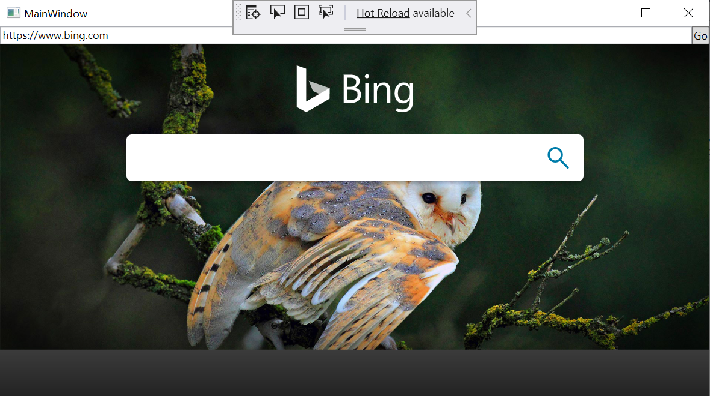
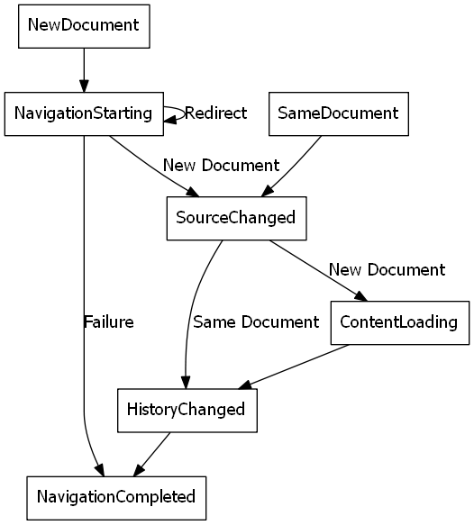
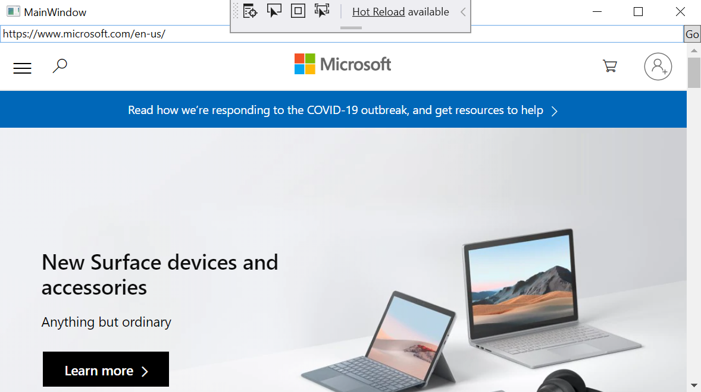

# Getting Started with WebView2 in WPF (Preview)

In this article, you'll get started creating your first WebView2 app and learn about the main features of [WebView2 (preview)](https://docs.microsoft.com/en-us/microsoft-edge/hosting/webview2). For more information on individual APIs, see the [API reference](../reference/dotnet/0-9-494-reference-webview2.md).  

## Prerequisites


Ensure you installed the following list of pre-requisites before proceeding:

* [Microsoft Edge (Chromium)](https://www.microsoftedgeinsider.com/download/) installed on Windows 10, Windows 8.1, or Windows 7. We recommend using the Canary channel with version number 82.0.488.0 or later.
* [Visual Studio](https://visualstudio.microsoft.com/) 2015 or later.

## Step 1 - Create a single window WPF application

Start with a basic desktop project containing a single main window.

1. Open **Visual Studio.**

2. Choose **WPF .NET Core App** or **WPF .NET Framework App**, and then choose **Next**.

    

    

3. Enter values for **Project name** and *Location**. If you are prompted to choose a .NET Framework, choose .NET Framework 4.6.2 or later, or .NET Core 3.0 or later.
4. Choose **Create** to create your project.

    

    

## Step 2 - Install WebView2 SDK

Now let's add the WebView2 SDK to the project. For the preview, you can install the Win32 SDK via Nuget.

1. Open the context menu on the project (right-click), and choose **Manage NuGet Packages...**.

    

2. Enter **Microsoft.Web.WebView2** in the search bar. Choose **Microsoft.Web.WebView2** from the search results.  Set the package version to **pre-release**, and then choose **Install**.

    

You are all set to start developing applications using the WebView2 API. Choose F5 to build and run the project. The running project displays an empty window.


## Step 3 - Create a single WebView in MainWindow.xaml

Now let's add a WebView to your application.

1. Open **MainWindow.xaml**. Add the WebView2 XML namespace by inserting the following line inside the `<Window/>` tag.

```h
xmlns:wv2="clr-namespace:Microsoft.Web.WebView2.Wpf;assembly=Microsoft.Web.WebView2.Wpf"
```

Confirm that the code in **MainWindow.xaml** looks like the following code snippet.

```xml
<Window x:Class="WPF_Getting_Started.MainWindow"
        xmlns="http://schemas.microsoft.com/winfx/2006/xaml/presentation"
        xmlns:x="http://schemas.microsoft.com/winfx/2006/xaml"
        xmlns:d="http://schemas.microsoft.com/expression/blend/2008"
        xmlns:mc="http://schemas.openxmlformats.org/markup-compatibility/2006"
        xmlns:local="clr-namespace:{YOUR PROJECT NAME}"

        xmlns:wv2="clr-namespace:Microsoft.Web.WebView2.Wpf;assembly=Microsoft.Web.WebView2.Wpf"

        mc:Ignorable="d"
        Title="MainWindow" Height="450" Width="800">
    <Grid>

    </Grid>
</Window>
```

3. Add the WebView2 control by replacing the `<Grid></Grid>` tags, with the following code snippet. The **Source** property sets the initial URI displayed in the WebView2 control.

```xml  
<DockPanel>
    <wv2:WebView2
        Name="webView"
        Source="https://www.microsoft.com"
    />
</DockPanel>
```

Press F5 to build and run the app. Now you have a WebView window displaying <https://www.microsoft.com>.


## Step 4 - Navigation

Let's add the ability to display web pages based on the URL entered by users in the address bar of the WebView2 control.

1. In **MainWindow.xaml**, add a Search Bar by copying and pasting the following code snippet inside the DockPanel that holds the WebView.

```xml
<DockPanel DockPanel.Dock="Top">
    <Button x:Name="ButtonGo" DockPanel.Dock="Right" Click="ButtonGo_Click" Content="Go"/>
    <TextBox Name="searchBar"/>
</DockPanel>
```

Confirm that the `DockPanel` section of **MainWindow.xaml** looks like the following code snippet.

```xml
    <DockPanel>
        <DockPanel DockPanel.Dock="Top">
            <Button x:Name="ButtonGo" DockPanel.Dock="Right" Click="ButtonGo_Click" Content="Go"/>
            <TextBox Name="searchBar"/>
        </DockPanel>
        <wv2:WebView2
            Name = "webView"
            Source = "https://www.microsoft.com"
        />
    </DockPanel>
```

2. Open **MainWindow.xaml.cs** in Visual Studio. Add the `CoreWebView2` namespace by inserting the following code snippet at the top of **MainWindow.xaml.cs**.

```csharp
using Microsoft.Web.WebView2.Core;
```

3. In **MainWindow.xaml.cs**, define the `ButtonGo_Click` method to navigate the WebView to the URI in the search bar.

    1. Ensure that the WebView can navigate. This is true once the WebView and underlying CoreWebView2 objects are not null. The initializations are **asynchronous** and **independent** of each other.

    2. The WebView then calls the **Navigate** function which is a method on its underlying object **CoreWebView2**.

Copy and paste the following code snippet:

```csharp
private void ButtonGo_Click(object sender, RoutedEventArgs e)
{
    if (webView != null && webView.CoreWebView2 != null)
    {
        webView.CoreWebView2.Navigate(searchBar.Text);
    }
}
```

Press F5 to build and run the app. Now, you can enter a new URI in the searchbar and when you click the 'Go' button, the WebView will navigate to the URI you enter. Try navigating to https://www.bing.com



## Step 5 - Navigation events

During navigation, WebView fires a sequence of events that the host can listen to - `NavigationStarting`, `SourceChanged`, `ContentLoading`, `HistoryChanged`, and then `NavigationCompleted`. Click [here](../reference/win32/0-9-488/icorewebview2.md#navigation-events) to learn more.



In error cases there may or may not be `SourceChanged`, `ContentLoading`, or `HistoryChanged` event(s) depending on whether the navigation is continued to an error page. In case of an HTTP redirect, there will be multiple `NavigationStarting` events in a row.

As an example of utilizing those events, let's register a handler for `NavigationStarting` to cancel any non-https requests.

In **MainWindow.xaml.cs** modify the constructor as shown below and define the `EnsureHTTPS` function.

```csharp
public MainWindow()
{
    InitializeComponent();
    webView.NavigationStarting += EnsureHTTPS;
}

void EnsureHTTPS(object sender, CoreWebView2NavigationStartingEventArgs args)
{
    String uri = args.Uri;
    if (!uri.StartsWith("https://"))
    {
        args.Cancel = true;
    }
}
```

In the constructor, we register the EnsureHTTPS EventHandler to the WebView's **NavigationStarting** event. EnsureHTTPS cancels navigation to non-https sites.

Press F5 to build and run the app. Now the app will not navigate to any non-https sites. You can use similar mechanism to accomplish other tasks, such as restricting navigation to within your own domain.

## Step 6 - Scripting

The hosting app can also inject JavaScript into WebView. You can task WebView to execute arbitrary JavaScript or add initialization scripts. Added initialization scripts apply to all future top level document and child frame navigation until removed, and run after the global object has been created and before any other script included by the HTML document is executed.

We can use Scripting to alert the user if they are navigating to a non-https site. Modify the `EnsureHTTPS` function it injects script into the web content using the [ExecuteScriptAsync](../reference/wpf/0-9-494/microsoft-web-webview2-wpf-webview2#executescriptasync) method.

```csharp
void EnsureHTTPS(object sender, CoreWebView2NavigationStartingEventArgs args)
{
    String uri = args.Uri;
    if (!uri.StartsWith("https://"))
    {
        webView.CoreWebView2.ExecuteScriptAsync($"alert('{uri} is not safe, try an https link')");
        args.Cancel = true;
    }
}
```

Press F5 to build and run the app. Now if you try to navigate to a non-https site, the application alerts you that doing so is not possible.


## Step 7 - Communication between host and web content

The host and the web content can also communicate with each other through `postMessage`. The web content running within a WebView can post to the host through `window.chrome.webview.postMessage`, and the message would be handled by any registered `ICoreWebView2WebMessageReceivedEventHandler` on the host. Likewise, the host can message the web content through `CoreWebView2.PostWebMessageAsString` or `CoreWebView2.PostWebMessageAsJSON`, which would be caught by handlers added from `window.chrome.webview.addEventListener`. The communication mechanism allows the web content to utilize native capabilities by passing messages to ask the host to call native APIs.

As an example to understand the mechanism, when the WebView2 navigates to a URI, lets display that URI in the search bar and alert the user of the URI displayed in the WebView

1. Web Messaging is a **CoreWebView2** functionality. Because the initialization of **CoreWebView2** is asynchronous, create an `InitializeAsync` function that awaits [EnsureCoreWebView2Async](../reference/wpf/0-9-494/microsoft-web-webview2-wpf-webview2#ensurecorewebview2async). In **MainWindow.xaml.cs** update your constructor and define an `InitializeAsync` function:

```csharp
public MainWindow()
{
    InitializeComponent();
    webView.NavigationStarting += EnsureHTTPS;
    InitializeAsync();
}

async void InitializeAsync()
{
    await webView.EnsureCoreWebView2Async(null);
}
```

2. After **CoreWebView2** is initialized, register an event handler to respond to **Web Message Received**. In this example, the host does three things:
    1. Receives a web message (the URI) from the web content using [TryGetWebMessageAsString](../reference/dotnet/0-9-494/microsoft-web-webview2-core-corewebview2webmessagereceivedeventargs#trygetwebmessageasstring).
    2. Updates the text in the search bar to the URI
    3. Returns the message (the URI) back to the web content using [PostWebMessageAsString](../reference/dotnet/0-9-494/microsoft-web-webview2-core-corewebview2#postwebmessageasstring)

In **MainWindow.xaml.cs** update `InitializeAsync` and define `UpdateSearchBar` as follows:

```csharp
async void InitializeAsync()
{
    await webView.EnsureCoreWebView2Async(null);
    webView.CoreWebView2.WebMessageReceived += UpdateSearchBar;
}

void UpdateSearchBar(object sender, CoreWebView2WebMessageReceivedEventArgs args)
{
    String Uri = args.TryGetWebMessageAsString();
    searchBar.Text = Uri;
    webView.CoreWebView2.PostWebMessageAsString(Uri);
}

```

3. In order for the WebView to send and respond to the web message, after **CoreWebView2** is initialized, the host:

    1. Injects a script to the web content that registers a handler to print message from the host
    2. Injects a script to the web content that posts the URL to the host

In **MainWindow.xaml.cs** update `InitializeAsync` as follows:

```csharp
async void InitializeAsync()
{
    await webView.EnsureCoreWebView2Async(null);
    webView.CoreWebView2.WebMessageReceived += UpdateSearchBar;

    await webView.CoreWebView2.AddScriptToExecuteOnDocumentCreatedAsync("window.chrome.webview.postMessage(window.document.URL);");
    await webView.CoreWebView2.AddScriptToExecuteOnDocumentCreatedAsync("window.chrome.webview.addEventListener(\'message\', event => alert(event.data));");
}
```

Press F5 to build and run the app. Now the search bar displays the URI in the WebView and when you successfully navigate to a new URI, the WebView alerts the user of the URI displayed in the WebView.



Congratulations, you've just built your first WebView2 app!

## Next Steps

There are plenty of WebView2 functionalities that are not covered in this walkthrough.

To learn more:

* Please explore [API reference](../reference/dotnet/0-9-494-reference-webview2.md) for detailed information about each API.  

## Feedback

Help us build a richer WebView2 experience by sharing your feedback! Visit our [feedback repo](https://aka.ms/webviewfeedback) to submit feature requests or bug reports or search for known issues.
