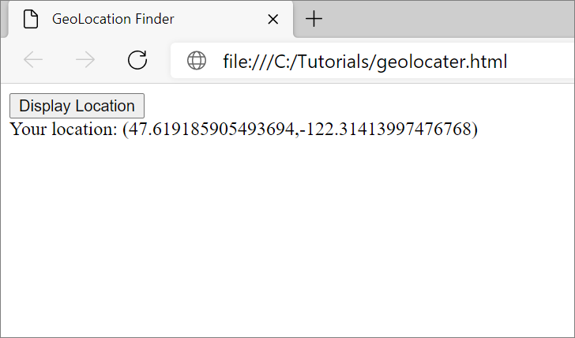
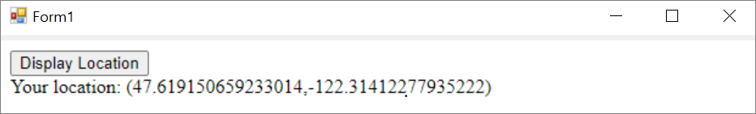
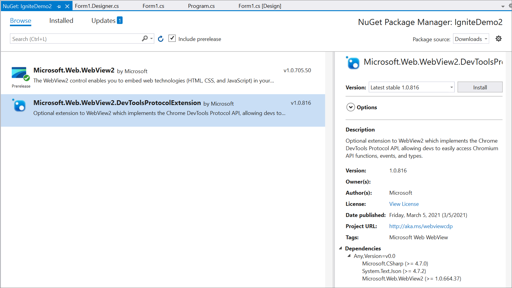
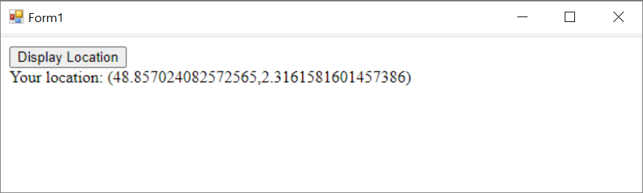

# Use the Chrome DevTools Protocol (CDP) in WebView2 apps

The [Chrome DevTools Protocol](https://chromedevtools.github.io/devtools-protocol) provides APIs to instrument, inspect, debug, and profile Chromium-based browsers.  The Chrome DevTools Protocol is the foundation for the Microsoft Edge DevTools.  Use the Chrome DevTools Protocol for features that aren't implemented in the WebView2 platform.

To use the Chrome DevTools Protocol API in a WebView2 app, do either of the following:

*  Install and use the [Microsoft.Web.WebView2.DevToolsProtocolExtension](https://www.nuget.org/packages/Microsoft.Web.WebView2.DevToolsProtocolExtension) NuGet package (.NET).

*  Or, run one of the following methods:

   *  .NET: [CallDevToolsProtocolAsync](/dotnet/api/microsoft.web.webview2.core.corewebview2.calldevtoolsprotocolmethodasync?view=webview2-dotnet-1.0.774.44&preserve-view=true#Microsoft_Web_WebView2_Core_CoreWebView2_CallDevToolsProtocolMethodAsync_System_String_System_String_), [GetDevToolsProtocolEventReceiver](/dotnet/api/microsoft.web.webview2.core.corewebview2.getdevtoolsprotocoleventreceiver?view=webview2-dotnet-1.0.774.44&preserve-view=true)

   *  Win32 C/C++: [CallDevToolsProtocolMethod](/microsoft-edge/webview2/reference/win32/icorewebview2?view=webview2-1.0.774.44&preserve-view=true#calldevtoolsprotocolmethod), [ICoreWebView2DevToolsProtocolEventReceiver](/microsoft-edge/webview2/reference/win32/icorewebview2devtoolsprotocoleventreceiver?view=webview2-1.0.774.44&preserve-view=true)


<!-- ====================================================================== -->
## Use DevToolsProtocolHelper

The `DevToolsProtocolExtension` includes a `DevToolsProtocolHelper` object.

`Microsoft.Web.WebView2.DevToolsProtocolExtension` is a NuGet package created by the WebView2 team that provides easy access to Chrome DevTools Protocol features.  The following examples describe how to use the geolocation functionality in Chrome DevTools Protocol in your WebView2 control.  To use other Chrome DevTools Protocol features, you can follow a similar pattern.


<!-- ====================================================================== -->
## Step 1: Create a webpage to find your geolocation

To create an `HTML file` to find your geolocation, complete following the actions.

1. Open Visual Studio Code (or an IDE of your choice).

1. Create a new `.html` file.

1. Paste the following code in your new `.html` file:

   ```html
   <!DOCTYPE html>
   <html lang="en">
   <head>
      <title>Geolocation Finder</title>
   </head>
   <body>
      <button id="display">Display Location</button>
      <div id="message"></div>
   </body>
   
   <script>
      const btn = document.getElementById('display');
      // Find the user location.
      btn.addEventListener('click', function () {
         navigator.geolocation.getCurrentPosition(onSuccess, onError);
      });
   
      // Update message to display the latitude and longitude coordinates.
      function onSuccess(position) {
         const {latitude, longitude} = position.coords;
         message.textContent = `Your location: (${latitude},${longitude})`;
      }
   
      function onError() {
         message.textContent = `Operation Failed`;
      }
   </script>
   </html>
   ```

1. Save the `.html` file with the filename `geolocation.html`.

1. Open Microsoft Edge.

1. Open `geolocation.html`.

1. To display your latitude and longitude coordinates, click the **Display Location** button.  To verify and compare your geolocation, copy and paste your coordinates in [https://www.bing.com/maps](https://www.bing.com/maps).

   


<!-- ====================================================================== -->
## Step 2: Display geolocation.html in a WebView2

1. To create a WebView2 app, use a Get Started guide or the WebView2 samples:

   * [Get started with WebView2](../get-started/get-started.md)

   * [WebView2Samples repo](https://github.com/MicrosoftEdge/WebView2Samples)

1. Set the initial navigation of the WebView2 control to `geolocation.html`:

   ```csharp
   webView.CoreWebView2.Navigate(@"C:\{path\to\file}\geolocation.html");
   ```

1. Make sure the `geolocation.html` file is displayed in your WebView2 control app:

   


<!-- ====================================================================== -->
## Step 3: Install the DevToolsProtocolHelper NuGet package

Use NuGet to download `Microsoft.Web.WebView2.DevToolsProtocolExtension`.

To install the package:

1. Select **Project** > **Manage NuGet Packages** > **Browse**.

1. Type `Microsoft.Web.WebView2.DevToolsProtocolExtension` and then select **Microsoft.Web.WebView2.DevToolsProtocolExtension** > **Install**.

1. Make sure **Microsoft.Web.WebView2.DevToolsProtocolExtension** is displayed in the Visual Studio NuGet Package Manager:

   


<!-- ====================================================================== -->
## Step 4: Use DevTools Protocol Helper

1. Add the `DevToolsProtocolExtension` namespace to your project:

   ```csharp
   using Microsoft.Web.WebView2.Core;
   using Microsoft.Web.WebView2.Core.DevToolsProtocolExtension;
   ```

1. Instantiate the `DevToolsProtocolHelper` object and navigate to `geolocation.html`:

   ```csharp
   async void InitializeAsync()
   {
      await webView.EnsureCoreWebView2Async(null);
      DevToolsProtocolHelper helper = webView.CoreWebView2.GetDevToolsProtocolHelper();

      webView.CoreWebView2.Navigate(@"C:\{path\to\file}\geolocation.html");
   }
   ```

1. Run the [setGeoLocationOverrideAsync](https://chromedevtools.github.io/devtools-protocol/tot/Emulation/#method-setGeolocationOverride) method:

   ```csharp
   async void InitializeAsync()
   {
      await webView.EnsureCoreWebView2Async(null);
      DevToolsProtocolHelper helper = webview.CoreWebView2.GetDevToolsProtocolHelper();

      // Latitude and longitude for Paris, France.
      double latitude = 48.857024082572565;
      double longitude = 2.3161581601457386;
      double accuracy = 1;
      await helper.Emulation.setGeolocationOverrideAsync(latitude, longitude, accuracy);
   }
   ```

   For more information, see [setGeolocationOverride](https://chromedevtools.github.io/devtools-protocol/tot/Emulation/#method-setGeolocationOverride).

1. Run your app.

1. To display the coordinates of Paris, France, click the **Display Location** button:

   


<!-- ====================================================================== -->
## File a bug or feature request for the Chrome DevTools Protocol

To request a WebView2 platform feature, enter a new issue in the [WebView2Feedback repo](https://github.com/MicrosoftEdge/WebView2Feedback).

To file a bug about the Chrome DevTools Protocol, file a bug report in the [Chromium bugs database](https://bugs.chromium.org/p/chromium/issues/entry?components=Platform%3EDevTools%3EPlatform).

The Chrome DevTools Protocol is maintained by the open source Chromium project, not by the Microsoft Edge WebView2 team.


<!-- ====================================================================== -->
## See also

* [Microsoft Edge DevTools Protocol overview](../../devtools-protocol-chromium/index.md)
* [WebView2Samples repo](https://github.com/MicrosoftEdge/WebView2Samples)
* [Chrome DevTools Protocol (CDP)](../concepts/overview-features-apis.md#chrome-devtools-protocol-cdp) in _Overview of WebView2 features and APIs_
