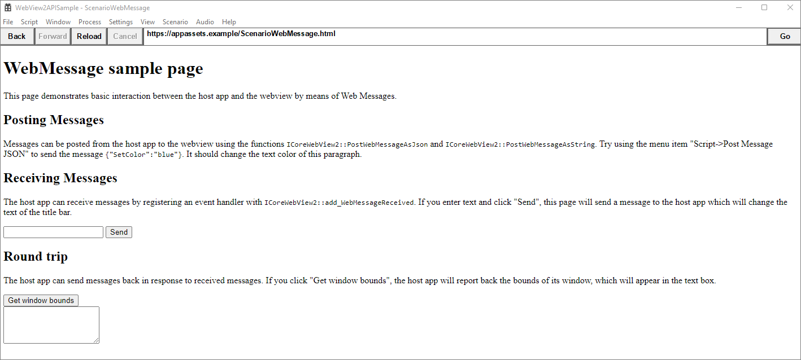
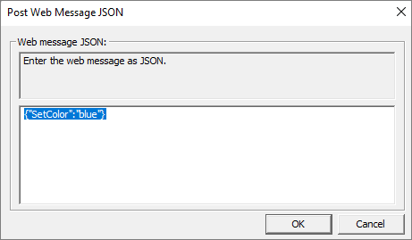

# Interop of native and web code

The Microsoft Edge WebView2 control lets you embed web content into native applications.  You can use WebView2 in different ways, depending on what you need to accomplish.  This article describes how to communicate using simple messages, JavaScript code, and native objects.

Some common use cases include:
*  Update the native host window title after navigating to a different website.
*  Send a native camera object and use its methods from a web app.
*  Run a dedicated JavaScript file on the web side of an application.


<!-- ====================================================================== -->
## Before you begin

This tutorial steps through the Sample App code to demonstrate some of the communication capabilities in WebView2.  Clone the [WebView2Samples repo](https://github.com/MicrosoftEdge/WebView2Samples), open a `.sln` file in Visual Studio, build the project, and run (debug) to follow along with the steps in this article.

For detailed steps about cloning the repo, see [WebView2 sample apps](../samples/index.md).


<!-- ====================================================================== -->
## Scenario: Simple messaging

WebView2 controls let you exchange simple messages between web and native sides of an application.  You can use data types such as `JSON` or `String` to send messages between the host application and WebView2.


<!-- ------------------------------ -->
#### Send messages from the host app to WebView2

This example shows how the sample app changes the color of text in the front end, based on a message from the host app.

To see messaging in action:

1. Run the sample app, then select the **Scenario** tab and select the **Web Messaging** option.

   The following screen appears:

   

1. Notice the first section, titled `Posting Messages`.  Follow the instruction and select **Script** > **Post Message JSON**.  Then click  **OK**. The message turns blue:

   

   How were we able to change text color?  The sample starts by creating a button, on the native side.  Then the sample adds the following code to post the web message when the button is clicked.  This code changes the color of the web text to blue.

   The example includes C++ code to create a Windows button that calls `SendJsonWebMessage()` when clicked.

   For more information about creating a button in C++, see [How to Create a Button](/windows/win32/controls/create-a-button).

1. When the button is clicked, it calls the following code from [ScriptComponent.cpp](https://github.com/MicrosoftEdge/WebView2Samples/blob/c7d7c75184dec0c46634f27a8f4beba320b04618/SampleApps/WebView2APISample/ScriptComponent.cpp).

    ```cpp
    // Prompt the user for some JSON and then post it as a web message.
    void ScriptComponent::SendJsonWebMessage()
    {
        TextInputDialog dialog(
            m_appWindow->GetMainWindow(),
            L"Post Web Message JSON",
            L"Web message JSON:",
            L"Enter the web message as JSON.",
            L"{\"SetColor\":\"blue\"}");
        if (dialog.confirmed)
        {
            m_webView->PostWebMessageAsJson(dialog.input.c_str());
        }
    }
    ```

   > [!NOTE]
   > The rest of this tutorial uses the file `ScenarioWebMessage.html` from the WebView2 sample.  Compare your own HTML file as you work, or copy and paste the content from [ScenarioWebMessage.html](https://github.com/MicrosoftEdge/WebView2Samples/blob/a12bfcc2bc8a1155529c35c7bd4645036f492ca0/SampleApps/WebView2APISample/assets/ScenarioWebMessage.html).

   The example uses a JavaScript event listener on the web.

1. `ScenarioWebMessage.html` includes the following JavaScript in the header:

   ```javascript
   window.chrome.webview.addEventListener('message', arg => {
      if ("SetColor" in arg.data) {
         document.getElementById("colorable").style.color = 
         arg.data.SetColor;
      }
   });
   ```

   The event listener *listens* for a message event and makes the message text colorable.

1. The HTML file describes the messaging exercise:

   ```html
   <h1>WebMessage sample page</h1>
   <p>This page demonstrates basic interaction between the host app 
   and the webview by means of Web Messages.</p>

   <h2>Posting Messages</h2>
   <p id="colorable">Messages can be posted from the host app to the 
   webview using the functions
   <code>ICoreWebView2::PostWebMessageAsJson</code> and
   <code>ICoreWebView2::PostWebMessageAsString</code>. Try selecting 
   the menu item "Script > Post Message JSON" to send the message 
   <code>{"SetColor":"blue"}</code>.
   It should change the text color of this paragraph.</p>
   ```

1. The `Post Message JSON` menu item is in the Microsoft Visual C++ generated resource script file [WebView2APISample.rc](https://github.com/MicrosoftEdge/WebView2Samples/blob/c7d7c75184dec0c46634f27a8f4beba320b04618/SampleApps/WebView2APISample/WebView2APISample.rc).

   ```xml
   MENUITEM "Post Message JSON",           IDM_POST_WEB_MESSAGE_JSON
   ```

1. The script file, in turn, calls the case `IDM_POST_WEB_MESSAGE_JSON` in [ScriptComponent.cpp](https://github.com/MicrosoftEdge/WebView2Samples/blob/c7d7c75184dec0c46634f27a8f4beba320b04618/SampleApps/WebView2APISample/ScriptComponent.cpp).

   ```cpp
   case IDM_POST_WEB_MESSAGE_JSON:
      SendJsonWebMessage();
      return true;
   ```

That completes the example showing how WebView2 communicates through simple messages.


<!-- ------------------------------ -->
#### Receive message strings via postMessage

This example follows the `Receiving Messages` section of the webpage, to change the text of the title bar.  The host app receives a message from WebView2 with the new title bar text.

The C++ file handles the title text and communicates it to the host app as a string.

1. When the button is clicked, WebView2 transmits a message from the web page to the native application using `window.chrome.webview.postMessage` in [ScenarioWebMessage.html](https://github.com/MicrosoftEdge/WebView2Samples/blob/a12bfcc2bc8a1155529c35c7bd4645036f492ca0/SampleApps/WebView2APISample/assets/ScenarioWebMessage.html).

   ```html
   function SetTitleText() {
      let titleText = document.getElementById("title-text");
      window.chrome.webview.postMessage(`SetTitleText ${titleText.value}`);
   }
   ```

1. The HTML file includes a text box and button to send a message to the host app:

   ```html
   <h2>Receiving Messages</h2>
   <p>The host app can receive messages by registering an event handler 
   with <code>ICoreWebView2::add_WebMessageReceived</code>. If you 
   enter text and click "Send", this page will send a message to the 
   host app which will change the text of the title bar.</p>
   <input type="text" id="title-text"/>
   <button onclick="SetTitleText()">Send</button>
   ```

1. The event handler in [ScenarioWebMessage.cpp](https://github.com/MicrosoftEdge/WebView2Samples/blob/a12bfcc2bc8a1155529c35c7bd4645036f492ca0/SampleApps/WebView2APISample/ScenarioWebMessage.cpp) processes the new title text string and communicates it to the host app as a string.

   ```cpp
   // Setup the web message received event handler before navigating to
   // ensure we don't miss any messages.
   CHECK_FAILURE(m_webView->add_WebMessageReceived(
      Microsoft::WRL::Callback<ICoreWebView2WebMessageReceivedEventHandler>(
         [this](ICoreWebView2* sender, ICoreWebView2WebMessageReceivedEventArgs* args)
   {
      wil::unique_cotaskmem_string uri;
      CHECK_FAILURE(args->get_Source(&uri));

      // Always validate that the origin of the message is what you expect.
      if (uri.get() != m_sampleUri)
      {
         return S_OK;
      }
      wil::unique_cotaskmem_string messageRaw;
      CHECK_FAILURE(args->TryGetWebMessageAsString(&messageRaw));
      std::wstring message = messageRaw.get();

      if (message.compare(0, 13, L"SetTitleText ") == 0)
      {
         m_appWindow->SetTitleText(message.substr(13).c_str());
      }
      else if (message.compare(L"GetWindowBounds") == 0)
      {
         RECT bounds = m_appWindow->GetWindowBounds();
         std::wstring reply =
               L"{\"WindowBounds\":\"Left:" + std::to_wstring(bounds.left)
               + L"\\nTop:" + std::to_wstring(bounds.top)
               + L"\\nRight:" + std::to_wstring(bounds.right)
               + L"\\nBottom:" + std::to_wstring(bounds.bottom)
               + L"\"}";
         CHECK_FAILURE(sender->PostWebMessageAsJson(reply.c_str()));
      }
      return S_OK;
   }).Get(), &m_webMessageReceivedToken));
   ```


<!-- ------------------------------ -->
#### Round-trip messages

This example follows the `<h2>Round trip</h2>` section of the WebMessage sample page, [ScenarioWebMessage.html](https://github.com/MicrosoftEdge/WebView2Samples/blob/a12bfcc2bc8a1155529c35c7bd4645036f492ca0/SampleApps/WebView2APISample/assets/ScenarioWebMessage.html). This example shows a round-trip message from WebView2 to the host app and back.  The host app receives a request from WebView2 and returns the bounds of the active window.

When requested by the host app, the C++ file gets the window bounds and sends the data to WebView2 as a JSON web message.

1. The HTML file includes a button to get window bounds from the host app:

   ```html
   <h2>Round trip</h2>
   <p>The host app can send messages back in response to received 
   messages. If you click the <b>Get window bounds</b> button, the 
   host app reports back the bounds of its window, which are 
   displayed in the text box.</p>
   <button onclick="GetWindowBounds()">Get window bounds</button><br>
   <textarea id="window-bounds" rows="4" readonly></textarea>
   ```

1. When the user clicks the button, WebView2 transmits a message from the web page to the native application using `window.chrome.webview.postMessage`.

   ```html
   function GetWindowBounds() {
      window.chrome.webview.postMessage("GetWindowBounds");
   }
   ```

1. The event handler in [ScenarioWebMessage.cpp](https://github.com/MicrosoftEdge/WebView2Samples/blob/a12bfcc2bc8a1155529c35c7bd4645036f492ca0/SampleApps/WebView2APISample/ScenarioWebMessage.cpp) gets the window bounds and sends the data to the host app using `TryGetWebMessageAsString`:

   ```cpp
   // Setup the web message received event handler before navigating to
   // ensure we don't miss any messages.
   CHECK_FAILURE(m_webView->add_WebMessageReceived(
      Microsoft::WRL::Callback<ICoreWebView2WebMessageReceivedEventHandler>(
         [this](ICoreWebView2* sender, ICoreWebView2WebMessageReceivedEventArgs* args)
   {
      wil::unique_cotaskmem_string uri;
      CHECK_FAILURE(args->get_Source(&uri));

      // Always validate that the origin of the message is what you expect.
      if (uri.get() != m_sampleUri)
      {
         return S_OK;
      }
      wil::unique_cotaskmem_string messageRaw;
      CHECK_FAILURE(args->TryGetWebMessageAsString(&messageRaw));
      std::wstring message = messageRaw.get();

      if (message.compare(0, 13, L"SetTitleText ") == 0)
      {
         m_appWindow->SetTitleText(message.substr(13).c_str());
      }
      else if (message.compare(L"GetWindowBounds") == 0)
      {
         RECT bounds = m_appWindow->GetWindowBounds();
         std::wstring reply =
               L"{\"WindowBounds\":\"Left:" + std::to_wstring(bounds.left)
               + L"\\nTop:" + std::to_wstring(bounds.top)
               + L"\\nRight:" + std::to_wstring(bounds.right)
               + L"\\nBottom:" + std::to_wstring(bounds.bottom)
               + L"\"}";
         CHECK_FAILURE(sender->PostWebMessageAsJson(reply.c_str()));
      }
      return S_OK;
   }).Get(), &m_webMessageReceivedToken));
   ```

   The window bounds are displayed on the web page.


<!-- ====================================================================== -->
## Scenario: Send JavaScript code

This scenario shows how to run JavaScript on the web side.  In this approach, the host app specifies the JavaScript code to run, and passes the code to the web through `ExecuteScriptAsync`.  The `ExecuteScriptAsync` function returns the JavaScript result back to the `ExecuteScript` caller.

For more information, see [Use JavaScript in WebView2 (Run JavaScript from native code)](javascript.md).


<!-- ====================================================================== -->
## Scenario: Send native objects

Pass the native object to the web.  Then call the object's methods from the web.

To use messages that represent method calls, use the `AddHostObjectToScript` API.  At a high level, this API lets you expose native (host) objects into the web side and act as a proxy.  Access these objects by using `window.chrome.webview.hostObjects.{name}`.

Passing a native object to the web side of an application is described in the [AddHostObjectToScript](/microsoft-edge/webview2/reference/win32/icorewebview2#addhostobjecttoscript) section of [interface ICoreWebView2](/microsoft-edge/webview2/reference/win32/icorewebview2).

Congratulations! You've successfully embedded web content into native applications.


<!-- ====================================================================== -->
## See also

* [Web/native interop](../concepts/overview-features-apis.md#webnative-interop) in _Overview of WebView2 APIs_.
