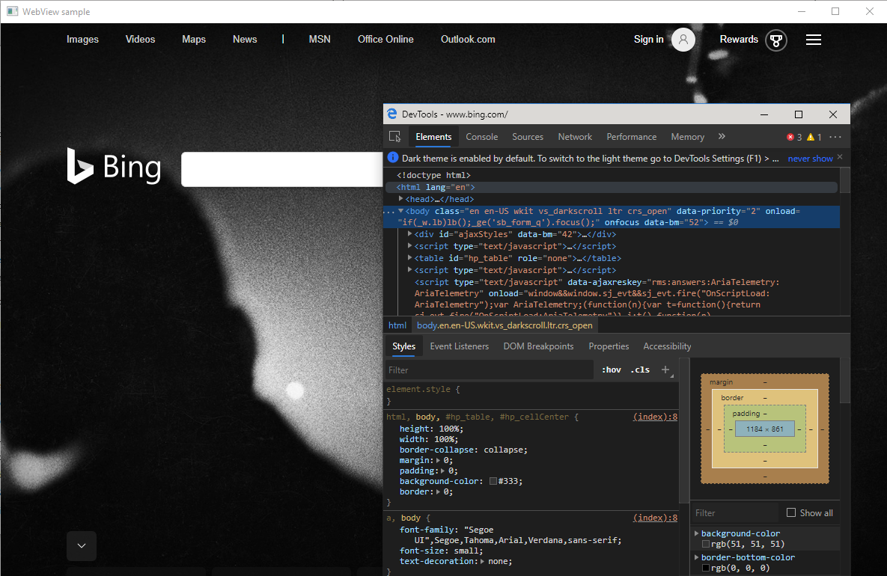

# Debug WebView2 apps with Microsoft Edge DevTools

Use Microsoft Edge Developer Tools to debug web content displayed in WebView2 controls, in the same way that you can debug another webpage that's displayed in Microsoft Edge.

When you're using a WebView2 app, there are several ways to open DevTools:

*  Press **F12**.
*  Press **Ctrl+Shift+I**.
*  Right-click the page and then select `Inspect`.

An app can also use the `OpenDevToolsWindow` API to programmatically open a DevTools window.  For example, you can use this approach if the above hotkeys and the context menu items have been removed.

##### [.NET/C#](#tab/dotnetcsharp)

* [CoreWebView2.OpenDevToolsWindow Method](/dotnet/api/microsoft.web.webview2.core.corewebview2.opendevtoolswindow)

##### [WinRT/C#](#tab/winrtcsharp)

* [CoreWebView2.OpenDevToolsWindow Method](/microsoft-edge/webview2/reference/winrt/microsoft_web_webview2_core/corewebview2#opendevtoolswindow)

##### [Win32/C++](#tab/win32cpp)

* [ICoreWebView2::OpenDevToolsWindow method](/microsoft-edge/webview2/reference/win32/icorewebview2#opendevtoolswindow)

---

If none of the above approaches are available, you can add `--auto-open-devtools-for-tabs` to the browser arguments via an environment variable or registry key.  This approach will open a DevTools window when a WebView2 is created.

<!-- ====================================================================== -->
## See also

* [Overview of DevTools](../index.md).
* [Get started with WebView2](../get-started/get-started.md)
* [WebView2Samples repo](https://github.com/MicrosoftEdge/WebView2Samples) - a comprehensive example of WebView2 capabilities.
* [WebView2 API reference](../webview2-api-reference.md)
