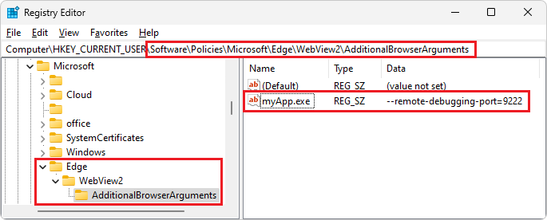

# Debug WebView2 apps with Visual Studio Code

Use Microsoft Visual Studio Code to debug scripts that run in WebView2 controls.  <!-- Make sure you're using Visual Studio Code version [insert build here] or later. -->
Visual Studio Code has a built-in debugger for browser debugging.  See [Browser debugging in VS Code](https://code.visualstudio.com/docs/nodejs/browser-debugging).


<!-- ====================================================================== -->
## Create a launch.json file

To debug your code, your project is required to have a `launch.json` file.  A `launch.json` file is a debugger configuration file to configure and customize the Visual Studio Code debugger. One of the properties that's needed to configure the debugger is the `request` property. There are two `request` types, `launch` and `attach`.

The following code demonstrates launching the app from Visual Studio Code (rather than attaching the debugger to a running instance of the app). To do this, the app must have been built previously. If your project doesn't have a `launch.json` file, create a new `launch.json` file in the `.vscode` subfolder in your current project and paste the following code into it:

```json
"name": "Hello debug world",
"type": "msedge",
"port": 9222, // The port value is optional, and the default value is 9222.
"request": "launch",
"runtimeExecutable": "C:/path/to/your/webview2/app.exe",
"env": {
   // Customize for your app location if needed
   "Path": "%path%;e:/path/to/your/app/location; "
},
"useWebView": true,
// The following two lines set up source path mapping, where `url` is the start page
// of your app, and `webRoot` is the top level directory with all your code files.
"url": "file:///${workspaceFolder}/path/to/your/toplevel/foo.html",
"webRoot": "${workspaceFolder}/path/to/your/assets"
```

### Command-line URL parameter passed in

Visual Studio Code source path mapping now requires an URL, so your app now receives a `url` command-line parameter when it starts.  You can safely ignore the `url` parameter, if needed.


<!-- ====================================================================== -->
## Debug your code

1. To set a breakpoint in your source code, click a line of code and then press **F9**:

   

1. On the **Run** tab, select the launch configuration from the dropdown menu.

1. Click **Start Debugging**, which is the green triangle next to the launch configuration dropdown list:

   

1. To view the debug output and errors, open **Debug Console**:

   


<!-- ====================================================================== -->
## Targeted WebView2 debugging

In some WebView2 apps, you might use more than one WebView2 control.  To pick which WebView2 control to debug in this situation, you can use targeted WebView2 debugging.

Open `launch.json` and complete the following actions to use targeted WebView2 debugging.

1. Confirm that the `useWebview` parameter is set to `true`.

1. Add the `urlFilter` parameter.  When the WebView2 control navigates to a URL, the `urlFilter` parameter value is used to compare strings that appear in the URL.

```json
"useWebview": "true",
"urlFilter": "*index.ts",

// Options for "urlFilter":
// Match any url that ends with "index.ts":
"urlFilter": "*index.ts",
// Match any url that contains "index" anywhere in the URL:
"urlFilter": "*index*",
// Explicitly match a file named "index.ts":
"urlFilter": "file://C:/path/to/my/index.ts",
```

When debugging your app, you might need to step through the code from the beginning of the rendering process. If you are rendering webpages on sites and you don't have access to the source code, you can use the `?=value` option, because webpages ignore unrecognized parameters.


### Cannot debug two WebView2 controls at the same time

After the first match is found in the URL, the debugger stops.  You cannot debug two WebView2 controls at the same time, because the CDP port is shared by all WebView2 controls, and uses a single port number.


<!-- ====================================================================== -->
## Debug running processes

You might need to attach the debugger to running WebView2 processes.  To do that, in `launch.json`, update the `request` parameter, changing its value to `attach`:

```json
"name": "Hello debugging world",
"type": "msedge",
"port": 9222,
"request": "attach",
"runtimeExecutable": "C:/path/to/your/webview2/app.exe",
"env": {
   "Path": "%path%;e:/path/to/your/build/location; "
},
"useWebView": true
```

Your WebView2 control must open the Chrome Developer Protocol (CDP) port to allow debugging of the WebView2 control.  Your code must be built to ensure that only one WebView2 control has a CDP port open, before starting the debugger.

You will also need to add a new REGKEY `*--remote-debugging-port=9222` under `Computer\HKEY_CURRENT_USER\Software\Policies\Microsoft\Edge\WebView2\AdditionalBrowserArguments` so that the debugger can find the proper port. To add this registry key:

1. Open the Registry Editor by pressing the **Windows logo key** and then searching for **registry editor**. Open the **Registry Editor** application, and then select **Yes** to allow editing.

1. Set the registry key `HKEY_CURRENT_USER\Software\Policies\Microsoft\Edge\WebView2\AdditionalBrowserArguments` equal to `--remote-debugging-port=9222`.

   To do this, in the editor, navigate to `HKEY_CURRENT_USER\Software\Policies\Microsoft\Edge\WebView2\AdditionalBrowserArguments` by clicking on each subfolder under the path.

   If this path doesn't exist, navigate to `HKEY_CURRENT_USER\Software\Policies\Microsoft` in the editor, right-click the `Microsoft` folder, select **New**, and then select **Key**.  Enter `Edge` for the name of the new key.  Continue to do this for each subfolder until you have the full path: `HKEY_CURRENT_USER\Software\Policies\Microsoft\Edge\WebView2\AdditionalBrowserArguments`.

1. Right-click the `AdditionalBrowserArguments` folder, select **New**, and then select **String Value**.
Rename `New Value #1` to `*`.

1. Right click the **\*** value, and then select **Modify**.  Set the `Value Data` equal to `--remote-debugging-port=9222`.  Verify that the edit window matches the following:

   

1. Click **OK**, and then verify that the registry key is set in the editor and matches the following:

   


<!-- ====================================================================== -->
## Debug tracing options

To enable debug tracing, add the `trace` parameter to `launch.json` , as follows:

1. Add the `trace` parameter:

```json
"name": "Hello debugging world",
"type": "msedge",
"port": 9222,
"request": "attach",
"runtimeExecutable": "C:/path/to/your/webview2/app.exe",
"env": {
"Path": "%path%;e:/path/to/your/build/location; "
},
"useWebView": true
,"trace": true  // Turn on debug tracing, and save the output to a log file.
```

Saving debug output to a log file:


      
```json
,"trace": "verbose"  // Turn on verbose tracing in the Debug Output pane.
```

Visual Studio Code Debug Output with verbose tracing turned on:


<!-- ====================================================================== -->
## Debug Office Add-ins

If you're debugging Office Add-ins, open the add-in source code in a separate instance of Visual Studio Code.  Open `launch.json` in your WebView2 app.  Add the following code into `launch.json`, to attach the debugger to the Office add-in:

```json
,"debugServer": 4711
```


<!-- ====================================================================== -->
## Debug WebView2 WinUI 2 (UWP) apps

1. Install a WebView2 Runtime version past `106.0.1370.34`.

1. Open the Registry Editor by pressing the **Windows logo key** and then searching for **registry editor**. Open the **Registry Editor** application and select **Yes** to allow editing.

1. Set the registry key `HKEY_CURRENT_USER\Software\Policies\Microsoft\Edge\WebView2\AdditionalBrowserArguments` equal to `--remote-debugging-pipe`.  To do this, follow the steps outlined in the [Debug running processes](#debug-running-processes) section above.

1. Verify that the registry key is set in the editor and matches the following:

   

1. Add a new configuration to your `launch.json` file.  Open `launch.json` and add the following code:

   ```json
   "name": "Attach to UWP App",
   "useWebView":{
      "pipeName":"JSDebugPipe"
   }
   "request": "attach",
   "type": "msedge",
   "webRoot":"${workspaceFolder}"
   ```

1. Launch your app.

1. Click the **Start Debugging** button to attach to the process and begin debugging.

   


<!-- ====================================================================== -->
## Troubleshoot the debugger

You might encounter these scenarios when using the debugger.


### Doesn't stop at breakpoint

If the debugger doesn't stop at the breakpoint, and you have debug output: 

To solve the issue, confirm that the file with the breakpoint is the same file that's used by the WebView2 control.  The debugger doesn't perform source path mapping.


### Can't attach to running process

If you can't attach to a running process, and you get a timeout error:

To solve the issue, confirm that the WebView2 control opened the CDP port.  Make sure your `additionalBrowserArguments` value in the registry is correct, or the options are correct.  See [additionalBrowserArguments for dotnet](/dotnet/api/microsoft.web.webview2.core.corewebview2environmentoptions.additionalbrowserarguments) and [additionalBrowserArguments for Win32](/microsoft-edge/webview2/reference/win32/webview2-idl#createcorewebview2environmentwithoptions).


<!-- ====================================================================== -->
## See also

* [Get started with WebView2](../get-started/get-started.md)
* [WebView2Samples repo](https://github.com/MicrosoftEdge/WebView2Samples) - a comprehensive example of WebView2 capabilities.
* [WebView2 API reference](../webview2-api-reference.md)
