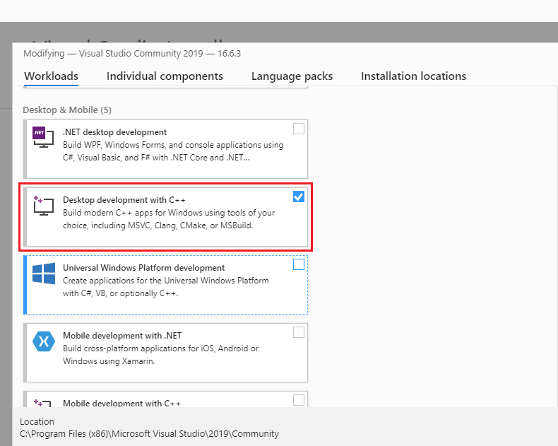
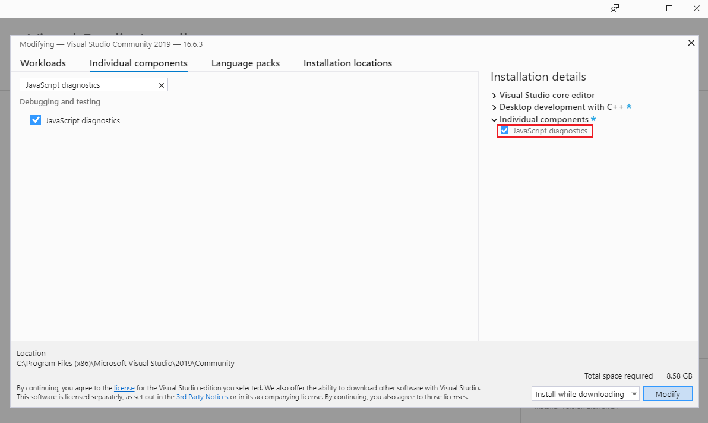
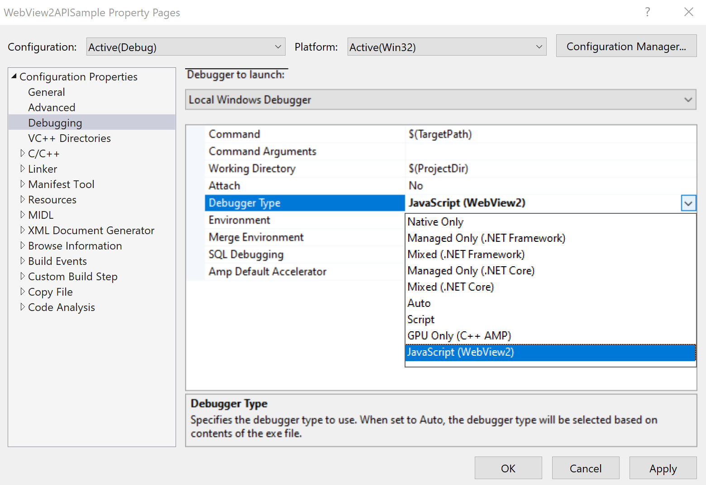
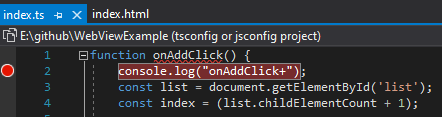
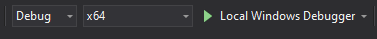
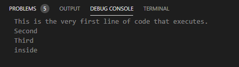

# Debug WebView2 apps with Visual Studio

Microsoft Visual Studio provides various debugging tools for web and native code in WebView2 apps, to debug web and native code in Win32 apps or Office Add-ins.  This article focuses on debugging WebView2 controls.  The other methods of debugging in Visual Studio are available, as well.

<!-- ====================================================================== -->
## Open DevTools using an approach other than F12

When you debug your app in Visual Studio with the native debugger attached, pressing **F12** may trigger the native debugger instead of Developer Tools.  To avoid that situation, press **Ctrl+Shift+I**.  Or, right-click the page, and then select `Inspect`.

<!-- ====================================================================== -->
## Requirements

*  To debug scripts, the app must be launched from within Visual Studio.

*  You cannot attach a debugger to a running WebView2 process.

*  Install Visual Studio 2019 version 16.4 Preview 2 or later.

To debug your code, first install and set up the script debugger tools in Visual Studio, per the following two sections.

<!-- ====================================================================== -->
## Install the JavaScript diagnostics component

First, install the **JavaScript diagnostics** component in **Desktop development with C++**, as follows.

1. In the Windows Explorer bar, type `Visual Studio Installer`.

1. Select **Visual Studio Installer** to open it.

1. In the Visual Studio Installer, on the installed version, click the **More** button, and then select **Modify**.

1. In Visual Studio, under **Workloads**, select the **Desktop Development with C++** setting:

   

1. Select **Individual components**, at the top.

1. In the search box, enter `JavaScript diagnostics`.

1. Select the **JavaScript diagnostics** setting.

1. Click **Modify**.

   

<!-- ====================================================================== -->
## Enable script debugging for WebView2 apps

Second, enable script debugging for WebView2 apps, as follows.

1. Right-click your WebView2 project, and then select **Properties**.

1. Under the **Configuration Properties**, select **Debugging**.

1. Under the **Debugger Type**, select **JavaScript (WebView2)**.

   

<!-- ====================================================================== -->
## Debug your WebView2 app

After doing the above setup, debug your WebView2 app, as follows.

1. To set a breakpoint in your source code, hover to the left of the line number, and click to set a breakpoint.  The JS/TS debug adapter doesn't perform source path mapping.  You must open the exact same path associated with your WebView2.

   

1. To run the debugger, select the bit size of the platform, and then click the green Play button next to **Local Windows Debugger**.  The app runs and the debugger connects to the first WebView2 process that is created.

   

1. In the **Debug Console**, find the output from the debugger.

   

<!-- ====================================================================== -->
## Troubleshooting

### Virtual source path mapping not supported in Visual Studio 2019

If you use the WebView2 [SetVirtualHostNameToFolderMapping](/dotnet/api/microsoft.web.webview2.core.corewebview2.setvirtualhostnametofoldermapping) method, the debugger in Visual Studio 2019 doesn't understand the virtual source path mapping, so breakpoints don't work correctly.

Virtual source path mapping works when you use the debugger in <!-- Visual Studio 2022 or? -->Visual Studio Code.

<!-- ====================================================================== -->
## See also

* [Get started with WebView2](../get-started/get-started.md)
* [WebView2Samples repo](https://github.com/MicrosoftEdge/WebView2Samples) - a comprehensive example of WebView2 capabilities.
* [WebView2 API reference](../webview2-api-reference.md)
