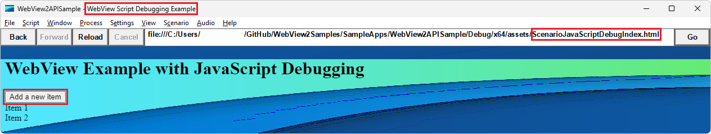

# Debug WebView2 apps with Visual Studio

Microsoft Visual Studio provides various debugging tools for web and native code in WebView2 apps, to debug web and native code in Win32 apps or Office Add-ins.  This article focuses on debugging WebView2 controls.  The other methods of debugging in Visual Studio are available, as well.

<!-- ====================================================================== -->
## Open DevTools using an approach other than F12

When you debug your app in Visual Studio with the native debugger attached, pressing **F12** may trigger the native debugger instead of Developer Tools.  To avoid that situation, press **Ctrl+Shift+I**.  Or, right-click the page, and then select `Inspect`.

<!-- ====================================================================== -->
## Requirements

*  To debug scripts, the app must be launched from within Visual Studio.  You can install both Visual Studio 2019 (to work with most of the WebView2 sample apps) and Visual Studio 2022 (for example, for your own WebView2 app).

*  You cannot attach a debugger to a running WebView2 process.

*  Install Visual Studio 2019 (version 16.4 Preview 2 or later).  If that's not done yet, see [If you're installing Visual Studio now](#if-youre-installing-visual-studio-now), below.

To debug your code, first install and set up the script debugger tools in Visual Studio, per the following two sections.

<!-- ====================================================================== -->
## Install the JavaScript diagnostics component

First, install the **JavaScript diagnostics** component in the **Desktop development with C++** workload of Visual Studio, as follows.

<!-- ------------------------------ -->
#### If you're installing Visual Studio now

1. To work with the WebView2 samples, download Visual Studio 2019 (version 16.4 Preview 2 or later), from [Downloads](https://visualstudio.microsoft.com/downloads/), and then run the downloaded installer file.  To work with your own WebView2 app, you might want to do these steps for Visual Studio 2022 as well.

1. In the Visual Studio Installer, select the **Desktop development with C++** workload, so that a checkmark appears, similar to the screenshot in the next section.

1. In the tree of components for the **Desktop development with C++** workload, on the right, select the **JavaScript diagnostics** component, similar to that checkbox shown in the screenshot in the next section.

1. Click the **Install** button.  When the installer finishes, you can reboot your machine to clean up, as the installer suggests.

See also:
* [Install Visual Studio](./machine-setup.md#install-visual-studio) in _Set up your Dev environment for WebView2_.

Continue with [Enable script debugging for WebView2 apps](#enable-script-debugging-for-webview2-apps), below.

<!-- ------------------------------ -->
#### If you've already installed Visual Studio

To work with most of the WebView2 samples, use Visual Studio 2019.  To work with your own WebView2 app, you might want to do these steps for Visual Studio 2022 as well.

1. In the Windows Explorer bar, type `Visual Studio Installer`.

1. Select **Visual Studio Installer** to open it.

1. In the Visual Studio Installer, on the installed version, click the **More** button, and then select **Modify**.

1. In Visual Studio, under **Workloads**, select the **Desktop Development with C++** workload, so that a checkmark appears:

   

1. Select **Individual components**, at the top.

1. In the search box, enter `JavaScript diagnostics`.

1. Select the **JavaScript diagnostics** checkbox:

   

1. Click the **Modify** button.

<!-- ====================================================================== -->
## Enable script debugging for WebView2 apps

Second, enable script debugging for WebView2 apps, as follows.  You can open your own WebView2 app in Visual Studio 2019 or 2022.  The following steps walk you through:
* Opening the Win32APISample sample in Visual Studio 2022.
* Working within your own working branch of the WebView2Samples repo, where some of the project files are modified during updating to Visual Studio 2022.

1. If not done already, do the steps in [Win32 sample app](../samples/webview2apissample.md) so that the WebView2APISample app builds and runs.  Or open your own WebView2 app project in Visual Studio.

1. In Visual Studio, in Solution Explorer, right-click the **WebView2APISample** project (or your own project), and then select **Properties**.

1. Under **Configuration Properties**, select **Debugging**.

1. For **Debugger Type**, select **JavaScript (WebView2)**, and then click the **OK** button:

   <!-- WebView2APISample -->

<!-- ====================================================================== -->
## Debug your WebView2 app

After doing the above setup, debug your WebView2 app, as follows.

1. To set a breakpoint in your source code, hover to the left of the line number, and click to set a breakpoint.  For example, open `WebView2Samples\SampleApps\WebView2APISample\assets\ScenarioJavaScriptDebugIndex.js`, and set a breakpoint on line 2: `console.log("onAddClick+");`, in the body of the `onAddClick` function:

   

   When setting a breakpoint, you must open the file that's in the exact same path that's associated with your WebView2 control, because the JS/TS debug adapter doesn't perform source path mapping.  

1. To run the debugger, select the bit size of the platform, and then click the green Play button to the left of **Local Windows Debugger**.

   The WebView2APISample app (or your own app) runs and opens, and the debugger connects to the first WebView2 process that's created.  In **Properties** > **Debugger** for the project, **Local Windows Debugger** was set to **JavaScript (WebView2)**.

1. In the WebView2APISample app window, select **Scenario** > **Script Debugging** > **JavaScript Local File**.

   The file `WebView2APISample/Debug/x64/assets/ScenarioJavaScriptDebugIndex.html` is rendered:

   

1. In the webpage in the app, click the **Add a new item** popup button.

   The breakpoint in the `onAddClick` function is hit, and the app is paused in the debugger.

1. Switch to the Visual Studio window, and examine the debugger panes.

1. Click the **Output** tab, to display the app's output:

   

   The app output shows "This is the very first line of code that executes", because of the line `console.log("This is the very first line of code that executes.");` in the file `WebView2Samples\SampleApps\WebView2APISample\assets\ScenarioJavaScriptDebugIndex.html`.

<!-- ====================================================================== -->
## Troubleshooting

### Virtual source path mapping not supported in Visual Studio 2019

If you use the WebView2 [SetVirtualHostNameToFolderMapping](/dotnet/api/microsoft.web.webview2.core.corewebview2.setvirtualhostnametofoldermapping) method, the debugger in Visual Studio 2019<!-- or VS 2022? --> doesn't understand the virtual source path mapping, so breakpoints don't work correctly.

When setting a breakpoint, you must open the file that's in the exact same path that's associated with your WebView2 control, because the JS/TS debug adapter doesn't perform source path mapping.  

Virtual source path mapping is supported by the debugger in Visual Studio Code.<!-- what about Visual Studio? -->

<!-- ====================================================================== -->
## See also

* [Get started with WebView2](../get-started/get-started.md)
* [WebView2Samples repo](https://github.com/MicrosoftEdge/WebView2Samples) - a comprehensive example of WebView2 capabilities.
* [WebView2 API reference](../webview2-api-reference.md)
