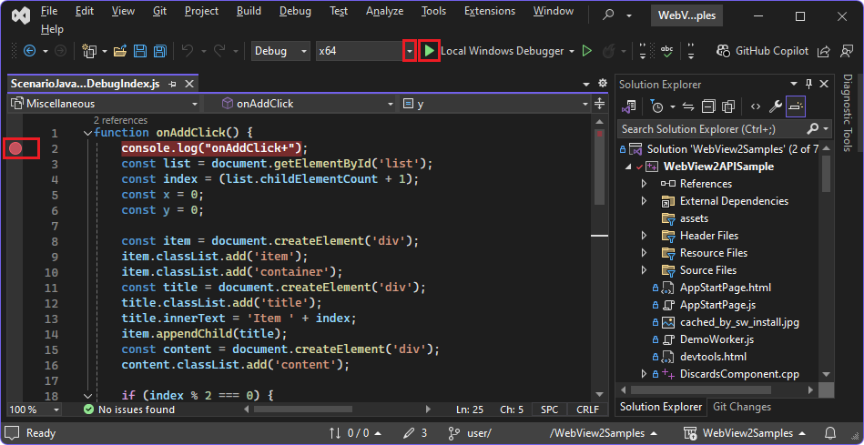

# Debug WebView2 apps with Visual Studio

Microsoft Visual Studio provides various debugging tools for web and native code in WebView2 apps, to debug web and native code in Win32 apps or Office Add-ins.  This article focuses on debugging WebView2 controls.  The other methods of debugging in Visual Studio are available, as well.


<!-- ------------------------------ -->
#### Summary of high-level steps

To debug JavaScript code in a WebView2 control: 

1. Install the **JavaScript diagnostics** component in the **Desktop development with C++** workload of Visual Studio, or in another platform's workload.

1. Set a breakpoint on a line of JavaScript code.

1. In the project's **Properties** > **Debugging** page, set **Debugger Type** to **JavaScript (WebView2)** (instead of **Auto** or **Native**).

1. Start the debugger, as usual.  For example, in the menu bar, select **Debug** > **Start Debugging (F5)**.

1. In the running WebView2 app, interact with a webpage that runs the JavaScript code.  The debugger pauses on the line of JavaScript code that has the breakpoint.

1. Use the debugger panes in Visual Studio.

These steps are detailed below, using the main, Win32/C++ sample (WebView2APISample).


<!-- ====================================================================== -->
## Requirements

* Clone the WebView2Samples repo, if you want to follow the specific example steps below (using the main, Win32/C++ sample, WebView2APISample).  A step below shows how to do this.

* Install Visual Studio 2022.  You can use Visual Studio 2022 to work with the WebView2 sample apps and your own WebView2 app.  (Visual Studio 2019 works, as well.)  A step below shows how to do this.

* Install and set up the script debugger tools in Visual Studio.  That is, install the **Desktop development with C++** workload of Visual Studio (or the equivalent workload for a different language), including its **JavaScript diagnostics** component.  A step below shows how to do this.

* Build and run the main, Win32/C++ sample, so that the WebView2APISample app builds and runs (if you want to follow the specific example steps below).  A step below shows how to do this.

* To debug scripts, the app must be launched from within Visual Studio.

* You cannot attach a debugger to a running WebView2 process.


<!-- ====================================================================== -->
## Install the JavaScript diagnostics component

Use the **Visual Studio Installer** to install the **Desktop development with C++** workload of Visual Studio, including its **JavaScript diagnostics** component, as follows.  Or, if you are using a language workload other than C++, select that workload's **JavaScript diagnostics** component, similar to the below steps.

1. If not done already, clone the WebView2Samples repo, as described in [Clone the WebView2Samples repo](./machine-setup.md#clone-the-webview2samples-repo) in _Set up your Dev environment for WebView2_.

1. If not done already, install Visual Studio 2022, as described in [Install Visual Studio](./machine-setup.md#install-visual-studio) in _Set up your Dev environment for WebView2_.

1. In Visual Studio 2022, install the **Desktop development with C++** workload, as follows:

1. In the Windows Explorer bar, type `Visual Studio Installer`.

1. Select **Visual Studio Installer** to open it.

1. In the Visual Studio Installer, on the installed version, click the **More** button, and then select **Modify**.

1. In Visual Studio, under **Workloads**, select the **Desktop Development with C++** workload, so that a checkmark appears:

   

1. Select **Individual components**, at the top.

1. In the search box, enter `JavaScript diagnostics`.

1. Select the **JavaScript diagnostics** checkbox:

   

1. Click the **Modify** button.

Continue with the next section, below.


<!-- ====================================================================== -->
## Select the JavaScript (WebView2) debugger

Next, enable script debugging for WebView2 apps, as follows.

1. If not done already, do the steps in [Win32 sample app](../samples/webview2apissample.md) so that the WebView2APISample app builds and runs.  The **WebView2Samples** solution should be open in Visual Studio, and the sample app should not be running.  Or, open your own WebView2 app project in Visual Studio.

1. In Visual Studio, in Solution Explorer, right-click the **WebView2APISample** project (or your own project), and then select **Properties**.

   The **Property Pages** dialog opens.

1. On the left, expand **Configuration Properties**, and then select **Debugging**.

1. To the right of **Debugger Type**, select **JavaScript (WebView2)**, and then click the **OK** button:

   <!-- WebView2APISample -->


<!-- ====================================================================== -->
## Debug your WebView2 app

After doing the above setup, debug your WebView2 app, as follows.

1. To set a breakpoint in your source code, hover to the left of the line number, and click to set a breakpoint.  For example, open `WebView2Samples\SampleApps\WebView2APISample\assets\ScenarioJavaScriptDebugIndex.js`, and set a breakpoint on line 2: `console.log("onAddClick+");`, in the body of the `onAddClick` function:

   

   When setting a breakpoint, you must open the file that's in the exact same path that's associated with your WebView2 control, because the JS/TS debug adapter doesn't perform source path mapping.  

   The breakpoint will be triggered when this section of the code is executed.  This breakpoint is triggered upon clicking the **Add a new item** button in the sample app, in a later step below.

1. Select the bit size of the platform, such as **x64**.

1. To run the debugger, do any of the following: 

   * In the menu bar, select **Debug** > **Start Debugging (F5)**.
   * In Solution Explorer, right-click the project > **Debug** > **Start New Instance** or **Step Into New Instance**.
   * Click the green Play button to the left of **Local Windows Debugger**.
    
   The WebView2APISample app (or your own app) runs and opens, and the debugger connects to the first WebView2 process that's created.  In **Properties** > **Debugging** for the project, **Local Windows Debugger** was set to **JavaScript (WebView2)**.

1. In Visual Studio, click the **Output** tab, in the lower right.

   The tab contains only the following message, which mentions the JS debugger: "Verbose logs are written to: C:\Users\myUsername\AppData\Local\Temp\visualstudio-js-debugger.txt".

1. In the WebView2APISample app window, select **Scenario** > **Script Debugging** > **JavaScript Local File**.

   The file `WebView2APISample/Debug/x64/assets/ScenarioJavaScriptDebugIndex.html` is rendered:

   

1. In Visual Studio, examine the **Output** pane.  The following output has been added:

   ```
   This is the very first line of code that executes.
   Second
   Third
   inside
   onAddClick+
   onAddClick-
   onAddClick+
   onAddClick-
   End
   ```

1. In the webpage in the app, click the **Add a new item** popup button.

   The breakpoint in the `onAddClick` function is hit, and the app is paused in the debugger.

1. Switch to the Visual Studio window, and examine the debugger panes.

1. Click the **Output** tab, to display the app's output:

   

   The app output shows "This is the very first line of code that executes", because of the line `console.log("This is the very first line of code that executes.");` in the file `WebView2Samples\SampleApps\WebView2APISample\assets\ScenarioJavaScriptDebugIndex.html`.


<!-- ====================================================================== -->
## Source maps with the `WebResourceRequested` event or virtual host name mapping

Source maps are needed to debug the source code of compiled content, including:
* Transpiled JavaScript, such as TypeScript or minified JavaScript.
* Compiled CSS, such as SASS or SCSS.

WebView2 doesn't load source maps that are referenced by content which was loaded by using either approach:

* The `WebResourceRequested` event.  See:
   * [Loading local content by handling the `WebResourceRequested` event](../concepts/working-with-local-content.md#loading-local-content-by-handling-the-webresourcerequested-event) in _Using local content in WebView2 apps_.
   * [Source maps with the `WebResourceRequested` event](../concepts/working-with-local-content.md#source-maps-with-the-webresourcerequested-event) in _Using local content in WebView2 apps_.

* Virtual host name mapping.  See:
   * [Loading local content by using virtual host name mapping](../concepts/working-with-local-content.md#loading-local-content-by-using-virtual-host-name-mapping) in _Using local content in WebView2 apps_.
   * [Source maps with virtual host name mapping](../concepts/working-with-local-content.md#source-maps-with-virtual-host-name-mapping) in _Using local content in WebView2 apps_.


<!-- ====================================================================== -->
## Troubleshooting


<!-- ------------------------------ -->
#### Open DevTools using an approach other than F12

When you debug your app in Visual Studio with the native debugger attached, when viewing your running app, pressing **F12** might start the native debugger instead of starting Developer Tools.

To open DevTools, press **Ctrl+Shift+I**.  Or, right-click the page in the running app, and then select `Inspect`.


<!-- ------------------------------ -->
#### Virtual source path mapping not supported in Visual Studio 2019

If you use the WebView2 [SetVirtualHostNameToFolderMapping](/dotnet/api/microsoft.web.webview2.core.corewebview2.setvirtualhostnametofoldermapping) method, the debugger in Visual Studio 2019 doesn't understand the virtual source path mapping, so breakpoints don't work correctly.

When setting a breakpoint, you must open the file that's in the exact same path that's associated with your WebView2 control, because the JS/TS debug adapter doesn't perform source path mapping.  

Virtual source path mapping is supported by the debugger in Visual Studio Code.


<!-- ====================================================================== -->
## See also

* [Get started with WebView2](../get-started/get-started.md)
* [WebView2Samples repo](https://github.com/MicrosoftEdge/WebView2Samples) - a comprehensive example of WebView2 capabilities.
* [WebView2 API reference](../webview2-api-reference.md)
