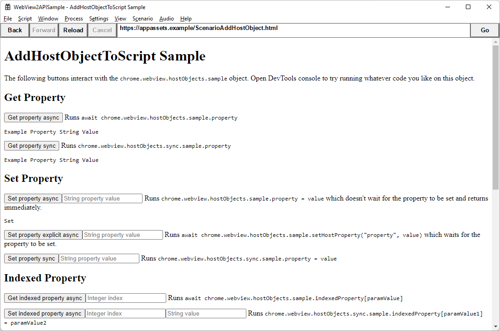
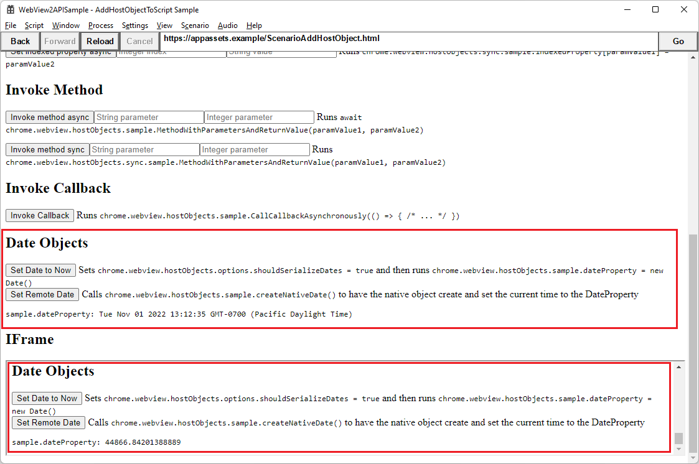

# Call native-side code from web-side code

WebView2 enables applications to bridge the gap between the web and native sides of an application by enabling an object to be passed to the web.  You expose selected native-side APIs to your webpage JavaScript through an intermediary native host object that's defined in the native code.  The native-side APIs are projected into JavaScript by using the WebView2 `AddHostObjectToScript` API.

<!--
##### [.NET](#tab/dotnet)

* [CoreWebView2.AddHostObjectToScript Method](/dotnet/api/microsoft.web.webview2.core.corewebview2.addhostobjecttoscript)
-->

##### [Win32](#tab/win32)

* [ICoreWebView2::AddHostObjectToScript method](/microsoft-edge/webview2/reference/win32/icorewebview2#addhostobjecttoscript)

##### [.NET in a frame](#tab/dotnetframe)

* [CoreWebView2Frame.AddHostObjectToScript](/dotnet/api/microsoft.web.webview2.core.corewebview2frame.addhostobjecttoscript)

##### [Win32 in a frame](#tab/win32frame)

* [ICoreWebView2Frame::AddHostObjectToScriptWithOrigins method](/microsoft-edge/webview2/reference/win32/icorewebview2frame#addhostobjecttoscriptwithorigins)

---

This article mainly covers Win32/C++, and also covers some aspects of .NET/C# within frames.  For WinRT, see [Call native-side WinRT code from web-side code](./winrt-from-js.md).


#### Why use `AddHostObjectToScript`?

  * When developing a WebView2 app, you may encounter a native object whose methods or properties you find useful. You might want to trigger these native object methods from web-side code, as a result of user interaction on the web side of your app. In addition, you might not want to re-implement your native objects' methods in your web-side code.  The `AddHostObjectToScript` API enables re-use of native-side code by web-side code. 

  * For example, there might be a native webcam API, which would require re-writing a large amount of code on the web side. Having the ability to call the native object's methods is quicker and more efficient than re-coding the object's methods on the web side of your app. In this case, your native-side code can pass the object to your app's web-side, JavaScript code, so that your JavaScript code can reuse the native API's methods.

Scenarios that may benefit from using host objects in script:

  * There is a keyboard API, and you want to call the `keyboardObject.showKeyboard` function from the web side.

  * Accessing the file system, not just the webpage sandbox, via JavaScript.  JavaScript is sandboxed, which prevents it from directly accessing the file system.  By using `AddHostObjectToScript` to create a native object that's exposed to JavaScript, you can use the host object to manipulate files on the file system, not just in the webpage sandbox.

This article uses the [Win32 sample app](https://github.com/MicrosoftEdge/WebView2Samples/tree/main/SampleApps/WebView2APISample) to demonstrate some practical applications of `AddHostObjectToScript`.


<!-- ====================================================================== -->
## Step 1: Install Visual Studio, install git, clone the WebView2Samples repo, and open the solution

1.  Download and install [Microsoft Visual Studio](https://visualstudio.microsoft.com/) 2019 (version 16.11.10) or later, and other prerequisites as described in [Win32 sample app](../samples/webview2apissample.md).  The Win32 sample app was created using Visual Studio 2019, so to follow the example steps in this article, we recommend starting with Visual Studio 2019 rather than Visual Studio 2022.

1.  Clone the [WebView2Samples](https://github.com/MicrosoftEdge/WebView2Samples) repo.  The repo includes the Win32-specific WebView2 sample app.  For instructions, in a new window or tab, see [Win32 sample app](../samples/webview2apissample.md).

1.  Open Microsoft Visual Studio.  We recommend initially opening the Win32 sample by using Visual Studio 2019.

1.  In your local copy of the cloned `WebView2Samples` repo, open `WebView2Samples` > `SampleApps` > [WebView2Samples.sln](https://github.com/MicrosoftEdge/WebView2Samples/blob/main/SampleApps/WebView2Samples.sln).  `WebView2Samples.sln` includes the `WebView2APISample` project, which is the Win32 sample app.  Keep the sample app solution open, to follow along with the rest of this article.


<!-- ====================================================================== -->
## Step 2: Define the host object's COM interface using IDL

Define the host object's COM interface in an `.idl` file, like [HostObjectSample.idl](https://github.com/MicrosoftEdge/WebView2Samples/blob/main/SampleApps/WebView2APISample/HostObjectSample.idl), to describe the methods and properties on the host object.

First, use interface definition language (IDL) to define the host object's COM interface.  This host object definition in an `idl` file describes the exposed (or "wrapped") native-side properties and methods.  The IDL (`.idl`) file *defines* an interface, but doesn't implement it.

1.  In Visual Studio **Solution Explorer**, expand **WebView2APISample** > **Source Files**, and then double-click `HostObjectSample.idl` to open it.

    The following code defines the `IHostObjectSample` interface, which inherits `IUnknown` as is standard for COM.  Use this `IHostObjectSample` definition as a template for defining your object's methods, properties, callback functions, and so on.

    ```csharp
    import "oaidl.idl";
    import "ocidl.idl";
    
    [uuid(0a7a4655-5660-47d0-8a37-98ae21399e57), version(0.1)]
    library HostObjectSampleLibrary
    {
        [uuid(3a14c9c0-bc3e-453f-a314-4ce4a0ec81d8), object, local]
        interface IHostObjectSample : IUnknown
        {
            // Demonstrates a basic method call with some parameters and a return value.
            HRESULT MethodWithParametersAndReturnValue([in] BSTR stringParameter, [in] INT integerParameter, [out, retval] BSTR* stringResult);
    
            // Demonstrate getting and setting a property.
            [propget] HRESULT Property([out, retval] BSTR* stringResult);
            [propput] HRESULT Property([in] BSTR stringValue);
    
            [propget] HRESULT IndexedProperty(INT index, [out, retval] BSTR * stringResult);
            [propput] HRESULT IndexedProperty(INT index, [in] BSTR stringValue);
    
            // Demonstrate native calling back into JavaScript.
            HRESULT CallCallbackAsynchronously([in] IDispatch* callbackParameter);
    
            // Demonstrates a property which uses Date types.
            [propget] HRESULT DateProperty([out, retval] DATE * dateResult);
            [propput] HRESULT DateProperty([in] DATE dateValue);
    
            // Creates a date object on the native side and sets the DateProperty to it.
            HRESULT CreateNativeDate();
    
        };
    ```

1.  Above, note the `DateProperty`, which uses a `DATE` type.  We'll focus on this date demo property in this article.


<!-- ====================================================================== -->
## Step 3: Define a host object coclass

Next, the example defines the `HostObjectSample` coclass to include `IHostObjectSample` and `IDispatch`.

1.  In `HostObjectSample.idl`, examine the `HostObjectSample` [coclass](/windows/win32/midl/coclass) (component object class), which includes the `IHostObjectSample` and `IDispatch` interfaces:

    ```csharp
        [uuid(637abc45-11f7-4dde-84b4-317d62a638d3)]
        coclass HostObjectSample
        {
            [default] interface IHostObjectSample;
            interface IDispatch;
        };
    }
    ```

1.  The `HostObjectSample` coclass includes `interface IDispatch`, which is needed for the host object to work with `AddHostObjectToScript`.


<!-- ====================================================================== -->
## Step 4: Implement the members of the C++ object

In the Win32 sample app code, [HostObjectSampleImpl.cpp](https://github.com/MicrosoftEdge/WebView2Samples/blob/main/SampleApps/WebView2APISample/HostObjectSampleImpl.cpp) takes the skeleton that's created in the COM IDL file and implements each member of the C++ object.  This C++ (`.cpp`) file *implements* the defined interface (and also implements `IDispatch`).

Implement all the functions that are defined in your object's interface, as we outlined in the IDL file. Be sure to implement the functions that are required by `IDispatch`.  The compiler will throw an error if these functions aren't defined.

Next, we examine two specific properties that were defined in the IDL, to show how the IDL is related to the `.cpp` file.

1.  In Visual Studio **Solution Explorer**, expand **WebView2APISample** > **Source Files**, and then double-click **HostObjectSampleImpl.cpp** to open it.

1.  Examine the property *declarations* in [HostObjectSample.idl](https://github.com/MicrosoftEdge/WebView2Samples/blob/main/SampleApps/WebView2APISample/HostObjectSample.idl):
 
    ```csharp
    // Demonstrate getting and setting a property.
    [propget] HRESULT Property([out, retval] BSTR* stringResult);
    [propput] HRESULT Property([in] BSTR stringValue);
    ...
    // Demonstrate a property which uses Date types
    [propget] HRESULT DateProperty([out, retval] DATE * dateResult);
    [propput] HRESULT DateProperty([in] DATE dateValue);

    // Creates a date object on the native side and sets the DateProperty to it.
    HRESULT CreateNativeDate();
    ```

1.  Examine the *implementation* of the object's properties in [HostObjectSampleImpl.cpp](https://github.com/MicrosoftEdge/WebView2Samples/blob/main/SampleApps/WebView2APISample/HostObjectSampleImpl.cpp):

    ```cpp
    STDMETHODIMP HostObjectSample::get_Property(BSTR* stringResult)
    {
        *stringResult = SysAllocString(m_propertyValue.c_str());
        return S_OK;
    }
    
    STDMETHODIMP HostObjectSample::put_Property(BSTR stringValue)
    {
        m_propertyValue = stringValue;
        return S_OK;
    }
    ...

    STDMETHODIMP HostObjectSample::get_DateProperty(DATE* dateResult)
    {
        *dateResult = m_date;
        return S_OK;
    }
    
    STDMETHODIMP HostObjectSample::put_DateProperty(DATE dateValue)
    {
        m_date = dateValue;
        SYSTEMTIME systemTime;
        if (VariantTimeToSystemTime(dateValue, &systemTime))
    ...
    }
    
    STDMETHODIMP HostObjectSample::CreateNativeDate()
    {
        SYSTEMTIME systemTime;
        GetSystemTime(&systemTime);
        DATE date;
        if (SystemTimeToVariantTime(&systemTime, &date))
        {
            return put_DateProperty(date);
        }
        return E_UNEXPECTED;
    }
    ```

1.  Examine `DateProperty`, which we trace throughout this article.


<!-- ====================================================================== -->
## Step 5: Implement IDispatch

The host object must implement `IDispatch` so that WebView2 can project the native host object to the app's web-side code.

`IDispatch` allows you to dynamically invoke methods and properties. Normally, calling objects requires static invocations, but you can use JavaScript to dynamically create object calls.  In the Win32 sample app code, [HostObjectSampleImpl.cpp](https://github.com/MicrosoftEdge/WebView2Samples/blob/main/SampleApps/WebView2APISample/HostObjectSampleImpl.cpp) implements `IDispatch`, which means implementing these methods:
* `GetIDsOfNames`
* `GetTypeInfo`
* `GetTypeInfoCount`
* `Invoke`

Implement `IDispatch` as described in [Type Libraries and the Object Description Language](/previous-versions/windows/desktop/automat/type-libraries-and-the-object-description-language).  For more information about `IDispatch` inheritance and methods, see [IDispatch interface (oaidl.h)](/windows/win32/api/oaidl/nn-oaidl-idispatch). 

If the object you want to add to JavaScript doesn't already implement `IDispatch`, you need to write an `IDispatch` class wrapper for the object that you want to expose.

There might be libraries to do this automatically.  To learn more about the steps that are needed to write an `IDispatch` class wrapper for the object that you want to expose, see [Automation](/previous-versions/windows/desktop/automat/automation-programming-reference).
    
1.  Next, save any changes you made in the project.

1.  In Solution Explorer, right-click the **WebView2APISample** (which is the Win32 sample app), and then select **Build**.  This creates a COM type library `.tlb` file.  You need to reference the `.tlb` file from the C++ source code.  For more information, see [Type Library](/windows/win32/midl/com-dcom-and-type-libraries#type-library) in _COM, DCOM, and Type Libraries_.


<!-- ====================================================================== -->
## Step 6: Call AddHostObjectToScript to pass the host object to web-side code

So far, we've built our interface and implemented our native host object.  Now we're ready to use `AddHostObjectToScript` to pass the native host object to our app's web-side, JavaScript code.  The Win32 sample app calls `AddHostObjectToScript` in [ScenarioAddHostObject.cpp](https://github.com/MicrosoftEdge/WebView2Samples/blob/main/SampleApps/WebView2APISample/ScenarioAddHostObject.cpp), as shown below.


<!-- ----------------------------------- -->
<!--
##### [.NET](#tab/dotnet)

* [CoreWebView2.AddHostObjectToScript Method](/dotnet/api/microsoft.web.webview2.core.corewebview2.addhostobjecttoscript) - non-frame.
-->


<!-- ----------------------------------- -->

##### [Win32](#tab/win32)

1.  In Visual Studio **Solution Explorer**, open **WebView2APISample** > **Source Files** > [ScenarioAddHostObject.cpp](https://github.com/MicrosoftEdge/WebView2Samples/blob/main/SampleApps/WebView2APISample/ScenarioAddHostObject.cpp).

1.  Go to the `ScenarioAddHostObject` class implementation.  This class displays HTML and handles navigation:

    ```cpp
    ScenarioAddHostObject::ScenarioAddHostObject(AppWindow* appWindow)
        : m_appWindow(appWindow), m_webView(appWindow->GetWebView())
    {
        std::wstring sampleUri = m_appWindow->GetLocalUri(L"ScenarioAddHostObject.html");
    
        m_hostObject = Microsoft::WRL::Make<HostObjectSample>(
            [appWindow = m_appWindow](std::function<void(void)> callback)
        {
            appWindow->RunAsync(callback);
        });
    ```

1.  The `Make` statement shows how to instantiate the `HostObjectSample` COM object that was defined in the IDL file.  This is the object we will use later when we call `AddHostObjectToScript`.  The `Make` statement gets us a pointer to the interface that's implemented in [HostObjectSampleImpl.cpp](https://github.com/MicrosoftEdge/WebView2Samples/blob/main/SampleApps/WebView2APISample/HostObjectSampleImpl.cpp).

1.  Next, we add an event handler to listen for the `NavigationStarting` event:

    ```cpp
        CHECK_FAILURE(m_webView->add_NavigationStarting(
            Microsoft::WRL::Callback<ICoreWebView2NavigationStartingEventHandler>(
                [this, sampleUri](ICoreWebView2* sender, ICoreWebView2NavigationStartingEventArgs* args) -> HRESULT
        {
            wil::unique_cotaskmem_string navigationTargetUri;
            CHECK_FAILURE(args->get_Uri(&navigationTargetUri));
            std::wstring uriTarget(navigationTargetUri.get());
    ```

1.  In the `NavigationStarting` event handler, the `query_to` line (below) casts the newly created COM object to an `IDispatch` type and then converts the object to a `VARIANT`. `VARIANT` types allow you to use data structures such as integers and arrays as well as more complex types such as `IDispatch`. 

    For a full list of supported data types, see [VARIANT structure (oaidl.h)](/windows/win32/api/oaidl/ns-oaidl-variant).  Not all types in the `VARIANT` union are supported by `AddHostObjectToScript`.  For details, see [ICoreWebView2::AddHostObjectToScript method](/microsoft-edge/webview2/reference/win32/icorewebview2#addhostobjecttoscript).
    
    ```cpp
            if (AreFileUrisEqual(sampleUri, uriTarget))
            {
                VARIANT remoteObjectAsVariant = {};
                m_hostObject.query_to<IDispatch>(&remoteObjectAsVariant.pdispVal);
                remoteObjectAsVariant.vt = VT_DISPATCH;
    ```

    Now that we have a variant of the object that is C++ code-friendly, the sample app's native-side code is ready to pass the host object to the app's web-side code.

1.  In the bottom line above, the `NavigationStarting` event handler then sets the remote object's variant type as `IDispatch`.

    ```cpp
                // We can call AddHostObjectToScript multiple times in a row without
                // calling RemoveHostObject first. This will replace the previous object
                // with the new object. In our case this is the same object and everything
                // is fine.
                CHECK_FAILURE(
                    m_webView->AddHostObjectToScript(L"sample", &remoteObjectAsVariant));
                remoteObjectAsVariant.pdispVal->Release();
            }
    ```

1. Above, in the `NavigationStarting` event handler, the `VARIANT` is passed to `AddHostObjectToScript`, using the name `sample`.


<!-- ----------------------------------- -->

##### [.NET in a frame](#tab/dotnetframe)

To add the host object to an iframe, we'll use `CoreWebView2Frame.AddHostObjectToScript`, which takes an `origins` parameter.

<!-- copied from non-published sample-->

```csharp
webView.CoreWebView2.FrameCreated += (sender, args) =>
{
    if (args.Frame.Name.Equals("iframe_name"))
    {
        try
        {
            string[] origins = new string[] { "https://appassets.example" };
            args.Frame.AddHostObjectToScript("bridge", new BridgeAddRemoteObject(), origins);
        }
        catch (NotSupportedException exception)
        {
            MessageBox.Show("Frame.AddHostObjectToScript failed: " + exception.Message);
        }
    }
    args.Frame.NameChanged += (nameChangedSender, nameChangedArgs) =>
    {
        CoreWebView2Frame frame = (CoreWebView2Frame)nameChangedSender;
        MessageBox.Show("Frame.NameChanged: " + frame.Name);
    };
    args.Frame.Destroyed += (frameDestroyedSender, frameDestroyedArgs) =>
    {
        // Handle frame destroyed
    };
};
```

##### [Win32 in a frame](#tab/win32frame)

To add the host object to an iframe, we'll use `ICoreWebView2Frame::AddHostObjectToScriptWithOrigins`.

This Win32/C++ sample code is condensed from [ScenarioAddHostObject.cpp](https://github.com/MicrosoftEdge/WebView2Samples/blob/main/SampleApps/WebView2APISample/ScenarioAddHostObject.cpp#L83-L133) in the **WebView2APISample** project (which is the Win32 sample app).

This sample code demonstrates these APIs:
* `ICoreWebView2Frame::AddHostObjectToScriptWithOrigins` 
* `ICoreWebView2FrameCreatedEventHandler`
   * `ICoreWebView2FrameCreatedEventArgs::get_Frame`

```cpp
CHECK_FAILURE(webview2_4->add_FrameCreated(
    Callback<ICoreWebView2FrameCreatedEventHandler>(
        [this](
            ICoreWebView2* sender,
            ICoreWebView2FrameCreatedEventArgs* args) -> HRESULT
{
    wil::com_ptr<ICoreWebView2Frame> webviewFrame;
    CHECK_FAILURE(args->get_Frame(&webviewFrame));

    wil::unique_cotaskmem_string name;
    CHECK_FAILURE(webviewFrame->get_Name(&name));
    if (std::wcscmp(name.get(), L"iframe_name") == 0)
    {
        wil::unique_variant remoteObjectAsVariant;
        // It will throw if m_hostObject fails the QI, but because it is our object
        // it should always succeed.
        m_hostObject.query_to<IDispatch>(&remoteObjectAsVariant.pdispVal);
        remoteObjectAsVariant.vt = VT_DISPATCH;

        // Create list of origins which will be checked.
        // iframe will have access to host object only if its origin belongs
        // to this list.
        LPCWSTR origin = L"https://appassets.example/";

        CHECK_FAILURE(webviewFrame->AddHostObjectToScriptWithOrigins(
            L"sample", &remoteObjectAsVariant, 1, &origin));
    }

    return S_OK;
}).Get(), &m_frameCreatedToken));
```

---


<!-- ====================================================================== -->
## Step 7: Access host object members from webpage JavaScript

In the above steps, the sample app's native-side code created a host object that implements `IDispatch`.  This native code also calls the WebView2 API `ICoreWebView2::AddHostObjectToScript` or `ICoreWebView2Frame::AddHostObjectToScriptWithOrigins` and passes the host object to the app's web-side code.

Now the app's web-side code can access the native-side APIs which are exposed by the host object.  JavaScript statements in your `.html` webpage `script` element or in a referenced `.js` JavaScript file can access the exported native-side APIs.

The web-side code of the Win32 sample app is now able to access the properties and methods of the native host object, to access the native APIs.  We'll use the sample app's webpage controls, in the **Scenario** > **Host Objects** webpage of the app, to demonstrate this.

1.  In Microsoft Visual Studio, select **File** > **Save All** (**Ctrl+Shift+S**) to save the project.

1.  In Solution Explorer, open **WebView2APISample** > [ScenarioAddHostObject.html](https://github.com/MicrosoftEdge/WebView2Samples/blob/main/SampleApps/WebView2APISample/assets/ScenarioAddHostObject.html).  We'll compare this file to the corresponding webpage in the running Win32 sample app.

1.  In Solution Explorer, right-click the **WebView2APISample** (which is the Win32 sample app), and then select **Build**.

1.  Press **F5** to run the project in Debug mode.

1.  In the Win32 sample app (which has the titlebar of **WebView2APISample**), click the **Scenario** menu, and then select the **Host Objects** menuitem.  The **AddHostObjectToScript Sample** webpage appears, defined by `ScenarioAddHostObject.html`:

    

1.  The webpage suggests using the **Console** tool of DevTools to run JavaScript statements on the `chrome.webview.hostObjects.sample` object.  If you want to open DevTools from the sample app, right-click the page and then select **Inspect**.  Then select the **Console** tab.  For more information, see [Console overview](../../devtools-guide-chromium/console/index.md).

    To open DevTools, pressing **F12** might not work in this context, and might trigger an exception.  If so, in Visual Studio, select **Stop Debugging**, and then press **F5** to restart debugging.  In the sample app, select **Scenario** > **Host Objects** again.  For more information, see [Open DevTools using an approach other than F12](./debug-visual-studio.md#open-devtools-using-an-approach-other-than-f12) in _Debug WebView2 apps with Visual Studio_.

    The bottom of the Host Objects demo page duplicates the demo object members within an `<iframe>`:
    <!-- todo: explain apparent dup'n -->

    

1.  In the rendered demo page in the sample app, read the label text explaining the **Date** buttons.

1.  Click the **Date** buttons.  A date string is displayed below the buttons, such as:

    ```
    sample.dateProperty: Tue Nov 01 2022 12:45:25 GMT-0700 (Pacific Daylight Time)
    ```
    
1.  Explore properties and methods by clicking the buttons in the demo webpage and entering values, to see how the sample code behaves.  The buttons demonstrate accessing properties and methods of the host object from the app's web-side code.

1.  To gain insight into what's happening in JavaScript, examine the following code in [ScenarioAddHostObject.html](https://github.com/MicrosoftEdge/WebView2Samples/blob/main/SampleApps/WebView2APISample/assets/ScenarioAddHostObject.html).

    The following code is a demo `Date` property, directly within the `body` element:

    ```javascript
    <h2>Date Objects</h2>
    <button id="setDateButton">Set Date to Now</button>
    <label for="setDateButton">Sets <code>chrome.webview.hostObjects.options.shouldSerializeDates = true</code> 
        and then runs <code>chrome.webview.hostObjects.sample.dateProperty = new Date()</code></label>
    <br />
    <button id="createRemoteDateButton">Set Remote Date</button>
    <label for="createRemoteDateButton">Calls <code>chrome.webview.hostObjects.sample.createNativeDate()</code> 
        to have the native object create and set the current time to the DateProperty</label>
    <code><pre><span id="dateOutput"></span></pre></code>
    
    <div id="div_iframe" style="display: none;">
        <h2>IFrame</h2>
    </div>
    ```

    You can also read the above label text in the rendered demo page in the sample app, explaining the **Date** button code.

1.  The following code is a demo `Date` property that's wrapped in an `iframe` element that's created within a `script` element:
    <!-- todo: relate to the above code, why do the buttons appear dup'd in frame -->

    ```javascript
    // Date property 
    document.getElementById("setDateButton").addEventListener("click", () => { 
        chrome.webview.hostObjects.options.shouldSerializeDates = true; 
        chrome.webview.hostObjects.sync.sample.dateProperty = new Date(); 
        document.getElementById("dateOutput").textContent = 
            "sample.dateProperty: " + chrome.webview.hostObjects.sync.sample.dateProperty;
    }); 
    document.getElementById("createRemoteDateButton").addEventListener("click", () => { 
        chrome.webview.hostObjects.sync.sample.createNativeDate(); 
        document.getElementById("dateOutput").textContent = 
            "sample.dateProperty: " + chrome.webview.hostObjects.sync.sample.dateProperty; 
    });
    ```

1.  The expression `chrome.webview.hostObjects.sync.sample.dateProperty` is the `dateProperty` of the native host object.

    In the `.idl` file [HostObjectSample.idl](https://github.com/MicrosoftEdge/WebView2Samples/blob/main/SampleApps/WebView2APISample/HostObjectSample.idl), described previously, the date property is defined as part of the host object.


#### Using the sample app

You can experiment with using and modifying the Win32 sample app.  Then follow the same pattern in your own app:

1.  Create a host object in your app's native-side code.
1.  Pass the host object to your app's web-side code.
1.  Use the host object from the app's web-side code.

To find out what other APIs there are in the host object ecosystem, see [WebView2 Win32 C++ ICoreWebView2](/microsoft-edge/webview2/reference/win32/icorewebview2#addhostobjecttoscript).


<!-- ====================================================================== -->
## API Reference overview

See [Host/web object sharing](../concepts/overview-features-apis.md#hostweb-object-sharing) in _Overview of WebView2 features and APIs_.


<!-- ====================================================================== -->
## See also

* [Web/native interop](../concepts/overview-features-apis.md#webnative-interop) in _Overview of WebView2 features and APIs_.
* [Using frames in WebView2 apps](../concepts/frames.md)
* [Call native-side WinRT code from web-side code](./winrt-from-js.md)

GitHub:
* [Win32 sample app (WebView2APISample project)](https://github.com/MicrosoftEdge/WebView2Samples/tree/main/SampleApps/WebView2APISample)
   * [HostObjectSample.idl](https://github.com/MicrosoftEdge/WebView2Samples/blob/main/SampleApps/WebView2APISample/HostObjectSample.idl)
   * [HostObjectSampleImpl.cpp](https://github.com/MicrosoftEdge/WebView2Samples/blob/main/SampleApps/WebView2APISample/HostObjectSampleImpl.cpp)
   * [ScenarioAddHostObject.html](https://github.com/MicrosoftEdge/WebView2Samples/blob/main/SampleApps/WebView2APISample/assets/ScenarioAddHostObject.html)
   * [ScenarioAddHostObject.cpp](https://github.com/MicrosoftEdge/WebView2Samples/blob/main/SampleApps/WebView2APISample/ScenarioAddHostObject.cpp)
